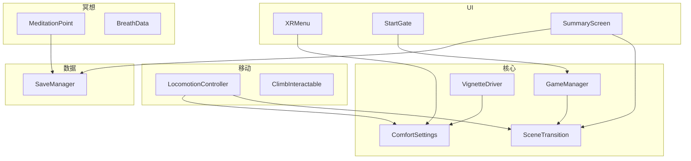
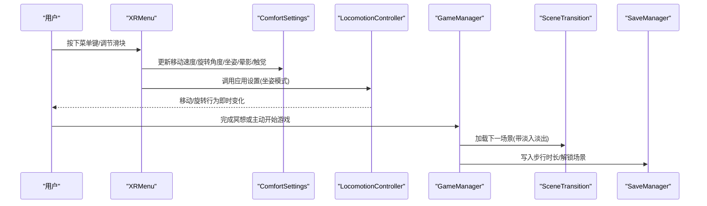
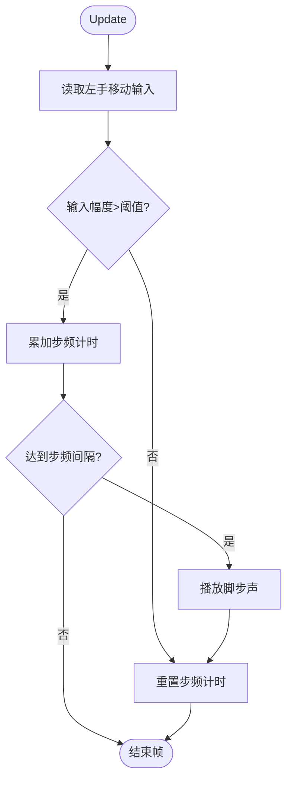
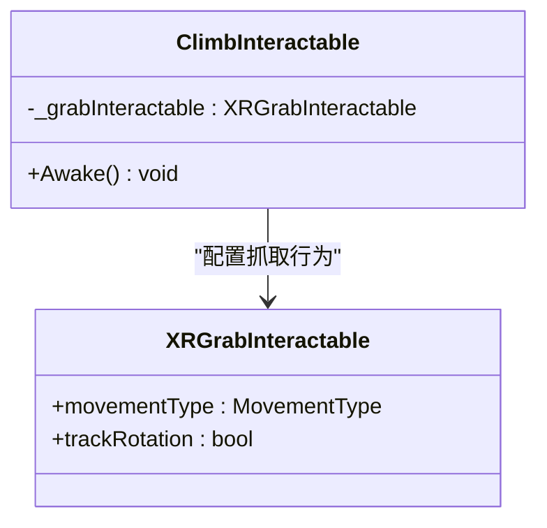
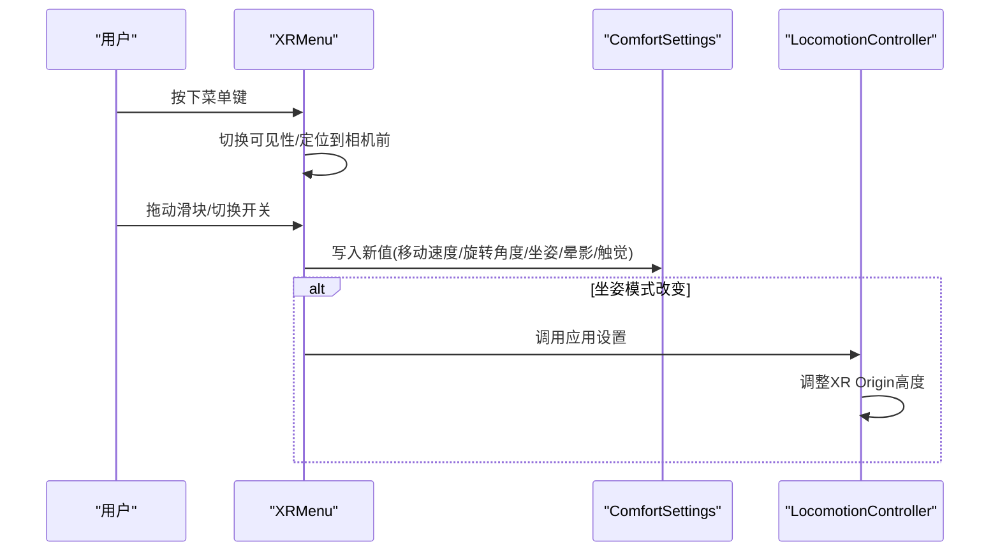
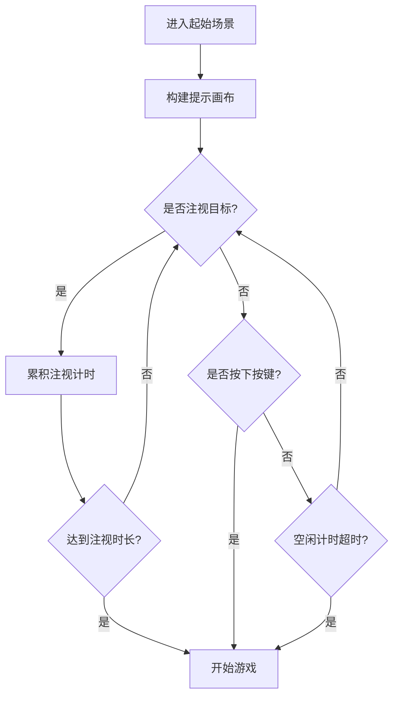
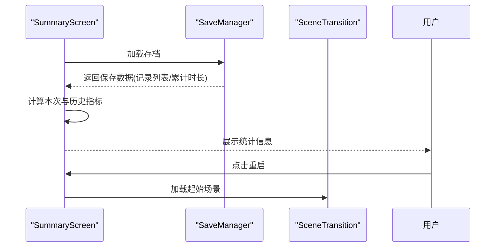
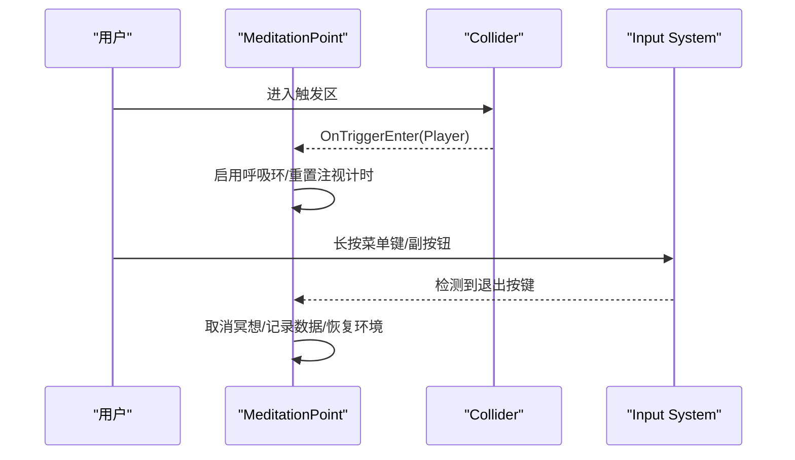
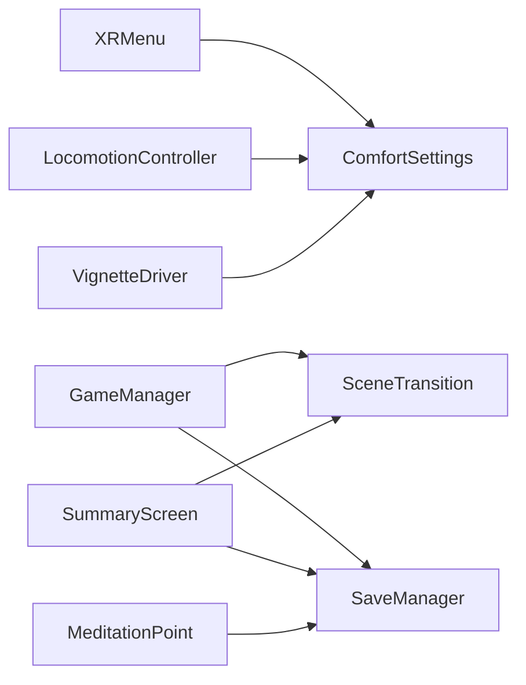

# VR交互系统

<cite>
**本文引用的文件**
- [LocomotionController.cs](file://Assets/Scripts/Movement/LocomotionController.cs)
- [ClimbInteractable.cs](file://Assets/Scripts/Movement/ClimbInteractable.cs)
- [ComfortSettings.cs](file://Assets/Scripts/Core/ComfortSettings.cs)
- [XRMenu.cs](file://Assets/Scripts/UI/XRMenu.cs)
- [StartGate.cs](file://Assets/Scripts/UI/StartGate.cs)
- [SummaryScreen.cs](file://Assets/Scripts/UI/SummaryScreen.cs)
- [GameManager.cs](file://Assets/Scripts/Core/GameManager.cs)
- [SaveManager.cs](file://Assets/Scripts/Data/SaveManager.cs)
- [BreathData.cs](file://Assets/Scripts/Meditation/BreathData.cs)
- [SceneTransition.cs](file://Assets/Scripts/Core/SceneTransition.cs)
- [MeditationPoint.cs](file://Assets/Scripts/Meditation/MeditationPoint.cs)
- [VignetteDriver.cs](file://Assets/Scripts/Core/VignetteDriver.cs)
</cite>

## 目录
1. [简介](#简介)
2. [项目结构](#项目结构)
3. [核心组件](#核心组件)
4. [架构总览](#架构总览)
5. [详细组件分析](#详细组件分析)
6. [依赖关系分析](#依赖关系分析)
7. [性能考量](#性能考量)
8. [故障排查指南](#故障排查指南)
9. [结论](#结论)
10. [附录：扩展开发指南](#附录扩展开发指南)

## 简介
本技术文档面向InkRidge的VR交互系统，聚焦以下关键能力与实现细节：
- LocomotionController的平滑移动与旋转控制机制，以及舒适度设置对体验的影响
- ClimbInteractable的抓取物理与攀爬逻辑
- VR菜单系统的用户界面交互与设置面板功能
- 启动门控系统的场景进入条件与用户引导流程
- 统计摘要屏幕的数据展示与用户反馈机制
- XR控制器输入处理、手势识别与碰撞检测的实现要点
- 自定义交互行为的扩展开发建议

## 项目结构
本项目采用按功能域划分的脚本组织方式：
- Movement：移动与攀爬交互（平滑移动、旋转、抓取）
- Core：全局状态、场景过渡、晕动效果驱动、舒适度配置
- UI：VR内菜单、启动门、统计摘要
- Meditation：冥想触发点、呼吸数据模型
- Data：本地持久化（JSON）

图表来源
- [LocomotionController.cs:1-72](file://Assets/Scripts/Movement/LocomotionController.cs#L1-L72)
- [ClimbInteractable.cs:1-25](file://Assets/Scripts/Movement/ClimbInteractable.cs#L1-L25)
- [ComfortSettings.cs:1-81](file://Assets/Scripts/Core/ComfortSettings.cs#L1-L81)
- [XRMenu.cs:1-172](file://Assets/Scripts/UI/XRMenu.cs#L1-L172)
- [StartGate.cs:1-191](file://Assets/Scripts/UI/StartGate.cs#L1-L191)
- [SummaryScreen.cs:1-72](file://Assets/Scripts/UI/SummaryScreen.cs#L1-L72)
- [GameManager.cs:1-66](file://Assets/Scripts/Core/GameManager.cs#L1-L66)
- [SaveManager.cs:1-118](file://Assets/Scripts/Data/SaveManager.cs#L1-L118)
- [BreathData.cs:1-45](file://Assets/Scripts/Meditation/BreathData.cs#L1-L45)
- [SceneTransition.cs:1-61](file://Assets/Scripts/Core/SceneTransition.cs#L1-L61)
- [MeditationPoint.cs:1-346](file://Assets/Scripts/Meditation/MeditationPoint.cs#L1-L346)
- [VignetteDriver.cs:1-62](file://Assets/Scripts/Core/VignetteDriver.cs#L1-L62)

章节来源
- [LocomotionController.cs:1-72](file://Assets/Scripts/Movement/LocomotionController.cs#L1-L72)
- [XRMenu.cs:1-172](file://Assets/Scripts/UI/XRMenu.cs#L1-L172)
- [StartGate.cs:1-191](file://Assets/Scripts/UI/StartGate.cs#L1-L191)
- [SummaryScreen.cs:1-72](file://Assets/Scripts/UI/SummaryScreen.cs#L1-L72)
- [ComfortSettings.cs:1-81](file://Assets/Scripts/Core/ComfortSettings.cs#L1-L81)
- [GameManager.cs:1-66](file://Assets/Scripts/Core/GameManager.cs#L1-L66)
- [SaveManager.cs:1-118](file://Assets/Scripts/Data/SaveManager.cs#L1-L118)
- [SceneTransition.cs:1-61](file://Assets/Scripts/Core/SceneTransition.cs#L1-L61)
- [MeditationPoint.cs:1-346](file://Assets/Scripts/Meditation/MeditationPoint.cs#L1-L346)
- [VignetteDriver.cs:1-62](file://Assets/Scripts/Core/VignetteDriver.cs#L1-L62)

## 核心组件
- 移动控制器：通过连续移动提供者与点击旋转提供者组合，配合舒适度设置实现平滑移动与角度步进旋转；同时根据移动输入播放脚步声。
- 攀爬可交互：将抓取对象配置为速度跟踪模式并关闭旋转追踪，配合XRIT内置攀爬提供器实现“拉拽即前进”的攀爬手感。
- 舒适度设置：集中管理移动速度、旋转角度、晕影开关、坐姿模式、触觉反馈等，并通过PlayerPrefs持久化。
- VR菜单：世界空间画布跟随玩家朝向，支持滑块与开关实时调整舒适度设置，并通过控制器按钮切换可见性。
- 启动门：在起始场景以注视+按键双通道引导进入游戏，含自动开始倒计时与进度条提示。
- 统计摘要：读取本地保存的冥想记录与累计时长，计算本次与历史指标，并提供重启入口。
- 场景过渡：黑场淡入淡出异步加载场景。
- 冥想触发：基于触发区与注视确认启动呼吸引导，支持提前退出与多模态反馈（粒子、音频、触觉、环境混响）。

章节来源
- [LocomotionController.cs:1-72](file://Assets/Scripts/Movement/LocomotionController.cs#L1-L72)
- [ClimbInteractable.cs:1-25](file://Assets/Scripts/Movement/ClimbInteractable.cs#L1-L25)
- [ComfortSettings.cs:1-81](file://Assets/Scripts/Core/ComfortSettings.cs#L1-L81)
- [XRMenu.cs:1-172](file://Assets/Scripts/UI/XRMenu.cs#L1-L172)
- [StartGate.cs:1-191](file://Assets/Scripts/UI/StartGate.cs#L1-L191)
- [SummaryScreen.cs:1-72](file://Assets/Scripts/UI/SummaryScreen.cs#L1-L72)
- [SceneTransition.cs:1-61](file://Assets/Scripts/Core/SceneTransition.cs#L1-L61)
- [MeditationPoint.cs:1-346](file://Assets/Scripts/Meditation/MeditationPoint.cs#L1-L346)

## 架构总览
下图展示了从用户输入到移动、交互、场景流转与数据记录的端到端链路。

图表来源
- [XRMenu.cs:80-172](file://Assets/Scripts/UI/XRMenu.cs#L80-L172)
- [ComfortSettings.cs:37-78](file://Assets/Scripts/Core/ComfortSettings.cs#L37-L78)
- [LocomotionController.cs:26-48](file://Assets/Scripts/Movement/LocomotionController.cs#L26-L48)
- [GameManager.cs:39-63](file://Assets/Scripts/Core/GameManager.cs#L39-L63)
- [SceneTransition.cs:30-44](file://Assets/Scripts/Core/SceneTransition.cs#L30-L44)
- [SaveManager.cs:59-88](file://Assets/Scripts/Data/SaveManager.cs#L59-L88)

## 详细组件分析

### 移动控制器：平滑移动与旋转控制
- 平滑移动：通过连续移动提供者读取左手摇杆输入，结合舒适度中的移动速度参数控制位移速率；当检测到有效移动时周期性播放脚步声，步频由间隔时间控制。
- 旋转控制：使用点击旋转提供者，将舒适度中的旋转角度作为每次旋转的步进量，保证不同偏好下的舒适体验。
- 坐姿模式：根据舒适度设置动态调整XR Origin高度，避免站立/坐姿视角不一致导致的眩晕。
- 舒适度联动：所有移动与旋转参数均来源于统一配置，便于运行时修改与跨场景一致。

图表来源
- [LocomotionController.cs:50-69](file://Assets/Scripts/Movement/LocomotionController.cs#L50-L69)
- [ComfortSettings.cs:37-47](file://Assets/Scripts/Core/ComfortSettings.cs#L37-L47)

章节来源
- [LocomotionController.cs:1-72](file://Assets/Scripts/Movement/LocomotionController.cs#L1-L72)
- [ComfortSettings.cs:1-81](file://Assets/Scripts/Core/ComfortSettings.cs#L1-L81)

### 攀爬可交互：抓取物理与攀爬逻辑
- 抓取模式：将抓取对象的运动类型设置为速度跟踪，使抓握时的手部位移直接映射为角色位移，形成“拉拽即前进”的自然攀爬感。
- 旋转策略：关闭旋转追踪，避免抓取过程中因手柄旋转导致的不稳定。
- 与攀爬提供器：该组件配合XRIT内置攀爬提供器工作，无需额外编写复杂物理约束即可实现稳定的攀爬体验。

图表来源
- [ClimbInteractable.cs:12-22](file://Assets/Scripts/Movement/ClimbInteractable.cs#L12-L22)

章节来源
- [ClimbInteractable.cs:1-25](file://Assets/Scripts/Movement/ClimbInteractable.cs#L1-L25)

### VR菜单系统：用户界面与设置面板
- 显示与定位：世界空间Canvas，打开时位于相机前方固定距离并面向玩家，确保可读性与一致性。
- 输入与切换：通过控制器菜单键或副按钮进行边缘检测式切换，避免持续按住导致频繁翻转。
- 设置项：移动速度、旋转角度、晕影开关、坐姿模式、触觉反馈；变更时实时更新标签与底层配置，部分设置立即生效（如坐姿模式会重新应用移动控制器设置）。
- 兼容性说明：由于项目仅使用Input System，需确保控制器具备射线交互与TrackedDeviceGraphicRaycaster才能完整操作滑块与开关。

图表来源
- [XRMenu.cs:41-172](file://Assets/Scripts/UI/XRMenu.cs#L41-L172)
- [ComfortSettings.cs:55-78](file://Assets/Scripts/Core/ComfortSettings.cs#L55-L78)
- [LocomotionController.cs:31-48](file://Assets/Scripts/Movement/LocomotionController.cs#L31-L48)

章节来源
- [XRMenu.cs:1-172](file://Assets/Scripts/UI/XRMenu.cs#L1-L172)
- [ComfortSettings.cs:1-81](file://Assets/Scripts/Core/ComfortSettings.cs#L1-L81)
- [LocomotionController.cs:1-72](file://Assets/Scripts/Movement/LocomotionController.cs#L1-L72)

### 启动门控系统：场景进入条件与用户引导
- 引导方式：注视目标（石碑）一定时长或按下任意控制器按键均可开始；支持空闲自动开始，降低新手门槛。
- 视觉反馈：运行时构建世界空间画布，包含背景、标题与进度条；注视期间进度条随时间填充，提升可感知性。
- 输入兼容：仅使用Input System，通过Gamepad或控制器按键检测触发；避免旧版Input API不触发的陷阱。
- 流程衔接：确认后调用全局管理器开始游戏并切换到首个场景。

图表来源
- [StartGate.cs:34-109](file://Assets/Scripts/UI/StartGate.cs#L34-L109)
- [StartGate.cs:111-188](file://Assets/Scripts/UI/StartGate.cs#L111-L188)
- [GameManager.cs:51-55](file://Assets/Scripts/Core/GameManager.cs#L51-L55)

章节来源
- [StartGate.cs:1-191](file://Assets/Scripts/UI/StartGate.cs#L1-L191)
- [GameManager.cs:1-66](file://Assets/Scripts/Core/GameManager.cs#L1-L66)

### 统计摘要屏幕：数据展示与用户反馈
- 数据来源：从本地保存中读取最近多次冥想记录，计算本次冥想时长、呼吸循环次数、节奏稳定度；同时汇总累计会话数、累计步行/冥想时长。
- 展示格式：时间以“分秒”格式化输出；稳定度以百分比呈现，便于用户理解。
- 交互反馈：提供重启按钮，返回起始场景，便于再次体验。

图表来源
- [SummaryScreen.cs:25-69](file://Assets/Scripts/UI/SummaryScreen.cs#L25-L69)
- [SaveManager.cs:29-88](file://Assets/Scripts/Data/SaveManager.cs#L29-L88)
- [SceneTransition.cs:30-44](file://Assets/Scripts/Core/SceneTransition.cs#L30-L44)

章节来源
- [SummaryScreen.cs:1-72](file://Assets/Scripts/UI/SummaryScreen.cs#L1-L72)
- [SaveManager.cs:1-118](file://Assets/Scripts/Data/SaveManager.cs#L1-L118)
- [SceneTransition.cs:1-61](file://Assets/Scripts/Core/SceneTransition.cs#L1-L61)

### XR控制器输入处理、手势识别与碰撞检测
- 控制器输入：统一通过Input System的XRController获取菜单键与副按钮状态，采用边缘检测避免重复触发；在启动门中亦兼容Gamepad按键。
- 手势识别：抓取交互通过XRGrabInteractable实现，攀爬时将运动类型设为速度跟踪，关闭旋转追踪以获得稳定抓取体验。
- 碰撞检测：冥想触发点使用触发区与Tag判断进入/离开，结合注视确认与按键退出实现完整的交互生命周期。

图表来源
- [MeditationPoint.cs:187-211](file://Assets/Scripts/Meditation/MeditationPoint.cs#L187-L211)
- [MeditationPoint.cs:168-185](file://Assets/Scripts/Meditation/MeditationPoint.cs#L168-L185)
- [ClimbInteractable.cs:17-22](file://Assets/Scripts/Movement/ClimbInteractable.cs#L17-L22)

章节来源
- [MeditationPoint.cs:1-346](file://Assets/Scripts/Meditation/MeditationPoint.cs#L1-L346)
- [ClimbInteractable.cs:1-25](file://Assets/Scripts/Movement/ClimbInteractable.cs#L1-L25)

## 依赖关系分析
- 模块耦合：
  - XRMenu与ComfortSettings强耦合，负责UI到配置的桥接
  - LocomotionController依赖ComfortSettings与XRIT提供者，负责移动与旋转
  - GameManager协调场景流与步行时长统计，依赖SceneTransition与SaveManager
  - SummaryScreen依赖SaveManager与SceneTransition，负责数据展示与重启
  - MeditationPoint依赖BreathGuide、SaveManager、AmbientAudio等，负责冥想流程
- 外部依赖：
  - Unity XR Interaction Toolkit（移动、抓取、旋转）
  - Input System（控制器输入）
  - PlayerPrefs（舒适度设置持久化）
  - JSON序列化（存档读写）

图表来源
- [XRMenu.cs:120-172](file://Assets/Scripts/UI/XRMenu.cs#L120-L172)
- [ComfortSettings.cs:37-78](file://Assets/Scripts/Core/ComfortSettings.cs#L37-L78)
- [GameManager.cs:39-63](file://Assets/Scripts/Core/GameManager.cs#L39-L63)
- [SaveManager.cs:59-88](file://Assets/Scripts/Data/SaveManager.cs#L59-L88)
- [SummaryScreen.cs:25-69](file://Assets/Scripts/UI/SummaryScreen.cs#L25-L69)
- [MeditationPoint.cs:264-341](file://Assets/Scripts/Meditation/MeditationPoint.cs#L264-L341)
- [VignetteDriver.cs:42-59](file://Assets/Scripts/Core/VignetteDriver.cs#L42-L59)

章节来源
- [XRMenu.cs:1-172](file://Assets/Scripts/UI/XRMenu.cs#L1-L172)
- [ComfortSettings.cs:1-81](file://Assets/Scripts/Core/ComfortSettings.cs#L1-L81)
- [GameManager.cs:1-66](file://Assets/Scripts/Core/GameManager.cs#L1-L66)
- [SaveManager.cs:1-118](file://Assets/Scripts/Data/SaveManager.cs#L1-L118)
- [SummaryScreen.cs:1-72](file://Assets/Scripts/UI/SummaryScreen.cs#L1-L72)
- [MeditationPoint.cs:1-346](file://Assets/Scripts/Meditation/MeditationPoint.cs#L1-L346)
- [VignetteDriver.cs:1-62](file://Assets/Scripts/Core/VignetteDriver.cs#L1-L62)

## 性能考量
- 移动音效节流：脚步声播放按固定间隔触发，避免每帧播放造成音频开销。
- 材质访问优化：冥想环材质实例缓存，避免每帧重复读取material带来的开销。
- 晕影渲染开关：VignetteDriver仅在需要时启用效果，减少全屏Blit开销。
- 存档IO：SaveManager在写盘前后进行异常捕获，避免崩溃；频繁写入已按需合并（如每次冥想结束后追加记录）。

[本节为通用性能建议，不直接分析具体代码行]

## 故障排查指南
- 菜单不可用：若场景中未为控制器添加射线交互器或未为画布添加TrackedDeviceGraphicRaycaster，则无法交互滑块与开关。需在对应场景补齐。
- 启动门无响应：项目仅使用Input System，旧版Input.GetKeyDown不会触发；请确保使用控制器按键或Gamepad按键检测。
- 移动/旋转无效：检查ComfortSettings的值是否正确设置，并确保LocomotionController已调用应用设置（尤其在切换坐姿模式后）。
- 晕影不生效：确认VignetteDriver已挂载且检测到移动；若未启用，检查移动阈值与相机位置变化。
- 存档丢失：Quest后台杀进程可能导致PlayerPrefs未及时落盘；当前实现已在每个setter中强制保存，若仍异常，检查是否有异常被吞掉。

章节来源
- [XRMenu.cs:10-22](file://Assets/Scripts/UI/XRMenu.cs#L10-L22)
- [StartGate.cs:66-87](file://Assets/Scripts/UI/StartGate.cs#L66-L87)
- [ComfortSettings.cs:22-35](file://Assets/Scripts/Core/ComfortSettings.cs#L22-L35)
- [VignetteDriver.cs:9-20](file://Assets/Scripts/Core/VignetteDriver.cs#L9-L20)
- [SaveManager.cs:29-57](file://Assets/Scripts/Data/SaveManager.cs#L29-L57)

## 结论
InkRidge的VR交互系统以舒适度为中心，通过统一的ComfortSettings串联移动、旋转、晕影与坐姿模式；借助XRIT提供的移动与抓取能力，实现了自然的平滑移动与攀爬体验。启动门与冥想触发点提供了友好的用户引导与沉浸式的呼吸练习流程；统计摘要与场景过渡完善了整体体验闭环。系统在输入处理、碰撞检测与数据持久化方面具备稳健的实现，适合在此基础上扩展更多交互行为。

[本节为总结性内容，不直接分析具体代码行]

## 附录：扩展开发指南
- 新增移动/旋转行为：
  - 在LocomotionController中接入新的Provider，并通过ComfortSettings暴露可调参数
  - 保持ApplySettings集中应用，确保UI与运行时一致
- 自定义抓取交互：
  - 复用ClimbInteractable的模式，设置合适的MovementType与trackRotation
  - 如需更复杂的物理约束，可在抓取回调中注入自定义逻辑
- 扩展VR菜单：
  - 在XRMenu中添加新的Slider/Toggle，绑定到ComfortSettings的新字段
  - 确保场景中存在必要的射线交互组件以支持交互
- 增强启动门：
  - 可增加多目标注视或语音提示；注意保持Input System兼容
- 统计与反馈：
  - 在BreathData中扩展字段，并在SummaryScreen中展示；注意SaveManager的序列化兼容性
- 性能与稳定性：
  - 避免每帧创建对象；缓存材质、引用与资源
  - 对IO与网络请求增加异常处理与重试策略

[本节为通用扩展建议，不直接分析具体代码行]