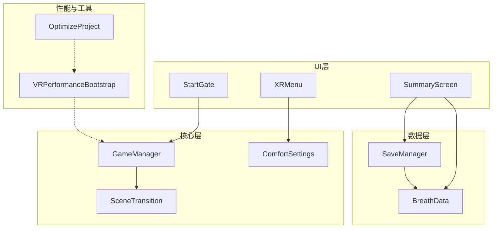
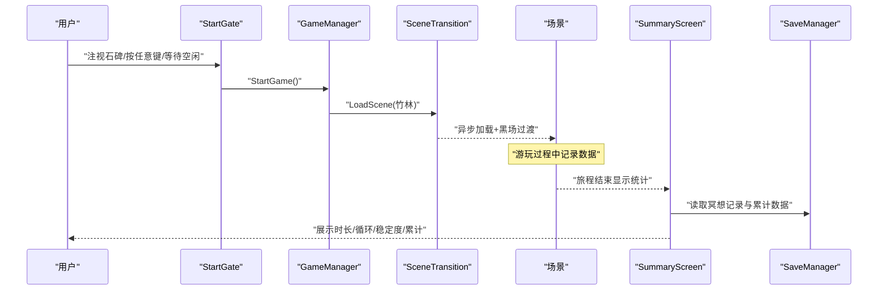
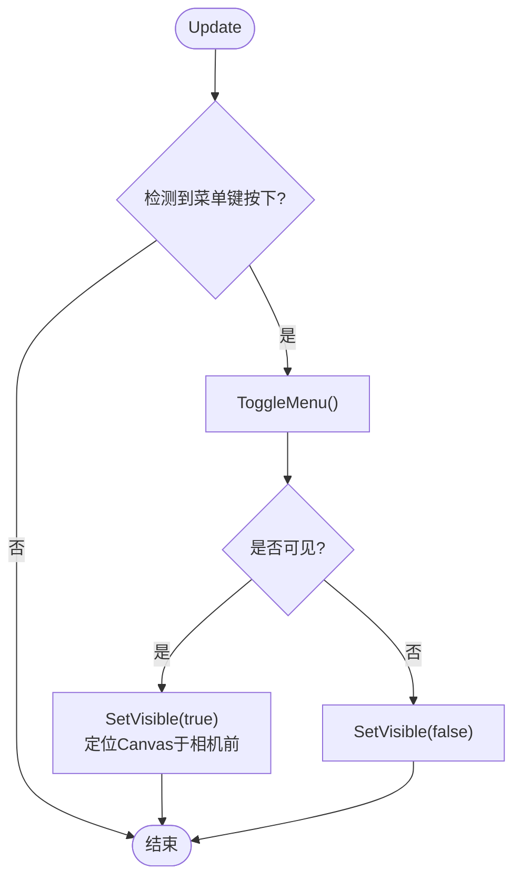
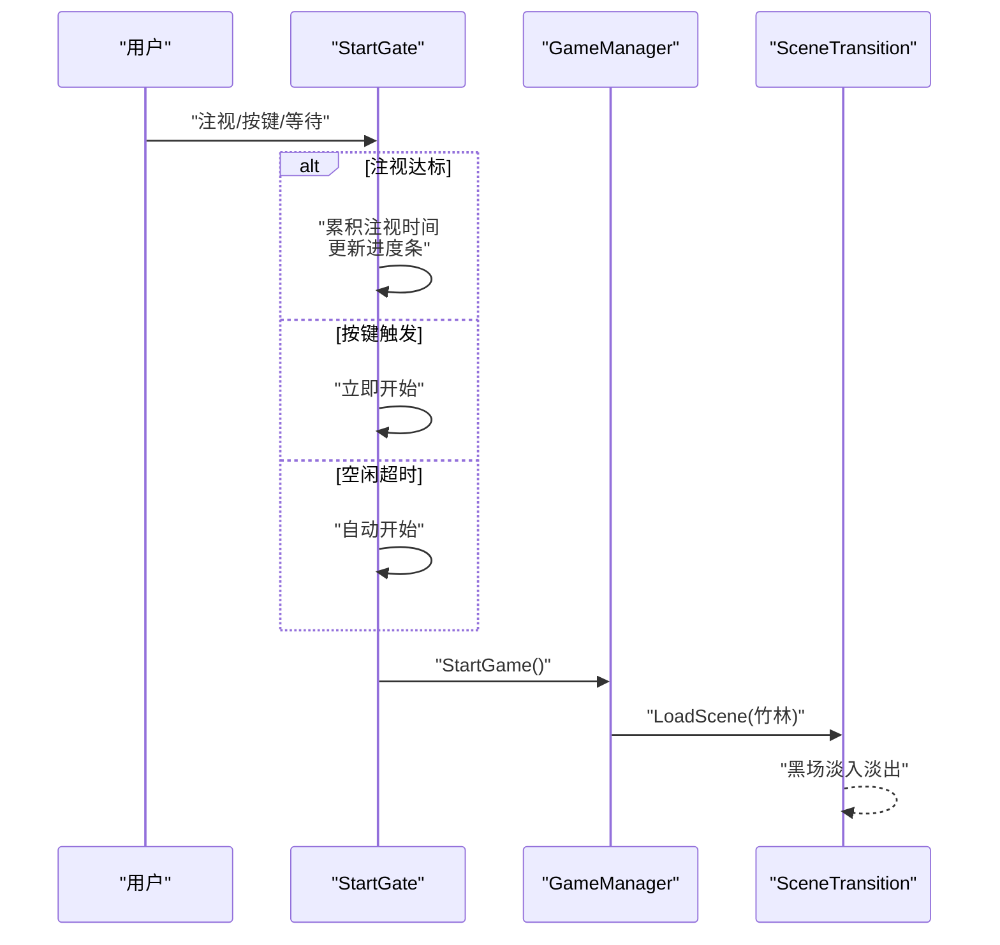
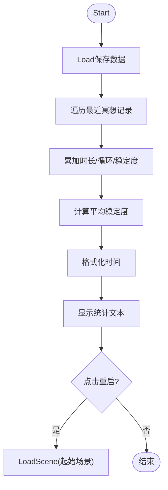
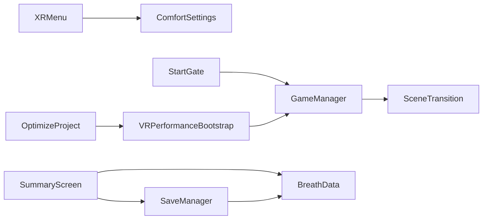

# VR用户界面

<cite>
**本文引用的文件**
- [XRMenu.cs](file://Assets/Scripts/UI/XRMenu.cs)
- [StartGate.cs](file://Assets/Scripts/UI/StartGate.cs)
- [SummaryScreen.cs](file://Assets/Scripts/UI/SummaryScreen.cs)
- [ComfortSettings.cs](file://Assets/Scripts/Core/ComfortSettings.cs)
- [GameManager.cs](file://Assets/Scripts/Core/GameManager.cs)
- [SceneTransition.cs](file://Assets/Scripts/Core/SceneTransition.cs)
- [SaveManager.cs](file://Assets/Scripts/Data/SaveManager.cs)
- [BreathData.cs](file://Assets/Scripts/Meditation/BreathData.cs)
- [VRPerformanceBootstrap.cs](file://Assets/Scripts/Core/VRPerformanceBootstrap.cs)
- [OptimizeProject.cs](file://Assets/Editor/OptimizeProject.cs)
</cite>

## 更新摘要
**所做更改**
- 更新了StartGate启动门控系统部分，详细说明了WorldSpace画布缩放问题的修复
- 添加了关于UI尺寸优化的技术细节，从320米墙缩小到舒适的1.6m×0.6m尺寸
- 增强了UI组件设计原则章节，包含响应式设计和用户体验优化
- 更新了故障排查指南，包含UI缩放相关问题的解决方案

## 目录
1. [简介](#简介)
2. [项目结构](#项目结构)
3. [核心组件](#核心组件)
4. [架构总览](#架构总览)
5. [详细组件分析](#详细组件分析)
6. [依赖关系分析](#依赖关系分析)
7. [性能与可访问性](#性能与可访问性)
8. [故障排查指南](#故障排查指南)
9. [结论](#结论)
10. [附录：扩展与主题定制](#附录：扩展与主题定制)

## 简介
本技术文档面向InkRidge的VR用户界面系统，聚焦以下目标：
- XRMenu菜单系统的架构设计与交互逻辑（菜单项选择、设置面板显示、用户输入处理）
- StartGate启动门控的场景进入条件检查、用户引导流程与过渡动画实现
- SummaryScreen统计摘要屏幕的数据展示逻辑、图表渲染与用户反馈机制
- VR UI的响应式设计原则与可访问性考虑
- UI组件自定义开发指南（新增菜单项、界面主题修改）
- UI性能优化与跨平台兼容性最佳实践

## 项目结构
UI相关代码集中在Assets/Scripts/UI下，并与Core、Data、Meditation等模块协作。关键文件职责如下：
- XRMenu：在VR中通过控制器按钮切换设置面板，绑定移动速度、转向角度、晕动效果、坐姿模式、触觉反馈等选项
- StartGate：首场景的门控系统，支持注视确认、任意按键触发与空闲自动开始，并动态构建提示UI
- SummaryScreen：旅程结束后的统计汇总，读取保存数据并展示步行时长、冥想时长、呼吸循环次数、稳定度与累计信息
- ComfortSettings：持久化VR舒适设置（移动速度、转向角度、晕影开关、坐姿模式、触觉反馈）
- GameManager：全局游戏状态管理，负责场景流转与行走时间统计
- SceneTransition：异步场景加载与黑场淡入淡出过渡
- SaveManager：本地JSON存储，记录冥想记录、累计时长、解锁进度与每日打卡
- BreathData：单次冥想会话的可序列化数据结构
- VRPerformanceBootstrap：运行时一次性性能调优（刷新率、CPU/GPU等级、FFR）
- OptimizeProject：编辑器一键优化Quest 3构建配置（质量、图形、音频、Player设置）

**图表来源**
- [XRMenu.cs:1-172](file://Assets/Scripts/UI/XRMenu.cs#L1-L172)
- [StartGate.cs:1-197](file://Assets/Scripts/UI/StartGate.cs#L1-L197)
- [SummaryScreen.cs:1-72](file://Assets/Scripts/UI/SummaryScreen.cs#L1-L72)
- [ComfortSettings.cs:1-81](file://Assets/Scripts/Core/ComfortSettings.cs#L1-L81)
- [GameManager.cs:1-66](file://Assets/Scripts/Core/GameManager.cs#L1-L66)
- [SceneTransition.cs:1-61](file://Assets/Scripts/Core/SceneTransition.cs#L1-L61)
- [SaveManager.cs:1-118](file://Assets/Scripts/Data/SaveManager.cs#L1-L118)
- [BreathData.cs:1-45](file://Assets/Scripts/Meditation/BreathData.cs#L1-L45)
- [VRPerformanceBootstrap.cs:1-49](file://Assets/Scripts/Core/VRPerformanceBootstrap.cs#L1-L49)
- [OptimizeProject.cs:1-335](file://Assets/Editor/OptimizeProject.cs#L1-L335)

**章节来源**
- [XRMenu.cs:1-172](file://Assets/Scripts/UI/XRMenu.cs#L1-L172)
- [StartGate.cs:1-197](file://Assets/Scripts/UI/StartGate.cs#L1-L197)
- [SummaryScreen.cs:1-72](file://Assets/Scripts/UI/SummaryScreen.cs#L1-L72)
- [ComfortSettings.cs:1-81](file://Assets/Scripts/Core/ComfortSettings.cs#L1-L81)
- [GameManager.cs:1-66](file://Assets/Scripts/Core/GameManager.cs#L1-L66)
- [SceneTransition.cs:1-61](file://Assets/Scripts/Core/SceneTransition.cs#L1-L61)
- [SaveManager.cs:1-118](file://Assets/Scripts/Data/SaveManager.cs#L1-L118)
- [BreathData.cs:1-45](file://Assets/Scripts/Meditation/BreathData.cs#L1-L45)
- [VRPerformanceBootstrap.cs:1-49](file://Assets/Scripts/Core/VRPerformanceBootstrap.cs#L1-L49)
- [OptimizeProject.cs:1-335](file://Assets/Editor/OptimizeProject.cs#L1-L335)

## 核心组件
- XRMenu：提供世界空间Canvas的设置面板，通过控制器菜单键或B/Y键切换可见性；更新移动速度、转向角度、晕影、坐姿模式、触觉反馈等设置，并即时应用
- StartGate：首场景门控，支持注视目标一定角度与时长、任意按键触发、空闲自动开始；运行时构建提示UI与进度条，完成后调用GameManager开始游戏
- SummaryScreen：读取SaveManager中的冥想记录与累计数据，计算本次与累计的步行/冥想时长、呼吸循环次数、稳定度百分比，并提供重启按钮
- ComfortSettings：集中管理VR舒适设置，使用PlayerPrefs持久化，并提供坐姿模式高度调整
- GameManager：单例，维护场景索引、行走计时，协调场景跳转
- SceneTransition：异步加载场景并配合CanvasGroup实现黑场淡入淡出过渡
- SaveManager：JSON持久化，记录冥想记录、累计时长、解锁进度、每日打卡
- BreathData：单次冥想记录的序列化模型
- VRPerformanceBootstrap：运行时一次性设置刷新率、CPU/GPU等级与FFR
- OptimizeProject：编辑器一键优化Quest 3构建配置

**章节来源**
- [XRMenu.cs:1-172](file://Assets/Scripts/UI/XRMenu.cs#L1-L172)
- [StartGate.cs:1-197](file://Assets/Scripts/UI/StartGate.cs#L1-L197)
- [SummaryScreen.cs:1-72](file://Assets/Scripts/UI/SummaryScreen.cs#L1-L72)
- [ComfortSettings.cs:1-81](file://Assets/Scripts/Core/ComfortSettings.cs#L1-L81)
- [GameManager.cs:1-66](file://Assets/Scripts/Core/GameManager.cs#L1-L66)
- [SceneTransition.cs:1-61](file://Assets/Scripts/Core/SceneTransition.cs#L1-L61)
- [SaveManager.cs:1-118](file://Assets/Scripts/Data/SaveManager.cs#L1-L118)
- [BreathData.cs:1-45](file://Assets/Scripts/Meditation/BreathData.cs#L1-L45)
- [VRPerformanceBootstrap.cs:1-49](file://Assets/Scripts/Core/VRPerformanceBootstrap.cs#L1-L49)
- [OptimizeProject.cs:1-335](file://Assets/Editor/OptimizeProject.cs#L1-L335)

## 架构总览
VR UI系统以"门控—游玩—总结"为主线，结合设置面板与数据持久化，形成闭环体验。

**图表来源**
- [StartGate.cs:1-197](file://Assets/Scripts/UI/StartGate.cs#L1-L197)
- [GameManager.cs:1-66](file://Assets/Scripts/Core/GameManager.cs#L1-L66)
- [SceneTransition.cs:1-61](file://Assets/Scripts/Core/SceneTransition.cs#L1-L61)
- [SummaryScreen.cs:1-72](file://Assets/Scripts/UI/SummaryScreen.cs#L1-L72)
- [SaveManager.cs:1-118](file://Assets/Scripts/Data/SaveManager.cs#L1-L118)

## 详细组件分析

### XRMenu菜单系统
- 设计要点
  - 世界空间Canvas跟随玩家朝向，距离可配置
  - 通过控制器菜单键或B/Y键边缘检测切换可见性，避免每帧重复触发
  - 绑定移动速度、转向角度、晕影、坐姿模式、触觉反馈等设置，实时更新标签与数值
  - 坐姿模式变化时调用LocomotionController.ApplySettings以即时生效
- 交互流程
  - Update中检测按键按下边沿，调用ToggleMenu
  - SetVisible根据可见性激活Canvas，并在可见时定位到相机前方并面向相机
  - 各控件值变更回调写入ComfortSettings并更新UI标签
- 注意事项
  - 当前场景未包含XR Ray Interactor与TrackedDeviceGraphicRaycaster，滑块交互需额外配置
  - 所有控件可选，空引用保护确保旧场景兼容

**图表来源**
- [XRMenu.cs:80-132](file://Assets/Scripts/UI/XRMenu.cs#L80-L132)

**章节来源**
- [XRMenu.cs:1-172](file://Assets/Scripts/UI/XRMenu.cs#L1-L172)
- [ComfortSettings.cs:1-81](file://Assets/Scripts/Core/ComfortSettings.cs#L1-L81)

### StartGate启动门控系统
- 设计要点
  - 运行时构建WorldSpace Canvas提示UI，包含背景、标题文本与进度条
  - **已修复严重UI缩放问题**：将WorldSpace画布从320米墙缩小到舒适的1.6m×0.6m尺寸，解决"只能看到世界一角"的问题
  - 支持三种进入方式：注视目标（角度阈值与持续时间）、任意按键触发、空闲自动开始
  - 完成后调用GameManager.StartGame进入主场景
- 交互流程
  - Update中累积空闲计时，达到阈值则直接开始
  - 若注视目标，累积注视时间并更新进度条；超时后开始
  - 若检测到任意按键按下，立即开始
- 过渡动画
  - 通过GameManager调用SceneTransition.LoadScene进行异步加载与黑场过渡
- **UI缩放修复详情**
  - 原问题：320-unit面板相当于320米墙壁，用户站在其中只能看到一小部分世界
  - 解决方案：保持屏幕风格尺寸（320×120），但将整个画布缩放到物理尺寸约1.6m×0.6m
  - 实现方式：设置`canvasObj.transform.localScale = new Vector3(0.005f, 0.005f, 0.005f)`
  - 位置调整：画布位于玩家前方3.2米处，高度2.3米，符合舒适阅读距离

**图表来源**
- [StartGate.cs:45-109](file://Assets/Scripts/UI/StartGate.cs#L45-L109)
- [GameManager.cs:51-55](file://Assets/Scripts/Core/GameManager.cs#L51-L55)
- [SceneTransition.cs:30-44](file://Assets/Scripts/Core/SceneTransition.cs#L30-L44)

**章节来源**
- [StartGate.cs:1-197](file://Assets/Scripts/UI/StartGate.cs#L1-L197)
- [GameManager.cs:1-66](file://Assets/Scripts/Core/GameManager.cs#L1-L66)
- [SceneTransition.cs:1-61](file://Assets/Scripts/Core/SceneTransition.cs#L1-L61)

### SummaryScreen统计摘要屏幕
- 设计要点
  - 读取SaveManager中的冥想记录列表，计算最近若干次会话的冥想时长、呼吸循环次数与稳定度平均值
  - 展示本次步行时长、本次冥想时长、呼吸循环次数、呼吸稳定度百分比、累计完成次数与每日打卡天数
  - 提供重启按钮，返回起始场景
- 数据流
  - Load保存数据，遍历最近记录累加时长与稳定度，计算平均值
  - 格式化时间为"分秒"格式
  - 重启按钮调用SceneTransition.LoadScene回到起始场景

**图表来源**
- [SummaryScreen.cs:25-69](file://Assets/Scripts/UI/SummaryScreen.cs#L25-L69)
- [SaveManager.cs:29-66](file://Assets/Scripts/Data/SaveManager.cs#L29-L66)
- [BreathData.cs:10-42](file://Assets/Scripts/Meditation/BreathData.cs#L10-L42)
- [SceneTransition.cs:30-44](file://Assets/Scripts/Core/SceneTransition.cs#L30-L44)

**章节来源**
- [SummaryScreen.cs:1-72](file://Assets/Scripts/UI/SummaryScreen.cs#L1-L72)
- [SaveManager.cs:1-118](file://Assets/Scripts/Data/SaveManager.cs#L1-L118)
- [BreathData.cs:1-45](file://Assets/Scripts/Meditation/BreathData.cs#L1-L45)
- [SceneTransition.cs:1-61](file://Assets/Scripts/Core/SceneTransition.cs#L1-L61)

## 依赖关系分析
- XRMenu依赖ComfortSettings读写设置，并通过LocomotionController应用坐姿模式
- StartGate依赖Camera.main进行注视检测，依赖GameManager开始游戏
- SummaryScreen依赖SaveManager与BreathData读取与解析数据
- GameManager依赖SceneTransition进行场景切换
- SaveManager依赖BreathData序列化/反序列化
- VRPerformanceBootstrap在场景加载前设置性能参数
- OptimizeProject在编辑器中统一配置质量、图形、音频与Player设置

**图表来源**
- [XRMenu.cs:1-172](file://Assets/Scripts/UI/XRMenu.cs#L1-L172)
- [StartGate.cs:1-197](file://Assets/Scripts/UI/StartGate.cs#L1-L197)
- [SummaryScreen.cs:1-72](file://Assets/Scripts/UI/SummaryScreen.cs#L1-L72)
- [ComfortSettings.cs:1-81](file://Assets/Scripts/Core/ComfortSettings.cs#L1-L81)
- [GameManager.cs:1-66](file://Assets/Scripts/Core/GameManager.cs#L1-L66)
- [SceneTransition.cs:1-61](file://Assets/Scripts/Core/SceneTransition.cs#L1-L61)
- [SaveManager.cs:1-118](file://Assets/Scripts/Data/SaveManager.cs#L1-L118)
- [BreathData.cs:1-45](file://Assets/Scripts/Meditation/BreathData.cs#L1-L45)
- [VRPerformanceBootstrap.cs:1-49](file://Assets/Scripts/Core/VRPerformanceBootstrap.cs#L1-L49)
- [OptimizeProject.cs:1-335](file://Assets/Editor/OptimizeProject.cs#L1-L335)

**章节来源**
- [XRMenu.cs:1-172](file://Assets/Scripts/UI/XRMenu.cs#L1-L172)
- [StartGate.cs:1-197](file://Assets/Scripts/UI/StartGate.cs#L1-L197)
- [SummaryScreen.cs:1-72](file://Assets/Scripts/UI/SummaryScreen.cs#L1-L72)
- [ComfortSettings.cs:1-81](file://Assets/Scripts/Core/ComfortSettings.cs#L1-L81)
- [GameManager.cs:1-66](file://Assets/Scripts/Core/GameManager.cs#L1-L66)
- [SceneTransition.cs:1-61](file://Assets/Scripts/Core/SceneTransition.cs#L1-L61)
- [SaveManager.cs:1-118](file://Assets/Scripts/Data/SaveManager.cs#L1-L118)
- [BreathData.cs:1-45](file://Assets/Scripts/Meditation/BreathData.cs#L1-L45)
- [VRPerformanceBootstrap.cs:1-49](file://Assets/Scripts/Core/VRPerformanceBootstrap.cs#L1-L49)
- [OptimizeProject.cs:1-335](file://Assets/Editor/OptimizeProject.cs#L1-L335)

## 性能与可访问性
- 性能优化
  - 运行时一次性设置目标刷新率、关闭VSync、设置CPU/GPU等级与FFR，降低首帧开销与提升稳定性
  - 编辑器一键优化：禁用阴影、限制像素光数量、开启MSAA、各向异性过滤、软植被、关闭实时反射探针、粒子射线预算控制、LOD偏置、禁用Blit、启用多渲染线程、剥离引擎代码与未用网格组件
  - 音频优化：环境音流式加载，短音效预解压，压缩格式与质量平衡
- 可访问性与响应式原则
  - 控制器输入容错：支持多种按键路径与设备差异，避免仅依赖单一输入源
  - 注视交互宽容角度与时长，兼顾不同身高与佩戴位置
  - 设置面板提供常用舒适度调节（移动速度、转向角度、晕影、坐姿模式、触觉反馈），适配不同用户偏好
  - 文本与UI布局采用世界空间Canvas，便于在不同分辨率与视距下阅读
  - **UI缩放优化**：StartGate面板采用合理的物理尺寸（1.6m×0.6m），确保用户在舒适距离内阅读，避免过大或过小的显示问题
- 跨平台兼容性
  - Quest专用性能API探测与回退，避免Vulkan运行时警告
  - 编辑器脚本针对Android目标与IL2CPP Release配置，保证构建一致性
  - 单通道实例化立体渲染需Shader声明宏，避免错误立体渲染

**章节来源**
- [VRPerformanceBootstrap.cs:1-49](file://Assets/Scripts/Core/VRPerformanceBootstrap.cs#L1-L49)
- [OptimizeProject.cs:1-335](file://Assets/Editor/OptimizeProject.cs#L1-L335)
- [XRMenu.cs:1-172](file://Assets/Scripts/UI/XRMenu.cs#L1-L172)
- [StartGate.cs:1-197](file://Assets/Scripts/UI/StartGate.cs#L1-L197)

## 故障排查指南
- 设置面板不可交互
  - 现象：打开XRMenu但无法操作滑块
  - 原因：缺少XR Ray Interactor与TrackedDeviceGraphicRaycaster
  - 解决：为控制器添加XR Ray Interactor，为Canvas添加TrackedDeviceGraphicRaycaster
- 设置不保存
  - 现象：重启后恢复默认
  - 原因：PlayerPrefs未强制保存
  - 解决：ComfortSettings已强制保存；检查是否有覆盖逻辑或异常
- 启动门控无响应
  - 现象：注视或按键无效
  - 原因：Camera.main为空或gazeTarget未正确设置
  - 解决：确保场景中存在主相机且gazeTarget指向石碑；检查Input System配置
- **UI缩放问题**
  - 现象：StartGate面板显示过大或过小，用户需要极端视角才能看到完整内容
  - 原因：WorldSpace画布尺寸设置不当，如320米墙导致用户只能看到一小部分
  - 解决：使用适当的缩放比例（0.005f）将320×120像素的画布转换为1.6m×0.6m的物理尺寸
  - 验证：确保画布位于玩家前方3.2米，高度2.3米的舒适阅读位置
- 统计数据显示异常
  - 现象：SummaryScreen数值不正确
  - 原因：SaveManager读取失败或BreathData解析异常
  - 解决：检查JSON文件完整性与字段映射；查看日志错误信息
- 场景切换卡顿
  - 现象：黑场过渡期间掉帧
  - 原因：资源加载或性能设置不当
  - 解决：运行OptimizeProject一键优化；检查VRPerformanceBootstrap是否正确执行

**章节来源**
- [XRMenu.cs:1-172](file://Assets/Scripts/UI/XRMenu.cs#L1-L172)
- [StartGate.cs:1-197](file://Assets/Scripts/UI/StartGate.cs#L1-L197)
- [SummaryScreen.cs:1-72](file://Assets/Scripts/UI/SummaryScreen.cs#L1-L72)
- [SaveManager.cs:1-118](file://Assets/Scripts/Data/SaveManager.cs#L1-L118)
- [VRPerformanceBootstrap.cs:1-49](file://Assets/Scripts/Core/VRPerformanceBootstrap.cs#L1-L49)
- [OptimizeProject.cs:1-335](file://Assets/Editor/OptimizeProject.cs#L1-L335)

## 结论
InkRidge的VR UI系统以简洁清晰的门控—游玩—总结流程为核心，结合灵活的设置面板与稳健的数据持久化，提供了良好的用户体验。通过运行时性能调优与编辑器一键优化，系统在Quest平台上具备稳定的帧率与流畅的交互。**特别值得注意的是，StartGate面板的UI缩放问题已得到修复，从320米墙的极端尺寸调整为舒适的1.6m×0.6m物理尺寸，显著改善了用户的视觉体验和交互便利性**。未来可在交互层增强（如射线交互）与主题定制方面进一步扩展。

## 附录：扩展与主题定制
- 新增菜单项
  - 在XRMenu中添加新的Slider/Toggle/TextMeshProUGUI字段，并在Start中初始化值与监听回调
  - 将新设置写入ComfortSettings，必要时在其他组件中读取与应用
  - 确保UI元素在场景中正确连线，并为Canvas添加必要的射线投射器
- 修改界面主题
  - 调整StartGate与XRMenu中的颜色、字体、尺寸与布局
  - 注意字体资源与文本对齐，避免CJK字符缺失导致的显示问题
  - 如需更复杂的主题切换，可引入主题管理器统一管理样式
- 图表渲染建议
  - SummaryScreen当前以文本形式展示统计；如需图表，建议使用轻量级UI图表库或自定义绘制
  - 保持图表可读性与低开销，避免在VR中频繁重绘
- **UI尺寸设计原则**
  - WorldSpace画布应采用物理尺寸而非像素尺寸，推荐使用0.005f缩放比例将屏幕风格尺寸转换为合适的物理大小
  - 确保UI元素位于用户舒适阅读距离（2-4米），高度适中（1.5-2.5米）
  - 避免过大的UI面板导致用户需要极端头部运动才能看到全部内容
- 性能与兼容性
  - 新增UI元素时注意Draw Call与Overdraw，尽量复用材质与纹理
  - 测试不同头显与分辨率下的显示效果，确保可读性与可用性
  - 使用OptimizeProject一键优化，确保构建一致性与性能基线

**章节来源**
- [XRMenu.cs:1-172](file://Assets/Scripts/UI/XRMenu.cs#L1-L172)
- [StartGate.cs:1-197](file://Assets/Scripts/UI/StartGate.cs#L1-L197)
- [SummaryScreen.cs:1-72](file://Assets/Scripts/UI/SummaryScreen.cs#L1-L72)
- [ComfortSettings.cs:1-81](file://Assets/Scripts/Core/ComfortSettings.cs#L1-L81)
- [OptimizeProject.cs:1-335](file://Assets/Editor/OptimizeProject.cs#L1-L335)