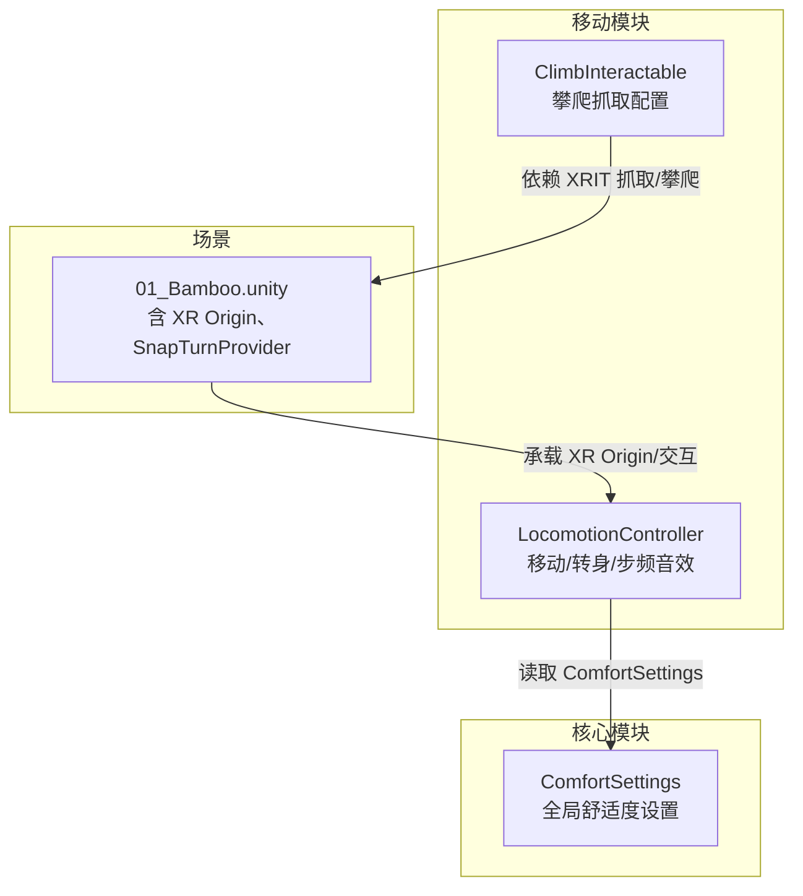
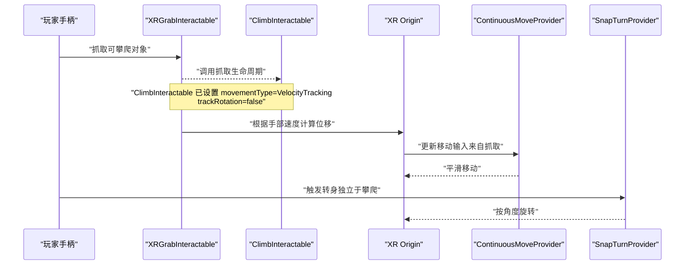
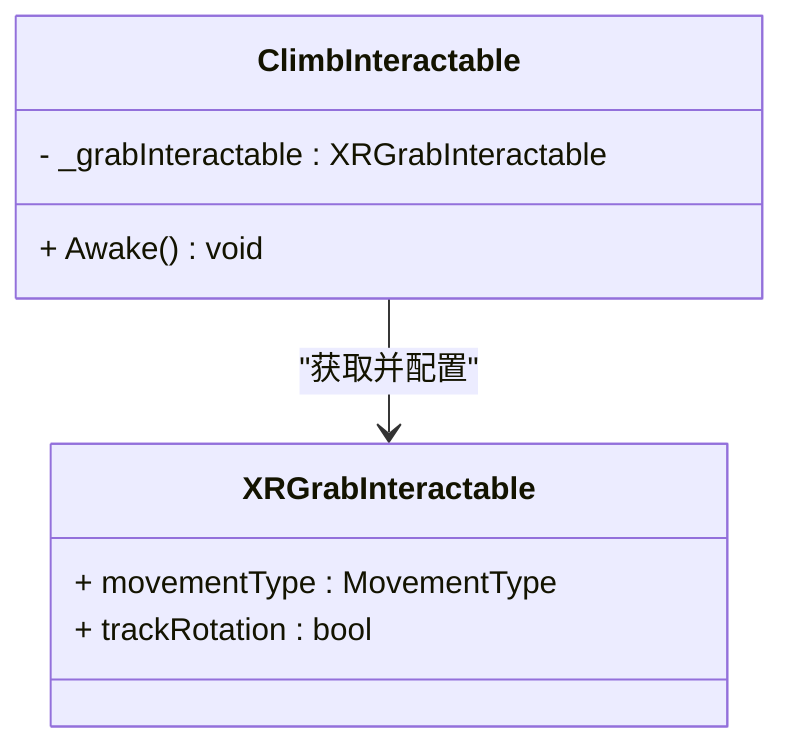
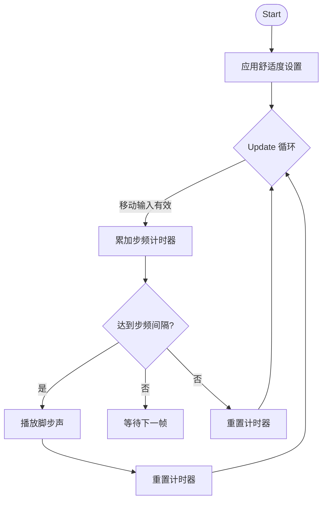
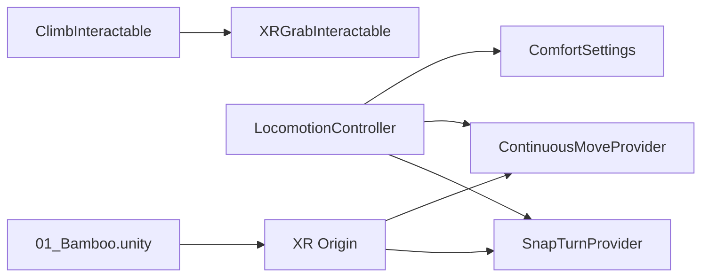

# 攀爬交互

<cite>
**本文引用的文件**
- [ClimbInteractable.cs](file://Assets/Scripts/Movement/ClimbInteractable.cs)
- [LocomotionController.cs](file://Assets/Scripts/Movement/LocomotionController.cs)
- [ComfortSettings.cs](file://Assets/Scripts/Core/ComfortSettings.cs)
- [01_Bamboo.unity](file://Assets/Scenes/01_Bamboo.unity)
</cite>

## 目录
1. [简介](#简介)
2. [项目结构](#项目结构)
3. [核心组件](#核心组件)
4. [架构总览](#架构总览)
5. [详细组件分析](#详细组件分析)
6. [依赖关系分析](#依赖关系分析)
7. [性能考虑](#性能考虑)
8. [故障排查指南](#故障排查指南)
9. [结论](#结论)
10. [附录](#附录)

## 简介
本技术文档聚焦于 InkRidge 的攀爬交互系统，围绕 ClimbInteractable 组件与 XR Interaction Toolkit（XRIT）提供的抓取与攀爬能力进行说明。当前实现采用“轻量配置”的方式：通过为可攀爬对象附加 ClimbInteractable，并启用 XRGrabInteractable 的速度追踪模式，配合场景中的 XR Origin、移动与转向提供者，即可实现“抓握后推动手柄带动 XR Origin 反向位移”的攀爬体验。本文同时给出扩展建议，涵盖自定义攀爬点、动画集成、触觉反馈与视觉提示等。

## 项目结构
与攀爬交互直接相关的代码与资源分布如下：
- 脚本层
  - Movement：包含攀爬交互与 locomotion 控制的核心脚本
  - Core：提供舒适度设置（移动速度、转身角度、坐姿模式、触觉开关等）
- 场景层
  - 示例场景中包含 XR Origin、SnapTurnProvider 等基础移动组件，用于支撑整体移动体验

图示来源
- [ClimbInteractable.cs:1-24](file://Assets/Scripts/Movement/ClimbInteractable.cs#L1-L24)
- [LocomotionController.cs:1-72](file://Assets/Scripts/Movement/LocomotionController.cs#L1-L72)
- [ComfortSettings.cs:1-81](file://Assets/Scripts/Core/ComfortSettings.cs#L1-L81)
- [01_Bamboo.unity:125-200](file://Assets/Scenes/01_Bamboo.unity#L125-L200)

章节来源
- [ClimbInteractable.cs:1-24](file://Assets/Scripts/Movement/ClimbInteractable.cs#L1-L24)
- [LocomotionController.cs:1-72](file://Assets/Scripts/Movement/LocomotionController.cs#L1-L72)
- [ComfortSettings.cs:1-81](file://Assets/Scripts/Core/ComfortSettings.cs#L1-L81)
- [01_Bamboo.unity:125-200](file://Assets/Scenes/01_Bamboo.unity#L125-L200)

## 核心组件
- ClimbInteractable：为可攀爬对象提供抓取与攀爬行为的基础配置。其职责是获取同对象的 XRGrabInteractable，并将移动类型设置为速度追踪，关闭旋转跟踪，从而让抓取动作由手柄运动驱动，而非物体自身旋转。
- LocomotionController：负责应用舒适度设置到移动与转身提供者，并在移动时触发脚步声效；同时根据坐姿模式调整 XR Origin 高度。
- ComfortSettings：集中管理 VR 舒适度相关的全局参数（移动速度、转身角度、暗角开关、坐姿模式、触觉开关），并提供应用到 XR Origin 的方法。

章节来源
- [ClimbInteractable.cs:1-24](file://Assets/Scripts/Movement/ClimbInteractable.cs#L1-L24)
- [LocomotionController.cs:1-72](file://Assets/Scripts/Movement/LocomotionController.cs#L1-L72)
- [ComfortSettings.cs:1-81](file://Assets/Scripts/Core/ComfortSettings.cs#L1-L81)

## 架构总览
攀爬交互的整体流程基于 XRIT 的抓取与攀爬管线：玩家用手柄抓取带有 ClimbInteractable 的可攀爬对象，由于该对象启用了速度追踪且不跟踪旋转，抓取后的手部运动将转化为对 XR Origin 的反向位移，从而实现“拉动手柄即向上/向前攀爬”的直观操作。

图示来源
- [ClimbInteractable.cs:17-22](file://Assets/Scripts/Movement/ClimbInteractable.cs#L17-L22)
- [01_Bamboo.unity:125-200](file://Assets/Scenes/01_Bamboo.unity#L125-L200)

## 详细组件分析

### ClimbInteractable：抓取与攀爬配置
- 设计要点
  - 使用 RequireComponent 强制挂载 XRGrabInteractable，确保每个攀爬点具备抓取能力。
  - 在 Awake 中获取 XRGrabInteractable 并设置 movementType 为 VelocityTracking，使抓取行为基于手部速度驱动。
  - 关闭 trackRotation，避免抓取过程中物体跟随手柄旋转，保证攀爬方向可控。
- 物理与碰撞
  - 抓取与碰撞检测由 XRIT 内部完成；ClimbInteractable 本身不实现自定义碰撞逻辑。
  - 建议在场景中为攀爬点添加合适的 Collider 与 Rigidbody（如需物理约束），并确保抓取层与触发器层级正确配置。
- 状态管理
  - 当前实现未维护额外状态机；抓取/释放状态由 XRGrabInteractable 管理。
  - 若需扩展（如限制攀爬方向、防抖动），可在该组件中增加状态字段与事件回调。

图示来源
- [ClimbInteractable.cs:12-22](file://Assets/Scripts/Movement/ClimbInteractable.cs#L12-L22)

章节来源
- [ClimbInteractable.cs:12-22](file://Assets/Scripts/Movement/ClimbInteractable.cs#L12-L22)

### LocomotionController：移动与转身
- 功能概述
  - 在 Start 时应用 ComfortSettings 到 ContinuousMoveProvider 与 SnapTurnProvider。
  - Update 中监听左手移动输入，当移动幅度超过阈值时播放脚步声，并按间隔重复播放。
  - 支持坐姿模式切换，通过 ComfortSettings.ApplySeatedMode 调整 XR Origin 高度。
- 与攀爬的关系
  - 攀爬时的位移由抓取驱动，但转身仍由 SnapTurnProvider 处理；两者互不冲突。
  - 移动速度与转身角度受 ComfortSettings 影响，便于统一调参。

图示来源
- [LocomotionController.cs:26-69](file://Assets/Scripts/Movement/LocomotionController.cs#L26-L69)
- [ComfortSettings.cs:68-78](file://Assets/Scripts/Core/ComfortSettings.cs#L68-L78)

章节来源
- [LocomotionController.cs:26-69](file://Assets/Scripts/Movement/LocomotionController.cs#L26-L69)
- [ComfortSettings.cs:68-78](file://Assets/Scripts/Core/ComfortSettings.cs#L68-L78)

### 场景装配：XR Origin 与提供者
- 在 01_Bamboo.unity 中可见 XR Origin 及其子对象，包括 SnapTurnProvider 等移动相关组件。
- XR Origin 作为玩家在世界空间中的根节点，所有抓取驱动的位移最终作用于它。
- 建议为攀爬点准备合适的 Transform 与 Collider，以便抓取与碰撞检测正常工作。

章节来源
- [01_Bamboo.unity:125-200](file://Assets/Scenes/01_Bamboo.unity#L125-L200)

## 依赖关系分析
- 组件耦合
  - ClimbInteractable 强依赖 XRGrabInteractable（RequireComponent）。
  - LocomotionController 依赖 ComfortSettings 以读取/应用移动与转身参数。
  - 场景装配依赖 XRIT 提供的 ContinuousMoveProvider、SnapTurnProvider 以及 XR Origin。
- 外部依赖
  - Unity XR Interaction Toolkit：提供抓取、攀爬、移动与转身的底层实现。
  - OpenXR 运行时：提供设备输入与追踪（由场景与 XR 设置决定）。

图示来源
- [ClimbInteractable.cs:12-22](file://Assets/Scripts/Movement/ClimbInteractable.cs#L12-L22)
- [LocomotionController.cs:16-47](file://Assets/Scripts/Movement/LocomotionController.cs#L16-L47)
- [01_Bamboo.unity:125-200](file://Assets/Scenes/01_Bamboo.unity#L125-L200)

章节来源
- [ClimbInteractable.cs:12-22](file://Assets/Scripts/Movement/ClimbInteractable.cs#L12-L22)
- [LocomotionController.cs:16-47](file://Assets/Scripts/Movement/LocomotionController.cs#L16-L47)
- [01_Bamboo.unity:125-200](file://Assets/Scenes/01_Bamboo.unity#L125-L200)

## 性能考虑
- 抓取与攀爬
  - 使用 XRIT 内置抓取与攀爬管线，避免手写物理求解，降低 CPU 开销。
  - 保持攀爬点数量合理，过多抓取目标会增加射线检测与碰撞查询成本。
- 移动与转身
  - 移动速度可通过 ComfortSettings 调节，过高可能导致抖动或穿模。
  - 转身角度与去抖时间需在舒适性与响应性之间平衡。
- 音频与特效
  - 脚步声播放频率受移动输入阈值与间隔控制，避免频繁触发导致音频队列压力。
  - 建议按需开启/关闭暗角与高开销特效以提升移动端性能。

[本节为通用指导，不直接分析具体文件]

## 故障排查指南
- 无法抓取攀爬点
  - 检查攀爬点是否挂载了 XRGrabInteractable，且 ClimbInteractable 是否正确初始化。
  - 确认抓取层与控制器射线层匹配，Collider 未被遮挡。
- 抓取后无攀爬效果
  - 确认 XRGrabInteractable 的 movementType 已设为速度追踪，且 trackRotation 关闭。
  - 检查 XR Origin 是否存在有效的 ContinuousMoveProvider 与 SnapTurnProvider。
- 移动/转身异常
  - 查看 ComfortSettings 的移动速度与转身角度是否被意外修改。
  - 在 LocomotionController.Update 中观察移动输入是否有效，必要时临时提高阈值调试。
- 声音不同步
  - 调整脚步声间隔与移动输入阈值，确保与移动节奏一致。

章节来源
- [ClimbInteractable.cs:17-22](file://Assets/Scripts/Movement/ClimbInteractable.cs#L17-L22)
- [LocomotionController.cs:50-69](file://Assets/Scripts/Movement/LocomotionController.cs#L50-L69)
- [ComfortSettings.cs:37-47](file://Assets/Scripts/Core/ComfortSettings.cs#L37-L47)

## 结论
InkRidge 的攀爬交互采用“最小化脚本 + XRIT 能力”的设计思路：ClimbInteractable 仅做必要配置，将抓取与攀爬交给 XRIT 处理；LocomotionController 负责移动与转身的舒适度适配与反馈。该方案易于扩展与维护，适合快速迭代攀爬点与交互细节。后续可根据需求加入更丰富的状态机、动画与触觉反馈，进一步提升沉浸感。

[本节为总结性内容，不直接分析具体文件]

## 附录

### 扩展开发指南
- 自定义攀爬点
  - 在场景中放置可攀爬对象，为其添加 Collider 与必要的 Rigidbody（如需物理约束）。
  - 挂载 XRGrabInteractable 与 ClimbInteractable，并根据需要调整抓取半径、层掩码等 XRIT 参数。
- 攀爬动画集成
  - 在抓取开始/结束时播放角色或手部动画，可使用 XRGrabInteractable 的生命周期事件（如 OnGrabBegin/OnGrabEnd）触发 Animator 状态切换。
  - 若需根据攀爬方向切换动画片段，可在抓取回调中读取手部相对朝向并选择对应动画。
- 触觉反馈
  - 结合 ComfortSettings.HapticsEnabled 控制是否启用触觉。
  - 在抓取成功、攀爬推进、释放抓取等时机调用控制器震动 API，增强手感。
- 视觉提示
  - 为攀爬点添加发光材质或粒子效果，在接近时增强提示强度。
  - 在 UI 或世界空间中显示抓取提示文本，提升可发现性。
- 安全与容错
  - 防止穿模：为攀爬路径添加不可见阻挡面或限制最大攀爬距离。
  - 防抖动：在抓取回调中加入短暂冷却时间，避免误触。

[本节为概念性指导，不直接分析具体文件]