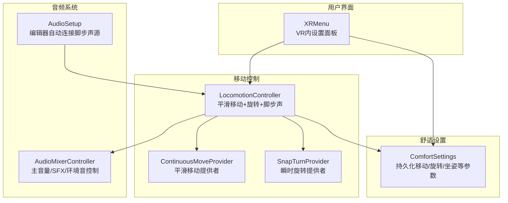
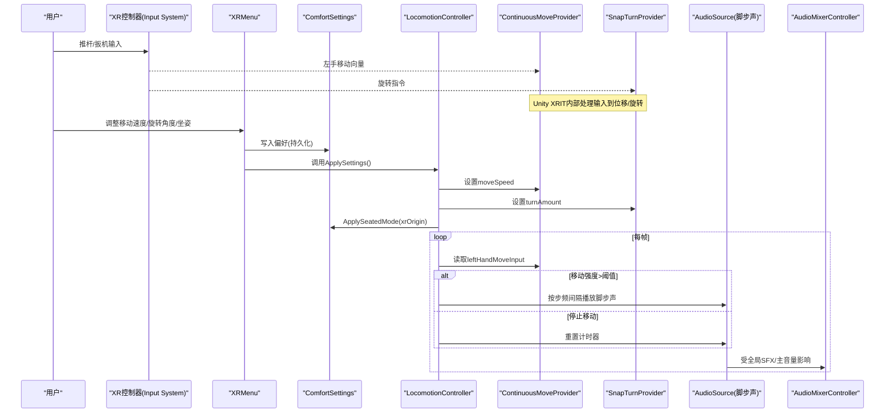
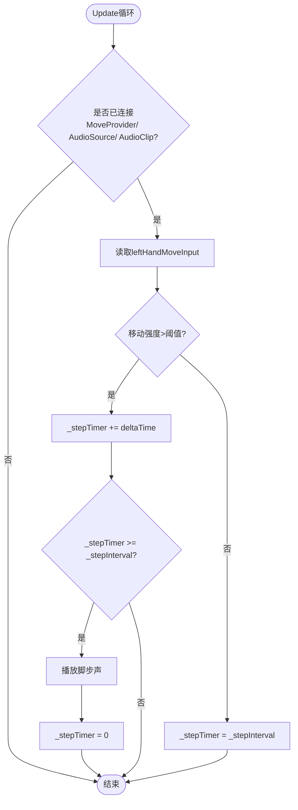
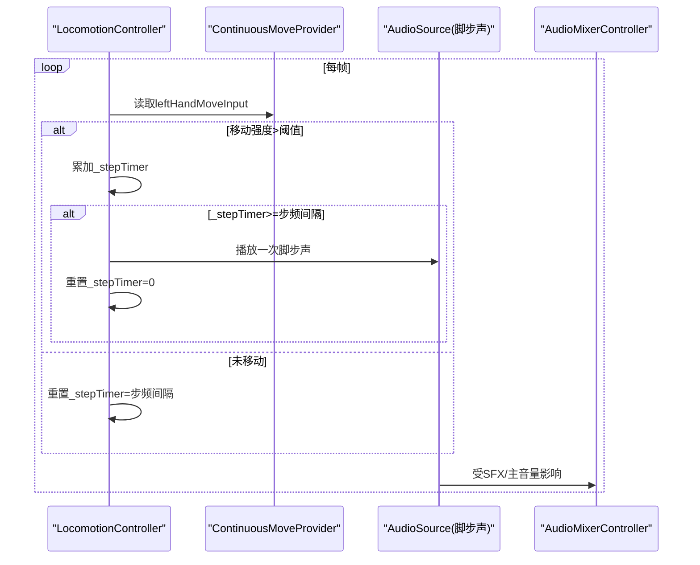
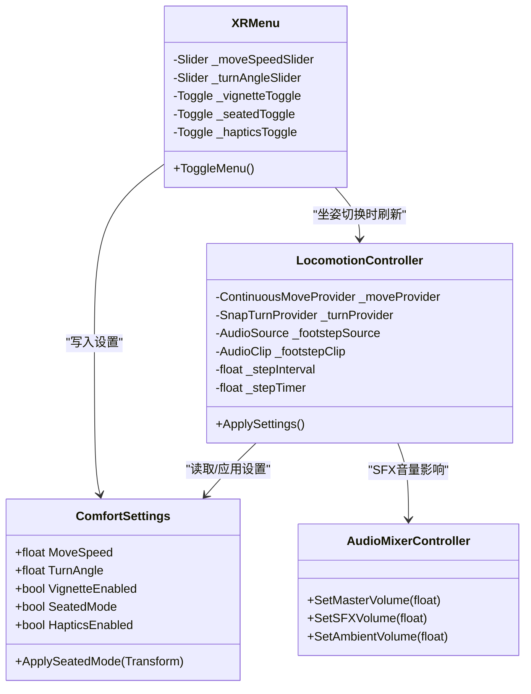

# 移动控制

<cite>
**本文引用的文件**
- [LocomotionController.cs](file://Assets/Scripts/Movement/LocomotionController.cs)
- [ComfortSettings.cs](file://Assets/Scripts/Core/ComfortSettings.cs)
- [XRMenu.cs](file://Assets/Scripts/UI/XRMenu.cs)
- [AudioMixerController.cs](file://Assets/Scripts/Core/AudioMixerController.cs)
- [AudioSetup.cs](file://Assets/Editor/AudioSetup.cs)
</cite>

## 目录
1. [简介](#简介)
2. [项目结构](#项目结构)
3. [核心组件](#核心组件)
4. [架构总览](#架构总览)
5. [详细组件分析](#详细组件分析)
6. [依赖关系分析](#依赖关系分析)
7. [性能考虑](#性能考虑)
8. [故障排查指南](#故障排查指南)
9. [结论](#结论)
10. [附录](#附录)

## 简介
本技术文档聚焦于InkRidge的移动控制系统，围绕以下目标展开：
- 解释LocomotionController组件的平滑移动算法实现与ContinuousMoveProvider的配置和使用。
- 说明旋转控制的SnapTurnProvider机制与角度设置。
- 阐述舒适度设置对移动体验的影响（移动速度、旋转角度、用户坐姿模式）。
- 解析脚步声系统的实现原理（音频触发时机与步频控制）。
- 提供移动控制的自定义配置指南与性能优化建议。
- 给出XR控制器输入处理的具体实现细节与常见问题解决方案。

## 项目结构
本项目将移动控制相关逻辑集中在Movement与Core两个命名空间下，UI层通过XRMenu暴露可交互的设置面板，编辑器工具负责场景初始化时自动连接音频资源到移动控制器。

图表来源
- [LocomotionController.cs:1-72](file://Assets/Scripts/Movement/LocomotionController.cs#L1-L72)
- [ComfortSettings.cs:1-81](file://Assets/Scripts/Core/ComfortSettings.cs#L1-L81)
- [XRMenu.cs:1-172](file://Assets/Scripts/UI/XRMenu.cs#L1-L172)
- [AudioMixerController.cs:1-67](file://Assets/Scripts/Core/AudioMixerController.cs#L1-L67)
- [AudioSetup.cs:64-111](file://Assets/Editor/AudioSetup.cs#L64-L111)

章节来源
- [LocomotionController.cs:1-72](file://Assets/Scripts/Movement/LocomotionController.cs#L1-L72)
- [ComfortSettings.cs:1-81](file://Assets/Scripts/Core/ComfortSettings.cs#L1-L81)
- [XRMenu.cs:1-172](file://Assets/Scripts/UI/XRMenu.cs#L1-L172)
- [AudioMixerController.cs:1-67](file://Assets/Scripts/Core/AudioMixerController.cs#L1-L67)
- [AudioSetup.cs:64-111](file://Assets/Editor/AudioSetup.cs#L64-L111)

## 核心组件
- LocomotionController：挂载在XROrigin上，负责应用舒适度设置、驱动平滑移动与瞬时旋转、以及脚步声播放。
- ContinuousMoveProvider：来自Unity XR Interaction Toolkit，提供基于手柄输入的平滑移动能力；其移动速度由ComfortSettings统一管理。
- SnapTurnProvider：来自Unity XR Interaction Toolkit，提供基于手柄输入的瞬时旋转能力；其每次旋转角度由ComfortSettings统一管理。
- ComfortSettings：集中管理移动速度、旋转角度、晕影开关、坐姿模式、触觉反馈等偏好，并持久化至PlayerPrefs。
- XRMenu：VR内设置面板，读取/写入ComfortSettings，并在坐姿切换时刷新LocomotionController。
- AudioMixerController：统一管理主音量、SFX音量与环境音淡入淡出，影响脚步声听感。
- AudioSetup（编辑器）：在编辑器中为各场景创建脚步声AudioSource并自动连接到LocomotionController。

章节来源
- [LocomotionController.cs:1-72](file://Assets/Scripts/Movement/LocomotionController.cs#L1-L72)
- [ComfortSettings.cs:1-81](file://Assets/Scripts/Core/ComfortSettings.cs#L1-L81)
- [XRMenu.cs:1-172](file://Assets/Scripts/UI/XRMenu.cs#L1-L172)
- [AudioMixerController.cs:1-67](file://Assets/Scripts/Core/AudioMixerController.cs#L1-L67)
- [AudioSetup.cs:64-111](file://Assets/Editor/AudioSetup.cs#L64-L111)

## 架构总览
下图展示了从用户输入到移动/旋转/音效的整体数据流与控制流。

图表来源
- [XRMenu.cs:80-172](file://Assets/Scripts/UI/XRMenu.cs#L80-L172)
- [ComfortSettings.cs:37-78](file://Assets/Scripts/Core/ComfortSettings.cs#L37-L78)
- [LocomotionController.cs:26-69](file://Assets/Scripts/Movement/LocomotionController.cs#L26-L69)
- [AudioMixerController.cs:26-64](file://Assets/Scripts/Core/AudioMixerController.cs#L26-L64)

## 详细组件分析

### LocomotionController：平滑移动与脚步声
- 平滑移动：通过注入的ContinuousMoveProvider，使用其leftHandMoveInput作为移动输入源。当检测到有效移动向量（幅度大于阈值）时，累积时间以控制脚步声播放频率。
- 瞬时旋转：通过注入的SnapTurnProvider，将ComfortSettings中的TurnAngle应用到turnAmount，使每次旋转角度符合用户舒适度偏好。
- 坐姿模式：启动或设置变更时，根据SeatedMode调整XROrigin的高度，确保站立/坐姿视角合理。
- 脚步声：每帧检查移动输入，若处于移动状态则累加计时器，达到步频间隔后播放一次脚步声，然后重置计时器；静止时将计时器复位以避免误触发。

图表来源
- [LocomotionController.cs:50-69](file://Assets/Scripts/Movement/LocomotionController.cs#L50-L69)

章节来源
- [LocomotionController.cs:16-48](file://Assets/Scripts/Movement/LocomotionController.cs#L16-L48)
- [LocomotionController.cs:50-69](file://Assets/Scripts/Movement/LocomotionController.cs#L50-L69)

### ContinuousMoveProvider：平滑移动配置与使用
- 配置方式：在场景中为XROrigin添加ContinuousMoveProvider，并将该实例引用到LocomotionController的_moveProvider字段。
- 移动速度：由ComfortSettings.MoveSpeed统一控制，LocomotionController在Start和设置变更时将其赋值给moveSpeed。
- 输入来源：使用leftHandMoveInput获取左手控制器移动向量，用于驱动角色位移与脚步声触发。

章节来源
- [LocomotionController.cs:16-36](file://Assets/Scripts/Movement/LocomotionController.cs#L16-L36)
- [ComfortSettings.cs:37-41](file://Assets/Scripts/Core/ComfortSettings.cs#L37-L41)

### SnapTurnProvider：旋转控制机制与角度设置
- 机制：基于Unity XRIT的瞬时旋转提供者，配合手柄输入进行旋转。
- 角度设置：LocomotionController在应用设置时将ComfortSettings.TurnAngle赋值给_turnProvider.turnAmount，从而改变每次旋转的角度大小。
- 用户体验：较小的角度更温和，适合易晕眩的用户；较大的角度提升转向效率但可能增加不适感。

章节来源
- [LocomotionController.cs:38-41](file://Assets/Scripts/Movement/LocomotionController.cs#L38-L41)
- [ComfortSettings.cs:43-47](file://Assets/Scripts/Core/ComfortSettings.cs#L43-L47)

### 舒适度设置对移动体验的影响
- 移动速度：ComfortSettings.MoveSpeed直接影响ContinuousMoveProvider.moveSpeed，数值越大移动越快。默认值与持久化存储见[ComfortSettings.cs:16-41]。
- 旋转角度：ComfortSettings.TurnAngle决定SnapTurnProvider.turnAmount，影响每次旋转的幅度。默认值与持久化存储见[ComfortSettings.cs:43-47]。
- 坐姿模式：ComfortSettings.SeatedMode通过ApplySeatedMode调整XROrigin高度，站立模式约1.75m，坐姿模式约0.8m，见[ComfortSettings.cs:68-78]。
- UI联动：XRMenu在用户调整滑块或开关时更新ComfortSettings，并在坐姿切换时调用LocomotionController.ApplySettings以即时生效，见[XRMenu.cs:134-156]。

章节来源
- [ComfortSettings.cs:16-78](file://Assets/Scripts/Core/ComfortSettings.cs#L16-L78)
- [XRMenu.cs:134-156](file://Assets/Scripts/UI/XRMenu.cs#L134-L156)

### 脚步声系统：触发时机与步频控制
- 触发条件：当leftHandMoveInput的幅度超过阈值时视为正在移动，开始累计步频计时器。
- 步频控制：每帧累加Time.deltaTime，达到_stepInterval后播放一次脚步声，并重置计时器；未移动时将计时器复位到_stepInterval，避免下一次立即触发。
- 音频资源：脚步声Clip与AudioSource在编辑器中通过AudioSetup自动创建并连接到LocomotionController，便于多场景复用。
- 音量控制：脚步声属于SFX，受AudioMixerController的SFX与主音量影响。

图表来源
- [LocomotionController.cs:50-69](file://Assets/Scripts/Movement/LocomotionController.cs#L50-L69)
- [AudioSetup.cs:81-102](file://Assets/Editor/AudioSetup.cs#L81-L102)
- [AudioMixerController.cs:50-64](file://Assets/Scripts/Core/AudioMixerController.cs#L50-L64)

章节来源
- [LocomotionController.cs:50-69](file://Assets/Scripts/Movement/LocomotionController.cs#L50-L69)
- [AudioSetup.cs:81-102](file://Assets/Editor/AudioSetup.cs#L81-L102)
- [AudioMixerController.cs:50-64](file://Assets/Scripts/Core/AudioMixerController.cs#L50-L64)

### XR控制器输入处理：具体实现与注意事项
- 菜单按钮检测：XRMenu通过Input System的XRController动态查询“menuButton”或“secondaryButton”，避免依赖旧版Input模块，确保在头显环境下可用。
- 边缘检测：采用按下边沿检测（edge-detect），防止长按导致每帧重复切换菜单。
- 面板定位：显示时将Canvas放置在相机前方一定距离并面向相机，保证可读性。
- 交互要求：注释指出当前场景缺少XR Ray Interactor与TrackedDeviceGraphicRaycaster，因此仅打开面板尚不足以交互滑块，需补充相应组件。

章节来源
- [XRMenu.cs:80-132](file://Assets/Scripts/UI/XRMenu.cs#L80-L132)
- [XRMenu.cs:1-22](file://Assets/Scripts/UI/XRMenu.cs#L1-L22)

## 依赖关系分析
- LocomotionController依赖：
  - ContinuousMoveProvider：提供移动输入与位移。
  - SnapTurnProvider：提供旋转输入与旋转。
  - ComfortSettings：读取/应用用户偏好。
  - XROrigin：用于坐姿模式高度调整。
  - AudioSource/AudioClip：播放脚步声。
- XRMenu依赖：
  - ComfortSettings：读写偏好。
  - LocomotionController：在坐姿切换时刷新设置。
- AudioMixerController：影响所有SFX（包括脚步声）的最终音量。
- AudioSetup（编辑器）：自动创建脚步声AudioSource并绑定到LocomotionController，减少手工配置成本。

图表来源
- [LocomotionController.cs:1-72](file://Assets/Scripts/Movement/LocomotionController.cs#L1-L72)
- [ComfortSettings.cs:1-81](file://Assets/Scripts/Core/ComfortSettings.cs#L1-L81)
- [XRMenu.cs:1-172](file://Assets/Scripts/UI/XRMenu.cs#L1-L172)
- [AudioMixerController.cs:1-67](file://Assets/Scripts/Core/AudioMixerController.cs#L1-L67)

章节来源
- [LocomotionController.cs:1-72](file://Assets/Scripts/Movement/LocomotionController.cs#L1-L72)
- [ComfortSettings.cs:1-81](file://Assets/Scripts/Core/ComfortSettings.cs#L1-L81)
- [XRMenu.cs:1-172](file://Assets/Scripts/UI/XRMenu.cs#L1-L172)
- [AudioMixerController.cs:1-67](file://Assets/Scripts/Core/AudioMixerController.cs#L1-L67)

## 性能考虑
- 移动与旋转：ContinuousMoveProvider与SnapTurnProvider由Unity XRIT实现，通常经过优化；保持合理的移动速度与旋转角度可降低CPU/GPU压力与晕眩感。
- 脚步声播放：使用PlayOneShot按需播放，避免频繁创建/销毁对象；步频间隔不宜过短，以免过多音频事件造成抖动。
- 音频混音：AudioMixerController仅在目标音量变化时进行插值计算，空闲时提前返回以减少开销。
- 设置持久化：ComfortSettings每次写入后立即保存PlayerPrefs，避免丢失设置；注意频繁保存可能带来I/O开销，建议在UI层合并多次更改后再保存。

## 故障排查指南
- 脚步声不播放：
  - 确认已在场景中为XROrigin附加LocomotionController，并正确引用ContinuousMoveProvider、SnapTurnProvider、AudioSource与AudioClip。
  - 检查编辑器工具AudioSetup是否已将脚步声源连接到LocomotionController（适用于多场景自动化配置）。
  - 验证移动输入是否有效（leftHandMoveInput幅度大于阈值）。
- 移动速度或旋转角度无效：
  - 确认XRMenu已正确绑定滑块与开关，并在修改时调用ComfortSettings写入。
  - 坐姿切换后是否调用了LocomotionController.ApplySettings以刷新移动与旋转提供者。
- 菜单无法交互：
  - 当前场景缺少XR Ray Interactor与TrackedDeviceGraphicRaycaster，需在控制器上添加射线交互器并在Canvas上添加追踪设备图形射线投射器以实现滑块交互。
- 音量异常：
  - 检查AudioMixerController的主音量与SFX音量设置；脚步声属于SFX，会受其影响。

章节来源
- [AudioSetup.cs:81-102](file://Assets/Editor/AudioSetup.cs#L81-L102)
- [XRMenu.cs:18-22](file://Assets/Scripts/UI/XRMenu.cs#L18-L22)
- [XRMenu.cs:134-156](file://Assets/Scripts/UI/XRMenu.cs#L134-L156)
- [AudioMixerController.cs:50-64](file://Assets/Scripts/Core/AudioMixerController.cs#L50-L64)

## 结论
InkRidge的移动控制系统以LocomotionController为核心，结合Unity XRIT的ContinuousMoveProvider与SnapTurnProvider，实现了平滑移动与瞬时旋转的统一配置与管理。ComfortSettings提供跨场景一致的舒适度偏好，并通过XRMenu在VR内进行实时调节。脚步声系统基于移动输入触发，具备可控的步频与音量控制。整体架构清晰、扩展性强，便于后续功能迭代与性能优化。

## 附录
- 自定义配置指南：
  - 在场景中为XROrigin添加LocomotionController，并拖拽引用ContinuousMoveProvider、SnapTurnProvider、脚步声AudioSource与AudioClip。
  - 通过XRMenu调整移动速度、旋转角度、坐姿模式等，设置将持久化到PlayerPrefs。
  - 如需不同场景的默认步频，可在LocomotionController中调整_stepInterval。
- 性能优化建议：
  - 合理设置移动速度与旋转角度，降低晕眩与算力消耗。
  - 避免过短的步频间隔，减少音频事件频率。
  - 在UI层合并多次设置更改后再保存，降低PlayerPrefs写入频率。
- XR输入注意事项：
  - 使用Input System的XRController进行按钮检测，避免旧版Input模块不可用问题。
  - 为交互UI添加必要的射线交互器与图形射线投射器，确保滑块可操作。