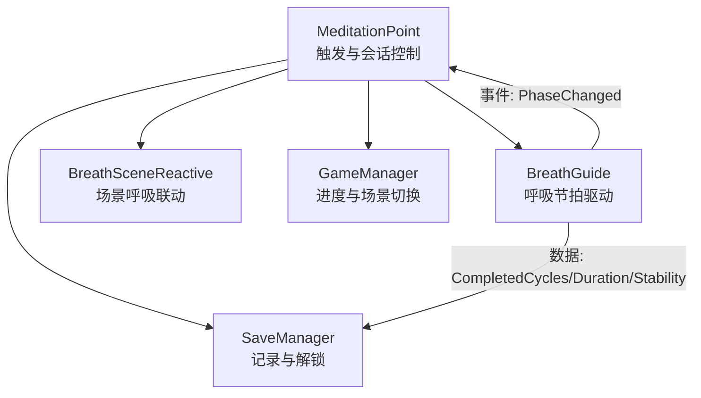
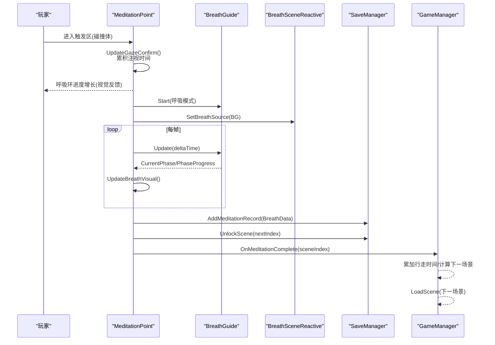
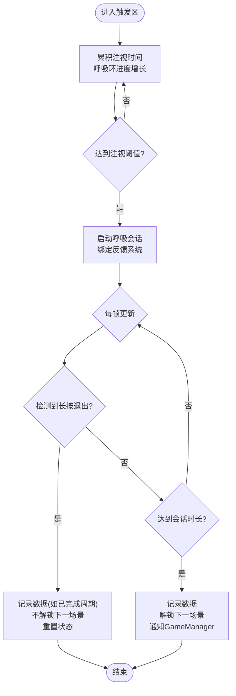
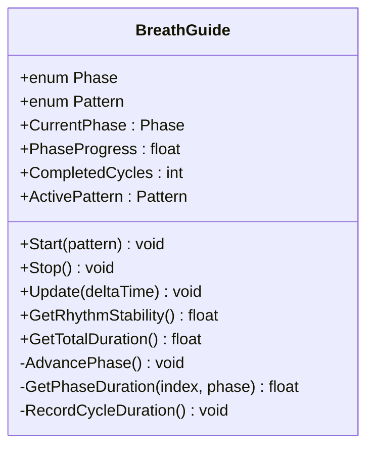
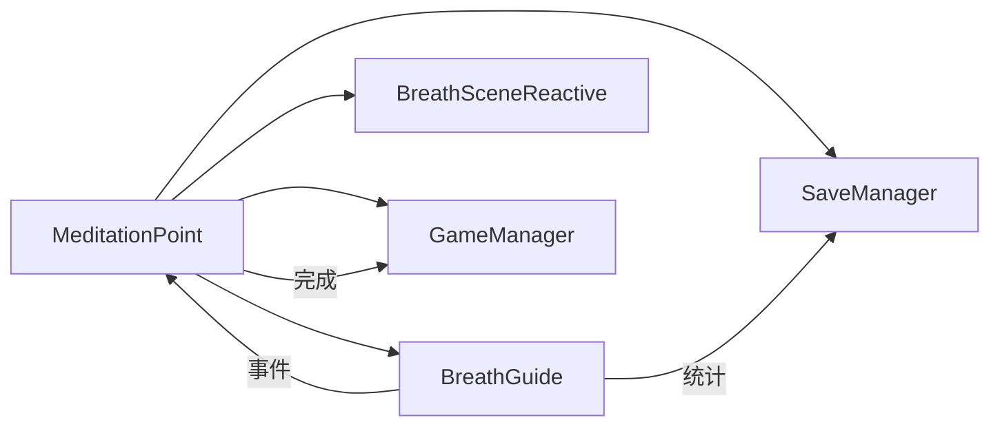

# 冥想点触发系统

<cite>
**本文引用的文件**
- [MeditationPoint.cs](file://Assets/Scripts/Meditation/MeditationPoint.cs)
- [BreathGuide.cs](file://Assets/Scripts/Meditation/BreathGuide.cs)
- [BreathData.cs](file://Assets/Scripts/Meditation/BreathData.cs)
- [GameManager.cs](file://Assets/Scripts/Core/GameManager.cs)
- [SaveManager.cs](file://Assets/Scripts/Data/SaveManager.cs)
- [BreathSceneReactive.cs](file://Assets/Scripts/Core/BreathSceneReactive.cs)
</cite>

## 目录
1. [简介](#简介)
2. [项目结构](#项目结构)
3. [核心组件](#核心组件)
4. [架构总览](#架构总览)
5. [详细组件分析](#详细组件分析)
6. [依赖关系分析](#依赖关系分析)
7. [性能考量](#性能考量)
8. [故障排查指南](#故障排查指南)
9. [结论](#结论)
10. [附录：配置与扩展](#附录：配置与扩展)

## 简介
本技术文档围绕 MeditationPoint 类，系统化阐述冥想点的触发机制、视线确认流程、交互检测逻辑、会话生命周期管理、与 GameManager 的集成方式（进度跟踪与场景状态）、视觉反馈与用户引导，以及配置与自定义开发指南。目标是帮助开发者快速理解并安全扩展该子系统。

## 项目结构
冥想点相关代码主要分布在以下模块：
- 冥想核心：MeditationPoint、BreathGuide、BreathData
- 全局状态：GameManager、SaveManager
- 场景呼吸联动：BreathSceneReactive
- 其他可选反馈：粒子、触觉、音频同步等（由 MeditationPoint 在运行时绑定）

图表来源
- [MeditationPoint.cs:101-127](file://Assets/Scripts/Meditation/MeditationPoint.cs#L101-L127)
- [BreathGuide.cs:54-102](file://Assets/Scripts/Meditation/BreathGuide.cs#L54-L102)
- [SaveManager.cs:59-76](file://Assets/Scripts/Data/SaveManager.cs#L59-L76)
- [GameManager.cs:39-49](file://Assets/Scripts/Core/GameManager.cs#L39-L49)
- [BreathSceneReactive.cs:73-91](file://Assets/Scripts/Core/BreathSceneReactive.cs#L73-L91)

章节来源
- [MeditationPoint.cs:1-346](file://Assets/Scripts/Meditation/MeditationPoint.cs#L1-L346)
- [BreathGuide.cs:1-173](file://Assets/Scripts/Meditation/BreathGuide.cs#L1-L173)
- [BreathData.cs:1-45](file://Assets/Scripts/Meditation/BreathData.cs#L1-L45)
- [GameManager.cs:1-66](file://Assets/Scripts/Core/GameManager.cs#L1-L66)
- [SaveManager.cs:1-118](file://Assets/Scripts/Data/SaveManager.cs#L1-L118)
- [BreathSceneReactive.cs:1-147](file://Assets/Scripts/Core/BreathSceneReactive.cs#L1-L147)

## 核心组件
- MeditationPoint：负责玩家进入触发区后的视线确认、会话启动/结束、退出保护、视觉环进度更新、与多反馈系统的绑定与解绑。
- BreathGuide：非 MonoBehaviour 的呼吸节拍控制器，维护阶段、进度、周期计数、节奏稳定性统计，并通过事件通知订阅者。
- SaveManager：本地 JSON 持久化，记录冥想数据、累计时长、解锁最高场景索引。
- GameManager：全局单例，记录行走时间、完成冥想后推进到下一场景或结束场景。
- BreathSceneReactive：将呼吸节律映射到场景风场、光照、雾效与发光材质，提供沉浸式“世界随呼吸变化”的效果。

章节来源
- [MeditationPoint.cs:19-65](file://Assets/Scripts/Meditation/MeditationPoint.cs#L19-L65)
- [BreathGuide.cs:10-37](file://Assets/Scripts/Meditation/BreathGuide.cs#L10-L37)
- [SaveManager.cs:13-24](file://Assets/Scripts/Data/SaveManager.cs#L13-L24)
- [GameManager.cs:6-18](file://Assets/Scripts/Core/GameManager.cs#L6-L18)
- [BreathSceneReactive.cs:6-15](file://Assets/Scripts/Core/BreathSceneReactive.cs#L6-L15)

## 架构总览
冥想点从“玩家进入触发区”开始，通过“视线确认”进入“呼吸会话”，会话期间持续驱动视觉、音频、触觉与场景联动；会话结束后记录数据、解锁场景并推进到下一场景。

图表来源
- [MeditationPoint.cs:187-211](file://Assets/Scripts/Meditation/MeditationPoint.cs#L187-L211)
- [MeditationPoint.cs:129-141](file://Assets/Scripts/Meditation/MeditationPoint.cs#L129-L141)
- [MeditationPoint.cs:213-232](file://Assets/Scripts/Meditation/MeditationPoint.cs#L213-L232)
- [MeditationPoint.cs:234-262](file://Assets/Scripts/Meditation/MeditationPoint.cs#L234-L262)
- [MeditationPoint.cs:264-280](file://Assets/Scripts/Meditation/MeditationPoint.cs#L264-L280)
- [GameManager.cs:39-49](file://Assets/Scripts/Core/GameManager.cs#L39-L49)
- [SaveManager.cs:59-76](file://Assets/Scripts/Data/SaveManager.cs#L59-L76)
- [BreathGuide.cs:54-102](file://Assets/Scripts/Meditation/BreathGuide.cs#L54-L102)

## 详细组件分析

### MeditationPoint：触发、视线确认与会话管理
- 触发与交互检测
  - 使用 Unity 碰撞体 OnTriggerEnter/OnTriggerExit 检测玩家进入/离开触发区，仅对 Tag 为 Player 的对象生效。
  - 会话中支持“长按退出”：通过 Input System 读取手柄的 menuButton/secondaryButton 是否按下，实现可中断的冥想体验。
- 视线确认系统
  - 玩家在触发区内时，按固定时长（默认 3 秒）累积注视时间；呼吸环进度随注视时间线性增长，提供明确反馈。
  - 达到阈值后启动呼吸会话。
- 会话生命周期
  - 启动：初始化 BreathGuide、绑定触觉/音频/场景联动、降低环境音音量（ducking）。
  - 运行：每帧更新呼吸节拍、渲染呼吸环进度、检查是否到达会话时长或检测到退出操作。
  - 完成：生成 BreathData 记录（含场景信息、模式、周期数、时长、节奏稳定性），写入 SaveManager，解锁下一场景，调用 GameManager 推进场景。
  - 提前退出：若已至少完成一个周期则记录数据（标记 early exit），不解锁下一场景；重置状态并等待玩家重新进入触发区。
- 视觉反馈
  - 呼吸环材质属性 _Progress 根据当前呼吸阶段与进度动态设置，提供吸气和呼气的膨胀/收缩效果。
  - 可选粒子、触觉、音频同步、场景呼吸联动在会话开始时绑定，结束时解绑。

图表来源
- [MeditationPoint.cs:187-211](file://Assets/Scripts/Meditation/MeditationPoint.cs#L187-L211)
- [MeditationPoint.cs:129-141](file://Assets/Scripts/Meditation/MeditationPoint.cs#L129-L141)
- [MeditationPoint.cs:143-166](file://Assets/Scripts/Meditation/MeditationPoint.cs#L143-L166)
- [MeditationPoint.cs:213-232](file://Assets/Scripts/Meditation/MeditationPoint.cs#L213-L232)
- [MeditationPoint.cs:264-302](file://Assets/Scripts/Meditation/MeditationPoint.cs#L264-L302)

章节来源
- [MeditationPoint.cs:101-127](file://Assets/Scripts/Meditation/MeditationPoint.cs#L101-L127)
- [MeditationPoint.cs:129-166](file://Assets/Scripts/Meditation/MeditationPoint.cs#L129-L166)
- [MeditationPoint.cs:187-211](file://Assets/Scripts/Meditation/MeditationPoint.cs#L187-L211)
- [MeditationPoint.cs:213-262](file://Assets/Scripts/Meditation/MeditationPoint.cs#L213-L262)
- [MeditationPoint.cs:264-341](file://Assets/Scripts/Meditation/MeditationPoint.cs#L264-L341)

### BreathGuide：呼吸节拍与统计
- 模式与阶段
  - 支持多种呼吸模式（如 Balanced444、Relax478、Box4444、Free），每种模式定义吸气、屏息、呼气、屏息的时长。
  - 维护当前阶段与阶段进度，每帧推进并在阶段切换时发出事件。
- 统计能力
  - 记录完成的周期数、总时长、节奏稳定性（基于周期时长的方差估算）。
- 事件驱动
  - 通过 PhaseChanged 事件让外部系统（触觉、音频、场景联动）响应阶段变化，避免轮询耦合。

图表来源
- [BreathGuide.cs:10-37](file://Assets/Scripts/Meditation/BreathGuide.cs#L10-L37)
- [BreathGuide.cs:54-102](file://Assets/Scripts/Meditation/BreathGuide.cs#L54-L102)
- [BreathGuide.cs:116-170](file://Assets/Scripts/Meditation/BreathGuide.cs#L116-L170)

章节来源
- [BreathGuide.cs:1-173](file://Assets/Scripts/Meditation/BreathGuide.cs#L1-173)

### SaveManager：数据持久化与进度解锁
- 存储位置：Application.persistentDataPath/inkridge_save.json
- 功能：
  - 添加冥想记录（包含场景、模式、周期数、时长、稳定性、是否提前退出）
  - 解锁最高场景索引
  - 累计行走时间与冥想时长、会话次数
  - 每日打卡与清理存档（测试用）

章节来源
- [SaveManager.cs:13-24](file://Assets/Scripts/Data/SaveManager.cs#L13-L24)
- [SaveManager.cs:59-76](file://Assets/Scripts/Data/SaveManager.cs#L59-L76)
- [SaveManager.cs:83-88](file://Assets/Scripts/Data/SaveManager.cs#L83-L88)

### GameManager：进度跟踪与场景流转
- 全局单例，跨场景持久化
- 功能：
  - 记录每次冥想完成时的行走时间并清零
  - 根据当前场景索引计算下一场景（超过山顶场景则跳转至结束场景）
  - 提供跳过冥想与开始游戏入口

章节来源
- [GameManager.cs:6-18](file://Assets/Scripts/Core/GameManager.cs#L6-L18)
- [GameManager.cs:39-49](file://Assets/Scripts/Core/GameManager.cs#L39-L49)
- [GameManager.cs:51-63](file://Assets/Scripts/Core/GameManager.cs#L51-L63)

### BreathSceneReactive：场景呼吸联动
- 将呼吸节律映射到：
  - 风场强度（吸气增强、呼气减弱）
  - 光源强度（萤火虫/灯笼/月亮等）
  - 雾密度（吸气变薄、呼气变浓）
  - 发光材质颜色（随呼吸明暗变化）
- 通过 SetBreathSource 接收 BreathGuide 实例，仅在会话活跃时驱动场景变化。

章节来源
- [BreathSceneReactive.cs:6-15](file://Assets/Scripts/Core/BreathSceneReactive.cs#L6-L15)
- [BreathSceneReactive.cs:73-91](file://Assets/Scripts/Core/BreathSceneReactive.cs#L73-L91)
- [BreathSceneReactive.cs:93-124](file://Assets/Scripts/Core/BreathSceneReactive.cs#L93-L124)

## 依赖关系分析
- MeditationPoint 依赖 BreathGuide 驱动节拍，依赖 SaveManager 记录数据与解锁场景，依赖 GameManager 推进场景，依赖 BreathSceneReactive 实现场景级呼吸联动。
- BreathGuide 通过事件驱动外部系统，松耦合且可扩展。
- SaveManager 与 GameManager 作为基础设施，分别负责数据持久化和全局流程控制。

图表来源
- [MeditationPoint.cs:213-232](file://Assets/Scripts/Meditation/MeditationPoint.cs#L213-L232)
- [MeditationPoint.cs:264-280](file://Assets/Scripts/Meditation/MeditationPoint.cs#L264-L280)
- [BreathGuide.cs:54-102](file://Assets/Scripts/Meditation/BreathGuide.cs#L54-L102)
- [SaveManager.cs:59-76](file://Assets/Scripts/Data/SaveManager.cs#L59-L76)
- [GameManager.cs:39-49](file://Assets/Scripts/Core/GameManager.cs#L39-L49)

章节来源
- [MeditationPoint.cs:19-65](file://Assets/Scripts/Meditation/MeditationPoint.cs#L19-L65)
- [BreathGuide.cs:10-37](file://Assets/Scripts/Meditation/BreathGuide.cs#L10-L37)
- [SaveManager.cs:13-24](file://Assets/Scripts/Data/SaveManager.cs#L13-L24)
- [GameManager.cs:6-18](file://Assets/Scripts/Core/GameManager.cs#L6-L18)
- [BreathSceneReactive.cs:6-15](file://Assets/Scripts/Core/BreathSceneReactive.cs#L6-L15)

## 性能考量
- 每帧更新开销
  - MeditationPoint 在会话中每帧更新 BreathGuide 与视觉环进度，属于轻量计算。
  - BreathSceneReactive 每帧对风场、光照、雾效、发光材质进行插值更新，注意场景中对象数量较多时可能带来额外开销。
- 材质访问优化
  - 呼吸环材质在 Start 时缓存实例，避免每帧重复查询 material 导致的额外开销。
- 输入检测
  - 使用 Input System 动态查询手柄按钮，避免旧版 Input API 在 VR 下无效的问题。
- 建议
  - 合理配置 BreathSceneReactive 的响应速度与强度范围，避免过度频繁的属性变更。
  - 在移动端或低端设备上，可适当减少参与联动的对象数量或降低更新频率。

[本节为通用性能指导，不直接分析具体文件]

## 故障排查指南
- 触发失败（进入区域无反应）
  - 检查触发器 Collider 是否正确挂载于冥想点 GameObject，并确保其 Is Trigger 已启用。
  - 确认玩家对象的 Tag 是否为 Player，否则 OnTriggerEnter 会忽略。
  - 检查是否有多个冥想点同时存在导致状态冲突。
- 视线确认不工作（呼吸环不增长）
  - 确认 _gazeHoldSeconds 配置合理，且在 UpdateGazeConfirm 中正确累积时间。
  - 检查呼吸环 Renderer 是否启用，材质是否存在并包含 _Progress 属性。
- 会话无法启动或中途停止
  - 检查 BreathGuide 是否成功 Start，且各反馈系统（触觉、音频、场景联动）是否可用。
  - 若提前退出，确保已完成至少一个周期才会记录数据；否则不会保存。
- 状态不同步（退出后立刻重启）
  - 提前退出后会设置 _awaitingReentry=true 并将 _playerInRange=false，需玩家物理离开触发区后再进入才能重新触发。
- 场景未解锁或进度丢失
  - 确认 CompleteMeditation 调用了 SaveManager.UnlockScene 与 GameManager.OnMeditationComplete。
  - 检查 SaveManager 的持久化路径与权限，确保 JSON 读写正常。
- 环境音未 ducking
  - 若场景中不存在 AmbientAudio 且未赋值备用 AudioSource，将输出警告；请确保任一可用。

章节来源
- [MeditationPoint.cs:187-211](file://Assets/Scripts/Meditation/MeditationPoint.cs#L187-L211)
- [MeditationPoint.cs:129-141](file://Assets/Scripts/Meditation/MeditationPoint.cs#L129-L141)
- [MeditationPoint.cs:213-232](file://Assets/Scripts/Meditation/MeditationPoint.cs#L213-L232)
- [MeditationPoint.cs:264-302](file://Assets/Scripts/Meditation/MeditationPoint.cs#L264-L302)
- [SaveManager.cs:29-57](file://Assets/Scripts/Data/SaveManager.cs#L29-L57)

## 结论
MeditationPoint 以简洁而稳健的方式实现了冥想点的触发、视线确认、会话管理与反馈联动。通过 BreathGuide 的事件驱动模型与 BreathSceneReactive 的场景级响应，提供了沉浸式的呼吸体验。配合 SaveManager 与 GameManager，完成了从数据记录到场景推进的完整闭环。遵循本文的配置与扩展指南，可安全地调整参数与新增功能。

[本节为总结性内容，不直接分析具体文件]

## 附录：配置与扩展

### 配置项说明（MeditationPoint）
- 场景配置
  - _sceneIndex：当前冥想点对应的场景索引（用于解锁下一场景）
  - _sceneName：场景名称（用于记录）
- 呼吸配置
  - _pattern：呼吸模式（Balanced444/Relax478/Box4444/Free）
  - _sessionDuration：会话时长（秒）
- 视线确认
  - _gazeHoldSeconds：注视确认时长（秒）
- 提前退出
  - _exitHoldSeconds：长按退出所需时长（秒）
  - _exitFeedbackInterval：退出提示脉冲间隔（秒）
- 视觉
  - _breathCircleRenderer：呼吸环渲染器（用于设置 _Progress）
- 可选反馈
  - _particles：粒子呼吸同步
  - _haptics：触觉反馈
  - _breathAudio：音频同步
  - _sceneReactive：场景呼吸联动
  - _breathFilter：环境呼吸滤波
  - _ambientAudioSource：备用环境音源
- 环境音 ducking
  - _meditationAmbientVolume：冥想期间环境音音量
  - _duckFadeSeconds：淡入淡出时长

章节来源
- [MeditationPoint.cs:21-49](file://Assets/Scripts/Meditation/MeditationPoint.cs#L21-L49)

### 扩展接口与最佳实践
- 新增呼吸模式
  - 在 BreathGuide.Pattern 中添加新枚举值，并在 PatternTimings 中补充对应时长矩阵。
  - 确保 AdvancePhase 逻辑能正确处理新模式的阶段跳转。
- 扩展视觉反馈
  - 可在 MeditationPoint.StartMeditation 中增加新的反馈绑定（例如新的 Shader 或特效），并在 EndSession 中解绑。
- 自定义退出行为
  - 修改 IsExitHeld 以适配不同平台的手柄按钮映射；保持长按退出的用户体验一致性。
- 场景联动增强
  - 在 BreathSceneReactive 中增加更多响应目标（如音效、粒子、地形变形），注意性能与平滑度。

章节来源
- [BreathGuide.cs:25-44](file://Assets/Scripts/Meditation/BreathGuide.cs#L25-L44)
- [BreathGuide.cs:116-147](file://Assets/Scripts/Meditation/BreathGuide.cs#L116-L147)
- [MeditationPoint.cs:213-232](file://Assets/Scripts/Meditation/MeditationPoint.cs#L213-L232)
- [MeditationPoint.cs:304-341](file://Assets/Scripts/Meditation/MeditationPoint.cs#L304-L341)
- [BreathSceneReactive.cs:93-124](file://Assets/Scripts/Core/BreathSceneReactive.cs#L93-L124)