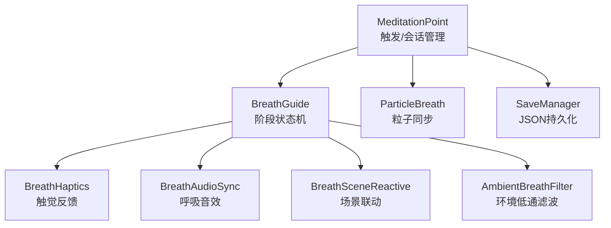
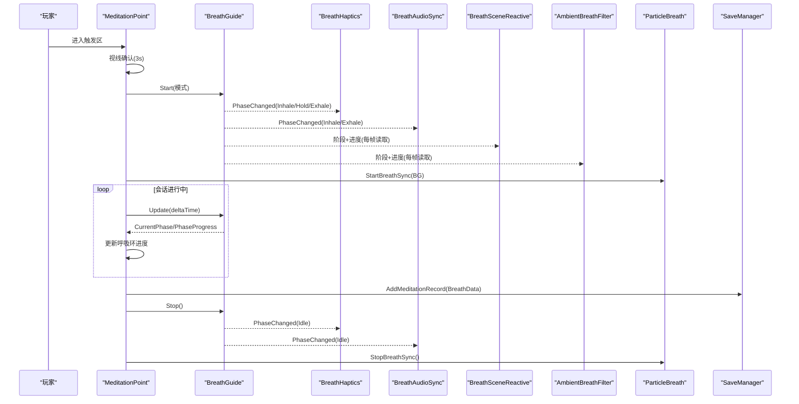
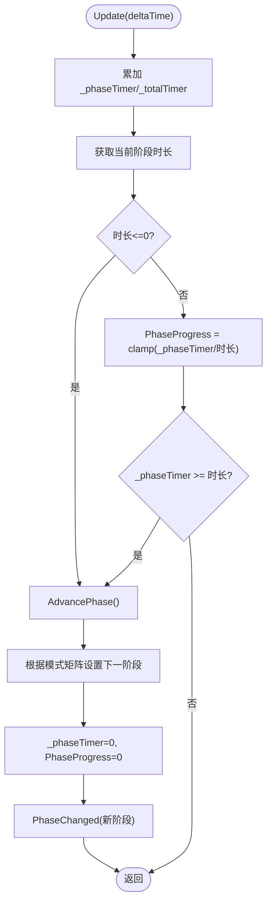
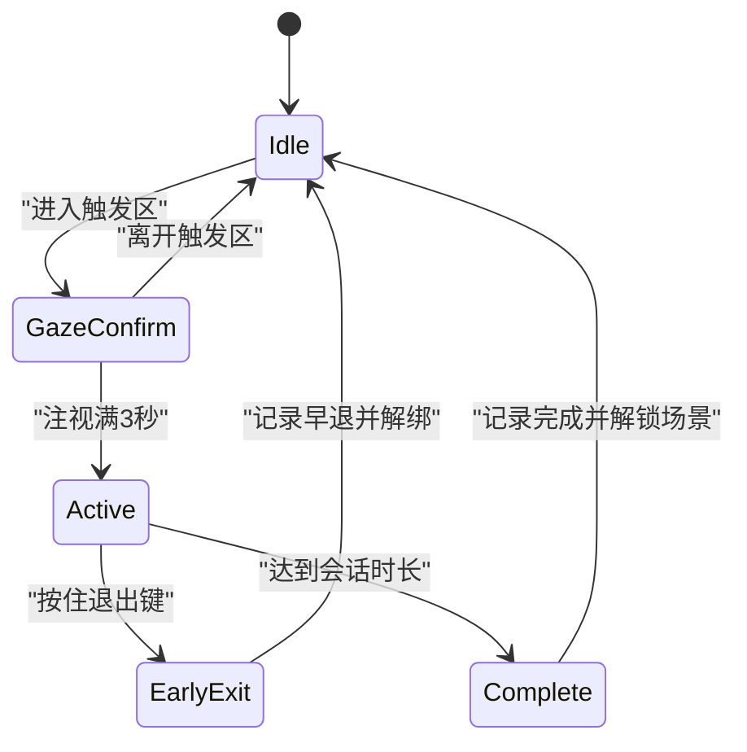
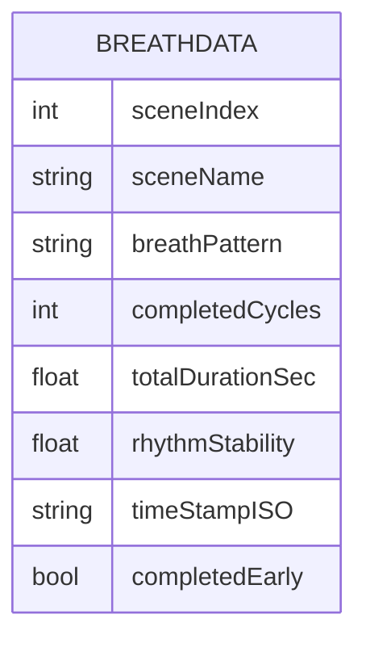
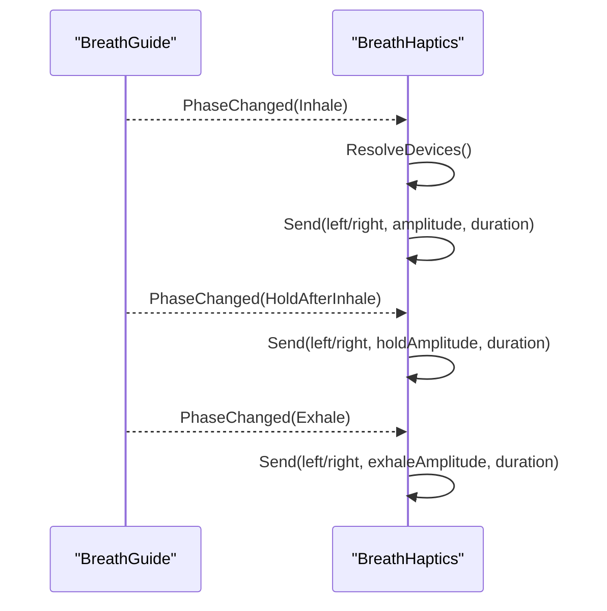
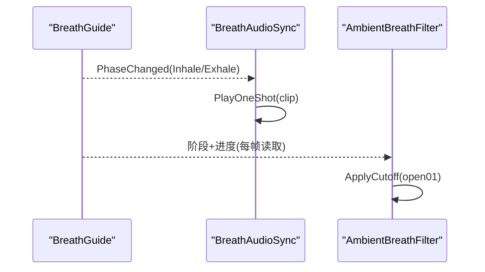
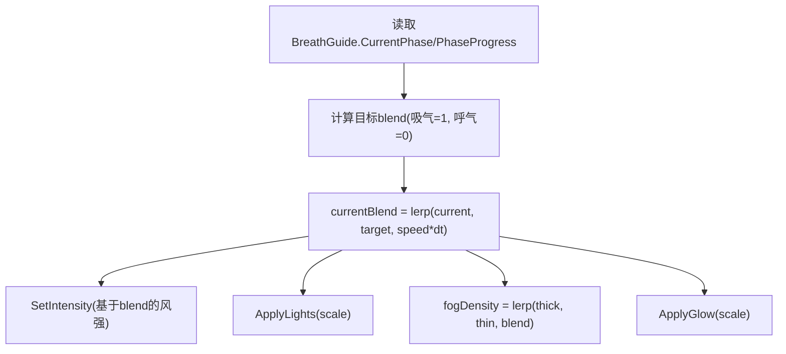
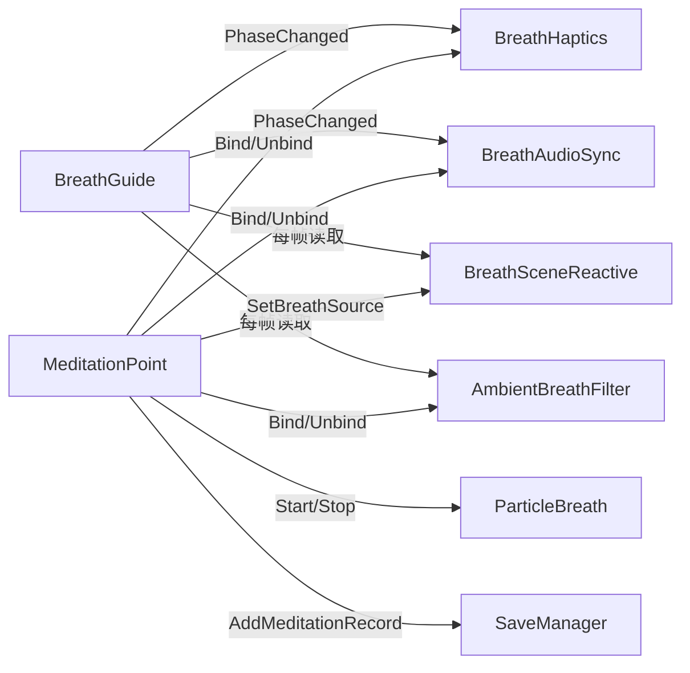

# 冥想系统

<cite>
**本文引用的文件**
- [BreathGuide.cs](file://Assets/Scripts/Meditation/BreathGuide.cs)
- [MeditationPoint.cs](file://Assets/Scripts/Meditation/MeditationPoint.cs)
- [BreathData.cs](file://Assets/Scripts/Meditation/BreathData.cs)
- [BreathHaptics.cs](file://Assets/Scripts/Meditation/BreathHaptics.cs)
- [BreathAudioSync.cs](file://Assets/Scripts/Environment/BreathAudioSync.cs)
- [BreathSceneReactive.cs](file://Assets/Scripts/Core/BreathSceneReactive.cs)
- [AmbientBreathFilter.cs](file://Assets/Scripts/Environment/AmbientBreathFilter.cs)
- [ParticleBreath.cs](file://Assets/Scripts/Environment/ParticleBreath.cs)
- [SaveManager.cs](file://Assets/Scripts/Data/SaveManager.cs)
</cite>

## 目录
1. [简介](#简介)
2. [项目结构](#项目结构)
3. [核心组件](#核心组件)
4. [架构总览](#架构总览)
5. [详细组件分析](#详细组件分析)
6. [依赖关系分析](#依赖关系分析)
7. [性能考量](#性能考量)
8. [故障排查指南](#故障排查指南)
9. [结论](#结论)
10. [附录：扩展新呼吸模式开发指南](#附录：扩展新呼吸模式开发指南)

## 简介
本技术文档面向InkRidge的冥想系统，围绕呼吸节奏管理、触发与确认、会话管理、数据持久化、触觉反馈与音频同步、以及环境联动等关键能力展开。重点解析BreathGuide类的呼吸阶段状态机与多种呼吸模式的实现原理；说明MeditationPoint的触发机制、视线确认流程与会话生命周期；描述BreathData的数据结构与JSON持久化格式；解释触觉反馈如何与呼吸阶段同步，以及音频与环境音效如何与呼吸节奏协调；最后提供扩展新呼吸模式的开发指南。

## 项目结构
冥想系统以“事件驱动 + 订阅者”的方式组织：BreathGuide作为唯一的时间与阶段源，通过PhaseChanged事件通知所有订阅者（音频、触觉、粒子、场景反应、环境滤波等）。MeditationPoint负责玩家进入触发区后的视线确认、会话启动与结束、以及各系统的绑定/解绑。数据层通过SaveManager将每次冥想记录序列化为JSON并落盘。

图表来源
- [MeditationPoint.cs:101-127](file://Assets/Scripts/Meditation/MeditationPoint.cs#L101-L127)
- [BreathGuide.cs:54-102](file://Assets/Scripts/Meditation/BreathGuide.cs#L54-L102)
- [BreathHaptics.cs:35-48](file://Assets/Scripts/Meditation/BreathHaptics.cs#L35-L48)
- [BreathAudioSync.cs:33-48](file://Assets/Scripts/Environment/BreathAudioSync.cs#L33-L48)
- [BreathSceneReactive.cs:77-91](file://Assets/Scripts/Core/BreathSceneReactive.cs#L77-L91)
- [AmbientBreathFilter.cs:30-40](file://Assets/Scripts/Environment/AmbientBreathFilter.cs#L30-L40)
- [ParticleBreath.cs:27-39](file://Assets/Scripts/Environment/ParticleBreath.cs#L27-L39)
- [SaveManager.cs:59-76](file://Assets/Scripts/Data/SaveManager.cs#L59-L76)

章节来源
- [MeditationPoint.cs:101-127](file://Assets/Scripts/Meditation/MeditationPoint.cs#L101-L127)
- [BreathGuide.cs:54-102](file://Assets/Scripts/Meditation/BreathGuide.cs#L54-L102)

## 核心组件
- BreathGuide：非MonoBehaviour的呼吸节奏控制器，维护当前阶段、进度、周期计数、模式时长表，并通过PhaseChanged事件广播阶段变化。支持平衡呼吸、放松呼吸、箱式呼吸、自由深慢呼吸四种模式。
- MeditationPoint：场景中的冥想触发点，处理玩家进入触发器、视线确认、会话计时、退出控制、视觉环更新、各子系统绑定/解绑、会话完成与早退记录。
- BreathData：可序列化数据结构，保存单次冥想的关键指标（场景、模式、完成周期、时长、稳定性、是否提前结束、时间戳），并提供ToJson/FromJson用于持久化。
- BreathHaptics：订阅BreathGuide的阶段变化，在吸气/呼气/保持阶段发出不同强度的手柄震动，支持双手同时或单手。
- BreathAudioSync：订阅阶段变化，在吸气与呼气时播放对应音效，保持静音于保持阶段，避免“节拍器感”。
- BreathSceneReactive：根据呼吸阶段平滑调整风场强度、灯光亮度、雾密度与发光材质颜色，使场景“随呼吸起伏”。
- AmbientBreathFilter：为环境音添加低通滤波器，吸气时打开高频，呼气时关闭，营造“世界随呼吸开合”的听觉空间。
- ParticleBreath：将粒子发射速率与速度方向与呼吸阶段同步，增强视觉沉浸。
- SaveManager：本地JSON存储，维护最高解锁场景、累计冥想时长、会话次数、每日打卡等。

章节来源
- [BreathGuide.cs:10-171](file://Assets/Scripts/Meditation/BreathGuide.cs#L10-L171)
- [MeditationPoint.cs:19-344](file://Assets/Scripts/Meditation/MeditationPoint.cs#L19-L344)
- [BreathData.cs:6-43](file://Assets/Scripts/Meditation/BreathData.cs#L6-L43)
- [BreathHaptics.cs:19-107](file://Assets/Scripts/Meditation/BreathHaptics.cs#L19-L107)
- [BreathAudioSync.cs:15-73](file://Assets/Scripts/Environment/BreathAudioSync.cs#L15-L73)
- [BreathSceneReactive.cs:16-145](file://Assets/Scripts/Core/BreathSceneReactive.cs#L16-L145)
- [AmbientBreathFilter.cs:15-87](file://Assets/Scripts/Environment/AmbientBreathFilter.cs#L15-L87)
- [ParticleBreath.cs:11-62](file://Assets/Scripts/Environment/ParticleBreath.cs#L11-L62)
- [SaveManager.cs:13-116](file://Assets/Scripts/Data/SaveManager.cs#L13-L116)

## 架构总览
系统采用“单一时间源 + 事件驱动”的架构：
- BreathGuide是唯一的阶段与进度提供者，每帧Update推进阶段，并在阶段切换时触发PhaseChanged事件。
- 所有表现层（音频、触觉、粒子、场景、环境滤波）均订阅该事件或在Update中读取BreathGuide的CurrentPhase与PhaseProgress进行响应。
- MeditationPoint作为编排者，负责生命周期管理与资源绑定/解绑，确保仅在会话期间激活相关效果。
- SaveManager在会话结束时写入JSON，形成不可变的历史记录。

图表来源
- [MeditationPoint.cs:129-141](file://Assets/Scripts/Meditation/MeditationPoint.cs#L129-L141)
- [MeditationPoint.cs:213-232](file://Assets/Scripts/Meditation/MeditationPoint.cs#L213-L232)
- [BreathGuide.cs:54-102](file://Assets/Scripts/Meditation/BreathGuide.cs#L54-L102)
- [BreathGuide.cs:116-147](file://Assets/Scripts/Meditation/BreathGuide.cs#L116-L147)
- [BreathHaptics.cs:61-85](file://Assets/Scripts/Meditation/BreathHaptics.cs#L61-L85)
- [BreathAudioSync.cs:53-66](file://Assets/Scripts/Environment/BreathAudioSync.cs#L53-L66)
- [BreathSceneReactive.cs:93-124](file://Assets/Scripts/Core/BreathSceneReactive.cs#L93-L124)
- [AmbientBreathFilter.cs:57-77](file://Assets/Scripts/Environment/AmbientBreathFilter.cs#L57-L77)
- [ParticleBreath.cs:27-39](file://Assets/Scripts/Environment/ParticleBreath.cs#L27-L39)
- [SaveManager.cs:59-66](file://Assets/Scripts/Data/SaveManager.cs#L59-L66)

## 详细组件分析

### BreathGuide：呼吸节奏状态机与数学模型
- 阶段枚举：Inhale、HoldAfterInhale、Exhale、HoldAfterExhale、Idle。
- 模式与时序矩阵：固定数组定义每种模式的四阶段时长（秒），包括Balanced444、Relax478、Box4444、Free（慢深呼吸）。
- 推进逻辑：每帧累加_phaseTimer与_totalTimer，按当前阶段时长计算PhaseProgress；当达到阶段时长则AdvancePhase切换到下一阶段。
- 阶段转换：依据ActivePattern的时序矩阵决定下一状态，例如从Inhale到HoldAfterInhale或Exhale，从Exhale到HoldAfterExhale或回到Inhale。
- 统计与稳定性：记录每个周期的总时长，使用均值与方差计算“节奏稳定性分数”（0-1），对固定模式始终为1。
- 事件：Start/Stop/阶段切换时触发PhaseChanged，供订阅者响应。

图表来源
- [BreathGuide.cs:79-102](file://Assets/Scripts/Meditation/BreathGuide.cs#L79-L102)
- [BreathGuide.cs:104-114](file://Assets/Scripts/Meditation/BreathGuide.cs#L104-L114)
- [BreathGuide.cs:116-147](file://Assets/Scripts/Meditation/BreathGuide.cs#L116-L147)
- [BreathGuide.cs:149-168](file://Assets/Scripts/Meditation/BreathGuide.cs#L149-L168)

章节来源
- [BreathGuide.cs:10-171](file://Assets/Scripts/Meditation/BreathGuide.cs#L10-L171)

### MeditationPoint：触发机制、视线确认与会话管理
- 触发与视线确认：玩家进入触发器后显示呼吸环，开始计时；在_gazeHoldSeconds内持续注视，环进度增长作为反馈；超时后启动冥想。
- 会话运行：每帧调用BreathGuide.Update，更新呼吸环进度；到达_sessionDuration则完成会话；支持按住控制器菜单键提前退出，带渐进触觉反馈。
- 绑定/解绑：启动时绑定BreathHaptics、BreathAudioSync、BreathSceneReactive、AmbientBreathFilter、ParticleBreath；结束时解绑并恢复环境音量。
- 完成与早退：完成会话时创建BreathData并保存到SaveManager，解锁下一场景；早退也记录但不会解锁下一场景。

图表来源
- [MeditationPoint.cs:101-127](file://Assets/Scripts/Meditation/MeditationPoint.cs#L101-L127)
- [MeditationPoint.cs:129-141](file://Assets/Scripts/Meditation/MeditationPoint.cs#L129-L141)
- [MeditationPoint.cs:143-166](file://Assets/Scripts/Meditation/MeditationPoint.cs#L143-L166)
- [MeditationPoint.cs:213-232](file://Assets/Scripts/Meditation/MeditationPoint.cs#L213-L232)
- [MeditationPoint.cs:264-341](file://Assets/Scripts/Meditation/MeditationPoint.cs#L264-L341)

章节来源
- [MeditationPoint.cs:19-344](file://Assets/Scripts/Meditation/MeditationPoint.cs#L19-L344)

### BreathData：数据结构与持久化格式
- 字段：sceneIndex、sceneName、breathPattern、completedCycles、totalDurationSec、rhythmStability、timeStampISO、completedEarly。
- 序列化：ToJson使用Unity JsonUtility生成JSON字符串；FromJson反序列化回对象。
- 持久化：SaveManager.AddMeditationRecord将BreathData转为JSON追加到meditationRecords列表，并累计totalMeditationTime与totalSessions；UnlockScene更新最高解锁场景。

图表来源
- [BreathData.cs:6-43](file://Assets/Scripts/Meditation/BreathData.cs#L6-L43)
- [SaveManager.cs:15-24](file://Assets/Scripts/Data/SaveManager.cs#L15-L24)
- [SaveManager.cs:59-76](file://Assets/Scripts/Data/SaveManager.cs#L59-L76)

章节来源
- [BreathData.cs:6-43](file://Assets/Scripts/Meditation/BreathData.cs#L6-L43)
- [SaveManager.cs:13-116](file://Assets/Scripts/Data/SaveManager.cs#L13-L116)

### 触觉反馈系统：与呼吸阶段的同步
- 订阅机制：Bind时将BreathHaptics订阅到BreathGuide.PhaseChanged；Unbind时取消订阅。
- 阶段映射：Inhale与Exhale分别使用不同振幅；Hold阶段使用较小振幅；Idle不触发。
- 设备处理：每次阶段变化重新解析左右手InputDevice，防止设备掉线导致震动失效；发送时使用SendHapticImpulse，幅度与持续时间由配置决定。
- 额外反馈：退出时的渐进触觉提示，帮助盲操作感知退出充能。

图表来源
- [BreathHaptics.cs:35-48](file://Assets/Scripts/Meditation/BreathHaptics.cs#L35-L48)
- [BreathHaptics.cs:61-85](file://Assets/Scripts/Meditation/BreathHaptics.cs#L61-L85)
- [BreathHaptics.cs:87-101](file://Assets/Scripts/Meditation/BreathHaptics.cs#L87-L101)

章节来源
- [BreathHaptics.cs:19-107](file://Assets/Scripts/Meditation/BreathHaptics.cs#L19-L107)

### 音频同步系统：呼吸节奏与环境音效协调
- 订阅机制：BreathAudioSync订阅PhaseChanged，在Inhale与Exhale播放对应音效，Hold阶段保持静音。
- 场景联动：AmbientBreathFilter为环境音添加低通滤波器，吸气时打开高频（更开阔），呼气时降低截止频率（更闷），营造“世界随呼吸开合”的空间感。
- 音量控制：MeditationPoint在会话开始时降低环境音量（Duck），结束后恢复。

图表来源
- [BreathAudioSync.cs:33-48](file://Assets/Scripts/Environment/BreathAudioSync.cs#L33-L48)
- [BreathAudioSync.cs:53-66](file://Assets/Scripts/Environment/BreathAudioSync.cs#L53-L66)
- [AmbientBreathFilter.cs:57-77](file://Assets/Scripts/Environment/AmbientBreathFilter.cs#L57-L77)
- [MeditationPoint.cs:228-231](file://Assets/Scripts/Meditation/MeditationPoint.cs#L228-L231)

章节来源
- [BreathAudioSync.cs:15-73](file://Assets/Scripts/Environment/BreathAudioSync.cs#L15-L73)
- [AmbientBreathFilter.cs:15-87](file://Assets/Scripts/Environment/AmbientBreathFilter.cs#L15-L87)
- [MeditationPoint.cs:228-231](file://Assets/Scripts/Meditation/MeditationPoint.cs#L228-L231)

### 环境与粒子联动：让场景“呼吸”
- BreathSceneReactive：根据BreathGuide的CurrentPhase与PhaseProgress，平滑调整风场强度、灯光亮度、雾密度与发光材质颜色；吸气时风强提升、光变亮、雾变薄；呼气时回落。
- ParticleBreath：将粒子发射速率与速度方向与呼吸阶段同步，吸气向外扩散，呼气向内收敛。

图表来源
- [BreathSceneReactive.cs:93-124](file://Assets/Scripts/Core/BreathSceneReactive.cs#L93-L124)
- [ParticleBreath.cs:41-61](file://Assets/Scripts/Environment/ParticleBreath.cs#L41-L61)

章节来源
- [BreathSceneReactive.cs:16-145](file://Assets/Scripts/Core/BreathSceneReactive.cs#L16-L145)
- [ParticleBreath.cs:11-62](file://Assets/Scripts/Environment/ParticleBreath.cs#L11-L62)

## 依赖关系分析
- 松耦合：BreathGuide不直接引用任何表现层组件，仅通过事件暴露阶段变化；表现层通过Bind订阅，解耦清晰。
- 中心编排：MeditationPoint集中管理生命周期与资源绑定，避免多处分散初始化导致的遗漏。
- 外部依赖：
  - Unity Input System：用于检测控制器按键与手柄设备。
  - Unity Audio：AudioSource与AudioLowPassFilter用于音效与环境滤波。
  - Unity ParticleSystem：用于粒子同步。
  - Unity RenderSettings：用于雾密度控制。
  - JSON序列化：用于数据持久化。

图表来源
- [BreathGuide.cs:54-102](file://Assets/Scripts/Meditation/BreathGuide.cs#L54-L102)
- [BreathHaptics.cs:35-48](file://Assets/Scripts/Meditation/BreathHaptics.cs#L35-L48)
- [BreathAudioSync.cs:33-48](file://Assets/Scripts/Environment/BreathAudioSync.cs#L33-L48)
- [BreathSceneReactive.cs:77-91](file://Assets/Scripts/Core/BreathSceneReactive.cs#L77-L91)
- [AmbientBreathFilter.cs:30-40](file://Assets/Scripts/Environment/AmbientBreathFilter.cs#L30-L40)
- [ParticleBreath.cs:27-39](file://Assets/Scripts/Environment/ParticleBreath.cs#L27-L39)
- [SaveManager.cs:59-76](file://Assets/Scripts/Data/SaveManager.cs#L59-L76)

章节来源
- [MeditationPoint.cs:213-232](file://Assets/Scripts/Meditation/MeditationPoint.cs#L213-L232)
- [BreathGuide.cs:54-102](file://Assets/Scripts/Meditation/BreathGuide.cs#L54-L102)

## 性能考量
- 事件驱动减少轮询：BreathGuide仅在阶段切换时触发事件，表现层按需订阅，避免每帧复杂计算。
- 材质实例缓存：MeditationPoint缓存呼吸环材质实例，避免每帧读取Renderer.material带来的开销。
- 设备重解析优化：BreathHaptics在阶段变化时重新解析输入设备，而非每帧，降低频繁查询成本。
- 平滑插值：BreathSceneReactive与AmbientBreathFilter使用Lerp平滑过渡，避免突变造成的性能抖动与体验割裂。
- 音频与粒子：仅在会话期间启用，结束后立即停止，减少运行时资源占用。

[本节为通用指导，不直接分析具体文件]

## 故障排查指南
- 无触觉反馈：
  - 检查ComfortSettings.HapticsEnabled是否开启。
  - 确认Bind已正确调用且PhaseChanged事件已订阅。
  - 验证左右手InputDevice是否有效，必要时在阶段变化时重新解析。
- 无呼吸音效：
  - 确认BreathAudioSync已Bind且inhale/exhale音频片段已赋值。
  - 检查AudioSource是否可用，音量与循环设置是否正确。
- 环境滤波无效：
  - 确认AmbientBreathFilter已Bind且子节点存在AudioSource与AudioLowPassFilter。
  - 检查_openCutoff与_closedCutoff配置是否合理。
- 场景联动异常：
  - 确认BreathSceneReactive已SetBreathSource且WindSystem可用。
  - 检查灯光与发光渲染器的基础值是否正确采集。
- 数据未保存：
  - 确认SaveManager路径可写，JSON序列化成功。
  - 检查AddMeditationRecord与UnlockScene是否在适当时机调用。

章节来源
- [BreathHaptics.cs:55-85](file://Assets/Scripts/Meditation/BreathHaptics.cs#L55-L85)
- [BreathAudioSync.cs:50-66](file://Assets/Scripts/Environment/BreathAudioSync.cs#L50-L66)
- [AmbientBreathFilter.cs:42-55](file://Assets/Scripts/Environment/AmbientBreathFilter.cs#L42-L55)
- [BreathSceneReactive.cs:51-71](file://Assets/Scripts/Core/BreathSceneReactive.cs#L51-L71)
- [SaveManager.cs:29-57](file://Assets/Scripts/Data/SaveManager.cs#L29-L57)

## 结论
InkRidge冥想系统通过BreathGuide的严格状态机与事件驱动架构，实现了多模式呼吸节奏的统一管理；MeditationPoint作为编排者，将触发、确认、会话、持久化与多系统联动整合为一套稳定可靠的流程。触觉与音频同步增强了闭眼跟随的体验，环境联动提升了沉浸感。数据持久化保证了历史记录与进度解锁的可信性。整体设计清晰、可扩展性强，便于后续新增呼吸模式与表现层效果。

[本节为总结，不直接分析具体文件]

## 附录：扩展新呼吸模式开发指南
- 新增模式步骤：
  1. 在BreathGuide.Pattern中添加新枚举项。
  2. 在PatternTimings矩阵中为新模式添加四阶段时长（秒），顺序为Inhale、HoldAfterInhale、Exhale、HoldAfterExhale。
  3. 若需要特殊行为（如自由模式），可在GetPhaseDuration或AdvancePhase中增加分支逻辑。
  4. 在MeditationPoint中暴露新的默认模式选项，以便场景配置。
  5. 测试各阶段切换与事件广播，确保订阅者正常响应。
- 注意事项：
  - 保持阶段时长为非负数，避免零时长导致无限切换。
  - 若引入新阶段，需同步更新BreathGuide的状态机与所有订阅者的处理逻辑。
  - 更新BreathData.breathPattern显示名称，便于数据分析。
  - 考虑新增模式对触觉与音频的影响，必要时调整振幅与音效选择。

章节来源
- [BreathGuide.cs:25-44](file://Assets/Scripts/Meditation/BreathGuide.cs#L25-L44)
- [BreathGuide.cs:104-114](file://Assets/Scripts/Meditation/BreathGuide.cs#L104-L114)
- [BreathGuide.cs:116-147](file://Assets/Scripts/Meditation/BreathGuide.cs#L116-L147)
- [MeditationPoint.cs:25-27](file://Assets/Scripts/Meditation/MeditationPoint.cs#L25-L27)