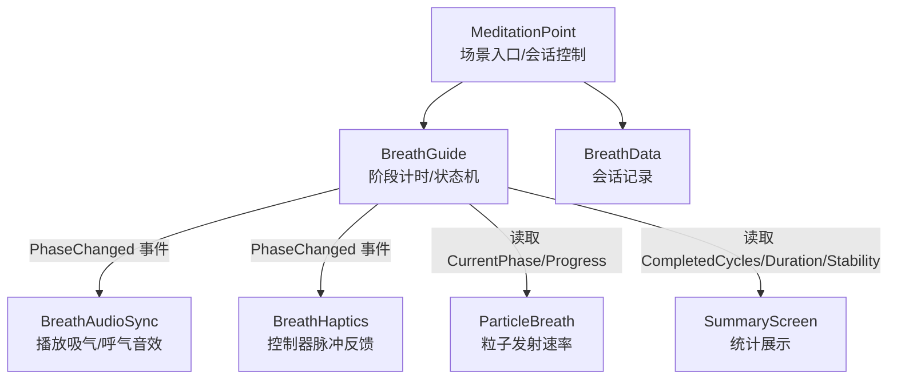
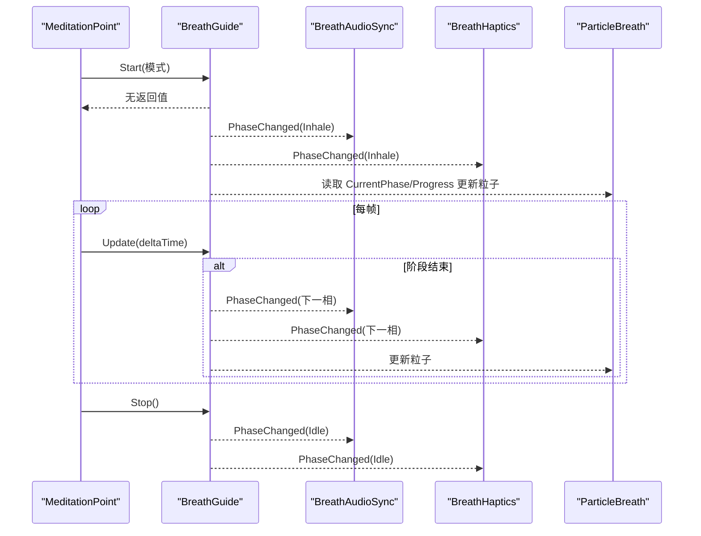
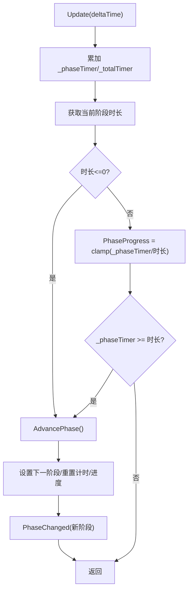
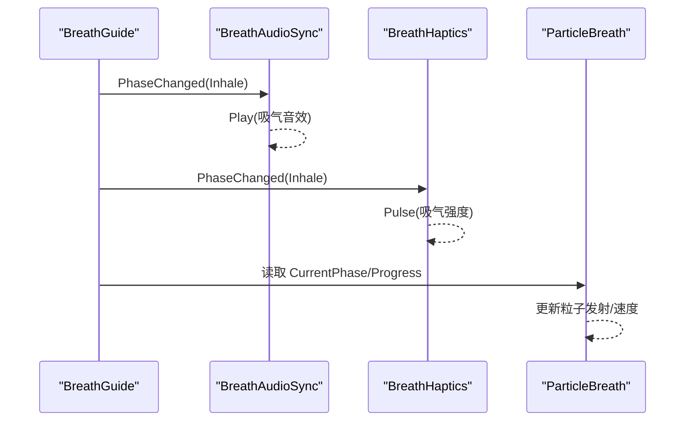
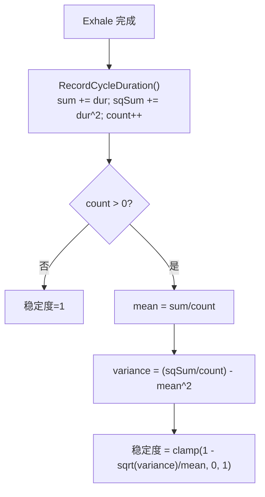
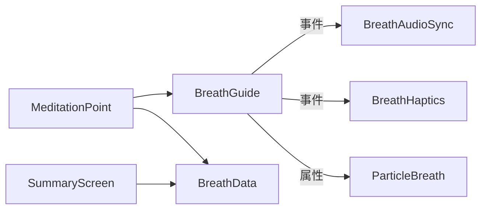

# 呼吸指导系统

<cite>
**本文引用的文件**
- [BreathGuide.cs](file://Assets/Scripts/Meditation/BreathGuide.cs)
- [MeditationPoint.cs](file://Assets/Scripts/Meditation/MeditationPoint.cs)
- [BreathAudioSync.cs](file://Assets/Scripts/Environment/BreathAudioSync.cs)
- [BreathHaptics.cs](file://Assets/Scripts/Meditation/BreathHaptics.cs)
- [BreathData.cs](file://Assets/Scripts/Meditation/BreathData.cs)
- [ParticleBreath.cs](file://Assets/Scripts/Environment/ParticleBreath.cs)
- [SummaryScreen.cs](file://Assets/Scripts/UI/SummaryScreen.cs)
</cite>

## 目录
1. [简介](#简介)
2. [项目结构](#项目结构)
3. [核心组件](#核心组件)
4. [架构总览](#架构总览)
5. [详细组件分析](#详细组件分析)
6. [依赖关系分析](#依赖关系分析)
7. [性能考量](#性能考量)
8. [故障排查指南](#故障排查指南)
9. [结论](#结论)
10. [附录：扩展新呼吸模式指南](#附录扩展新呼吸模式指南)

## 简介
本技术文档围绕 BreathGuide 类展开，系统性说明呼吸节奏管理机制、Phase 状态机设计、四种呼吸模式的实现与调度、事件驱动架构中 PhaseChanged 的工作机制、订阅者响应方式、周期统计（稳定性与总时长）以及扩展新模式的开发指南。同时提供算法数学模型分析与性能优化建议，帮助开发者理解并安全地扩展该模块。

## 项目结构
BreathGuide 作为非 MonoBehaviour 的核心控制器，由场景中的 MeditationPoint 实例化并驱动；音频同步、触觉反馈、粒子系统与场景反应等子系统通过订阅 PhaseChanged 事件进行解耦联动。数据记录通过 BreathData 序列化保存，并在 UI SummaryScreen 中汇总展示。

图表来源
- [MeditationPoint.cs:66-127](file://Assets/Scripts/Meditation/MeditationPoint.cs#L66-L127)
- [BreathGuide.cs:10-171](file://Assets/Scripts/Meditation/BreathGuide.cs#L10-L171)
- [BreathAudioSync.cs:33-66](file://Assets/Scripts/Environment/BreathAudioSync.cs#L33-L66)
- [BreathHaptics.cs:35-85](file://Assets/Scripts/Meditation/BreathHaptics.cs#L35-L85)
- [ParticleBreath.cs:27-43](file://Assets/Scripts/Environment/ParticleBreath.cs#L27-L43)
- [SummaryScreen.cs:35-50](file://Assets/Scripts/UI/SummaryScreen.cs#L35-L50)

章节来源
- [MeditationPoint.cs:66-127](file://Assets/Scripts/Meditation/MeditationPoint.cs#L66-L127)
- [BreathGuide.cs:10-171](file://Assets/Scripts/Meditation/BreathGuide.cs#L10-L171)

## 核心组件
- BreathGuide：呼吸节奏的状态机与计时器，维护当前阶段、进度、完成循环数、活跃模式，并通过事件通知订阅者。
- MeditationPoint：场景级控制器，负责启动/停止会话、更新视觉环、绑定/解绑各子系统、记录与解锁场景。
- BreathAudioSync：订阅 PhaseChanged，在吸气/呼气阶段播放对应音效。
- BreathHaptics：订阅 PhaseChanged，在各阶段触发不同强度的控制器脉冲。
- ParticleBreath：根据当前阶段与进度驱动粒子系统发射速率与速度方向。
- BreathData：可序列化的单次冥想会话记录，包含模式、循环数、总时长、稳定度等。
- SummaryScreen：从持久化数据中汇总本次/累计的冥想时间、呼吸循环次数与稳定度。

章节来源
- [BreathGuide.cs:10-171](file://Assets/Scripts/Meditation/BreathGuide.cs#L10-L171)
- [MeditationPoint.cs:66-341](file://Assets/Scripts/Meditation/MeditationPoint.cs#L66-L341)
- [BreathAudioSync.cs:1-74](file://Assets/Scripts/Environment/BreathAudioSync.cs#L1-L74)
- [BreathHaptics.cs:1-109](file://Assets/Scripts/Meditation/BreathHaptics.cs#L1-L109)
- [ParticleBreath.cs:1-43](file://Assets/Scripts/Environment/ParticleBreath.cs#L1-L43)
- [BreathData.cs:1-45](file://Assets/Scripts/Meditation/BreathData.cs#L1-L45)
- [SummaryScreen.cs:35-50](file://Assets/Scripts/UI/SummaryScreen.cs#L35-L50)

## 架构总览
BreathGuide 采用“事件驱动 + 状态机”的架构：
- 状态机：Phase 枚举定义 Inhale、HoldAfterInhale、Exhale、HoldAfterExhale、Idle 五个阶段。
- 计时推进：每帧调用 Update(deltaTime)，累加阶段计时与总计时，按当前模式查表得到阶段时长，达到阈值后切换阶段。
- 事件广播：每次阶段切换（含首次 Inhale 与最终 Idle）触发 PhaseChanged，订阅者据此执行副作用（播放音效、震动、更新粒子、调整环境光等）。
- 统计：每个完整循环结束时记录周期时长，用于计算节奏稳定度；同时累计总时长。

图表来源
- [MeditationPoint.cs:213-232](file://Assets/Scripts/Meditation/MeditationPoint.cs#L213-L232)
- [BreathGuide.cs:54-102](file://Assets/Scripts/Meditation/BreathGuide.cs#L54-L102)
- [BreathAudioSync.cs:33-66](file://Assets/Scripts/Environment/BreathAudioSync.cs#L33-L66)
- [BreathHaptics.cs:35-85](file://Assets/Scripts/Meditation/BreathHaptics.cs#L35-L85)
- [ParticleBreath.cs:27-43](file://Assets/Scripts/Environment/ParticleBreath.cs#L27-L43)

## 详细组件分析

### BreathGuide：状态机与计时引擎
- 状态与进度
  - CurrentPhase：当前阶段（Inhale/HoldAfterInhale/Exhale/HoldAfterExhale/Idle）。
  - PhaseProgress：当前阶段内归一化进度（0~1），供视觉与粒子使用。
  - CompletedCycles：完成的完整呼吸循环计数。
  - ActivePattern：当前激活的模式（Balanced444/Relax478/Box4444/Free）。
- 模式与时序
  - PatternTimings 二维数组以列表示四个阶段时长（秒），行对应不同模式。
  - GetPhaseDuration 根据当前阶段返回对应时长；AdvancePhase 依据模式配置决定下一阶段。
- 事件与生命周期
  - Start(pattern)：初始化状态、重置计时与统计，进入 Inhale 并广播 PhaseChanged。
  - Update(deltaTime)：每帧推进计时与进度，到达阶段边界时切换阶段并广播事件。
  - Stop()：置为 Idle，重置进度并广播事件。
- 统计
  - RecordCycleDuration：在 Exhale 完成后记录一个周期的理论时长（四阶段之和），累加均值与平方和。
  - GetRhythmStability：基于方差与均值计算 0~1 的稳定度分数；固定模式下恒为 1。
  - GetTotalDuration：返回会话总时长。

图表来源
- [BreathGuide.cs:79-147](file://Assets/Scripts/Meditation/BreathGuide.cs#L79-L147)

章节来源
- [BreathGuide.cs:10-171](file://Assets/Scripts/Meditation/BreathGuide.cs#L10-L171)

### 四种呼吸模式的实现与调度
- Balanced444（4-4-4）：吸气4s → 屏息4s → 呼气4s → 直接进入下一次吸气。
- Relax478（4-7-8）：吸气4s → 屏息7s → 呼气8s → 直接进入下一次吸气。
- Box4444（4-4-4-4）：吸气4s → 屏息4s → 呼气4s → 屏息4s → 回到吸气。
- Free（慢深呼吸）：默认配置为吸气6s → 屏息2s → 呼气8s → 直接进入下一次吸气。
- 调度逻辑：AdvancePhase 根据当前阶段与模式配置表决定下一阶段；当某阶段时长为0时立即跳过。

章节来源
- [BreathGuide.cs:25-44](file://Assets/Scripts/Meditation/BreathGuide.cs#L25-L44)
- [BreathGuide.cs:104-147](file://Assets/Scripts/Meditation/BreathGuide.cs#L104-L147)

### 事件驱动架构：PhaseChanged 工作机制与订阅者响应
- 发布方：BreathGuide 在阶段切换时触发 PhaseChanged(phase)。
- 订阅方：
  - BreathAudioSync：在 Inhale/Exhale 播放对应音效；Hold 阶段保持静音。
  - BreathHaptics：在所有阶段（除 Idle）触发不同强度脉冲；支持设备重连与双掌输出。
  - ParticleBreath：根据 CurrentPhase 与 PhaseProgress 调整粒子发射与速度方向。
  - MeditationPoint：将 BreathGuide 绑定到上述组件，并在会话结束时解绑。
- 解耦优势：新增订阅者无需修改 BreathGuide，只需订阅 PhaseChanged 即可接入。

图表来源
- [BreathGuide.cs:116-147](file://Assets/Scripts/Meditation/BreathGuide.cs#L116-L147)
- [BreathAudioSync.cs:53-66](file://Assets/Scripts/Environment/BreathAudioSync.cs#L53-L66)
- [BreathHaptics.cs:61-85](file://Assets/Scripts/Meditation/BreathHaptics.cs#L61-L85)
- [ParticleBreath.cs:41-43](file://Assets/Scripts/Environment/ParticleBreath.cs#L41-L43)

章节来源
- [BreathGuide.cs:14-23](file://Assets/Scripts/Meditation/BreathGuide.cs#L14-L23)
- [BreathAudioSync.cs:33-66](file://Assets/Scripts/Environment/BreathAudioSync.cs#L33-L66)
- [BreathHaptics.cs:35-85](file://Assets/Scripts/Meditation/BreathHaptics.cs#L35-L85)
- [MeditationPoint.cs:213-232](file://Assets/Scripts/Meditation/MeditationPoint.cs#L213-L232)

### 呼吸周期统计：稳定性与总时长
- 总时长：_totalTimer 自 Start 起累计，Stop 时冻结；GetTotalDuration 暴露给外部。
- 周期时长记录：在 Exhale 完成后，将四阶段时长相加作为一次周期时长，累加至 sum 与 sqSum，并递增计数。
- 稳定度计算：稳定度 = clamp(1 - sqrt(variance)/mean, 0, 1)。对于固定模式，周期时长恒定，方差为0，稳定度恒为1。
- 数据持久化：MeditationPoint 在会话完成或提前退出时构造 BreathData，写入 SaveManager；SummaryScreen 读取并展示。

图表来源
- [BreathGuide.cs:149-168](file://Assets/Scripts/Meditation/BreathGuide.cs#L149-L168)
- [MeditationPoint.cs:264-277](file://Assets/Scripts/Meditation/MeditationPoint.cs#L264-L277)
- [SummaryScreen.cs:35-50](file://Assets/Scripts/UI/SummaryScreen.cs#L35-L50)

章节来源
- [BreathGuide.cs:149-168](file://Assets/Scripts/Meditation/BreathGuide.cs#L149-L168)
- [MeditationPoint.cs:264-277](file://Assets/Scripts/Meditation/MeditationPoint.cs#L264-L277)
- [BreathData.cs:1-45](file://Assets/Scripts/Meditation/BreathData.cs#L1-L45)
- [SummaryScreen.cs:35-50](file://Assets/Scripts/UI/SummaryScreen.cs#L35-L50)

## 依赖关系分析
- 耦合与内聚
  - BreathGuide 高内聚：仅关注状态、计时、统计与事件发布，不直接依赖渲染或音频。
  - 订阅者低耦合：通过事件接口接入，便于替换与扩展。
- 直接依赖
  - MeditationPoint 依赖 BreathGuide 的生命周期方法（Start/Update/Stop）与属性（CurrentPhase/PhaseProgress/CompletedCycles）。
  - BreathAudioSync、BreathHaptics、ParticleBreath 依赖 PhaseChanged 事件。
- 间接依赖
  - SummaryScreen 依赖 BreathData 的 JSON 序列化与 SaveManager 的数据存取。
- 潜在风险
  - 若新增模式未正确配置时长，可能导致阶段瞬间切换或卡住。
  - 设备热插拔导致 Haptics 设备失效需重新解析（已内置处理）。

图表来源
- [BreathGuide.cs:10-171](file://Assets/Scripts/Meditation/BreathGuide.cs#L10-L171)
- [MeditationPoint.cs:66-341](file://Assets/Scripts/Meditation/MeditationPoint.cs#L66-L341)
- [BreathAudioSync.cs:1-74](file://Assets/Scripts/Environment/BreathAudioSync.cs#L1-L74)
- [BreathHaptics.cs:1-109](file://Assets/Scripts/Meditation/BreathHaptics.cs#L1-L109)
- [ParticleBreath.cs:1-43](file://Assets/Scripts/Environment/ParticleBreath.cs#L1-L43)
- [BreathData.cs:1-45](file://Assets/Scripts/Meditation/BreathData.cs#L1-L45)
- [SummaryScreen.cs:35-50](file://Assets/Scripts/UI/SummaryScreen.cs#L35-L50)

章节来源
- [BreathGuide.cs:10-171](file://Assets/Scripts/Meditation/BreathGuide.cs#L10-L171)
- [MeditationPoint.cs:66-341](file://Assets/Scripts/Meditation/MeditationPoint.cs#L66-L341)

## 性能考量
- 事件开销：PhaseChanged 仅在阶段切换时触发，频率低，开销可控。
- 每帧更新：BreathGuide.Update 仅做加法与比较，复杂度 O(1)。
- 资源访问：MeditationPoint 缓存材质引用避免每帧重复实例化；BreathHaptics 在事件回调中按需解析输入设备，减少无效调用。
- 建议
  - 避免在 PhaseChanged 回调中进行昂贵操作（如大量对象分配）。
  - 对粒子系统、光照等视觉效果使用节流或平滑过渡，避免突变。
  - 在低端设备上可降低订阅者数量或降低反馈强度。

[本节为通用性能建议，不直接分析具体代码]

## 故障排查指南
- 音频未播放
  - 检查 BreathAudioSync 是否已 Bind(BreathGuide) 且 AudioClip 已赋值。
  - 确认 IsConfigured 为真；确保 AudioSource 存在且音量合理。
- 触觉无反馈
  - 检查 ComfortSettings.HapticsEnabled 是否启用。
  - 确认控制器设备有效（HasController），必要时重新解析设备。
- 视觉环不变化
  - 确认 MeditationPoint 已正确设置 _breathCircleMat 并传入 ProgressId。
  - 检查 UpdateBreathVisual 中阶段到进度的映射是否正确。
- 统计异常
  - 若稳定度始终为 1，属于预期行为（固定模式）。
  - 若稳定度为 0，检查是否存在异常短周期或模式配置错误。

章节来源
- [BreathAudioSync.cs:50-72](file://Assets/Scripts/Environment/BreathAudioSync.cs#L50-L72)
- [BreathHaptics.cs:55-101](file://Assets/Scripts/Meditation/BreathHaptics.cs#L55-L101)
- [MeditationPoint.cs:234-262](file://Assets/Scripts/Meditation/MeditationPoint.cs#L234-L262)
- [BreathGuide.cs:161-168](file://Assets/Scripts/Meditation/BreathGuide.cs#L161-L168)

## 结论
BreathGuide 以简洁的状态机与事件驱动实现了可扩展、可观测的呼吸节奏管理。其清晰的职责划分使音频、触觉、粒子与 UI 统计能够松耦合接入。四种预设模式覆盖常见冥想节奏，统计功能提供客观反馈。通过遵循本文档的扩展指南，可安全添加新模式并保持系统稳定性与性能。

[本节为总结性内容，不直接分析具体代码]

## 附录：扩展新呼吸模式指南
- 步骤
  1. 扩展 Pattern 枚举：新增枚举值（例如 CustomX_Y_Z）。
  2. 扩展 PatternTimings 表格：为新模式增加一行，按顺序填写 Inhale、HoldAfterInhale、Exhale、HoldAfterExhale 的时长（秒）。允许某阶段为 0 以跳过。
  3. 验证阶段转换：确保 AdvancePhase 的逻辑能正确处理新阶段的跳转（当前 switch 分支基于现有阶段与配置表，通常无需修改）。
  4. 测试订阅者行为：确认 BreathAudioSync、BreathHaptics、ParticleBreath 在新阶段下表现符合预期。
  5. 更新 UI 与配置：在 MeditationPoint 的 Inspector 中可选择新模式；在 SummaryScreen 中显示新模式名称。
- 注意事项
  - 时长必须为非负数；0 表示跳过该阶段。
  - 若引入可变时长模式（如 Free），请评估稳定度计算的合理性（当前公式适用于固定周期）。
  - 如需自定义 Hold 阶段音效/触觉策略，可在订阅者中针对新阶段分支处理。
- 示例路径参考
  - 模式枚举与表格：[BreathGuide.cs:25-44](file://Assets/Scripts/Meditation/BreathGuide.cs#L25-L44)
  - 阶段时长查询与切换：[BreathGuide.cs:104-147](file://Assets/Scripts/Meditation/BreathGuide.cs#L104-L147)
  - 订阅者响应：[BreathAudioSync.cs:53-66](file://Assets/Scripts/Environment/BreathAudioSync.cs#L53-L66)、[BreathHaptics.cs:61-85](file://Assets/Scripts/Meditation/BreathHaptics.cs#L61-L85)

章节来源
- [BreathGuide.cs:25-44](file://Assets/Scripts/Meditation/BreathGuide.cs#L25-L44)
- [BreathGuide.cs:104-147](file://Assets/Scripts/Meditation/BreathGuide.cs#L104-L147)
- [BreathAudioSync.cs:53-66](file://Assets/Scripts/Environment/BreathAudioSync.cs#L53-L66)
- [BreathHaptics.cs:61-85](file://Assets/Scripts/Meditation/BreathHaptics.cs#L61-L85)