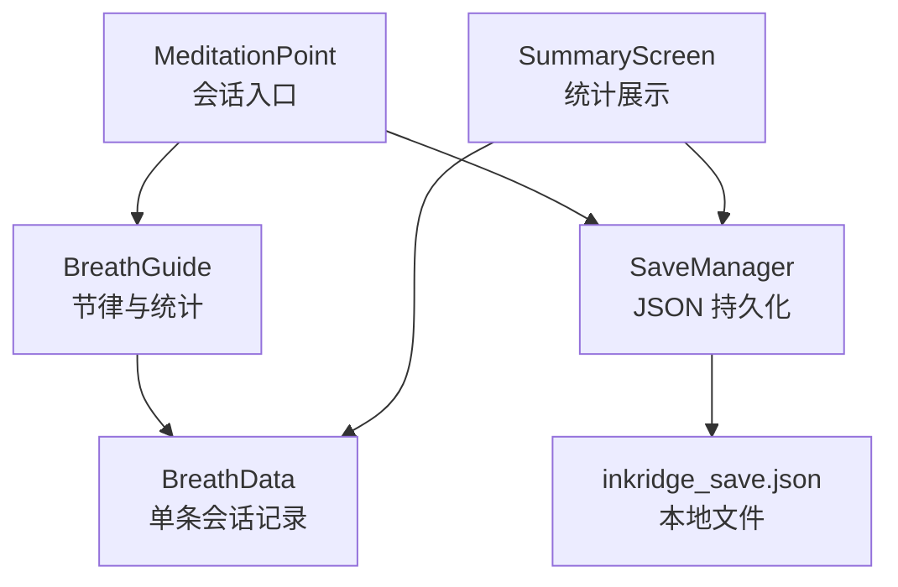
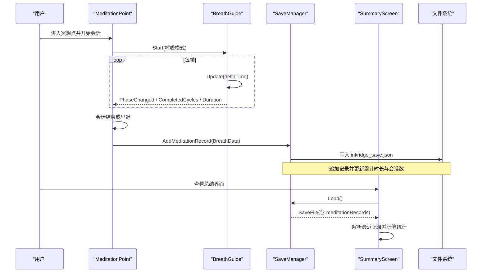
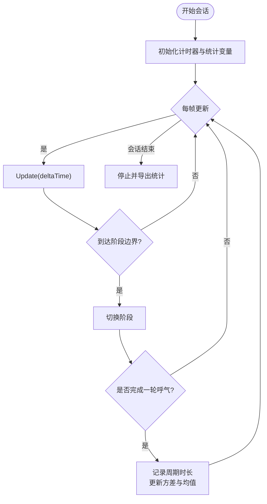
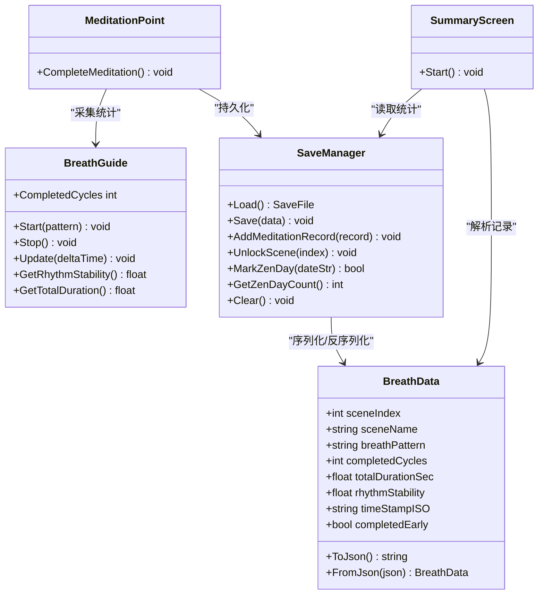

# 呼吸数据模型

<cite>
**本文引用的文件**
- [BreathData.cs](file://Assets/Scripts/Meditation/BreathData.cs)
- [SaveManager.cs](file://Assets/Scripts/Data/SaveManager.cs)
- [BreathGuide.cs](file://Assets/Scripts/Meditation/BreathGuide.cs)
- [MeditationPoint.cs](file://Assets/Scripts/Meditation/MeditationPoint.cs)
- [SummaryScreen.cs](file://Assets/Scripts/UI/SummaryScreen.cs)
- [ComfortSettings.cs](file://Assets/Scripts/Core/ComfortSettings.cs)
- [PRIVACY_POLICY.md](file://PRIVACY_POLICY.md)
</cite>

## 目录
1. [简介](#简介)
2. [项目结构](#项目结构)
3. [核心组件](#核心组件)
4. [架构总览](#架构总览)
5. [详细组件分析](#详细组件分析)
6. [依赖关系分析](#依赖关系分析)
7. [性能考量](#性能考量)
8. [故障排查指南](#故障排查指南)
9. [结论](#结论)
10. [附录](#附录)

## 简介
本技术文档围绕 BreathData 数据模型，系统性阐述其在 VR 冥想体验中的数据结构设计、JSON 持久化机制、统计数据收集与展示、数据验证与业务约束、版本迁移策略、隐私与安全考虑，以及在大数据量场景下的性能优化方案。目标是让开发者与产品人员都能准确理解并安全扩展该数据模型。

## 项目结构
与 BreathData 相关的关键代码分布在以下模块：
- 数据模型与序列化：BreathData（会话记录）、SaveManager（本地 JSON 存储）
- 数据采集与统计：BreathGuide（呼吸节律与稳定性计算）、MeditationPoint（会话生命周期与记录写入）
- 数据展示：SummaryScreen（最近会话统计与累计指标）
- 配置与隐私：ComfortSettings（用户偏好设置）、PRIVACY_POLICY.md（隐私声明）

图表来源
- [MeditationPoint.cs:264-277](file://Assets/Scripts/Meditation/MeditationPoint.cs#L264-L277)
- [BreathGuide.cs:149-170](file://Assets/Scripts/Meditation/BreathGuide.cs#L149-L170)
- [SaveManager.cs:15-27](file://Assets/Scripts/Data/SaveManager.cs#L15-L27)
- [SummaryScreen.cs:25-53](file://Assets/Scripts/UI/SummaryScreen.cs#L25-L53)

章节来源
- [MeditationPoint.cs:264-277](file://Assets/Scripts/Meditation/MeditationPoint.cs#L264-L277)
- [SaveManager.cs:15-27](file://Assets/Scripts/Data/SaveManager.cs#L15-L27)

## 核心组件
- BreathData：表示一次完成的冥想会话记录，包含场景信息、呼吸模式、完成循环数、总时长、节奏稳定度、时间戳以及是否提前结束等字段。提供 ToJson/FromJson 用于序列化和反序列化。
- SaveManager：负责本地 JSON 文件的读写，维护最高解锁场景、累计冥想/步行时长、会话次数、每日打卡列表，以及将 BreathData 以字符串形式追加到 meditationRecords 列表。
- BreathGuide：驱动呼吸阶段（吸气、吸后屏息、呼气、呼后屏息、空闲），统计每轮周期时长，计算节奏稳定度（基于方差与均值），并提供总时长与完成循环计数。
- MeditationPoint：管理会话开始/结束、早退逻辑，并在结束时构造 BreathData 并通过 SaveManager 持久化，同时解锁下一场景。
- SummaryScreen：读取 SaveManager 中的最近若干条记录，汇总本次冥想时长、呼吸循环次数、平均稳定度，以及累计会话与时长等信息进行展示。

章节来源
- [BreathData.cs:6-43](file://Assets/Scripts/Meditation/BreathData.cs#L6-L43)
- [SaveManager.cs:9-27](file://Assets/Scripts/Data/SaveManager.cs#L9-L27)
- [BreathGuide.cs:10-36](file://Assets/Scripts/Meditation/BreathGuide.cs#L10-L36)
- [MeditationPoint.cs:264-277](file://Assets/Scripts/Meditation/MeditationPoint.cs#L264-L277)
- [SummaryScreen.cs:25-53](file://Assets/Scripts/UI/SummaryScreen.cs#L25-L53)

## 架构总览
下图展示了从会话开始到数据持久化与展示的完整流程，包括采集、统计、保存与展示环节。

图表来源
- [MeditationPoint.cs:264-277](file://Assets/Scripts/Meditation/MeditationPoint.cs#L264-L277)
- [BreathGuide.cs:79-102](file://Assets/Scripts/Meditation/BreathGuide.cs#L79-L102)
- [SaveManager.cs:59-66](file://Assets/Scripts/Data/SaveManager.cs#L59-L66)
- [SummaryScreen.cs:25-53](file://Assets/Scripts/UI/SummaryScreen.cs#L25-L53)

## 详细组件分析

### BreathData 数据结构设计
- 字段定义与含义
  - sceneIndex：场景索引（int）
  - sceneName：场景名称（string）
  - breathPattern：呼吸模式（string，来源于 BreathGuide.Pattern 的 ToString）
  - completedCycles：完成呼吸循环次数（int）
  - totalDurationSec：会话总时长（秒，float）
  - rhythmStability：节奏稳定度（0~1，float）
  - timeStampISO：ISO 时间戳（string，UTC）
  - completedEarly：是否提前结束（bool）
- 构造函数自动填充 timeStamISO 为 UTC ISO 格式
- 序列化/反序列化
  - ToJson：使用 Unity JsonUtility 将对象转为 JSON 字符串
  - FromJson：静态方法从 JSON 字符串还原对象

复杂度与影响
- 单条记录体积小，适合频繁追加；JSON 字符串存储在 List<string> 中，便于增量保存
- 时间戳采用 ISO 格式，利于跨平台排序与解析

章节来源
- [BreathData.cs:6-43](file://Assets/Scripts/Meditation/BreathData.cs#L6-L43)

### JSON 持久化格式与实现
- 存储位置：Application.persistentDataPath/inkridge_save.json
- 文件结构（SaveFile）
  - highestUnlockedScene：最高解锁场景
  - totalMeditationTime：累计冥想时长
  - totalWalkingTime：累计步行时长
  - totalSessions：累计会话次数
  - meditationRecords：List<string>，每条为 BreathData.ToJson() 的结果
  - zenDays：List<string>，日期字符串“yyyy-MM-dd”
- 读写方式
  - Load：尝试读取文件并反序列化为 SaveFile，异常时返回空 SaveFile
  - Save：格式化输出 JSON（缩进）并写入文件
  - AddMeditationRecord：加载、追加记录、累加时长与会话数、保存
  - UnlockScene：若传入场景索引更高则更新最高解锁场景
  - MarkZenDay/GetZenDayCount：每日打卡去重与计数
  - Clear：删除存档文件（测试用途）

版本兼容性与健壮性
- 当前实现未显式处理旧版字段缺失或新增字段的情况；建议引入版本号字段并在 Load 中进行迁移
- 异常捕获保证在 IO 失败时不会崩溃，但会丢失当次写入

章节来源
- [SaveManager.cs:9-27](file://Assets/Scripts/Data/SaveManager.cs#L9-L27)
- [SaveManager.cs:29-57](file://Assets/Scripts/Data/SaveManager.cs#L29-L57)
- [SaveManager.cs:59-115](file://Assets/Scripts/Data/SaveManager.cs#L59-L115)

### 统计数据收集机制
- 呼吸频率与循环
  - BreathGuide 在每个呼气阶段完成后递增 CompletedCycles
  - 通过 PatternTimings 计算每个周期的理论时长，并累积到 _cycleDurationSum/_cycleDurationSqSum
- 会话时长
  - BreathGuide 维护 _totalTimer，GetTotalDuration 返回会话总时长
- 完成率与稳定度
  - GetRhythmStability 基于周期时长的均值与方差计算稳定度（0~1），固定模式理论上稳定度为 1
- 展示统计
  - SummaryScreen 读取最近若干条记录（默认最近 4 条），汇总本次冥想时长、呼吸循环次数、平均稳定度，并显示累计会话与时长

图表来源
- [BreathGuide.cs:79-102](file://Assets/Scripts/Meditation/BreathGuide.cs#L79-L102)
- [BreathGuide.cs:116-159](file://Assets/Scripts/Meditation/BreathGuide.cs#L116-L159)
- [BreathGuide.cs:161-170](file://Assets/Scripts/Meditation/BreathGuide.cs#L161-L170)

章节来源
- [BreathGuide.cs:79-102](file://Assets/Scripts/Meditation/BreathGuide.cs#L79-L102)
- [BreathGuide.cs:116-159](file://Assets/Scripts/Meditation/BreathGuide.cs#L116-L159)
- [BreathGuide.cs:161-170](file://Assets/Scripts/Meditation/BreathGuide.cs#L161-L170)
- [SummaryScreen.cs:25-53](file://Assets/Scripts/UI/SummaryScreen.cs#L25-L53)

### 数据验证规则与业务约束
- 字段约束
  - sceneIndex：非负整数，对应场景顺序
  - sceneName：非空字符串，标识场景
  - breathPattern：来自 BreathGuide.Pattern 的枚举值转字符串，需保持合法
  - completedCycles：非负整数
  - totalDurationSec：非负浮点数
  - rhythmStability：范围 0~1
  - timeStampISO：ISO 格式字符串（UTC）
  - completedEarly：布尔值，标记早退
- 业务约束
  - 早退记录仍会被保存，但不解锁下一场景（由调用方控制）
  - 同一日期的打卡仅记录一次（MarkZenDay 去重）
  - 最高解锁场景单调递增

章节来源
- [BreathData.cs:12-25](file://Assets/Scripts/Meditation/BreathData.cs#L12-L25)
- [MeditationPoint.cs:264-277](file://Assets/Scripts/Meditation/MeditationPoint.cs#L264-L277)
- [SaveManager.cs:68-76](file://Assets/Scripts/Data/SaveManager.cs#L68-L76)
- [SaveManager.cs:96-104](file://Assets/Scripts/Data/SaveManager.cs#L96-L104)

### 数据迁移与升级策略
- 现状
  - 当前 SaveFile 未包含版本字段，Load 直接反序列化
- 建议方案
  - 在 SaveFile 增加 version 字段（如 int），在 Load 时根据版本执行迁移脚本
  - 针对新增字段提供默认值，对废弃字段进行清理或映射
  - 对 meditationRecords 中的旧版 BreathData JSON 进行兼容性解析（例如兼容缺少 completedEarly 的旧记录）
  - 迁移完成后统一写回新版本文件，确保后续读取一致

章节来源
- [SaveManager.cs:29-44](file://Assets/Scripts/Data/SaveManager.cs#L29-L44)

### 数据隐私保护与安全性
- 隐私原则
  - 不收集、不存储、不传输任何个人数据
  - 无分析或追踪 SDK，无广告 SDK，无需网络
  - 所有进度与设置均保存在本地设备
- 权限说明
  - 仅需 VR 渲染、音频播放、本地存储权限
  - 不使用相机、麦克风、定位或网络权限
- 数据安全
  - 本地 JSON 文件位于应用沙盒路径，卸载即可清除
  - 建议在后续版本中加入可选的文件级加密或哈希校验，防止篡改

章节来源
- [PRIVACY_POLICY.md:5-35](file://PRIVACY_POLICY.md#L5-L35)

### 大数据量下的性能优化方案
- 存储层
  - 当前每次 AddMeditationRecord 都会 Load+Save，导致全量读写；可改为增量追加或批处理合并
  - 对 meditationRecords 做分页或滚动窗口（如保留最近 N 条，历史归档到独立文件）
  - 使用缓冲写入与异步 I/O，避免主线程阻塞
- 计算层
  - 将累计统计（totalMeditationTime、totalSessions）与明细记录分离，减少重复解析
  - 对 SummaryScreen 的统计计算缓存结果，仅在数据变更时刷新
- 内存与 GC
  - 避免在高频路径创建大量临时对象（如 JSON 字符串拼接）
  - 复用 StringBuilder 或采用流式写入降低分配压力
- 可靠性
  - 写入前备份原文件，失败时回滚
  - 增加事务语义（先写临时文件再原子替换）

[本节为通用性能建议，不直接分析具体文件]

## 依赖关系分析
- 组件耦合
  - MeditationPoint 依赖 BreathGuide 获取统计指标，并依赖 SaveManager 持久化
  - SaveManager 依赖 BreathData 的 ToJson 生成记录字符串
  - SummaryScreen 依赖 SaveManager 读取数据并依赖 BreathData.FromJson 解析记录
- 外部依赖
  - Unity JsonUtility 用于 JSON 序列化/反序列化
  - PlayerPrefs 用于 ComfortSettings 的用户偏好持久化

图表来源
- [BreathData.cs:6-43](file://Assets/Scripts/Meditation/BreathData.cs#L6-L43)
- [SaveManager.cs:9-27](file://Assets/Scripts/Data/SaveManager.cs#L9-L27)
- [BreathGuide.cs:10-36](file://Assets/Scripts/Meditation/BreathGuide.cs#L10-L36)
- [MeditationPoint.cs:264-277](file://Assets/Scripts/Meditation/MeditationPoint.cs#L264-L277)
- [SummaryScreen.cs:25-53](file://Assets/Scripts/UI/SummaryScreen.cs#L25-L53)

章节来源
- [BreathData.cs:6-43](file://Assets/Scripts/Meditation/BreathData.cs#L6-L43)
- [SaveManager.cs:9-27](file://Assets/Scripts/Data/SaveManager.cs#L9-L27)
- [BreathGuide.cs:10-36](file://Assets/Scripts/Meditation/BreathGuide.cs#L10-L36)
- [MeditationPoint.cs:264-277](file://Assets/Scripts/Meditation/MeditationPoint.cs#L264-L277)
- [SummaryScreen.cs:25-53](file://Assets/Scripts/UI/SummaryScreen.cs#L25-L53)

## 性能考量
- 序列化开销：频繁 ToJson/FromJson 可能带来 CPU 与 GC 压力，建议批量处理与缓存
- 文件 I/O：每次保存都全量写入，建议增量写入与原子替换
- 统计计算：SummaryScreen 每次启动都遍历最近记录，可引入变更触发与缓存
- 内存占用：meditationRecords 增长后体积增大，建议分片存储与归档

[本节为通用性能讨论，不直接分析具体文件]

## 故障排查指南
- 常见问题
  - 保存失败：检查磁盘空间与权限；关注 SaveManager.Save 的异常日志
  - 数据损坏：Load 异常时返回空 SaveFile，可能导致统计归零；建议加入校验与恢复机制
  - 统计不准确：确认 BreathGuide.Update 被正确调用且未被中断
  - 早退行为：completedEarly 为 true 的记录不应解锁下一场景，检查调用方逻辑
- 调试建议
  - 在 SaveManager.Load/Save 处添加更详细的错误上下文（文件名、大小、异常堆栈）
  - 在 SummaryScreen 打印解析失败的记录以便定位数据格式问题
  - 使用 ComfortSettings.HapticsEnabled 控制反馈，辅助验证交互链路

章节来源
- [SaveManager.cs:29-57](file://Assets/Scripts/Data/SaveManager.cs#L29-L57)
- [SummaryScreen.cs:25-53](file://Assets/Scripts/UI/SummaryScreen.cs#L25-L53)
- [ComfortSettings.cs:61-66](file://Assets/Scripts/Core/ComfortSettings.cs#L61-L66)

## 结论
BreathData 作为单次冥想会话的核心数据模型，配合 BreathGuide 的统计能力与 SaveManager 的本地持久化，形成了完整的采集—存储—展示闭环。当前实现简洁可靠，但在版本迁移、I/O 性能与大数据量场景下仍有优化空间。建议在后续迭代中引入版本化迁移、增量写入、统计缓存与文件校验，以提升可扩展性与鲁棒性。隐私方面已遵循最小化原则，未来可考虑可选加密增强安全性。

## 附录
- 字段字典
  - sceneIndex：场景索引（int）
  - sceneName：场景名称（string）
  - breathPattern：呼吸模式（string）
  - completedCycles：完成循环数（int）
  - totalDurationSec：会话时长（float）
  - rhythmStability：节奏稳定度（float，0~1）
  - timeStampISO：ISO 时间戳（string）
  - completedEarly：是否提前结束（bool）
- 统计口径
  - 呼吸频率：通过 CompletedCycles 与 totalDurationSec 推导
  - 会话时长：GetTotalDuration
  - 完成率：completedCycles 与目标循环数的比值（由业务决定）
  - 稳定度：GetRhythmStability（基于周期时长方差）

[本节为补充说明，不直接分析具体文件]