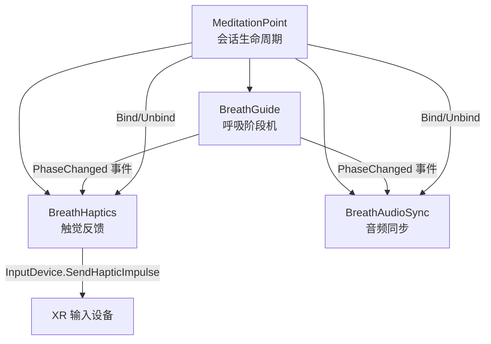
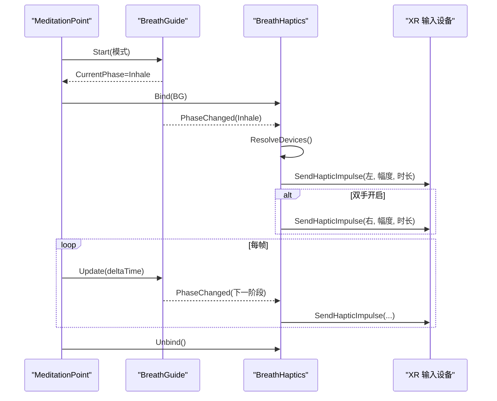
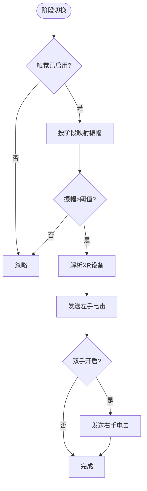
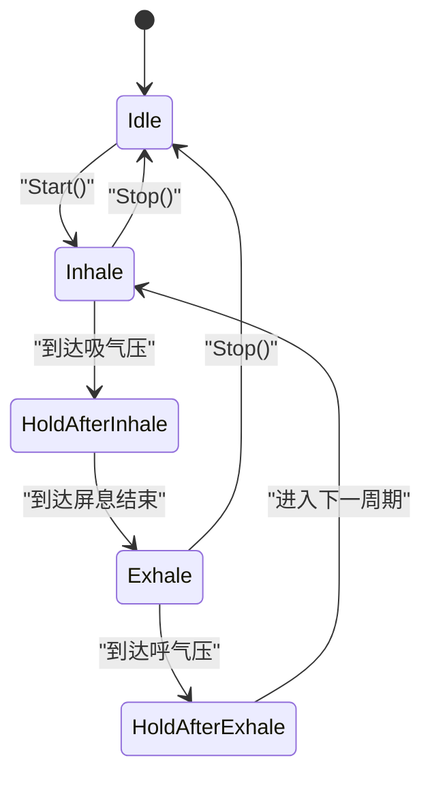
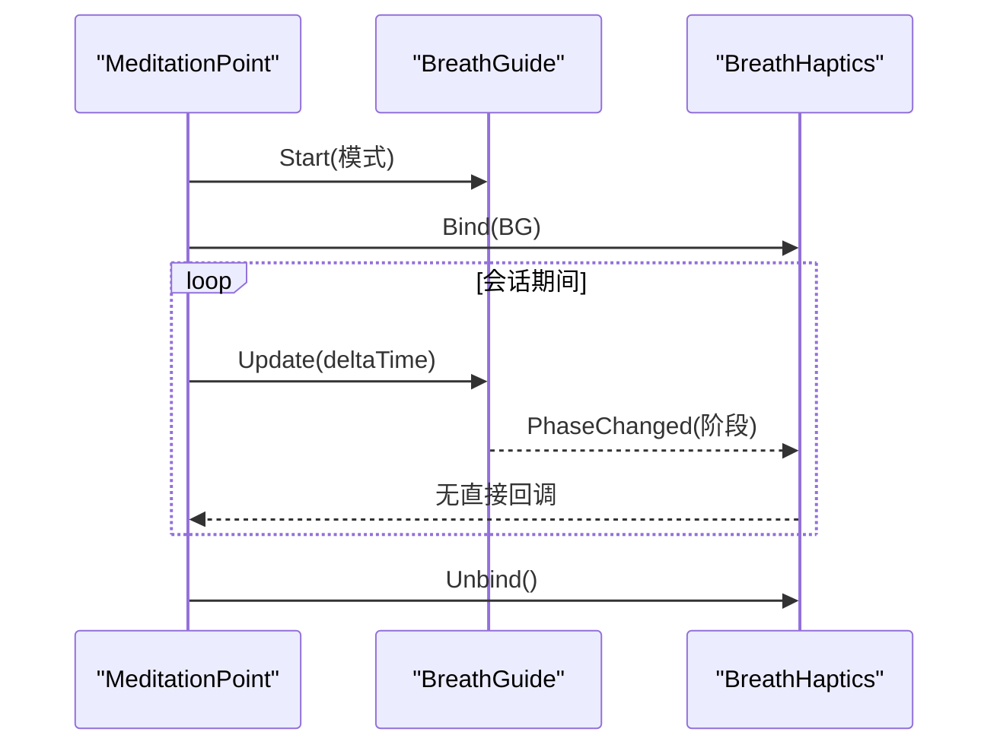
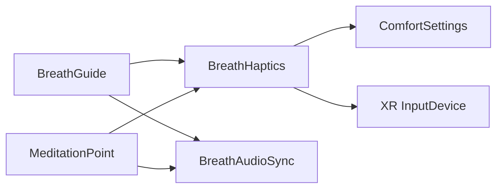

# 触觉反馈系统

<cite>
**本文引用的文件**
- [BreathHaptics.cs](file://Assets/Scripts/Meditation/BreathHaptics.cs)
- [BreathGuide.cs](file://Assets/Scripts/Meditation/BreathGuide.cs)
- [MeditationPoint.cs](file://Assets/Scripts/Meditation/MeditationPoint.cs)
- [ComfortSettings.cs](file://Assets/Scripts/Core/ComfortSettings.cs)
- [BreathAudioSync.cs](file://Assets/Scripts/Environment/BreathAudioSync.cs)
</cite>

## 更新摘要
**变更内容**
- 新增 BreathHaptics 组件的完整实现文档
- 详细说明呼吸阶段同步的手柄震动反馈机制
- 解释事件驱动架构和平台兼容性处理
- 提供调试优化指南和用户体验最佳实践

## 目录
1. [简介](#简介)
2. [项目结构](#项目结构)
3. [核心组件](#核心组件)
4. [架构总览](#架构总览)
5. [详细组件分析](#详细组件分析)
6. [依赖关系分析](#依赖关系分析)
7. [性能与功耗考量](#性能与功耗考量)
8. [故障排查指南](#故障排查指南)
9. [结论](#结论)
10. [附录：最佳实践与可访问性](#附录最佳实践与可访问性)

## 简介
本技术文档聚焦于 BreathHaptics 类及其在呼吸引导中的触觉反馈实现。该组件通过订阅呼吸阶段事件，在每次呼吸阶段切换时触发手柄短脉冲，帮助用户闭眼跟随节奏。文档将深入解释：
- 触觉反馈与呼吸阶段的同步机制
- 不同呼吸阶段的振动模式与强度控制逻辑
- 与 BreathGuide 的事件集成方式
- VR 手柄触觉反馈 API 的使用与平台兼容性处理
- 调试、延迟优化与电池消耗优化建议
- 用户体验最佳实践与可访问性考虑

## 项目结构
BreathHaptics 位于冥想模块中，与 BreathGuide（呼吸节拍器）、MeditationPoint（场景入口与生命周期管理）以及 ComfortSettings（全局设置）协作，形成"视觉-听觉-触觉"多通道一致的引导体验。

**图表来源**
- [MeditationPoint.cs:66-232](file://Assets/Scripts/Meditation/MeditationPoint.cs#L66-L232)
- [BreathGuide.cs:54-77](file://Assets/Scripts/Meditation/BreathGuide.cs#L54-L77)
- [BreathHaptics.cs:35-48](file://Assets/Scripts/Meditation/BreathHaptics.cs#L35-L48)
- [BreathAudioSync.cs:33-39](file://Assets/Scripts/Environment/BreathAudioSync.cs#L33-L39)

**章节来源**
- [MeditationPoint.cs:66-232](file://Assets/Scripts/Meditation/MeditationPoint.cs#L66-L232)
- [BreathGuide.cs:54-77](file://Assets/Scripts/Meditation/BreathGuide.cs#L54-L77)
- [BreathHaptics.cs:35-48](file://Assets/Scripts/Meditation/BreathHaptics.cs#L35-L48)
- [BreathAudioSync.cs:33-39](file://Assets/Scripts/Environment/BreathAudioSync.cs#L33-L39)

## 核心组件
- **BreathHaptics**：负责在呼吸阶段切换时触发手柄短脉冲，支持左右手独立或同时触发，幅度与时长可调，并受全局设置开关控制。
- **BreathGuide**：非 MonoBehaviour 的呼吸节拍器，维护当前阶段、进度、周期计数等，并通过事件通知订阅者。
- **MeditationPoint**：场景中的冥想点，负责启动/停止呼吸会话，绑定/解绑各反馈组件，管理退出交互与记录保存。
- **ComfortSettings**：持久化用户偏好，包括是否启用触觉反馈。
- **BreathAudioSync**：与 BreathGuide 同步播放吸气/呼气音效，作为对比参考展示事件驱动的统一架构。

**章节来源**
- [BreathHaptics.cs:7-19](file://Assets/Scripts/Meditation/BreathHaptics.cs#L7-L19)
- [BreathGuide.cs:6-36](file://Assets/Scripts/Meditation/BreathGuide.cs#L6-L36)
- [MeditationPoint.cs:10-45](file://Assets/Scripts/Meditation/MeditationPoint.cs#L10-L45)
- [ComfortSettings.cs:5-20](file://Assets/Scripts/Core/ComfortSettings.cs#L5-L20)
- [BreathAudioSync.cs:6-14](file://Assets/Scripts/Environment/BreathAudioSync.cs#L6-L14)

## 架构总览
BreathHaptics 采用事件驱动架构：MeditationPoint 在会话开始时调用 Bind，将 BreathGuide 注入；BreathGuide 在阶段推进时触发 PhaseChanged；BreathHaptics 根据阶段选择对应振幅，解析 XR 设备并发送短脉冲。

**图表来源**
- [MeditationPoint.cs:213-232](file://Assets/Scripts/Meditation/MeditationPoint.cs#L213-L232)
- [BreathGuide.cs:54-101](file://Assets/Scripts/Meditation/BreathGuide.cs#L54-L101)
- [BreathHaptics.cs:35-85](file://Assets/Scripts/Meditation/BreathHaptics.cs#L35-L85)

## 详细组件分析

### BreathHaptics：触觉反馈控制器
- **职责**
  - 订阅 BreathGuide.PhaseChanged，在阶段切换时触发短脉冲
  - 根据阶段选择不同振幅（吸气较强、呼气次之、屏息较弱）
  - 支持左右手同时或单侧触发
  - 在设备断开重连时重新解析 InputDevice，避免静默失败
  - 受全局设置 HapticsEnabled 控制，便于快速关闭
- **关键流程**
  - Bind/Unbind：注册/注销事件监听
  - OnPhaseChanged：按阶段映射振幅，阈值过滤，解析设备，发送脉冲
  - Pulse：用于退出提示等一次性反馈
  - ResolveDevices：懒加载并缓存左右手设备
  - Send：封装平台 API 调用，参数钳制与最小时长保护
- **数据流**
  - 阶段枚举 → 振幅映射 → 设备有效性检查 → 发送脉冲
- **复杂度**
  - 每阶段切换 O(1) 计算与一次设备解析
  - 无循环或复杂数据结构，内存占用极低

**图表来源**
- [BreathHaptics.cs:61-101](file://Assets/Scripts/Meditation/BreathHaptics.cs#L61-L101)

**章节来源**
- [BreathHaptics.cs:21-33](file://Assets/Scripts/Meditation/BreathHaptics.cs#L21-L33)
- [BreathHaptics.cs:35-48](file://Assets/Scripts/Meditation/BreathHaptics.cs#L35-L48)
- [BreathHaptics.cs:52-85](file://Assets/Scripts/Meditation/BreathHaptics.cs#L52-L85)
- [BreathHaptics.cs:87-101](file://Assets/Scripts/Meditation/BreathHaptics.cs#L87-L101)

### BreathGuide：呼吸节拍器
- **职责**
  - 维护当前阶段与进度，按预设模式推进阶段
  - 提供 CompletedCycles、RhythmStability、TotalDuration 等统计
  - 通过 PhaseChanged 事件广播阶段变化
- **模式**
  - Balanced444、Relax478、Box4444、Free（慢深呼吸）
- **更新机制**
  - Update(deltaTime) 累积时间，达到阶段时长后推进阶段并触发事件
- **与触觉的关系**
  - 所有阶段切换都会触发事件，BreathHaptics 据此决定何时震动

**图表来源**
- [BreathGuide.cs:12-31](file://Assets/Scripts/Meditation/BreathGuide.cs#L12-L31)
- [BreathGuide.cs:54-101](file://Assets/Scripts/Meditation/BreathGuide.cs#L54-L101)
- [BreathGuide.cs:116-147](file://Assets/Scripts/Meditation/BreathGuide.cs#L116-L147)

**章节来源**
- [BreathGuide.cs:6-36](file://Assets/Scripts/Meditation/BreathGuide.cs#L6-L36)
- [BreathGuide.cs:54-101](file://Assets/Scripts/Meditation/BreathGuide.cs#L54-L101)
- [BreathGuide.cs:116-147](file://Assets/Scripts/Meditation/BreathGuide.cs#L116-L147)

### MeditationPoint：会话编排与绑定
- **职责**
  - 创建 BreathGuide 并在会话期间驱动其 Update
  - 在开始/结束时 Bind/Unbind 触觉与音频组件
  - 管理退出交互（长按菜单键），并提供渐进式触觉反馈
  - 记录会话数据并解锁后续场景
- **与触觉的集成**
  - 开始会话：_haptics?.Bind(_breathGuide)
  - 退出确认：周期性 _haptics?.Pulse(随充电比例递增)
  - 提前退出：_haptics?.Pulse(强脉冲)

**图表来源**
- [MeditationPoint.cs:66-127](file://Assets/Scripts/Meditation/MeditationPoint.cs#L66-L127)
- [MeditationPoint.cs:213-232](file://Assets/Scripts/Meditation/MeditationPoint.cs#L213-L232)
- [MeditationPoint.cs:143-166](file://Assets/Scripts/Meditation/MeditationPoint.cs#L143-L166)
- [MeditationPoint.cs:282-302](file://Assets/Scripts/Meditation/MeditationPoint.cs#L282-302)

**章节来源**
- [MeditationPoint.cs:66-127](file://Assets/Scripts/Meditation/MeditationPoint.cs#L66-L127)
- [MeditationPoint.cs:143-166](file://Assets/Scripts/Meditation/MeditationPoint.cs#L143-L166)
- [MeditationPoint.cs:213-232](file://Assets/Scripts/Meditation/MeditationPoint.cs#L213-L232)
- [MeditationPoint.cs:282-302](file://Assets/Scripts/Meditation/MeditationPoint.cs#L282-302)

### 呼吸阶段与触觉模式映射
- **吸气（Inhale）**：较强脉冲（默认 0.30f），帮助感知"开始"
- **吸气后屏息（HoldAfterInhale）**：弱脉冲（默认 0.10f），提示"保持"
- **呼气（Exhale）**：中等脉冲（默认 0.22f），提示"释放"
- **呼气后屏息（HoldAfterExhale）**：弱脉冲（默认 0.10f），提示"准备下一次吸气"
- **空闲（Idle）**：不触发，会话结束或尚未开始

**章节来源**
- [BreathHaptics.cs:61-85](file://Assets/Scripts/Meditation/BreathHaptics.cs#L61-L85)
- [BreathGuide.cs:12-31](file://Assets/Scripts/Meditation/BreathGuide.cs#L12-L31)

### 与 BreathAudioSync 的对比
- 两者均通过订阅 BreathGuide.PhaseChanged 实现同步
- 音频组件播放吸气/呼气音效，触觉组件在同一时刻提供短脉冲
- 统一的事件驱动设计确保多通道一致性

**章节来源**
- [BreathAudioSync.cs:6-14](file://Assets/Scripts/Environment/BreathAudioSync.cs#L6-L14)
- [BreathAudioSync.cs:33-39](file://Assets/Scripts/Environment/BreathAudioSync.cs#L33-L39)

## 依赖关系分析
- **BreathHaptics 依赖**
  - BreathGuide：事件源
  - ComfortSettings.HapticsEnabled：全局开关
  - UnityEngine.XR.InputDevice：平台触觉 API
- **MeditationPoint 依赖**
  - BreathGuide：驱动会话
  - BreathHaptics：绑定/解绑
  - BreathAudioSync：绑定/解绑
  - AmbientBreathFilter：环境音滤波（可选）
- **耦合度**
  - 松耦合：通过事件与接口方法（Bind/Unbind）解耦
  - 低内聚：每个组件职责单一，易于测试与维护

**图表来源**
- [BreathHaptics.cs:35-48](file://Assets/Scripts/Meditation/BreathHaptics.cs#L35-L48)
- [MeditationPoint.cs:213-232](file://Assets/Scripts/Meditation/MeditationPoint.cs#L213-L232)
- [ComfortSettings.cs:61-66](file://Assets/Scripts/Core/ComfortSettings.cs#L61-L66)

**章节来源**
- [BreathHaptics.cs:35-48](file://Assets/Scripts/Meditation/BreathHaptics.cs#L35-L48)
- [MeditationPoint.cs:213-232](file://Assets/Scripts/Meditation/MeditationPoint.cs#L213-L232)
- [ComfortSettings.cs:61-66](file://Assets/Scripts/Core/ComfortSettings.cs#L61-L66)

## 性能与功耗考量
- **事件频率**
  - 仅在阶段切换时触发，远低于每帧开销
- **设备解析**
  - 在阶段切换时懒解析并缓存，避免每帧查询
- **参数钳制**
  - 振幅钳制到 [0,1]，时长最小值保护，减少无效调用
- **电池优化建议**
  - 合理设置 _pulseDuration（默认较短，降低能耗）
  - 使用 _holdAmplitude 较低值以减少长时间屏息时的频繁刺激
  - 允许用户在设置中关闭触觉反馈（ComfortSettings.HapticsEnabled）
- **延迟处理**
  - 平台运行时可能钳制参数，导致实际效果略异于设定；可通过小幅提高振幅或延长时长补偿
  - 若出现设备掉线，OnPhaseChanged 会重新解析设备，保证稳定性

## 故障排查指南
- **无触觉反馈**
  - 检查 ComfortSettings.HapticsEnabled 是否为真
  - 确认 MeditationPoint 已调用 _haptics?.Bind(_breathGuide)
  - 检查 HasController 返回是否为真（编辑器可见性检查）
- **设备掉线或抖动**
  - 依赖 OnPhaseChanged 中的 ResolveDevices 重新获取设备
  - 若仍异常，重启应用或重新连接手柄
- **强度过强或过弱**
  - 调整 _inhaleAmplitude/_exhaleAmplitude/_holdAmplitude
  - 注意部分平台会钳制振幅，需结合平台特性微调
- **退出提示不明显**
  - 检查 _exitFeedbackInterval 与 _exitHoldSeconds 配置
  - 确认 _haptics?.Pulse 在退出过程中被周期性调用

**章节来源**
- [BreathHaptics.cs:52-85](file://Assets/Scripts/Meditation/BreathHaptics.cs#L52-L85)
- [BreathHaptics.cs:103-106](file://Assets/Scripts/Meditation/BreathHaptics.cs#L103-L106)
- [MeditationPoint.cs:143-166](file://Assets/Scripts/Meditation/MeditationPoint.cs#L143-L166)
- [ComfortSettings.cs:61-66](file://Assets/Scripts/Core/ComfortSettings.cs#L61-L66)

## 结论
BreathHaptics 以简洁的事件驱动方式实现了与呼吸节拍的精确同步，通过阶段映射的振幅策略与设备健壮性处理，提供了稳定且低功耗的触觉反馈。配合 BreathGuide 的多模式支持与 MeditationPoint 的生命周期管理，形成了完整的"视-听-触"一体化冥想体验。建议在发布前进行平台适配与用户偏好测试，以获得最佳体验。

## 附录：最佳实践与可访问性
- **用户体验最佳实践**
  - 默认开启触觉反馈，但允许用户随时关闭
  - 不同阶段使用差异化振幅，增强节奏感知
  - 退出过程提供渐进式触觉提示，提升可发现性与可控性
- **可访问性考虑**
  - 提供纯视觉与纯听觉替代方案（BreathCircle、BreathAudioSync）
  - 允许调节触觉强度与持续时间，满足敏感用户需求
  - 在 UI 中明确说明触觉反馈的作用与关闭方式
- **调试技巧**
  - 使用编辑器 HasController 快速验证设备可用性
  - 在开发阶段临时增大振幅与时长，便于定位问题
  - 记录会话统计（CompletedCycles、RhythmStability）辅助评估体验