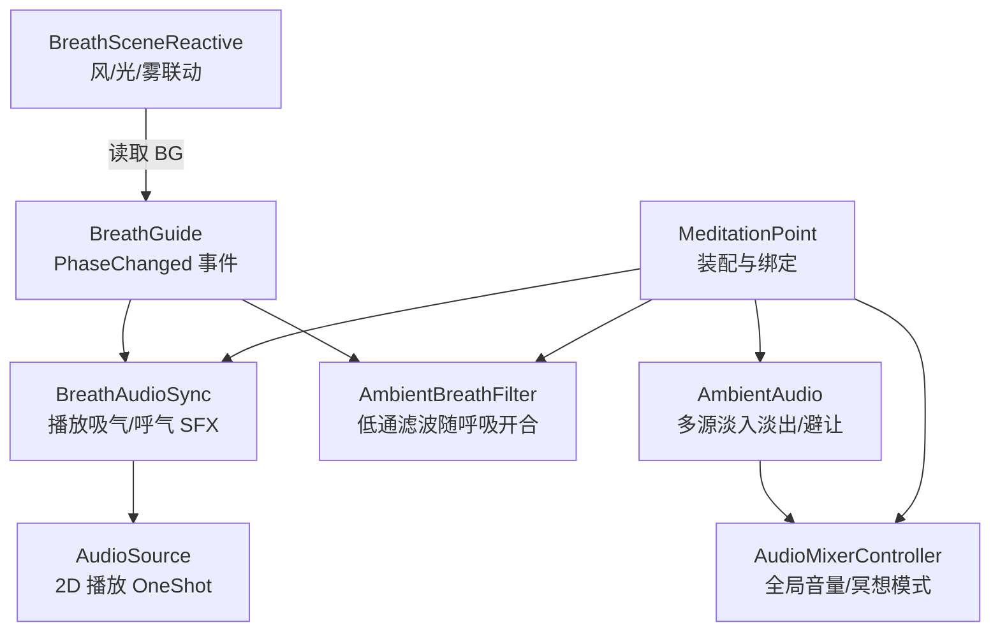
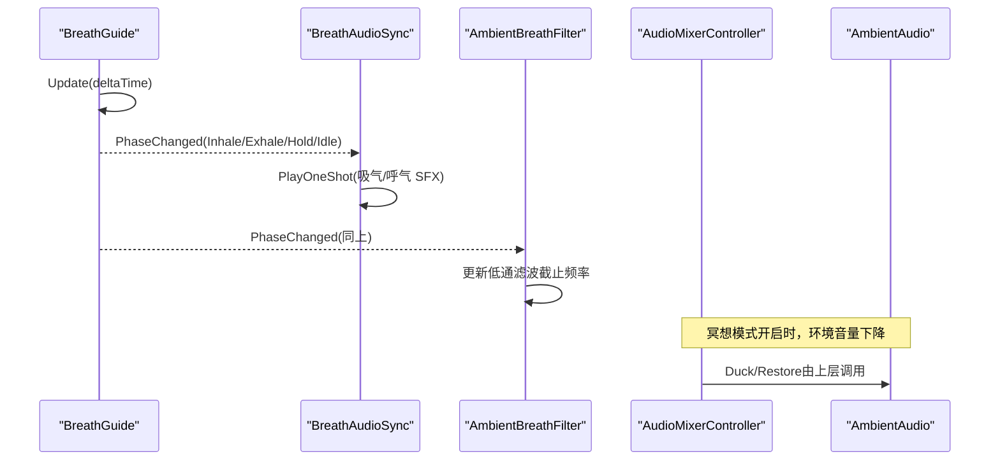
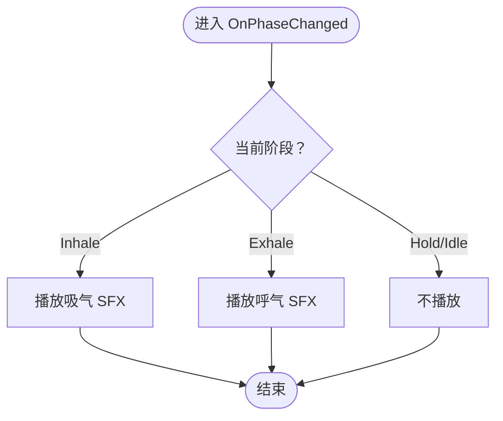
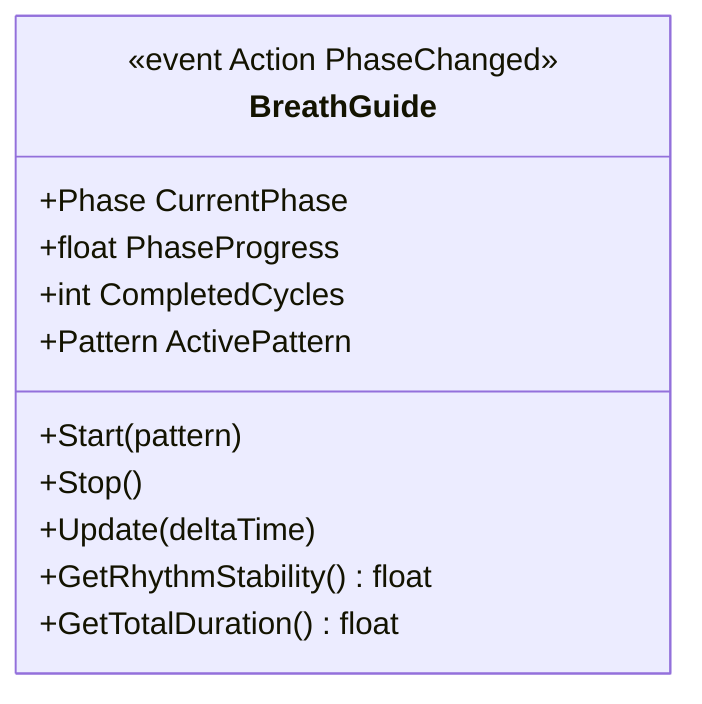
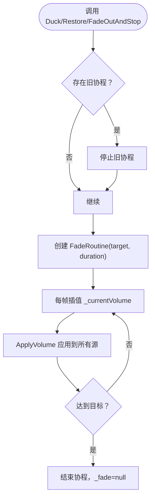
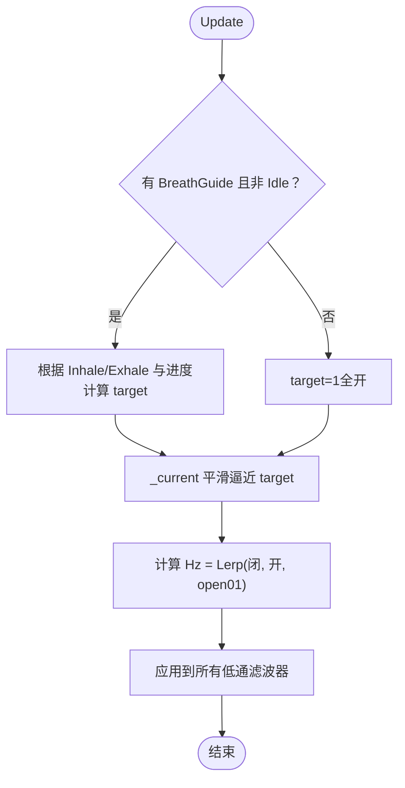
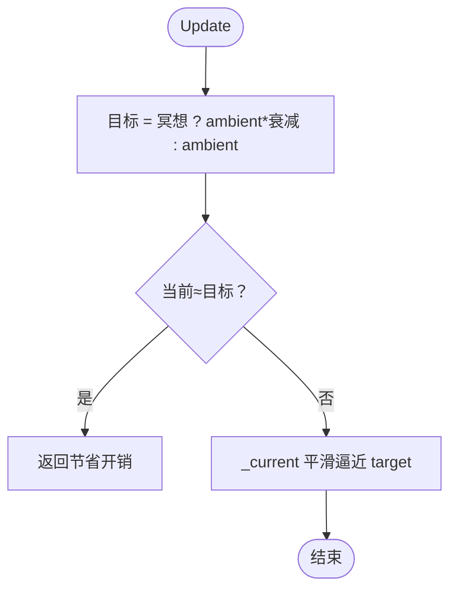
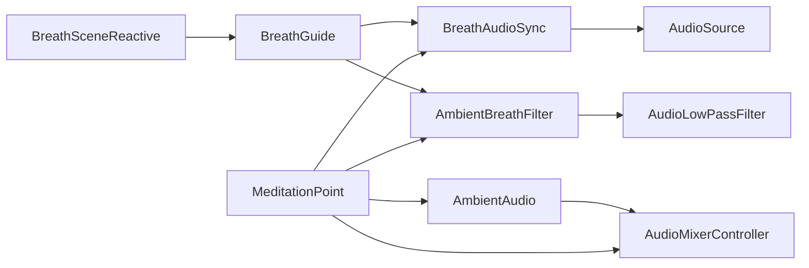

# 音频同步系统

<cite>
**本文引用的文件**
- [BreathAudioSync.cs](file://Assets/Scripts/Environment/BreathAudioSync.cs)
- [BreathGuide.cs](file://Assets/Scripts/Meditation/BreathGuide.cs)
- [AudioMixerController.cs](file://Assets/Scripts/Core/AudioMixerController.cs)
- [AmbientAudio.cs](file://Assets/Scripts/Environment/AmbientAudio.cs)
- [AmbientBreathFilter.cs](file://Assets/Scripts/Environment/AmbientBreathFilter.cs)
- [BreathSceneReactive.cs](file://Assets/Scripts/Core/BreathSceneReactive.cs)
- [MeditationPoint.cs](file://Assets/Scripts/Meditation/MeditationPoint.cs)
</cite>

## 目录
1. [简介](#简介)
2. [项目结构](#项目结构)
3. [核心组件](#核心组件)
4. [架构总览](#架构总览)
5. [详细组件分析](#详细组件分析)
6. [依赖关系分析](#依赖关系分析)
7. [性能考量](#性能考量)
8. [故障排除指南](#故障排除指南)
9. [结论](#结论)
10. [附录](#附录)

## 简介
本技术文档围绕 BreathAudioSync 类，系统化阐述 Unity 项目中“呼吸节奏与环境音效”的协调机制。内容涵盖：
- 与 BreathGuide 事件的集成方式，确保音频反馈与呼吸阶段精确同步
- 音频混合器与音量控制、淡入淡出效果、轨道管理策略
- 环境音、提示音（SFX）、音乐三类素材的管理与优先级
- 音频性能优化（内存、异步加载、运行时开销）
- 调试工具与常见问题排查

## 项目结构
本项目将音频相关逻辑分布在多个脚本中，形成“事件驱动 + 场景级混音 + 环境滤波”的分层架构：
- 呼吸节拍驱动：BreathGuide（非 MonoBehaviour），提供 PhaseChanged 事件
- 呼吸音频同步：BreathAudioSync，订阅事件并播放吸气/呼气 SFX
- 环境音频管理：AmbientAudio，负责多源淡入淡出与“避让”（ducking）
- 环境滤波：AmbientBreathFilter，为环境音添加低通滤波，随呼吸开合
- 全局混音控制：AudioMixerController，统一调整主音量、SFX、环境音量，并在冥想时降低环境音量
- 场景联动：BreathSceneReactive，将呼吸节律映射到风、光、雾等视觉元素
- 装配入口：MeditationPoint，在启动时自动发现并绑定上述组件

图表来源
- [BreathGuide.cs:10-23](file://Assets/Scripts/Meditation/BreathGuide.cs#L10-L23)
- [BreathAudioSync.cs:15-72](file://Assets/Scripts/Environment/BreathAudioSync.cs#L15-L72)
- [AmbientBreathFilter.cs:15-85](file://Assets/Scripts/Environment/AmbientBreathFilter.cs#L15-L85)
- [AmbientAudio.cs:11-109](file://Assets/Scripts/Environment/AmbientAudio.cs#L11-L109)
- [AudioMixerController.cs:10-64](file://Assets/Scripts/Core/AudioMixerController.cs#L10-L64)
- [BreathSceneReactive.cs:16-147](file://Assets/Scripts/Core/BreathSceneReactive.cs#L16-L147)
- [MeditationPoint.cs:64-89](file://Assets/Scripts/Meditation/MeditationPoint.cs#L64-L89)

章节来源
- [BreathGuide.cs:10-23](file://Assets/Scripts/Meditation/BreathGuide.cs#L10-L23)
- [BreathAudioSync.cs:15-72](file://Assets/Scripts/Environment/BreathAudioSync.cs#L15-L72)
- [AmbientAudio.cs:11-109](file://Assets/Scripts/Environment/AmbientAudio.cs#L11-L109)
- [AmbientBreathFilter.cs:15-85](file://Assets/Scripts/Environment/AmbientBreathFilter.cs#L15-L85)
- [AudioMixerController.cs:10-64](file://Assets/Scripts/Core/AudioMixerController.cs#L10-L64)
- [BreathSceneReactive.cs:16-147](file://Assets/Scripts/Core/BreathSceneReactive.cs#L16-L147)
- [MeditationPoint.cs:64-89](file://Assets/Scripts/Meditation/MeditationPoint.cs#L64-L89)

## 核心组件
- BreathAudioSync：基于事件驱动的呼吸提示音播放器，绑定到 BreathGuide，按吸气/呼气阶段触发对应 SFX；使用 AudioSource 的 2D 播放模式，避免声像干扰。
- BreathGuide：非 MonoBehaviour 的节拍控制器，维护当前阶段、进度、周期统计，并通过事件通知订阅者。
- AmbientAudio：管理场景内多个环境音源的淡入淡出、停止与“避让”（ducking），保证重要声音（如呼吸引导）可听性。
- AmbientBreathFilter：为环境音源动态添加低通滤波器，随呼吸阶段改变截止频率，营造“世界呼吸感”。
- AudioMixerController：集中控制主音量、SFX 音量、环境音量，并在冥想模式下平滑降低环境音量。
- BreathSceneReactive：将呼吸节律映射到风、光、雾等视觉表现，增强沉浸感。
- MeditationPoint：装配入口，自动发现并绑定各组件，完成事件订阅与生命周期管理。

章节来源
- [BreathAudioSync.cs:15-72](file://Assets/Scripts/Environment/BreathAudioSync.cs#L15-L72)
- [BreathGuide.cs:10-173](file://Assets/Scripts/Meditation/BreathGuide.cs#L10-L173)
- [AmbientAudio.cs:11-109](file://Assets/Scripts/Environment/AmbientAudio.cs#L11-L109)
- [AmbientBreathFilter.cs:15-85](file://Assets/Scripts/Environment/AmbientBreathFilter.cs#L15-L85)
- [AudioMixerController.cs:10-64](file://Assets/Scripts/Core/AudioMixerController.cs#L10-L64)
- [BreathSceneReactive.cs:16-147](file://Assets/Scripts/Core/BreathSceneReactive.cs#L16-L147)
- [MeditationPoint.cs:64-89](file://Assets/Scripts/Meditation/MeditationPoint.cs#L64-L89)

## 架构总览
呼吸同步系统采用“事件驱动 + 分层混音”的架构：
- 事件层：BreathGuide 每帧推进阶段，通过 PhaseChanged 广播当前阶段与进度
- 同步层：BreathAudioSync 订阅事件，在吸气/呼气阶段播放对应 SFX；AmbientBreathFilter 根据阶段调节低通滤波
- 混音层：AudioMixerController 统一管理主音量、SFX、环境音量，并在冥想时降低环境音量；AmbientAudio 负责多源淡入淡出与避让
- 场景层：BreathSceneReactive 将节律映射到风、光、雾等视觉元素，形成视听一致体验

图表来源
- [BreathGuide.cs:54-147](file://Assets/Scripts/Meditation/BreathGuide.cs#L54-L147)
- [BreathAudioSync.cs:33-72](file://Assets/Scripts/Environment/BreathAudioSync.cs#L33-L72)
- [AmbientBreathFilter.cs:29-85](file://Assets/Scripts/Environment/AmbientBreathFilter.cs#L29-L85)
- [AudioMixerController.cs:26-64](file://Assets/Scripts/Core/AudioMixerController.cs#L26-L64)
- [AmbientAudio.cs:20-109](file://Assets/Scripts/Environment/AmbientAudio.cs#L20-L109)

## 详细组件分析

### BreathAudioSync：呼吸提示音同步器
- 职责：订阅 BreathGuide.PhaseChanged，在吸气/呼气阶段播放对应 SFX；保持 2D 播放以避免声像干扰
- 关键行为：
  - Awake 中获取 AudioSource，设置 2D、音量、非循环
  - Bind/Unbind 管理事件订阅，防止内存泄漏
  - OnPhaseChanged 根据阶段选择播放吸气或呼气 SFX；Hold 阶段不发声（由触觉替代）
  - Play 使用 PlayOneShot 以独立轨道播放，避免打断其他声音
- 配置：Inspector 暴露吸气/呼气 AudioClip 与音量参数；IsConfigured 用于编辑器校验

图表来源
- [BreathAudioSync.cs:53-72](file://Assets/Scripts/Environment/BreathAudioSync.cs#L53-L72)

章节来源
- [BreathAudioSync.cs:15-72](file://Assets/Scripts/Environment/BreathAudioSync.cs#L15-L72)

### BreathGuide：呼吸节拍控制器
- 职责：维护呼吸阶段与进度，计算周期统计，提供 PhaseChanged 事件
- 关键行为：
  - Start/Stop 初始化与清理，发送初始/结束阶段事件
  - Update 推进计时，到达阶段时长后切换阶段并广播事件
  - AdvancePhase 根据预设模式决定下一阶段，记录周期时长
  - GetRhythmStability 计算节律稳定性（固定模式恒为 1）
- 模式：支持 Balanced444、Relax478、Box4444、Free（慢深呼吸）

图表来源
- [BreathGuide.cs:10-173](file://Assets/Scripts/Meditation/BreathGuide.cs#L10-L173)

章节来源
- [BreathGuide.cs:10-173](file://Assets/Scripts/Meditation/BreathGuide.cs#L10-L173)

### AmbientAudio：环境音管理与避让
- 职责：管理场景内多个环境音源的淡入淡出、停止与避让（ducking）
- 关键行为：
  - Start 播放所有环境音源，并以 FadeTo 渐入目标音量
  - Duck/Restore 实现临时降音量与恢复，避免与重要声音冲突
  - FadeOutAndStop 在场景退出时淡出并停止所有源
  - 内部协程 FadeRoutine 线性插值音量，ApplyVolume 批量应用到所有源
- 设计要点：通过取消旧协程避免多段淡入冲突；支持外部控制（如冥想点）

图表来源
- [AmbientAudio.cs:20-109](file://Assets/Scripts/Environment/AmbientAudio.cs#L20-L109)

章节来源
- [AmbientAudio.cs:11-109](file://Assets/Scripts/Environment/AmbientAudio.cs#L11-L109)

### AmbientBreathFilter：环境低通滤波
- 职责：为环境音源添加低通滤波器，随呼吸阶段改变截止频率，营造“世界呼吸感”
- 关键行为：
  - Awake 扫描子 AudioSource，缺失则添加 AudioLowPassFilter，并初始化截止频率
  - Bind/Unbind 管理 BreathGuide 引用，结束时恢复全开状态
  - Update 根据当前阶段与进度计算目标 open01，平滑过渡并应用截止频率
- 设计要点：仅在冥想会话期间响应；空闲时保持全开，避免影响正常体验

图表来源
- [AmbientBreathFilter.cs:42-85](file://Assets/Scripts/Environment/AmbientBreathFilter.cs#L42-L85)

章节来源
- [AmbientBreathFilter.cs:15-85](file://Assets/Scripts/Environment/AmbientBreathFilter.cs#L15-L85)

### AudioMixerController：全局混音控制
- 职责：统一管理主音量、SFX 音量、环境音量，并在冥想模式下降低环境音量
- 关键行为：
  - Start 初始化当前环境音量与主音量
  - Update 计算目标音量（冥想模式乘以衰减系数），平滑过渡；若已稳定则跳过计算
  - SetMeditationMode/SetMasterVolume/SetSFXVolume/SetAmbientVolume 提供外部控制接口
- 设计要点：避免每帧无意义重算；提供只读属性 AmbientVolume/SfxVolume 供 UI 显示

图表来源
- [AudioMixerController.cs:26-43](file://Assets/Scripts/Core/AudioMixerController.cs#L26-L43)

章节来源
- [AudioMixerController.cs:10-64](file://Assets/Scripts/Core/AudioMixerController.cs#L10-L64)

### BreathSceneReactive：场景联动
- 职责：将呼吸节律映射到风、光、雾等视觉元素，增强沉浸感
- 关键行为：
  - Start 收集 Light 与 Renderer 基础值，准备后续插值
  - SetBreathSource 绑定 BreathGuide，并在解绑时恢复中性状态
  - Update 根据 Inhale/Exhale 与进度计算 blend，进而调整风强度、灯光强度、雾密度、发光材质颜色
- 设计要点：仅在会话进行中响应；对不支持的特性（如未启用雾）自动降级

章节来源
- [BreathSceneReactive.cs:16-147](file://Assets/Scripts/Core/BreathSceneReactive.cs#L16-L147)

### MeditationPoint：装配入口
- 职责：在启动时自动发现并绑定 BreathGuide、AmbientAudio、BreathAudioSync、AmbientBreathFilter、BreathSceneReactive 等组件
- 关键行为：
  - 创建 BreathGuide 实例
  - 查找 AmbientAudio，若无则警告
  - 查找或添加 AmbientBreathFilter，并绑定 BreathGuide
  - 查找 BreathAudioSync 与 BreathSceneReactive 并完成绑定
- 设计要点：松耦合装配，便于复用与扩展

章节来源
- [MeditationPoint.cs:64-89](file://Assets/Scripts/Meditation/MeditationPoint.cs#L64-L89)

## 依赖关系分析
- BreathAudioSync 依赖 BreathGuide 的事件；通过 Bind/Unbind 管理生命周期
- AmbientBreathFilter 依赖 BreathGuide 的阶段信息；为环境音源添加低通滤波
- AmbientAudio 与 AudioMixerController 协同：前者负责单场景多源淡入淡出与避让，后者负责全局音量与冥想模式下的环境音量衰减
- BreathSceneReactive 仅读取 BreathGuide 的状态，不反向依赖音频组件
- MeditationPoint 作为装配中心，串联以上组件

图表来源
- [BreathGuide.cs:10-23](file://Assets/Scripts/Meditation/BreathGuide.cs#L10-L23)
- [BreathAudioSync.cs:15-72](file://Assets/Scripts/Environment/BreathAudioSync.cs#L15-L72)
- [AmbientBreathFilter.cs:15-85](file://Assets/Scripts/Environment/AmbientBreathFilter.cs#L15-L85)
- [AmbientAudio.cs:11-109](file://Assets/Scripts/Environment/AmbientAudio.cs#L11-L109)
- [AudioMixerController.cs:10-64](file://Assets/Scripts/Core/AudioMixerController.cs#L10-L64)
- [BreathSceneReactive.cs:16-147](file://Assets/Scripts/Core/BreathSceneReactive.cs#L16-L147)
- [MeditationPoint.cs:64-89](file://Assets/Scripts/Meditation/MeditationPoint.cs#L64-L89)

章节来源
- [BreathGuide.cs:10-23](file://Assets/Scripts/Meditation/BreathGuide.cs#L10-L23)
- [BreathAudioSync.cs:15-72](file://Assets/Scripts/Environment/BreathAudioSync.cs#L15-L72)
- [AmbientBreathFilter.cs:15-85](file://Assets/Scripts/Environment/AmbientBreathFilter.cs#L15-L85)
- [AmbientAudio.cs:11-109](file://Assets/Scripts/Environment/AmbientAudio.cs#L11-L109)
- [AudioMixerController.cs:10-64](file://Assets/Scripts/Core/AudioMixerController.cs#L10-L64)
- [BreathSceneReactive.cs:16-147](file://Assets/Scripts/Core/BreathSceneReactive.cs#L16-L147)
- [MeditationPoint.cs:64-89](file://Assets/Scripts/Meditation/MeditationPoint.cs#L64-L89)

## 性能考量
- 事件驱动减少轮询：BreathAudioSync 与 AmbientBreathFilter 均通过事件响应，避免每帧主动查询
- 平滑过渡与早退优化：AudioMixerController 在目标稳定后跳过 Lerp 计算，降低 CPU 开销
- 协程取消避免冲突：AmbientAudio 在多次淡入请求时取消旧协程，防止多段插值竞争
- 2D 播放避免声像计算：BreathAudioSync 使用 2D 播放，减少空间音频处理
- 资源组织：音频素材按类型分目录（Ambience、Music、SFX），便于按需加载与管理
- 建议的异步加载策略：
  - 使用 Addressables 或 Resources.LoadAsync 对大体积环境音进行异步加载
  - 预加载常用 SFX（吸气/呼气）以减少首次播放延迟
  - 对长循环环境音使用流式加载，避免内存峰值
- 内存管理：
  - 避免频繁 Instantiate/Destroy AudioSource；复用或池化
  - 在 OnDestroy 中正确 Unbind 事件，防止悬挂引用导致 GC 压力
  - 合理设置 AudioClip 压缩格式与采样率，平衡音质与内存占用

[本节为通用指导，不直接分析具体文件]

## 故障排除指南
- 问题：呼吸提示音未播放
  - 检查 BreathAudioSync 是否已 Bind BreathGuide
  - 确认 Inspector 中已分配吸气/呼气 AudioClip
  - 验证 AudioSource 未被静音或音量过低
  - 参考路径：[BreathAudioSync.cs:33-72](file://Assets/Scripts/Environment/BreathAudioSync.cs#L33-L72)
- 问题：环境音在冥想时不够清晰
  - 检查 AudioMixerController 是否处于冥想模式，环境音量是否被衰减
  - 确认 AmbientAudio 是否正确 Duck 与 Restore
  - 参考路径：[AudioMixerController.cs:26-64](file://Assets/Scripts/Core/AudioMixerController.cs#L26-L64)、[AmbientAudio.cs:20-109](file://Assets/Scripts/Environment/AmbientAudio.cs#L20-L109)
- 问题：环境滤波异常或无效
  - 确认 AmbientBreathFilter 已附加到 AmbientAudio 所在对象
  - 检查是否有 AudioSource 子对象，以及是否成功添加低通滤波器
  - 参考路径：[AmbientBreathFilter.cs:42-85](file://Assets/Scripts/Environment/AmbientBreathFilter.cs#L42-L85)
- 问题：淡入淡出卡顿或冲突
  - 检查是否存在多个同时运行的 FadeRoutine；确保旧协程被取消
  - 确认目标音量与持续时间配置合理
  - 参考路径：[AmbientAudio.cs:50-78](file://Assets/Scripts/Environment/AmbientAudio.cs#L50-L78)
- 问题：场景联动不同步
  - 确认 BreathSceneReactive 已正确绑定 BreathGuide
  - 检查风、光、雾参数是否合理，避免过度变化导致不适
  - 参考路径：[BreathSceneReactive.cs:51-147](file://Assets/Scripts/Core/BreathSceneReactive.cs#L51-L147)

章节来源
- [BreathAudioSync.cs:33-72](file://Assets/Scripts/Environment/BreathAudioSync.cs#L33-L72)
- [AudioMixerController.cs:26-64](file://Assets/Scripts/Core/AudioMixerController.cs#L26-L64)
- [AmbientAudio.cs:20-109](file://Assets/Scripts/Environment/AmbientAudio.cs#L20-L109)
- [AmbientBreathFilter.cs:42-85](file://Assets/Scripts/Environment/AmbientBreathFilter.cs#L42-L85)
- [BreathSceneReactive.cs:51-147](file://Assets/Scripts/Core/BreathSceneReactive.cs#L51-L147)

## 结论
BreathAudioSync 作为呼吸提示音的核心组件，通过与 BreathGuide 的事件集成，实现了与呼吸阶段的精确同步。结合 AmbientAudio 的多源淡入淡出与避让、AmbientBreathFilter 的低通滤波、AudioMixerController 的全局混音控制，以及 BreathSceneReactive 的场景联动，系统提供了沉浸式的视听体验。通过合理的性能优化与完善的故障排除指南，开发者可有效解决音频同步问题，提升用户体验。

[本节为总结，不直接分析具体文件]

## 附录
- 音频素材分类：
  - 环境音：Ambience 目录下的场景专属环境音
  - 提示音：SFX 目录下的吸气/呼气提示音
  - 音乐：Music 目录（当前为空，可扩展）
- 推荐实践：
  - 使用事件驱动而非轮询，降低 CPU 开销
  - 通过协程实现平滑过渡，避免突变
  - 在会话开始时 Duck 环境音，结束后 Restore
  - 使用 2D 播放提示音，避免声像干扰
  - 对大体积资源采用异步加载与流式播放

[本节为补充说明，不直接分析具体文件]