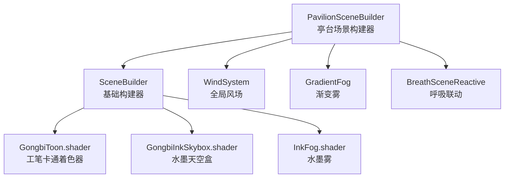
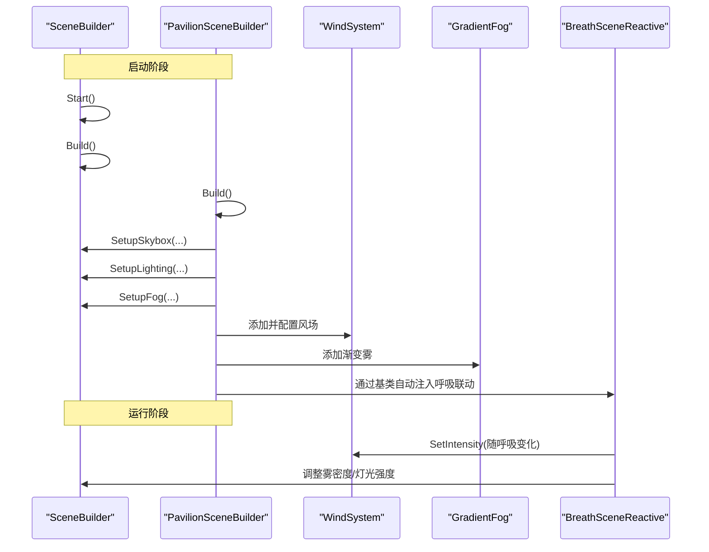
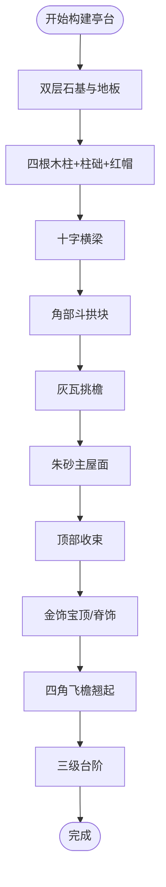
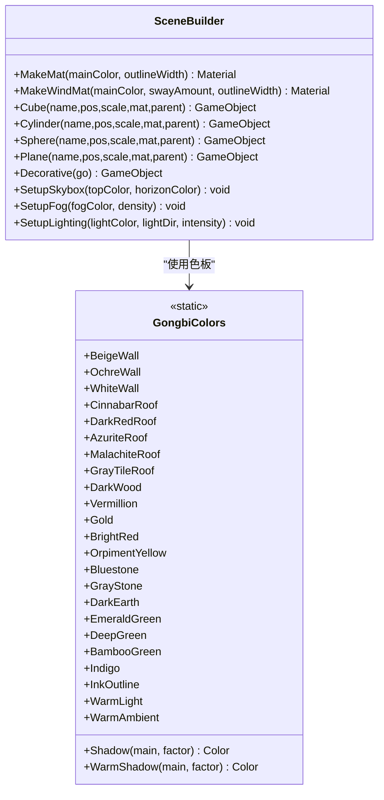
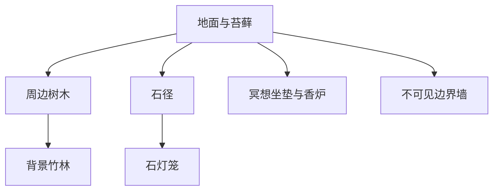
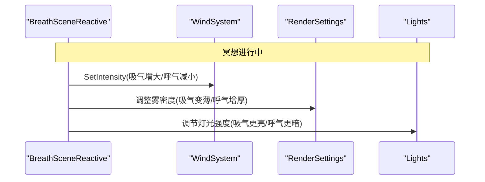
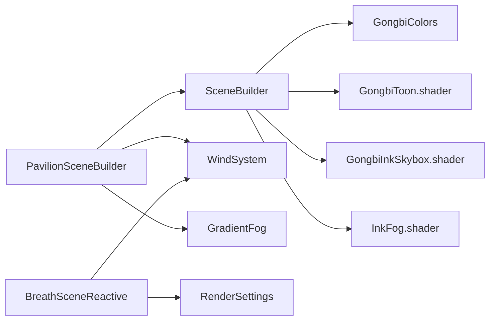

# 亭台场景实现

<cite>
**本文引用的文件**
- [PavilionSceneBuilder.cs](file://Assets/Scripts/Environment/PavilionSceneBuilder.cs)
- [SceneBuilder.cs](file://Assets/Scripts/Environment/SceneBuilder.cs)
- [GongbiColors.cs](file://Assets/Scripts/GongbiColors.cs)
- [WindSystem.cs](file://Assets/Scripts/Environment/WindSystem.cs)
- [GradientFog.cs](file://Assets/Scripts/Environment/GradientFog.cs)
- [BreathSceneReactive.cs](file://Assets/Scripts/Core/BreathSceneReactive.cs)
- [GongbiToon.shader](file://Assets/Shaders/GongbiToon.shader)
- [GongbiInkSkybox.shader](file://Assets/Shaders/GongbiInkSkybox.shader)
- [InkFog.shader](file://Assets/Shaders/InkFog.shader)
</cite>

## 目录
1. [简介](#简介)
2. [项目结构](#项目结构)
3. [核心组件](#核心组件)
4. [架构总览](#架构总览)
5. [详细组件分析](#详细组件分析)
6. [依赖关系分析](#依赖关系分析)
7. [性能与优化](#性能与优化)
8. [故障排查指南](#故障排查指南)
9. [结论](#结论)
10. [附录：扩展与自定义指南](#附录：扩展与自定义指南)

## 简介
本文件面向InkRidge项目中“亭台”冥想场景的开发与维护，聚焦于PavilionSceneBuilder如何以程序化方式构建中国传统建筑风格的亭台结构，并围绕其材料、纹理、环境布置、光照与氛围进行系统化说明。文档同时提供性能优化策略（含LOD思路）以及可扩展的自定义开发指南，帮助开发者快速理解、复用和扩展该场景。

## 项目结构
亭台场景由运行时生成的几何体与材质构成，遵循统一的SceneBuilder基类体系，配合工笔画风格着色器与全局风场、雾效系统，形成宁静祥和的冥想空间。

图表来源
- [PavilionSceneBuilder.cs:11-31](file://Assets/Scripts/Environment/PavilionSceneBuilder.cs#L11-L31)
- [SceneBuilder.cs:18-220](file://Assets/Scripts/Environment/SceneBuilder.cs#L18-L220)
- [GongbiToon.shader](file://Assets/Shaders/GongbiToon.shader)
- [GongbiInkSkybox.shader](file://Assets/Shaders/GongbiInkSkybox.shader)
- [InkFog.shader](file://Assets/Shaders/InkFog.shader)
- [WindSystem.cs:11-77](file://Assets/Scripts/Environment/WindSystem.cs#L11-L77)
- [GradientFog.cs:11-96](file://Assets/Scripts/Environment/GradientFog.cs#L11-L96)
- [BreathSceneReactive.cs:16-147](file://Assets/Scripts/Core/BreathSceneReactive.cs#L16-L147)

章节来源
- [PavilionSceneBuilder.cs:11-31](file://Assets/Scripts/Environment/PavilionSceneBuilder.cs#L11-L31)
- [SceneBuilder.cs:18-220](file://Assets/Scripts/Environment/SceneBuilder.cs#L18-L220)

## 核心组件
- PavilionSceneBuilder：负责亭台场景的具体构建，包括地面、亭台主体、树木、竹林、石径、灯笼、冥想点、边界墙等，并设置天空、光照、雾与风场。
- SceneBuilder：提供通用构建能力，如创建基本几何体、生成工笔画风格材质、设置天空盒、光照、雾、静态批处理合并等。
- GongbiColors：定义传统矿物颜料色板，为亭台各构件提供一致的色彩语义（朱砂、赭石、青石、竹青等）。
- WindSystem：驱动植被风动效果的全局风场，支持强度、方向、湍流与阵风密度等参数。
- GradientFog：提供渐变雾，营造水墨意境的空间层次。
- BreathSceneReactive：将呼吸节奏与场景联动（风、光、雾、发光体），增强冥想沉浸感。

章节来源
- [PavilionSceneBuilder.cs:11-31](file://Assets/Scripts/Environment/PavilionSceneBuilder.cs#L11-L31)
- [SceneBuilder.cs:18-220](file://Assets/Scripts/Environment/SceneBuilder.cs#L18-L220)
- [GongbiColors.cs:8-72](file://Assets/Scripts/GongbiColors.cs#L8-L72)
- [WindSystem.cs:11-77](file://Assets/Scripts/Environment/WindSystem.cs#L11-L77)
- [GradientFog.cs:11-96](file://Assets/Scripts/Environment/GradientFog.cs#L11-L96)
- [BreathSceneReactive.cs:16-147](file://Assets/Scripts/Core/BreathSceneReactive.cs#L16-L147)

## 架构总览
亭台场景采用“构建器 + 着色器 + 环境系统”的分层架构：
- 构建层：PavilionSceneBuilder继承SceneBuilder，按步骤组合几何体与材质。
- 渲染层：统一使用GongbiToon着色器呈现工笔画风格；天空盒使用GongbiInkSkybox；雾效使用InkFog。
- 环境层：WindSystem驱动植被摆动；GradientFog控制空间深度；BreathSceneReactive在冥想时联动风、光、雾与发光体。

图表来源
- [SceneBuilder.cs:198-220](file://Assets/Scripts/Environment/SceneBuilder.cs#L198-L220)
- [PavilionSceneBuilder.cs:11-31](file://Assets/Scripts/Environment/PavilionSceneBuilder.cs#L11-L31)
- [WindSystem.cs:49-77](file://Assets/Scripts/Environment/WindSystem.cs#L49-L77)
- [GradientFog.cs:72-96](file://Assets/Scripts/Environment/GradientFog.cs#L72-L96)
- [BreathSceneReactive.cs:93-124](file://Assets/Scripts/Core/BreathSceneReactive.cs#L93-L124)

## 详细组件分析

### 亭台建筑结构（柱子、屋顶、栏杆、台阶）
- 基座与地板：双层石基与木质地板，奠定稳定视觉重心。
- 四柱与柱础：圆柱形木柱搭配石质柱础与红色顶帽，体现传统榫卯与装饰细节。
- 横梁与斗拱：十字交叉梁与角部小方块模拟斗拱节点，支撑多层屋顶。
- 多层屋顶：灰瓦挑檐、朱砂主屋面、顶部收束与金饰宝顶，形成典型中式歇山/攒尖意象。
- 飞檐翘角：四角向上微翘，强化轻盈动感。
- 台阶：三级石阶引导进入路径。

图表来源
- [PavilionSceneBuilder.cs:61-155](file://Assets/Scripts/Environment/PavilionSceneBuilder.cs#L61-L155)

章节来源
- [PavilionSceneBuilder.cs:61-155](file://Assets/Scripts/Environment/PavilionSceneBuilder.cs#L61-L155)

### 材料与纹理配置（工笔画风格）
- 材质生成：SceneBuilder.MakeMat基于GongbiToon着色器，设置主色、阴影色、描边颜色与宽度，确保统一的工笔卡通渲染风格。
- 风动材质：MakeWindMat为植被增加风动参数，使树叶与竹子自然摇曳。
- 色彩体系：GongbiColors提供传统矿物颜料色板，用于墙体、屋顶、木材、石材、植物等，保证整体色调和谐。
- 天空与雾：SetupSkybox使用GongbiInkSkybox，Trilight环境光提升体积感；SetupFog与GradientFog共同营造水墨空间层次。

图表来源
- [SceneBuilder.cs:30-59](file://Assets/Scripts/Environment/SceneBuilder.cs#L30-L59)
- [GongbiColors.cs:8-72](file://Assets/Scripts/GongbiColors.cs#L8-L72)

章节来源
- [SceneBuilder.cs:30-59](file://Assets/Scripts/Environment/SceneBuilder.cs#L30-L59)
- [GongbiColors.cs:8-72](file://Assets/Scripts/GongbiColors.cs#L8-L72)

### 环境与装饰布局（庭院、植物、石径、灯笼）
- 地面与苔藓：大面积地面平面与随机分布的苔藓斑块，增加自然质感。
- 落叶点缀：低矮扁平球体模拟落叶，提升地表细节。
- 树木与竹林：环形分布的树木与背景竹林，形成围合庭院感。
- 石径与灯笼：沿入口方向铺设不规则石板，两侧放置石灯笼，营造幽静路径。
- 冥想点与香炉：亭内中央坐垫与小型香炉，强化冥想主题。
- 边界墙：不可见边界墙用于遮挡远处，避免穿帮。

图表来源
- [PavilionSceneBuilder.cs:33-59](file://Assets/Scripts/Environment/PavilionSceneBuilder.cs#L33-L59)
- [PavilionSceneBuilder.cs:157-204](file://Assets/Scripts/Environment/PavilionSceneBuilder.cs#L157-L204)
- [PavilionSceneBuilder.cs:206-240](file://Assets/Scripts/Environment/PavilionSceneBuilder.cs#L206-L240)
- [PavilionSceneBuilder.cs:242-272](file://Assets/Scripts/Environment/PavilionSceneBuilder.cs#L242-L272)

章节来源
- [PavilionSceneBuilder.cs:33-59](file://Assets/Scripts/Environment/PavilionSceneBuilder.cs#L33-L59)
- [PavilionSceneBuilder.cs:157-204](file://Assets/Scripts/Environment/PavilionSceneBuilder.cs#L157-L204)
- [PavilionSceneBuilder.cs:206-240](file://Assets/Scripts/Environment/PavilionSceneBuilder.cs#L206-L240)
- [PavilionSceneBuilder.cs:242-272](file://Assets/Scripts/Environment/PavilionSceneBuilder.cs#L242-L272)

### 光照与氛围设计（宁静祥和的冥想）
- 天空盒：柔和渐变的天空与云层速度，营造空灵背景。
- 环境光：Trilight模式，天顶、赤道、地面颜色分层，提升体积感。
- 定向光：暖色主光，无实时阴影以降低移动端开销，符合卡通渲染需求。
- 雾效：指数雾与渐变雾结合，控制景深与空气透视，突出水墨意境。
- 呼吸联动：冥想期间，风、光、雾与发光体随呼吸节奏变化，增强沉浸体验。

图表来源
- [BreathSceneReactive.cs:93-124](file://Assets/Scripts/Core/BreathSceneReactive.cs#L93-L124)
- [WindSystem.cs:49-77](file://Assets/Scripts/Environment/WindSystem.cs#L49-L77)
- [SceneBuilder.cs:152-196](file://Assets/Scripts/Environment/SceneBuilder.cs#L152-L196)

章节来源
- [SceneBuilder.cs:152-196](file://Assets/Scripts/Environment/SceneBuilder.cs#L152-L196)
- [BreathSceneReactive.cs:93-124](file://Assets/Scripts/Core/BreathSceneReactive.cs#L93-L124)

## 依赖关系分析
- PavilionSceneBuilder依赖SceneBuilder提供的材质与几何构建能力，并通过GongbiColors统一配色。
- 风场系统WindSystem为植被提供动态表现，被BreathSceneReactive在冥想中驱动。
- 雾效由SceneBuilder的基础雾与GradientFog共同作用，后者提供可编辑的渐变参数。
- 所有渲染均基于GongbiToon着色器，天空盒与雾效分别使用专用着色器。

图表来源
- [PavilionSceneBuilder.cs:11-31](file://Assets/Scripts/Environment/PavilionSceneBuilder.cs#L11-L31)
- [SceneBuilder.cs:18-220](file://Assets/Scripts/Environment/SceneBuilder.cs#L18-L220)
- [WindSystem.cs:11-77](file://Assets/Scripts/Environment/WindSystem.cs#L11-L77)
- [GradientFog.cs:11-96](file://Assets/Scripts/Environment/GradientFog.cs#L11-L96)
- [BreathSceneReactive.cs:16-147](file://Assets/Scripts/Core/BreathSceneReactive.cs#L16-L147)

章节来源
- [PavilionSceneBuilder.cs:11-31](file://Assets/Scripts/Environment/PavilionSceneBuilder.cs#L11-L31)
- [SceneBuilder.cs:18-220](file://Assets/Scripts/Environment/SceneBuilder.cs#L18-L220)

## 性能与优化
- 移除装饰碰撞体：对非交互装饰物调用Decorative系列方法，移除Collider以减少物理计算与内存占用。
- 静态批处理合并：在Start阶段收集MeshRenderer并按材质分组合并，显著降低Draw Call。
- 无实时阴影：定向光关闭阴影，避免额外几何Pass，适合移动端VR。
- 风场全局参数优化：WindSystem仅每帧更新必要参数，减少全局写入次数。
- LOD建议（扩展）：
  - 为亭台主体与大型植被建立多级别LOD组，根据相机距离切换简化模型或剔除次要部件（如斗拱、飞檐）。
  - 对竹林与树木使用实例化渲染或GPU Instancing，降低重复几何开销。
  - 对远景元素（背景树、竹林）使用更低面数或贴图替代。
  - 结合QualitySettings与平台特性动态调整雾密度与风动幅度。

章节来源
- [SceneBuilder.cs:109-146](file://Assets/Scripts/Environment/SceneBuilder.cs#L109-L146)
- [SceneBuilder.cs:198-220](file://Assets/Scripts/Environment/SceneBuilder.cs#L198-L220)
- [WindSystem.cs:34-63](file://Assets/Scripts/Environment/WindSystem.cs#L34-L63)

## 故障排查指南
- 场景未显示雾效：确认已添加GradientFog且Apply已调用；若其他场景无雾，检查是否调用了Clear重置全局雾参数。
- 植被不随风摆动：检查WindSystem是否启用且SetGlobal参数正确；确认材质使用了MakeWindMat并设置了WindSway。
- 呼吸联动无效：确认BreathSceneReactive已附加到场景，并在冥想会话中正确设置BreathGuide；检查风、光、雾参数范围是否合理。
- 材质颜色异常：核对GongbiColors色板值与MakeMat传入的主色；确认GongbiToon着色器可用。
- 性能下降：检查是否误用Collider于装饰物；确认静态批处理已执行；评估LOD与实例化策略。

章节来源
- [GradientFog.cs:72-96](file://Assets/Scripts/Environment/GradientFog.cs#L72-L96)
- [WindSystem.cs:49-77](file://Assets/Scripts/Environment/WindSystem.cs#L49-L77)
- [BreathSceneReactive.cs:51-71](file://Assets/Scripts/Core/BreathSceneReactive.cs#L51-L71)
- [SceneBuilder.cs:198-220](file://Assets/Scripts/Environment/SceneBuilder.cs#L198-L220)

## 结论
PavilionSceneBuilder通过程序化构建与传统工笔画风格渲染，成功实现了具有文化意蕴的亭台冥想场景。其模块化架构便于扩展与定制，结合风场、雾效与呼吸联动，营造出宁静祥和的氛围。通过合理的性能优化与LOD策略，可在多平台上保持流畅体验。

## 附录：扩展与自定义指南
- 扩展建筑风格：
  - 修改BuildPavilion中的尺寸、层级与装饰元素，替换为不同朝代或地域风格（如重檐庑殿、六角攒尖）。
  - 引入新的GongbiColors色值，扩展屋顶、木材与石材的配色方案。
- 自定义环境：
  - 调整BuildSurroundingTrees与BuildBambooBackground的参数，改变树木与竹林密度与高度。
  - 修改BuildStonePath与BuildLanterns，重新规划路径与装饰布局。
- 氛围与交互：
  - 在BreathSceneReactive中调整风、光、雾响应曲线与范围，匹配不同冥想节奏。
  - 使用GradientFog编辑渐变雾参数，塑造不同时间与天气下的空间层次。
- 性能与LOD：
  - 为关键构件（亭台、大树）创建LOD组，依据距离切换细节等级。
  - 对重复元素（竹叶、小草）采用实例化渲染或粒子替代。
  - 根据目标平台质量设置动态调整雾密度与风动幅度。

章节来源
- [PavilionSceneBuilder.cs:61-272](file://Assets/Scripts/Environment/PavilionSceneBuilder.cs#L61-L272)
- [GongbiColors.cs:8-72](file://Assets/Scripts/GongbiColors.cs#L8-L72)
- [BreathSceneReactive.cs:93-124](file://Assets/Scripts/Core/BreathSceneReactive.cs#L93-L124)
- [GradientFog.cs:45-96](file://Assets/Scripts/Environment/GradientFog.cs#L45-L96)