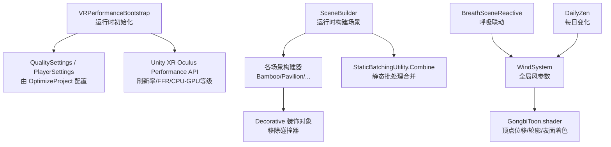
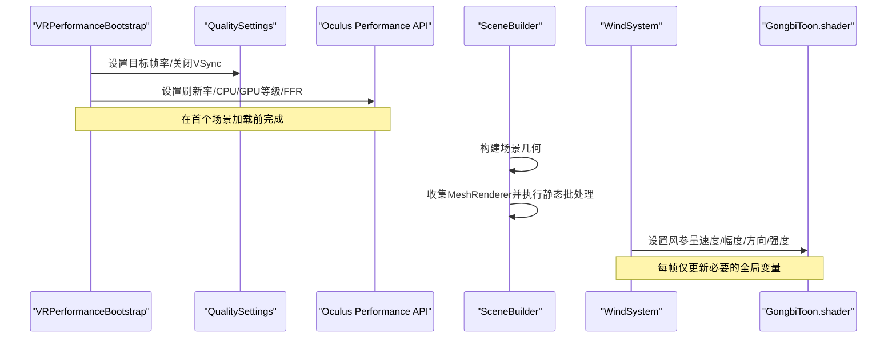
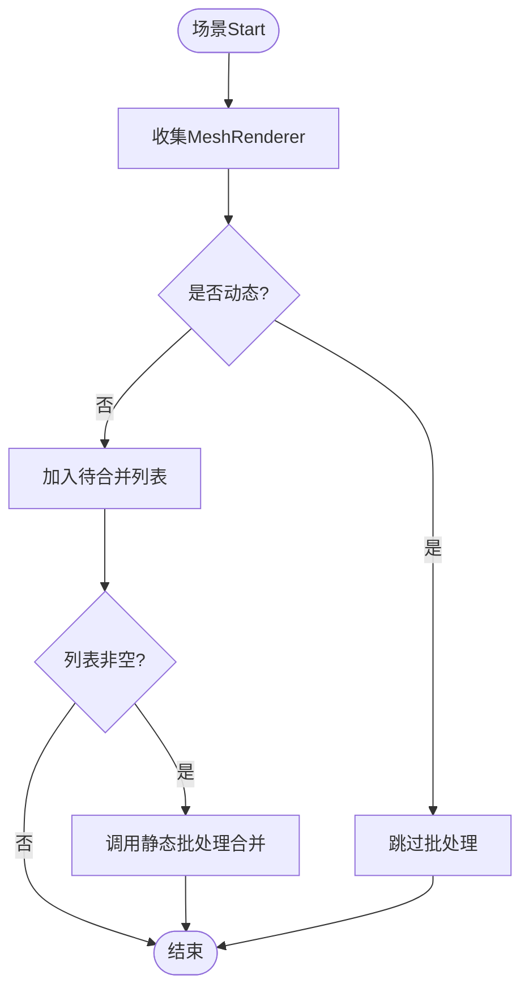
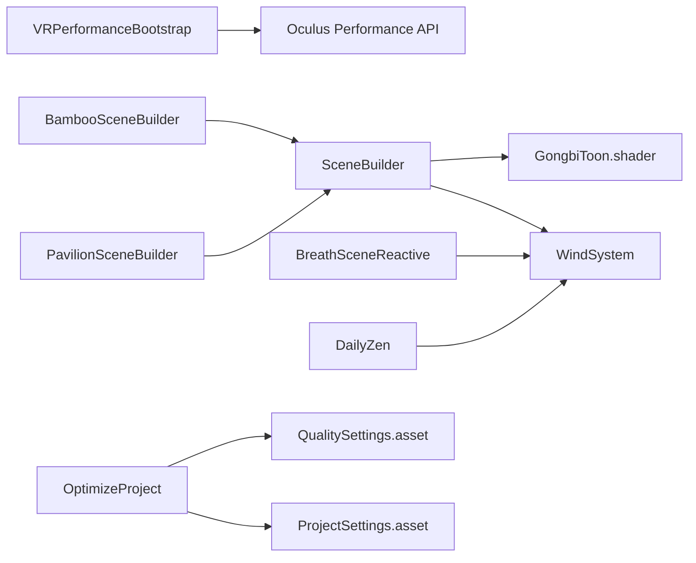

# 场景性能优化

<cite>
**本文引用的文件**
- [VRPerformanceBootstrap.cs](file://Assets/Scripts/Core/VRPerformanceBootstrap.cs)
- [SceneBuilder.cs](file://Assets/Scripts/Environment/SceneBuilder.cs)
- [BambooSceneBuilder.cs](file://Assets/Scripts/Environment/BambooSceneBuilder.cs)
- [PavilionSceneBuilder.cs](file://Assets/Scripts/Environment/PavilionSceneBuilder.cs)
- [WindSystem.cs](file://Assets/Scripts/Environment/WindSystem.cs)
- [BreathSceneReactive.cs](file://Assets/Scripts/Core/BreathSceneReactive.cs)
- [DailyZen.cs](file://Assets/Scripts/Environment/DailyZen.cs)
- [OptimizeProject.cs](file://Assets/Editor/OptimizeProject.cs)
- [GongbiToon.shader](file://Assets/Shaders/GongbiToon.shader)
- [QualitySettings.asset](file://ProjectSettings/QualitySettings.asset)
- [ProjectSettings.asset](file://ProjectSettings/ProjectSettings.asset)
</cite>

## 目录
1. [简介](#简介)
2. [项目结构](#项目结构)
3. [核心组件](#核心组件)
4. [架构总览](#架构总览)
5. [详细组件分析](#详细组件分析)
6. [依赖关系分析](#依赖关系分析)
7. [性能考量](#性能考量)
8. [故障排查指南](#故障排查指南)
9. [结论](#结论)
10. [附录](#附录)

## 简介
本技术文档聚焦于 InkRidge 在 VR 移动平台（Quest 系列）上的运行时场景生成与渲染性能优化。内容涵盖：静态批处理的正确用法、装饰对象碰撞器移除策略、VR 平台的渲染管线与内存管理要点、对象池与资源复用思路、LOD 与视锥剔除的应用建议，以及性能监控与基准调优方法。所有分析与建议均基于仓库中现有脚本与着色器的实现细节。

## 项目结构
InkRidge 的场景几何由运行时构建器统一生成，并通过编辑器工具为 Quest 3 目标进行质量与图形设置优化；渲染采用自研 Gongbi 风格着色器，配合风场系统驱动植被动画；VR 启动时通过引导脚本设定刷新率、CPU/GPU 等级与固定焦点渲染（FFR）。

图表来源
- [VRPerformanceBootstrap.cs:24-45](file://Assets/Scripts/Core/VRPerformanceBootstrap.cs#L24-L45)
- [OptimizeProject.cs:37-82](file://Assets/Editor/OptimizeProject.cs#L37-L82)
- [SceneBuilder.cs:198-219](file://Assets/Scripts/Environment/SceneBuilder.cs#L198-L219)
- [WindSystem.cs:34-63](file://Assets/Scripts/Environment/WindSystem.cs#L34-L63)
- [GongbiToon.shader:24-101](file://Assets/Shaders/GongbiToon.shader#L24-L101)

章节来源
- [VRPerformanceBootstrap.cs:24-45](file://Assets/Scripts/Core/VRPerformanceBootstrap.cs#L24-L45)
- [OptimizeProject.cs:37-82](file://Assets/Editor/OptimizeProject.cs#L37-L82)
- [SceneBuilder.cs:198-219](file://Assets/Scripts/Environment/SceneBuilder.cs#L198-L219)
- [WindSystem.cs:34-63](file://Assets/Scripts/Environment/WindSystem.cs#L34-L63)
- [GongbiToon.shader:24-101](file://Assets/Shaders/GongbiToon.shader#L24-L101)

## 核心组件
- VR 运行时引导：在首个场景加载前设置目标帧率、垂直同步关闭、显示刷新率、CPU/GPU 等级与固定焦点渲染级别，确保 VR 合成器节奏稳定并降低 GPU 负载。
- 场景构建器：运行时创建基础几何，收集 MeshRenderer 并调用静态批处理合并，减少绘制调用；提供装饰对象辅助函数以移除不必要的碰撞器。
- 风场系统：每帧仅更新必要的风参量，驱动着色器中的顶点位移与颜色扰动，避免多余的全局变量写入。
- 呼吸联动：根据呼吸阶段平滑调整风强度、灯光强度、雾密度与发光材质，增强沉浸感的同时保持低开销。
- 编辑器优化脚本：一键应用 Quest 3 质量、玩家设置、图形设置与音频压缩策略，保证构建产物稳定且可重复。

章节来源
- [VRPerformanceBootstrap.cs:24-45](file://Assets/Scripts/Core/VRPerformanceBootstrap.cs#L24-L45)
- [SceneBuilder.cs:109-146](file://Assets/Scripts/Environment/SceneBuilder.cs#L109-L146)
- [SceneBuilder.cs:198-219](file://Assets/Scripts/Environment/SceneBuilder.cs#L198-L219)
- [WindSystem.cs:34-63](file://Assets/Scripts/Environment/WindSystem.cs#L34-L63)
- [BreathSceneReactive.cs:93-124](file://Assets/Scripts/Core/BreathSceneReactive.cs#L93-L124)
- [OptimizeProject.cs:37-82](file://Assets/Editor/OptimizeProject.cs#L37-L82)

## 架构总览
下图展示了从 VR 启动到场景渲染的关键路径：运行时引导先设定设备能力与渲染节奏，随后场景构建器生成几何并进行静态批处理；风场系统与呼吸联动在运行期驱动着色器效果；编辑器脚本负责构建前的质量与图形配置。

图表来源
- [VRPerformanceBootstrap.cs:24-45](file://Assets/Scripts/Core/VRPerformanceBootstrap.cs#L24-L45)
- [SceneBuilder.cs:198-219](file://Assets/Scripts/Environment/SceneBuilder.cs#L198-L219)
- [WindSystem.cs:34-63](file://Assets/Scripts/Environment/WindSystem.cs#L34-L63)
- [GongbiToon.shader:24-101](file://Assets/Shaders/GongbiToon.shader#L24-L101)

## 详细组件分析

### 静态批处理（StaticBatchingUtility.Combine）的使用与最佳实践
- 使用方式：场景构建器在 Start 阶段收集根节点下的 MeshRenderer，排除标记为动态的渲染器后，一次性调用静态批处理合并，将多实例网格烘焙为单一组合网格，显著降低绘制调用。
- 注意事项：
  - 任何每帧修改共享网格或材质的渲染器必须标记为动态，否则批处理后无法按实例更新。
  - 粒子系统不受此影响（非 MeshRenderer），无需特殊处理。
  - 合并发生在运行时，因此编辑器内不可预批处理；需确保合并时机在场景可用之后。
- 最佳实践：
  - 尽量将静态环境元素（地面、建筑、装饰物）纳入批处理范围。
  - 对需要风动或逐帧变色的元素，使用独立材质或标记动态以避免破坏批处理。
  - 控制合并批次大小，避免单次合并过大导致内存峰值。

图表来源
- [SceneBuilder.cs:198-219](file://Assets/Scripts/Environment/SceneBuilder.cs#L198-L219)

章节来源
- [SceneBuilder.cs:198-219](file://Assets/Scripts/Environment/SceneBuilder.cs#L198-L219)

### 装饰性对象的碰撞器移除策略
- 策略：为装饰对象提供专用创建函数，自动移除 CreatePrimitive 附加的 Collider，避免无意义的物理计算与 MeshCollider 构建成本。
- 收益：
  - 减少宽相（broadphase）遍历与内存占用。
  - 避免平面等原语的 MeshCollider 构建开销。
  - 对大量装饰物（如竹林树叶、屋顶装饰）尤为有效。
- 实践建议：
  - 对所有不参与交互的视觉元素使用 Decor* 工厂函数。
  - 边界墙等需要碰撞的元素保留 Collider，但隐藏渲染器以减少视觉开销。

章节来源
- [SceneBuilder.cs:109-146](file://Assets/Scripts/Environment/SceneBuilder.cs#L109-L146)
- [BambooSceneBuilder.cs:180-195](file://Assets/Scripts/Environment/BambooSceneBuilder.cs#L180-L195)
- [PavilionSceneBuilder.cs:256-271](file://Assets/Scripts/Environment/PavilionSceneBuilder.cs#L256-L271)

### VR 移动平台的特殊优化要求
- 渲染管线与帧率：
  - 目标帧率锁定至 72fps，关闭 VSync，交由 VR 合成器管理节奏。
  - 启用 MSAA 2x 以缓解轮廓线走样问题。
  - 禁用实时阴影，因卡通风格不依赖阴影贴图。
- 设备能力与 FFR：
  - 通过 Oculus Performance API 设置显示刷新率、CPU/GPU 等级与固定焦点渲染级别，降低边缘像素着色成本。
  - 兼容 Vulkan 合成器路径，检测旧版 FFR API 可用性再设置。
- 构建与打包：
  - 使用 IL2CPP Release 与 ARM64 架构，开启 MTRendering、剥离引擎代码与未用网格组件。
  - 将关键着色器加入“始终包含”列表，防止被剥离导致运行时回退错误着色器。
  - 单通道实例化（Single-Pass Instanced）需在着色器声明立体宏后方可启用，当前脚本提供安全检查入口。

章节来源
- [VRPerformanceBootstrap.cs:24-45](file://Assets/Scripts/Core/VRPerformanceBootstrap.cs#L24-L45)
- [OptimizeProject.cs:53-82](file://Assets/Editor/OptimizeProject.cs#L53-L82)
- [OptimizeProject.cs:142-176](file://Assets/Editor/OptimizeProject.cs#L142-L176)
- [OptimizeProject.cs:204-243](file://Assets/Editor/OptimizeProject.cs#L204-L243)
- [OptimizeProject.cs:257-292](file://Assets/Editor/OptimizeProject.cs#L257-L292)

### 对象池技术与资源复用策略
- 现状：仓库未直接实现对象池；场景构建器通过运行时创建基础几何并使用静态批处理减少绘制调用。
- 建议：
  - 对频繁创建销毁的对象（如粒子发射器、临时指示物）引入对象池，避免 GC 抖动与分配峰值。
  - 复用材质实例与风参量，减少 SetGlobalFloat 与材质属性写入次数。
  - 对可复用的装饰物（石头、灯笼部件）使用预制体与池化，结合 Decorative 策略移除碰撞器。

[本节为概念性建议，不直接分析具体文件]

### LOD（细节层次）与视锥剔除
- 现状：
  - 着色器标注了 LOD 100，但未在运行时切换模型细节。
  - 场景构建器主要使用基础原语，未显式实现 LOD 组。
- 建议：
  - 为复杂模型（亭子、竹子集群）建立 LOD 组，远距离使用简化网格与更低面数材质。
  - 利用 Unity 内置视锥剔除与遮挡剔除，合理组织场景层级与包围盒。
  - 对远处装饰物使用更低的材质复杂度与关闭风动计算。

[本节为概念性建议，不直接分析具体文件]

### 风场与呼吸联动的性能要点
- 风场系统：
  - 仅在 OnEnable 时设置一次不变的全局风参量（速度、湍流、阵风密度），Update 中只更新变化的参量（幅度、方向、强度），减少 Shader.SetGlobalFloat 调用。
  - 着色器中根据高度因子与时间计算风位移，支持整体强度平滑过渡。
- 呼吸联动：
  - 根据呼吸阶段平滑插值风强度、灯光强度、雾密度与发光材质颜色，避免突变导致的视觉跳变与额外开销。
  - 自动发现并缓存相关 Light 与 Renderer，减少每帧查找成本。

章节来源
- [WindSystem.cs:34-63](file://Assets/Scripts/Environment/WindSystem.cs#L34-L63)
- [BreathSceneReactive.cs:51-71](file://Assets/Scripts/Core/BreathSceneReactive.cs#L51-L71)
- [BreathSceneReactive.cs:93-124](file://Assets/Scripts/Core/BreathSceneReactive.cs#L93-L124)
- [GongbiToon.shader:68-95](file://Assets/Shaders/GongbiToon.shader#L68-L95)
- [GongbiToon.shader:168-183](file://Assets/Shaders/GongbiToon.shader#L168-L183)

## 依赖关系分析
- VRPerformanceBootstrap 依赖 Unity XR Oculus 性能接口，负责设备级性能参数设置。
- SceneBuilder 依赖自定义着色器与风场系统，负责几何构建与批处理。
- 各场景构建器继承 SceneBuilder，扩展特定场景元素与布局。
- WindSystem 与 BreathSceneReactive 共同驱动着色器风参量与视觉效果。
- OptimizeProject 依赖 Unity Editor API 与 ProjectSettings，负责构建前配置。

图表来源
- [VRPerformanceBootstrap.cs:24-45](file://Assets/Scripts/Core/VRPerformanceBootstrap.cs#L24-L45)
- [SceneBuilder.cs:198-219](file://Assets/Scripts/Environment/SceneBuilder.cs#L198-L219)
- [WindSystem.cs:34-63](file://Assets/Scripts/Environment/WindSystem.cs#L34-L63)
- [BreathSceneReactive.cs:93-124](file://Assets/Scripts/Core/BreathSceneReactive.cs#L93-L124)
- [OptimizeProject.cs:53-82](file://Assets/Editor/OptimizeProject.cs#L53-L82)

章节来源
- [VRPerformanceBootstrap.cs:24-45](file://Assets/Scripts/Core/VRPerformanceBootstrap.cs#L24-L45)
- [SceneBuilder.cs:198-219](file://Assets/Scripts/Environment/SceneBuilder.cs#L198-L219)
- [WindSystem.cs:34-63](file://Assets/Scripts/Environment/WindSystem.cs#L34-L63)
- [BreathSceneReactive.cs:93-124](file://Assets/Scripts/Core/BreathSceneReactive.cs#L93-L124)
- [OptimizeProject.cs:53-82](file://Assets/Editor/OptimizeProject.cs#L53-L82)

## 性能考量
- 绘制调用优化：
  - 静态批处理合并静态几何，显著降低 DrawCall。
  - 禁用实时阴影，避免额外几何 pass。
  - 谨慎使用 GPU Instancing（当前着色器注释指出因每材质风参量与顶点位移而禁用），优先静态批处理。
- 物理与碰撞：
  - 装饰对象移除碰撞器，减少宽相与内存占用。
  - 边界墙仅保留碰撞，隐藏渲染器。
- 渲染管线与设备：
  - 目标帧率 72fps，关闭 VSync，MSAA 2x。
  - 启用 FFR 降低边缘像素着色成本。
  - 构建时使用 IL2CPP Release、ARM64、MTRendering、剥离未用组件。
- 内存与资源：
  - 音频流式加载长循环环境音，短音效解压加载，避免内存峰值。
  - 关键着色器加入始终包含列表，防止运行时缺失。
- 运行时开销：
  - 风场系统每帧仅更新必要全局变量。
  - 呼吸联动平滑插值，避免突变与额外计算。

章节来源
- [OptimizeProject.cs:53-82](file://Assets/Editor/OptimizeProject.cs#L53-L82)
- [OptimizeProject.cs:142-176](file://Assets/Editor/OptimizeProject.cs#L142-L176)
- [OptimizeProject.cs:296-333](file://Assets/Editor/OptimizeProject.cs#L296-L333)
- [SceneBuilder.cs:109-146](file://Assets/Scripts/Environment/SceneBuilder.cs#L109-L146)
- [WindSystem.cs:34-63](file://Assets/Scripts/Environment/WindSystem.cs#L34-L63)
- [GongbiToon.shader:24-101](file://Assets/Shaders/GongbiToon.shader#L24-L101)

## 故障排查指南
- 着色器缺失或回退错误着色器：
  - 检查是否已将所需着色器加入“始终包含”列表，避免构建剥离。
  - 确认运行时 Shader.Find 能成功获取着色器。
- 单通道实例化渲染异常：
  - 启用前需确保所有着色器声明立体宏，否则会呈现扁平错误的立体图像。
  - 使用编辑器菜单项检查缺失宏并提示修复。
- VR 刷新率或 FFR 设置无效：
  - 检查 Oculus Performance API 返回值，兼容 Vulkan 合成器路径。
  - 确认目标设备支持相应性能等级与 FFR 级别。
- 性能波动或卡顿：
  - 检查是否误将动态渲染器纳入静态批处理，导致后续更新失效。
  - 评估装饰对象是否仍携带碰撞器，必要时移除。
  - 监控风场与呼吸联动的全局变量写入频率，避免过多 SetGlobalFloat。

章节来源
- [OptimizeProject.cs:204-243](file://Assets/Editor/OptimizeProject.cs#L204-L243)
- [OptimizeProject.cs:257-292](file://Assets/Editor/OptimizeProject.cs#L257-L292)
- [VRPerformanceBootstrap.cs:24-45](file://Assets/Scripts/Core/VRPerformanceBootstrap.cs#L24-L45)
- [SceneBuilder.cs:198-219](file://Assets/Scripts/Environment/SceneBuilder.cs#L198-L219)

## 结论
InkRidge 通过运行时场景构建、静态批处理、装饰对象碰撞器移除、VR 设备性能引导与风场/呼吸联动，实现了在 Quest 平台上稳定的沉浸式体验。建议在后续迭代中引入对象池、LOD 与更精细的视锥剔除策略，进一步提升大规模场景的性能表现。同时，持续使用编辑器优化脚本与性能监控工具，确保构建产物与运行时行为一致且可维护。

[本节为总结性内容，不直接分析具体文件]

## 附录
- 性能监控与分析工具建议：
  - Unity Profiler：关注 CPU/GPU 耗时、DrawCall、三角面数、内存分配。
  - Frame Debugger：检查渲染 pass 与着色器调用，定位瓶颈。
  - Device Monitor（Quest Link/ADB）：观察设备温度、功耗与帧率稳定性。
- 基准测试建议：
  - 在不同场景（竹林、亭子、瀑布、山顶）下记录平均帧率、最低帧率与帧时间分布。
  - 对比开启/关闭静态批处理、风场强度、雾密度与 FFR 级别的性能差异。
  - 评估对象池与 LOD 引入后的性能提升与视觉质量折衷。

[本节为通用指导，不直接分析具体文件]