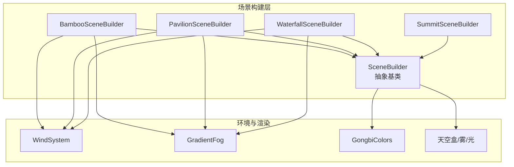
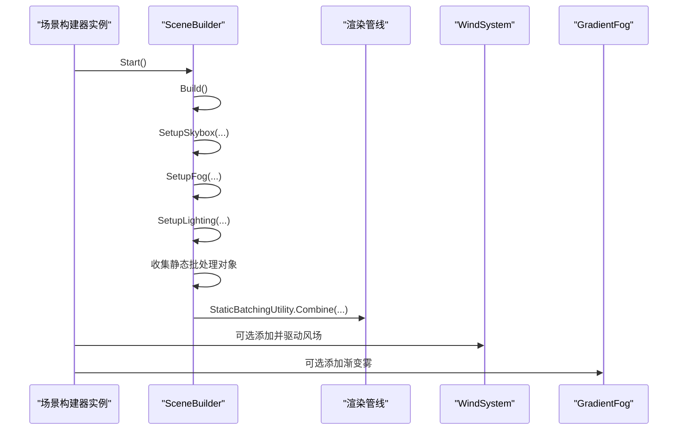
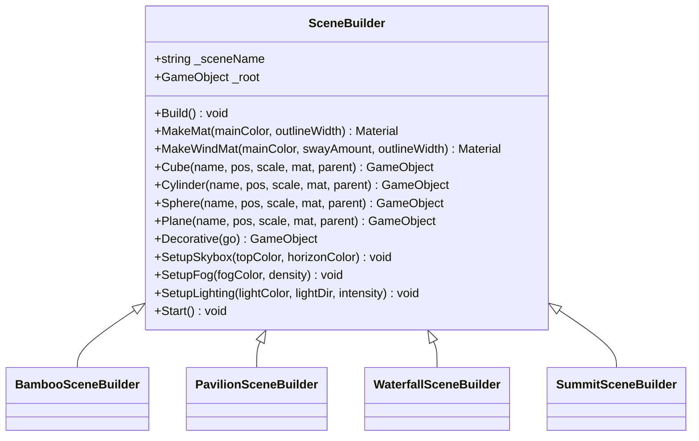
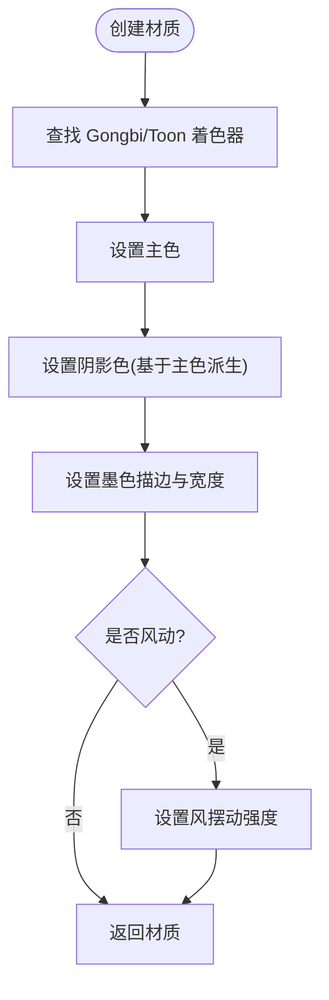
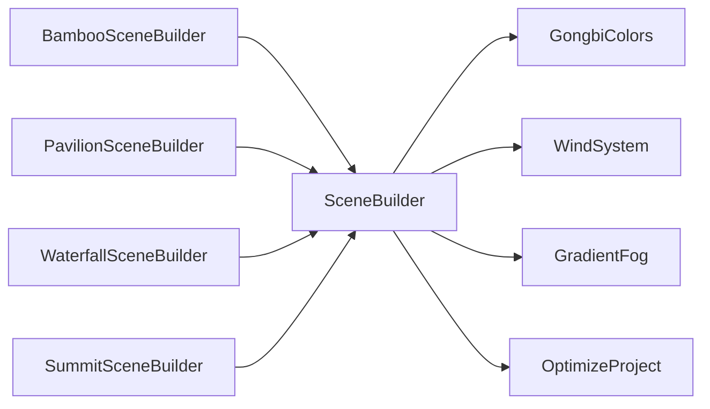

# 场景构建器架构

<cite>
**本文引用的文件**
- [SceneBuilder.cs](file://Assets/Scripts/Environment/SceneBuilder.cs)
- [BambooSceneBuilder.cs](file://Assets/Scripts/Environment/BambooSceneBuilder.cs)
- [PavilionSceneBuilder.cs](file://Assets/Scripts/Environment/PavilionSceneBuilder.cs)
- [WaterfallSceneBuilder.cs](file://Assets/Scripts/Environment/WaterfallSceneBuilder.cs)
- [SummitSceneBuilder.cs](file://Assets/Scripts/Environment/SummitSceneBuilder.cs)
- [GongbiColors.cs](file://Assets/Scripts/GongbiColors.cs)
- [WindSystem.cs](file://Assets/Scripts/Environment/WindSystem.cs)
- [GradientFog.cs](file://Assets/Scripts/Environment/GradientFog.cs)
- [OptimizeProject.cs](file://Assets/Editor/OptimizeProject.cs)
</cite>

## 目录
1. [简介](#简介)
2. [项目结构](#项目结构)
3. [核心组件](#核心组件)
4. [架构总览](#架构总览)
5. [详细组件分析](#详细组件分析)
6. [依赖关系分析](#依赖关系分析)
7. [性能考量](#性能考量)
8. [故障排查指南](#故障排查指南)
9. [结论](#结论)
10. [附录：扩展新场景类型指南](#附录：扩展新场景类型指南)

## 简介
本技术文档围绕 InkRidge 的场景构建器架构展开，重点解析 SceneBuilder 抽象基类的设计模式与职责，材料管理系统（MakeMat、MakeWindMat）、几何体创建工具方法（Cube/Cylinder/Sphere/Plane）、装饰性对象优化策略（Decorative）、天空盒设置（SetupSkybox）、雾效系统（SetupFog）与光照系统（SetupLighting）的实现细节。同时说明静态批处理优化机制与 IDynamicMeshRenderer 接口的作用，并提供扩展新场景类型的开发指南与最佳实践。

## 项目结构
InkRidge 采用“运行时程序化生成场景”的架构：每个场景由一个继承自 SceneBuilder 的具体构建器负责在运行时创建根节点、材质、几何体与环境效果。各场景构建器通过统一的工具方法与基类能力组合出不同的环境风格。

图表来源
- [SceneBuilder.cs:18-223](file://Assets/Scripts/Environment/SceneBuilder.cs#L18-L223)
- [BambooSceneBuilder.cs:9-37](file://Assets/Scripts/Environment/BambooSceneBuilder.cs#L9-L37)
- [PavilionSceneBuilder.cs:5-31](file://Assets/Scripts/Environment/PavilionSceneBuilder.cs#L5-L31)
- [WaterfallSceneBuilder.cs:5-35](file://Assets/Scripts/Environment/WaterfallSceneBuilder.cs#L5-L35)
- [SummitSceneBuilder.cs:5-20](file://Assets/Scripts/Environment/SummitSceneBuilder.cs#L5-L20)
- [WindSystem.cs:11-79](file://Assets/Scripts/Environment/WindSystem.cs#L11-L79)
- [GradientFog.cs:11-96](file://Assets/Scripts/Environment/GradientFog.cs#L11-L96)
- [GongbiColors.cs:8-72](file://Assets/Scripts/GongbiColors.cs#L8-L72)

章节来源
- [SceneBuilder.cs:18-223](file://Assets/Scripts/Environment/SceneBuilder.cs#L18-L223)
- [BambooSceneBuilder.cs:9-37](file://Assets/Scripts/Environment/BambooSceneBuilder.cs#L9-L37)
- [PavilionSceneBuilder.cs:5-31](file://Assets/Scripts/Environment/PavilionSceneBuilder.cs#L5-L31)
- [WaterfallSceneBuilder.cs:5-35](file://Assets/Scripts/Environment/WaterfallSceneBuilder.cs#L5-L35)
- [SummitSceneBuilder.cs:5-20](file://Assets/Scripts/Environment/SummitSceneBuilder.cs#L5-L20)

## 核心组件
- SceneBuilder：运行时场景生成的核心基类，提供材质创建、基础几何体构建、环境配置（天空盒/雾/光）、装饰对象优化以及静态批处理合并等通用能力。
- 具体场景构建器：Bamboo/Pavilion/Waterfall/Summit 等，各自实现 Build() 以编排场景元素与环境参数。
- GongbiColors：工笔画风格的统一颜色与阴影派生工具。
- WindSystem：全局风场驱动植被摇曳的全局着色器参数更新。
- GradientFog：渐变雾效，为自定义着色器提供雾距离与天顶/地平线颜色。

章节来源
- [SceneBuilder.cs:18-223](file://Assets/Scripts/Environment/SceneBuilder.cs#L18-L223)
- [GongbiColors.cs:8-72](file://Assets/Scripts/GongbiColors.cs#L8-L72)
- [WindSystem.cs:11-79](file://Assets/Scripts/Environment/WindSystem.cs#L11-L79)
- [GradientFog.cs:11-96](file://Assets/Scripts/Environment/GradientFog.cs#L11-L96)

## 架构总览
SceneBuilder 作为抽象基类，定义了场景构建的统一入口与工具方法；具体场景构建器通过重写 Build() 调用基类提供的 MakeMat/MakeWindMat、几何体创建、环境设置等方法，完成场景装配。启动时，Start() 会执行 Build()、添加每日禅与呼吸互动组件，并对根节点下的 MeshRenderer 进行静态批处理合并以提升渲染效率。

图表来源
- [SceneBuilder.cs:198-220](file://Assets/Scripts/Environment/SceneBuilder.cs#L198-L220)
- [BambooSceneBuilder.cs:17-37](file://Assets/Scripts/Environment/BambooSceneBuilder.cs#L17-L37)
- [PavilionSceneBuilder.cs:11-31](file://Assets/Scripts/Environment/PavilionSceneBuilder.cs#L11-L31)
- [WaterfallSceneBuilder.cs:13-35](file://Assets/Scripts/Environment/WaterfallSceneBuilder.cs#L13-L35)
- [SummitSceneBuilder.cs:7-20](file://Assets/Scripts/Environment/SummitSceneBuilder.cs#L7-L20)

## 详细组件分析

### SceneBuilder 抽象基类
- 设计模式：模板方法 + 工厂方法
  - 模板方法：Start() 固定流程（Build -> 添加交互组件 -> 静态批处理），子类仅关注 Build() 内容。
  - 工厂方法：MakeMat/MakeWindMat 封装材质创建与着色器参数设置，保证工笔画风格一致。
- 材质管理
  - MakeMat：基于 Gongbi/Toon 着色器创建材质，设置主色、阴影色、描边色与描边宽度，默认无风摆动。
  - MakeWindMat：在 MakeMat 基础上启用风摆动强度，用于植被等动态元素。
- 几何体创建工具
  - Cube/Cylinder/Sphere/Plane：统一接口创建基本几何体，自动挂载到根节点或指定父节点，并应用材质。
- 装饰性对象优化
  - Decorative：移除 CreatePrimitive 自动附加的 Collider，避免不必要的碰撞计算与内存开销。
  - DecorCube/DecorCylinder/DecorSphere/DecorPlane：便捷装饰变体。
- 环境设置
  - SetupSkybox：使用 Gongbi/InkSkybox 着色器设置天顶/地平线/底部/云色与云层覆盖、速度、颗粒感，并配置 Trilight 环境光。
  - SetupFog：指数雾，设置雾颜色与密度。
  - SetupLighting：创建方向光，关闭实时阴影以降低 VR 移动端开销。
- 静态批处理与 IDynamicMeshRenderer
  - 在 Start() 中收集根节点下所有 MeshRenderer，若其父级未标记 IDynamicMeshRenderer，则加入静态批处理列表并合并，减少绘制调用。
  - IDynamicMeshRenderer 用于标记每帧重建或重着色的网格，避免被静态批处理烘焙后无法更新。

图表来源
- [SceneBuilder.cs:18-223](file://Assets/Scripts/Environment/SceneBuilder.cs#L18-L223)
- [BambooSceneBuilder.cs:9-37](file://Assets/Scripts/Environment/BambooSceneBuilder.cs#L9-L37)
- [PavilionSceneBuilder.cs:5-31](file://Assets/Scripts/Environment/PavilionSceneBuilder.cs#L5-L31)
- [WaterfallSceneBuilder.cs:5-35](file://Assets/Scripts/Environment/WaterfallSceneBuilder.cs#L5-L35)
- [SummitSceneBuilder.cs:5-20](file://Assets/Scripts/Environment/SummitSceneBuilder.cs#L5-L20)

章节来源
- [SceneBuilder.cs:18-223](file://Assets/Scripts/Environment/SceneBuilder.cs#L18-L223)

### 材料管理系统（MakeMat、MakeWindMat）
- MakeMat：
  - 查找并使用 Gongbi/Toon 着色器。
  - 设置主色、阴影色（基于 GongbiColors.Shadow）、墨色描边与描边宽度。
  - 默认风摆动为 0。
- MakeWindMat：
  - 复用 MakeMat，设置风摆动强度，使植被在风场中摇曳。
- 颜色体系：
  - GongbiColors 提供传统矿物颜料配色及阴影派生方法，确保视觉风格统一。

图表来源
- [SceneBuilder.cs:30-59](file://Assets/Scripts/Environment/SceneBuilder.cs#L30-L59)
- [GongbiColors.cs:8-72](file://Assets/Scripts/GongbiColors.cs#L8-L72)

章节来源
- [SceneBuilder.cs:30-59](file://Assets/Scripts/Environment/SceneBuilder.cs#L30-L59)
- [GongbiColors.cs:8-72](file://Assets/Scripts/GongbiColors.cs#L8-L72)

### 几何体创建工具方法（Cube、Cylinder、Sphere、Plane）
- 统一接口：名称、位置、缩放、材质、父节点。
- 自动挂载：将创建的 Primitive 添加到根节点或指定父节点。
- 材质应用：自动获取 Renderer 并设置材质。
- 装饰变体：Decor* 系列在创建后调用 Decorative 移除 Collider，提升性能。

章节来源
- [SceneBuilder.cs:61-146](file://Assets/Scripts/Environment/SceneBuilder.cs#L61-L146)

### 装饰性对象优化策略（Decorative）
- 动机：CreatePrimitive 会为每个几何体附加 Collider，但大量装饰物（如树叶、远景山石）从不参与碰撞，却仍会参与宽相计算与内存占用。
- 实现：Decorative 检测并销毁 Collider；Decor* 系列便捷调用。
- 收益：显著降低碰撞计算与内存，尤其对大量小物件场景（如竹林叶片）效果明显。

章节来源
- [SceneBuilder.cs:109-146](file://Assets/Scripts/Environment/SceneBuilder.cs#L109-L146)

### 天空盒设置（SetupSkybox）
- 使用 Gongbi/InkSkybox 着色器，设置天顶色、地平线色、底部色、云色、云层覆盖度、速度、颗粒感。
- 配置 Trilight 环境光：天顶、赤道、地面反射色与强度，增强体积感与氛围。

章节来源
- [SceneBuilder.cs:148-173](file://Assets/Scripts/Environment/SceneBuilder.cs#L148-L173)

### 雾效系统（SetupFog）
- 使用指数雾，设置雾颜色与密度，营造水墨意境。
- 配合 GradientFog 可进一步定制天顶/地平线渐变雾。

章节来源
- [SceneBuilder.cs:175-181](file://Assets/Scripts/Environment/SceneBuilder.cs#L175-L181)
- [GradientFog.cs:11-96](file://Assets/Scripts/Environment/GradientFog.cs#L11-L96)

### 光照系统（SetupLighting）
- 创建方向光，设置颜色、强度与朝向。
- 关闭实时阴影以减少 VR 移动端额外几何 pass 开销；卡通风格不依赖阴影贴图。

章节来源
- [SceneBuilder.cs:183-196](file://Assets/Scripts/Environment/SceneBuilder.cs#L183-L196)

### 静态批处理优化与 IDynamicMeshRenderer
- 静态批处理：在 Start() 中收集根节点下 MeshRenderer，排除标记了 IDynamicMeshRenderer 的对象，合并为单一批次，减少绘制调用。
- IDynamicMeshRenderer：用于标记每帧重建或重着色的网格，避免被静态批处理烘焙后无法更新。

章节来源
- [SceneBuilder.cs:5-11](file://Assets/Scripts/Environment/SceneBuilder.cs#L5-L11)
- [SceneBuilder.cs:198-220](file://Assets/Scripts/Environment/SceneBuilder.cs#L198-L220)

### 风场系统（WindSystem）
- 全局风场：通过全局着色器参数驱动植被摇曳（_WindSpeed、_WindMagnitude、_WindTurbulence、风向、阵风密度、强度）。
- 性能优化：仅在 OnEnable 设置固定参数，Update 仅推送变化值，减少全局写入次数。
- 控制接口：SetIntensity、SetDirection 支持运行时调整。

章节来源
- [WindSystem.cs:11-79](file://Assets/Scripts/Environment/WindSystem.cs#L11-L79)

### 渐变雾（GradientFog）
- 功能：为自定义着色器提供雾距离、天顶色、地平线色与地平线远距色。
- 性能：OnEnable 一次性推送常量，避免每帧重复写入全局缓冲。
- 清理：OnDisable 清除全局雾参数，防止跨场景污染。

章节来源
- [GradientFog.cs:11-96](file://Assets/Scripts/Environment/GradientFog.cs#L11-L96)

### 场景构建器示例
- BambooSceneBuilder：竹林步道、分层地面、散落岩石、冥想点、边界墙、风场与渐变雾、暖光与指数雾。
- PavilionSceneBuilder：亭台建筑、树木背景、竹林背景、石板路、灯笼、冥想点、边界墙、风场与渐变雾。
- WaterfallSceneBuilder：悬崖、瀑布、水池、攀爬抓手、植被、冥想平台、边界墙、风场与渐变雾。
- SummitSceneBuilder：山顶平台、星空、远山、石碑、石灯笼、冥想点、边界墙、冷色调光与低密度雾。

章节来源
- [BambooSceneBuilder.cs:9-198](file://Assets/Scripts/Environment/BambooSceneBuilder.cs#L9-L198)
- [PavilionSceneBuilder.cs:5-275](file://Assets/Scripts/Environment/PavilionSceneBuilder.cs#L5-L275)
- [WaterfallSceneBuilder.cs:5-255](file://Assets/Scripts/Environment/WaterfallSceneBuilder.cs#L5-L255)
- [SummitSceneBuilder.cs:5-212](file://Assets/Scripts/Environment/SummitSceneBuilder.cs#L5-L212)

## 依赖关系分析
- 场景构建器依赖 SceneBuilder 提供的工具方法与环境设置。
- 材质与着色器依赖 GongbiColors 与 OptimizeProject 确保着色器不被剥离。
- 风场与雾效通过全局着色器参数影响材质与自定义着色器。
- 静态批处理依赖 Unity 的 StaticBatchingUtility，需排除动态网格。

图表来源
- [SceneBuilder.cs:18-223](file://Assets/Scripts/Environment/SceneBuilder.cs#L18-L223)
- [OptimizeProject.cs:1-34](file://Assets/Editor/OptimizeProject.cs#L1-L34)

章节来源
- [SceneBuilder.cs:18-223](file://Assets/Scripts/Environment/SceneBuilder.cs#L18-L223)
- [OptimizeProject.cs:1-34](file://Assets/Editor/OptimizeProject.cs#L1-L34)

## 性能考量
- 静态批处理：合并静态网格，减少绘制调用；排除动态网格以避免烘焙后无法更新。
- 装饰对象去碰撞：移除不必要 Collider，降低宽相计算与内存占用。
- 风场与雾效全局参数：仅在必要时更新，减少全局写入次数。
- 光照阴影：关闭实时阴影，降低 VR 移动端开销。
- 着色器保留：通过编辑器脚本确保运行时按名称查找的着色器不被剥离。

章节来源
- [SceneBuilder.cs:109-146](file://Assets/Scripts/Environment/SceneBuilder.cs#L109-L146)
- [SceneBuilder.cs:183-196](file://Assets/Scripts/Environment/SceneBuilder.cs#L183-L196)
- [WindSystem.cs:34-63](file://Assets/Scripts/Environment/WindSystem.cs#L34-L63)
- [GradientFog.cs:59-93](file://Assets/Scripts/Environment/GradientFog.cs#L59-L93)
- [OptimizeProject.cs:13-34](file://Assets/Editor/OptimizeProject.cs#L13-L34)

## 故障排查指南
- 材质显示错误（品红色）：检查着色器是否被剥离。确保 OptimizeProject 包含所需着色器名称。
- 风场无效：确认 WindSystem 已添加到场景且目标强度非零；检查全局着色器参数是否正确设置。
- 雾效异常：确认 GradientFog 已启用并在场景切换时正确 Clear；检查雾距离与颜色参数。
- 静态批处理未生效：检查是否存在 IDynamicMeshRenderer 标记；确认对象属于根节点且为 MeshRenderer。
- 碰撞干扰：确认装饰对象已通过 Decorative 移除 Collider；如需碰撞，手动添加合适形状。

章节来源
- [OptimizeProject.cs:13-34](file://Assets/Editor/OptimizeProject.cs#L13-L34)
- [WindSystem.cs:34-79](file://Assets/Scripts/Environment/WindSystem.cs#L34-L79)
- [GradientFog.cs:59-93](file://Assets/Scripts/Environment/GradientFog.cs#L59-L93)
- [SceneBuilder.cs:109-146](file://Assets/Scripts/Environment/SceneBuilder.cs#L109-L146)
- [SceneBuilder.cs:198-220](file://Assets/Scripts/Environment/SceneBuilder.cs#L198-L220)

## 结论
InkRidge 的场景构建器架构通过 SceneBuilder 抽象基类实现了高度一致的运行时场景生成流程，结合工笔画风格材质、统一几何体创建工具、装饰对象优化、天空盒/雾/光配置以及静态批处理，既保证了视觉风格的一致性，又兼顾了移动端 VR 的性能需求。具体场景构建器通过组合这些能力快速搭建不同环境，具备良好的可扩展性与维护性。

## 附录：扩展新场景类型指南
- 新建场景构建器
  - 创建继承自 SceneBuilder 的新类，实现 Build() 方法。
  - 在 Build() 中调用基类的环境设置（SetupSkybox、SetupFog、SetupLighting）与几何体创建工具。
- 材质与颜色
  - 使用 MakeMat/MakeWindMat 创建材质，优先从 GongbiColors 选取配色。
  - 对需要风动的植被使用 MakeWindMat，并合理设置摆动强度。
- 几何体与装饰
  - 使用 Cube/Cylinder/Sphere/Plane 创建基础几何体。
  - 对不参与碰撞的装饰对象使用 Decor* 系列，自动移除 Collider。
- 环境组件
  - 根据需要添加 WindSystem 与 GradientFog，并在场景中配置参数。
  - 使用 SetupLighting 配置方向光，关闭阴影以提升性能。
- 静态批处理
  - 若某网格每帧重建或重着色，为其父级添加 IDynamicMeshRenderer 标记，避免被静态批处理。
- 测试与调试
  - 在编辑器中运行场景，检查材质、风场、雾效与光照是否符合预期。
  - 使用 Profiler 检查绘制调用与碰撞开销，必要时调整装饰对象与批处理策略。

章节来源
- [SceneBuilder.cs:18-223](file://Assets/Scripts/Environment/SceneBuilder.cs#L18-L223)
- [BambooSceneBuilder.cs:9-198](file://Assets/Scripts/Environment/BambooSceneBuilder.cs#L9-L198)
- [PavilionSceneBuilder.cs:5-275](file://Assets/Scripts/Environment/PavilionSceneBuilder.cs#L5-L275)
- [WaterfallSceneBuilder.cs:5-255](file://Assets/Scripts/Environment/WaterfallSceneBuilder.cs#L5-L255)
- [SummitSceneBuilder.cs:5-212](file://Assets/Scripts/Environment/SummitSceneBuilder.cs#L5-L212)
- [GongbiColors.cs:8-72](file://Assets/Scripts/GongbiColors.cs#L8-L72)
- [WindSystem.cs:11-79](file://Assets/Scripts/Environment/WindSystem.cs#L11-L79)
- [GradientFog.cs:11-96](file://Assets/Scripts/Environment/GradientFog.cs#L11-L96)
- [OptimizeProject.cs:1-34](file://Assets/Editor/OptimizeProject.cs#L1-L34)