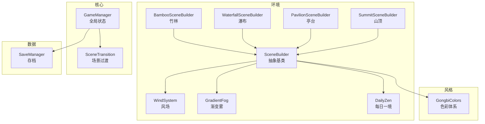
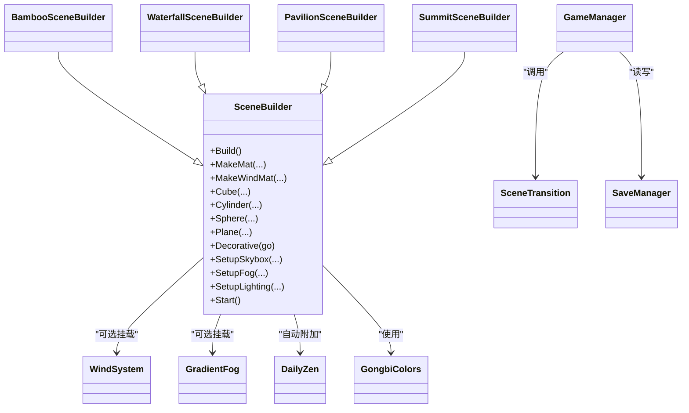
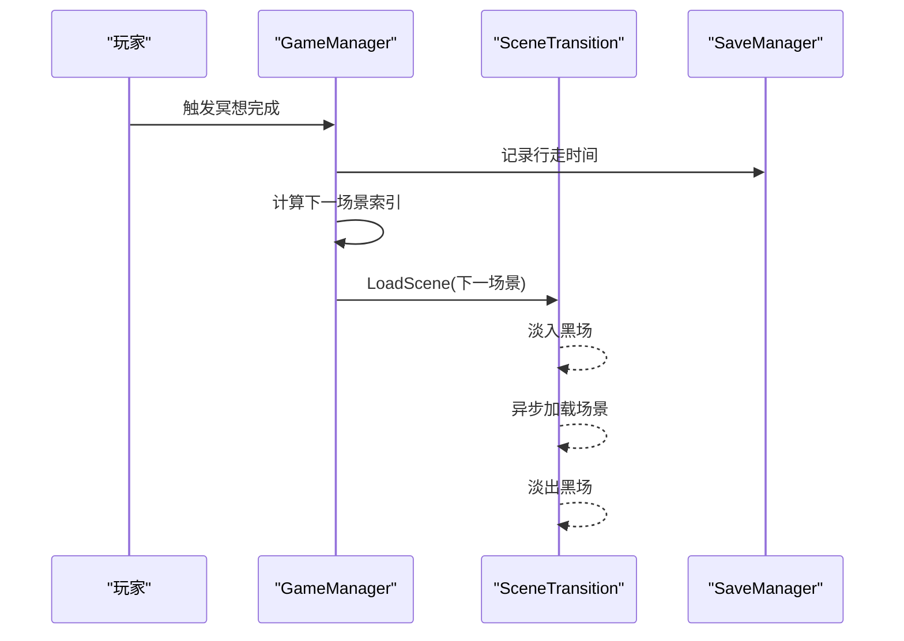
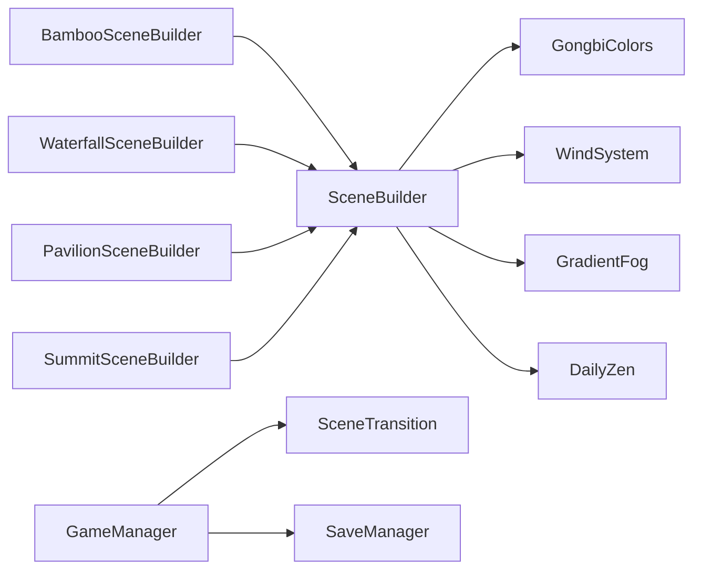

# 场景系统

<cite>
**本文引用的文件**
- [SceneBuilder.cs](file://Assets/Scripts/Environment/SceneBuilder.cs)
- [BambooSceneBuilder.cs](file://Assets/Scripts/Environment/BambooSceneBuilder.cs)
- [WaterfallSceneBuilder.cs](file://Assets/Scripts/Environment/WaterfallSceneBuilder.cs)
- [PavilionSceneBuilder.cs](file://Assets/Scripts/Environment/PavilionSceneBuilder.cs)
- [SummitSceneBuilder.cs](file://Assets/Scripts/Environment/SummitSceneBuilder.cs)
- [WindSystem.cs](file://Assets/Scripts/Environment/WindSystem.cs)
- [GradientFog.cs](file://Assets/Scripts/Environment/GradientFog.cs)
- [DailyZen.cs](file://Assets/Scripts/Environment/DailyZen.cs)
- [SceneTransition.cs](file://Assets/Scripts/Core/SceneTransition.cs)
- [GameManager.cs](file://Assets/Scripts/Core/GameManager.cs)
- [SaveManager.cs](file://Assets/Scripts/Data/SaveManager.cs)
- [GongbiColors.cs](file://Assets/Scripts/GongbiColors.cs)
</cite>

## 目录
1. [简介](#简介)
2. [项目结构](#项目结构)
3. [核心组件](#核心组件)
4. [架构总览](#架构总览)
5. [详细组件分析](#详细组件分析)
6. [依赖关系分析](#依赖关系分析)
7. [性能考量](#性能考量)
8. [故障排查指南](#故障排查指南)
9. [结论](#结论)
10. [附录：新增场景开发指南与最佳实践](#附录新增场景开发指南与最佳实践)

## 简介
本文件为 InkRidge 的场景系统提供系统化、可操作的架构文档。重点覆盖：
- SceneBuilder 抽象基类的设计模式与运行时场景生成机制
- 四种具体场景构建器（竹林、瀑布、亭台、山顶）的实现差异与环境特色
- 程序化内容生成算法（几何体创建、材质分配、光照设置）
- 性能优化策略（静态批处理、对象池建议、内存管理）
- 场景切换流程与进度解锁机制
- 添加新场景的开发指南与最佳实践

## 项目结构
InkRidge 的场景系统以“抽象基类 + 多实现”的方式组织，位于 Environment 目录下；核心流程由 Core 下的管理器驱动；数据持久化在 Data 下；颜色与风格统一通过 GongbiColors 管理。

图表来源
- [SceneBuilder.cs:18-220](file://Assets/Scripts/Environment/SceneBuilder.cs#L18-L220)
- [BambooSceneBuilder.cs:17-37](file://Assets/Scripts/Environment/BambooSceneBuilder.cs#L17-L37)
- [WaterfallSceneBuilder.cs:13-35](file://Assets/Scripts/Environment/WaterfallSceneBuilder.cs#L13-L35)
- [PavilionSceneBuilder.cs:11-31](file://Assets/Scripts/Environment/PavilionSceneBuilder.cs#L11-L31)
- [SummitSceneBuilder.cs:7-20](file://Assets/Scripts/Environment/SummitSceneBuilder.cs#L7-L20)
- [WindSystem.cs:11-79](file://Assets/Scripts/Environment/WindSystem.cs#L11-L79)
- [GradientFog.cs:11-96](file://Assets/Scripts/Environment/GradientFog.cs#L11-L96)
- [DailyZen.cs:14-85](file://Assets/Scripts/Environment/DailyZen.cs#L14-L85)
- [SceneTransition.cs:10-61](file://Assets/Scripts/Core/SceneTransition.cs#L10-L61)
- [GameManager.cs:10-66](file://Assets/Scripts/Core/GameManager.cs#L10-L66)
- [SaveManager.cs:13-118](file://Assets/Scripts/Data/SaveManager.cs#L13-L118)
- [GongbiColors.cs:8-72](file://Assets/Scripts/GongbiColors.cs#L8-L72)

章节来源
- [SceneBuilder.cs:18-220](file://Assets/Scripts/Environment/SceneBuilder.cs#L18-L220)
- [BambooSceneBuilder.cs:17-37](file://Assets/Scripts/Environment/BambooSceneBuilder.cs#L17-L37)
- [WaterfallSceneBuilder.cs:13-35](file://Assets/Scripts/Environment/WaterfallSceneBuilder.cs#L13-L35)
- [PavilionSceneBuilder.cs:11-31](file://Assets/Scripts/Environment/PavilionSceneBuilder.cs#L11-L31)
- [SummitSceneBuilder.cs:7-20](file://Assets/Scripts/Environment/SummitSceneBuilder.cs#L7-L20)

## 核心组件
- SceneBuilder：抽象基类，负责运行时创建根节点、材质、基础几何体、天空盒、光照、雾效，并在 Start 中执行静态批合并与附加通用组件（每日禅意、呼吸联动）。
- 具体场景构建器：继承 SceneBuilder，覆写 Build 以组合各自的环境元素（地面、路径、植被、建筑、边界墙等），并配置专属光照与雾。
- WindSystem：全局风场，驱动着色器参数以实现植被摇曳。
- GradientFog：渐变雾，设置全局雾参数，避免每帧重复写入常量缓冲。
- DailyZen：基于日期的稳定随机种子，微调雾色/密度与风向，并记录打卡。
- SceneTransition：黑场淡入淡出异步加载场景。
- GameManager：全局单例，维护行走计时、冥想完成后的下一场景跳转逻辑。
- SaveManager：本地 JSON 存档，管理最高解锁关卡、累计时间、打卡天数等。
- GongbiColors：统一的工笔矿物颜料配色表，确保视觉一致性。

章节来源
- [SceneBuilder.cs:18-220](file://Assets/Scripts/Environment/SceneBuilder.cs#L18-L220)
- [WindSystem.cs:11-79](file://Assets/Scripts/Environment/WindSystem.cs#L11-L79)
- [GradientFog.cs:11-96](file://Assets/Scripts/Environment/GradientFog.cs#L11-L96)
- [DailyZen.cs:14-85](file://Assets/Scripts/Environment/DailyZen.cs#L14-L85)
- [SceneTransition.cs:10-61](file://Assets/Scripts/Core/SceneTransition.cs#L10-L61)
- [GameManager.cs:10-66](file://Assets/Scripts/Core/GameManager.cs#L10-L66)
- [SaveManager.cs:13-118](file://Assets/Scripts/Data/SaveManager.cs#L13-L118)
- [GongbiColors.cs:8-72](file://Assets/Scripts/GongbiColors.cs#L8-L72)

## 架构总览
场景系统采用“基类抽象 + 多态实现”的分层架构：
- 基类封装通用能力（材质工厂、基础几何体、天空盒、光照、雾、静态批合并）
- 各场景构建器专注“内容编排”，通过调用基类 API 快速拼装环境
- 核心管理器负责流程控制（开始游戏、冥想完成、跳过冥想）
- 数据层负责进度与统计的持久化

图表来源
- [SceneBuilder.cs:18-220](file://Assets/Scripts/Environment/SceneBuilder.cs#L18-L220)
- [BambooSceneBuilder.cs:9-37](file://Assets/Scripts/Environment/BambooSceneBuilder.cs#L9-L37)
- [WaterfallSceneBuilder.cs:5-35](file://Assets/Scripts/Environment/WaterfallSceneBuilder.cs#L5-L35)
- [PavilionSceneBuilder.cs:5-31](file://Assets/Scripts/Environment/PavilionSceneBuilder.cs#L5-L31)
- [SummitSceneBuilder.cs:5-20](file://Assets/Scripts/Environment/SummitSceneBuilder.cs#L5-L20)
- [WindSystem.cs:11-79](file://Assets/Scripts/Environment/WindSystem.cs#L11-L79)
- [GradientFog.cs:11-96](file://Assets/Scripts/Environment/GradientFog.cs#L11-L96)
- [DailyZen.cs:14-85](file://Assets/Scripts/Environment/DailyZen.cs#L14-L85)
- [SceneTransition.cs:10-61](file://Assets/Scripts/Core/SceneTransition.cs#L10-L61)
- [GameManager.cs:10-66](file://Assets/Scripts/Core/GameManager.cs#L10-L66)
- [SaveManager.cs:13-118](file://Assets/Scripts/Data/SaveManager.cs#L13-L118)
- [GongbiColors.cs:8-72](file://Assets/Scripts/GongbiColors.cs#L8-L72)

## 详细组件分析

### SceneBuilder 抽象基类
- 设计要点
  - 通过 MakeMat / MakeWindMat 统一材质创建，绑定工笔画风格的 Toon 着色器与轮廓线宽度
  - 提供 Cube/Cylinder/Sphere/Plane 及 Decor* 变体，后者自动移除 Collider 以降低开销
  - SetupSkybox 设置自定义水墨天空盒与 Trilight 环境光
  - SetupFog 设置指数雾
  - SetupLighting 创建方向光并关闭实时阴影以节省移动端 VR 性能
  - Start 中自动附加 DailyZen 与呼吸联动组件，并对 MeshRenderer 进行静态批合并（排除动态标记）
- 复杂度与性能
  - 批量合并将数百个装饰网格合并为少量绘制调用，显著降低 DrawCall
  - 移除装饰物 Collider 减少碰撞检测与 MeshCollider 构建成本
- 扩展点
  - 子类只需覆写 Build，调用基类工具方法即可快速搭建场景

章节来源
- [SceneBuilder.cs:18-220](file://Assets/Scripts/Environment/SceneBuilder.cs#L18-L220)

### 竹林场景（BambooSceneBuilder）
- 环境特色
  - 分段竹竿（带节环）、顶部叶簇、苔藓斑块、石板小径、边界墙、冥想平台与石碑、两侧石灯笼
  - 风场驱动植被摇曳，梯度雾营造水墨氛围
- 程序化生成
  - 随机分布竹子与岩石，避开路径区域；路径由多块石板拼接
  - 使用随机种子保证每次运行一致
- 光照与雾
  - 暖色调定向光，低密度雾

章节来源
- [BambooSceneBuilder.cs:17-196](file://Assets/Scripts/Environment/BambooSceneBuilder.cs#L17-L196)

### 瀑布场景（WaterfallSceneBuilder）
- 环境特色
  - 高崖、水流面、溪流分支、底部水花与薄雾、水池与荷叶、攀爬抓手、冥想平台与石灯笼
- 程序化生成
  - 悬崖主体与突出岩块随机生成；抓手沿崖壁规律分布；水池边缘环形布置石块
- 光照与雾
  - 略冷调雾，强调水汽感；定向光角度模拟天光

章节来源
- [WaterfallSceneBuilder.cs:13-252](file://Assets/Scripts/Environment/WaterfallSceneBuilder.cs#L13-L252)

### 亭台场景（PavilionSceneBuilder）
- 环境特色
  - 中式亭台（多层屋顶、斗拱、立柱、台阶）、周边树木与竹林背景、石径、石灯笼、香炉与坐垫
- 程序化生成
  - 亭台结构由多个几何体叠加构成；树木与竹林按角度均匀散布
- 光照与雾
  - 较浅雾，突出建筑细节

章节来源
- [PavilionSceneBuilder.cs:11-272](file://Assets/Scripts/Environment/PavilionSceneBuilder.cs#L11-L272)

### 山顶场景（SummitSceneBuilder）
- 环境特色
  - 雪顶平台、冰环、远山剪影、星空（含月亮辉光与流星尾迹）、石碑与石灯笼
- 程序化生成
  - 远山按半径与高度递增排列；冰雪覆盖于高处山体；星场由专用渲染器驱动
- 光照与雾
  - 冷色调低强度光，极低密度雾营造夜空清冷感

章节来源
- [SummitSceneBuilder.cs:7-209](file://Assets/Scripts/Environment/SummitSceneBuilder.cs#L7-L209)

### 风场与雾系统
- WindSystem
  - 每帧更新风的方向与幅度，平滑过渡强度；固定参数一次性写入，减少全局变量刷新次数
- GradientFog
  - 仅在启用时写入一次全局雾参数；禁用时清理以避免跨场景污染
- DailyZen
  - 基于日期哈希的稳定随机种子，微调雾色/密度与风向，并记录打卡

章节来源
- [WindSystem.cs:11-79](file://Assets/Scripts/Environment/WindSystem.cs#L11-L79)
- [GradientFog.cs:11-96](file://Assets/Scripts/Environment/GradientFog.cs#L11-L96)
- [DailyZen.cs:14-85](file://Assets/Scripts/Environment/DailyZen.cs#L14-L85)

### 场景切换与进度解锁
- 场景切换流程
  - GameManager 在冥想完成后计算下一场景索引，若超过山顶则跳转结束场景
  - SceneTransition 执行黑场淡入 -> 异步加载 -> 淡出
- 进度解锁机制
  - SaveManager 维护最高解锁场景索引；可在适当时机调用 UnlockScene 提升进度
  - 支持累计行走时间、冥想记录与打卡天数

图表来源
- [GameManager.cs:39-63](file://Assets/Scripts/Core/GameManager.cs#L39-L63)
- [SceneTransition.cs:30-44](file://Assets/Scripts/Core/SceneTransition.cs#L30-L44)
- [SaveManager.cs:68-81](file://Assets/Scripts/Data/SaveManager.cs#L68-L81)

章节来源
- [GameManager.cs:39-63](file://Assets/Scripts/Core/GameManager.cs#L39-L63)
- [SceneTransition.cs:30-44](file://Assets/Scripts/Core/SceneTransition.cs#L30-L44)
- [SaveManager.cs:68-81](file://Assets/Scripts/Data/SaveManager.cs#L68-L81)

## 依赖关系分析
- 场景构建器依赖 SceneBuilder 提供的材质与几何体工厂，以及 GongbiColors 的色彩常量
- 风场与雾系统通过全局着色器参数影响所有使用该材质的物体
- DailyZen 依赖 WindSystem 与 RenderSettings 调整场景氛围
- GameManager 依赖 SceneTransition 与 SaveManager 控制流程与持久化

图表来源
- [SceneBuilder.cs:18-220](file://Assets/Scripts/Environment/SceneBuilder.cs#L18-L220)
- [BambooSceneBuilder.cs:17-37](file://Assets/Scripts/Environment/BambooSceneBuilder.cs#L17-L37)
- [WaterfallSceneBuilder.cs:13-35](file://Assets/Scripts/Environment/WaterfallSceneBuilder.cs#L13-L35)
- [PavilionSceneBuilder.cs:11-31](file://Assets/Scripts/Environment/PavilionSceneBuilder.cs#L11-L31)
- [SummitSceneBuilder.cs:7-20](file://Assets/Scripts/Environment/SummitSceneBuilder.cs#L7-L20)
- [WindSystem.cs:11-79](file://Assets/Scripts/Environment/WindSystem.cs#L11-L79)
- [GradientFog.cs:11-96](file://Assets/Scripts/Environment/GradientFog.cs#L11-L96)
- [DailyZen.cs:14-85](file://Assets/Scripts/Environment/DailyZen.cs#L14-L85)
- [GameManager.cs:10-66](file://Assets/Scripts/Core/GameManager.cs#L10-L66)
- [SceneTransition.cs:10-61](file://Assets/Scripts/Core/SceneTransition.cs#L10-L61)
- [SaveManager.cs:13-118](file://Assets/Scripts/Data/SaveManager.cs#L13-L118)
- [GongbiColors.cs:8-72](file://Assets/Scripts/GongbiColors.cs#L8-L72)

## 性能考量
- 静态批处理
  - 基类在 Start 中对 MeshRenderer 进行静态批合并，排除动态标记的对象，显著降低绘制调用
- 碰撞体裁剪
  - 装饰物一律移除 Collider，避免无意义的碰撞检测与 MeshCollider 构建
- 阴影关闭
  - 方向光默认关闭实时阴影，契合卡通风格且节省额外几何 pass
- 全局变量写入优化
  - WindSystem 与 GradientFog 仅对变化量进行每帧写入，其余参数一次性设置
- 资源复用
  - 材质通过工厂方法创建并共享，减少重复实例化
- 对象池建议（未在当前代码中实现）
  - 对于频繁创建销毁的临时对象（如粒子、特效），建议使用对象池以减少 GC 压力
- 内存管理建议
  - 避免在 Update 中分配内存；尽量复用数组与临时变量
  - 谨慎使用大量散落的独立材质，优先复用或合批

[本节为通用性能指导，不直接分析具体文件]

## 故障排查指南
- 场景切换后雾效异常
  - 检查 GradientFog 的 Clear 是否被正确调用，避免跨场景残留全局雾参数
- 风场无效
  - 确认场景中已挂载 WindSystem，且 DailyZen 未覆盖方向导致异常
- 静态批合并未生效
  - 确认对象未被标记为动态（IDynamicMeshRenderer），且属于同一材质
- 保存失败
  - 检查 SaveManager 的文件路径与权限，查看日志输出定位异常

章节来源
- [GradientFog.cs:82-93](file://Assets/Scripts/Environment/GradientFog.cs#L82-L93)
- [DailyZen.cs:72-82](file://Assets/Scripts/Environment/DailyZen.cs#L72-L82)
- [SceneBuilder.cs:209-219](file://Assets/Scripts/Environment/SceneBuilder.cs#L209-L219)
- [SaveManager.cs:29-57](file://Assets/Scripts/Data/SaveManager.cs#L29-L57)

## 结论
InkRidge 的场景系统通过清晰的抽象基类与多态实现，实现了高效、可扩展的程序化场景生成。结合风场、雾效与每日禅意，营造出统一的工笔水墨风格。性能方面通过静态批处理、碰撞体裁剪与全局变量优化等手段，兼顾了视觉效果与移动端 VR 的性能需求。流程上由 GameManager 与 SceneTransition 协同完成场景切换与进度解锁，SaveManager 提供可靠的持久化支持。

[本节为总结性内容，不直接分析具体文件]

## 附录：新增场景开发指南与最佳实践
- 步骤
  1. 新建场景构建器类，继承 SceneBuilder
  2. 覆写 Build，调用基类方法创建地面、路径、植被、建筑、边界墙等
  3. 使用 MakeMat / MakeWindMat 创建材质，并通过 GongbiColors 获取配色
  4. 调用 SetupSkybox / SetupFog / SetupLighting 配置环境与光照
  5. 如需风场与雾，挂载 WindSystem 与 GradientFog；DailyZen 会自动附加
  6. 在 Start 中，基类会进行静态批合并，无需手动处理
- 最佳实践
  - 使用 Decor* 系列方法创建装饰物，自动移除 Collider
  - 合理划分场景区域，避免过多不可见但参与碰撞的对象
  - 复用材质与几何体，减少内存占用
  - 使用随机种子保证生成结果可复现
  - 通过 WindSystem.SetIntensity 与 SetDirection 控制风场强度与方向
  - 在冥想完成或特定事件处调用 SaveManager.UnlockScene 推进进度
  - 使用 SceneTransition.LoadScene 进行场景切换，配合 GameManager 的流程控制

章节来源
- [SceneBuilder.cs:18-220](file://Assets/Scripts/Environment/SceneBuilder.cs#L18-L220)
- [BambooSceneBuilder.cs:17-196](file://Assets/Scripts/Environment/BambooSceneBuilder.cs#L17-L196)
- [WaterfallSceneBuilder.cs:13-252](file://Assets/Scripts/Environment/WaterfallSceneBuilder.cs#L13-L252)
- [PavilionSceneBuilder.cs:11-272](file://Assets/Scripts/Environment/PavilionSceneBuilder.cs#L11-L272)
- [SummitSceneBuilder.cs:7-209](file://Assets/Scripts/Environment/SummitSceneBuilder.cs#L7-L209)
- [WindSystem.cs:11-79](file://Assets/Scripts/Environment/WindSystem.cs#L11-L79)
- [GradientFog.cs:11-96](file://Assets/Scripts/Environment/GradientFog.cs#L11-L96)
- [DailyZen.cs:14-85](file://Assets/Scripts/Environment/DailyZen.cs#L14-L85)
- [SceneTransition.cs:10-61](file://Assets/Scripts/Core/SceneTransition.cs#L10-L61)
- [GameManager.cs:10-66](file://Assets/Scripts/Core/GameManager.cs#L10-L66)
- [SaveManager.cs:13-118](file://Assets/Scripts/Data/SaveManager.cs#L13-L118)
- [GongbiColors.cs:8-72](file://Assets/Scripts/GongbiColors.cs#L8-L72)