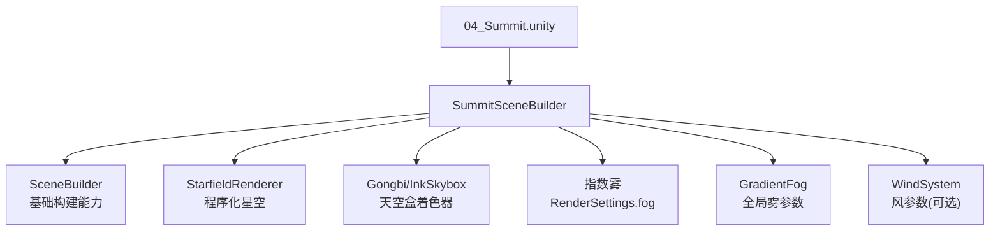
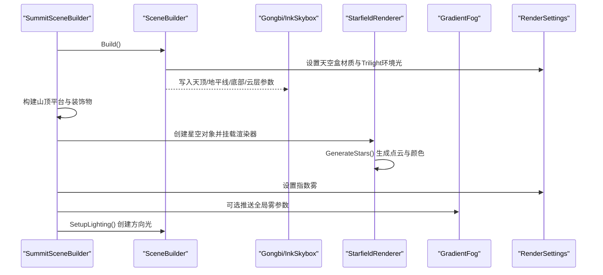
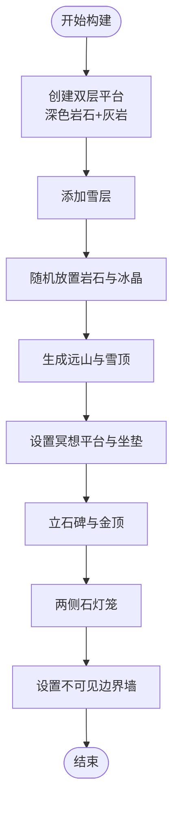
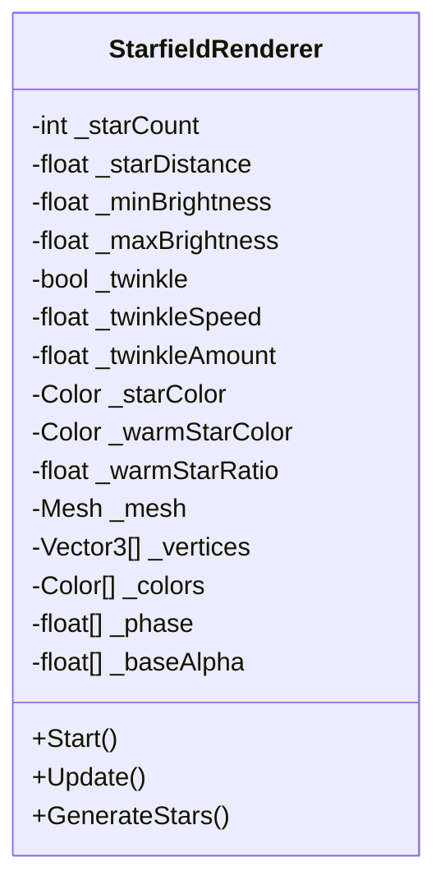
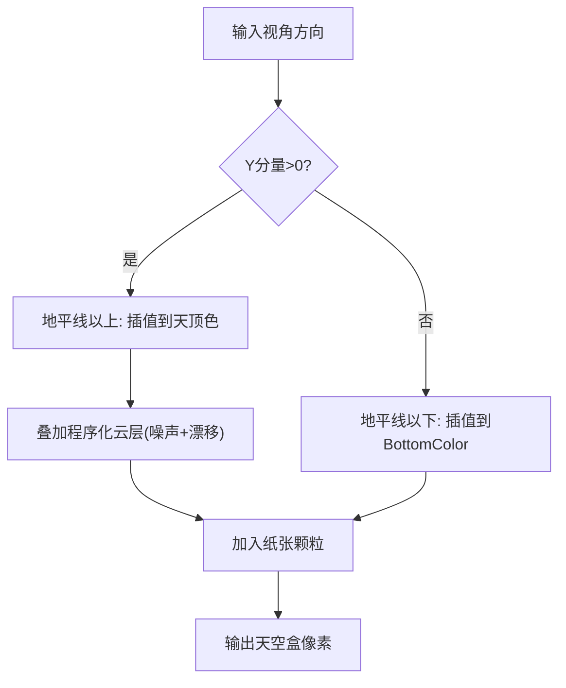
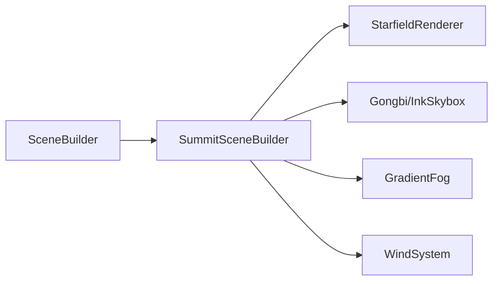

# 山顶场景实现

<cite>
**本文引用的文件**
- [SummitSceneBuilder.cs](file://Assets/Scripts/Environment/SummitSceneBuilder.cs)
- [StarfieldRenderer.cs](file://Assets/Scripts/Environment/StarfieldRenderer.cs)
- [GradientFog.cs](file://Assets/Scripts/Environment/GradientFog.cs)
- [SceneBuilder.cs](file://Assets/Scripts/Environment/SceneBuilder.cs)
- [GongbiInkSkybox.shader](file://Assets/Shaders/GongbiInkSkybox.shader)
- [GongbiColors.cs](file://Assets/Scripts/GongbiColors.cs)
- [WindSystem.cs](file://Assets/Scripts/Environment/WindSystem.cs)
- [04_Summit.unity](file://Assets/Scenes/04_Summit.unity)
</cite>

## 目录
1. [简介](#简介)
2. [项目结构](#项目结构)
3. [核心组件](#核心组件)
4. [架构总览](#架构总览)
5. [详细组件分析](#详细组件分析)
6. [依赖关系分析](#依赖关系分析)
7. [性能考量](#性能考量)
8. [故障排查指南](#故障排查指南)
9. [结论](#结论)
10. [附录：开发指南](#附录开发指南)

## 简介
本文件面向InkRidge项目的“山顶”场景，系统性说明如何通过运行时构建器生成开阔的山顶环境、星空背景与远山层次，并解释光照、雾效、云海与大气透视的实现方式。文档同时提供远景渲染优化与视锥剔除的实践建议，以及天气变化与视觉效果调整的开发指南，帮助开发者快速理解与扩展山顶场景。

## 项目结构
山顶场景由一个继承自通用场景构建基类的专用构建器负责组装：
- 构建器：SummitSceneBuilder 负责搭建地形平台、装饰物、星空、远山、边界墙、冥想点、石碑、石灯笼等元素，并设置天空盒、光照与雾。
- 星空：StarfieldRenderer 使用程序化点云在球面上分布星星，支持闪烁动画与颜色变化。
- 天空盒：Gongbi/InkSkybox 着色器提供三带渐变（天顶/地平线/地平线以下）与程序化云层漂移、纸张颗粒感。
- 雾与大气：SceneBuilder 提供指数雾；GradientFog 通过全局变量为自定义雾着色器提供天顶/地平线颜色与距离参数。
- 风系统：WindSystem 驱动植被摇摆的全局风参数（山顶场景中可复用）。
- 场景入口：04_Summit.unity 作为顶层场景，承载 SceneRoot 与相关组件。

图表来源
- [SummitSceneBuilder.cs:7-20](file://Assets/Scripts/Environment/SummitSceneBuilder.cs#L7-L20)
- [SceneBuilder.cs:152-196](file://Assets/Scripts/Environment/SceneBuilder.cs#L152-L196)
- [StarfieldRenderer.cs:35-109](file://Assets/Scripts/Environment/StarfieldRenderer.cs#L35-L109)
- [GongbiInkSkybox.shader:1-128](file://Assets/Shaders/GongbiInkSkybox.shader#L1-L128)
- [GradientFog.cs:72-93](file://Assets/Scripts/Environment/GradientFog.cs#L72-L93)
- [WindSystem.cs:34-63](file://Assets/Scripts/Environment/WindSystem.cs#L34-L63)

章节来源
- [04_Summit.unity:1-200](file://Assets/Scenes/04_Summit.unity#L1-L200)
- [SummitSceneBuilder.cs:7-20](file://Assets/Scripts/Environment/SummitSceneBuilder.cs#L7-L20)
- [SceneBuilder.cs:152-219](file://Assets/Scripts/Environment/SceneBuilder.cs#L152-L219)

## 核心组件
- SummitSceneBuilder：继承 SceneBuilder，重写 Build() 完成山顶场景的完整装配流程，包括天空盒、地形平台、星空、远山、冥想点、石碑、石灯笼、边界墙、光照与雾的设置。
- StarfieldRenderer：基于点云的星空渲染，采用斐波那契球面均匀分布，支持闪烁频率、幅度与颜色混合。
- Gongbi/InkSkybox：单通道天空盒着色器，实现三带渐变、程序化云层与纸张颗粒，适合水墨风格。
- GradientFog：将天顶/地平线雾色与距离参数推入全局着色器变量，用于统一的大气雾效果。
- SceneBuilder：提供材质创建、基本几何体构建、静态批处理合并、天空盒与光照/雾的统一接口。

章节来源
- [SummitSceneBuilder.cs:7-20](file://Assets/Scripts/Environment/SummitSceneBuilder.cs#L7-L20)
- [StarfieldRenderer.cs:13-109](file://Assets/Scripts/Environment/StarfieldRenderer.cs#L13-L109)
- [GongbiInkSkybox.shader:1-128](file://Assets/Shaders/GongbiInkSkybox.shader#L1-L128)
- [GradientFog.cs:13-93](file://Assets/Scripts/Environment/GradientFog.cs#L13-L93)
- [SceneBuilder.cs:42-219](file://Assets/Scripts/Environment/SceneBuilder.cs#L42-L219)

## 架构总览
山顶场景采用“构建器+着色器+全局参数”的分层架构：
- 构建层：SummitSceneBuilder 调用 SceneBuilder 提供的工具方法，按固定顺序生成场景对象与配置。
- 表现层：Gongbi/InkSkybox 提供天空盒渲染；StarfieldRenderer 以点云绘制星空；雾效通过 RenderSettings 与 GradientFog 共同作用。
- 交互层：WindSystem 提供风参数（可用于植被摇摆），DailyZen 与 BreathSceneReactive 在基类启动时注入，提供每日变化与呼吸联动。

图表来源
- [SummitSceneBuilder.cs:7-20](file://Assets/Scripts/Environment/SummitSceneBuilder.cs#L7-L20)
- [SceneBuilder.cs:152-196](file://Assets/Scripts/Environment/SceneBuilder.cs#L152-L196)
- [StarfieldRenderer.cs:35-109](file://Assets/Scripts/Environment/StarfieldRenderer.cs#L35-L109)
- [GradientFog.cs:72-93](file://Assets/Scripts/Environment/GradientFog.cs#L72-L93)

## 详细组件分析

### 山顶地形与环境构建
- 双层平台：底层深色岩石圆柱 + 上层灰岩圆柱，顶部覆盖雪层，形成清晰的高台层级。
- 周边岩石与冰晶：围绕平台随机角度与半径放置球形岩石与高细圆柱冰晶，增强自然感。
- 远山层次：沿环形分布多个宽底尖顶的立方体模拟远山，部分加雪顶，营造深度与高度感。
- 冥想点与石碑：中心区域设置平台、金边装饰与坐垫；边缘立石碑与金色顶盖。
- 石灯笼：两侧对称布置底座、发光球与屋顶，增加氛围光源。
- 边界墙：四向不可见墙体限制玩家活动范围，避免越界。

图表来源
- [SummitSceneBuilder.cs:22-80](file://Assets/Scripts/Environment/SummitSceneBuilder.cs#L22-L80)
- [SummitSceneBuilder.cs:111-139](file://Assets/Scripts/Environment/SummitSceneBuilder.cs#L111-L139)
- [SummitSceneBuilder.cs:141-192](file://Assets/Scripts/Environment/SummitSceneBuilder.cs#L141-L192)
- [SummitSceneBuilder.cs:194-209](file://Assets/Scripts/Environment/SummitSceneBuilder.cs#L194-L209)

章节来源
- [SummitSceneBuilder.cs:22-209](file://Assets/Scripts/Environment/SummitSceneBuilder.cs#L22-L209)

### 星空效果实现技术
- 分布算法：使用斐波那契球面采样在单位球上均匀分布点，再乘以星距得到世界坐标，避免极区聚集。
- 颜色与亮度：每颗星随机基础亮度，并按比例混合暖色与冷色，形成自然的色彩变化。
- 闪烁动画：Update中按固定帧间隔计算正弦相位偏移，更新顶点颜色缓冲的Alpha，实现柔和闪烁。
- 性能优化：TwinkleUpdateInterval 降低更新频率，减少VBO带宽与CPU开销；点云拓扑减少三角面片。

图表来源
- [StarfieldRenderer.cs:13-109](file://Assets/Scripts/Environment/StarfieldRenderer.cs#L13-L109)

章节来源
- [StarfieldRenderer.cs:35-109](file://Assets/Scripts/Environment/StarfieldRenderer.cs#L35-L109)

### 夜空渲染与天空盒
- 三带渐变：根据视线方向Y分量在“地平线以下/以上”分别插值到底部色、地平线色、天顶色，形成自然过渡。
- 程序化云层：多层噪声叠加产生带状云，随时间缓慢漂移，靠近地平线处更明显，贴近高山云海观感。
- 纸张颗粒：对方向进行稳定哈希扰动，加入轻微颗粒感，契合工笔水墨风格。
- 天空盒材质：由 SceneBuilder.SetupSkybox 创建并设置天顶/地平线/底部/云层参数，配合 Trilight 环境光提升整体氛围。

图表来源
- [GongbiInkSkybox.shader:92-121](file://Assets/Shaders/GongbiInkSkybox.shader#L92-L121)
- [SceneBuilder.cs:152-173](file://Assets/Scripts/Environment/SceneBuilder.cs#L152-L173)

章节来源
- [GongbiInkSkybox.shader:1-128](file://Assets/Shaders/GongbiInkSkybox.shader#L1-L128)
- [SceneBuilder.cs:152-173](file://Assets/Scripts/Environment/SceneBuilder.cs#L152-L173)

### 特殊光照设置（月光与星光）
- 方向光：SetupLighting 创建 Directional Light，颜色偏冷蓝，强度适中，方向朝下倾斜，模拟月光主光。
- 阴影关闭：为移动端VR性能考虑关闭实时阴影，卡通风格不依赖阴影贴图。
- 环境光：Trilight 模式分别设置天顶/赤道/地面颜色，使物体接收来自天空与地面的反弹光，增强夜间氛围。
- 辅助光源：月亮与辉光球体作为视觉装饰，不参与物理光照；石灯笼发光球体提供局部氛围。

章节来源
- [SummitSceneBuilder.cs:18-19](file://Assets/Scripts/Environment/SummitSceneBuilder.cs#L18-L19)
- [SceneBuilder.cs:183-196](file://Assets/Scripts/Environment/SceneBuilder.cs#L183-L196)
- [SummitSceneBuilder.cs:93-108](file://Assets/Scripts/Environment/SummitSceneBuilder.cs#L93-L108)

### 云海效果与大气透视
- 指数雾：通过 RenderSettings 启用指数雾，低密度营造高空稀薄雾气，增强空间纵深。
- 梯度雾：GradientFog 将天顶/地平线雾色与距离参数推入全局着色器，可实现高度相关的雾淡入淡出，强化海拔差异带来的视觉层次。
- 天空盒云层：InkSkybox 的云带靠近地平线更浓，符合真实大气散射规律，提升高度感。

章节来源
- [SceneBuilder.cs:175-181](file://Assets/Scripts/Environment/SceneBuilder.cs#L175-L181)
- [GradientFog.cs:72-93](file://Assets/Scripts/Environment/GradientFog.cs#L72-L93)
- [GongbiInkSkybox.shader:107-115](file://Assets/Shaders/GongbiInkSkybox.shader#L107-L115)

### 远景渲染优化与视锥剔除
- 远山体积：远山使用大尺寸立方体，位于较远距离（约35–63米），作为背景层次，不参与碰撞，减少复杂几何。
- 装饰剔除：所有装饰性原语通过 Decorative 移除Collider，避免无意义的碰撞检测与 MeshCollider 构建成本。
- 静态批处理：启动时收集非动态 MeshRenderer 并合并，减少Draw Call。
- 视锥剔除：Unity默认开启Frustum Culling；对于超远背景（如天空盒与极远装饰）可通过LOD或分层管理进一步控制可见性。建议在场景布局时将最远背景置于相机近裁剪面之外但仍处于视锥内，确保被正确剔除与渲染。

章节来源
- [SummitSceneBuilder.cs:111-139](file://Assets/Scripts/Environment/SummitSceneBuilder.cs#L111-L139)
- [SceneBuilder.cs:109-146](file://Assets/Scripts/Environment/SceneBuilder.cs#L109-L146)
- [SceneBuilder.cs:205-219](file://Assets/Scripts/Environment/SceneBuilder.cs#L205-L219)

## 依赖关系分析
- SummitSceneBuilder 依赖 SceneBuilder 的基础能力（材质、几何、天空盒、光照、雾）。
- StarfieldRenderer 依赖 Unity 的 MeshFilter/MeshRenderer 与点云拓扑。
- Gongbi/InkSkybox 通过 Shader 属性接收天空盒参数，并由 SceneBuilder 初始化。
- GradientFog 通过全局着色器变量影响自定义雾着色器。
- WindSystem 提供全局风参数，供植被着色器读取（山顶场景中可复用）。

图表来源
- [SummitSceneBuilder.cs:7-20](file://Assets/Scripts/Environment/SummitSceneBuilder.cs#L7-L20)
- [SceneBuilder.cs:152-219](file://Assets/Scripts/Environment/SceneBuilder.cs#L152-L219)
- [StarfieldRenderer.cs:35-109](file://Assets/Scripts/Environment/StarfieldRenderer.cs#L35-L109)
- [GradientFog.cs:72-93](file://Assets/Scripts/Environment/GradientFog.cs#L72-L93)
- [WindSystem.cs:34-63](file://Assets/Scripts/Environment/WindSystem.cs#L34-L63)

章节来源
- [SummitSceneBuilder.cs:7-20](file://Assets/Scripts/Environment/SummitSceneBuilder.cs#L7-L20)
- [SceneBuilder.cs:152-219](file://Assets/Scripts/Environment/SceneBuilder.cs#L152-L219)

## 性能考量
- 星空闪烁降频：TwinkleUpdateInterval 降低更新频率，避免每帧写VBO造成带宽浪费。
- 关闭阴影：Directional Light 关闭实时阴影，减少额外几何Pass，适配VR移动设备。
- 装饰剔除：移除装饰对象的Collider，避免Broadphase与MeshCollider构建成本。
- 静态批处理：合并静态MeshRenderer，显著减少Draw Call。
- 天空盒单通道：InkSkybox 仅一个片段Pass，成本低且效果佳。
- 雾效全局参数：GradientFog 仅在启用/验证时写入全局变量，避免每帧重复上传。

章节来源
- [StarfieldRenderer.cs:40-63](file://Assets/Scripts/Environment/StarfieldRenderer.cs#L40-L63)
- [SceneBuilder.cs:183-196](file://Assets/Scripts/Environment/SceneBuilder.cs#L183-L196)
- [SceneBuilder.cs:109-146](file://Assets/Scripts/Environment/SceneBuilder.cs#L109-L146)
- [SceneBuilder.cs:205-219](file://Assets/Scripts/Environment/SceneBuilder.cs#L205-L219)
- [GongbiInkSkybox.shader:18-28](file://Assets/Shaders/GongbiInkSkybox.shader#L18-L28)
- [GradientFog.cs:59-69](file://Assets/Scripts/Environment/GradientFog.cs#L59-L69)

## 故障排查指南
- 星空不闪烁：检查 StarfieldRenderer 的 _twinkle 开关与 TwinkleUpdateInterval；确认 Update 中颜色缓冲已写入。
- 天空盒颜色异常：确认 SceneBuilder.SetupSkybox 已设置天顶/地平线/底部/云层参数；若切换场景后残留雾色，调用 GradientFog.Clear() 重置全局雾参数。
- 雾效不生效：确认 RenderSettings.fog 已启用且密度合理；如需高度相关雾，确保 GradientFog 已应用全局变量。
- 性能下降：检查是否误保留装饰Collider；确认静态批处理已执行；评估星空数量与闪烁频率。
- 风向/风力无效：确认 WindSystem 已启用并设置目标强度；检查着色器是否正确读取全局风参数。

章节来源
- [StarfieldRenderer.cs:45-63](file://Assets/Scripts/Environment/StarfieldRenderer.cs#L45-L63)
- [GradientFog.cs:72-93](file://Assets/Scripts/Environment/GradientFog.cs#L72-L93)
- [SceneBuilder.cs:175-196](file://Assets/Scripts/Environment/SceneBuilder.cs#L175-L196)
- [WindSystem.cs:34-63](file://Assets/Scripts/Environment/WindSystem.cs#L34-L63)

## 结论
山顶场景通过构建器模式高效组织地形、星空、远山与氛围元素，结合工笔水墨天空盒与指数/梯度雾，营造出开阔而富有层次的高山夜景。星空采用程序化点云与降频闪烁，兼顾视觉质量与性能。光照与雾效协同模拟月光与星光照明，增强高度感与空间感。通过装饰剔除、静态批处理与合理的远景布局，场景在VR移动设备上保持良好性能。开发者可在此基础上扩展天气变化与视觉效果调整。

## 附录：开发指南

### 天气变化与视觉效果调整
- 天空盒色调：调整 SetupSkybox 的天顶/地平线/底部/云层颜色，模拟不同时段（黄昏/深夜/黎明）。
- 雾浓度与颜色：修改 SetupFog 的密度与颜色，或启用 GradientFog 调整天顶/地平线雾色，增强云海厚度。
- 星空参数：调节 StarfieldRenderer 的 _starCount、_starDistance、_minBrightness、_maxBrightness、_twinkleSpeed、_twinkleAmount、颜色混合比例，控制密度与闪烁节奏。
- 月光强度：调整 Directional Light 的颜色与强度，或增加多层辉光球体模拟月晕。
- 远山层次：增减远山数量、高度与宽度，或在更高距离放置更暗的轮廓，增强景深。
- 风系统：通过 WindSystem.SetIntensity/SetDirection 平滑改变风速与方向，配合植被摇摆（若引入植被）。

章节来源
- [SummitSceneBuilder.cs:10-19](file://Assets/Scripts/Environment/SummitSceneBuilder.cs#L10-L19)
- [StarfieldRenderer.cs:13-28](file://Assets/Scripts/Environment/StarfieldRenderer.cs#L13-L28)
- [SceneBuilder.cs:152-196](file://Assets/Scripts/Environment/SceneBuilder.cs#L152-L196)
- [WindSystem.cs:65-76](file://Assets/Scripts/Environment/WindSystem.cs#L65-L76)