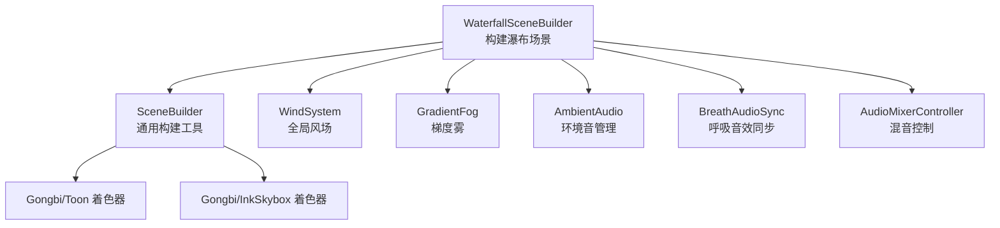
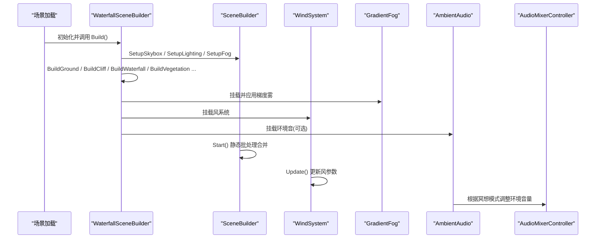
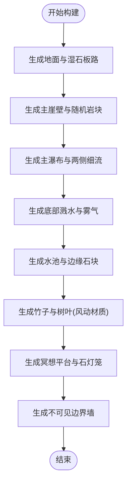
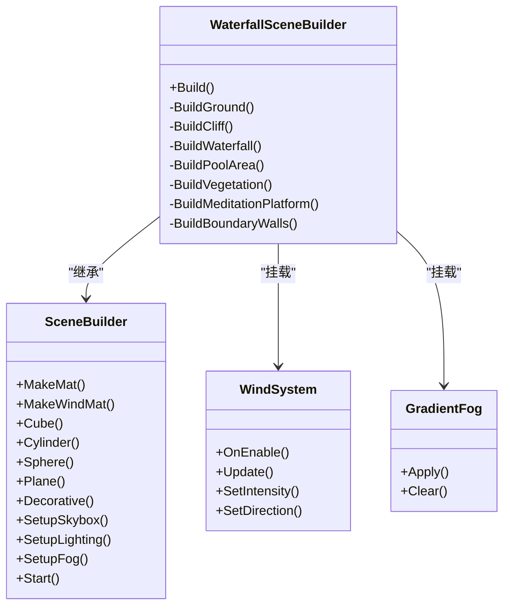
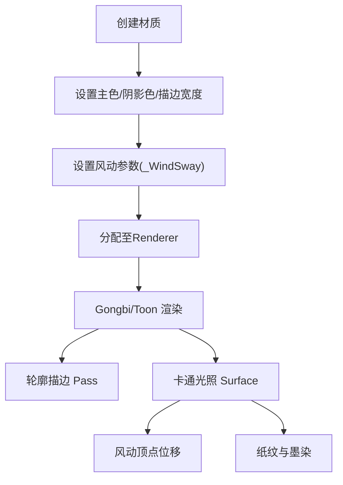
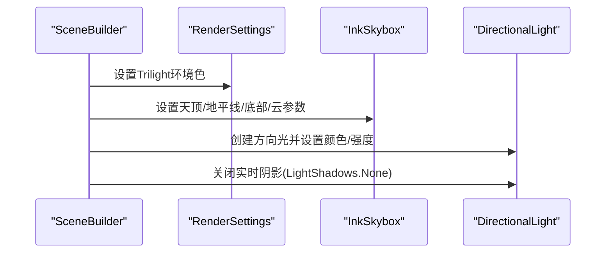
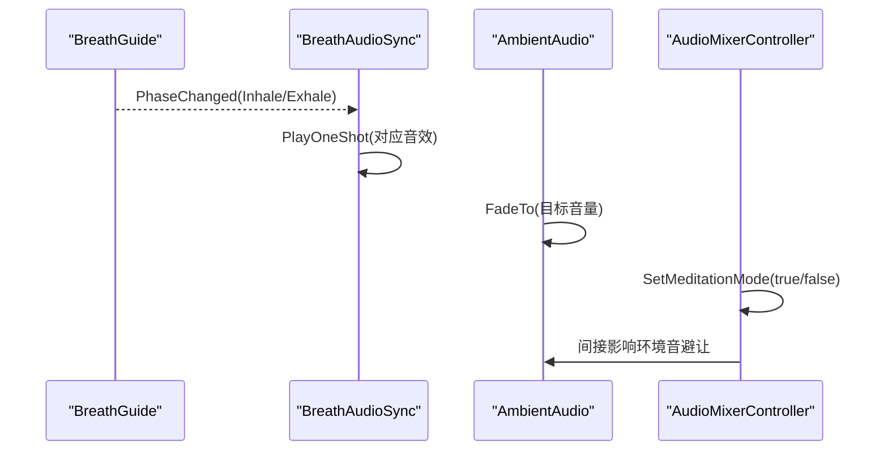
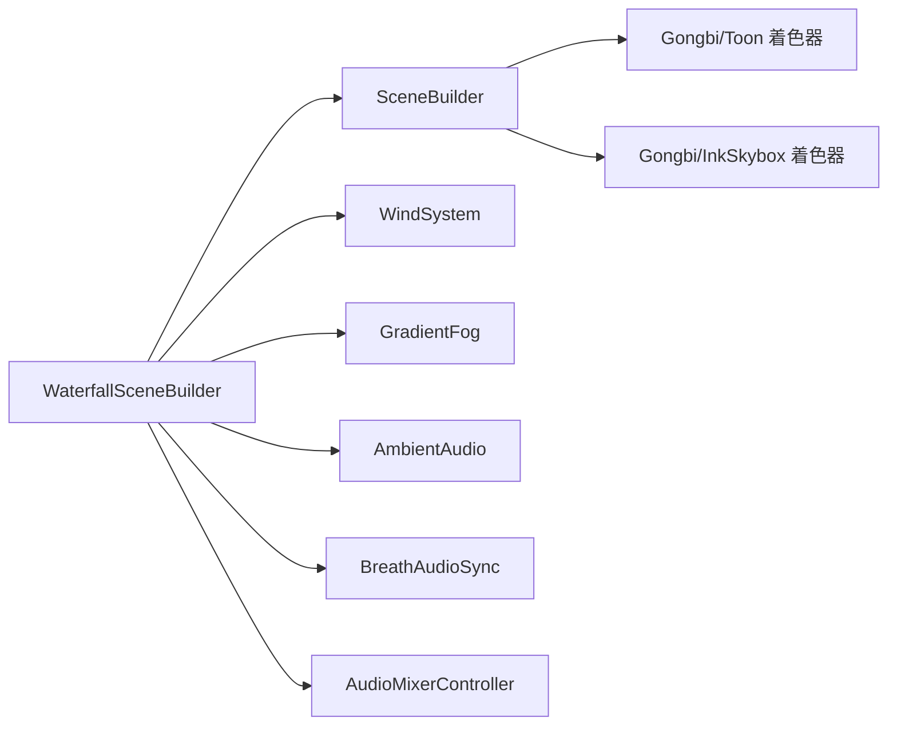

# 瀑布场景实现

<cite>
**本文引用的文件**
- [WaterfallSceneBuilder.cs](file://Assets/Scripts/Environment/WaterfallSceneBuilder.cs)
- [SceneBuilder.cs](file://Assets/Scripts/Environment/SceneBuilder.cs)
- [GongbiColors.cs](file://Assets/Scripts/GongbiColors.cs)
- [GongbiToon.shader](file://Assets/Shaders/GongbiToon.shader)
- [GongbiInkSkybox.shader](file://Assets/Shaders/GongbiInkSkybox.shader)
- [WindSystem.cs](file://Assets/Scripts/Environment/WindSystem.cs)
- [GradientFog.cs](file://Assets/Scripts/Environment/GradientFog.cs)
- [AmbientAudio.cs](file://Assets/Scripts/Environment/AmbientAudio.cs)
- [BreathAudioSync.cs](file://Assets/Scripts/Environment/BreathAudioSync.cs)
- [AudioMixerController.cs](file://Assets/Scripts/Core/AudioMixerController.cs)
- [02_Waterfall.unity.meta](file://Assets/Scenes/02_Waterfall.unity.meta)
</cite>

## 目录
1. [简介](#简介)
2. [项目结构](#项目结构)
3. [核心组件](#核心组件)
4. [架构总览](#架构总览)
5. [详细组件分析](#详细组件分析)
6. [依赖关系分析](#依赖关系分析)
7. [性能考量](#性能考量)
8. [故障排查指南](#故障排查指南)
9. [结论](#结论)
10. [附录：参数调整与定制指南](#附录：参数调整与定制指南)

## 简介
本文件面向InkRidge项目的“瀑布场景”实现，聚焦于WaterfallSceneBuilder如何程序化构建动态水流效果与岩石环境。文档涵盖以下方面：
- 瀑布水流的程序化生成技术（几何体、材质、雾效与风场）
- 岩石地形的创建算法与材质配置
- 特殊光照与阴影处理策略
- 音频同步机制（环境音与呼吸音效）
- 动画与性能优化策略（静态批处理、全局着色器参数、粒子控制）
- 开发指南：参数调优与特效定制

## 项目结构
瀑布场景由运行时构建器统一装配，遵循“场景构建器基类 + 具体场景构建器”的分层设计。核心文件与职责如下：
- WaterfallSceneBuilder：负责组装地面、悬崖、瀑布水体、水池、植被、冥想平台、边界墙等元素，并挂载雾与风系统
- SceneBuilder：提供通用构建能力（材质、基本几何、天空盒、光照、雾、静态批处理合并）
- GongbiColors：统一的矿物颜料配色表，确保风格一致
- 着色器：Gongbi/Toon（卡通渲染+描边+风动顶点位移）、Gongbi/InkSkybox（水墨天空）
- WindSystem：全局风场驱动植被摆动
- GradientFog：梯度雾，营造水墨氛围
- 音频：AmbientAudio（环境音淡入淡出/避让）、BreathAudioSync（呼吸阶段音效）、AudioMixerController（混音控制）
- 场景入口：02_Waterfall.unity（通过元数据标识）

图表来源
- [WaterfallSceneBuilder.cs:13-35](file://Assets/Scripts/Environment/WaterfallSceneBuilder.cs#L13-L35)
- [SceneBuilder.cs:18-220](file://Assets/Scripts/Environment/SceneBuilder.cs#L18-L220)
- [WindSystem.cs:11-79](file://Assets/Scripts/Environment/WindSystem.cs#L11-L79)
- [GradientFog.cs:11-96](file://Assets/Scripts/Environment/GradientFog.cs#L11-L96)
- [AmbientAudio.cs:11-112](file://Assets/Scripts/Environment/AmbientAudio.cs#L11-L112)
- [BreathAudioSync.cs:16-75](file://Assets/Scripts/Environment/BreathAudioSync.cs#L16-L75)
- [AudioMixerController.cs:10-67](file://Assets/Scripts/Core/AudioMixerController.cs#L10-L67)

章节来源
- [WaterfallSceneBuilder.cs:13-35](file://Assets/Scripts/Environment/WaterfallSceneBuilder.cs#L13-L35)
- [SceneBuilder.cs:18-220](file://Assets/Scripts/Environment/SceneBuilder.cs#L18-L220)
- [02_Waterfall.unity.meta:1-8](file://Assets/Scenes/02_Waterfall.unity.meta#L1-L8)

## 核心组件
- WaterfallSceneBuilder：在Build中调用一系列子构建方法，完成地形、水体、植被、平台、边界与氛围系统的装配；设置天空盒、光照、雾；挂载风与梯度雾
- SceneBuilder：封装材质创建、基础几何体生成、装饰对象去碰撞、天空盒与光照配置、雾配置、启动时静态批处理合并
- GongbiColors：定义统一配色与派生阴影色，保证视觉一致性
- 着色器：Gongbi/Toon提供卡通渲染、轮廓描边、风动顶点位移、纸纹与墨染；Gongbi/InkSkybox提供水墨渐变天空
- WindSystem：每帧更新风的方向与强度，写入全局着色器参数驱动植被摆动
- GradientFog：将梯度雾参数一次性推送到全局着色器变量，避免每帧重复上传
- 音频组件：AmbientAudio负责环境音淡入淡出与避让；BreathAudioSync订阅呼吸阶段事件播放SFX；AudioMixerController统一管理音量与冥想模式下的环境音衰减

章节来源
- [WaterfallSceneBuilder.cs:13-35](file://Assets/Scripts/Environment/WaterfallSceneBuilder.cs#L13-L35)
- [SceneBuilder.cs:42-196](file://Assets/Scripts/Environment/SceneBuilder.cs#L42-L196)
- [GongbiColors.cs:8-72](file://Assets/Scripts/GongbiColors.cs#L8-L72)
- [GongbiToon.shader:1-209](file://Assets/Shaders/GongbiToon.shader#L1-L209)
- [GongbiInkSkybox.shader:1-42](file://Assets/Shaders/GongbiInkSkybox.shader#L1-L42)
- [WindSystem.cs:11-79](file://Assets/Scripts/Environment/WindSystem.cs#L11-L79)
- [GradientFog.cs:11-96](file://Assets/Scripts/Environment/GradientFog.cs#L11-L96)
- [AmbientAudio.cs:11-112](file://Assets/Scripts/Environment/AmbientAudio.cs#L11-L112)
- [BreathAudioSync.cs:16-75](file://Assets/Scripts/Environment/BreathAudioSync.cs#L16-L75)
- [AudioMixerController.cs:10-67](file://Assets/Scripts/Core/AudioMixerController.cs#L10-L67)

## 架构总览
瀑布场景采用“运行时构建 + 全局氛围驱动”的架构：
- 构建期：WaterfallSceneBuilder按步骤生成地形、水体、植被、平台与边界，并设置天空盒、光照、雾
- 运行期：WindSystem持续更新风场参数；GradientFog提供梯度雾；音频组件根据场景状态与环境进行淡入淡出与避让
- 渲染：所有几何使用Gongbi/Toon材质，启用轮廓描边与风动顶点位移；天空使用Gongbi/InkSkybox

图表来源
- [WaterfallSceneBuilder.cs:13-35](file://Assets/Scripts/Environment/WaterfallSceneBuilder.cs#L13-L35)
- [SceneBuilder.cs:198-220](file://Assets/Scripts/Environment/SceneBuilder.cs#L198-L220)
- [WindSystem.cs:49-63](file://Assets/Scripts/Environment/WindSystem.cs#L49-L63)
- [GradientFog.cs:73-80](file://Assets/Scripts/Environment/GradientFog.cs#L73-L80)
- [AmbientAudio.cs:20-38](file://Assets/Scripts/Environment/AmbientAudio.cs#L20-L38)
- [AudioMixerController.cs:32-43](file://Assets/Scripts/Core/AudioMixerController.cs#L32-L43)

## 详细组件分析

### 瀑布水流与岩石环境构建
- 水流主体：使用扁平立方体模拟主瀑布与两侧细流，材质为浅色半透明风格，配合轮廓描边呈现水墨质感
- 底部溅水：散布多个扁球体作为水花，增强落点动感
- 雾气氛围：底部散布低矮雾体，提升层次与朦胧感
- 岩石地形：主崖壁由大立方体构成，随机分布突出岩块与顶部石块；侧壁封闭避免穿模
- 水池与边缘：水池平面与边缘石块围合，池面点缀荷叶
- 植被：竹子与树冠使用带风动的材质，随风摆动
- 冥想平台与石灯笼：位于崖顶，提供叙事与交互锚点
- 边界墙：不可见墙体限制玩家活动范围

图表来源
- [WaterfallSceneBuilder.cs:37-252](file://Assets/Scripts/Environment/WaterfallSceneBuilder.cs#L37-L252)

章节来源
- [WaterfallSceneBuilder.cs:37-252](file://Assets/Scripts/Environment/WaterfallSceneBuilder.cs#L37-L252)

### 程序化生成技术与动画效果
- 程序化生成：基于随机种子与循环，批量生成岩石、竹子、水花与雾体，位置与尺寸随机化，避免重复感
- 风动动画：植被材质启用风动参数，WindSystem每帧更新全局风参数，驱动顶点位移与颜色变化
- 水墨天空：InkSkybox提供渐变天空与云层漂移，配合Trilight环境光增强体积感
- 梯度雾：GradientFog将雾距离与颜色推送到全局着色器，营造水墨氛围

图表来源
- [WaterfallSceneBuilder.cs:5-255](file://Assets/Scripts/Environment/WaterfallSceneBuilder.cs#L5-L255)
- [SceneBuilder.cs:18-220](file://Assets/Scripts/Environment/SceneBuilder.cs#L18-L220)
- [WindSystem.cs:11-79](file://Assets/Scripts/Environment/WindSystem.cs#L11-L79)
- [GradientFog.cs:11-96](file://Assets/Scripts/Environment/GradientFog.cs#L11-L96)

章节来源
- [WaterfallSceneBuilder.cs:95-126](file://Assets/Scripts/Environment/WaterfallSceneBuilder.cs#L95-L126)
- [WindSystem.cs:49-63](file://Assets/Scripts/Environment/WindSystem.cs#L49-L63)
- [GradientFog.cs:73-80](file://Assets/Scripts/Environment/GradientFog.cs#L73-L80)

### 材质与着色器配置
- 材质创建：SceneBuilder.MakeMat/MakewindMat统一设置主色、阴影色、描边宽度与风动参数
- 着色器特性：
  - 轮廓描边：背面挤出描边，增强水墨线条感
  - 卡通光照：分档阴影与高光，支持背光轮廓
  - 风动顶点位移：高度相关的风力作用，结合方向与湍流
  - 纸纹与墨染：高频噪声模拟宣纸纹理，底部墨染加深
- 天空盒：InkSkybox提供天顶/地平线/下方三色渐变与云层漂移

图表来源
- [SceneBuilder.cs:42-59](file://Assets/Scripts/Environment/SceneBuilder.cs#L42-L59)
- [GongbiToon.shader:31-204](file://Assets/Shaders/GongbiToon.shader#L31-L204)
- [GongbiInkSkybox.shader:1-42](file://Assets/Shaders/GongbiInkSkybox.shader#L1-L42)

章节来源
- [SceneBuilder.cs:42-59](file://Assets/Scripts/Environment/SceneBuilder.cs#L42-L59)
- [GongbiToon.shader:31-204](file://Assets/Shaders/GongbiToon.shader#L31-L204)
- [GongbiInkSkybox.shader:1-42](file://Assets/Shaders/GongbiInkSkybox.shader#L1-L42)

### 光照与阴影处理
- 光源：方向光，关闭实时阴影以避免移动端VR额外几何Pass开销
- 环境光：Trilight模式，天顶/赤道/地面三向环境色，增强体积感
- 天空盒：InkSkybox提供渐变天空与云层漂移
- 雾：指数雾配合梯度雾，营造水墨氛围

图表来源
- [SceneBuilder.cs:152-196](file://Assets/Scripts/Environment/SceneBuilder.cs#L152-L196)
- [GongbiInkSkybox.shader:1-42](file://Assets/Shaders/GongbiInkSkybox.shader#L1-L42)

章节来源
- [SceneBuilder.cs:152-196](file://Assets/Scripts/Environment/SceneBuilder.cs#L152-L196)

### 音频同步机制
- 环境音：AmbientAudio在场景启动时淡入目标音量，支持避让与淡出停止
- 呼吸音效：BreathAudioSync订阅BreathGuide.PhaseChanged，在吸气/呼气阶段播放对应音效
- 混音控制：AudioMixerController在冥想模式下降低环境音，平滑过渡

图表来源
- [BreathAudioSync.cs:33-72](file://Assets/Scripts/Environment/BreathAudioSync.cs#L33-L72)
- [AmbientAudio.cs:20-38](file://Assets/Scripts/Environment/AmbientAudio.cs#L20-L38)
- [AudioMixerController.cs:32-48](file://Assets/Scripts/Core/AudioMixerController.cs#L32-L48)

章节来源
- [BreathAudioSync.cs:33-72](file://Assets/Scripts/Environment/BreathAudioSync.cs#L33-L72)
- [AmbientAudio.cs:20-38](file://Assets/Scripts/Environment/AmbientAudio.cs#L20-L38)
- [AudioMixerController.cs:32-48](file://Assets/Scripts/Core/AudioMixerController.cs#L32-L48)

## 依赖关系分析
- WaterfallSceneBuilder依赖SceneBuilder提供的通用构建能力
- 材质与渲染依赖Gongbi/Toon与Gongbi/InkSkybox着色器
- 风场与雾效依赖WindSystem与GradientFog的全局着色器参数
- 音频依赖AmbientAudio、BreathAudioSync与AudioMixerController的状态协调

图表来源
- [WaterfallSceneBuilder.cs:13-35](file://Assets/Scripts/Environment/WaterfallSceneBuilder.cs#L13-L35)
- [SceneBuilder.cs:18-220](file://Assets/Scripts/Environment/SceneBuilder.cs#L18-L220)
- [WindSystem.cs:11-79](file://Assets/Scripts/Environment/WindSystem.cs#L11-L79)
- [GradientFog.cs:11-96](file://Assets/Scripts/Environment/GradientFog.cs#L11-L96)
- [AmbientAudio.cs:11-112](file://Assets/Scripts/Environment/AmbientAudio.cs#L11-L112)
- [BreathAudioSync.cs:16-75](file://Assets/Scripts/Environment/BreathAudioSync.cs#L16-L75)
- [AudioMixerController.cs:10-67](file://Assets/Scripts/Core/AudioMixerController.cs#L10-L67)

章节来源
- [WaterfallSceneBuilder.cs:13-35](file://Assets/Scripts/Environment/WaterfallSceneBuilder.cs#L13-L35)
- [SceneBuilder.cs:18-220](file://Assets/Scripts/Environment/SceneBuilder.cs#L18-L220)

## 性能考量
- 静态批处理：SceneBuilder.Start中对非动态MeshRenderer进行静态批处理合并，减少Draw Call
- 无实时阴影：方向光关闭实时阴影，避免移动端VR额外几何Pass
- 全局参数优化：WindSystem与GradientFog仅在必要时更新全局着色器参数，避免每帧冗余上传
- 装饰对象去碰撞：Decorative移除不必要的Collider，降低物理计算成本
- 风动材质：禁用GPU Instancing，依靠静态批处理优化；风动顶点位移在着色器中高效计算
- 粒子系统：若引入粒子，建议按需启停与发射率控制，避免常驻高开销

章节来源
- [SceneBuilder.cs:198-220](file://Assets/Scripts/Environment/SceneBuilder.cs#L198-L220)
- [SceneBuilder.cs:183-196](file://Assets/Scripts/Environment/SceneBuilder.cs#L183-L196)
- [WindSystem.cs:34-63](file://Assets/Scripts/Environment/WindSystem.cs#L34-L63)
- [GradientFog.cs:73-80](file://Assets/Scripts/Environment/GradientFog.cs#L73-L80)
- [GongbiToon.shader:24-30](file://Assets/Shaders/GongbiToon.shader#L24-L30)

## 故障排查指南
- 风动无效：检查WindSystem是否挂载且Update正常运行；确认材质已设置_WindSway；查看全局着色器参数是否正确写入
- 雾效异常：确认GradientFog.Apply已调用；检查全局雾参数是否被其他场景残留覆盖；必要时调用Clear重置
- 声音不播放：检查AmbientAudio是否FadeTo目标音量；BreathAudioSync是否绑定到BreathGuide；AudioMixerController是否处于冥想模式导致环境音降低
- 渲染异常：确认Gongbi/Toon与Gongbi/InkSkybox着色器可用；检查材质主色与描边宽度设置；确认静态批处理未跳过动态标记对象

章节来源
- [WindSystem.cs:49-63](file://Assets/Scripts/Environment/WindSystem.cs#L49-L63)
- [GradientFog.cs:73-93](file://Assets/Scripts/Environment/GradientFog.cs#L73-L93)
- [AmbientAudio.cs:20-38](file://Assets/Scripts/Environment/AmbientAudio.cs#L20-L38)
- [BreathAudioSync.cs:33-72](file://Assets/Scripts/Environment/BreathAudioSync.cs#L33-L72)
- [AudioMixerController.cs:32-48](file://Assets/Scripts/Core/AudioMixerController.cs#L32-L48)

## 结论
瀑布场景通过WaterfallSceneBuilder的程序化构建与SceneBuilder的通用能力，实现了水墨风格的岩石环境与水流效果。借助Gongbi/Toon与Gongbi/InkSkybox着色器，以及WindSystem与GradientFog的氛围驱动，场景在视觉上呈现出自然地貌与诗意氛围。音频组件与环境音避让机制确保了视听体验的一致性。性能方面，静态批处理、无实时阴影与全局参数优化有效降低了开销，适合移动端VR场景。

## 附录：参数调整与定制指南
- 瀑布与岩石参数
  - 悬崖高度/宽度、岩石数量、竹子数量：在WaterfallSceneBuilder中调整字段以改变规模与密度
  - 水流与溅水：调整水体立方体尺寸与底部溅水球体数量/尺寸，以改变水流形态
  - 雾气：调整雾体数量与尺寸，或修改GradientFog的start/end与颜色以改变氛围
- 风场与植被
  - WindSystem的windSpeed、windMagnitude、windTurbulence、windDirection、gustDensity用于调节风强与方向
  - 植被材质的_windSway决定摆动幅度，可通过MakeWindMat调整
- 光照与天空
  - SetupSkybox的天顶/地平线颜色与云层速度可定制天空氛围
  - 方向光颜色与强度可调，保持无实时阴影以获得最佳性能
- 音频
  - AmbientAudio的_targetVolume与_fadeDuration控制环境音淡入速度与目标音量
  - BreathAudioSync的_inhaleClip/_exhaleClip与_volume用于呼吸音效配置
  - AudioMixerController的_meditationAmbientDip控制冥想模式下的环境音衰减程度
- 性能
  - 如需进一步降低开销，可减少随机生成的岩石/竹子数量，或降低雾体数量
  - 避免频繁更改全局着色器参数，尽量在场景初始化时设置

章节来源
- [WaterfallSceneBuilder.cs:8-11](file://Assets/Scripts/Environment/WaterfallSceneBuilder.cs#L8-L11)
- [WaterfallSceneBuilder.cs:95-126](file://Assets/Scripts/Environment/WaterfallSceneBuilder.cs#L95-L126)
- [WindSystem.cs:13-22](file://Assets/Scripts/Environment/WindSystem.cs#L13-L22)
- [SceneBuilder.cs:152-196](file://Assets/Scripts/Environment/SceneBuilder.cs#L152-L196)
- [AmbientAudio.cs:13-15](file://Assets/Scripts/Environment/AmbientAudio.cs#L13-L15)
- [BreathAudioSync.cs:18-21](file://Assets/Scripts/Environment/BreathAudioSync.cs#L18-L21)
- [AudioMixerController.cs:12-15](file://Assets/Scripts/Core/AudioMixerController.cs#L12-L15)