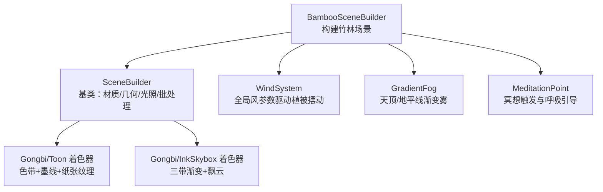
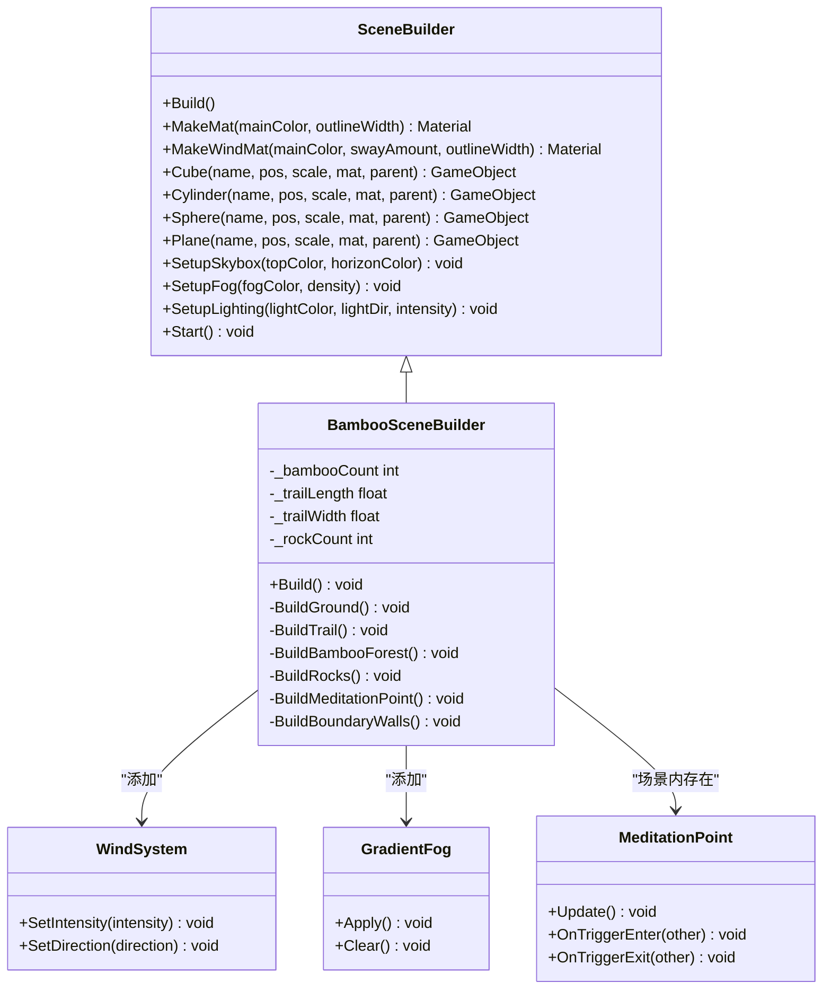
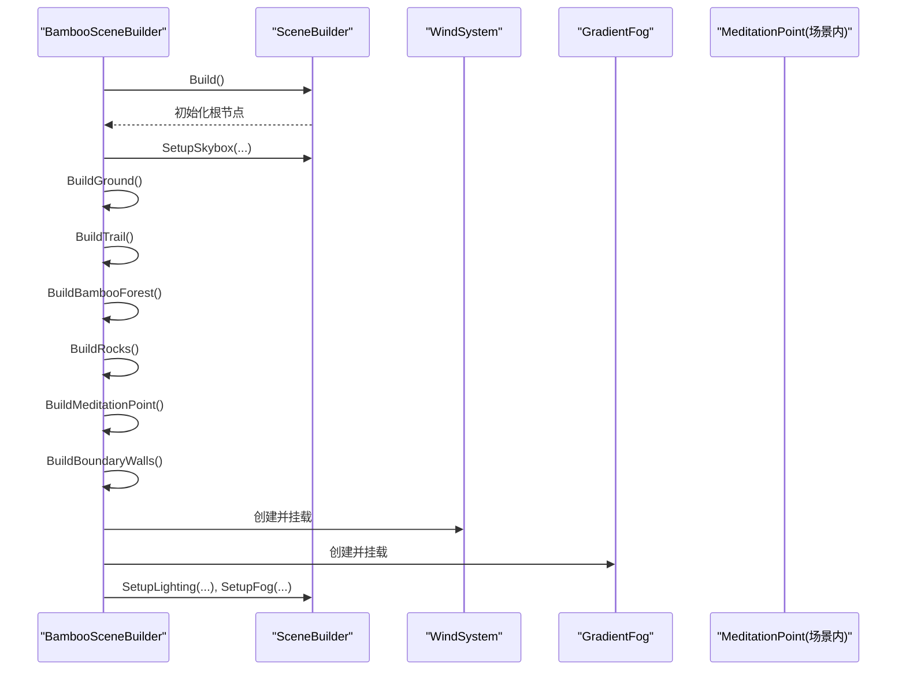
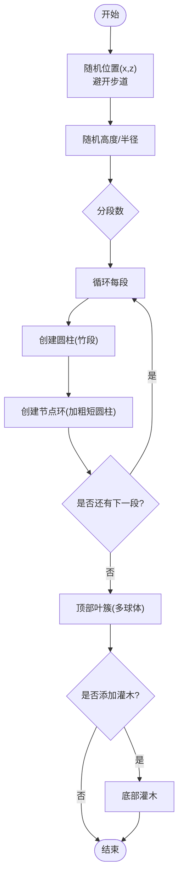
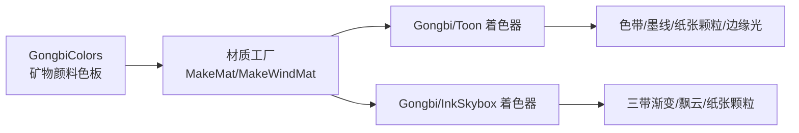
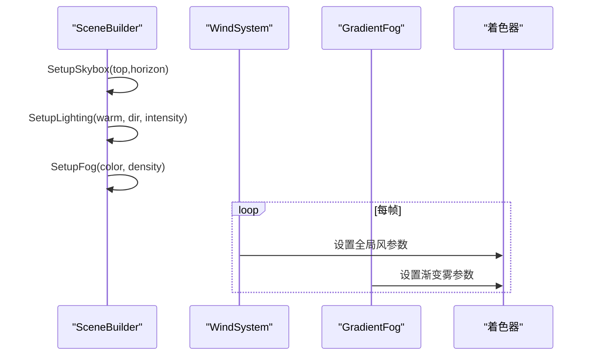
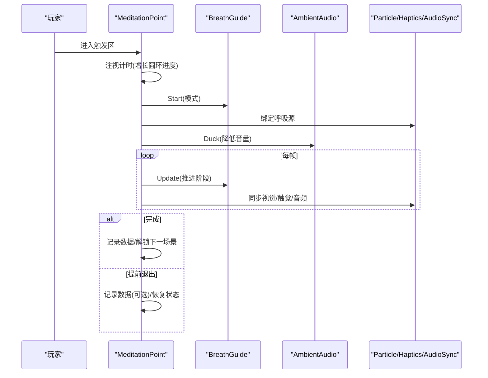
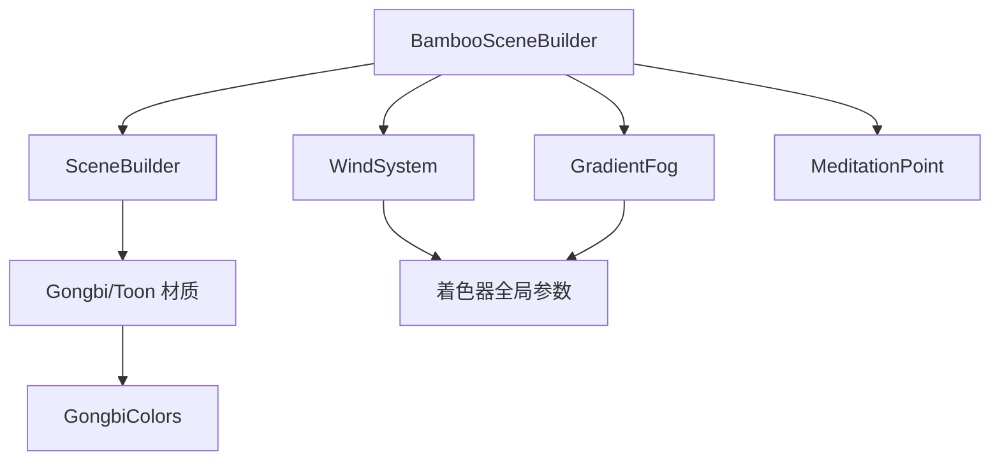

# 竹林场景实现

<cite>
**本文引用的文件**
- [BambooSceneBuilder.cs](file://Assets/Scripts/Environment/BambooSceneBuilder.cs)
- [SceneBuilder.cs](file://Assets/Scripts/Environment/SceneBuilder.cs)
- [GongbiColors.cs](file://Assets/Scripts/GongbiColors.cs)
- [WindSystem.cs](file://Assets/Scripts/Environment/WindSystem.cs)
- [GradientFog.cs](file://Assets/Scripts/Environment/GradientFog.cs)
- [MeditationPoint.cs](file://Assets/Scripts/Meditation/MeditationPoint.cs)
- [GongbiToon.shader](file://Assets/Shaders/GongbiToon.shader)
- [GongbiInkSkybox.shader](file://Assets/Shaders/GongbiInkSkybox.shader)
</cite>

## 目录
1. [简介](#简介)
2. [项目结构](#项目结构)
3. [核心组件](#核心组件)
4. [架构总览](#架构总览)
5. [详细组件分析](#详细组件分析)
6. [依赖关系分析](#依赖关系分析)
7. [性能考量](#性能考量)
8. [故障排查指南](#故障排查指南)
9. [结论](#结论)
10. [附录：自定义与扩展指南](#附录自定义与扩展指南)

## 简介
本文件面向InkRidge项目的竹林场景（场景1）实现，系统性说明BambooSceneBuilder如何继承SceneBuilder基类并构建竹林环境；详解竹子几何体的程序化生成算法（竹竿分段、节点环、顶部叶簇与地面灌木）、材料配置与工笔画风格渲染管线；阐述光照与环境氛围设置（天空盒、渐变雾、全局风场）；描述冥想点交互集成；并提供对象池与批处理等性能优化策略，以及后续自定义与扩展的开发建议。

## 项目结构
竹林场景由“运行时程序化构建”的脚本驱动，核心位于Environment目录下的SceneBuilder基类与BambooSceneBuilder派生类；工笔画风格通过自定义着色器Gongbi/Toon与Gongbi/InkSkybox实现；风场与渐变雾分别由WindSystem与GradientFog提供全局参数；冥想点由MeditationPoint管理交互与呼吸反馈。

图表来源
- [BambooSceneBuilder.cs:17-37](file://Assets/Scripts/Environment/BambooSceneBuilder.cs#L17-L37)
- [SceneBuilder.cs:18-220](file://Assets/Scripts/Environment/SceneBuilder.cs#L18-L220)
- [GongbiToon.shader:1-209](file://Assets/Shaders/GongbiToon.shader#L1-L209)
- [GongbiInkSkybox.shader:1-128](file://Assets/Shaders/GongbiInkSkybox.shader#L1-L128)
- [WindSystem.cs:1-79](file://Assets/Scripts/Environment/WindSystem.cs#L1-L79)
- [GradientFog.cs:1-96](file://Assets/Scripts/Environment/GradientFog.cs#L1-L96)
- [MeditationPoint.cs:1-346](file://Assets/Scripts/Meditation/MeditationPoint.cs#L1-L346)

章节来源
- [BambooSceneBuilder.cs:17-37](file://Assets/Scripts/Environment/BambooSceneBuilder.cs#L17-L37)
- [SceneBuilder.cs:18-220](file://Assets/Scripts/Environment/SceneBuilder.cs#L18-L220)

## 核心组件
- BambooSceneBuilder：负责竹林场景的具体构建流程，包括地面、步道、竹林、岩石、冥想平台、边界墙、风系统与渐变雾、光照与雾效。
- SceneBuilder：提供通用能力，如创建基础几何体、制作工笔画材质、设置天空盒与光照、启用静态批处理合并。
- GongbiColors：统一的矿物颜料配色表，为材质与阴影提供一致的色彩体系。
- WindSystem：全局风系统，向着色器注入风速、幅度、湍流、方向、阵风密度与强度等参数，驱动植被顶点位移。
- GradientFog：提供天顶/地平线渐变雾的全局参数，营造水墨晕染氛围。
- MeditationPoint：冥想触发区逻辑，包含注视确认、呼吸引导、触觉/音频联动、环境音避让与记录保存。

章节来源
- [BambooSceneBuilder.cs:17-37](file://Assets/Scripts/Environment/BambooSceneBuilder.cs#L17-L37)
- [SceneBuilder.cs:42-59](file://Assets/Scripts/Environment/SceneBuilder.cs#L42-L59)
- [GongbiColors.cs:1-72](file://Assets/Scripts/GongbiColors.cs#L1-L72)
- [WindSystem.cs:1-79](file://Assets/Scripts/Environment/WindSystem.cs#L1-L79)
- [GradientFog.cs:1-96](file://Assets/Scripts/Environment/GradientFog.cs#L1-L96)
- [MeditationPoint.cs:66-111](file://Assets/Scripts/Meditation/MeditationPoint.cs#L66-L111)

## 架构总览
竹林场景采用“基类抽象 + 场景特化”的分层架构：
- 基类SceneBuilder封装通用的材质工厂、几何体创建、天空盒/光照/雾设置与批处理合并。
- 派生类BambooSceneBuilder在Build中调用基类方法，再叠加竹林专属逻辑（地面、步道、竹林、岩石、冥想点、边界墙、风与雾）。
- 工笔画风格由Gongbi/Toon与Gongbi/InkSkybox着色器统一实现，配合GongbiColors提供一致的矿物颜料色调。
- 风场与渐变雾作为全局系统，被多个场景复用。
- 冥想点以组件形式挂载到场景中，与呼吸系统、音频、粒子、触觉等子系统解耦协作。

图表来源
- [SceneBuilder.cs:18-220](file://Assets/Scripts/Environment/SceneBuilder.cs#L18-L220)
- [BambooSceneBuilder.cs:17-195](file://Assets/Scripts/Environment/BambooSceneBuilder.cs#L17-L195)
- [WindSystem.cs:1-79](file://Assets/Scripts/Environment/WindSystem.cs#L1-L79)
- [GradientFog.cs:1-96](file://Assets/Scripts/Environment/GradientFog.cs#L1-L96)
- [MeditationPoint.cs:1-346](file://Assets/Scripts/Meditation/MeditationPoint.cs#L1-L346)

## 详细组件分析

### BambooSceneBuilder：竹林构建器
- 继承SceneBuilder并重写Build，按顺序执行：天空盒、地面、步道、竹林、岩石、冥想点、边界墙；随后挂载WindSystem与GradientFog，并设置光照与雾。
- 地面：深绿色主地面、沿步道的浅色土径、随机苔藓斑块。
- 步道：沿Z轴分布的石板条，使用青石与深色石材交替。
- 竹林：根据数量与范围随机放置；每根竹子分为三段圆柱模拟节段，并在节点处加粗形成节点环；顶部用多个球体组合成叶簇；部分底部添加灌木。
- 岩石：随机散布于路径两侧，尺寸与旋转变化。
- 冥想点：抬高平台、台阶、石碑与两侧石灯笼。
- 边界墙：不可见碰撞体限制玩家活动范围。

图表来源
- [BambooSceneBuilder.cs:17-37](file://Assets/Scripts/Environment/BambooSceneBuilder.cs#L17-L37)
- [SceneBuilder.cs:152-196](file://Assets/Scripts/Environment/SceneBuilder.cs#L152-L196)

章节来源
- [BambooSceneBuilder.cs:39-195](file://Assets/Scripts/Environment/BambooSceneBuilder.cs#L39-L195)

### 竹子几何体程序化生成算法
- 位置与密度：基于随机种子在路径两侧区域随机分布，避开步道宽度。
- 高度与半径：高度与半径在一定范围内随机，增加自然感。
- 分段竹竿：将竹子分为若干段（默认3段），每段用圆柱表示，节点处用更粗的短圆柱模拟竹节。
- 叶簇布局：在顶部附近用多个球体叠加，形成蓬松的叶冠。
- 地面灌木：部分竹子底部附加小型灌木，增强层次。

图表来源
- [BambooSceneBuilder.cs:80-129](file://Assets/Scripts/Environment/BambooSceneBuilder.cs#L80-L129)

章节来源
- [BambooSceneBuilder.cs:80-129](file://Assets/Scripts/Environment/BambooSceneBuilder.cs#L80-L129)

### 材料与颜色方案（工笔画风格）
- 材质工厂：SceneBuilder.MakeMat创建Gongbi/Toon材质，设置主色、阴影色、墨线颜色与宽度；MakeWindMat额外设置风摆动参数。
- 颜色体系：GongbiColors提供矿物颜料色板（墙体、屋顶、木材、地面、植被、轮廓、光照等），确保全场景色彩一致性。
- 着色器特性：Gongbi/Toon支持色带明暗、墨线描边、纸张颗粒、边缘光、风动顶点位移；Gongbi/InkSkybox提供三带渐变天空与飘动的墨云。

图表来源
- [SceneBuilder.cs:42-59](file://Assets/Scripts/Environment/SceneBuilder.cs#L42-L59)
- [GongbiColors.cs:10-49](file://Assets/Scripts/GongbiColors.cs#L10-L49)
- [GongbiToon.shader:1-209](file://Assets/Shaders/GongbiToon.shader#L1-L209)
- [GongbiInkSkybox.shader:1-128](file://Assets/Shaders/GongbiInkSkybox.shader#L1-L128)

章节来源
- [SceneBuilder.cs:42-59](file://Assets/Scripts/Environment/SceneBuilder.cs#L42-L59)
- [GongbiColors.cs:10-49](file://Assets/Scripts/GongbiColors.cs#L10-L49)
- [GongbiToon.shader:1-209](file://Assets/Shaders/GongbiToon.shader#L1-L209)
- [GongbiInkSkybox.shader:1-128](file://Assets/Shaders/GongbiInkSkybox.shader#L1-L128)

### 光照与环境氛围
- 天空盒：SetupSkybox设置天顶/地平线/底部/云色与云层覆盖、漂移速度、纸张颗粒，并将Trilight环境光设置为天顶/赤道/地面三色，提升体积感。
- 光照：SetupLighting创建定向光，关闭实时阴影以降低VR移动端开销，色温偏暖。
- 雾效：SetupFog启用指数雾，颜色与密度营造水墨晕染氛围。
- 风场：WindSystem持续更新全局风参数（速度、幅度、湍流、方向、阵风密度、强度），驱动植被顶点位移。
- 渐变雾：GradientFog提供天顶/地平线渐变雾的全局参数，增强空间层次。

图表来源
- [SceneBuilder.cs:152-196](file://Assets/Scripts/Environment/SceneBuilder.cs#L152-L196)
- [WindSystem.cs:34-63](file://Assets/Scripts/Environment/WindSystem.cs#L34-L63)
- [GradientFog.cs:65-80](file://Assets/Scripts/Environment/GradientFog.cs#L65-L80)

章节来源
- [SceneBuilder.cs:152-196](file://Assets/Scripts/Environment/SceneBuilder.cs#L152-L196)
- [WindSystem.cs:34-63](file://Assets/Scripts/Environment/WindSystem.cs#L34-L63)
- [GradientFog.cs:65-80](file://Assets/Scripts/Environment/GradientFog.cs#L65-L80)

### 冥想点集成
- 触发与确认：玩家进入触发区后显示呼吸圆环，注视一定时间后启动冥想。
- 呼吸引导：绑定BreathGuide，驱动视觉、触觉、音频同步；环境音自动避让（Duck）。
- 退出机制：支持长按控制器菜单键提前退出，提供触觉反馈与状态重置。
- 记录与解锁：完成或提前退出均记录数据，完成后解锁下一场景。

图表来源
- [MeditationPoint.cs:101-141](file://Assets/Scripts/Meditation/MeditationPoint.cs#L101-L141)
- [MeditationPoint.cs:213-232](file://Assets/Scripts/Meditation/MeditationPoint.cs#L213-L232)
- [MeditationPoint.cs:264-341](file://Assets/Scripts/Meditation/MeditationPoint.cs#L264-L341)

章节来源
- [MeditationPoint.cs:101-141](file://Assets/Scripts/Meditation/MeditationPoint.cs#L101-L141)
- [MeditationPoint.cs:213-232](file://Assets/Scripts/Meditation/MeditationPoint.cs#L213-L232)
- [MeditationPoint.cs:264-341](file://Assets/Scripts/Meditation/MeditationPoint.cs#L264-L341)

## 依赖关系分析
- BambooSceneBuilder依赖SceneBuilder提供的材质工厂与几何创建能力，并通过其方法设置天空盒、光照与雾。
- 所有材质使用Gongbi/Toon着色器，依赖GongbiColors提供的主色与阴影色。
- 风场与渐变雾通过全局着色器参数影响所有使用该参数的物体。
- 冥想点与呼吸系统、音频、粒子、触觉等子系统通过接口松耦合协作。

图表来源
- [BambooSceneBuilder.cs:17-37](file://Assets/Scripts/Environment/BambooSceneBuilder.cs#L17-L37)
- [SceneBuilder.cs:42-59](file://Assets/Scripts/Environment/SceneBuilder.cs#L42-L59)
- [WindSystem.cs:34-63](file://Assets/Scripts/Environment/WindSystem.cs#L34-L63)
- [GradientFog.cs:65-80](file://Assets/Scripts/Environment/GradientFog.cs#L65-L80)

章节来源
- [BambooSceneBuilder.cs:17-37](file://Assets/Scripts/Environment/BambooSceneBuilder.cs#L17-L37)
- [SceneBuilder.cs:42-59](file://Assets/Scripts/Environment/SceneBuilder.cs#L42-L59)
- [WindSystem.cs:34-63](file://Assets/Scripts/Environment/WindSystem.cs#L34-L63)
- [GradientFog.cs:65-80](file://Assets/Scripts/Environment/GradientFog.cs#L65-L80)

## 性能考量
- 静态批处理合并：SceneBuilder在Start时收集子MeshRenderer并按材质分组进行StaticBatchingUtility.Combine，显著减少绘制调用。
- 装饰物剔除碰撞：Decorative系列方法移除非交互物体的Collider，避免不必要的物理计算与MeshCollider构建。
- 风场参数上传优化：WindSystem仅在必要帧更新动画相关全局参数，固定参数在OnEnable时一次性设置。
- 天空盒与雾效：使用轻量级着色器与指数雾，避免昂贵的光照与阴影计算。
- VR移动端阴影关闭：定向光关闭实时阴影，利用色带与墨线表现明暗，降低GPU负担。
- 对象池：当前实现未使用对象池；若需进一步优化可考虑对高频创建的叶子球体与灌木进行对象池复用，以减少GC与分配。

章节来源
- [SceneBuilder.cs:120-146](file://Assets/Scripts/Environment/SceneBuilder.cs#L120-L146)
- [SceneBuilder.cs:198-220](file://Assets/Scripts/Environment/SceneBuilder.cs#L198-L220)
- [WindSystem.cs:34-63](file://Assets/Scripts/Environment/WindSystem.cs#L34-L63)
- [SceneBuilder.cs:183-196](file://Assets/Scripts/Environment/SceneBuilder.cs#L183-L196)

## 故障排查指南
- 风场无效：检查WindSystem是否正确挂载且已启用；确认着色器读取了全局风参数；验证MakeWindMat设置了_WindSway。
- 渐变雾异常：确认GradientFog已挂载且Apply生效；注意场景切换时需Clear以避免继承上一场景雾参数。
- 冥想点无响应：检查触发器标签是否为Player；确认呼吸圆环Renderer已启用；核对注视计时与退出按键逻辑。
- 材质颜色异常：确认GongbiColors传入的主色与阴影色正确；检查MakeMat设置的_OutlineWidth与_ShadowColor。
- 性能下降：检查是否存在过多未合并的MeshRenderer；确认装饰物已移除Collider；评估是否可引入对象池。

章节来源
- [WindSystem.cs:34-63](file://Assets/Scripts/Environment/WindSystem.cs#L34-L63)
- [GradientFog.cs:65-93](file://Assets/Scripts/Environment/GradientFog.cs#L65-L93)
- [MeditationPoint.cs:101-141](file://Assets/Scripts/Meditation/MeditationPoint.cs#L101-L141)
- [SceneBuilder.cs:42-59](file://Assets/Scripts/Environment/SceneBuilder.cs#L42-L59)
- [SceneBuilder.cs:120-146](file://Assets/Scripts/Environment/SceneBuilder.cs#L120-L146)

## 结论
竹林场景通过SceneBuilder基类与BambooSceneBuilder派生类的分层设计，实现了程序化生成的竹林环境，结合Gongbi/Toon与Gongbi/InkSkybox着色器达成工笔画风格渲染；WindSystem与GradientFog提供动态风场与渐变雾，营造沉浸式氛围；MeditationPoint将冥想交互无缝融入场景。整体架构清晰、可扩展性强，并通过静态批处理与装饰物优化保障性能。

## 附录：自定义与扩展指南
- 调整竹林密度与范围：修改BambooSceneBuilder中的_bambooCount、_trailLength、_trailWidth与随机分布逻辑。
- 改变竹子形态：调整分段数、节点环厚度、叶簇球体数量与位置，或替换为自定义模型。
- 定制材料颜色：在GongbiColors中添加新矿物颜料色，或在BambooSceneBuilder中直接指定Color。
- 扩展风场效果：在WindSystem中增加风向扰动、阵风事件或与其他场景联动的强度曲线。
- 增强渐变雾：调整GradientFog的start/end与天顶/地平线颜色，或叠加多层雾以实现更深远的空间感。
- 冥想点扩展：新增不同呼吸模式、延长会话时长、增加更多反馈（如音效、粒子、触觉序列）。
- 性能优化：引入对象池管理高频实例（如叶簇、灌木），或使用GPU Instancing（需注意_WindSway每材质差异的限制）。

章节来源
- [BambooSceneBuilder.cs:11-16](file://Assets/Scripts/Environment/BambooSceneBuilder.cs#L11-L16)
- [BambooSceneBuilder.cs:80-129](file://Assets/Scripts/Environment/BambooSceneBuilder.cs#L80-L129)
- [GongbiColors.cs:10-49](file://Assets/Scripts/GongbiColors.cs#L10-L49)
- [WindSystem.cs:13-23](file://Assets/Scripts/Environment/WindSystem.cs#L13-L23)
- [GradientFog.cs:45-52](file://Assets/Scripts/Environment/GradientFog.cs#L45-L52)
- [MeditationPoint.cs:21-49](file://Assets/Scripts/Meditation/MeditationPoint.cs#L21-L49)