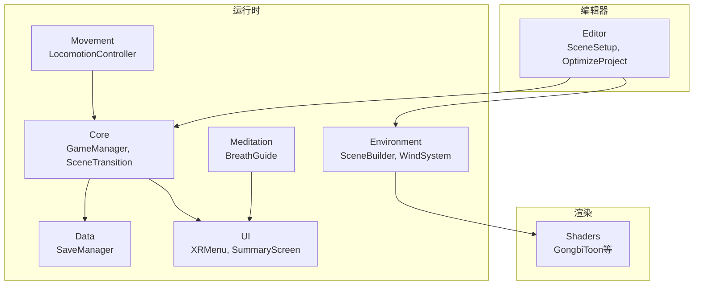
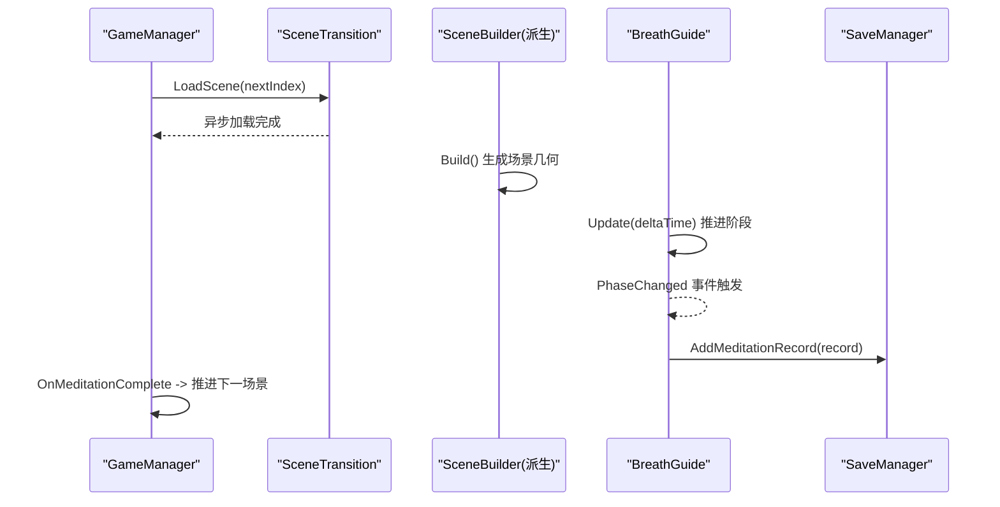
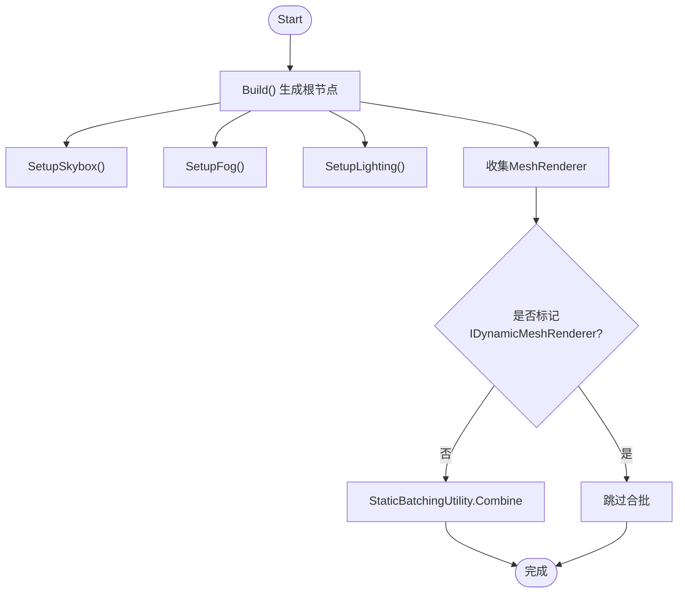
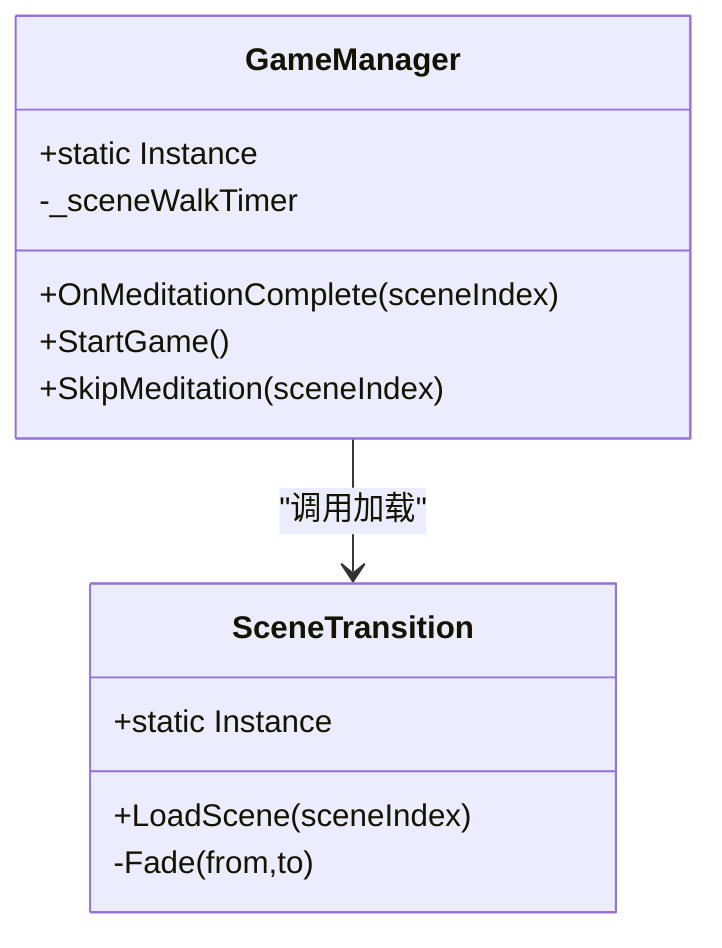
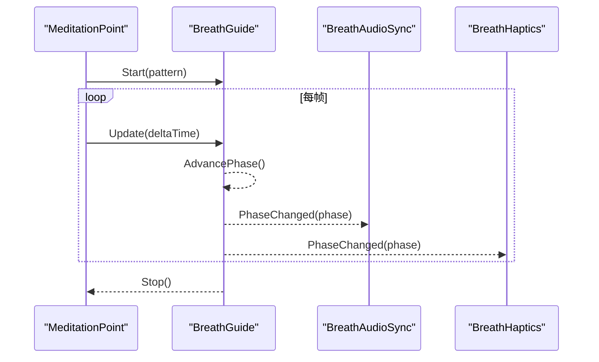
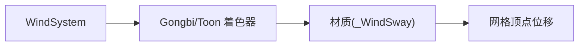
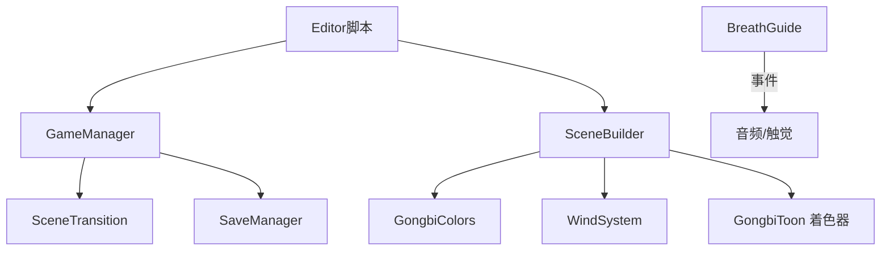

# 开发指南

<cite>
**本文引用的文件**
- [AGENTS.md](file://AGENTS.md)
- [Assets/Editor/AGENTS.md](file://Assets/Editor/AGENTS.md)
- [Assets/Scripts/Core/GameManager.cs](file://Assets/Scripts/Core/GameManager.cs)
- [Assets/Scripts/Core/SceneTransition.cs](file://Assets/Scripts/Core/SceneTransition.cs)
- [Assets/Scripts/Data/SaveManager.cs](file://Assets/Scripts/Data/SaveManager.cs)
- [Assets/Scripts/Meditation/BreathGuide.cs](file://Assets/Scripts/Meditation/BreathGuide.cs)
- [Assets/Scripts/GongbiColors.cs](file://Assets/Scripts/GongbiColors.cs)
- [Assets/Scripts/Environment/SceneBuilder.cs](file://Assets/Scripts/Environment/SceneBuilder.cs)
- [Assets/Scripts/Environment/WindSystem.cs](file://Assets/Scripts/Environment/WindSystem.cs)
- [Assets/Scripts/Environment/PavilionSceneBuilder.cs](file://Assets/Scripts/Environment/PavilionSceneBuilder.cs)
- [Assets/Scripts/Environment/SummitSceneBuilder.cs](file://Assets/Scripts/Environment/SummitSceneBuilder.cs)
- [Assets/Shaders/GongbiToon.shader](file://Assets/Shaders/GongbiToon.shader)
- [Assets/Editor/OptimizeProject.cs](file://Assets/Editor/OptimizeProject.cs)
- [Assets/Scripts/Core/VRPerformanceBootstrap.cs](file://Assets/Scripts/Core/VRPerformanceBootstrap.cs)
- [Assets/Editor/SceneSetup.cs](file://Assets/Editor/SceneSetup.cs)
- [.gitignore](file://.gitignore)
</cite>

## 目录
1. [简介](#简介)
2. [项目结构](#项目结构)
3. [核心组件](#核心组件)
4. [架构总览](#架构总览)
5. [详细组件分析](#详细组件分析)
6. [依赖关系分析](#依赖关系分析)
7. [性能与优化](#性能与优化)
8. [调试与排错](#调试与排错)
9. [开发工作流与协作规范](#开发工作流与协作规范)
10. [编辑器脚本开发规范](#编辑器脚本开发规范)
11. [新功能扩展指南](#新功能扩展指南)
12. [结论](#结论)

## 简介
本指南面向InkRidge项目的开发与维护，覆盖代码规范、命名约定、架构模式（场景构建器、单例、事件驱动）、编辑器脚本规范、版本控制与协作流程、调试与性能分析方法，以及新功能扩展的最佳实践。项目为Unity VR冥想体验，采用工笔画风格渲染，目标平台为Meta Quest 3（Android ARM64，IL2CPP）。

## 项目结构
- 运行时脚本按功能分层：Core（全局状态与过渡）、Data（持久化）、Environment（场景构建与环境系统）、Meditation（呼吸引导）、Movement（移动交互）、UI（界面）。
- 编辑器脚本位于Assets/Editor，提供批处理设置、构建与优化入口。
- 资源与场景分离：Scenes存放关卡；Prefabs存放可复用对象；Shaders实现工笔风格渲染管线；Audio提供环境音与音效。
- 命名空间遵循“InkRidge.{Folder}”的约定，Editor脚本无命名空间。

图表来源
- [AGENTS.md:22-44](file://AGENTS.md#L22-L44)
- [Assets/Editor/AGENTS.md:12-21](file://Assets/Editor/AGENTS.md#L12-L21)

章节来源
- [AGENTS.md:22-44](file://AGENTS.md#L22-L44)
- [Assets/Editor/AGENTS.md:12-21](file://Assets/Editor/AGENTS.md#L12-L21)

## 核心组件
- GameManager：全局单例，管理场景流转、行走时间统计与冥想完成后的推进逻辑。
- SceneTransition：异步场景加载并带黑场淡入淡出过渡。
- SaveManager：JSON本地存储，记录冥想数据、解锁进度与每日打卡。
- BreathGuide：非MonoBehaviour的呼吸节奏控制器，通过事件驱动音频与触觉反馈。
- SceneBuilder：运行时场景几何构建基类，统一材质与光照配置，支持静态合批与装饰体剔除碰撞。
- WindSystem：全局风场参数驱动植被顶点位移与着色效果。
- GongbiColors：工笔画矿物颜料调色板与阴影派生工具。

章节来源
- [Assets/Scripts/Core/GameManager.cs:1-66](file://Assets/Scripts/Core/GameManager.cs#L1-L66)
- [Assets/Scripts/Core/SceneTransition.cs:1-61](file://Assets/Scripts/Core/SceneTransition.cs#L1-L61)
- [Assets/Scripts/Data/SaveManager.cs:1-118](file://Assets/Scripts/Data/SaveManager.cs#L1-L118)
- [Assets/Scripts/Meditation/BreathGuide.cs:1-173](file://Assets/Scripts/Meditation/BreathGuide.cs#L1-L173)
- [Assets/Scripts/Environment/SceneBuilder.cs:1-223](file://Assets/Scripts/Environment/SceneBuilder.cs#L1-L223)
- [Assets/Scripts/Environment/WindSystem.cs:1-24](file://Assets/Scripts/Environment/WindSystem.cs#L1-L24)
- [Assets/Scripts/GongbiColors.cs:1-72](file://Assets/Scripts/GongbiColors.cs#L1-L72)

## 架构总览
- 场景构建器模式：每个场景继承SceneBuilder并重写Build()，使用统一的材质与光照API生成几何体，最后进行静态合批以提升渲染效率。
- 单例模式：GameManager与SceneTransition以DontDestroyOnLoad单例跨场景保持状态与提供全局服务。
- 事件驱动架构：BreathGuide通过PhaseChanged事件通知音频与触觉订阅者，避免紧耦合调用链。
- 渲染管线：Gongbi/Toon着色器实现两通道（轮廓+表面）卡通渲染，结合WindSystem的全局风参数字段驱动植被摆动。

图表来源
- [Assets/Scripts/Core/GameManager.cs:39-63](file://Assets/Scripts/Core/GameManager.cs#L39-L63)
- [Assets/Scripts/Core/SceneTransition.cs:30-44](file://Assets/Scripts/Core/SceneTransition.cs#L30-L44)
- [Assets/Scripts/Environment/SceneBuilder.cs:198-220](file://Assets/Scripts/Environment/SceneBuilder.cs#L198-L220)
- [Assets/Scripts/Meditation/BreathGuide.cs:54-102](file://Assets/Scripts/Meditation/BreathGuide.cs#L54-L102)
- [Assets/Scripts/Data/SaveManager.cs:59-66](file://Assets/Scripts/Data/SaveManager.cs#L59-L66)

章节来源
- [AGENTS.md:91-137](file://AGENTS.md#L91-L137)

## 详细组件分析

### 场景构建器（SceneBuilder）
- 职责：在运行时从基本体构建场景几何，统一材质创建与光照/雾/天穹配置，自动剔除装饰体的碰撞器并进行静态合批。
- 关键点：
  - MakeMat/MakeWindMat：基于Gongbi/Toon着色器与GongbiColors调色板创建材质。
  - Decorative系列方法：移除不必要的Collider以降低物理开销。
  - SetupSkybox/SetupFog/SetupLighting：集中配置渲染环境。
  - Start中合并MeshRenderer为静态批次，提升Draw Call效率。

图表来源
- [Assets/Scripts/Environment/SceneBuilder.cs:25-28](file://Assets/Scripts/Environment/SceneBuilder.cs#L25-L28)
- [Assets/Scripts/Environment/SceneBuilder.cs:152-196](file://Assets/Scripts/Environment/SceneBuilder.cs#L152-L196)
- [Assets/Scripts/Environment/SceneBuilder.cs:209-219](file://Assets/Scripts/Environment/SceneBuilder.cs#L209-L219)

章节来源
- [Assets/Scripts/Environment/SceneBuilder.cs:1-223](file://Assets/Scripts/Environment/SceneBuilder.cs#L1-L223)

### 单例管理器（GameManager与SceneTransition）
- GameManager：Awake中确保唯一实例并跨场景保留；Update累计行走时间；OnMeditationComplete保存时间并推进场景；StartGame/SkipMeditation提供入口。
- SceneTransition：提供带CanvasGroup淡入淡出的异步场景加载协程。

图表来源
- [Assets/Scripts/Core/GameManager.cs:10-63](file://Assets/Scripts/Core/GameManager.cs#L10-L63)
- [Assets/Scripts/Core/SceneTransition.cs:10-58](file://Assets/Scripts/Core/SceneTransition.cs#L10-L58)

章节来源
- [Assets/Scripts/Core/GameManager.cs:1-66](file://Assets/Scripts/Core/GameManager.cs#L1-L66)
- [Assets/Scripts/Core/SceneTransition.cs:1-61](file://Assets/Scripts/Core/SceneTransition.cs#L1-L61)

### 事件驱动的呼吸引导（BreathGuide）
- 设计要点：
  - 非MonoBehaviour，由MeditationPoint每帧调用Update推进。
  - 通过PhaseChanged事件广播阶段变化，音频与触觉订阅该事件，避免拉取式API。
  - 支持多种呼吸模式（Balanced444、Relax478、Box4444、Free），内部维护周期时长与稳定性评分。

图表来源
- [Assets/Scripts/Meditation/BreathGuide.cs:54-102](file://Assets/Scripts/Meditation/BreathGuide.cs#L54-L102)
- [Assets/Scripts/Meditation/BreathGuide.cs:116-147](file://Assets/Scripts/Meditation/BreathGuide.cs#L116-L147)

章节来源
- [Assets/Scripts/Meditation/BreathGuide.cs:1-173](file://Assets/Scripts/Meditation/BreathGuide.cs#L1-L173)

### 着色器与风系统（GongbiToon与WindSystem）
- Gongbi/Toon：两通道卡通渲染，包含轮廓外扩与三带明暗表面着色，支持风参数字段驱动顶点位移。
- WindSystem：设置全局风参数字段（速度、幅度、湍流、方向、阵风密度、强度），供着色器读取以实现植被摆动。

图表来源
- [Assets/Scripts/Environment/WindSystem.cs:1-24](file://Assets/Scripts/Environment/WindSystem.cs#L1-L24)
- [Assets/Shaders/GongbiToon.shader:31-180](file://Assets/Shaders/GongbiToon.shader#L31-L180)

章节来源
- [Assets/Scripts/Environment/WindSystem.cs:1-24](file://Assets/Scripts/Environment/WindSystem.cs#L1-L24)
- [Assets/Shaders/GongbiToon.shader:31-180](file://Assets/Shaders/GongbiToon.shader#L31-L180)

### 场景构建器派生示例（Pavilion与Summit）
- PavilionSceneBuilder：配置天空、地面、亭台、树木、竹林、石径、灯笼、冥想点、边界墙、渐变雾与风系统，设置光照与雾密度。
- SummitSceneBuilder：夜空天穹、星场、远山、冥想点、石碑、石灯、边界墙，冷色调光照与低密度雾营造山顶氛围。

章节来源
- [Assets/Scripts/Environment/PavilionSceneBuilder.cs:1-36](file://Assets/Scripts/Environment/PavilionSceneBuilder.cs#L1-L36)
- [Assets/Scripts/Environment/SummitSceneBuilder.cs:1-34](file://Assets/Scripts/Environment/SummitSceneBuilder.cs#L1-L34)

## 依赖关系分析
- 运行时依赖：
  - GameManager依赖SceneTransition进行场景切换，依赖SaveManager持久化数据。
  - SceneBuilder依赖GongbiColors与自定义着色器，依赖WindSystem提供风参数字段。
  - BreathGuide通过事件与音频/触觉模块解耦。
- 编辑器依赖：
  - SceneSetup负责批量创建场景、XR Origin、冥想点与移动提供者。
  - OptimizeProject配置质量、玩家设置、图形与音频优化，并确保着色器不被剥离。

图表来源
- [Assets/Scripts/Core/GameManager.cs:39-63](file://Assets/Scripts/Core/GameManager.cs#L39-L63)
- [Assets/Scripts/Environment/SceneBuilder.cs:152-196](file://Assets/Scripts/Environment/SceneBuilder.cs#L152-L196)
- [Assets/Scripts/Meditation/BreathGuide.cs:16-23](file://Assets/Scripts/Meditation/BreathGuide.cs#L16-L23)
- [Assets/Editor/SceneSetup.cs:137-160](file://Assets/Editor/SceneSetup.cs#L137-L160)
- [Assets/Editor/OptimizeProject.cs:13-35](file://Assets/Editor/OptimizeProject.cs#L13-L35)

章节来源
- [Assets/Editor/SceneSetup.cs:137-160](file://Assets/Editor/SceneSetup.cs#L137-L160)
- [Assets/Editor/OptimizeProject.cs:13-35](file://Assets/Editor/OptimizeProject.cs#L13-L35)

## 性能与优化
- 运行时性能启动：
  - VRPerformanceBootstrap在场景加载前设置目标帧率、刷新率、CPU/GPU等级与FFR（若可用），保证VR设备性能基线。
- 编辑器优化：
  - OptimizeProject将质量设置为Quest 3配置，禁用阴影、启用MSAA、关闭软粒子、设置VSync为0（由VR合成器控制），配置ARM64/IL2CPP/Release，开启strip引擎代码与未用组件剥离。
  - 音频优化：根据路径识别ambience长循环使用Streaming，短音效DecompressOnLoad，压缩格式Vorbis。
  - 着色器保护：将必需着色器加入AlwaysIncludedShaders，防止被剥离导致运行时错误。
- 渲染优化：
  - SceneBuilder在Start中对静态MeshRenderer进行静态合批，减少Draw Call。
  - 装饰体剔除Collider，降低物理Broadphase开销。
  - 风系统通过全局参数驱动顶点位移，避免逐物体计算。

章节来源
- [Assets/Scripts/Core/VRPerformanceBootstrap.cs:12-46](file://Assets/Scripts/Core/VRPerformanceBootstrap.cs#L12-L46)
- [Assets/Editor/OptimizeProject.cs:37-49](file://Assets/Editor/OptimizeProject.cs#L37-L49)
- [Assets/Editor/OptimizeProject.cs:53-82](file://Assets/Editor/OptimizeProject.cs#L53-L82)
- [Assets/Editor/OptimizeProject.cs:142-176](file://Assets/Editor/OptimizeProject.cs#L142-L176)
- [Assets/Editor/OptimizeProject.cs:257-292](file://Assets/Editor/OptimizeProject.cs#L257-L292)
- [Assets/Editor/OptimizeProject.cs:296-333](file://Assets/Editor/OptimizeProject.cs#L296-L333)
- [Assets/Scripts/Environment/SceneBuilder.cs:209-219](file://Assets/Scripts/Environment/SceneBuilder.cs#L209-L219)

## 调试与排错
- 常见问题与解决：
  - 着色器缺失或报错：运行OptimizeProject以确保必需着色器加入AlwaysIncludedShaders；检查Shader.Find返回是否为空。
  - 单例重复销毁：确保Awake中仅保留一个实例，多余实例销毁。
  - 场景加载卡顿：确认SceneTransition使用异步加载并配合淡入淡出；检查静态合批是否生效。
  - 音频不播放：确认BreathGuide的PhaseChanged事件已正确订阅；避免拉取式API导致的遗漏调用。
  - 保存失败：检查SaveManager的异常捕获与日志输出；确认persistentDataPath可写。
- 调试技巧：
  - 使用Editor日志前缀[ClassName]便于过滤。
  - 在编辑器菜单Debug下运行优化与设置脚本，快速复现实机配置。
  - 使用Test Runner执行EditMode测试，验证呼吸节奏、设置持久化与保存读写。

章节来源
- [Assets/Editor/AGENTS.md:5-10](file://Assets/Editor/AGENTS.md#L5-L10)
- [Assets/Scripts/Data/SaveManager.cs:29-57](file://Assets/Scripts/Data/SaveManager.cs#L29-L57)
- [Assets/Scripts/Meditation/BreathGuide.cs:16-23](file://Assets/Scripts/Meditation/BreathGuide.cs#L16-L23)
- [Assets/Editor/OptimizeProject.cs:257-292](file://Assets/Editor/OptimizeProject.cs#L257-L292)

## 开发工作流与协作规范
- 版本控制策略：
  - 忽略Library、Temp、Obj、Build、Logs、UserSettings、MemoryCaptures、Recordings、APK/AAB/UnityPackage等生成物与缓存。
  - 提交粒度建议：按功能或修复拆分提交，附带清晰的提交信息。
- 代码审查流程：
  - 新增场景需遵循SceneBuilder派生模式，确保材质与光照统一。
  - 新增音频需纳入OptimizeProject的音频优化流程。
  - 修改着色器需评估单通道/立体实例化的影响，必要时使用OptimizeProject提供的检测入口。
- 协作最佳实践：
  - 使用Assembly Definition（asmdef）隔离Editor与Runtime代码，避免编译时依赖。
  - 命名空间遵循“InkRidge.{Folder}”，Editor脚本无命名空间。
  - 公共接口优先使用事件驱动，降低模块间耦合。

章节来源
- [.gitignore:1-17](file://.gitignore#L1-L17)
- [AGENTS.md:134-142](file://AGENTS.md#L134-L142)
- [Assets/Editor/AGENTS.md:5-10](file://Assets/Editor/AGENTS.md#L5-L10)

## 编辑器脚本开发规范
- 组织与命名：
  - 所有Editor脚本置于Assets/Editor，无命名空间，公共方法均为static，便于批处理调用。
  - 日志前缀使用[ClassName]，便于追踪。
- 常用脚本：
  - SceneSetup.Run：创建全部场景、XR Origin、冥想点、移动提供者，并保存到对应.unity文件。
  - AudioSetup.Setup：遍历游戏场景，创建AudioRoot并连接环境音与脚步音效。
  - BuildAPK.Build：配置SDK路径、IL2CPP+ARM64、构建APK到指定目录。
  - OptimizeProject.Optimize：应用Quest 3质量设置、音频压缩与玩家配置。
  - SetAndroidPaths.SetPaths：设置Android SDK/NDK/JDK路径。
- 场景添加步骤：
  - 在SceneSetup.EnsureScenesInBuildSettings中添加新场景路径。
  - 在BuildAPK.Build的scenes数组中添加新场景路径。
  - 复制现有场景方法模式添加场景构建逻辑。
  - 在AudioSetup中添加场景路径与环境音片段。

章节来源
- [Assets/Editor/AGENTS.md:12-47](file://Assets/Editor/AGENTS.md#L12-L47)
- [Assets/Editor/SceneSetup.cs:137-160](file://Assets/Editor/SceneSetup.cs#L137-L160)
- [Assets/Editor/SceneSetup.cs:255-277](file://Assets/Editor/SceneSetup.cs#L255-L277)
- [Assets/Editor/SceneSetup.cs:309-335](file://Assets/Editor/SceneSetup.cs#L309-L335)

## 新功能扩展指南
- 新增场景：
  - 新建SceneBuilder派生类，重写Build()并调用base.Build()；使用MakeMat/MakeWindMat创建材质，调用SetupSkybox/SetupFog/SetupLighting配置渲染。
  - 在SceneSetup中添加场景创建与保存逻辑，并在Build Settings与BuildAPK中注册。
- 新增呼吸模式：
  - 在BreathGuide.Pattern枚举中添加新模式，更新PatternTimings矩阵；确保Phase转换逻辑覆盖新阶段。
- 新增着色器：
  - 如需参与风系统，需在顶点着色器中读取WindSystem的全局风参数字段；若启用单通道立体实例化，需添加Unity立体宏。
  - 运行OptimizeProject的“Enable Single-Pass Instanced”检测入口，确保着色器声明完整。
- 新增音频：
  - 将音频放入Assets/Audio，运行OptimizeProject以自动应用压缩与加载策略；在AudioSetup中注册新场景与片段。
- 数据持久化：
  - 在SaveManager.SaveFile中扩展字段，并在AddMeditationRecord/UnlockScene等方法中更新逻辑；注意异常处理与日志。

章节来源
- [Assets/Scripts/Environment/SceneBuilder.cs:25-28](file://Assets/Scripts/Environment/SceneBuilder.cs#L25-L28)
- [Assets/Scripts/Meditation/BreathGuide.cs:25-44](file://Assets/Scripts/Meditation/BreathGuide.cs#L25-L44)
- [Assets/Editor/OptimizeProject.cs:204-243](file://Assets/Editor/OptimizeProject.cs#L204-L243)
- [Assets/Editor/OptimizeProject.cs:296-333](file://Assets/Editor/OptimizeProject.cs#L296-L333)
- [Assets/Scripts/Data/SaveManager.cs:15-24](file://Assets/Scripts/Data/SaveManager.cs#L15-L24)

## 结论
InkRidge采用清晰的分层架构与一致的命名空间约定，通过场景构建器模式、单例与事件驱动实现了高内聚、低耦合的系统。编辑器脚本提供了强大的批处理能力，保障构建与优化的可重复性。遵循本指南的规范与实践，团队可高效扩展新功能、稳定迭代并保持高质量的VR体验。