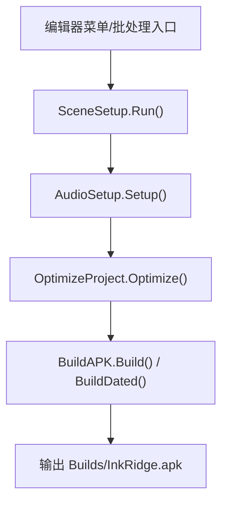
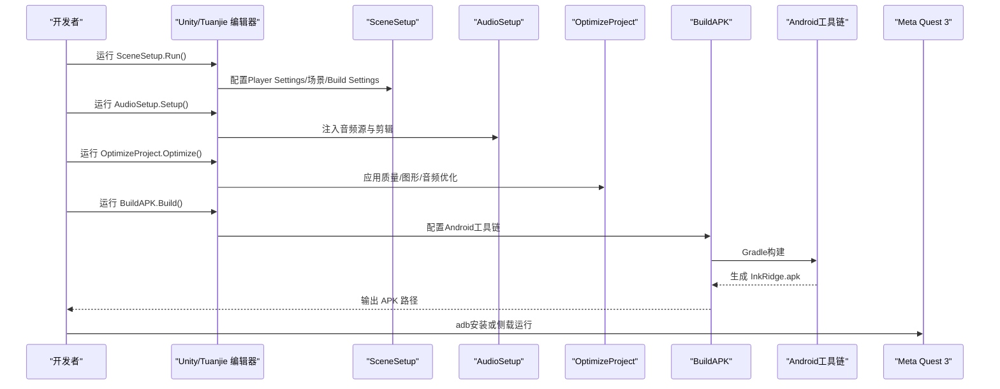
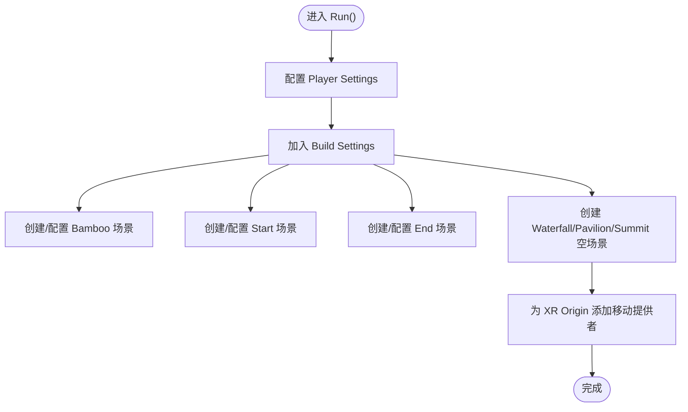
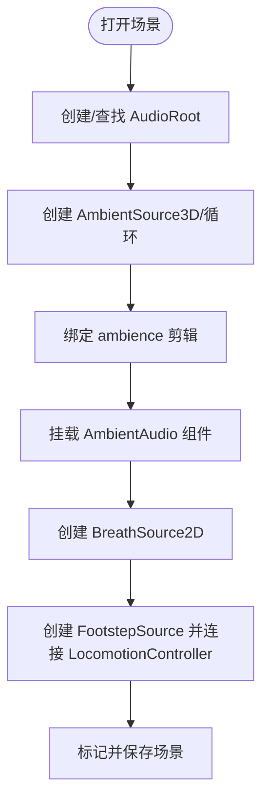
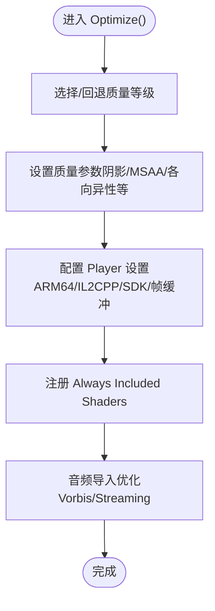
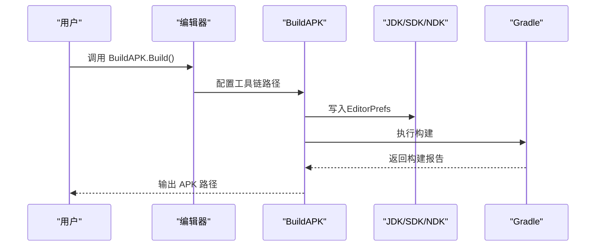
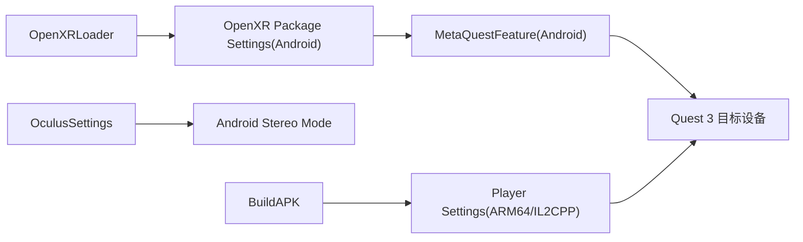

# 快速开始

<cite>
**本文引用的文件**
- [AGENTS.md](file://AGENTS.md)
- [Assets/Editor/AGENTS.md](file://Assets/Editor/AGENTS.md)
- [Assets/Editor/SceneSetup.cs](file://Assets/Editor/SceneSetup.cs)
- [Assets/Editor/AudioSetup.cs](file://Assets/Editor/AudioSetup.cs)
- [Assets/Editor/OptimizeProject.cs](file://Assets/Editor/OptimizeProject.cs)
- [Assets/Editor/BuildAPK.cs](file://Assets/Editor/BuildAPK.cs)
- [ProjectSettings/ProjectVersion.txt](file://ProjectSettings/ProjectVersion.txt)
- [Assets/XR/Settings/OpenXR Package Settings.asset](file://Assets/XR/Settings/OpenXR Package Settings.asset)
- [Assets/XR/Settings/OculusSettings.asset](file://Assets/XR/Settings/OculusSettings.asset)
- [Assets/XR/Loaders/OpenXRLoader.asset](file://Assets/XR/Loaders/OpenXRLoader.asset)
- [Assets/XR/Loaders/OculusLoader.asset](file://Assets/XR/Loaders/OculusLoader.asset)
</cite>

## 目录
1. [简介](#简介)
2. [项目结构](#项目结构)
3. [核心组件](#核心组件)
4. [架构总览](#架构总览)
5. [详细组件分析](#详细组件分析)
6. [依赖关系分析](#依赖关系分析)
7. [性能注意事项](#性能注意事项)
8. [故障排除指南](#故障排除指南)
9. [结论](#结论)
10. [附录：命令行与编辑器操作步骤](#附录命令行与编辑器操作步骤)

## 简介
本快速开始指南面向新手开发者，帮助你在最短时间内完成InkRidge项目的开发环境搭建、项目导入与初始化配置，并构建部署到Meta Quest 3设备。项目基于Tuanjie 2022.3 LTS（Unity 2022.3 LTS分支），目标平台为Android ARM64 + IL2CPP，使用OpenXR与XR Interaction Toolkit 3.x进行VR交互与移动控制。

## 项目结构
- 引擎与目标
  - 引擎版本：Tuanjie 2022.3.62t12（见工程版本文件）
  - 目标平台：Meta Quest 3（Android ARM64，IL2CPP）
  - XR方案：OpenXR + XR Interaction Toolkit 3.x（LocomotionMediator + XRBodyTransformer）
- 场景流程
  - 00_Start → 01_Bamboo → 02_Waterfall → 03_Pavilion → 04_Summit → 99_End
  - 每个场景（01–04）包含冥想点，完成后解锁下一场景
- 关键脚本职责
  - SceneSetup：自动化创建场景、配置Player Settings、加入Build Settings、生成XR Origin与移动系统
  - AudioSetup：为各场景注入音频根节点与环境音、呼吸音效、脚步声
  - OptimizeProject：应用Quest 3质量设置、图形与音频优化、玩家设置
  - BuildAPK：一键构建APK，自动配置Android工具链路径

图表来源
- [Assets/Editor/SceneSetup.cs:23-35](file://Assets/Editor/SceneSetup.cs#L23-L35)
- [Assets/Editor/AudioSetup.cs:9-110](file://Assets/Editor/AudioSetup.cs#L9-L110)
- [Assets/Editor/OptimizeProject.cs:37-49](file://Assets/Editor/OptimizeProject.cs#L37-L49)
- [Assets/Editor/BuildAPK.cs:35-62](file://Assets/Editor/BuildAPK.cs#L35-L62)

章节来源
- [AGENTS.md:7-18](file://AGENTS.md#L7-L18)
- [Assets/Editor/AGENTS.md:12-20](file://Assets/Editor/AGENTS.md#L12-L20)
- [ProjectSettings/ProjectVersion.txt:1-3](file://ProjectSettings/ProjectVersion.txt#L1-L3)

## 核心组件
- 场景初始化（SceneSetup）
  - 配置Player Settings（公司名、产品名、API兼容性、脚本后端、目标架构、最低SDK）
  - 将6个场景加入Build Settings
  - 为各场景创建XR Origin、移动提供者（连续移动、折返转向）、冥想点与过渡画布
- 音频初始化（AudioSetup）
  - 遍历游戏场景，创建AudioRoot，注入环境音、呼吸音效、脚步声，并连接至对应组件
- 项目优化（OptimizeProject）
  - 应用Quest 3质量等级（关闭阴影、2x MSAA、各向异性过滤等）
  - 配置Player设置（ARM64、IL2CPP Release、最小SDK、帧缓冲策略）
  - 注册必须保留的着色器，避免被剥离
  - 音频压缩优化（Vorbis、流式加载长循环环境音）
- APK构建（BuildAPK）
  - 自动配置JDK/Sdk/Ndk路径，切换Android目标，执行构建
  - 支持稳定命名与带时间戳命名两种输出方式

章节来源
- [Assets/Editor/SceneSetup.cs:37-70](file://Assets/Editor/SceneSetup.cs#L37-L70)
- [Assets/Editor/AudioSetup.cs:12-107](file://Assets/Editor/AudioSetup.cs#L12-L107)
- [Assets/Editor/OptimizeProject.cs:53-176](file://Assets/Editor/OptimizeProject.cs#L53-L176)
- [Assets/Editor/BuildAPK.cs:45-103](file://Assets/Editor/BuildAPK.cs#L45-L103)

## 架构总览
下图展示了从编辑器入口到最终APK输出的完整流水线，以及各阶段对XR与渲染的关键影响。

图表来源
- [Assets/Editor/SceneSetup.cs:23-35](file://Assets/Editor/SceneSetup.cs#L23-L35)
- [Assets/Editor/AudioSetup.cs:9-110](file://Assets/Editor/AudioSetup.cs#L9-L110)
- [Assets/Editor/OptimizeProject.cs:37-49](file://Assets/Editor/OptimizeProject.cs#L37-L49)
- [Assets/Editor/BuildAPK.cs:45-62](file://Assets/Editor/BuildAPK.cs#L45-L62)

## 详细组件分析

### 场景初始化（SceneSetup）
- 功能要点
  - 配置Player Settings：公司名、产品名、API兼容性、脚本后端、目标架构、最低SDK
  - 确保6个场景在Build Settings中启用
  - 为Bamboo、Start、End场景分别创建必要对象（GameManager、SceneTransition、XR Origin、冥想点、粒子等）
  - 为Waterfall/Pavilion/Summit场景创建空场景并添加场景构建器与核心管理器
  - 为XR Origin添加移动系统（LocomotionMediator + ContinuousMoveProvider + SnapTurnProvider）
- 复杂度与影响
  - 通过SerializedObject设置私有字段，保证序列化友好
  - 统一高度1.75m的相机偏移，符合人体站立视角
  - 冥想点触发区尺寸固定，便于交互一致性

图表来源
- [Assets/Editor/SceneSetup.cs:23-35](file://Assets/Editor/SceneSetup.cs#L23-L35)
- [Assets/Editor/SceneSetup.cs:37-70](file://Assets/Editor/SceneSetup.cs#L37-L70)
- [Assets/Editor/SceneSetup.cs:72-160](file://Assets/Editor/SceneSetup.cs#L72-L160)
- [Assets/Editor/SceneSetup.cs:162-239](file://Assets/Editor/SceneSetup.cs#L162-L239)
- [Assets/Editor/SceneSetup.cs:241-280](file://Assets/Editor/SceneSetup.cs#L241-L280)
- [Assets/Editor/SceneSetup.cs:301-325](file://Assets/Editor/SceneSetup.cs#L301-L325)

章节来源
- [Assets/Editor/SceneSetup.cs:23-396](file://Assets/Editor/SceneSetup.cs#L23-L396)

### 音频初始化（AudioSetup）
- 功能要点
  - 遍历指定场景，创建AudioRoot与AmbientSource（3D、循环、音量淡入由运行时控制）
  - 为冥想准备BreathSource（2D、非循环）
  - 为脚步准备FootstepSource，并连接到LocomotionController
  - 保存场景变更
- 性能考量
  - 环境音采用空间化与对数衰减，营造沉浸感
  - 脚步声与呼吸声以2D为主，减少空间计算开销

图表来源
- [Assets/Editor/AudioSetup.cs:12-107](file://Assets/Editor/AudioSetup.cs#L12-L107)

章节来源
- [Assets/Editor/AudioSetup.cs:9-110](file://Assets/Editor/AudioSetup.cs#L9-L110)

### 项目优化（OptimizeProject）
- 功能要点
  - 质量设置：禁用阴影、单方向光、2x MSAA、各向异性过滤、软植被、关闭实时反射探针、LOD Bias、关闭垂直同步（VR合成器负责节奏）
  - 玩家设置：ARM64、IL2CPP Release、最小SDK 29、无blit、优化帧调度、多通道渲染开启、代码剥离
  - 着色器保护：将Gongbi系列着色器加入“始终包含”列表，防止被剥离
  - 音频优化：根据路径识别ambience，长循环采用Vorbis流式加载，短音效预解压
- 重要提示
  - 单通道实例化立体渲染需着色器声明相关宏，当前未启用；提供独立菜单项检查并启用

图表来源
- [Assets/Editor/OptimizeProject.cs:53-176](file://Assets/Editor/OptimizeProject.cs#L53-L176)
- [Assets/Editor/OptimizeProject.cs:257-333](file://Assets/Editor/OptimizeProject.cs#L257-L333)

章节来源
- [Assets/Editor/OptimizeProject.cs:37-333](file://Assets/Editor/OptimizeProject.cs#L37-L333)

### APK构建（BuildAPK）
- 功能要点
  - 自动解析JDK路径（优先编辑器内置，回退到历史路径）
  - 设置Android SDK/NDK路径，切换Android目标，使用Gradle构建
  - 输出稳定命名或带时间戳命名的APK
- 注意事项
  - 若本地路径不同，需修改脚本中的SDK/NDK路径常量
  - 构建前请确保已运行OptimizeProject以应用正确的质量与玩家设置

图表来源
- [Assets/Editor/BuildAPK.cs:45-103](file://Assets/Editor/BuildAPK.cs#L45-L103)

章节来源
- [Assets/Editor/BuildAPK.cs:5-118](file://Assets/Editor/BuildAPK.cs#L5-L118)

## 依赖关系分析
- XR与控制器
  - OpenXR Loader与Oculus Loader均存在，Android端通过OpenXR特性启用Meta Quest支持（含Quest 3）
  - OculusSettings中TargetQuest3已启用，StereoRenderingModeAndroid为特定模式
- 构建与平台
  - ProjectVersion.txt表明使用2022.3 LTS分支
  - BuildAPK强制ARM64、IL2CPP、最小SDK 29，确保Quest 3兼容
- 场景与运行时
  - 所有场景通过SceneSetup统一创建XR Origin与移动系统，保证一致体验
  - 音频系统在各场景注入，运行时由AmbientAudio与BreathGuide协调

图表来源
- [Assets/XR/Loaders/OpenXRLoader.asset:1-15](file://Assets/XR/Loaders/OpenXRLoader.asset#L1-L15)
- [Assets/XR/Settings/OpenXR Package Settings.asset:503-539](file://Assets/XR/Settings/OpenXR Package Settings.asset#L503-L539)
- [Assets/XR/Settings/OculusSettings.asset:15-33](file://Assets/XR/Settings/OculusSettings.asset#L15-L33)
- [Assets/Editor/BuildAPK.cs:96-100](file://Assets/Editor/BuildAPK.cs#L96-L100)

章节来源
- [Assets/XR/Settings/OpenXR Package Settings.asset:503-539](file://Assets/XR/Settings/OpenXR Package Settings.asset#L503-L539)
- [Assets/XR/Settings/OculusSettings.asset:15-33](file://Assets/XR/Settings/OculusSettings.asset#L15-L33)
- [Assets/Editor/BuildAPK.cs:96-100](file://Assets/Editor/BuildAPK.cs#L96-L100)

## 性能注意事项
- 渲染
  - 使用2x MSAA提升墨线抗锯齿效果；关闭阴影以减少GPU压力
  - 各向异性过滤开启，改善纹理清晰度
  - 关闭实时反射探针与软粒子，降低每帧开销
  - 单通道实例化立体渲染尚未启用（着色器需声明宏），启用后可显著减少绘制调用
- 音频
  - 环境音采用Vorbis压缩与流式加载，避免内存峰值
  - 短音效预解压，减少播放延迟
- 构建
  - 启用代码剥离与引擎代码剥离，减小包体
  - 使用IL2CPP Release编译，提升运行效率

[本节为通用性能建议，不直接分析具体文件]

## 故障排除指南
- 无法找到Android工具链
  - 现象：构建时报JDK/SDK/NDK路径错误
  - 解决：确认BuildAPK.cs中的SDK/NDK路径与本机一致；必要时手动修改脚本中的路径常量
  - 参考：[Assets/Editor/BuildAPK.cs:73-103](file://Assets/Editor/BuildAPK.cs#L73-L103)
- 场景缺失或未加入Build Settings
  - 现象：构建后场景未生效
  - 解决：运行SceneSetup.Run()以确保场景创建与加入Build Settings
  - 参考：[Assets/Editor/SceneSetup.cs:52-70](file://Assets/Editor/SceneSetup.cs#L52-L70)
- 音频未生效
  - 现象：场景无环境音或脚步声
  - 解决：运行AudioSetup.Setup()重新注入音频源与剪辑
  - 参考：[Assets/Editor/AudioSetup.cs:12-107](file://Assets/Editor/AudioSetup.cs#L12-L107)
- 着色器丢失（材质变品红）
  - 现象：运行时材质显示错误着色器
  - 解决：运行OptimizeProject.Optimize()注册Always Included Shaders
  - 参考：[Assets/Editor/OptimizeProject.cs:257-292](file://Assets/Editor/OptimizeProject.cs#L257-L292)
- 单通道实例化立体渲染报错或画面异常
  - 现象：启用后画面错误或立体失效
  - 解决：确保着色器声明所需宏后再启用；使用菜单项检查缺失着色器
  - 参考：[Assets/Editor/OptimizeProject.cs:204-243](file://Assets/Editor/OptimizeProject.cs#L204-L243)

章节来源
- [Assets/Editor/BuildAPK.cs:73-103](file://Assets/Editor/BuildAPK.cs#L73-L103)
- [Assets/Editor/SceneSetup.cs:52-70](file://Assets/Editor/SceneSetup.cs#L52-L70)
- [Assets/Editor/AudioSetup.cs:12-107](file://Assets/Editor/AudioSetup.cs#L12-L107)
- [Assets/Editor/OptimizeProject.cs:204-292](file://Assets/Editor/OptimizeProject.cs#L204-L292)

## 结论
通过SceneSetup、AudioSetup、OptimizeProject与BuildAPK四个编辑器脚本，InkRidge实现了从零到可部署的完整流水线。按照本指南的步骤操作，你可以在最短时间内完成环境搭建、项目初始化并在Meta Quest 3上体验完整的冥想旅程。建议在每次构建前运行OptimizeProject以保证一致的渲染与音频表现。

[本节为总结性内容，不直接分析具体文件]

## 附录：命令行与编辑器操作步骤

- 环境准备
  - 安装Tuanjie 2022.3 LTS（Unity 2022.3 LTS分支）
  - 安装Android SDK、NDK（R23B）与JDK（编辑器自带或外部）
  - 在编辑器中切换到Android平台，并确保OpenXR与XR Interaction Toolkit可用
- 项目导入与初始化
  - 在编辑器菜单Debug下依次执行：
    - SceneSetup.Run()
    - AudioSetup.Setup()
    - OptimizeProject.Optimize()
  - 或在批处理模式下执行：
    - Tuanjie -batchmode -executeMethod SceneSetup.Run -quit
    - Tuanjie -batchmode -executeMethod AudioSetup.Setup -quit
    - Tuanjie -batchmode -executeMethod OptimizeProject.Optimize -quit
- 构建APK
  - 编辑器菜单：Debug > Build APK（稳定命名）或 Debug > Build APK (dated)（带时间戳）
  - 批处理命令：
    - Tuanjie -batchmode -executeMethod BuildAPK.Build -quit
    - Tuanjie -batchmode -executeMethod BuildAPK.BuildDated -quit
- 部署到Meta Quest 3
  - 使用adb安装生成的APK到设备，或通过Quest侧载安装
  - 首次运行需在设备上授予必要的权限（如存储）
- 常见问题速查
  - 工具链路径错误：检查BuildAPK.cs中的SDK/NDK/JDK路径
  - 场景未生效：重新运行SceneSetup.Run()
  - 音频无效：重新运行AudioSetup.Setup()
  - 着色器丢失：重新运行OptimizeProject.Optimize()

章节来源
- [AGENTS.md:52-86](file://AGENTS.md#L52-L86)
- [Assets/Editor/AGENTS.md:12-20](file://Assets/Editor/AGENTS.md#L12-L20)
- [Assets/Editor/BuildAPK.cs:35-62](file://Assets/Editor/BuildAPK.cs#L35-L62)
- [Assets/Editor/SceneSetup.cs:23-35](file://Assets/Editor/SceneSetup.cs#L23-L35)
- [Assets/Editor/AudioSetup.cs:9-110](file://Assets/Editor/AudioSetup.cs#L9-L110)
- [Assets/Editor/OptimizeProject.cs:37-49](file://Assets/Editor/OptimizeProject.cs#L37-L49)