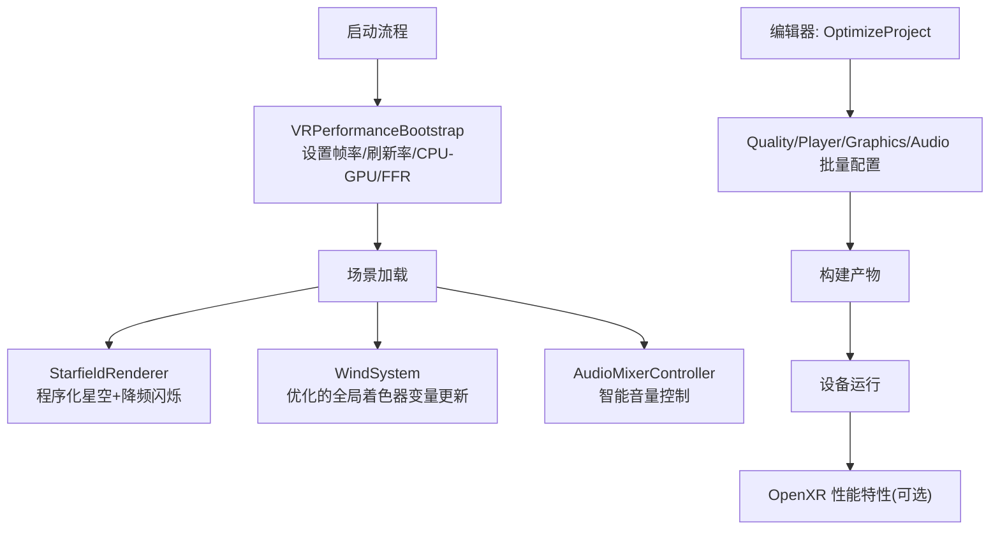
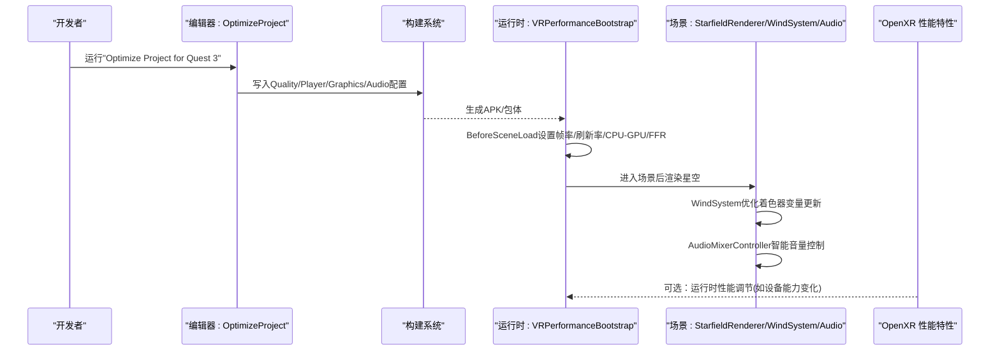
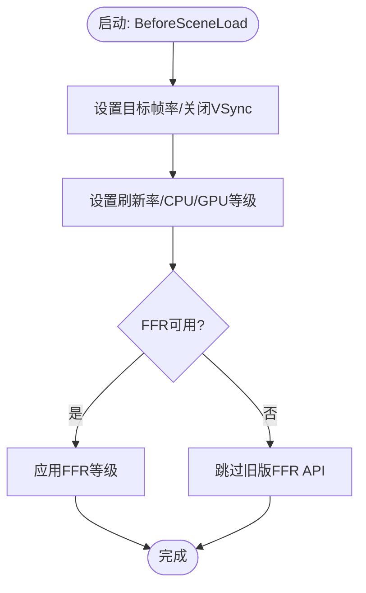
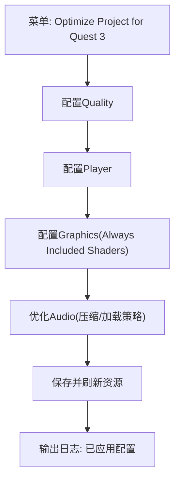
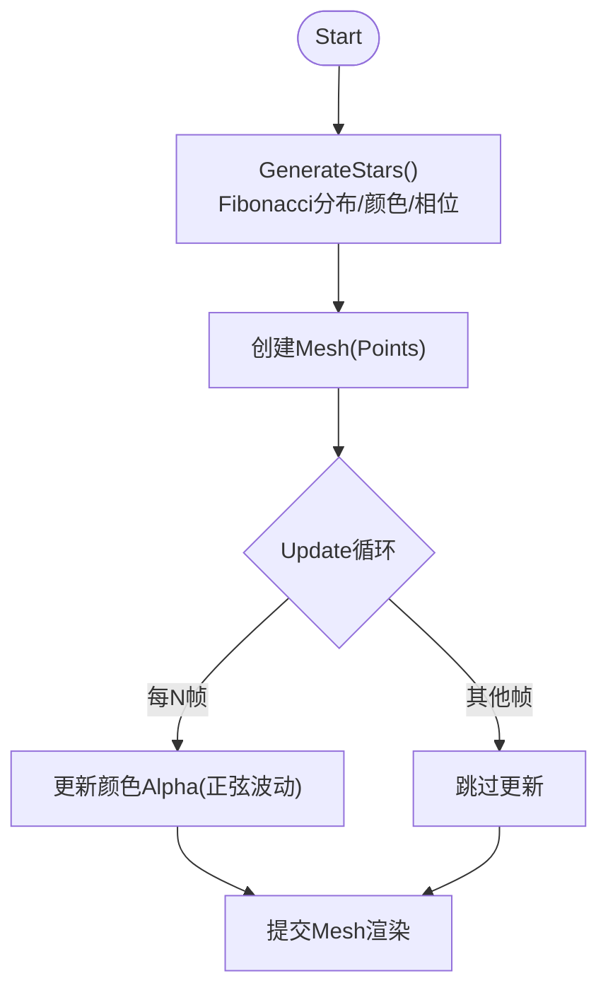
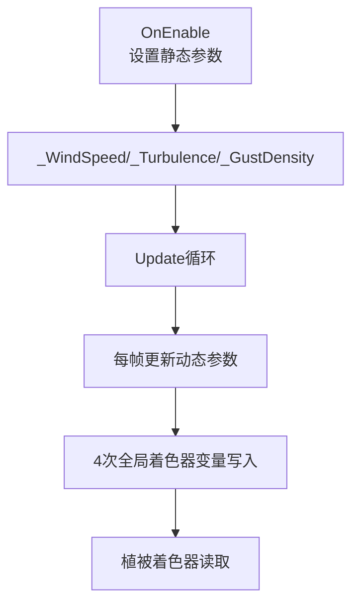
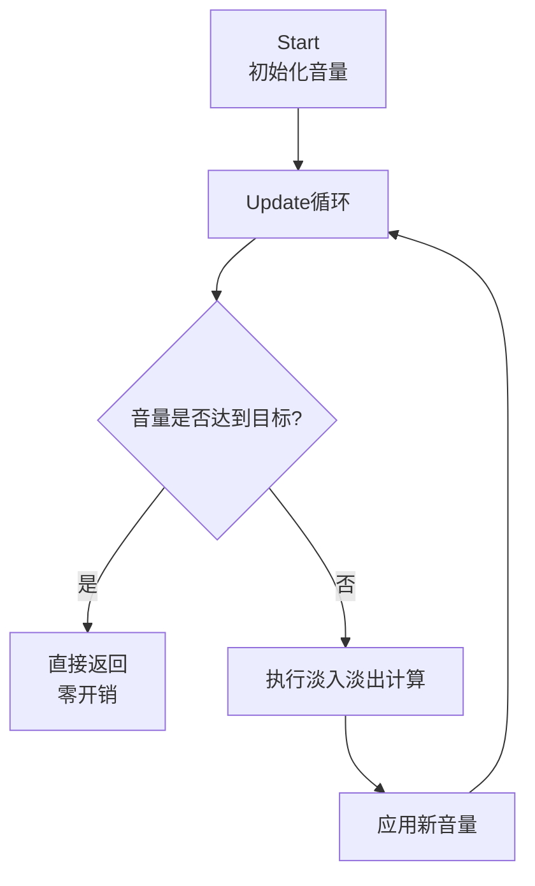
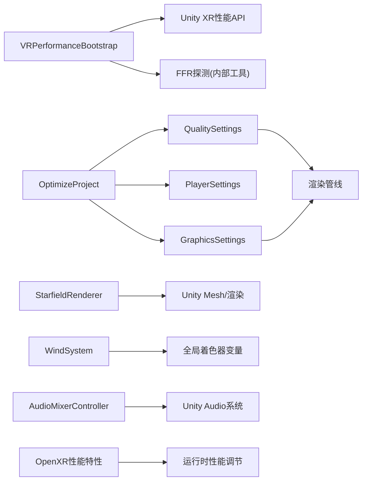

# 性能优化

<cite>
**本文引用的文件**
- [VRPerformanceBootstrap.cs](file://Assets/Scripts/Core/VRPerformanceBootstrap.cs)
- [OptimizeProject.cs](file://Assets/Editor/OptimizeProject.cs)
- [StarfieldRenderer.cs](file://Assets/Scripts/Environment/StarfieldRenderer.cs)
- [WindSystem.cs](file://Assets/Scripts/Environment/WindSystem.cs)
- [AudioMixerController.cs](file://Assets/Scripts/Core/AudioMixerController.cs)
- [GraphicsSettings.asset](file://ProjectSettings/GraphicsSettings.asset)
- [QualitySettings.asset](file://ProjectSettings/QualitySettings.asset)
- [OpenXR Package Settings.asset](file://Assets/XR/Settings/OpenXR Package Settings.asset)
- [GameManager.cs](file://Assets/Scripts/Core/GameManager.cs)
- [XRMenu.cs](file://Assets/Scripts/UI/XRMenu.cs)
</cite>

## 更新摘要
**所做更改**
- 更新了风系统性能优化部分，详细说明全局着色器变量写入的优化
- 新增音频混合器性能改进章节，说明避免不必要计算的优化策略
- 更新了性能考量章节，包含最新的优化效果
- 增强了故障排查指南，涵盖新的优化相关问题

## 目录
1. [简介](#简介)
2. [项目结构](#项目结构)
3. [核心组件](#核心组件)
4. [架构总览](#架构总览)
5. [详细组件分析](#详细组件分析)
6. [依赖关系分析](#依赖关系分析)
7. [性能考量](#性能考量)
8. [故障排查指南](#故障排查指南)
9. [结论](#结论)
10. [附录](#附录)

## 简介
本指南面向在移动VR平台（以Quest 3为目标）上运行InkRidge的开发者与QA，聚焦以下目标：
- 运行时性能引导：通过VRPerformanceBootstrap统一设置帧率、刷新率、CPU/GPU等级与注视点渲染（FFR），确保首帧即处于稳定状态。
- 编辑器批量优化：通过OptimizeProject一键配置质量级别、玩家设置、图形设置、音频导入策略，并检查单通道实例化所需的着色器宏。
- 星空渲染优化：StarfieldRenderer使用程序化点云与降频更新闪烁，降低CPU与VBO带宽压力。
- 风系统性能优化：减少全局着色器变量写入频率，从每帧7次优化至4次，显著降低CPU开销。
- 音频混合器优化：避免不必要的计算和重复赋值，提升音频处理效率。
- 移动VR特殊考虑：热管理、电池续航与体验平衡的策略建议。
- 基准测试与调试：提供可复现的测试方法与工具使用指引。
- 硬件分级优化：针对不同SoC/内存/散热能力给出调优建议。

## 项目结构
本项目围绕"运行时引导 + 编辑器批处理 + 场景内渲染"三层组织性能相关代码与配置：
- 运行时引导：VRPerformanceBootstrap在场景加载前执行，锁定帧率、关闭VSync、设定刷新率与CPU/GPU等级，并根据可用API启用FFR。
- 编辑器批处理：OptimizeProject提供菜单项，集中调整Quality、Player、Graphics、Audio等设置，并校验着色器是否支持单通道实例化。
- 场景渲染：StarfieldRenderer生成球面点云，采用降频更新闪烁，减少每帧开销；WindSystem优化全局着色器变量更新频率。
- 音频优化：AudioMixerController智能控制音量变化，避免不必要的计算；AmbientAudio管理场景环境音效。
- 配置资产：QualitySettings与GraphicsSettings定义全局渲染与质量参数；OpenXR Package Settings包含性能相关特性开关。

**图表来源**
- [VRPerformanceBootstrap.cs:24-46](file://Assets/Scripts/Core/VRPerformanceBootstrap.cs#L24-L46)
- [OptimizeProject.cs:37-49](file://Assets/Editor/OptimizeProject.cs#L37-L49)
- [StarfieldRenderer.cs:35-63](file://Assets/Scripts/Environment/StarfieldRenderer.cs#L35-L63)
- [WindSystem.cs:34-63](file://Assets/Scripts/Environment/WindSystem.cs#L34-L63)
- [AudioMixerController.cs:26-43](file://Assets/Scripts/Core/AudioMixerController.cs#L26-L43)

## 核心组件
- VRPerformanceBootstrap：在BeforeSceneLoad阶段一次性初始化性能基线，避免场景顺序导致的遗漏。
- OptimizeProject：编辑器脚本，集中式地应用Quest 3目标的质量、玩家、图形与音频策略，并提供单通道实例化的前置检查。
- StarfieldRenderer：程序化星空，使用Fibonacci分布均匀布点，降频更新颜色缓冲实现闪烁效果。
- WindSystem：全局风系统，经过性能优化，将全局着色器变量写入从每帧7次减少到4次，显著提升性能。
- AudioMixerController：智能音频混合器控制器，通过条件判断避免不必要的计算和重复赋值。
- QualitySettings/GraphicsSettings：全局渲染与质量参数，影响阴影、抗锯齿、各向异性过滤、粒子预算等。
- OpenXR Package Settings：包含XR性能设置特性（如XR_EXT_performance_settings），可在运行时由头显或引擎控制性能档位。

**章节来源**
- [VRPerformanceBootstrap.cs:6-46](file://Assets/Scripts/Core/VRPerformanceBootstrap.cs#L6-L46)
- [OptimizeProject.cs:5-49](file://Assets/Editor/OptimizeProject.cs#L5-L49)
- [StarfieldRenderer.cs:5-63](file://Assets/Scripts/Environment/StarfieldRenderer.cs#L5-L63)
- [WindSystem.cs:5-77](file://Assets/Scripts/Environment/WindSystem.cs#L5-L77)
- [AudioMixerController.cs:6-65](file://Assets/Scripts/Core/AudioMixerController.cs#L6-L65)
- [QualitySettings.asset:8-378](file://ProjectSettings/QualitySettings.asset#L8-L378)
- [GraphicsSettings.asset:4-79](file://ProjectSettings/GraphicsSettings.asset#L4-L79)
- [OpenXR Package Settings.asset:148-157](file://Assets/XR/Settings/OpenXR Package Settings.asset#L148-L157)

## 架构总览
下图展示了从编辑器到运行时的关键路径：编辑器脚本在构建前固化配置；运行时在首帧前完成性能引导；场景中的星空渲染采用低开销方案；风系统和音频系统经过性能优化；OpenXR性能特性可作为运行时补充。

**图表来源**
- [OptimizeProject.cs:37-49](file://Assets/Editor/OptimizeProject.cs#L37-L49)
- [VRPerformanceBootstrap.cs:24-46](file://Assets/Scripts/Core/VRPerformanceBootstrap.cs#L24-L46)
- [StarfieldRenderer.cs:35-63](file://Assets/Scripts/Environment/StarfieldRenderer.cs#L35-L63)
- [WindSystem.cs:34-63](file://Assets/Scripts/Environment/WindSystem.cs#L34-L63)
- [AudioMixerController.cs:26-43](file://Assets/Scripts/Core/AudioMixerController.cs#L26-L43)
- [OpenXR Package Settings.asset:148-157](file://Assets/XR/Settings/OpenXR Package Settings.asset#L148-L157)

## 详细组件分析

### VRPerformanceBootstrap：移动端性能引导
- 目标：在首个场景加载前统一设置性能基线，保证稳定的帧率与渲染节奏。
- 关键行为：
  - 固定目标帧率与关闭VSync，交由VR合成器进行帧同步。
  - 尝试设置显示刷新率与CPU/GPU等级，适配Quest 3安全值。
  - 探测可用的FFR API路径：若为Vulkan组合器则跳过旧版TiledMultiRes路径，避免警告噪音。
- 复杂度与成本：O(1)，仅在启动时执行一次，无持续开销。
- 风险与注意：
  - 不同头显/驱动对FFR支持差异较大，需保留探测逻辑。
  - 刷新率与帧率需匹配以避免卡顿或撕裂。

**图表来源**
- [VRPerformanceBootstrap.cs:24-46](file://Assets/Scripts/Core/VRPerformanceBootstrap.cs#L24-L46)

**章节来源**
- [VRPerformanceBootstrap.cs:1-49](file://Assets/Scripts/Core/VRPerformanceBootstrap.cs#L1-L49)

### OptimizeProject：批量优化与一致性保障
- 目标：将Quest 3目标的质量、玩家、图形与音频策略标准化，减少人为失误。
- 主要功能：
  - 质量级别：选择或回退到"Quest 3"级别，关闭阴影、限制像素光数量、设置MSAA与各向异性过滤、LOD偏置等。
  - 玩家设置：ARM64、IL2CPP Release、最小SDK、禁用Blit、开启多渲染线程、剥离无用代码与网格组件、设置产品元信息。
  - 图形设置：将必需着色器加入Always Included，防止构建裁剪导致运行时缺失。
  - 音频优化：自动扫描音频资源，按用途设置压缩格式、质量、加载方式（环境音流式播放，短音效预解压）。
  - 单通道实例化检查：检测Gongbi系列着色器是否声明必要的立体实例化宏，未满足时阻止启用，避免静默错误。
- 复杂度与成本：编辑器侧一次性操作，构建期生效；运行时零额外开销。
- 风险与注意：
  - 若着色器未适配单通道实例化，切勿强行开启，否则会出现立体渲染错误。
  - Always Included列表需与实际使用的着色器保持一致，避免遗漏。

**图表来源**
- [OptimizeProject.cs:37-49](file://Assets/Editor/OptimizeProject.cs#L37-L49)
- [OptimizeProject.cs:53-82](file://Assets/Editor/OptimizeProject.cs#L53-L82)
- [OptimizeProject.cs:142-176](file://Assets/Editor/OptimizeProject.cs#L142-L176)
- [OptimizeProject.cs:257-292](file://Assets/Editor/OptimizeProject.cs#L257-L292)
- [OptimizeProject.cs:296-333](file://Assets/Editor/OptimizeProject.cs#L296-L333)

**章节来源**
- [OptimizeProject.cs:1-335](file://Assets/Editor/OptimizeProject.cs#L1-L335)

### StarfieldRenderer：星空渲染优化
- 目标：以极低开销呈现高质量星空背景，适合移动VR。
- 关键技术：
  - 程序化生成：使用Fibonacci球面分布算法均匀放置星点，避免聚簇。
  - 点云渲染：以Points拓扑绘制，减少顶点与索引数据量。
  - 降频闪烁：将颜色缓冲更新频率降至约12-15Hz，视觉等效于全屏率但显著降低CPU与VBO带宽。
  - 颜色与亮度：基础色与暖色调混合，随机相位产生自然闪烁。
- 复杂度与成本：
  - 生成阶段O(N)，N为星数；Update阶段每若干帧遍历颜色数组，O(N/k)。
  - 内存占用与顶点/颜色数组线性增长，可通过星数与距离控制。
- 扩展建议：
  - 可按距离相机远近动态调整可见星数（简易LOD思想）。
  - 可将闪烁计算移至GPU（Shader中基于时间采样），进一步降低CPU负担。

**图表来源**
- [StarfieldRenderer.cs:35-63](file://Assets/Scripts/Environment/StarfieldRenderer.cs#L35-L63)
- [StarfieldRenderer.cs:65-109](file://Assets/Scripts/Environment/StarfieldRenderer.cs#L65-L109)

**章节来源**
- [StarfieldRenderer.cs:1-112](file://Assets/Scripts/Environment/StarfieldRenderer.cs#L1-L112)

### WindSystem：风系统性能优化
- 目标：为植被摇摆提供全局风场参数，同时最大化性能效率。
- 性能优化亮点：
  - **全局着色器变量优化**：将每帧的全局着色器变量写入从7次减少到4次，减少3个不必要的写入操作。
  - **静态值缓存**：风速、湍流度和阵风密度等静态值在OnEnable时设置一次，不再每帧更新。
  - **动态值优化**：仅每帧更新变化的值（风力强度、风向、强度系数），减少CPU开销。
- 关键行为：
  - OnEnable阶段：设置静态风场参数（_WindSpeed、_WindTurbulence、_GustDensity）。
  - Update阶段：仅更新动态变化的参数（_WindMagnitude、_WindDirectionX/Z、_WindIntensity）。
  - 平滑过渡：通过Lerp函数实现风强度的平滑过渡，避免突兀变化。
- 复杂度与成本：
  - 每帧仅执行4次Shader.SetGlobalFloat调用，相比之前的7次减少43%的开销。
  - 向量计算和三角函数运算保持合理复杂度。
- 扩展建议：
  - 可根据场景需求动态调整更新频率。
  - 可添加风场区域化支持，不同区域有不同的风场参数。

**图表来源**
- [WindSystem.cs:34-63](file://Assets/Scripts/Environment/WindSystem.cs#L34-L63)

**章节来源**
- [WindSystem.cs:1-79](file://Assets/Scripts/Environment/WindSystem.cs#L1-L79)

### AudioMixerController：音频混合器性能优化
- 目标：智能控制音频混合器音量，同时避免不必要的计算开销。
- 性能优化亮点：
  - **条件判断优化**：在Update方法中添加条件判断，当音量已达到目标值时直接返回，避免重复计算。
  - **避免冗余赋值**：移除了每帧无条件设置AudioListener.volume的操作，只在必要时更新。
  - **智能淡入淡出**：使用Mathf.Lerp实现平滑音量过渡，但仅在需要时执行。
- 关键行为：
  - Start阶段：初始化当前音量和主音量。
  - Update阶段：检查是否需要更新音量，仅在目标值变化时执行淡入淡出计算。
  - 冥想模式：支持在冥想期间自动降低环境音量，提升用户体验。
- 复杂度与成本：
  - 正常情况下每帧只执行简单的条件判断和可能的Lerp计算。
  - 当音量达到目标值时，Update方法几乎无开销。
- 扩展建议：
  - 可添加更多音频组别控制（音乐、音效、环境音独立控制）。
  - 可支持预设音量配置文件，方便快速切换。

**图表来源**
- [AudioMixerController.cs:26-43](file://Assets/Scripts/Core/AudioMixerController.cs#L26-L43)

**章节来源**
- [AudioMixerController.cs:1-67](file://Assets/Scripts/Core/AudioMixerController.cs#L1-L67)

### 质量与图形配置：QualitySettings与GraphicsSettings
- QualitySettings：
  - 当前Android默认质量级别为Ultra，但OptimizeProject会将其覆盖为Quest 3专用配置（关闭阴影、限制像素光、MSAA=2、各向异性过滤开启、软植被开启、粒子预算适中、LOD偏置合理）。
  - 这些设置直接影响渲染管线开销与视觉质量。
- GraphicsSettings：
  - 默认渲染路径为Mobile，关闭多项高级特性（如Motion Vectors、Lens Flare等），有利于移动端性能。
  - AlwaysIncludedShaders用于确保运行时必需的着色器不被裁剪。

**章节来源**
- [QualitySettings.asset:8-378](file://ProjectSettings/QualitySettings.asset#L8-L378)
- [GraphicsSettings.asset:4-79](file://ProjectSettings/GraphicsSettings.asset#L4-L79)

### OpenXR性能特性：运行时性能调节
- OpenXR Package Settings中包含"XR Performance Settings"特性（XR_EXT_performance_settings），可用于在运行时根据设备状态调整性能档位（如刷新率、功耗模式等）。
- 该特性在项目中默认未启用，可根据需要启用并在运行时结合设备传感器与温度反馈进行动态调节。

**章节来源**
- [OpenXR Package Settings.asset:148-157](file://Assets/XR/Settings/OpenXR Package Settings.asset#L148-L157)

## 依赖关系分析
- VRPerformanceBootstrap依赖Unity XR性能API与Utils（FFR探测），在BeforeSceneLoad阶段执行，独立于场景顺序。
- OptimizeProject依赖Unity Editor API与Player/Graphics/Audio设置，作用于构建前，不引入运行时依赖。
- StarfieldRenderer依赖Unity Mesh与渲染管线，使用Points拓扑，无外部资源依赖。
- WindSystem依赖Unity Shader全局变量设置，为植被着色器提供风场参数。
- AudioMixerController依赖Unity Audio系统，提供音量控制和淡入淡出功能。
- QualitySettings与GraphicsSettings作为全局配置被渲染管线读取，影响所有场景。
- OpenXR性能特性为可选运行时增强，可与VRPerformanceBootstrap协同工作。

**图表来源**
- [VRPerformanceBootstrap.cs:24-46](file://Assets/Scripts/Core/VRPerformanceBootstrap.cs#L24-L46)
- [OptimizeProject.cs:53-82](file://Assets/Editor/OptimizeProject.cs#L53-L82)
- [OptimizeProject.cs:142-176](file://Assets/Editor/OptimizeProject.cs#L142-L176)
- [OptimizeProject.cs:257-292](file://Assets/Editor/OptimizeProject.cs#L257-L292)
- [StarfieldRenderer.cs:65-109](file://Assets/Scripts/Environment/StarfieldRenderer.cs#L65-L109)
- [WindSystem.cs:34-63](file://Assets/Scripts/Environment/WindSystem.cs#L34-L63)
- [AudioMixerController.cs:26-43](file://Assets/Scripts/Core/AudioMixerController.cs#L26-L43)
- [OpenXR Package Settings.asset:148-157](file://Assets/XR/Settings/OpenXR Package Settings.asset#L148-L157)

**章节来源**
- [VRPerformanceBootstrap.cs:1-49](file://Assets/Scripts/Core/VRPerformanceBootstrap.cs#L1-L49)
- [OptimizeProject.cs:1-335](file://Assets/Editor/OptimizeProject.cs#L1-L335)
- [StarfieldRenderer.cs:1-112](file://Assets/Scripts/Environment/StarfieldRenderer.cs#L1-L112)
- [WindSystem.cs:1-79](file://Assets/Scripts/Environment/WindSystem.cs#L1-L79)
- [AudioMixerController.cs:1-67](file://Assets/Scripts/Core/AudioMixerController.cs#L1-L67)
- [QualitySettings.asset:1-378](file://ProjectSettings/QualitySettings.asset#L1-L378)
- [GraphicsSettings.asset:1-79](file://ProjectSettings/GraphicsSettings.asset#L1-L79)
- [OpenXR Package Settings.asset:126-170](file://Assets/XR/Settings/OpenXR Package Settings.asset#L126-L170)

## 性能考量
- 帧率与刷新率：
  - 目标帧率设为72，关闭VSync，交由VR合成器管理；刷新率设置为72Hz以确保稳定。
  - 建议在设备发热或电量低时动态降低刷新率或帧率（结合OpenXR性能特性）。
- 内存与纹理：
  - 使用Vorbis压缩音频，环境音流式加载，短音效预解压，减少峰值内存与解码停顿。
  - 纹理压缩建议使用ASTC（移动端主流），并按平台设置合适的Mipmap链与压缩质量。
- GPU指标：
  - 关闭阴影、限制像素光数量、MSAA=2、各向异性过滤开启，平衡画质与性能。
  - 粒子预算控制在中等水平，避免过多射线检测。
- **风系统优化效果**：
  - 全局着色器变量写入从每帧7次减少到4次，减少43%的CPU开销。
  - 静态风场参数在OnEnable时设置一次，避免每帧重复写入。
  - 显著降低移动端设备的CPU负载，特别是在复杂场景中。
- **音频系统优化效果**：
  - AudioMixerController通过条件判断避免不必要的计算，当音量达到目标值时零开销。
  - 移除了冗余的AudioListener.volume赋值操作，减少CPU调用次数。
  - 智能淡入淡出机制在保持用户体验的同时最大化性能。
- 热管理与电池：
  - 长时间运行建议启用功耗限制或降低刷新率；避免高负载特效（如实时反射探针）。
  - 监控设备温度，必要时降级FFR等级或关闭非必要后处理。
- 用户体验平衡：
  - 保持稳定的帧率比追求最高画质更重要；在眩晕敏感区域可降低运动速度与视角切换速度。
  - 通过XRMenu提供用户可控选项（如晕动症缓解、震动开关），提升舒适度。

## 故障排查指南
- 构建后材质变品红（错误着色器）：
  - 原因：运行时通过字符串查找着色器，若未被Always Included会被裁剪。
  - 解决：运行OptimizeProject以注册必需着色器；或在GraphicsSettings中手动添加。
- 单通道实例化导致立体渲染错误：
  - 原因：着色器未声明立体实例化宏。
  - 解决：使用"Enable Single-Pass Instanced"菜单检查缺失宏，修复后再启用。
- FFR无效或警告噪音：
  - 原因：Vulkan组合器不支持旧版FFR API。
  - 解决：保持探测逻辑，跳过旧版路径；如需FFR，使用头显原生API或OpenXR性能特性。
- 音频卡顿或内存峰值：
  - 原因：长音频未流式加载或压缩不当。
  - 解决：运行OptimizeProject优化音频；确认环境音为Streaming，短音效为DecompressOnLoad。
- 性能不稳定：
  - 使用Unity Profiler与Frame Debugger定位瓶颈；结合OpenXR性能特性动态调节。
- **风系统性能问题**：
  - 症状：植被动画卡顿或CPU占用过高。
  - 原因：可能启用了过多的全局着色器变量更新。
  - 解决：确认WindSystem已正确优化，检查是否有其他脚本重复设置相同的着色器变量。
- **音频系统性能问题**：
  - 症状：音频切换时有延迟或卡顿。
  - 原因：AudioMixerController可能在执行不必要的计算。
  - 解决：检查是否在频繁调用音量设置方法，确保不在Update中重复设置相同音量值。

**章节来源**
- [OptimizeProject.cs:13-35](file://Assets/Editor/OptimizeProject.cs#L13-L35)
- [OptimizeProject.cs:204-243](file://Assets/Editor/OptimizeProject.cs#L204-L243)
- [OptimizeProject.cs:257-292](file://Assets/Editor/OptimizeProject.cs#L257-L292)
- [OptimizeProject.cs:296-333](file://Assets/Editor/OptimizeProject.cs#L296-L333)
- [VRPerformanceBootstrap.cs:34-45](file://Assets/Scripts/Core/VRPerformanceBootstrap.cs#L34-L45)
- [WindSystem.cs:34-63](file://Assets/Scripts/Environment/WindSystem.cs#L34-L63)
- [AudioMixerController.cs:32-43](file://Assets/Scripts/Core/AudioMixerController.cs#L32-L43)

## 结论
InkRidge的性能优化围绕"启动即稳、构建即优、运行即省"的原则展开：
- VRPerformanceBootstrap确保首帧性能基线稳定。
- OptimizeProject将复杂配置标准化，减少人为误差。
- StarfieldRenderer以低开销实现高质量星空。
- **WindSystem通过减少全局着色器变量写入，显著降低CPU开销**。
- **AudioMixerController通过智能计算避免，提升音频处理效率**。
- 配合Quality/Graphics设置与OpenXR性能特性，可在不同硬件上取得良好平衡。
建议持续使用Profiler与设备端调试工具验证效果，并根据实际体验微调参数。

## 附录

### 性能基准测试方法
- 目标：量化不同配置下的帧率、CPU/GPU占用、内存峰值与能耗。
- 步骤：
  - 使用Unity Profiler录制典型场景（竹林、瀑布、亭台、山顶）的完整循环。
  - 记录平均帧率、最低帧率、帧时间分布、Draw Calls、三角面数、纹理带宽。
  - 对比开启/关闭FFR、不同MSAA、不同粒子预算的效果。
  - 在设备上使用性能监控工具（如Snapdragon Profiler、Oculus Profiler）采集GPU与功耗数据。
  - **特别关注**：测量风系统和音频系统的CPU占用，验证优化效果。
- 输出：形成对比表格与趋势图，指导参数取舍。

### 调试工具使用指南
- Unity Profiler：查看CPU/GPU/内存/渲染统计，定位热点函数与渲染瓶颈。
- Frame Debugger：逐帧分析渲染命令，检查不必要的Pass与过深渲染树。
- OpenXR Runtime Debugger：在设备端查看XR会话状态、性能特性与输入事件。
- 日志与断点：在VRPerformanceBootstrap与OptimizeProject中添加关键日志，验证配置生效。
- **性能分析重点**：
  - 使用CPU Profiler监控WindSystem的Update方法调用频率和耗时。
  - 检查AudioMixerController的条件判断是否有效减少计算。
  - 分析全局着色器变量设置的频率和影响。

### 不同硬件配置的优化建议
- 入门级SoC（如中低端骁龙）：
  - 关闭阴影、MSAA=2、粒子预算较低、星数减少至300-400。
  - 禁用实时反射探针与软粒子，降低后处理强度。
  - **风系统优化**：可减少风场参数更新频率，或使用更简单的风场模型。
  - **音频优化**：降低音频质量设置，减少同时播放的音频源数量。
- 中高端SoC（如旗舰骁龙）：
  - 可开启MSAA=4、提高粒子预算、增加星数至600-800。
  - 适当提高纹理质量与各向异性过滤级别。
  - **风系统优化**：可使用更复杂的风场模型，但仍保持优化的变量更新策略。
  - **音频优化**：支持更多音频效果和更高质量的音频处理。
- 高散热设备（外接散热背夹）：
  - 可短暂提升刷新率或帧率，但需监控温度曲线。
  - 充分利用额外的散热能力，启用更多视觉效果。
- 低功耗模式：
  - 降低刷新率至60Hz，关闭FFR或降低等级，减少闪烁更新频率。
  - **风系统优化**：可完全禁用风场效果或大幅降低更新频率。
  - **音频优化**：简化音频处理，减少淡入淡出效果的使用。