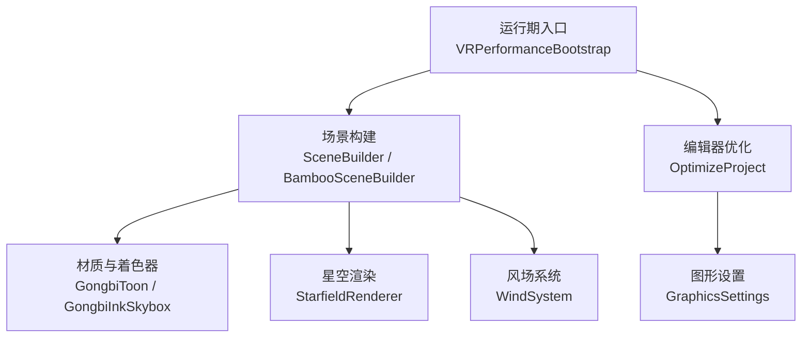
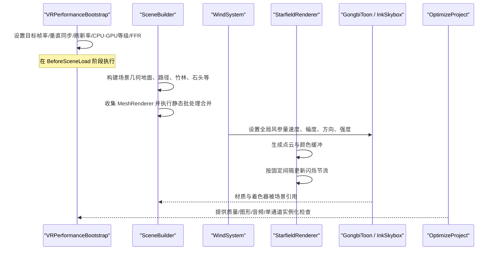
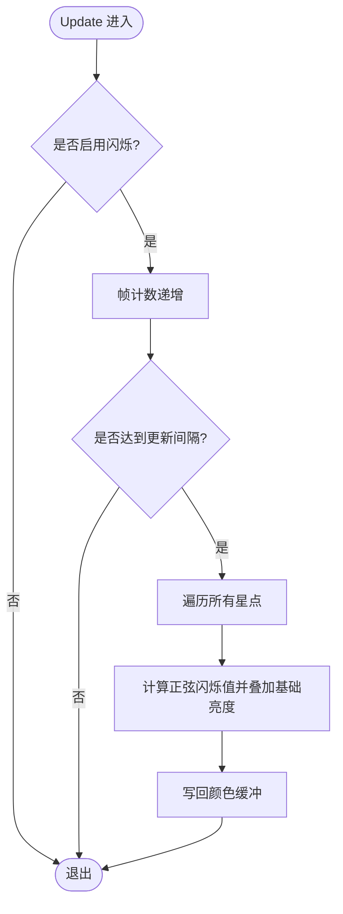
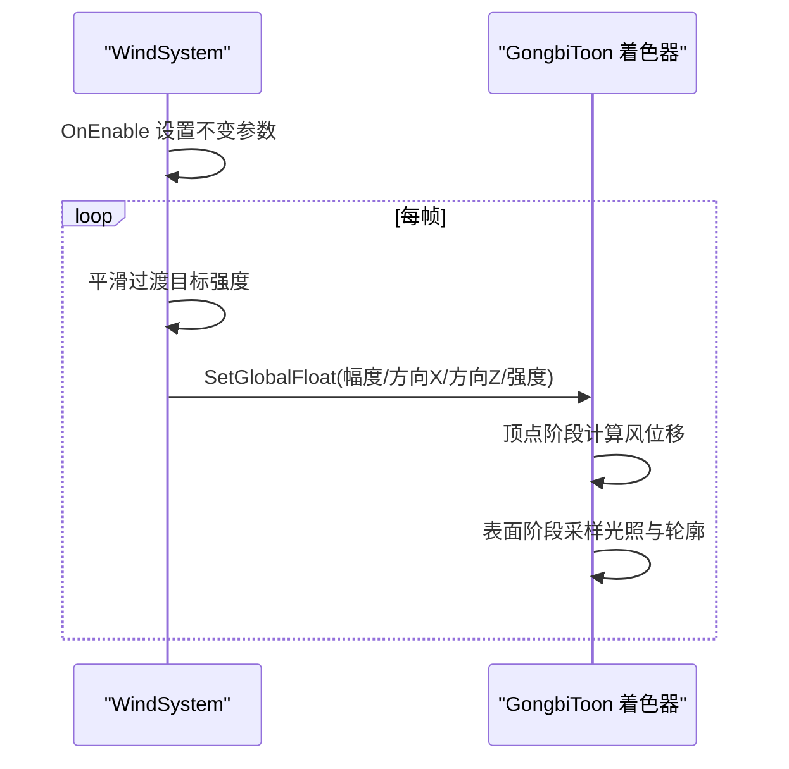
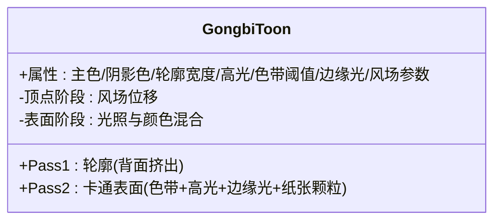
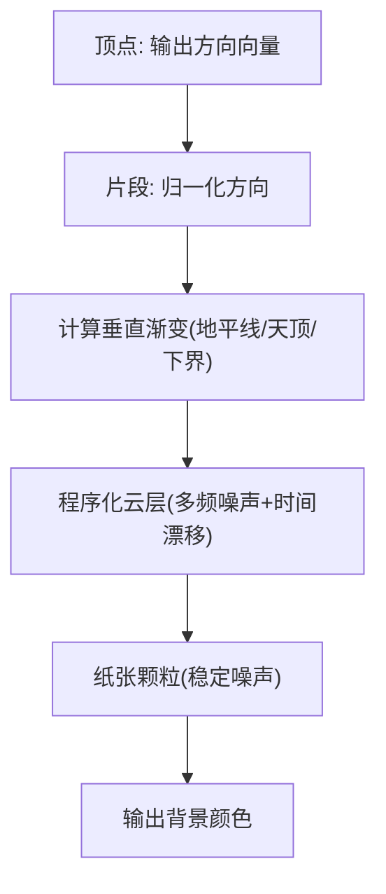
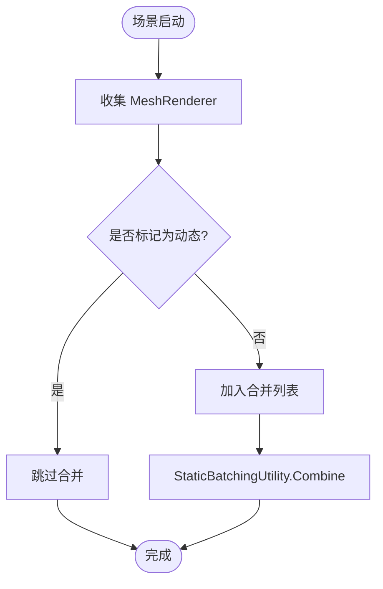
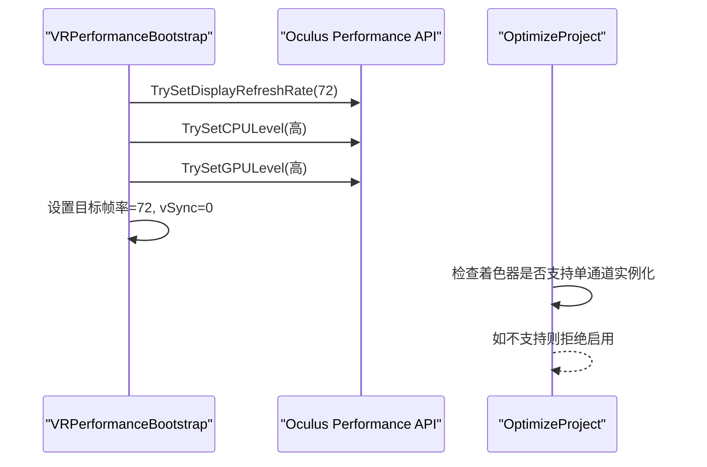
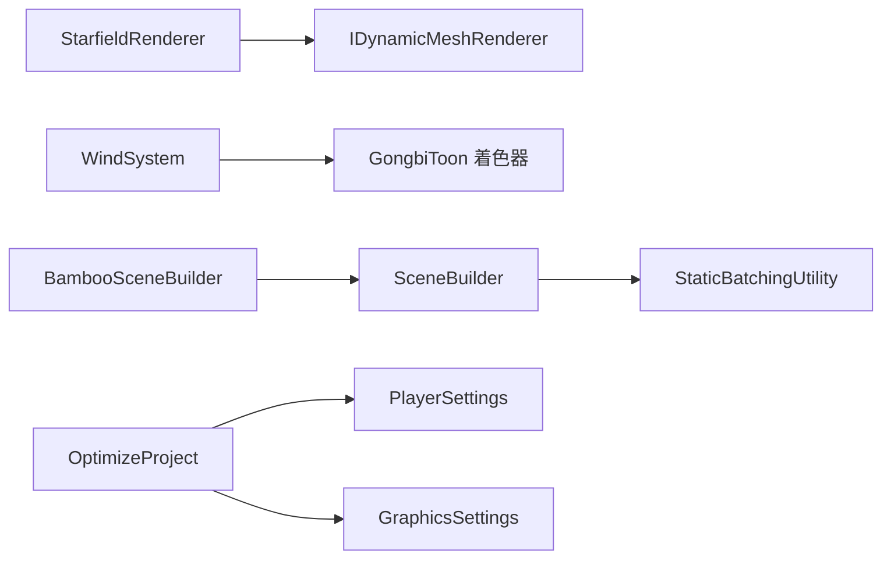

# 渲染优化

<cite>
**本文引用的文件**
- [StarfieldRenderer.cs](file://Assets/Scripts/Environment/StarfieldRenderer.cs)
- [VRPerformanceBootstrap.cs](file://Assets/Scripts/Core/VRPerformanceBootstrap.cs)
- [GongbiToon.shader](file://Assets/Shaders/GongbiToon.shader)
- [GongbiInkSkybox.shader](file://Assets/Shaders/GongbiInkSkybox.shader)
- [WindSystem.cs](file://Assets/Scripts/Environment/WindSystem.cs)
- [SceneBuilder.cs](file://Assets/Scripts/Environment/SceneBuilder.cs)
- [BambooSceneBuilder.cs](file://Assets/Scripts/Environment/BambooSceneBuilder.cs)
- [OptimizeProject.cs](file://Assets/Editor/OptimizeProject.cs)
- [GraphicsSettings.asset](file://ProjectSettings/GraphicsSettings.asset)
</cite>

## 目录
1. [简介](#简介)
2. [项目结构](#项目结构)
3. [核心组件](#核心组件)
4. [架构总览](#架构总览)
5. [详细组件分析](#详细组件分析)
6. [依赖关系分析](#依赖关系分析)
7. [性能考量](#性能考量)
8. [故障排查指南](#故障排查指南)
9. [结论](#结论)
10. [附录](#附录)

## 简介
本技术文档聚焦于 InkRidge 的渲染优化体系，围绕以下目标展开：
- 深入解析星空渲染器 StarfieldRenderer 的优化实现（点云生成、闪烁更新节流、顶点/颜色缓冲复用）。
- 说明移动 VR（Quest）平台的渲染限制与策略（刷新率、FFR、CPU/GPU 等级、单通道实例化立体渲染的准备）。
- 阐述工笔画风格渲染的特殊考虑（卡通着色、轮廓线、风场顶点位移、着色器复杂度控制）。
- 总结场景对象的批处理与实例化策略（静态批处理合并、动态对象排除、未来 GPU Instancing 路径）。
- 提供性能分析与调试方法，以及不同硬件级别的渲染质量分级建议。

## 项目结构
本项目采用 Unity 标准工程组织，渲染相关代码主要分布在：
- Scripts/Environment：场景构建与特效（星空、风场、场景生成器）
- Scripts/Core：运行时性能引导（VR 平台参数初始化）
- Shaders：自定义着色器（工笔卡通、水墨天空盒等）
- Editor：构建期优化脚本（质量、图形、音频、单通道实例化检查）
- ProjectSettings：图形管线与默认设置

图表来源
- [VRPerformanceBootstrap.cs:24-46](file://Assets/Scripts/Core/VRPerformanceBootstrap.cs#L24-L46)
- [SceneBuilder.cs:198-219](file://Assets/Scripts/Environment/SceneBuilder.cs#L198-L219)
- [GongbiToon.shader:24-30](file://Assets/Shaders/GongbiToon.shader#L24-L30)
- [GongbiInkSkybox.shader:18-22](file://Assets/Shaders/GongbiInkSkybox.shader#L18-L22)
- [OptimizeProject.cs:37-49](file://Assets/Editor/OptimizeProject.cs#L37-L49)

章节来源
- [VRPerformanceBootstrap.cs:24-46](file://Assets/Scripts/Core/VRPerformanceBootstrap.cs#L24-L46)
- [SceneBuilder.cs:198-219](file://Assets/Scripts/Environment/SceneBuilder.cs#L198-L219)
- [OptimizeProject.cs:37-49](file://Assets/Editor/OptimizeProject.cs#L37-L49)

## 核心组件
- 星空渲染器 StarfieldRenderer：使用点云与颜色缓冲实现高效星空；通过每帧节流更新闪烁，降低 CPU/VBO 带宽压力。
- 风场系统 WindSystem：集中管理全局风参量，减少每帧 Shader.SetGlobalFloat 调用次数，驱动植被顶点位移。
- 工笔卡通着色器 GongbiToon：两通道（轮廓 + 表面），包含风场顶点位移、色带明暗、边缘光、纸张纹理噪声；注释明确禁用 GPU Instancing 以兼容当前静态批处理方案。
- 水墨天空盒 GongbiInkSkybox：无纹理背景，三带渐变 + 程序化云层 + 纸张颗粒，单片段通道，开销低。
- 运行时性能引导 VRPerformanceBootstrap：在场景加载前设置目标帧率、垂直同步、显示刷新率、CPU/GPU 等级与 FFR。
- 编辑器优化 OptimizeProject：一键配置 Quest 3 质量、玩家设置、图形设置、音频压缩；并提供“启用单通道实例化”的检查入口。
- 场景构建 SceneBuilder/BambooSceneBuilder：运行时生成几何体，启动时执行静态批处理合并，标记动态 MeshRenderer 不参与合并。

章节来源
- [StarfieldRenderer.cs:35-63](file://Assets/Scripts/Environment/StarfieldRenderer.cs#L35-L63)
- [WindSystem.cs:34-63](file://Assets/Scripts/Environment/WindSystem.cs#L34-L63)
- [GongbiToon.shader:24-30](file://Assets/Shaders/GongbiToon.shader#L24-L30)
- [GongbiInkSkybox.shader:18-22](file://Assets/Shaders/GongbiInkSkybox.shader#L18-L22)
- [VRPerformanceBootstrap.cs:24-46](file://Assets/Scripts/Core/VRPerformanceBootstrap.cs#L24-L46)
- [OptimizeProject.cs:37-49](file://Assets/Editor/OptimizeProject.cs#L37-L49)
- [SceneBuilder.cs:198-219](file://Assets/Scripts/Environment/SceneBuilder.cs#L198-L219)

## 架构总览
下图展示从运行期初始化到渲染的关键路径：VR 平台参数先于场景加载设置；场景构建阶段生成几何并合并静态批次；风场与星空作为独立子系统参与渲染；编辑器工具用于统一配置与安全检查。

图表来源
- [VRPerformanceBootstrap.cs:24-46](file://Assets/Scripts/Core/VRPerformanceBootstrap.cs#L24-L46)
- [SceneBuilder.cs:198-219](file://Assets/Scripts/Environment/SceneBuilder.cs#L198-L219)
- [WindSystem.cs:34-63](file://Assets/Scripts/Environment/WindSystem.cs#L34-L63)
- [StarfieldRenderer.cs:35-63](file://Assets/Scripts/Environment/StarfieldRenderer.cs#L35-L63)
- [OptimizeProject.cs:37-49](file://Assets/Editor/OptimizeProject.cs#L37-L49)

## 详细组件分析

### 星空渲染器 StarfieldRenderer 优化
- 点云生成：使用 Fibonacci 球面分布均匀生成星点，避免聚簇；为每个星点记录基础亮度、相位、颜色。
- 闪烁节流：注释指出 VR 显示刷新率约 72Hz，逐帧更新颜色缓冲浪费带宽；采用每 5 帧更新一次，视觉等效且显著降低 CPU/VBO 写入。
- 内存与带宽：复用顶点数组与颜色数组，避免每帧分配；仅更新颜色缓冲，不重建网格。
- 绘制拓扑：使用 Points 拓扑，索引直接映射顶点，减少三角形数量与填充压力。

图表来源
- [StarfieldRenderer.cs:45-63](file://Assets/Scripts/Environment/StarfieldRenderer.cs#L45-L63)

章节来源
- [StarfieldRenderer.cs:35-63](file://Assets/Scripts/Environment/StarfieldRenderer.cs#L35-L63)

### 风场系统 WindSystem 与着色器联动
- 全局参数管理：将风的速度、幅度、湍流、方向、阵风密度、强度等设为全局浮点；仅在 OnEnable 中设置不变参数，Update 中只推送变化参数，减少每帧 SetGlobalFloat 次数。
- 着色器读取：GongbiToon 的顶点着色器与表面着色器均读取这些全局变量进行顶点位移与视觉效果；高度因子与时间相位共同决定摆动幅度。
- 性能权衡：风场位移在顶点阶段计算，避免额外 Pass；但需注意每实例差异与批处理的兼容性。

图表来源
- [WindSystem.cs:34-63](file://Assets/Scripts/Environment/WindSystem.cs#L34-L63)
- [GongbiToon.shader:68-88](file://Assets/Shaders/GongbiToon.shader#L68-L88)
- [GongbiToon.shader:168-183](file://Assets/Shaders/GongbiToon.shader#L168-L183)

章节来源
- [WindSystem.cs:34-63](file://Assets/Scripts/Environment/WindSystem.cs#L34-L63)
- [GongbiToon.shader:68-88](file://Assets/Shaders/GongbiToon.shader#L68-L88)
- [GongbiToon.shader:168-183](file://Assets/Shaders/GongbiToon.shader#L168-L183)

### 工笔画风格着色器 GongbiToon
- 双通道设计：第一通道绘制轮廓（背面挤出），第二通道进行卡通着色（色带阈值、高光、边缘光、纸张颗粒）。
- 性能注释：明确禁用 GPU Instancing，因为每材料风场参数与顶点位移会破坏批处理；项目依赖静态批处理减少 Draw Call。
- 着色复杂度控制：使用简单哈希函数实现每实例颜色抖动与纸张颗粒，避免昂贵纹理采样；色带与边缘光计算轻量。
- 风场集成：顶点阶段根据世界坐标高度与时间相位计算摆动，支持全局风强度与方向。

图表来源
- [GongbiToon.shader:24-30](file://Assets/Shaders/GongbiToon.shader#L24-L30)
- [GongbiToon.shader:31-96](file://Assets/Shaders/GongbiToon.shader#L31-L96)
- [GongbiToon.shader:98-204](file://Assets/Shaders/GongbiToon.shader#L98-L204)

章节来源
- [GongbiToon.shader:24-30](file://Assets/Shaders/GongbiToon.shader#L24-L30)
- [GongbiToon.shader:31-96](file://Assets/Shaders/GongbiToon.shader#L31-L96)
- [GongbiToon.shader:98-204](file://Assets/Shaders/GongbiToon.shader#L98-L204)

### 水墨天空盒 GongbiInkSkybox
- 无纹理背景：使用三带渐变（天顶/地平线/地平线下）+ 程序化云层 + 纸张颗粒，单片段通道，开销极低。
- 云层算法：2D 值噪声叠加多频，随时间漂移；在穹顶投影上靠近地平线处更宽，模拟远雾效果。
- 性能优势：无需纹理采样，适合移动端 VR；背景队列与剔除设置确保不影响前景渲染。

图表来源
- [GongbiInkSkybox.shader:50-57](file://Assets/Shaders/GongbiInkSkybox.shader#L50-L57)
- [GongbiInkSkybox.shader:78-85](file://Assets/Shaders/GongbiInkSkybox.shader#L78-L85)
- [GongbiInkSkybox.shader:92-121](file://Assets/Shaders/GongbiInkSkybox.shader#L92-L121)

章节来源
- [GongbiInkSkybox.shader:18-22](file://Assets/Shaders/GongbiInkSkybox.shader#L18-L22)
- [GongbiInkSkybox.shader:50-57](file://Assets/Shaders/GongbiInkSkybox.shader#L50-L57)
- [GongbiInkSkybox.shader:78-85](file://Assets/Shaders/GongbiInkSkybox.shader#L78-L85)
- [GongbiInkSkybox.shader:92-121](file://Assets/Shaders/GongbiInkSkybox.shader#L92-L121)

### 场景对象渲染优化：静态批处理与动态对象
- 静态批处理合并：SceneBuilder 在 Start 中收集 MeshRenderer，跳过标记为 IDynamicMeshRenderer 的对象，调用 StaticBatchingUtility.Combine 合并为单一批次，显著减少 Draw Call。
- 动态对象排除：StarfieldRenderer 实现 IDynamicMeshRenderer，因其每帧更新颜色缓冲，若被合并会导致后续实例写入无效。
- 运行时生成几何：BambooSceneBuilder 生成竹林、地面、路径、石头等，全部使用 GongbiToon 材质，便于批处理与着色一致性。

图表来源
- [SceneBuilder.cs:198-219](file://Assets/Scripts/Environment/SceneBuilder.cs#L198-L219)
- [StarfieldRenderer.cs:11-12](file://Assets/Scripts/Environment/StarfieldRenderer.cs#L11-L12)

章节来源
- [SceneBuilder.cs:198-219](file://Assets/Scripts/Environment/SceneBuilder.cs#L198-L219)
- [BambooSceneBuilder.cs:17-37](file://Assets/Scripts/Environment/BambooSceneBuilder.cs#L17-L37)

### 移动 VR 平台渲染限制与优化策略
- 刷新率与帧率：VRPerformanceBootstrap 设置目标帧率 72，关闭垂直同步，由 VR 合成器控制节奏；尝试设置显示刷新率为 72Hz。
- 设备性能等级：设置 CPU/GPU 等级为中高档，平衡性能与功耗。
- 注视点渲染（FFR）：优先使用 OVRPlugin 控制的 FFR；若不可用则跳过以避免警告。
- 单通道实例化立体渲染：OptimizeProject 提供检查入口，要求所有着色器声明立体宏；当前 Gongbi 着色器未声明，故暂不启用，避免立体错误。
- 图形设置：默认移动端渲染路径开启，保留必要着色器不被剥离。

图表来源
- [VRPerformanceBootstrap.cs:24-46](file://Assets/Scripts/Core/VRPerformanceBootstrap.cs#L24-L46)
- [OptimizeProject.cs:188-243](file://Assets/Editor/OptimizeProject.cs#L188-L243)

章节来源
- [VRPerformanceBootstrap.cs:24-46](file://Assets/Scripts/Core/VRPerformanceBootstrap.cs#L24-L46)
- [OptimizeProject.cs:188-243](file://Assets/Editor/OptimizeProject.cs#L188-L243)

## 依赖关系分析
- StarfieldRenderer 依赖 Unity 的 Mesh/MeshFilter/MeshRenderer；实现 IDynamicMeshRenderer 接口以排除静态批处理。
- WindSystem 通过 Shader.PropertyToID 缓存全局变量 ID，减少字符串查找开销；向 GongbiToon 等着色器提供风场参数。
- SceneBuilder 依赖 StaticBatchingUtility 进行批处理合并；BambooSceneBuilder 扩展场景构建逻辑。
- OptimizeProject 依赖 Unity Editor API 与 PlayerSettings/GraphicsSettings 进行构建期配置。
- GraphicsSettings 指定默认移动端渲染路径与着色器保留策略。

图表来源
- [StarfieldRenderer.cs:11-12](file://Assets/Scripts/Environment/StarfieldRenderer.cs#L11-L12)
- [WindSystem.cs:26-32](file://Assets/Scripts/Environment/WindSystem.cs#L26-L32)
- [SceneBuilder.cs:198-219](file://Assets/Scripts/Environment/SceneBuilder.cs#L198-L219)
- [OptimizeProject.cs:142-176](file://Assets/Editor/OptimizeProject.cs#L142-L176)
- [GraphicsSettings.asset:43-45](file://ProjectSettings/GraphicsSettings.asset#L43-L45)

章节来源
- [StarfieldRenderer.cs:11-12](file://Assets/Scripts/Environment/StarfieldRenderer.cs#L11-L12)
- [WindSystem.cs:26-32](file://Assets/Scripts/Environment/WindSystem.cs#L26-L32)
- [SceneBuilder.cs:198-219](file://Assets/Scripts/Environment/SceneBuilder.cs#L198-L219)
- [OptimizeProject.cs:142-176](file://Assets/Editor/OptimizeProject.cs#L142-L176)
- [GraphicsSettings.asset:43-45](file://ProjectSettings/GraphicsSettings.asset#L43-L45)

## 性能考量
- Draw Call 减少：
  - 静态批处理合并：SceneBuilder 在运行时合并静态 MeshRenderer，显著降低 Draw Call。
  - 星空点云：Points 拓扑减少三角形数量；闪烁节流降低颜色缓冲写入频率。
  - 天空盒无纹理：GongbiInkSkybox 使用程序化噪声，避免纹理采样开销。
- 纹理内存管理：
  - 天空盒与卡通着色器尽量使用程序化噪声与哈希函数替代纹理，降低显存占用。
  - 编辑器优化脚本对音频进行压缩与流式加载，减少内存峰值。
- 着色器复杂度控制：
  - 风场位移在顶点阶段计算，避免额外 Pass。
  - 色带与边缘光使用简单数学运算，保持低复杂度。
  - 禁用 GPU Instancing 以兼容当前静态批处理；未来可逐步引入立体宏以启用单通道实例化。
- VR 平台优化：
  - 目标帧率与刷新率锁定，关闭垂直同步，由合成器控制节奏。
  - 设置 CPU/GPU 等级与 FFR，平衡性能与画质。
  - 单通道实例化需着色器适配后方可启用。

[本节为通用性能讨论，不直接分析具体文件]

## 故障排查指南
- 星空闪烁异常或闪烁过快：
  - 检查 StarfieldRenderer 的闪烁更新间隔与节流逻辑；确认颜色缓冲正确写回。
  - 参考实现路径：[StarfieldRenderer.cs:45-63](file://Assets/Scripts/Environment/StarfieldRenderer.cs#L45-L63)
- 风场无效或着色器无响应：
  - 确认 WindSystem 已启用并设置全局参数；检查着色器是否正确读取全局变量。
  - 参考实现路径：[WindSystem.cs:34-63](file://Assets/Scripts/Environment/WindSystem.cs#L34-L63)、[GongbiToon.shader:68-88](file://Assets/Shaders/GongbiToon.shader#L68-L88)
- 静态批处理未生效：
  - 确认动态对象已标记 IDynamicMeshRenderer；检查合并前的对象列表。
  - 参考实现路径：[SceneBuilder.cs:198-219](file://Assets/Scripts/Environment/SceneBuilder.cs#L198-L219)
- 单通道实例化无法启用：
  - 使用编辑器菜单检查着色器是否声明立体宏；如缺失，需添加 UNITY_VERTEX_INPUT_INSTANCE_ID 等宏。
  - 参考实现路径：[OptimizeProject.cs:188-243](file://Assets/Editor/OptimizeProject.cs#L188-L243)
- 构建后着色器丢失：
  - 使用 OptimizeProject 的“Always-included shaders”功能注册必需着色器，防止剥离。
  - 参考实现路径：[OptimizeProject.cs:257-292](file://Assets/Editor/OptimizeProject.cs#L257-L292)

章节来源
- [StarfieldRenderer.cs:45-63](file://Assets/Scripts/Environment/StarfieldRenderer.cs#L45-L63)
- [WindSystem.cs:34-63](file://Assets/Scripts/Environment/WindSystem.cs#L34-L63)
- [GongbiToon.shader:68-88](file://Assets/Shaders/GongbiToon.shader#L68-L88)
- [SceneBuilder.cs:198-219](file://Assets/Scripts/Environment/SceneBuilder.cs#L198-L219)
- [OptimizeProject.cs:188-243](file://Assets/Editor/OptimizeProject.cs#L188-L243)
- [OptimizeProject.cs:257-292](file://Assets/Editor/OptimizeProject.cs#L257-L292)

## 结论
InkRidge 的渲染优化体系围绕移动 VR 平台特性与工笔画艺术风格展开：
- 星空渲染通过点云与闪烁节流实现高效表现。
- 风场系统与着色器紧密耦合，顶点阶段位移降低复杂度。
- 静态批处理是当前 Draw Call 优化的核心手段；GPU Instancing 需在着色器适配后启用。
- 编辑器工具提供一键配置与安全校验，保障构建一致性与稳定性。
- 针对不同硬件级别，可通过质量设置、FFR、MSAA、LOD 等参数灵活调整渲染质量。

[本节为总结性内容，不直接分析具体文件]

## 附录
- 渲染质量分级建议：
  - 低端设备：关闭软粒子、降低 MSAA、禁用实时反射探针、降低 LOD Bias。
  - 中端设备：启用 2x MSAA、各向异性过滤、适度风场强度。
  - 高端设备：提升 MSAA 至 4x、增加风场细节、启用更高 FFR 等级。
- 性能分析工具：
  - Unity Profiler：监控 Draw Call、顶点/像素着色器耗时、内存分配。
  - Frame Debugger：检查渲染通道与着色器执行顺序。
  - 设备性能 API：查询 Oculus Performance 状态，验证 FFR 与刷新率设置。

[本节为通用指导，不直接分析具体文件]