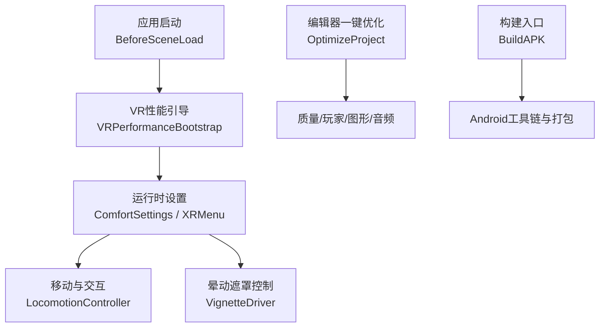
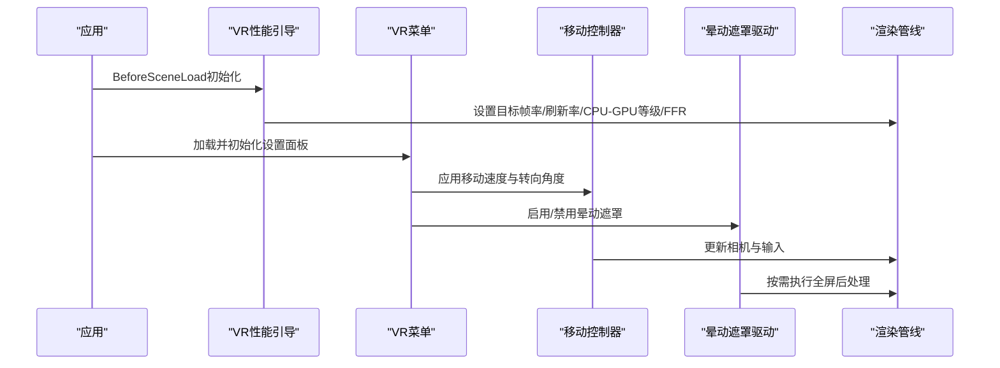
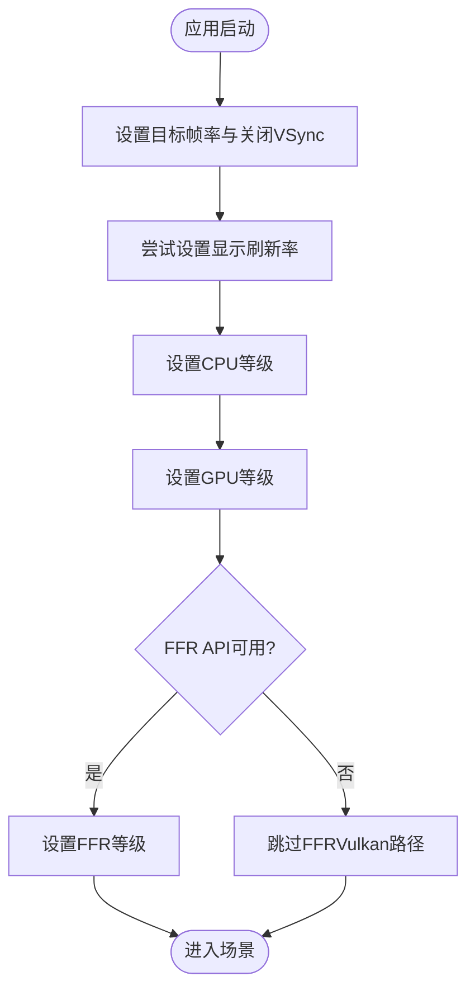
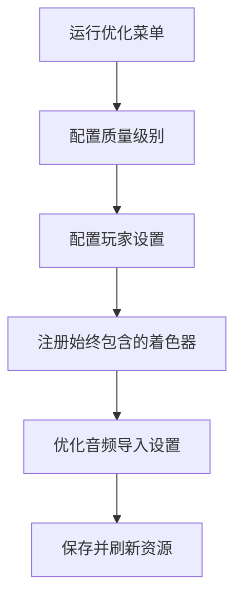
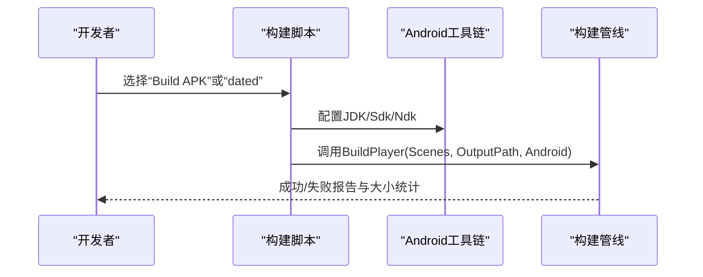
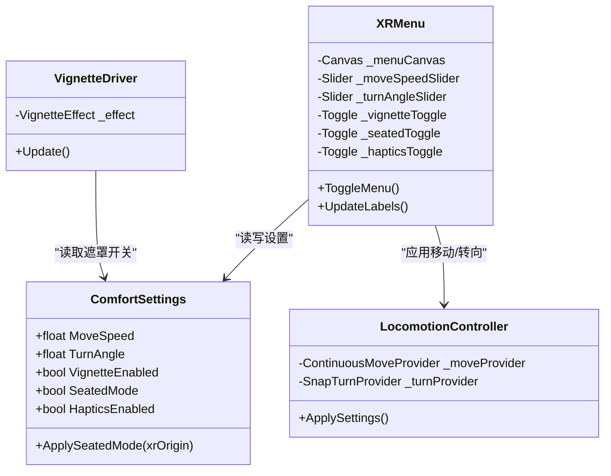
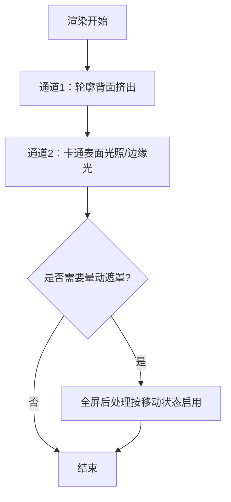
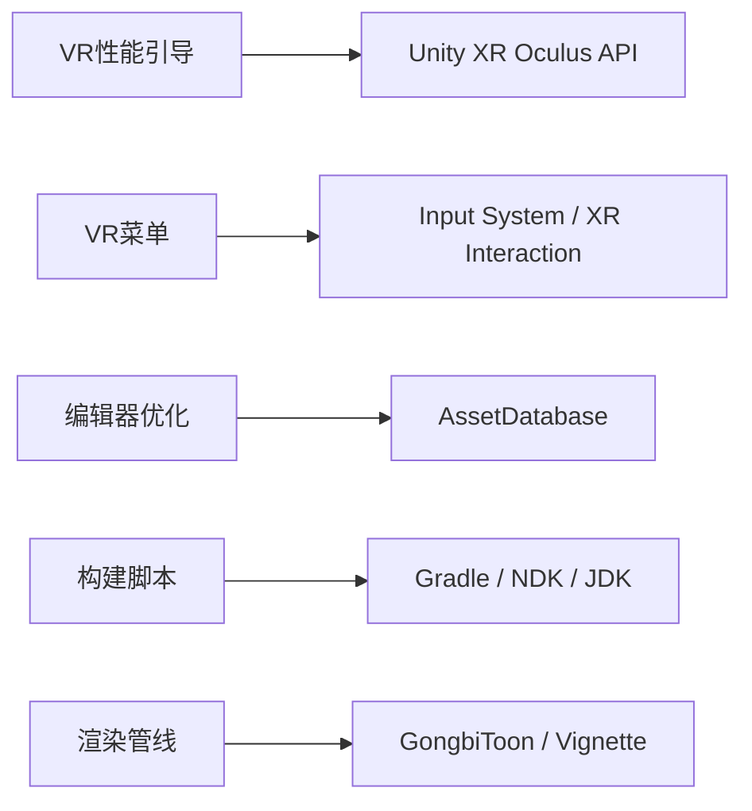

# 移动VR优化

<cite>
**本文引用的文件**
- [VRPerformanceBootstrap.cs](file://Assets/Scripts/Core/VRPerformanceBootstrap.cs)
- [ComfortSettings.cs](file://Assets/Scripts/Core/ComfortSettings.cs)
- [VignetteDriver.cs](file://Assets/Scripts/Core/VignetteDriver.cs)
- [LocomotionController.cs](file://Assets/Scripts/Movement/LocomotionController.cs)
- [XRMenu.cs](file://Assets/Scripts/UI/XRMenu.cs)
- [OptimizeProject.cs](file://Assets/Editor/OptimizeProject.cs)
- [BuildAPK.cs](file://Assets/Editor/BuildAPK.cs)
- [OculusSettings.asset](file://Assets/XR/Settings/OculusSettings.asset)
- [OpenXR Package Settings.asset](file://Assets/XR/Settings/OpenXR Package Settings.asset)
- [GraphicsSettings.asset](file://ProjectSettings/GraphicsSettings.asset)
- [QualitySettings.asset](file://ProjectSettings/QualitySettings.asset)
- [GongbiToon.shader](file://Assets/Shaders/GongbiToon.shader)
</cite>

## 目录
1. [简介](#简介)
2. [项目结构](#项目结构)
3. [核心组件](#核心组件)
4. [架构总览](#架构总览)
5. [详细组件分析](#详细组件分析)
6. [依赖关系分析](#依赖关系分析)
7. [性能考量](#性能考量)
8. [故障排除指南](#故障排除指南)
9. [结论](#结论)
10. [附录](#附录)

## 简介
本指南面向在Meta Quest 3平台上为InkRidge进行移动VR优化的工程师与制作人。内容涵盖：
- Quest 3平台的热管理、电池续航与用户体验平衡策略
- 性能瓶颈识别与解决方案（CPU/GPU负载分配、内存使用、渲染管线）
- 多设备兼容性优化（Oculus、PICO等平台的设置差异）
- 舒适度与性能的权衡（帧率稳定性、输入延迟、视觉质量）
- 性能监控工具与基准测试流程
- 针对不同设备配置的优化建议与排错方法

## 项目结构
本项目围绕“运行时性能引导 + 编辑器一键优化 + 运行时舒适性与交互”的三层结构组织：
- 运行时性能引导：应用启动前自动配置刷新率、CPU/GPU等级与FFR，确保首帧即进入稳定状态
- 编辑器一键优化：一键配置质量、玩家设置、图形与音频，保证构建产物一致且可重复
- 运行时舒适性与交互：通过菜单与设置持久化，动态调整移动速度、转向角度、晕动遮罩与坐姿模式

图表来源
- [VRPerformanceBootstrap.cs:24-45](file://Assets/Scripts/Core/VRPerformanceBootstrap.cs#L24-L45)
- [OptimizeProject.cs:37-49](file://Assets/Editor/OptimizeProject.cs#L37-L49)
- [BuildAPK.cs:35-62](file://Assets/Editor/BuildAPK.cs#L35-L62)

章节来源
- [VRPerformanceBootstrap.cs:1-49](file://Assets/Scripts/Core/VRPerformanceBootstrap.cs#L1-L49)
- [OptimizeProject.cs:1-335](file://Assets/Editor/OptimizeProject.cs#L1-L335)
- [BuildAPK.cs:1-118](file://Assets/Editor/BuildAPK.cs#L1-L118)

## 核心组件
- VR性能引导：在场景加载前统一设定目标帧率、垂直同步关闭、显示刷新率、CPU/GPU等级与固定焦点渲染（FFR），避免首帧抖动与热节流影响
- 编辑器优化脚本：集中配置质量级别、玩家设置、图形设置与音频压缩，确保Quest 3构建的一致性与可重复性
- 构建脚本：自动化Android工具链配置与APK输出，支持稳定命名与带时间戳归档
- 舒适性与交互：提供VR内菜单与持久化设置，动态调整移动速度、转向角度、晕动遮罩与坐姿模式，提升用户舒适度
- 渲染与着色器：针对双通道卡通渲染（轮廓+表面）进行移动端优化，配合MSAA与单通道批处理降低开销

章节来源
- [VRPerformanceBootstrap.cs:1-49](file://Assets/Scripts/Core/VRPerformanceBootstrap.cs#L1-L49)
- [OptimizeProject.cs:51-176](file://Assets/Editor/OptimizeProject.cs#L51-L176)
- [BuildAPK.cs:45-103](file://Assets/Editor/BuildAPK.cs#L45-L103)
- [ComfortSettings.cs:1-81](file://Assets/Scripts/Core/ComfortSettings.cs#L1-L81)
- [XRMenu.cs:1-172](file://Assets/Scripts/UI/XRMenu.cs#L1-L172)
- [GongbiToon.shader:1-200](file://Assets/Shaders/GongbiToon.shader#L1-L200)

## 架构总览
下图展示了从应用启动到渲染输出的关键路径，包括性能引导、设置应用、移动与遮罩控制，以及编辑器与构建流程对运行时的影响。

图表来源
- [VRPerformanceBootstrap.cs:24-45](file://Assets/Scripts/Core/VRPerformanceBootstrap.cs#L24-L45)
- [XRMenu.cs:41-88](file://Assets/Scripts/UI/XRMenu.cs#L41-L88)
- [LocomotionController.cs:26-48](file://Assets/Scripts/Movement/LocomotionController.cs#L26-L48)
- [VignetteDriver.cs:32-59](file://Assets/Scripts/Core/VignetteDriver.cs#L32-L59)

## 详细组件分析

### VR性能引导（Quest 3运行时）
- 目标帧率与VSync：锁定目标帧率并关闭VSync，由VR合成器负责时序，避免锁帧导致的输入延迟
- 显示刷新率：优先尝试设置稳定的刷新率，减少热节流带来的波动
- CPU/GPU等级：选择中等偏高的等级以兼顾功耗与性能
- 固定焦点渲染（FFR）：根据运行时API可用性选择TiledMultiRes或OVRPlugin路径，避免Vulkan合成器下的警告与无效调用

图表来源
- [VRPerformanceBootstrap.cs:24-45](file://Assets/Scripts/Core/VRPerformanceBootstrap.cs#L24-L45)

章节来源
- [VRPerformanceBootstrap.cs:1-49](file://Assets/Scripts/Core/VRPerformanceBootstrap.cs#L1-L49)

### 编辑器一键优化（Quest 3构建配置）
- 质量级别：关闭阴影、限制像素灯数量、低分辨率阴影、关闭级联、开启各向异性过滤、适度抗锯齿（2x MSAA）、关闭软粒子与实时反射探针
- 玩家设置：ARM64、IL2CPP Release、最小SDK版本、禁用swapchain blit、启用优化帧时序、标记为游戏模式、剔除引擎代码与未用网格组件
- 图形设置：将项目所需的自定义着色器加入“始终包含”，防止构建剥离导致运行时材质回退错误
- 音频优化：环境音流式加载，短音效预解压；Vorbis压缩与适中音质，降低内存占用与解码卡顿

图表来源
- [OptimizeProject.cs:37-49](file://Assets/Editor/OptimizeProject.cs#L37-L49)
- [OptimizeProject.cs:51-176](file://Assets/Editor/OptimizeProject.cs#L51-L176)
- [OptimizeProject.cs:257-292](file://Assets/Editor/OptimizeProject.cs#L257-L292)
- [OptimizeProject.cs:296-333](file://Assets/Editor/OptimizeProject.cs#L296-L333)

章节来源
- [OptimizeProject.cs:1-335](file://Assets/Editor/OptimizeProject.cs#L1-L335)

### 构建入口（Android/APK）
- 工具链配置：自动定位JDK/Sdk/Ndk，切换Android目标与Gradle构建系统
- 输出管理：稳定文件名用于日常调试，带时间戳文件名用于归档对比
- 构建选项：ARM64、IL2CPP、Strip Engine Code等，确保发布包体积与性能

图表来源
- [BuildAPK.cs:35-62](file://Assets/Editor/BuildAPK.cs#L35-L62)
- [BuildAPK.cs:73-103](file://Assets/Editor/BuildAPK.cs#L73-L103)

章节来源
- [BuildAPK.cs:1-118](file://Assets/Editor/BuildAPK.cs#L1-L118)

### 舒适性与交互（VR内菜单与设置）
- 设置持久化：移动速度、转向角度、晕动遮罩、坐姿模式、触觉反馈均通过PlayerPrefs持久化，并在每次修改时立即写入磁盘，避免后台杀进程导致设置丢失
- 坐姿模式：动态调整XR Origin高度，适配坐站两种体验
- 移动与转向：读取设置应用到ContinuousMoveProvider与SnapTurnProvider，保持流畅移动与可控视角旋转
- 晕动遮罩：基于相机位移速度判断是否处于移动状态，仅在需要时启用全屏后处理，减少不必要的渲染开销

图表来源
- [ComfortSettings.cs:1-81](file://Assets/Scripts/Core/ComfortSettings.cs#L1-L81)
- [XRMenu.cs:1-172](file://Assets/Scripts/UI/XRMenu.cs#L1-L172)
- [LocomotionController.cs:1-72](file://Assets/Scripts/Movement/LocomotionController.cs#L1-L72)
- [VignetteDriver.cs:1-62](file://Assets/Scripts/Core/VignetteDriver.cs#L1-L62)

章节来源
- [ComfortSettings.cs:1-81](file://Assets/Scripts/Core/ComfortSettings.cs#L1-L81)
- [XRMenu.cs:1-172](file://Assets/Scripts/UI/XRMenu.cs#L1-L172)
- [LocomotionController.cs:1-72](file://Assets/Scripts/Movement/LocomotionController.cs#L1-L72)
- [VignetteDriver.cs:1-62](file://Assets/Scripts/Core/VignetteDriver.cs#L1-L62)

### 渲染管线与着色器优化
- 双通道卡通渲染：第一通道绘制轮廓（背面挤出），第二通道进行色块化光照与边缘光，适合移动端但需控制开销
- 抗锯齿：采用2x MSAA，在VR中有效抑制墨线走样，若帧预算允许可考虑4x
- 单通道实例化立体渲染：当前着色器尚未声明立体宏，启用会破坏立体效果；待着色器升级后可显著减少遍历与提交次数
- 始终包含着色器：通过编辑器脚本将项目所需着色器加入“Always Included”，避免构建剥离导致材质回退错误

图表来源
- [GongbiToon.shader:24-101](file://Assets/Shaders/GongbiToon.shader#L24-L101)
- [GongbiToon.shader:98-200](file://Assets/Shaders/GongbiToon.shader#L98-L200)
- [VignetteDriver.cs:32-59](file://Assets/Scripts/Core/VignetteDriver.cs#L32-L59)
- [OptimizeProject.cs:257-292](file://Assets/Editor/OptimizeProject.cs#L257-L292)

章节来源
- [GongbiToon.shader:1-200](file://Assets/Shaders/GongbiToon.shader#L1-L200)
- [OptimizeProject.cs:257-292](file://Assets/Editor/OptimizeProject.cs#L257-L292)
- [VignetteDriver.cs:1-62](file://Assets/Scripts/Core/VignetteDriver.cs#L1-L62)

## 依赖关系分析
- 运行时依赖：VR性能引导依赖Unity XR Oculus API；舒适性与交互依赖Input System与XR Interaction Toolkit
- 编辑器依赖：OptimizeProject依赖Unity Editor API与AssetDatabase；BuildAPK依赖Android工具链与Gradle
- 渲染依赖：GongbiToon着色器依赖Unity内置CG/HLSL与WindSystem全局参数；VignetteDriver依赖VignetteEffect后处理

图表来源
- [VRPerformanceBootstrap.cs:1-49](file://Assets/Scripts/Core/VRPerformanceBootstrap.cs#L1-L49)
- [XRMenu.cs:1-172](file://Assets/Scripts/UI/XRMenu.cs#L1-L172)
- [OptimizeProject.cs:1-335](file://Assets/Editor/OptimizeProject.cs#L1-L335)
- [BuildAPK.cs:1-118](file://Assets/Editor/BuildAPK.cs#L1-L118)
- [GongbiToon.shader:1-200](file://Assets/Shaders/GongbiToon.shader#L1-L200)

章节来源
- [VRPerformanceBootstrap.cs:1-49](file://Assets/Scripts/Core/VRPerformanceBootstrap.cs#L1-L49)
- [XRMenu.cs:1-172](file://Assets/Scripts/UI/XRMenu.cs#L1-L172)
- [OptimizeProject.cs:1-335](file://Assets/Editor/OptimizeProject.cs#L1-L335)
- [BuildAPK.cs:1-118](file://Assets/Editor/BuildAPK.cs#L1-L118)
- [GongbiToon.shader:1-200](file://Assets/Shaders/GongbiToon.shader#L1-L200)

## 性能考量
- 热管理与电池续航
  - 目标刷新率与帧率：锁定72Hz与目标帧率，避免频繁升降频造成发热与掉帧
  - CPU/GPU等级：选择中等偏高，平衡功耗与性能，减少长时间高负载导致的降频
  - FFR：启用固定焦点渲染以降低周边像素渲染成本，提高整体能效
- 性能瓶颈识别
  - 渲染：双通道卡通渲染开销较大，优先通过MSAA与静态批处理降低；待着色器升级后可启用单通道实例化立体渲染
  - 音频：环境音流式加载，短音效预解压，避免内存峰值与解码卡顿
  - 设置持久化：每次修改立即写入磁盘，避免后台杀进程导致设置丢失，同时注意频繁I/O的影响
- 舒适度与性能权衡
  - 帧率稳定性优先于极致画质：关闭VSync，交由VR合成器管理时序，减少输入延迟
  - 晕动遮罩：仅在移动时启用，降低非必要的后处理开销
  - 移动与转向：可调速度与角度，帮助不同用户找到舒适区间

[本节为通用指导，不直接分析具体文件]

## 故障排除指南
- 构建失败或工具链问题
  - 检查JDK/Sdk/Ndk路径是否正确配置，必要时重新运行构建脚本以自动修复
  - 确认Android目标为ARM64，并使用IL2CPP Release构建
- 材质回退为错误材质（品红色）
  - 确认已运行“Optimize Project for Quest 3”，将所需着色器加入“始终包含”
  - 若启用单通道实例化立体渲染，需确保所有着色器声明了立体宏，否则会破坏立体效果
- 设置不生效或重启后恢复默认
  - 确认每次修改设置后立即写入磁盘（PlayerPrefs.Save），避免被系统后台杀进程覆盖
- 晕动遮罩不触发
  - 检查VignetteDriver是否挂载在相机上，并确保有对应的VignetteEffect组件
  - 确认移动阈值合理，避免静止时被误判为移动

章节来源
- [BuildAPK.cs:73-103](file://Assets/Editor/BuildAPK.cs#L73-L103)
- [OptimizeProject.cs:257-292](file://Assets/Editor/OptimizeProject.cs#L257-L292)
- [OptimizeProject.cs:204-243](file://Assets/Editor/OptimizeProject.cs#L204-L243)
- [ComfortSettings.cs:22-35](file://Assets/Scripts/Core/ComfortSettings.cs#L22-L35)
- [VignetteDriver.cs:32-59](file://Assets/Scripts/Core/VignetteDriver.cs#L32-L59)

## 结论
InkRidge的移动VR优化围绕“启动即稳、构建一致、体验友好”的目标展开。通过运行时性能引导、编辑器一键优化与灵活的舒适性与交互设置，项目在Quest 3上实现了稳定的帧率与良好的用户体验。后续可通过着色器升级启用单通道实例化立体渲染，进一步提升渲染效率；同时持续监控热表现与电池消耗，在不同设备上微调参数以达到最佳平衡。

[本节为总结，不直接分析具体文件]

## 附录

### 多设备兼容性优化策略（Oculus、PICO等）
- Oculus（Quest系列）
  - 使用Oculus Loader与Oculus Settings，启用TargetQuest3，关闭SpaceWarp，启用PhaseSync与SymmetricProjection
  - 运行时通过VR性能引导设置刷新率与CPU/GPU等级，并根据API可用性选择FFR路径
- OpenXR（跨平台）
  - 启用Meta Quest Support特性，目标设备包含Quest/Quest2/QuestPro/Quest3/Quest3S
  - 注意OpenXR与Oculus原生设置的优先级与冲突，建议在目标设备上分别验证
- PICO与其他头显
  - 优先使用OpenXR作为统一接口，确保控制器映射与交互层正确
  - 若存在特定厂商扩展，需在运行时检测并降级功能以保证兼容

章节来源
- [OculusSettings.asset:15-37](file://Assets/XR/Settings/OculusSettings.asset#L15-L37)
- [OpenXR Package Settings.asset:250-551](file://Assets/XR/Settings/OpenXR Package Settings.asset#L250-L551)

### 性能监控与基准测试流程
- 运行时监控
  - 使用Unity Profiler与Frame Debugger观察每帧耗时、DrawCall、Shader编译与内存峰值
  - 关注VR合成器时序与丢帧情况，结合目标帧率与刷新率进行分析
- 基准测试
  - 固定场景与光照条件，记录平均帧率、最低帧率、首帧时间与内存占用
  - 对比不同质量设置与FFR等级对性能与画质的影响
  - 使用带时间戳的APK进行版本回归测试，确保优化不会引入性能退化

[本节为通用指导，不直接分析具体文件]

### 不同设备配置的优化建议
- 低端设备
  - 降低MSAA至2x或关闭，减少阴影与粒子复杂度，关闭软粒子与实时反射探针
  - 降低FFR等级或关闭，优先保证中心视野清晰度
- 中高端设备
  - 可尝试4x MSAA与更高FFR等级，提升画面质量
  - 启用单通道实例化立体渲染（需着色器升级），显著减少渲染开销
- 热敏感设备
  - 降低目标刷新率与CPU/GPU等级，延长续航并减少降频
  - 关闭非必要后处理（如晕动遮罩在非移动时）

[本节为通用指导，不直接分析具体文件]