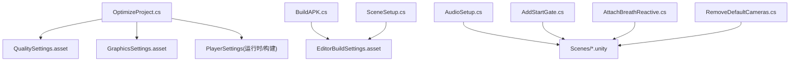
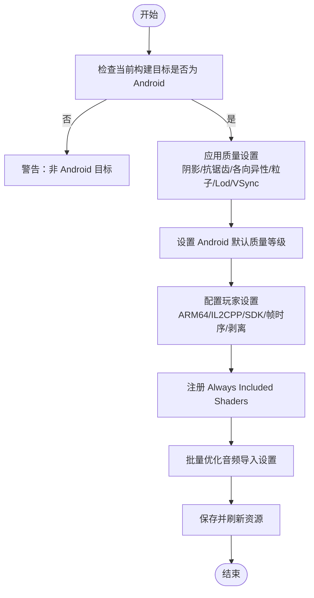
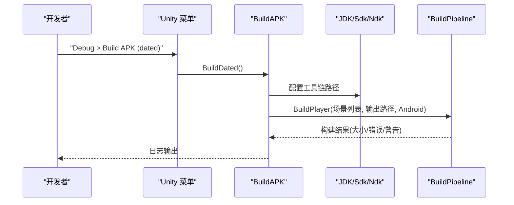
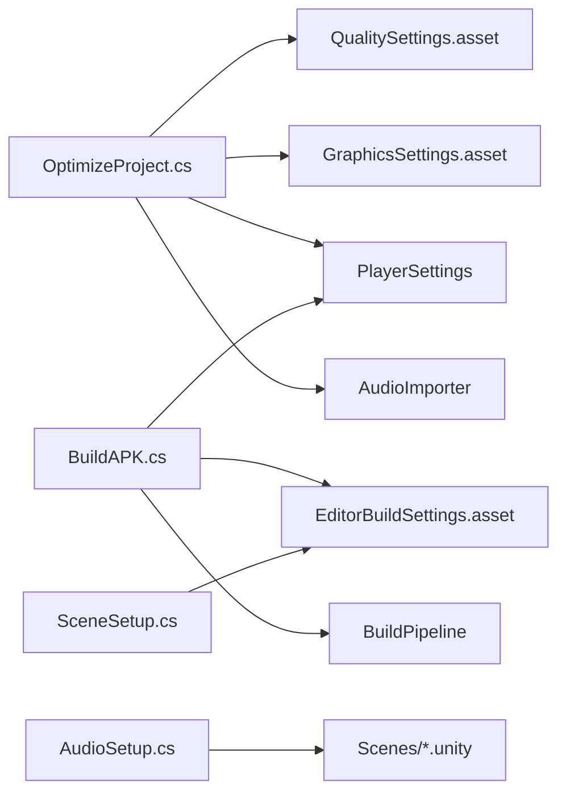

# 编辑器优化脚本

<cite>
**本文引用的文件**
- [OptimizeProject.cs](file://Assets/Editor/OptimizeProject.cs)
- [BuildAPK.cs](file://Assets/Editor/BuildAPK.cs)
- [SceneSetup.cs](file://Assets/Editor/SceneSetup.cs)
- [AudioSetup.cs](file://Assets/Editor/AudioSetup.cs)
- [AddStartGate.cs](file://Assets/Editor/AddStartGate.cs)
- [AttachBreathReactive.cs](file://Assets/Editor/AttachBreathReactive.cs)
- [RemoveDefaultCameras.cs](file://Assets/Editor/RemoveDefaultCameras.cs)
- [SetAndroidPaths.cs](file://Assets/Editor/SetAndroidPaths.cs)
- [SetPrefs.cs](file://Assets/Editor/SetPrefs.cs)
- [QualitySettings.asset](file://ProjectSettings/QualitySettings.asset)
- [GraphicsSettings.asset](file://ProjectSettings/GraphicsSettings.asset)
- [EditorBuildSettings.asset](file://ProjectSettings/EditorBuildSettings.asset)
</cite>

## 目录
1. [简介](#简介)
2. [项目结构](#项目结构)
3. [核心组件](#核心组件)
4. [架构总览](#架构总览)
5. [详细组件分析](#详细组件分析)
6. [依赖关系分析](#依赖关系分析)
7. [性能考量](#性能考量)
8. [故障排除指南](#故障排除指南)
9. [结论](#结论)
10. [附录](#附录)

## 简介
本技术文档聚焦于 InkRidge 的 Unity 编辑器扩展与构建期自动化脚本，重点解释 OptimizeProject 的批量优化能力（质量设置、玩家设置、图形与音频），并给出跨平台（Android/iOS/PC）优化策略、自定义规则开发指南、性能基准测试方法与编辑器集成最佳实践。文档同时覆盖构建前自动化检查流程与质量保证措施，帮助团队在 Quest 3 等移动 VR 平台上稳定交付高质量产物。

## 项目结构
InkRidge 将编辑器工具集中放置在 Assets/Editor 下，按职责划分：
- 项目级优化：OptimizeProject.cs（一键应用 Quest 3 配置）
- 构建流水线：BuildAPK.cs（Android APK 构建入口）
- 场景初始化：SceneSetup.cs（批量创建/配置场景）
- 音频装配：AudioSetup.cs（为各场景注入音频源）
- 场景辅助：AddStartGate.cs、AttachBreathReactive.cs、RemoveDefaultCameras.cs
- 环境路径：SetAndroidPaths.cs、SetPrefs.cs（快速设置 Android SDK/JDK/NDK）



图表来源
- [OptimizeProject.cs:37-49](file://Assets/Editor/OptimizeProject.cs#L37-L49)
- [BuildAPK.cs:35-62](file://Assets/Editor/BuildAPK.cs#L35-L62)
- [SceneSetup.cs:23-35](file://Assets/Editor/SceneSetup.cs#L23-L35)
- [AudioSetup.cs:9-10](file://Assets/Editor/AudioSetup.cs#L9-L10)

章节来源
- [OptimizeProject.cs:37-49](file://Assets/Editor/OptimizeProject.cs#L37-L49)
- [BuildAPK.cs:35-62](file://Assets/Editor/BuildAPK.cs#L35-L62)
- [SceneSetup.cs:23-35](file://Assets/Editor/SceneSetup.cs#L23-L35)
- [AudioSetup.cs:9-10](file://Assets/Editor/AudioSetup.cs#L9-L10)

## 核心组件
- OptimizeProject：提供“Debug > Optimize Project for Quest 3”菜单项，统一调整质量等级、玩家设置、图形常量着色器、音频导入配置，并持久化到资源数据库。
- BuildAPK：提供“Debug > Build APK / Build APK (dated)”菜单项，自动配置 Android 工具链、目标架构、SDK/NDK、IL2CPP Release 构建，输出 Builds 目录下的 APK。
- SceneSetup：批量创建/配置场景，写入 PlayerSettings，维护构建场景列表。
- AudioSetup：为指定场景添加 Ambient/Breath/Footstep 音频源并连接相关组件。
- AddStartGate/AttachBreathReactive/RemoveDefaultCameras：针对特定场景的自动化装配与清理。
- SetAndroidPaths/SetPrefs：快速设置 Android SDK/JDK/NDK 路径，便于本地或 CI 环境复用。

章节来源
- [OptimizeProject.cs:37-49](file://Assets/Editor/OptimizeProject.cs#L37-L49)
- [BuildAPK.cs:35-62](file://Assets/Editor/BuildAPK.cs#L35-L62)
- [SceneSetup.cs:23-35](file://Assets/Editor/SceneSetup.cs#L23-L35)
- [AudioSetup.cs:9-10](file://Assets/Editor/AudioSetup.cs#L9-L10)
- [AddStartGate.cs:6-44](file://Assets/Editor/AddStartGate.cs#L6-L44)
- [AttachBreathReactive.cs:6-54](file://Assets/Editor/AttachBreathReactive.cs#L6-L54)
- [RemoveDefaultCameras.cs:5-49](file://Assets/Editor/RemoveDefaultCameras.cs#L5-L49)
- [SetAndroidPaths.cs:4-19](file://Assets/Editor/SetAndroidPaths.cs#L4-L19)
- [SetPrefs.cs:4-16](file://Assets/Editor/SetPrefs.cs#L4-L16)

## 架构总览
OptimizeProject 作为“一次性配置器”，通过 Editor 模式 API 修改 QualitySettings、PlayerSettings、GraphicsSettings 和 AssetImporter 配置；BuildAPK 作为“构建执行器”，在调用 BuildPipeline.BuildPlayer 之前确保工具链与目标平台正确。两者共同构成“编辑期优化 + 构建期固化”的闭环。

```mermaid
sequenceDiagram
participant Dev as "开发者"
participant Menu as "Unity 菜单"
participant Opt as "OptimizeProject"
participant Q as "QualitySettings"
participant P as "PlayerSettings"
participant G as "GraphicsSettings"
participant Aud as "AudioImporter"
participant BP as "BuildPipeline"
participant Bld as "BuildAPK"
Dev->>Menu : 选择 "Debug > Optimize Project for Quest 3"
Menu->>Opt : Optimize()
Opt->>Q : 设置质量等级/阴影/抗锯齿/各选项
Opt->>P : ARM64/IL2CPP Release/最小SDK/帧时序/剥离
Opt->>G : 注册 Always Included Shaders
Opt->>Aud : 遍历 Assets/Audio 设置压缩/加载类型
Opt-->>Dev : 保存并刷新资源
Dev->>Menu : 选择 "Debug > Build APK"
Menu->>Bld : Build()/BuildDated()
Bld->>BP : BuildPlayer(场景列表, 输出路径, Android, 选项)
BP-->>Dev : 成功/失败报告
```

图表来源
- [OptimizeProject.cs:37-49](file://Assets/Editor/OptimizeProject.cs#L37-L49)
- [BuildAPK.cs:35-62](file://Assets/Editor/BuildAPK.cs#L35-L62)

## 详细组件分析

### OptimizeProject：批量优化引擎
- 质量设置自动调整
  - 解析或回退到最高质量等级，关闭阴影系统、限制像素灯数量、低分辨率阴影、禁用级联、开启各向异性过滤、软植被、禁用软粒子与实时反射探针、降低粒子预算、LOD 偏置、关闭 VSync（VR 合成器控制）。
  - 将当前质量等级设置为 Android 默认质量。
- 玩家设置优化
  - 强制 ARM64、IL2CPP Release、最小 SDK 29、Never Blit、优化帧时序、androidIsGame=true、启用多渲染线程、引擎代码剥离、移除未使用网格组件。
  - 明确不触碰立体渲染路径，避免在未适配的单通道实例化着色器上破坏 VR 渲染。
- 纹理/图形优化
  - 将必需着色器加入 GraphicsSettings 的 Always Included，防止构建裁剪导致运行时找不到着色器而回退错误材质。
- 音频优化
  - 扫描 Assets/Audio 下所有 AudioClip，根据文件名识别环境音（ambience）采用流式加载，其他音效解压加载；统一 Vorbis 压缩与中等质量。
- 单通道实例化开关（可选）
  - 提供独立菜单项检测 Gongbi 系列着色器是否包含必要的立体实例化宏，若缺失则拒绝切换，避免静默错误。



图表来源
- [OptimizeProject.cs:37-49](file://Assets/Editor/OptimizeProject.cs#L37-L49)
- [OptimizeProject.cs:53-82](file://Assets/Editor/OptimizeProject.cs#L53-L82)
- [OptimizeProject.cs:107-138](file://Assets/Editor/OptimizeProject.cs#L107-L138)
- [OptimizeProject.cs:142-176](file://Assets/Editor/OptimizeProject.cs#L142-L176)
- [OptimizeProject.cs:257-292](file://Assets/Editor/OptimizeProject.cs#L257-L292)
- [OptimizeProject.cs:296-333](file://Assets/Editor/OptimizeProject.cs#L296-L333)

章节来源
- [OptimizeProject.cs:37-49](file://Assets/Editor/OptimizeProject.cs#L37-L49)
- [OptimizeProject.cs:53-82](file://Assets/Editor/OptimizeProject.cs#L53-L82)
- [OptimizeProject.cs:107-138](file://Assets/Editor/OptimizeProject.cs#L107-L138)
- [OptimizeProject.cs:142-176](file://Assets/Editor/OptimizeProject.cs#L142-L176)
- [OptimizeProject.cs:204-243](file://Assets/Editor/OptimizeProject.cs#L204-L243)
- [OptimizeProject.cs:257-292](file://Assets/Editor/OptimizeProject.cs#L257-L292)
- [OptimizeProject.cs:296-333](file://Assets/Editor/OptimizeProject.cs#L296-L333)

### BuildAPK：构建流水线与工具链管理
- 提供稳定名与带时间戳两种 APK 输出，便于归档与脚本部署。
- 自动定位并设置 JDK/Sdk/Ndk 路径，切换到 Android 目标，Gradle 构建系统，关闭 Development。
- 重复声明关键 PlayerSettings（ARM64、最小/目标 SDK、IL2CPP、剥离），保证从未运行过优化脚本的机器也能产出正确包体。
- 调用 BuildPipeline.BuildPlayer 并汇总构建报告。



图表来源
- [BuildAPK.cs:35-62](file://Assets/Editor/BuildAPK.cs#L35-L62)
- [BuildAPK.cs:73-103](file://Assets/Editor/BuildAPK.cs#L73-L103)

章节来源
- [BuildAPK.cs:35-62](file://Assets/Editor/BuildAPK.cs#L35-L62)
- [BuildAPK.cs:73-103](file://Assets/Editor/BuildAPK.cs#L73-L103)

### 场景与音频装配工具
- SceneSetup：创建/配置 6 个场景，写入 PlayerSettings，维护构建场景顺序，添加 XR Origin、Locomotion、MeditationPoint 等。
- AudioSetup：为指定场景注入 Ambient/Breath/Footstep 音频源，并连接到相应控制器。
- AddStartGate：在起始场景添加 StartGate 并绑定凝视目标。
- AttachBreathReactive：为冥想场景附加呼吸响应组件，支持雾效联动。
- RemoveDefaultCameras：移除默认 Main Camera，避免双相机渲染导致的性能浪费。

章节来源
- [SceneSetup.cs:23-35](file://Assets/Editor/SceneSetup.cs#L23-L35)
- [SceneSetup.cs:52-70](file://Assets/Editor/SceneSetup.cs#L52-L70)
- [AudioSetup.cs:9-10](file://Assets/Editor/AudioSetup.cs#L9-L10)
- [AddStartGate.cs:6-44](file://Assets/Editor/AddStartGate.cs#L6-L44)
- [AttachBreathReactive.cs:6-54](file://Assets/Editor/AttachBreathReactive.cs#L6-L54)
- [RemoveDefaultCameras.cs:5-49](file://Assets/Editor/RemoveDefaultCameras.cs#L5-L49)

## 依赖关系分析
- OptimizeProject 依赖：
  - QualitySettings.asset：读取/写入质量等级与平台默认值
  - GraphicsSettings.asset：写入 Always Included Shaders
  - PlayerSettings：平台/脚本后端/剥离/帧时序等
  - AssetDatabase/AssetImporter：音频导入配置
- BuildAPK 依赖：
  - EditorUserBuildSettings：切换目标平台与构建系统
  - PlayerSettings：重复关键构建参数以保证一致性
  - BuildPipeline：执行构建
- SceneSetup/AudioSetup 等依赖：
  - EditorSceneManager：打开/保存场景
  - 游戏内组件：GameManager、SceneTransition、MeditationPoint、LocomotionController 等



图表来源
- [OptimizeProject.cs:53-82](file://Assets/Editor/OptimizeProject.cs#L53-L82)
- [OptimizeProject.cs:257-292](file://Assets/Editor/OptimizeProject.cs#L257-L292)
- [BuildAPK.cs:35-62](file://Assets/Editor/BuildAPK.cs#L35-L62)
- [SceneSetup.cs:23-35](file://Assets/Editor/SceneSetup.cs#L23-L35)

章节来源
- [OptimizeProject.cs:53-82](file://Assets/Editor/OptimizeProject.cs#L53-L82)
- [OptimizeProject.cs:257-292](file://Assets/Editor/OptimizeProject.cs#L257-L292)
- [BuildAPK.cs:35-62](file://Assets/Editor/BuildAPK.cs#L35-L62)
- [SceneSetup.cs:23-35](file://Assets/Editor/SceneSetup.cs#L23-L35)

## 性能考量
- 渲染路径
  - 关闭阴影、限制像素灯、低分辨率阴影、禁用级联与软粒子，显著降低 GPU 压力。
  - 2x MSAA 平衡画质与性能，适合 VR 边缘轮廓需求。
  - 单通道实例化可减半绘制提交，但需着色器支持立体实例化宏；当前脚本提供安全检测与开关。
- 内存与体积
  - IL2CPP Release、引擎代码剥离、移除未使用网格组件减少包体与运行时开销。
  - 音频按用途分流：环境音流式加载，短音效解压加载，避免长音频驻留内存。
- 帧时序
  - 关闭 VSync，交由 VR 合成器控制；启用优化帧时序与 Never Blit，减少多余拷贝。
- 着色器裁剪
  - 将运行时通过字符串查找的着色器加入 Always Included，避免构建裁剪导致运行时失效。

[本节为通用性能讨论，无需具体文件引用]

## 故障排除指南
- 构建目标非 Android
  - 现象：运行优化脚本时提示当前目标不是 Android，可能导致平台默认质量写错。
  - 处理：先切换到 Android 目标再运行优化脚本。
- 缺少质量等级
  - 现象：未找到名为 “Quest 3” 的质量等级，脚本会回退到最高等级并警告。
  - 处理：在 Project Settings > Quality 中重命名或新建对应等级。
- 单通道实例化无法启用
  - 现象：着色器未声明立体实例化宏，脚本拒绝切换并列出缺失文件。
  - 处理：为每个顶点/表面着色器添加必要宏，并在设备上验证立体效果。
- 构建工具链缺失
  - 现象：JDK/Sdk/Ndk 路径无效导致构建失败。
  - 处理：使用 BuildAPK 内置的路径解析逻辑，或手动设置 SetAndroidPaths/SetPrefs。
- 默认相机重复渲染
  - 现象：场景中存在默认 Main Camera 导致双倍渲染。
  - 处理：运行 RemoveDefaultCameras 清理。

章节来源
- [OptimizeProject.cs:178-186](file://Assets/Editor/OptimizeProject.cs#L178-L186)
- [OptimizeProject.cs:88-101](file://Assets/Editor/OptimizeProject.cs#L88-L101)
- [OptimizeProject.cs:204-243](file://Assets/Editor/OptimizeProject.cs#L204-L243)
- [BuildAPK.cs:73-103](file://Assets/Editor/BuildAPK.cs#L73-L103)
- [RemoveDefaultCameras.cs:5-49](file://Assets/Editor/RemoveDefaultCameras.cs#L5-L49)

## 结论
InkRidge 的编辑器工具集以 OptimizeProject 为核心，结合 BuildAPK、SceneSetup 与若干场景装配脚本，形成从“编辑期一键优化”到“构建期稳定打包”的完整工作流。通过严格的质量与玩家设置、安全的着色器裁剪保护、以及音频导入优化，项目在 Quest 3 等移动 VR 平台上获得稳定的性能与体积表现。建议团队在新增内容时遵循既定流程，必要时扩展自定义优化规则，并通过基准测试持续验证收益。

[本节为总结性内容，无需具体文件引用]

## 附录

### 不同平台优化策略
- Android（Quest 3）
  - 质量：关闭阴影、限制灯光、低分辨率阴影、禁用级联、2x MSAA、各向异性过滤、软植被、禁用软粒子与实时反射探针、VSync 关闭。
  - 玩家：ARM64、IL2CPP Release、最小 SDK 29、Never Blit、优化帧时序、androidIsGame=true、多渲染线程、剥离。
  - 图形：Always Included Shaders 注册运行时动态查找的着色器。
  - 音频：Ambience 流式加载，短音效解压加载，Vorbis 压缩。
- iOS
  - 质量：当前 QualitySettings 中 iPhone 默认等级较低，建议在 iOS 专用质量等级中关闭不必要特性，启用合适的抗锯齿与 LOD。
  - 玩家：启用 Metal、合理设置最低 iOS 版本、按需剥离与代码优化。
  - 纹理：优先 ASTC，合理 Mipmap 与压缩格式。
- PC（Standalone）
  - 质量：可提升像素灯、阴影分辨率与级联数，适度开启软粒子/植被。
  - 玩家：可选择 DX12/Vulkan、多线程渲染、适当剥离。
  - 纹理：DXTC/BC7 等桌面压缩格式。

[本节为通用指导，无需具体文件引用]

### 自定义优化规则开发指南
- 新增质量档位
  - 在 QualitySettings 中定义新等级，或在 OptimizeProject 中增加名称匹配逻辑。
- 新增 Always Included Shaders
  - 在 RequiredShaders 列表中追加，并确保 Shader.Find 能定位到。
- 新增音频优化规则
  - 在 OptimizeAudio 中扩展文件名匹配或元数据判断，调整压缩格式与加载类型。
- 新增平台特定设置
  - 在 ConfigurePlayer 中按 BuildTargetGroup 分支设置平台专属参数。

章节来源
- [OptimizeProject.cs:27-35](file://Assets/Editor/OptimizeProject.cs#L27-L35)
- [OptimizeProject.cs:257-292](file://Assets/Editor/OptimizeProject.cs#L257-L292)
- [OptimizeProject.cs:296-333](file://Assets/Editor/OptimizeProject.cs#L296-L333)

### 性能基准测试方法
- 指标采集
  - 使用 Unity Profiler 采集 CPU/GPU 耗时、DrawCalls、三角面数、内存占用。
  - 在 Quest 3 设备上进行真实负载测试，关注首帧与稳态帧率。
- 对比实验
  - 基线：默认质量与设置。
  - 优化后：运行 OptimizeProject 后的配置。
  - 变量：开启/关闭单通道实例化、MSAA、软粒子等。
- 回归监控
  - 将关键指标纳入 CI 门禁，当帧率下降或包体增长超过阈值时告警。

[本节为通用指导，无需具体文件引用]

### 编辑器集成最佳实践
- 使用 MenuItem 暴露功能，保持幂等性与可重复运行。
- 对不可逆操作提供确认或分步引导（如单通道实例化前的着色器检查）。
- 在批处理模式下仅执行必要步骤，避免交互阻塞。
- 对路径与外部工具进行健壮性检查并提供降级方案。
- 记录变更日志与输出信息，便于问题追踪。

章节来源
- [OptimizeProject.cs:37-49](file://Assets/Editor/OptimizeProject.cs#L37-L49)
- [BuildAPK.cs:35-62](file://Assets/Editor/BuildAPK.cs#L35-L62)
- [SceneSetup.cs:23-35](file://Assets/Editor/SceneSetup.cs#L23-L35)