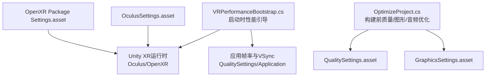
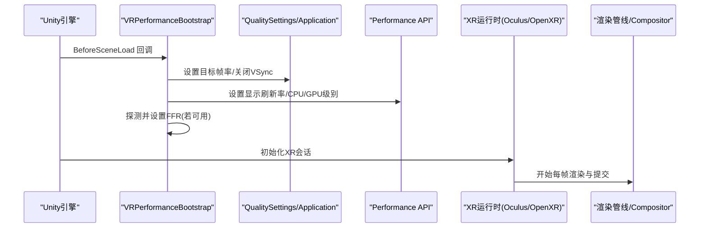
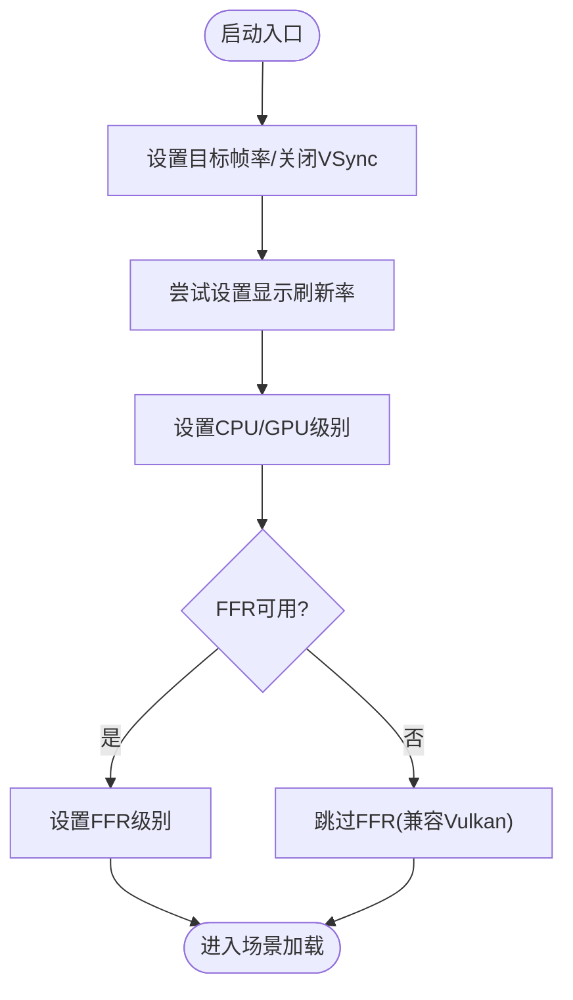
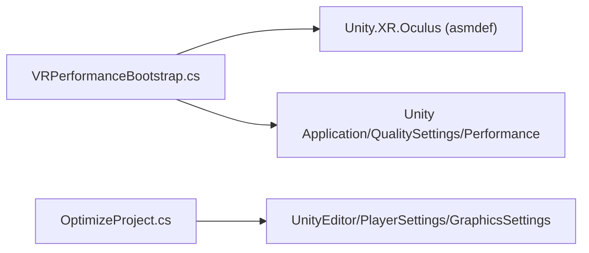

# 运行时性能监控

<cite>
**本文引用的文件**
- [VRPerformanceBootstrap.cs](file://Assets/Scripts/Core/VRPerformanceBootstrap.cs)
- [OptimizeProject.cs](file://Assets/Editor/OptimizeProject.cs)
- [OculusSettings.asset](file://Assets/XR/Settings/OculusSettings.asset)
- [OpenXR Package Settings.asset](file://Assets/XR/Settings/OpenXR Package Settings.asset)
- [InkRidge.asmdef](file://Assets/Scripts/InkRidge.asmdef)
- [ComfortSettings.cs](file://Assets/Scripts/Core/ComfortSettings.cs)
</cite>

## 目录
1. [简介](#简介)
2. [项目结构](#项目结构)
3. [核心组件](#核心组件)
4. [架构总览](#架构总览)
5. [详细组件分析](#详细组件分析)
6. [依赖关系分析](#依赖关系分析)
7. [性能考量](#性能考量)
8. [故障排查指南](#故障排查指南)
9. [结论](#结论)
10. [附录](#附录)

## 简介
本文件面向InkRidge的运行时性能监控系统，重点解析启动时优化机制与平台适配策略。内容涵盖：
- VRPerformanceBootstrap类的启动时优化流程（目标帧率、垂直同步、显示刷新率、FFR）
- Quest 3平台的特定参数（CPU/GPU级别、焦点渲染）
- RuntimeInitializeOnLoadMethod的使用时机与优势
- Oculus与OpenXR平台的性能适配差异
- 性能指标监控方法与调试技巧
- 针对不同硬件配置的调优建议

## 项目结构
本项目将运行时性能相关逻辑集中在Core模块，并通过编辑器脚本在构建前统一配置质量与图形设置；XR层提供Oculus与OpenXR两套运行期配置。

图表来源
- [VRPerformanceBootstrap.cs:1-49](file://Assets/Scripts/Core/VRPerformanceBootstrap.cs#L1-L49)
- [OptimizeProject.cs:37-176](file://Assets/Editor/OptimizeProject.cs#L37-L176)
- [OculusSettings.asset:1-37](file://Assets/XR/Settings/OculusSettings.asset#L1-L37)
- [OpenXR Package Settings.asset:374-539](file://Assets/XR/Settings/OpenXR Package Settings.asset#L374-L539)

章节来源
- [VRPerformanceBootstrap.cs:1-49](file://Assets/Scripts/Core/VRPerformanceBootstrap.cs#L1-L49)
- [OptimizeProject.cs:37-176](file://Assets/Editor/OptimizeProject.cs#L37-L176)
- [OculusSettings.asset:1-37](file://Assets/XR/Settings/OculusSettings.asset#L1-L37)
- [OpenXR Package Settings.asset:374-539](file://Assets/XR/Settings/OpenXR Package Settings.asset#L374-L539)

## 核心组件
- VRPerformanceBootstrap：在场景加载前一次性完成Quest运行时关键性能参数的设定（目标帧率、VSync、刷新率、CPU/GPU级别、FFR）。
- OptimizeProject：编辑器侧一键优化脚本，统一设置质量等级、图形与玩家设置，确保构建产物对Quest 3友好。
- OculusSettings/OpenXR Package Settings：分别承载Oculus原生与OpenXR路径下的设备特性开关（如TargetQuest3、MetaQuestFeature等）。
- ComfortSettings：运行时可持久化的舒适度设置，间接影响渲染开销（如晕动相关的暗角效果）。

章节来源
- [VRPerformanceBootstrap.cs:1-49](file://Assets/Scripts/Core/VRPerformanceBootstrap.cs#L1-L49)
- [OptimizeProject.cs:37-176](file://Assets/Editor/OptimizeProject.cs#L37-L176)
- [OculusSettings.asset:1-37](file://Assets/XR/Settings/OculusSettings.asset#L1-L37)
- [OpenXR Package Settings.asset:374-539](file://Assets/XR/Settings/OpenXR Package Settings.asset#L374-L539)
- [ComfortSettings.cs:1-81](file://Assets/Scripts/Core/ComfortSettings.cs#L1-L81)

## 架构总览
下图展示了从启动到首帧渲染的关键路径：Unity在BeforeSceneLoad阶段调用VRPerformanceBootstrap，随后进入XR初始化与渲染管线，最终由Compositor提交帧。

图表来源
- [VRPerformanceBootstrap.cs:24-45](file://Assets/Scripts/Core/VRPerformanceBootstrap.cs#L24-L45)
- [OpenXR Package Settings.asset:374-539](file://Assets/XR/Settings/OpenXR Package Settings.asset#L374-L539)

## 详细组件分析

### VRPerformanceBootstrap：启动时优化机制
- 目标帧率与垂直同步
  - 设置应用目标帧率为固定值，并关闭VSync，使帧节奏交由VR合成器管理，避免与显示器刷新率冲突。
- 显示刷新率
  - 尝试设置显示刷新率为安全值（例如72Hz），以匹配头显默认或稳定工作点。
- CPU/GPU级别
  - 通过Performance API设置CPU与GPU级别为“高”，以获得更稳定的算力输出。
- 焦点渲染(FFR)
  - 优先使用TiledMultiRes路径设置FFR级别；当该API不可用（例如Vulkan合成器环境）时，跳过以避免警告日志刷屏。
- 执行时机
  - 使用RuntimeInitializeOnLoadMethod(BeforeSceneLoad)，确保在任意场景加载之前完成关键性能参数设置，降低首次帧抖动风险。

图表来源
- [VRPerformanceBootstrap.cs:24-45](file://Assets/Scripts/Core/VRPerformanceBootstrap.cs#L24-L45)

章节来源
- [VRPerformanceBootstrap.cs:1-49](file://Assets/Scripts/Core/VRPerformanceBootstrap.cs#L1-L49)

### Quest 3平台特定优化参数
- 目标设备与特性
  - OculusSettings中启用TargetQuest3，确保针对Quest 3的渲染与提交路径生效。
  - OpenXR配置中包含MetaQuestFeature，支持Quest系列设备的扩展能力（如性能设置、缓冲丢弃优化等）。
- 帧率与刷新率
  - 启动时将目标帧率与显示刷新率对齐至稳定档位（如72Hz），减少掉帧与撕裂。
- CPU/GPU级别
  - 设置为“高”级别，保证在复杂场景中维持稳定的算力供给。
- FFR
  - 根据运行时可用性选择FFR路径，平衡画质与性能。

章节来源
- [OculusSettings.asset:1-37](file://Assets/XR/Settings/OculusSettings.asset#L1-L37)
- [OpenXR Package Settings.asset:374-539](file://Assets/XR/Settings/OpenXR Package Settings.asset#L374-L539)
- [VRPerformanceBootstrap.cs:24-45](file://Assets/Scripts/Core/VRPerformanceBootstrap.cs#L24-L45)

### RuntimeInitializeOnLoadMethod的使用时机与优势
- 时机
  - 在BeforeSceneLoad阶段执行，早于任何场景初始化，确保关键性能参数在首帧前已生效。
- 优势
  - 与场景顺序解耦，避免因场景加载顺序导致的性能未就绪问题。
  - 集中式启动配置，便于维护与扩展。

章节来源
- [VRPerformanceBootstrap.cs:24-45](file://Assets/Scripts/Core/VRPerformanceBootstrap.cs#L24-L45)

### 不同VR平台的性能适配策略
- Oculus路径
  - 通过OculusSettings开启TargetQuest3及相关特性，配合启动时的刷新率与CPU/GPU级别设置，获得稳定的渲染与提交行为。
- OpenXR路径
  - 通过OpenXR Package Settings中的MetaQuestFeature启用Quest设备支持，并在运行时通过Performance API进行刷新率与算力级别控制。
- 兼容性处理
  - FFR在不同后端（如Vulkan）下API可用性不同，代码会先探测再设置，避免无效调用与日志噪音。

章节来源
- [OculusSettings.asset:1-37](file://Assets/XR/Settings/OculusSettings.asset#L1-L37)
- [OpenXR Package Settings.asset:374-539](file://Assets/XR/Settings/OpenXR Package Settings.asset#L374-L539)
- [VRPerformanceBootstrap.cs:34-45](file://Assets/Scripts/Core/VRPerformanceBootstrap.cs#L34-L45)

## 依赖关系分析
- 程序集引用
  - InkRidge.asmdef显式引用Unity.XR.Oculus，使VRPerformanceBootstrap能够访问Oculus相关API。
- 运行时依赖
  - VRPerformanceBootstrap依赖Unity的Application、QualitySettings与Performance API，以及Utils提供的FFR状态探测。
- 编辑器依赖
  - OptimizeProject依赖UnityEditor与PlayerSettings/GraphicsSettings，用于构建前统一优化。

图表来源
- [InkRidge.asmdef:1-16](file://Assets/Scripts/InkRidge.asmdef#L1-L16)
- [VRPerformanceBootstrap.cs:1-49](file://Assets/Scripts/Core/VRPerformanceBootstrap.cs#L1-L49)
- [OptimizeProject.cs:37-176](file://Assets/Editor/OptimizeProject.cs#L37-L176)

章节来源
- [InkRidge.asmdef:1-16](file://Assets/Scripts/InkRidge.asmdef#L1-L16)
- [VRPerformanceBootstrap.cs:1-49](file://Assets/Scripts/Core/VRPerformanceBootstrap.cs#L1-L49)
- [OptimizeProject.cs:37-176](file://Assets/Editor/OptimizeProject.cs#L37-L176)

## 性能考量
- 帧率与VSync
  - 关闭VSync并将帧率交由VR合成器管理，可减少撕裂与卡顿，提升整体流畅度。
- 刷新率对齐
  - 将目标帧率与显示刷新率对齐至稳定档位（如72Hz），有助于降低功耗与发热。
- CPU/GPU级别
  - 在高负载场景保持“高”级别，避免动态降频带来的帧时间波动。
- FFR
  - 在可用时使用FFR降低边缘像素绘制成本；不可用时自动跳过，保证稳定性。
- 构建期优化
  - 通过OptimizeProject统一关闭阴影、限制像素光数量、启用各向异性过滤、禁用软粒子等，降低渲染压力。

[本节为通用性能指导，不直接分析具体文件]

## 故障排查指南
- FFR不可用
  - 现象：日志提示“Legacy FFR API unavailable (Vulkan runtime) — skipping”。
  - 原因：当前后端不支持TiledMultiRes路径，需依赖运行时FFR控制。
  - 处理：无需干预，系统已自动跳过；如需调整，可在OpenXR或Oculus设置中启用对应FFR特性。
- 帧率不稳定
  - 检查是否错误启用了VSync或与显示刷新率不一致。
  - 确认CPU/GPU级别是否为“高”，并观察设备温度与功耗。
- 构建后材质异常
  - 使用OptimizeProject确保所需着色器被包含，避免剥离导致材质回退到错误着色器。
- 舒适度相关渲染开销
  - 若开启暗角效果，注意其每眼全屏blit开销；可通过ComfortSettings控制开关。

章节来源
- [VRPerformanceBootstrap.cs:34-45](file://Assets/Scripts/Core/VRPerformanceBootstrap.cs#L34-L45)
- [OptimizeProject.cs:257-292](file://Assets/Editor/OptimizeProject.cs#L257-L292)
- [ComfortSettings.cs:49-53](file://Assets/Scripts/Core/ComfortSettings.cs#L49-L53)

## 结论
InkRidge通过VRPerformanceBootstrap在启动早期完成关键性能参数设置，结合编辑器侧的OptimizeProject与XR层配置，形成覆盖“构建期—启动期—运行期”的完整性能保障链路。针对Quest 3，采用稳定的刷新率、高算力级别与条件性FFR，兼顾画质与性能。对于多平台（Oculus/OpenXR），通过特性开关与运行时探测实现兼容与自适应。建议在发布前使用OptimizeProject进行统一优化，并在设备上验证帧率、功耗与视觉质量。

[本节为总结性内容，不直接分析具体文件]

## 附录

### 性能指标监控方法
- 运行时日志
  - 关注VRPerformanceBootstrap输出的FFR设置日志，确认FFR路径是否生效。
- 编辑器工具
  - 使用Unity Profiler与Frame Debugger定位首帧与热点帧的瓶颈。
- 设备端
  - 借助Oculus/Meta Quest开发者选项查看帧时间与刷新率信息，评估目标帧率与VSync配置是否合理。

[本节为通用指导，不直接分析具体文件]

### 针对不同硬件配置的调优指南
- 低端设备
  - 降低FFR级别或关闭，减少像素填充压力；适当降低LOD与纹理分辨率。
- 中端设备
  - 保持FFR中等级别，启用各向异性过滤，关闭不必要的后处理。
- 高端设备
  - 提高FFR级别，适度增加像素光与阴影质量，但仍需关注功耗与发热。

[本节为通用指导，不直接分析具体文件]