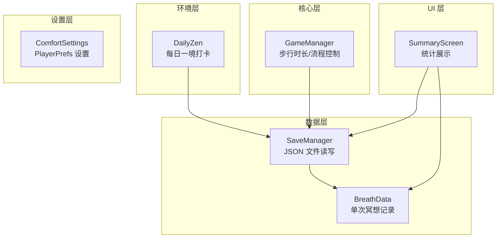
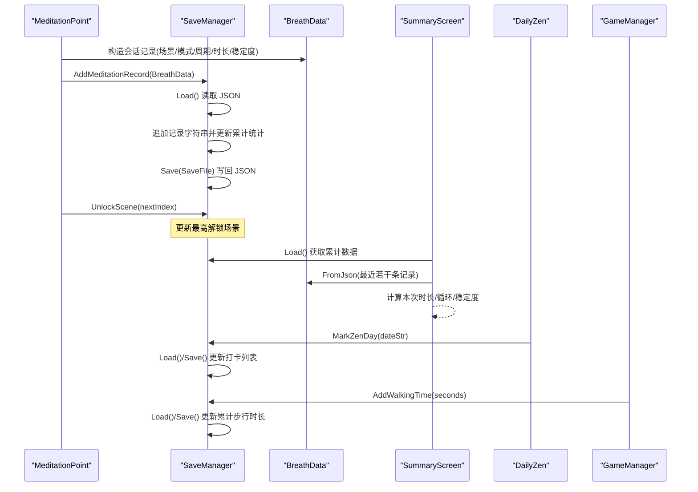
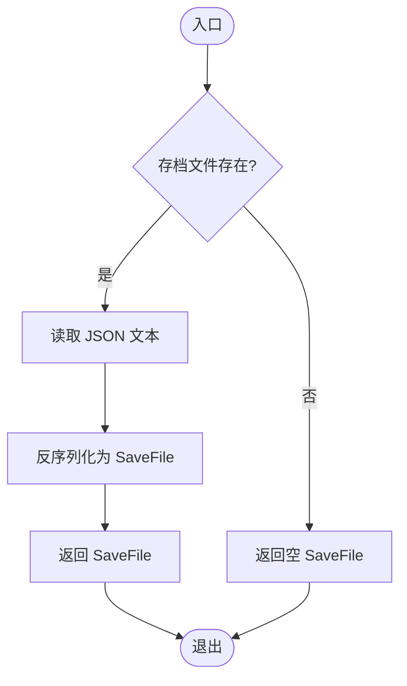
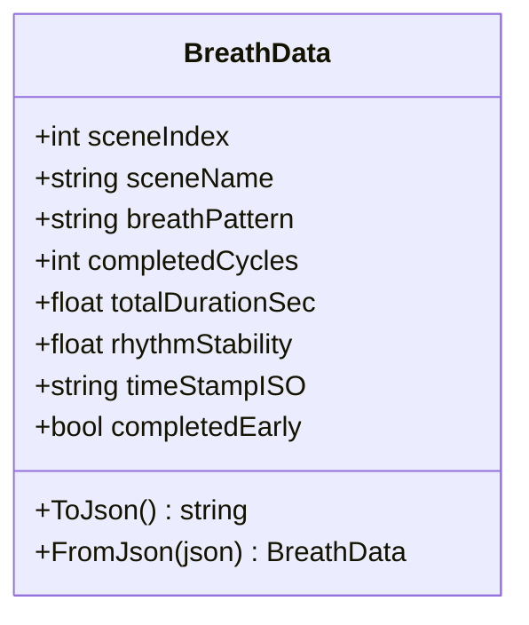
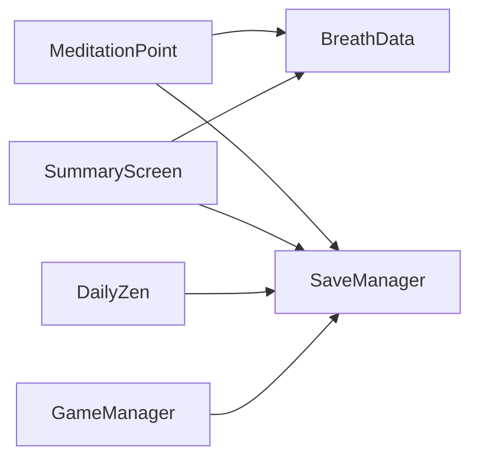

# 数据持久化

<cite>
**本文引用的文件**
- [SaveManager.cs](file://Assets/Scripts/Data/SaveManager.cs)
- [BreathData.cs](file://Assets/Scripts/Meditation/BreathData.cs)
- [ComfortSettings.cs](file://Assets/Scripts/Core/ComfortSettings.cs)
- [DailyZen.cs](file://Assets/Scripts/Environment/DailyZen.cs)
- [SummaryScreen.cs](file://Assets/Scripts/UI/SummaryScreen.cs)
- [MeditationPoint.cs](file://Assets/Scripts/Meditation/MeditationPoint.cs)
- [GameManager.cs](file://Assets/Scripts/Core/GameManager.cs)
</cite>

## 目录
1. [简介](#简介)
2. [项目结构](#项目结构)
3. [核心组件](#核心组件)
4. [架构总览](#架构总览)
5. [详细组件分析](#详细组件分析)
6. [依赖关系分析](#依赖关系分析)
7. [性能与可靠性](#性能与可靠性)
8. [故障排查指南](#故障排查指南)
9. [结论](#结论)
10. [附录：扩展与迁移指南](#附录：扩展与迁移指南)

## 简介
本技术文档聚焦 InkRidge 的数据持久化系统，围绕 SaveManager 的 JSON 存储格式设计与文件 I/O 实现、BreathData 数据结构与冥想会话序列化、用户进度与统计数据的持久化策略、设置偏好（PlayerPrefs）的持久化机制、错误处理与数据验证、备份恢复思路、数据结构扩展与自定义数据持久化方法，以及 Android 平台路径与权限注意事项进行系统化说明。目标是帮助开发者理解并安全地扩展该系统的持久化能力。

## 项目结构
InkRidge 的持久化相关代码主要分布在以下模块：
- 数据层：SaveManager（JSON 文件读写）、BreathData（单次冥想记录）
- 环境层：DailyZen（每日打卡与场景氛围）
- UI 层：SummaryScreen（读取并展示累计统计数据）
- 核心层：GameManager（全局状态、步行时长累积）
- 设置层：ComfortSettings（VR 舒适设置，使用 PlayerPrefs）

图表来源
- [SaveManager.cs:1-118](file://Assets/Scripts/Data/SaveManager.cs#L1-L118)
- [BreathData.cs:1-45](file://Assets/Scripts/Meditation/BreathData.cs#L1-L45)
- [DailyZen.cs:1-85](file://Assets/Scripts/Environment/DailyZen.cs#L1-L85)
- [SummaryScreen.cs:1-71](file://Assets/Scripts/UI/SummaryScreen.cs#L1-L71)
- [GameManager.cs:1-49](file://Assets/Scripts/Core/GameManager.cs#L1-L49)
- [ComfortSettings.cs:1-81](file://Assets/Scripts/Core/ComfortSettings.cs#L1-L81)

章节来源
- [SaveManager.cs:1-118](file://Assets/Scripts/Data/SaveManager.cs#L1-L118)
- [BreathData.cs:1-45](file://Assets/Scripts/Meditation/BreathData.cs#L1-L45)
- [DailyZen.cs:1-85](file://Assets/Scripts/Environment/DailyZen.cs#L1-L85)
- [SummaryScreen.cs:1-71](file://Assets/Scripts/UI/SummaryScreen.cs#L1-L71)
- [GameManager.cs:1-49](file://Assets/Scripts/Core/GameManager.cs#L1-L49)
- [ComfortSettings.cs:1-81](file://Assets/Scripts/Core/ComfortSettings.cs#L1-L81)

## 核心组件
- SaveManager：负责本地 JSON 文件的加载与保存，维护最高解锁场景、累计冥想/步行时长、累计完成次数、冥想记录列表、每日一境打卡列表。
- BreathData：表示一次冥想会话的记录，包含场景信息、呼吸模式、完成周期、总时长、节奏稳定度、时间戳、是否提前结束等字段，并提供 JSON 序列化/反序列化方法。
- ComfortSettings：通过 PlayerPrefs 持久化 VR 舒适设置（移动速度、转向角度、暗角开关、坐姿模式、触觉反馈开关），并在每次写入时强制保存到磁盘以避免被系统回收导致丢失。
- DailyZen：根据日期生成稳定的随机种子，调整雾色与风场方向，并在每天首次进入时标记“每日一境”打卡。
- SummaryScreen：从 SaveManager 读取累计数据与最近几次冥想记录，计算本次冥想时长、呼吸循环数、平均稳定度等指标并展示。
- GameManager：在冥想完成后累加本次步行时长并触发场景切换；间接参与步行时长统计的持久化。

章节来源
- [SaveManager.cs:1-118](file://Assets/Scripts/Data/SaveManager.cs#L1-L118)
- [BreathData.cs:1-45](file://Assets/Scripts/Meditation/BreathData.cs#L1-L45)
- [ComfortSettings.cs:1-81](file://Assets/Scripts/Core/ComfortSettings.cs#L1-L81)
- [DailyZen.cs:1-85](file://Assets/Scripts/Environment/DailyZen.cs#L1-L85)
- [SummaryScreen.cs:1-71](file://Assets/Scripts/UI/SummaryScreen.cs#L1-L71)
- [GameManager.cs:1-49](file://Assets/Scripts/Core/GameManager.cs#L1-L49)

## 架构总览
下图展示了冥想完成到数据持久化的完整调用链：冥想点完成会话后创建 BreathData 记录，调用 SaveManager 添加记录并更新统计，同时解锁下一场景；UI 汇总界面读取保存的数据进行展示；每日场景通过 DailyZen 标记打卡；设置通过 ComfortSettings 持久化。

图表来源
- [MeditationPoint.cs:234-277](file://Assets/Scripts/Meditation/MeditationPoint.cs#L234-L277)
- [SaveManager.cs:29-88](file://Assets/Scripts/Data/SaveManager.cs#L29-L88)
- [BreathData.cs:27-42](file://Assets/Scripts/Meditation/BreathData.cs#L27-L42)
- [SummaryScreen.cs:25-57](file://Assets/Scripts/UI/SummaryScreen.cs#L25-L57)
- [DailyZen.cs:26-36](file://Assets/Scripts/Environment/DailyZen.cs#L26-L36)
- [GameManager.cs:34-49](file://Assets/Scripts/Core/GameManager.cs#L34-L49)

## 详细组件分析

### SaveManager：JSON 存储格式与 I/O
- 存储位置：Application.persistentDataPath + "inkridge_save.json"
- 数据结构（SaveFile）：
  - highestUnlockedScene：最高解锁场景索引
  - totalMeditationTime：累计冥想时长（秒）
  - totalWalkingTime：累计步行时长（秒）
  - totalSessions：累计完成次数
  - meditationRecords：冥想记录字符串列表（每条为 BreathData 的 JSON 字符串）
  - zenDays：每日一境打卡日期列表（"yyyy-MM-dd"）
- I/O 操作：
  - Load()：若文件存在则读取并反序列化为 SaveFile，异常时记录错误日志并返回空对象
  - Save(data)：将 SaveFile 序列化为 JSON 并覆盖写入文件，异常时记录错误日志
  - AddMeditationRecord(record)：加载当前存档，追加记录字符串，更新累计时长与次数，再保存
  - UnlockScene(index)：若传入索引高于当前最高解锁，则更新并保存
  - AddWalkingTime(seconds)：累加步行时长并保存
  - IsZenDayMarked(dateStr)/MarkZenDay(dateStr)/GetZenDayCount()：管理打卡列表
  - Clear()：删除存档文件（用于测试）

图表来源
- [SaveManager.cs:29-44](file://Assets/Scripts/Data/SaveManager.cs#L29-L44)

章节来源
- [SaveManager.cs:1-118](file://Assets/Scripts/Data/SaveManager.cs#L1-L118)

### BreathData：数据结构与序列化
- 字段：
  - sceneIndex：场景索引
  - sceneName：场景名称
  - breathPattern：呼吸模式
  - completedCycles：完成的呼吸周期数
  - totalDurationSec：本次冥想总时长（秒）
  - rhythmStability：节奏稳定度（0~1）
  - timeStampISO：ISO 时间戳（UTC）
  - completedEarly：是否提前结束（保持历史记录真实但不解锁下一场景）
- 序列化：
  - ToJson()：将该实例序列化为 JSON 字符串
  - FromJson(json)：从 JSON 字符串反序列化为 BreathData

图表来源
- [BreathData.cs:1-45](file://Assets/Scripts/Meditation/BreathData.cs#L1-L45)

章节来源
- [BreathData.cs:1-45](file://Assets/Scripts/Meditation/BreathData.cs#L1-L45)

### 用户进度跟踪与统计数据收集
- 进度跟踪：
  - 最高解锁场景：UnlockScene() 仅在传入索引大于当前值时更新，避免回退
  - 累计完成次数：AddMeditationRecord() 中递增
- 统计数据：
  - 累计冥想时长：AddMeditationRecord() 中累加 BreathData.totalDurationSec
  - 累计步行时长：GameManager 在冥想完成后调用 AddWalkingTime() 累加
  - 每日一境打卡：DailyZen 在启动时调用 MarkZenDay() 标记当天，重复调用不重复计数
- UI 展示：
  - SummaryScreen 读取 SaveManager 的累计数据与最近若干条记录，计算本次冥想时长、呼吸循环数、平均稳定度等

章节来源
- [SaveManager.cs:59-109](file://Assets/Scripts/Data/SaveManager.cs#L59-L109)
- [GameManager.cs:34-49](file://Assets/Scripts/Core/GameManager.cs#L34-L49)
- [DailyZen.cs:26-36](file://Assets/Scripts/Environment/DailyZen.cs#L26-L36)
- [SummaryScreen.cs:25-57](file://Assets/Scripts/UI/SummaryScreen.cs#L25-L57)

### 设置偏好的持久化策略（PlayerPrefs）
- 使用 ComfortSettings 统一管理 VR 舒适设置：
  - MoveSpeed、TurnAngle、VignetteEnabled、SeatedMode、HapticsEnabled
- 关键行为：
  - 每次设置后立即调用 PlayerPrefs.Save()，防止后台杀进程导致未落盘
  - 提供 ApplySeatedMode(Transform) 以应用坐姿模式的高度调整

章节来源
- [ComfortSettings.cs:1-81](file://Assets/Scripts/Core/ComfortSettings.cs#L1-L81)

### 数据版本兼容性与迁移机制
- 现状：
  - SaveFile 与 BreathData 均为简单可序列化结构，无显式版本号字段
  - 新增字段时，旧存档可能缺少新字段，Unity JsonUtility 会将其设为默认值
- 建议方案（可扩展）：
  - 在 SaveFile 增加 version 字段，Load() 中检测版本并执行迁移逻辑（如补齐默认值、重命名字段、历史数据清洗）
  - 对 BreathData 增加 schemaVersion，FromJson() 中做兼容处理
  - 迁移失败时保留原文件并记录错误日志，必要时提供降级策略

[本节为概念性建议，不直接分析具体文件]

### 错误处理、数据验证与备份恢复
- 错误处理：
  - SaveManager.Load()/Save() 使用 try/catch 捕获异常并记录错误日志
  - 读取失败或文件不存在时返回空 SaveFile，保证程序健壮性
- 数据验证：
  - 当前未对字段范围进行校验（如 totalDurationSec >= 0、rhythmStability 在 0~1）
  - 建议在 AddMeditationRecord() 或 BreathData 构造函数中进行基础校验
- 备份恢复：
  - 当前无自动备份机制
  - 可在 Save() 前复制 inkridge_save.json 为带时间戳的备份文件
  - 提供 Restore(path) 接口从备份恢复，或在 Load() 失败时尝试从备份恢复

章节来源
- [SaveManager.cs:29-57](file://Assets/Scripts/Data/SaveManager.cs#L29-L57)

### Android 平台的文件路径管理与权限处理
- 文件路径：
  - 使用 Application.persistentDataPath 作为存档根目录，跨平台一致且具备读写权限
  - 存档文件名固定为 "inkridge_save.json"
- 权限与生命周期：
  - Unity 在 Android 上对该路径具有读写权限，无需额外申请存储权限
  - 注意频繁 I/O 的性能影响，建议合并写入或使用异步/延迟策略
- 建议：
  - 在崩溃或异常时检查文件完整性（如 JSON 损坏）
  - 考虑在应用内提供导出/导入功能，便于用户备份与迁移

[本节为通用指导，不直接分析具体文件]

## 依赖关系分析
- MeditationPoint 依赖 BreathData 与 SaveManager
- SummaryScreen 依赖 SaveManager 与 BreathData
- DailyZen 依赖 SaveManager
- GameManager 依赖 SaveManager
- SaveManager 依赖 BreathData（通过 JSON 字符串）

图表来源
- [MeditationPoint.cs:234-277](file://Assets/Scripts/Meditation/MeditationPoint.cs#L234-L277)
- [SummaryScreen.cs:25-57](file://Assets/Scripts/UI/SummaryScreen.cs#L25-L57)
- [DailyZen.cs:26-36](file://Assets/Scripts/Environment/DailyZen.cs#L26-L36)
- [GameManager.cs:34-49](file://Assets/Scripts/Core/GameManager.cs#L34-L49)
- [SaveManager.cs:59-88](file://Assets/Scripts/Data/SaveManager.cs#L59-L88)

章节来源
- [MeditationPoint.cs:234-277](file://Assets/Scripts/Meditation/MeditationPoint.cs#L234-L277)
- [SummaryScreen.cs:25-57](file://Assets/Scripts/UI/SummaryScreen.cs#L25-L57)
- [DailyZen.cs:26-36](file://Assets/Scripts/Environment/DailyZen.cs#L26-L36)
- [GameManager.cs:34-49](file://Assets/Scripts/Core/GameManager.cs#L34-L49)
- [SaveManager.cs:59-88](file://Assets/Scripts/Data/SaveManager.cs#L59-L88)

## 性能与可靠性
- I/O 频率：
  - 每次冥想完成都会进行一次 Load+Save，建议在高并发或高频场景下考虑批量化写入或异步队列
- 文件大小增长：
  - meditationRecords 随会话增长，长期运行可能导致文件变大；可考虑定期归档或限制记录数量（如仅保留最近 N 条）
- 稳定性：
  - 已加入异常捕获与日志记录，建议在关键路径增加重试与降级策略
- 一致性：
  - 当前无事务机制，极端情况下可能出现部分写入失败；可引入临时文件+原子替换策略提升一致性

[本节为通用指导，不直接分析具体文件]

## 故障排查指南
- 常见问题：
  - 无法读取存档：检查文件是否存在、JSON 是否损坏、是否有权限访问 persistentDataPath
  - 设置丢失：确认 ComfortSettings 是否在每次修改后调用 Save()
  - 统计不准确：检查 AddMeditationRecord() 与 AddWalkingTime() 的调用时机与参数
- 定位步骤：
  - 查看 SaveManager.Load()/Save() 的错误日志
  - 打印 SaveFile 的关键字段（highestUnlockedScene、totalSessions、zenDays 长度）
  - 检查 BreathData 的 JSON 字符串是否符合预期（字段齐全、类型正确）

章节来源
- [SaveManager.cs:29-57](file://Assets/Scripts/Data/SaveManager.cs#L29-L57)
- [ComfortSettings.cs:22-35](file://Assets/Scripts/Core/ComfortSettings.cs#L22-L35)

## 结论
InkRidge 的持久化系统以 SaveManager 为核心，采用 JSON 文件存储冥想记录与累计统计，结合 BreathData 的结构化记录与 ComfortSettings 的设置持久化，形成了简洁可靠的本地数据管理方案。通过合理的错误处理与日志记录，系统在异常情况下仍能保持稳定。未来可通过版本迁移、数据校验、备份恢复与性能优化进一步提升健壮性与可维护性。

## 附录：扩展与迁移指南
- 扩展数据结构：
  - 在 SaveFile 或 BreathData 中新增字段时，确保向后兼容（默认值合理）
  - 建议在 BreathData 增加 schemaVersion，并在 FromJson() 中做兼容处理
- 自定义数据持久化：
  - 复用 SaveManager 的 Load()/Save() 模式，将自定义数据序列化为 JSON 字符串存入 meditationRecords 或其他列表
  - 为避免冲突，可为不同数据类型定义唯一标识键
- 迁移机制：
  - 在 Load() 中检测版本并执行迁移脚本，将旧格式转换为新格式
  - 迁移失败时保留原文件并记录错误，提供手动修复工具或重置选项
- Android 注意事项：
  - 使用 Application.persistentDataPath 进行读写，无需额外权限
  - 注意大文件 I/O 的性能，避免在主线程频繁读写
  - 提供导出/导入功能以便用户备份与迁移存档

[本节为通用指导，不直接分析具体文件]