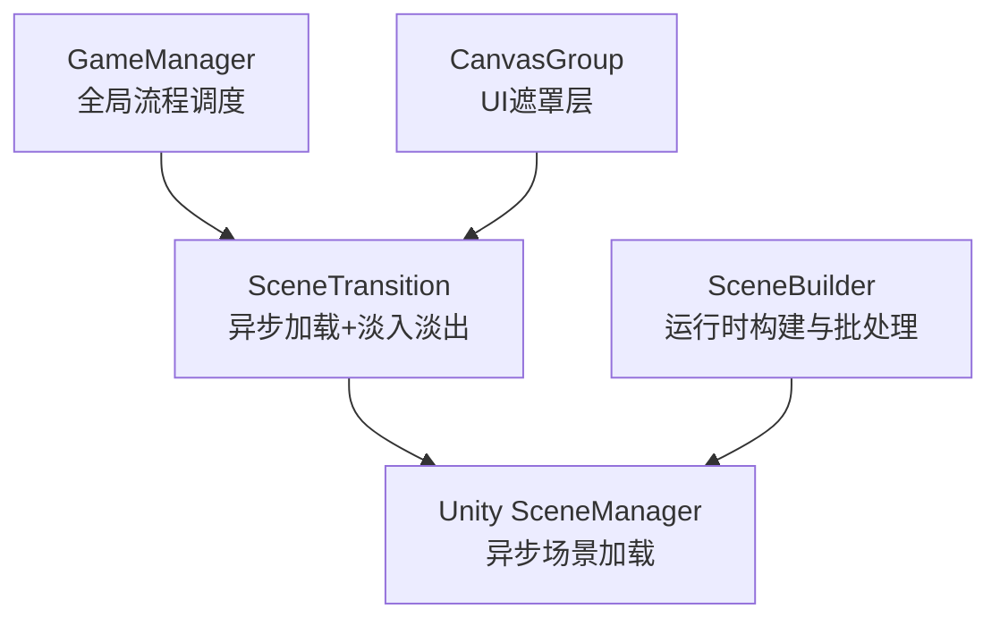
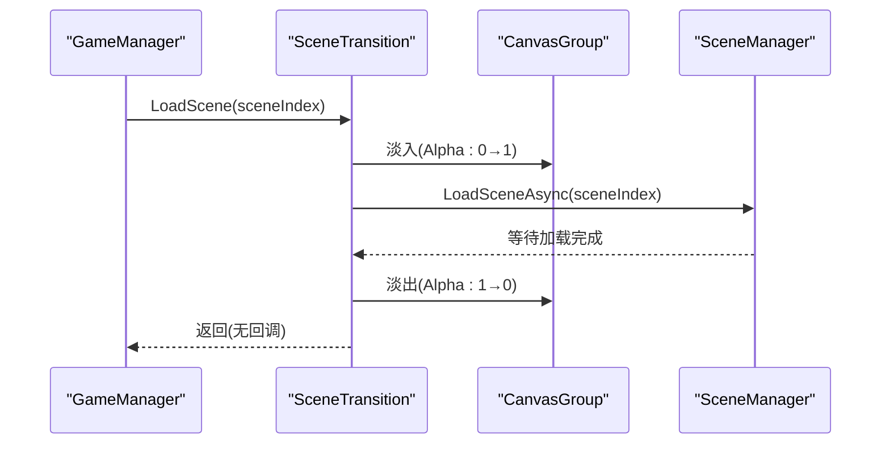
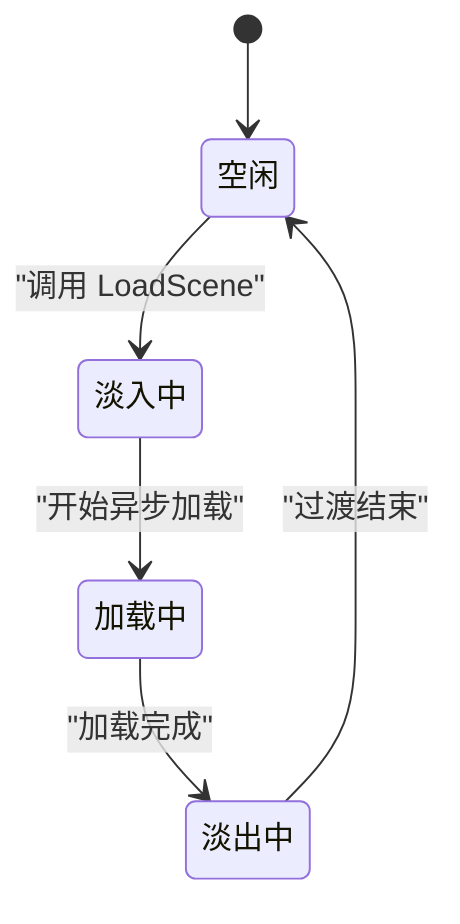
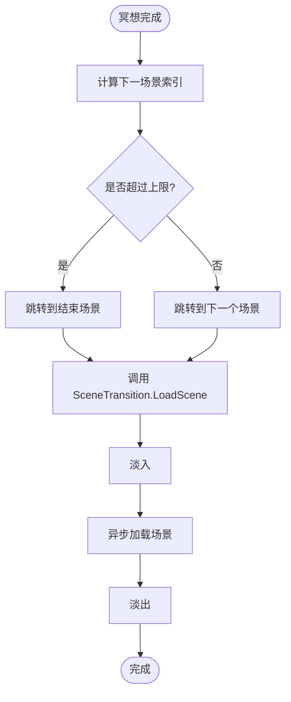
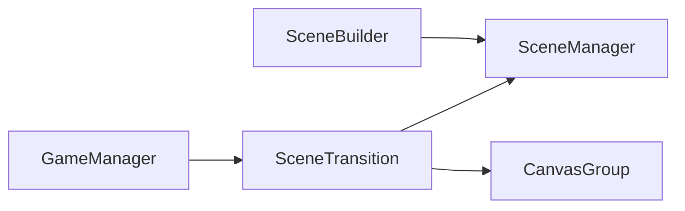
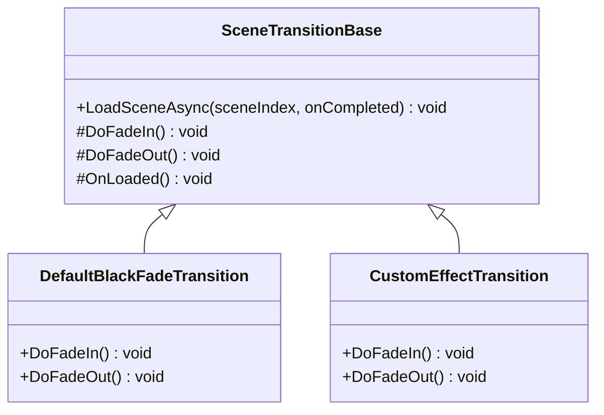

# 场景过渡系统

<cite>
**本文引用的文件**
- [Assets/Scripts/Core/SceneTransition.cs](file://Assets/Scripts/Core/SceneTransition.cs)
- [Assets/Scripts/Core/GameManager.cs](file://Assets/Scripts/Core/GameManager.cs)
- [Assets/Scripts/Environment/SceneBuilder.cs](file://Assets/Scripts/Environment/SceneBuilder.cs)
- [Assets/Scenes/00_Start.unity.meta](file://Assets/Scenes/00_Start.unity.meta)
</cite>

## 目录
1. [简介](#简介)
2. [项目结构](#项目结构)
3. [核心组件](#核心组件)
4. [架构总览](#架构总览)
5. [详细组件分析](#详细组件分析)
6. [依赖关系分析](#依赖关系分析)
7. [性能考量](#性能考量)
8. [故障排查指南](#故障排查指南)
9. [结论](#结论)
10. [附录：扩展自定义过渡效果](#附录：扩展自定义过渡效果)

## 简介
本技术文档聚焦于 InkRidge 的场景过渡系统，围绕异步场景加载、淡入淡出效果、资源与内存管理策略、与 GameManager 的协作模式，以及场景切换生命周期与事件流程进行系统化说明。文档同时提供可扩展的过渡基类设计建议，帮助开发者在不破坏现有流程的前提下实现自定义过渡效果。

## 项目结构
InkRidge 使用 Unity 工程组织，场景过渡相关逻辑集中在 Core 模块，场景构建与渲染优化在 Environment 模块中提供支撑。关键文件如下：
- 场景过渡核心：Assets/Scripts/Core/SceneTransition.cs
- 全局状态与流程调度：Assets/Scripts/Core/GameManager.cs
- 运行时场景构建与渲染优化：Assets/Scripts/Environment/SceneBuilder.cs
- 场景清单（示例）：Assets/Scenes/00_Start.unity.meta

图表来源
- [Assets/Scripts/Core/GameManager.cs:1-66](file://Assets/Scripts/Core/GameManager.cs#L1-L66)
- [Assets/Scripts/Core/SceneTransition.cs:1-61](file://Assets/Scripts/Core/SceneTransition.cs#L1-L61)
- [Assets/Scripts/Environment/SceneBuilder.cs:1-223](file://Assets/Scripts/Environment/SceneBuilder.cs#L1-L223)

章节来源
- [Assets/Scripts/Core/SceneTransition.cs:1-61](file://Assets/Scripts/Core/SceneTransition.cs#L1-L61)
- [Assets/Scripts/Core/GameManager.cs:1-66](file://Assets/Scripts/Core/GameManager.cs#L1-L66)
- [Assets/Scripts/Environment/SceneBuilder.cs:1-223](file://Assets/Scripts/Environment/SceneBuilder.cs#L1-L223)
- [Assets/Scenes/00_Start.unity.meta:1-8](file://Assets/Scenes/00_Start.unity.meta#L1-L8)

## 核心组件
- SceneTransition：负责以黑屏淡入淡出方式执行异步场景加载，单例持久化，避免多实例冲突。
- GameManager：维护游戏全局状态（如行走时间）、计算下一场景索引并触发场景切换。
- SceneBuilder：运行时构建场景几何、设置天空盒/雾/光照，并进行静态合批以减少绘制调用。

章节来源
- [Assets/Scripts/Core/SceneTransition.cs:1-61](file://Assets/Scripts/Core/SceneTransition.cs#L1-L61)
- [Assets/Scripts/Core/GameManager.cs:1-66](file://Assets/Scripts/Core/GameManager.cs#L1-L66)
- [Assets/Scripts/Environment/SceneBuilder.cs:1-223](file://Assets/Scripts/Environment/SceneBuilder.cs#L1-L223)

## 架构总览
整体流程由 GameManager 驱动，通过 SceneTransition 完成带淡入淡出的异步场景加载；CanvasGroup 用于 UI 遮罩层的透明度动画；场景内容可由 SceneBuilder 在运行时构建并进行渲染优化。

图表来源
- [Assets/Scripts/Core/GameManager.cs:39-63](file://Assets/Scripts/Core/GameManager.cs#L39-L63)
- [Assets/Scripts/Core/SceneTransition.cs:30-44](file://Assets/Scripts/Core/SceneTransition.cs#L30-L44)

## 详细组件分析

### 异步场景加载与参数处理
- 入口方法：LoadScene(int sceneIndex) 启动协程执行异步加载。
- 协程流程：先执行淡入，再调用 SceneManager.LoadSceneAsync 并轮询 isDone 直到完成，最后执行淡出。
- 参数处理：当前仅接受场景索引；未对索引范围做显式校验，若传入无效索引将导致加载失败或异常。建议在调用前进行边界检查或在内部增加保护。

章节来源
- [Assets/Scripts/Core/SceneTransition.cs:30-44](file://Assets/Scripts/Core/SceneTransition.cs#L30-L44)

### 错误处理策略
- 当前实现未捕获异常，也未检测 CanvasGroup 引用是否为空之外的错误路径。
- 建议增强点：
  - 在 LoadSceneAsync 中对 sceneIndex 进行有效性检查（例如大于等于 0 且小于 Build Settings 中的场景数量）。
  - 为 SceneManager.LoadSceneAsync 添加错误分支（如加载失败时的重试或回退到默认场景）。
  - 在 Fade 中保留对 _fadeCanvas 的空引用保护（已存在），并可增加日志输出便于定位问题。

章节来源
- [Assets/Scripts/Core/SceneTransition.cs:46-58](file://Assets/Scripts/Core/SceneTransition.cs#L46-L58)

### 淡入淡出效果的实现原理
- 使用 CanvasGroup 的 alpha 属性控制 UI 遮罩层的透明度。
- 通过线性插值 Mathf.Lerp 在 _fadeDuration 时间内从 from 渐变到 to。
- 动画基于 Time.deltaTime 累计 elapsed，确保帧率无关的平滑过渡。
- 配置项：_fadeCanvas（CanvasGroup 引用）、_fadeDuration（淡入/淡出时长）。

章节来源
- [Assets/Scripts/Core/SceneTransition.cs:14-15](file://Assets/Scripts/Core/SceneTransition.cs#L14-L15)
- [Assets/Scripts/Core/SceneTransition.cs:46-58](file://Assets/Scripts/Core/SceneTransition.cs#L46-L58)

### 与 GameManager 的协作模式
- GameManager 维护各场景索引（按 Build Settings 顺序），并在冥想完成或跳过时计算 nextScene。
- 当 nextScene 超过指定上限时，跳转至结束场景。
- 通过 SceneTransition.Instance?.LoadScene(nextScene) 触发过渡。
- 注意：当前 GameManager 未对 sceneIndex 做越界保护，建议在外部调用前或内部统一校验。

章节来源
- [Assets/Scripts/Core/GameManager.cs:14-17](file://Assets/Scripts/Core/GameManager.cs#L14-L17)
- [Assets/Scripts/Core/GameManager.cs:39-63](file://Assets/Scripts/Core/GameManager.cs#L39-L63)

### 场景切换的生命周期图

图表来源
- [Assets/Scripts/Core/SceneTransition.cs:35-44](file://Assets/Scripts/Core/SceneTransition.cs#L35-L44)

### 事件流程图（从冥想完成到场景切换）

图表来源
- [Assets/Scripts/Core/GameManager.cs:39-63](file://Assets/Scripts/Core/GameManager.cs#L39-L63)
- [Assets/Scripts/Core/SceneTransition.cs:35-44](file://Assets/Scripts/Core/SceneTransition.cs#L35-L44)

## 依赖关系分析
- GameManager 依赖 SceneTransition 以触发场景切换。
- SceneTransition 依赖 Unity 的 SceneManager 进行异步加载，依赖 CanvasGroup 实现淡入淡出。
- SceneBuilder 在场景中负责运行时构建与渲染优化，间接影响场景加载后的性能表现。

图表来源
- [Assets/Scripts/Core/GameManager.cs:39-63](file://Assets/Scripts/Core/GameManager.cs#L39-L63)
- [Assets/Scripts/Core/SceneTransition.cs:30-44](file://Assets/Scripts/Core/SceneTransition.cs#L30-L44)
- [Assets/Scripts/Environment/SceneBuilder.cs:198-219](file://Assets/Scripts/Environment/SceneBuilder.cs#L198-L219)

章节来源
- [Assets/Scripts/Core/GameManager.cs:39-63](file://Assets/Scripts/Core/GameManager.cs#L39-L63)
- [Assets/Scripts/Core/SceneTransition.cs:30-44](file://Assets/Scripts/Core/SceneTransition.cs#L30-L44)
- [Assets/Scripts/Environment/SceneBuilder.cs:198-219](file://Assets/Scripts/Environment/SceneBuilder.cs#L198-L219)

## 性能考量
- 异步加载：使用 SceneManager.LoadSceneAsync 避免阻塞主线程，提升用户体验。
- 淡入淡出：基于 CanvasGroup.alpha 的简单线性插值，开销低，适合移动端 VR。
- 运行时构建与批处理：SceneBuilder 在 Start 中收集 MeshRenderer 并执行 StaticBatchingUtility.Combine，减少绘制调用，提高渲染效率。
- 装饰对象剔除碰撞：Decorative 方法移除不必要的 Collider，降低物理 broadphase 成本。
- 光照与阴影：关闭实时阴影以减少额外几何 pass，适配 VR 移动平台。

章节来源
- [Assets/Scripts/Core/SceneTransition.cs:35-44](file://Assets/Scripts/Core/SceneTransition.cs#L35-L44)
- [Assets/Scripts/Environment/SceneBuilder.cs:120-126](file://Assets/Scripts/Environment/SceneBuilder.cs#L120-L126)
- [Assets/Scripts/Environment/SceneBuilder.cs:183-196](file://Assets/Scripts/Environment/SceneBuilder.cs#L183-L196)
- [Assets/Scripts/Environment/SceneBuilder.cs:198-219](file://Assets/Scripts/Environment/SceneBuilder.cs#L198-L219)

## 故障排查指南
- 淡入淡出不生效：
  - 检查 CanvasGroup 引用是否正确赋值。
  - 确认 _fadeDuration 不为 0，否则动画无法播放。
- 场景加载失败：
  - 检查传入的 sceneIndex 是否在 Build Settings 范围内。
  - 查看是否有重复或损坏的场景文件。
- 卡顿或掉帧：
  - 关注运行时构建的 Mesh 数量与材质种类，必要时合并材质或减少动态对象。
  - 检查是否启用了不必要的物理碰撞或高开销特效。

章节来源
- [Assets/Scripts/Core/SceneTransition.cs:14-15](file://Assets/Scripts/Core/SceneTransition.cs#L14-L15)
- [Assets/Scripts/Core/SceneTransition.cs:46-58](file://Assets/Scripts/Core/SceneTransition.cs#L46-L58)
- [Assets/Scripts/Environment/SceneBuilder.cs:198-219](file://Assets/Scripts/Environment/SceneBuilder.cs#L198-L219)

## 结论
InkRidge 的场景过渡系统以简洁可靠的异步加载与淡入淡出为核心，配合 GameManager 的流程调度与 SceneBuilder 的运行时构建优化，实现了流畅且高效的场景切换体验。当前实现注重易用性与性能平衡，未来可在索引校验、错误恢复与可配置曲线等方面进一步增强鲁棒性与可定制性。

## 附录：扩展自定义过渡效果
目标：在不破坏现有流程的前提下，支持多种过渡效果（如分屏、模糊、粒子等），并保持统一的调用接口。

建议方案
- 抽象基类：定义 SceneTransitionBase，暴露统一的 LoadSceneAsync(sceneIndex, onCompleted) 接口，内部封装淡入淡出与加载流程。
- 具体实现：继承 SceneTransitionBase，重写过渡阶段（FadeIn/FadeOut）与加载后处理（onCompleted 回调）。
- 管理器集成：GameManager 通过接口调用过渡器，支持热插拔不同过渡效果。
- 配置化：将过渡时长、曲线、目标组件等参数外置为序列化字段，便于编辑器和运行时调整。

图表来源
- [Assets/Scripts/Core/SceneTransition.cs:30-44](file://Assets/Scripts/Core/SceneTransition.cs#L30-L44)

实施要点
- 保持与现有 GameManager 的调用一致：StartGame、OnMeditationComplete、SkipMeditation 均通过统一接口触发过渡。
- 在过渡完成后执行必要的清理（如释放临时资源、重置状态）。
- 为复杂过渡增加进度回调，便于 UI 显示加载进度或提示。

章节来源
- [Assets/Scripts/Core/GameManager.cs:39-63](file://Assets/Scripts/Core/GameManager.cs#L39-L63)
- [Assets/Scripts/Core/SceneTransition.cs:30-44](file://Assets/Scripts/Core/SceneTransition.cs#L30-L44)