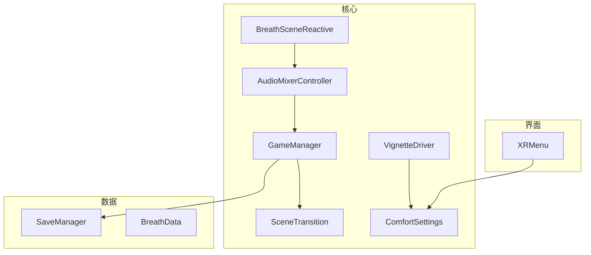
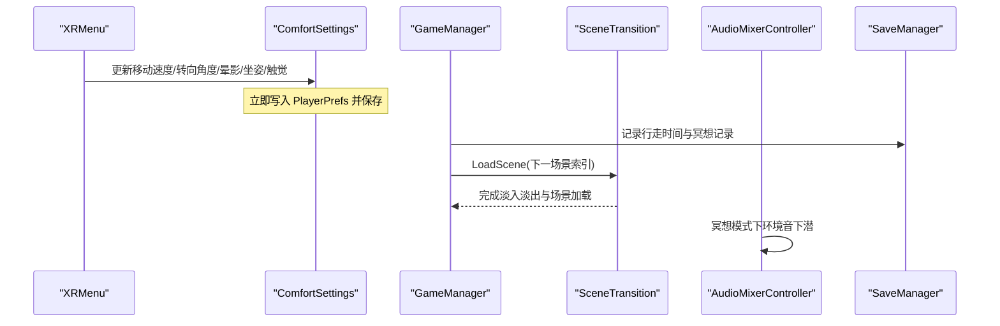
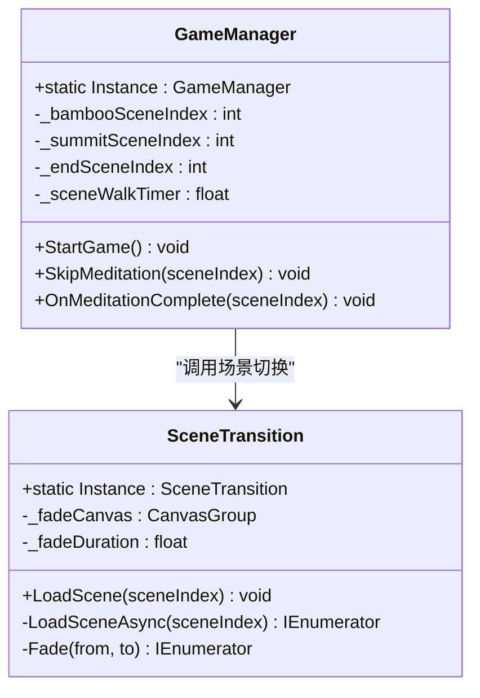
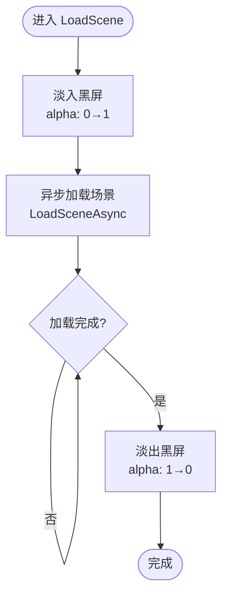
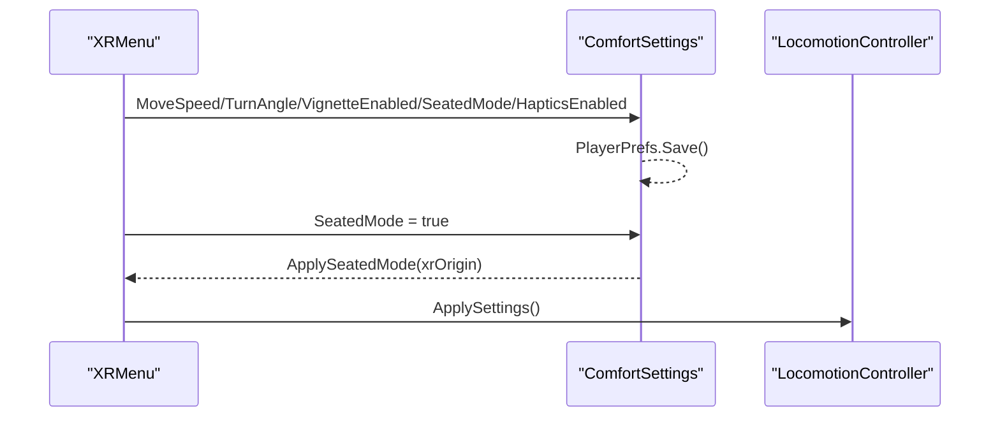
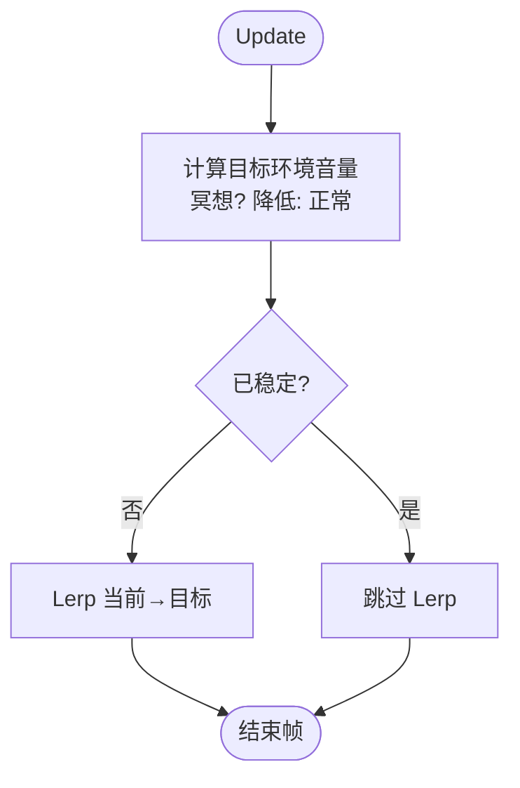
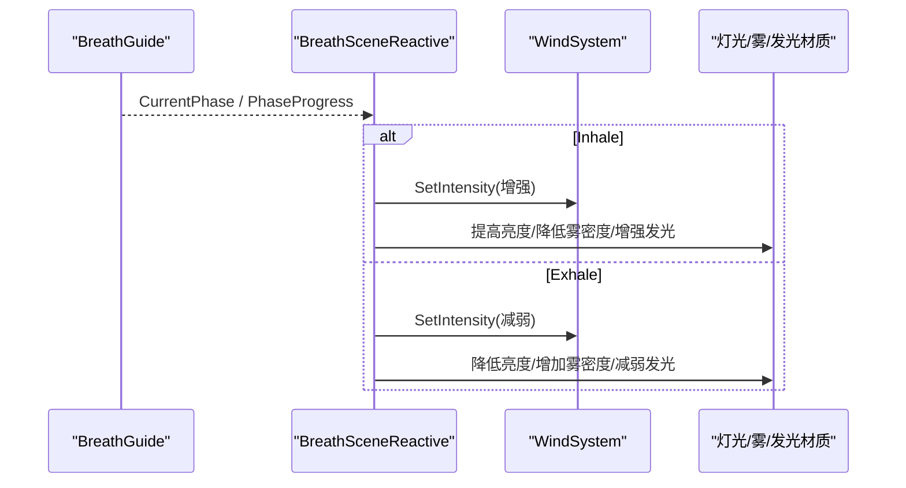
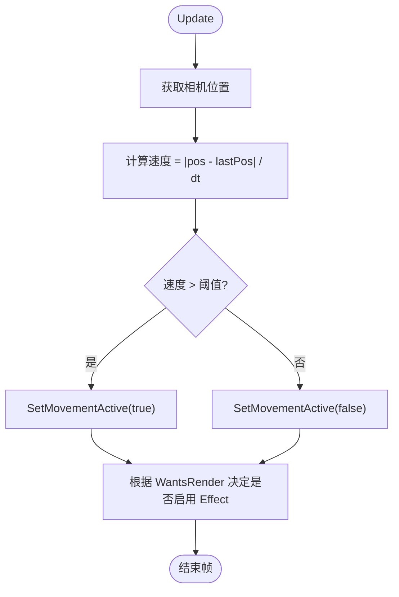
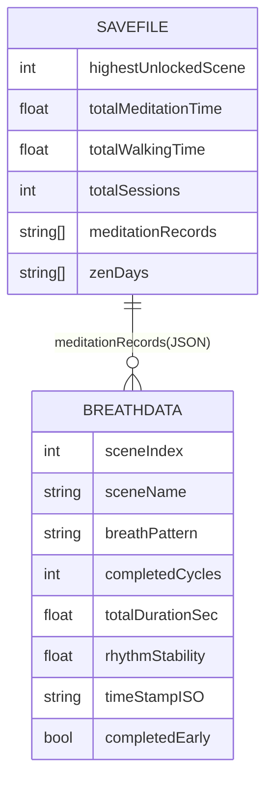
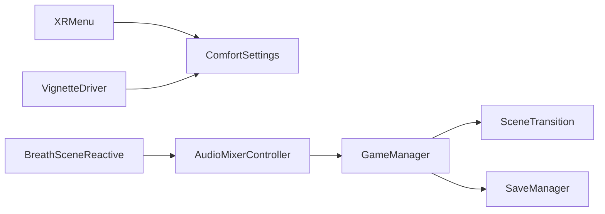

# 核心架构

<cite>
**本文引用的文件**
- [Assets/Scripts/Core/GameManager.cs](file://Assets/Scripts/Core/GameManager.cs)
- [Assets/Scripts/Core/SceneTransition.cs](file://Assets/Scripts/Core/SceneTransition.cs)
- [Assets/Scripts/Core/ComfortSettings.cs](file://Assets/Scripts/Core/ComfortSettings.cs)
- [Assets/Scripts/Core/AudioMixerController.cs](file://Assets/Scripts/Core/AudioMixerController.cs)
- [Assets/Scripts/Data/SaveManager.cs](file://Assets/Scripts/Data/SaveManager.cs)
- [Assets/Scripts/Core/BreathSceneReactive.cs](file://Assets/Scripts/Core/BreathSceneReactive.cs)
- [Assets/Scripts/Core/VignetteDriver.cs](file://Assets/Scripts/Core/VignetteDriver.cs)
- [Assets/Scripts/Meditation/BreathData.cs](file://Assets/Scripts/Meditation/BreathData.cs)
- [Assets/Scripts/UI/XRMenu.cs](file://Assets/Scripts/UI/XRMenu.cs)
</cite>

## 目录
1. [简介](#简介)
2. [项目结构](#项目结构)
3. [核心组件](#核心组件)
4. [架构总览](#架构总览)
5. [详细组件分析](#详细组件分析)
6. [依赖关系分析](#依赖关系分析)
7. [性能考量](#性能考量)
8. [故障排查指南](#故障排查指南)
9. [结论](#结论)
10. [附录：扩展点与集成指南](#附录：扩展点与集成指南)

## 简介
本文件面向高级开发者，系统化梳理 InkRidge 的核心架构，重点覆盖以下主题：
- 单例模式在 GameManager 与 SceneTransition 中的实现与职责边界
- 场景过渡系统的淡入淡出效果与异步加载机制
- 舒适度设置的用户偏好管理（持久化、应用时机）
- 音频混合器控制器的音量管理与动态音效调整（冥想期间环境音下潜）
- 组件间交互关系、数据流向与事件驱动协作方式
- 可扩展点与自定义集成的技术指导

## 项目结构
InkRidge 采用按功能域划分的脚本组织方式，核心逻辑集中在 Scripts/Core，数据持久化位于 Scripts/Data，UI 与 XR 菜单位于 Scripts/UI，环境与氛围系统位于 Scripts/Environment，冥想相关逻辑位于 Scripts/Meditation。核心子系统通过静态单例或全局可访问的控制器进行松耦合通信。

图表来源
- [Assets/Scripts/Core/GameManager.cs:1-66](file://Assets/Scripts/Core/GameManager.cs#L1-L66)
- [Assets/Scripts/Core/SceneTransition.cs:1-61](file://Assets/Scripts/Core/SceneTransition.cs#L1-L61)
- [Assets/Scripts/Core/ComfortSettings.cs:1-81](file://Assets/Scripts/Core/ComfortSettings.cs#L1-L81)
- [Assets/Scripts/Core/AudioMixerController.cs:1-67](file://Assets/Scripts/Core/AudioMixerController.cs#L1-L67)
- [Assets/Scripts/Core/VignetteDriver.cs:1-62](file://Assets/Scripts/Core/VignetteDriver.cs#L1-L62)
- [Assets/Scripts/Core/BreathSceneReactive.cs:1-147](file://Assets/Scripts/Core/BreathSceneReactive.cs#L1-L147)
- [Assets/Scripts/Data/SaveManager.cs:1-118](file://Assets/Scripts/Data/SaveManager.cs#L1-L118)
- [Assets/Scripts/Meditation/BreathData.cs:1-45](file://Assets/Scripts/Meditation/BreathData.cs#L1-L45)
- [Assets/Scripts/UI/XRMenu.cs:1-172](file://Assets/Scripts/UI/XRMenu.cs#L1-L172)

章节来源
- [Assets/Scripts/Core/GameManager.cs:1-66](file://Assets/Scripts/Core/GameManager.cs#L1-L66)
- [Assets/Scripts/Core/SceneTransition.cs:1-61](file://Assets/Scripts/Core/SceneTransition.cs#L1-L61)
- [Assets/Scripts/Core/ComfortSettings.cs:1-81](file://Assets/Scripts/Core/ComfortSettings.cs#L1-L81)
- [Assets/Scripts/Core/AudioMixerController.cs:1-67](file://Assets/Scripts/Core/AudioMixerController.cs#L1-L67)
- [Assets/Scripts/Core/VignetteDriver.cs:1-62](file://Assets/Scripts/Core/VignetteDriver.cs#L1-L62)
- [Assets/Scripts/Core/BreathSceneReactive.cs:1-147](file://Assets/Scripts/Core/BreathSceneReactive.cs#L1-L147)
- [Assets/Scripts/Data/SaveManager.cs:1-118](file://Assets/Scripts/Data/SaveManager.cs#L1-L118)
- [Assets/Scripts/Meditation/BreathData.cs:1-45](file://Assets/Scripts/Meditation/BreathData.cs#L1-L45)
- [Assets/Scripts/UI/XRMenu.cs:1-172](file://Assets/Scripts/UI/XRMenu.cs#L1-L172)

## 核心组件
- GameManager：全局游戏状态单例，负责场景流程推进、行走时间统计、冥想完成后的跳转逻辑。
- SceneTransition：场景切换单例，提供黑屏淡入淡出与异步加载。
- ComfortSettings：用户舒适度设置的静态管理器，基于 PlayerPrefs 持久化移动速度、转向角度、晕影开关、坐姿模式、触觉反馈等。
- AudioMixerController：统一音频控制器，维护主音量、音效音量、环境音量，并在冥想期间对环境音做动态下潜。
- SaveManager：本地 JSON 存档，记录冥想时长、行走时长、解锁进度、打卡记录等。
- BreathSceneReactive：将呼吸节奏映射到环境风、灯光、雾效与发光材质，形成“随呼吸变化”的场景表现。
- VignetteDriver：根据相机位移检测玩家是否移动，驱动晕影效果的启用/禁用，避免不必要的渲染开销。
- XRMenu：VR 内设置面板，读取/写入 ComfortSettings，并联动移动控制器应用坐姿模式等。

章节来源
- [Assets/Scripts/Core/GameManager.cs:1-66](file://Assets/Scripts/Core/GameManager.cs#L1-L66)
- [Assets/Scripts/Core/SceneTransition.cs:1-61](file://Assets/Scripts/Core/SceneTransition.cs#L1-L61)
- [Assets/Scripts/Core/ComfortSettings.cs:1-81](file://Assets/Scripts/Core/ComfortSettings.cs#L1-L81)
- [Assets/Scripts/Core/AudioMixerController.cs:1-67](file://Assets/Scripts/Core/AudioMixerController.cs#L1-L67)
- [Assets/Scripts/Data/SaveManager.cs:1-118](file://Assets/Scripts/Data/SaveManager.cs#L1-L118)
- [Assets/Scripts/Core/BreathSceneReactive.cs:1-147](file://Assets/Scripts/Core/BreathSceneReactive.cs#L1-L147)
- [Assets/Scripts/Core/VignetteDriver.cs:1-62](file://Assets/Scripts/Core/VignetteDriver.cs#L1-L62)
- [Assets/Scripts/UI/XRMenu.cs:1-172](file://Assets/Scripts/UI/XRMenu.cs#L1-L172)

## 架构总览
下图展示了核心组件的职责边界与通信协议：
- 事件驱动：GameManager 在冥想完成后触发场景跳转；音频控制器响应冥想模式切换；BreathSceneReactive 订阅呼吸引导的状态变化。
- 数据流：用户偏好由 XRMenu 写入 ComfortSettings 并持久化；SaveManager 集中读写 JSON 存档；音频与视觉子系统消费这些设置。
- 单例协调：GameManager 与 SceneTransition 作为跨场景的全局入口，保证流程连贯性。

图表来源
- [Assets/Scripts/UI/XRMenu.cs:1-172](file://Assets/Scripts/UI/XRMenu.cs#L1-L172)
- [Assets/Scripts/Core/ComfortSettings.cs:1-81](file://Assets/Scripts/Core/ComfortSettings.cs#L1-L81)
- [Assets/Scripts/Core/GameManager.cs:1-66](file://Assets/Scripts/Core/GameManager.cs#L1-L66)
- [Assets/Scripts/Core/SceneTransition.cs:1-61](file://Assets/Scripts/Core/SceneTransition.cs#L1-L61)
- [Assets/Scripts/Core/AudioMixerController.cs:1-67](file://Assets/Scripts/Core/AudioMixerController.cs#L1-L67)
- [Assets/Scripts/Data/SaveManager.cs:1-118](file://Assets/Scripts/Data/SaveManager.cs#L1-L118)

## 详细组件分析

### 单例模式：GameManager 与 SceneTransition
- 设计要点
  - Awake 中检查 Instance，首次创建时调用 DontDestroyOnLoad，确保跨场景存活；重复实例销毁自身，避免多例冲突。
  - GameManager 持有场景索引配置，封装 StartGame、SkipMeditation、OnMeditationComplete 等流程方法。
  - SceneTransition 暴露 LoadScene(int)，内部使用协程执行淡入淡出与异步加载。
- 交互与数据流
  - GameManager 在冥想完成时累加行走时间并调用 SaveManager 持久化，然后请求 SceneTransition 切换到下一场景。
  - SceneTransition 先淡入黑屏，再异步加载目标场景，最后淡出黑屏。
- 复杂度与性能
  - 淡入淡出为线性插值，时间复杂度 O(1)/帧；异步加载不阻塞主线程，用户体验平滑。
- 错误处理
  - 若 CanvasGroup 引用缺失，Fade 直接返回，避免空引用异常。

图表来源
- [Assets/Scripts/Core/GameManager.cs:1-66](file://Assets/Scripts/Core/GameManager.cs#L1-L66)
- [Assets/Scripts/Core/SceneTransition.cs:1-61](file://Assets/Scripts/Core/SceneTransition.cs#L1-L61)

章节来源
- [Assets/Scripts/Core/GameManager.cs:1-66](file://Assets/Scripts/Core/GameManager.cs#L1-L66)
- [Assets/Scripts/Core/SceneTransition.cs:1-61](file://Assets/Scripts/Core/SceneTransition.cs#L1-L61)

### 场景过渡系统：淡入淡出与异步加载
- 工作流程
  - 调用 LoadScene 后，启动协程 Fade(0→1) 使画面全黑；随后 SceneManager.LoadSceneAsync 异步加载目标场景；加载完成后 Fade(1→0) 恢复可见。
- 关键参数
  - _fadeDuration 控制淡入淡出时长；_fadeCanvas 为全屏遮罩的 CanvasGroup。
- 性能与稳定性
  - 使用 while(!op.isDone) 等待异步加载完成，避免在加载未完成时提前淡出。
  - 若未配置 CanvasGroup，Fade 直接退出，保证鲁棒性。

图表来源
- [Assets/Scripts/Core/SceneTransition.cs:30-58](file://Assets/Scripts/Core/SceneTransition.cs#L30-L58)

章节来源
- [Assets/Scripts/Core/SceneTransition.cs:1-61](file://Assets/Scripts/Core/SceneTransition.cs#L1-L61)

### 舒适度设置：用户偏好管理系统
- 存储与持久化
  - 使用 PlayerPrefs 存储移动速度、转向角度、晕影开关、坐姿模式、触觉反馈开关；每次写入后立即 Save，防止后台被杀导致设置丢失。
- 应用策略
  - SeatedMode 提供 ApplySeatedMode(Transform) 以调整 XR Origin 高度；XRMenu 在切换坐姿时调用 LocomotionController.ApplySettings 以应用移动相关设置。
- 默认值与类型转换
  - 布尔值通过 1/0 存取；浮点数与布尔值均有合理默认值。

图表来源
- [Assets/Scripts/UI/XRMenu.cs:1-172](file://Assets/Scripts/UI/XRMenu.cs#L1-L172)
- [Assets/Scripts/Core/ComfortSettings.cs:1-81](file://Assets/Scripts/Core/ComfortSettings.cs#L1-L81)

章节来源
- [Assets/Scripts/Core/ComfortSettings.cs:1-81](file://Assets/Scripts/Core/ComfortSettings.cs#L1-L81)
- [Assets/Scripts/UI/XRMenu.cs:1-172](file://Assets/Scripts/UI/XRMenu.cs#L1-L172)

### 音频混合器控制器：音量管理与动态音效调整
- 音量模型
  - 维护主音量、音效音量、环境音量；Update 中根据是否在冥想模式动态计算目标环境音量，并通过 Lerp 平滑过渡。
- 冥想模式
  - SetMeditationMode(true) 时将目标环境音量降低至 ambientVolume * meditationAmbientDip，营造专注氛围。
- 性能优化
  - 当当前环境音量与目标近似相等时跳过每帧 Lerp，减少无意义的计算。
  - 主音量直接赋值给 AudioListener.volume，确保全局生效。

图表来源
- [Assets/Scripts/Core/AudioMixerController.cs:26-64](file://Assets/Scripts/Core/AudioMixerController.cs#L26-L64)

章节来源
- [Assets/Scripts/Core/AudioMixerController.cs:1-67](file://Assets/Scripts/Core/AudioMixerController.cs#L1-L67)

### 呼吸驱动的场景反应：BreathSceneReactive
- 作用
  - 将呼吸引导的相位与进度映射到风强度、灯光亮度、雾密度与发光材质颜色，形成“随呼吸变化”的环境表现。
- 自动发现
  - 若未显式引用 WindSystem，则通过 FindObjectOfType 自动查找；支持可选的 Light[] 与 Renderer[] 列表。
- 生命周期
  - SetBreathSource(BreathGuide) 用于绑定/解绑呼吸源；Idle 时不驱动任何效果，节省性能。

图表来源
- [Assets/Scripts/Core/BreathSceneReactive.cs:51-144](file://Assets/Scripts/Core/BreathSceneReactive.cs#L51-L144)

章节来源
- [Assets/Scripts/Core/BreathSceneReactive.cs:1-147](file://Assets/Scripts/Core/BreathSceneReactive.cs#L1-L147)

### 晕影驱动：VignetteDriver
- 职责
  - 检测相机世界位置变化速率，判断玩家是否移动；据此控制 VignetteEffect 的启用/禁用，避免静止时无谓渲染。
- 行为
  - 通过距离差除以时间得到速度，超过阈值即认为移动；WantsRender 决定最终渲染开关。

图表来源
- [Assets/Scripts/Core/VignetteDriver.cs:32-59](file://Assets/Scripts/Core/VignetteDriver.cs#L32-L59)

章节来源
- [Assets/Scripts/Core/VignetteDriver.cs:1-62](file://Assets/Scripts/Core/VignetteDriver.cs#L1-L62)

### 数据持久化：SaveManager 与 BreathData
- 数据结构
  - SaveFile 包含最高解锁场景、冥想总时长、行走总时长、会话次数、冥想记录列表、每日打卡列表。
  - BreathData 描述单次冥想会话的关键指标，并提供 Json 序列化/反序列化。
- 操作
  - AddWalkingTime、AddMeditationRecord、UnlockScene、MarkZenDay、GetHighestUnlockedScene 等。
  - 所有写操作均保存到 Application.persistentDataPath 下的 JSON 文件。

图表来源
- [Assets/Scripts/Data/SaveManager.cs:15-24](file://Assets/Scripts/Data/SaveManager.cs#L15-L24)
- [Assets/Scripts/Meditation/BreathData.cs:9-42](file://Assets/Scripts/Meditation/BreathData.cs#L9-L42)

章节来源
- [Assets/Scripts/Data/SaveManager.cs:1-118](file://Assets/Scripts/Data/SaveManager.cs#L1-L118)
- [Assets/Scripts/Meditation/BreathData.cs:1-45](file://Assets/Scripts/Meditation/BreathData.cs#L1-L45)

## 依赖关系分析
- 低耦合高内聚
  - GameManager 仅依赖 SceneTransition 与 SaveManager，职责清晰。
  - ComfortSettings 独立于 UI 与运行时系统，仅依赖 Unity 的 PlayerPrefs。
  - AudioMixerController 通过 Update 循环与外部状态（冥想模式）协同，不反向依赖上层业务。
- 可能的循环依赖
  - 当前未见直接循环引用；BreathSceneReactive 通过引用 WindSystem 等外部组件，属于组合而非继承耦合。
- 外部集成点
  - XRMenu 需要 XR Ray Interactor 与 TrackedDeviceGraphicRaycaster 才能交互滑块（注释中有说明）。
  - VignetteDriver 要求同对象挂载 VignetteEffect。

图表来源
- [Assets/Scripts/Core/GameManager.cs:1-66](file://Assets/Scripts/Core/GameManager.cs#L1-L66)
- [Assets/Scripts/Core/SceneTransition.cs:1-61](file://Assets/Scripts/Core/SceneTransition.cs#L1-L61)
- [Assets/Scripts/Data/SaveManager.cs:1-118](file://Assets/Scripts/Data/SaveManager.cs#L1-L118)
- [Assets/Scripts/UI/XRMenu.cs:1-172](file://Assets/Scripts/UI/XRMenu.cs#L1-L172)
- [Assets/Scripts/Core/ComfortSettings.cs:1-81](file://Assets/Scripts/Core/ComfortSettings.cs#L1-L81)
- [Assets/Scripts/Core/AudioMixerController.cs:1-67](file://Assets/Scripts/Core/AudioMixerController.cs#L1-L67)
- [Assets/Scripts/Core/BreathSceneReactive.cs:1-147](file://Assets/Scripts/Core/BreathSceneReactive.cs#L1-L147)
- [Assets/Scripts/Core/VignetteDriver.cs:1-62](file://Assets/Scripts/Core/VignetteDriver.cs#L1-L62)

章节来源
- [Assets/Scripts/Core/GameManager.cs:1-66](file://Assets/Scripts/Core/GameManager.cs#L1-L66)
- [Assets/Scripts/Core/SceneTransition.cs:1-61](file://Assets/Scripts/Core/SceneTransition.cs#L1-L61)
- [Assets/Scripts/Core/ComfortSettings.cs:1-81](file://Assets/Scripts/Core/ComfortSettings.cs#L1-L81)
- [Assets/Scripts/Core/AudioMixerController.cs:1-67](file://Assets/Scripts/Core/AudioMixerController.cs#L1-L67)
- [Assets/Scripts/Core/BreathSceneReactive.cs:1-147](file://Assets/Scripts/Core/BreathSceneReactive.cs#L1-L147)
- [Assets/Scripts/Core/VignetteDriver.cs:1-62](file://Assets/Scripts/Core/VignetteDriver.cs#L1-L62)
- [Assets/Scripts/Data/SaveManager.cs:1-118](file://Assets/Scripts/Data/SaveManager.cs#L1-L118)
- [Assets/Scripts/UI/XRMenu.cs:1-172](file://Assets/Scripts/UI/XRMenu.cs#L1-L172)

## 性能考量
- 场景过渡
  - 异步加载避免卡顿；淡入淡出使用简单插值，开销极低。
- 音频更新
  - 当目标与当前音量接近时跳过 Lerp，减少每帧计算；冥想模式切换时平滑过渡，避免突兀音量跳变。
- 晕影渲染
  - 仅在需要时启用 VignetteEffect，关闭时完全跳过 OnRenderImage，降低 GPU 负担。
- 呼吸场景反应
  - 仅在呼吸非 Idle 时驱动；对风、光、雾、材质的批量更新尽量合并到单帧。

[本节为通用性能建议，不直接分析具体代码文件]

## 故障排查指南
- 场景切换无效
  - 检查 SceneTransition 的 CanvasGroup 是否已正确赋值；若为空，Fade 会直接返回，不会报错但也不会产生淡入淡出效果。
- 设置未持久化
  - 确认 ComfortSettings 的 setter 调用了 PlayerPrefs.Save；Quest 设备后台被杀时会丢弃未保存的设置。
- 晕影不生效
  - 确保 VignetteDriver 所在 GameObject 同时挂载了 VignetteEffect；否则 Driver 会警告并禁用自身。
- 音频无变化
  - 检查是否调用了 SetMeditationMode 或 Set*Volume；注意 Update 中当目标与当前值近似相等时会跳过 Lerp。
- 存档失败
  - SaveManager 会在异常时输出错误日志；检查 persistentDataPath 权限与磁盘空间。

章节来源
- [Assets/Scripts/Core/SceneTransition.cs:46-58](file://Assets/Scripts/Core/SceneTransition.cs#L46-L58)
- [Assets/Scripts/Core/ComfortSettings.cs:22-35](file://Assets/Scripts/Core/ComfortSettings.cs#L22-L35)
- [Assets/Scripts/Core/VignetteDriver.cs:32-39](file://Assets/Scripts/Core/VignetteDriver.cs#L32-L39)
- [Assets/Scripts/Core/AudioMixerController.cs:32-43](file://Assets/Scripts/Core/AudioMixerController.cs#L32-L43)
- [Assets/Scripts/Data/SaveManager.cs:29-57](file://Assets/Scripts/Data/SaveManager.cs#L29-L57)

## 结论
InkRidge 的核心架构围绕几个稳定的单例与控制器展开：GameManager 编排流程，SceneTransition 负责平滑过渡，ComfortSettings 统一管理用户偏好，AudioMixerController 提供动态音频体验，BreathSceneReactive 将呼吸节奏融入环境表现，VignetteDriver 优化晕影渲染成本，SaveManager 保障数据持久化。各组件职责清晰、耦合度低，便于扩展与维护。

[本节为总结性内容，不直接分析具体代码文件]

## 附录：扩展点与集成指南
- 新增场景流程
  - 在 GameManager 中配置新场景索引，或通过外部事件回调触发 SceneTransition.LoadScene。
- 自定义过渡效果
  - 扩展 SceneTransition.Fade 或替换为基于 Shader 的过渡；保持异步加载不变。
- 扩展舒适度设置
  - 在 ComfortSettings 中添加新的键与属性，并在 XRMenu 中提供 UI 控件；必要时在应用层调用 Apply* 方法。
- 接入新的音频通道
  - 在 AudioMixerController 中新增音量字段与方法，并在冥想模式中定义相应的下潜比例。
- 扩展呼吸场景反应
  - 在 BreathSceneReactive 中追加新的 Light[] 或 Renderer[] 列表，以及对应的材质属性名与范围。
- 数据扩展
  - 在 SaveFile 中增加新字段，并在 SaveManager 中提供读写接口；注意向后兼容旧存档。

[本节为通用指导，不直接分析具体代码文件]