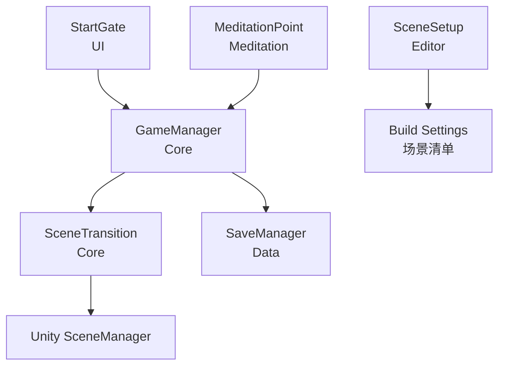
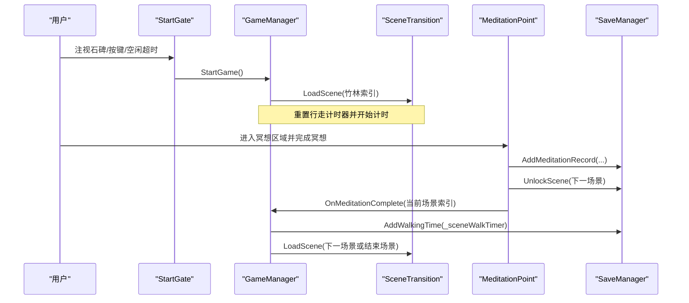
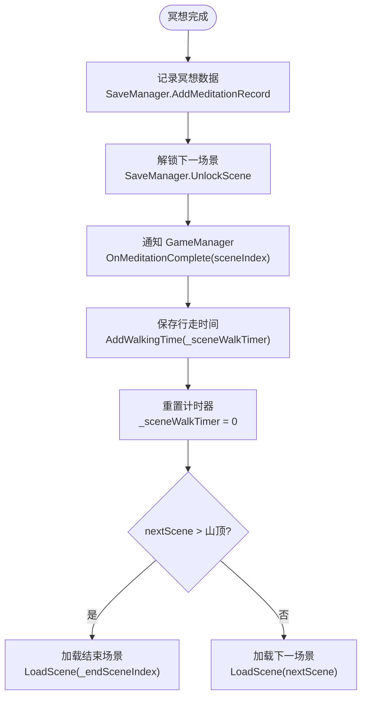
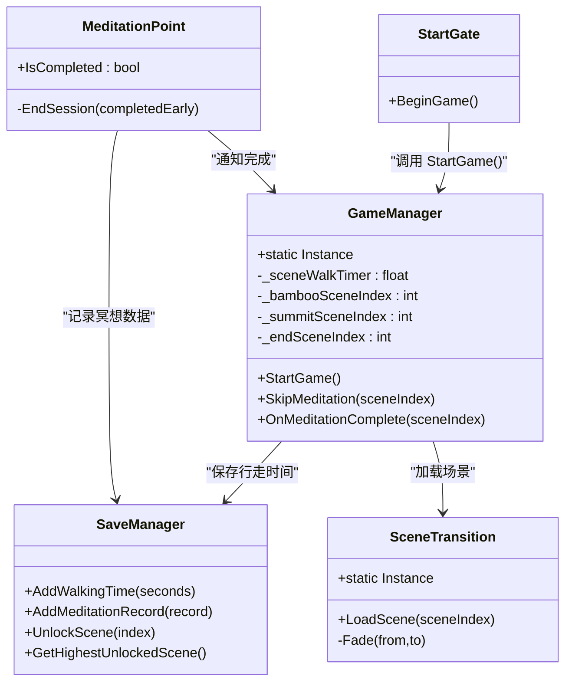
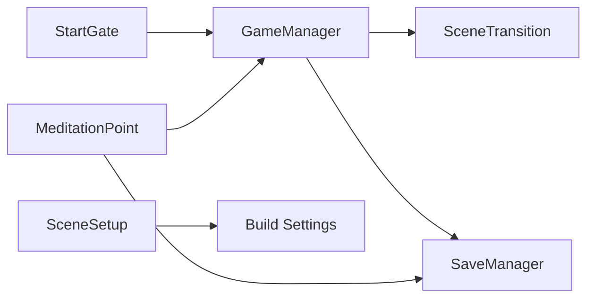

# 游戏管理器

<cite>
**本文引用的文件**
- [Assets/Scripts/Core/GameManager.cs](file://Assets/Scripts/Core/GameManager.cs)
- [Assets/Scripts/Data/SaveManager.cs](file://Assets/Scripts/Data/SaveManager.cs)
- [Assets/Scripts/Core/SceneTransition.cs](file://Assets/Scripts/Core/SceneTransition.cs)
- [Assets/Scripts/Meditation/MeditationPoint.cs](file://Assets/Scripts/Meditation/MeditationPoint.cs)
- [Assets/Scripts/UI/StartGate.cs](file://Assets/Scripts/UI/StartGate.cs)
- [Assets/Editor/SceneSetup.cs](file://Assets/Editor/SceneSetup.cs)
</cite>

## 目录
1. [简介](#简介)
2. [项目结构](#项目结构)
3. [核心组件](#核心组件)
4. [架构总览](#架构总览)
5. [详细组件分析](#详细组件分析)
6. [依赖关系分析](#依赖关系分析)
7. [性能考量](#性能考量)
8. [故障排查指南](#故障排查指南)
9. [结论](#结论)
10. [附录：扩展新场景类型指南](#附录：扩展新场景类型指南)

## 简介
本技术文档围绕 InkRidge 的“游戏管理器”展开，聚焦以下目标：
- 单例模式的实现机制与线程安全访问策略，以及 DontDestroyOnLoad 的生命周期管理。
- 场景索引管理系统（竹林、山顶、结束场景）的配置与流转逻辑。
- 冥想完成流程中的时间追踪机制，包括 _sceneWalkTimer 的累加逻辑与 SaveManager 集成。
- StartGame 与 SkipMeditation 方法的设计模式与调用时机。
- GameManager 与其他核心组件的交互关系图，以及扩展新场景类型的实践指导。
- 提供实际代码示例路径，展示如何正确使用 GameManager 进行场景控制与状态管理。

## 项目结构
InkRidge 采用按功能域划分的脚本组织方式：
- Core：全局管理与跨场景持久化（GameManager、SceneTransition）。
- Data：本地存档与统计（SaveManager）。
- Meditation：冥想点与呼吸引导（MeditationPoint、BreathData）。
- UI：启动门与提示（StartGate）。
- Environment：场景构建器（BambooSceneBuilder、SummitSceneBuilder 等）。
- Editor：编辑器辅助工具（SceneSetup 负责将关键场景加入 Build Settings）。

图表来源
- [Assets/Scripts/UI/StartGate.cs:102-109](file://Assets/Scripts/UI/StartGate.cs#L102-L109)
- [Assets/Scripts/Core/GameManager.cs:12-63](file://Assets/Scripts/Core/GameManager.cs#L12-L63)
- [Assets/Scripts/Core/SceneTransition.cs:17-44](file://Assets/Scripts/Core/SceneTransition.cs#L17-L44)
- [Assets/Scripts/Data/SaveManager.cs:83-88](file://Assets/Scripts/Data/SaveManager.cs#L83-L88)
- [Assets/Scripts/Meditation/MeditationPoint.cs:270-280](file://Assets/Scripts/Meditation/MeditationPoint.cs#L270-L280)
- [Assets/Editor/SceneSetup.cs:52-70](file://Assets/Editor/SceneSetup.cs#L52-L70)

章节来源
- [Assets/Editor/SceneSetup.cs:52-70](file://Assets/Editor/SceneSetup.cs#L52-L70)

## 核心组件
- GameManager：全局单例，负责场景流、行走时间追踪、冥想完成处理。
- SceneTransition：异步场景加载与黑场淡入淡出过渡。
- SaveManager：本地 JSON 存档，记录冥想数据、累计步行时间、解锁进度、每日打卡等。
- MeditationPoint：冥想点控制器，完成或取消时记录数据并通知 GameManager。
- StartGate：启动门，支持注视确认、按键触发与空闲自动开始，调用 GameManager.StartGame。

章节来源
- [Assets/Scripts/Core/GameManager.cs:10-63](file://Assets/Scripts/Core/GameManager.cs#L10-L63)
- [Assets/Scripts/Core/SceneTransition.cs:10-44](file://Assets/Scripts/Core/SceneTransition.cs#L10-L44)
- [Assets/Scripts/Data/SaveManager.cs:13-88](file://Assets/Scripts/Data/SaveManager.cs#L13-L88)
- [Assets/Scripts/Meditation/MeditationPoint.cs:270-346](file://Assets/Scripts/Meditation/MeditationPoint.cs#L270-L346)
- [Assets/Scripts/UI/StartGate.cs:17-109](file://Assets/Scripts/UI/StartGate.cs#L17-L109)

## 架构总览
下图展示了从启动到冥想完成再到场景切换的整体流程，以及各组件之间的协作关系。

图表来源
- [Assets/Scripts/UI/StartGate.cs:102-109](file://Assets/Scripts/UI/StartGate.cs#L102-L109)
- [Assets/Scripts/Core/GameManager.cs:21-63](file://Assets/Scripts/Core/GameManager.cs#L21-L63)
- [Assets/Scripts/Core/SceneTransition.cs:30-44](file://Assets/Scripts/Core/SceneTransition.cs#L30-L44)
- [Assets/Scripts/Meditation/MeditationPoint.cs:270-280](file://Assets/Scripts/Meditation/MeditationPoint.cs#L270-L280)
- [Assets/Scripts/Data/SaveManager.cs:59-88](file://Assets/Scripts/Data/SaveManager.cs#L59-L88)

## 详细组件分析

### GameManager：单例与生命周期
- 单例实现：通过静态属性 Instance 暴露唯一实例；Awake 中判断是否已存在实例，若不存在则赋值并调用 DontDestroyOnLoad，否则销毁重复对象。
- 线程安全说明：Instance 为只读属性且仅在 Awake 中写入，Unity 主线程执行，无并发写入风险；读取为只读访问，满足单例访问的线程安全需求。
- 生命周期管理：DontDestroyOnLoad 确保 GameManager 在场景切换时不被销毁，从而保持全局状态（如行走时间）跨场景持续。

章节来源
- [Assets/Scripts/Core/GameManager.cs:12-32](file://Assets/Scripts/Core/GameManager.cs#L12-L32)

### 场景索引管理系统
- 配置位置：GameManager 中通过序列化字段声明三个场景索引：_bambooSceneIndex、_summitSceneIndex、_endSceneIndex。
- 默认值与构建顺序：这些索引对应 Unity Build Settings 中的场景顺序。编辑器脚本 SceneSetup 会将 00_Start、01_Bamboo、02_Waterfall、03_Pavilion、04_Summit、99_End 加入构建列表，保证索引稳定。
- 流转规则：
  - StartGame：重置行走计时器并加载竹林场景（_bambooSceneIndex）。
  - OnMeditationComplete：保存本次行走时间，计算 nextScene = sceneIndex + 1；若超过山顶场景索引则跳转至结束场景（_endSceneIndex）。
  - SkipMeditation：跳过当前冥想，直接跳转到下一场景或结束场景。

章节来源
- [Assets/Scripts/Core/GameManager.cs:14-17](file://Assets/Scripts/Core/GameManager.cs#L14-L17)
- [Assets/Scripts/Core/GameManager.cs:39-63](file://Assets/Scripts/Core/GameManager.cs#L39-L63)
- [Assets/Editor/SceneSetup.cs:52-70](file://Assets/Editor/SceneSetup.cs#L52-L70)

### 冥想完成流程与时间追踪
- 时间追踪：Update 中每帧累加 Time.deltaTime 到 _sceneWalkTimer，用于统计玩家在当前场景的行走时长。
- 完成回调：MeditationPoint 完成冥想后调用 SaveManager.AddMeditationRecord 与 UnlockScene，再调用 GameManager.OnMeditationComplete。
- SaveManager 集成：OnMeditationComplete 内部调用 SaveManager.AddWalkingTime(_sceneWalkTimer)，并将 _sceneWalkTimer 归零，随后根据规则决定下一场景并加载。

图表来源
- [Assets/Scripts/Meditation/MeditationPoint.cs:270-280](file://Assets/Scripts/Meditation/MeditationPoint.cs#L270-L280)
- [Assets/Scripts/Core/GameManager.cs:34-49](file://Assets/Scripts/Core/GameManager.cs#L34-L49)
- [Assets/Scripts/Data/SaveManager.cs:59-88](file://Assets/Scripts/Data/SaveManager.cs#L59-L88)

章节来源
- [Assets/Scripts/Core/GameManager.cs:34-49](file://Assets/Scripts/Core/GameManager.cs#L34-L49)
- [Assets/Scripts/Meditation/MeditationPoint.cs:270-280](file://Assets/Scripts/Meditation/MeditationPoint.cs#L270-L280)
- [Assets/Scripts/Data/SaveManager.cs:59-88](file://Assets/Scripts/Data/SaveManager.cs#L59-L88)

### StartGame 与 SkipMeditation 设计模式与调用时机
- StartGame：
  - 设计模式：命令式入口，重置全局状态（行走计时器），并通过 SceneTransition 异步加载起始场景。
  - 调用时机：由 StartGate 在注视确认、按键触发或空闲自动开始时调用。
- SkipMeditation：
  - 设计模式：快捷跳转，跳过当前冥想，依据规则计算下一场景并加载。
  - 调用时机：可在需要快速推进流程时调用（例如调试或跳过特定场景）。

章节来源
- [Assets/Scripts/Core/GameManager.cs:51-63](file://Assets/Scripts/Core/GameManager.cs#L51-L63)
- [Assets/Scripts/UI/StartGate.cs:102-109](file://Assets/Scripts/UI/StartGate.cs#L102-L109)

### 与核心组件的交互关系图

图表来源
- [Assets/Scripts/Core/GameManager.cs:12-63](file://Assets/Scripts/Core/GameManager.cs#L12-L63)
- [Assets/Scripts/Core/SceneTransition.cs:12-44](file://Assets/Scripts/Core/SceneTransition.cs#L12-L44)
- [Assets/Scripts/Data/SaveManager.cs:59-88](file://Assets/Scripts/Data/SaveManager.cs#L59-L88)
- [Assets/Scripts/Meditation/MeditationPoint.cs:270-346](file://Assets/Scripts/Meditation/MeditationPoint.cs#L270-L346)
- [Assets/Scripts/UI/StartGate.cs:102-109](file://Assets/Scripts/UI/StartGate.cs#L102-L109)

## 依赖关系分析
- GameManager 依赖：
  - SceneTransition：用于场景切换与过渡效果。
  - SaveManager：用于持久化行走时间与统计数据。
- MeditationPoint 依赖：
  - SaveManager：记录冥想数据与解锁场景。
  - GameManager：通知完成以推进流程。
- StartGate 依赖：
  - GameManager：触发游戏开始。
- 编辑器依赖：
  - SceneSetup：确保关键场景在 Build Settings 中，保障索引一致性。

图表来源
- [Assets/Scripts/UI/StartGate.cs:102-109](file://Assets/Scripts/UI/StartGate.cs#L102-L109)
- [Assets/Scripts/Core/GameManager.cs:12-63](file://Assets/Scripts/Core/GameManager.cs#L12-L63)
- [Assets/Scripts/Core/SceneTransition.cs:12-44](file://Assets/Scripts/Core/SceneTransition.cs#L12-L44)
- [Assets/Scripts/Data/SaveManager.cs:59-88](file://Assets/Scripts/Data/SaveManager.cs#L59-L88)
- [Assets/Scripts/Meditation/MeditationPoint.cs:270-280](file://Assets/Scripts/Meditation/MeditationPoint.cs#L270-L280)
- [Assets/Editor/SceneSetup.cs:52-70](file://Assets/Editor/SceneSetup.cs#L52-L70)

章节来源
- [Assets/Editor/SceneSetup.cs:52-70](file://Assets/Editor/SceneSetup.cs#L52-L70)

## 性能考量
- 单例初始化：Awake 中仅一次赋值与 DontDestroyOnLoad，开销极低。
- Update 计时：每帧累加 Time.deltaTime，属于轻量操作；如需更精确可考虑使用高精度计时器，但当前精度足以满足冥想时长统计。
- 场景加载：SceneTransition 使用异步加载与淡入淡出，避免卡顿；注意避免频繁切换场景导致资源加载压力。
- 存档写入：SaveManager 在冥想完成与步行结束时写入 JSON，频率低，I/O 开销可控。

[本节为通用性能建议，不直接分析具体文件]

## 故障排查指南
- 单例重复：若出现多个 GameManager，检查是否存在多场景同时包含 GameManager 且未正确销毁重复实例。
- 场景无法加载：确认 Build Settings 中包含目标场景，且索引与 GameManager 配置一致；可通过 SceneSetup 重新生成构建列表。
- 时间未保存：检查 OnMeditationComplete 是否被调用，以及 SaveManager.AddWalkingTime 是否成功执行；查看控制台错误日志。
- 冥想未完成：确认 MeditationPoint 的完成条件与 BreathGuide 的状态；检查 CancelMeditation 分支是否正确记录数据。

章节来源
- [Assets/Scripts/Core/GameManager.cs:21-32](file://Assets/Scripts/Core/GameManager.cs#L21-L32)
- [Assets/Scripts/Data/SaveManager.cs:29-57](file://Assets/Scripts/Data/SaveManager.cs#L29-L57)
- [Assets/Scripts/Meditation/MeditationPoint.cs:282-346](file://Assets/Scripts/Meditation/MeditationPoint.cs#L282-L346)

## 结论
GameManager 作为全局单例，统一管理场景流与行走时间，结合 SceneTransition 与 SaveManager 实现了流畅的场景切换与数据持久化。其设计简洁清晰，易于扩展与维护。通过合理的索引配置与流程控制，InkRidge 提供了稳定的冥想体验与进度管理。

[本节为总结性内容，不直接分析具体文件]

## 附录：扩展新场景类型指南
- 新增场景步骤：
  1. 创建新场景文件并放入 Assets/Scenes。
  2. 在编辑器中使用 SceneSetup 或将场景添加到 Build Settings，确保索引稳定。
  3. 在 GameManager 中更新场景索引字段（如新增中间场景需调整 _summitSceneIndex 或增加新字段）。
  4. 在 MeditationPoint 中配置新的冥想点与场景名称。
  5. 验证 StartGame、OnMeditationComplete、SkipMeditation 的流程是否符合预期。
- 注意事项：
  - 保持场景顺序与索引一致，避免跳转逻辑错误。
  - 若新增场景需要特殊行为，可在 GameManager 中扩展条件分支或使用策略模式。
  - 测试存档与解锁逻辑，确保 SaveManager 正确记录与解锁。

章节来源
- [Assets/Editor/SceneSetup.cs:52-70](file://Assets/Editor/SceneSetup.cs#L52-L70)
- [Assets/Scripts/Core/GameManager.cs:14-17](file://Assets/Scripts/Core/GameManager.cs#L14-L17)
- [Assets/Scripts/Core/GameManager.cs:39-63](file://Assets/Scripts/Core/GameManager.cs#L39-L63)