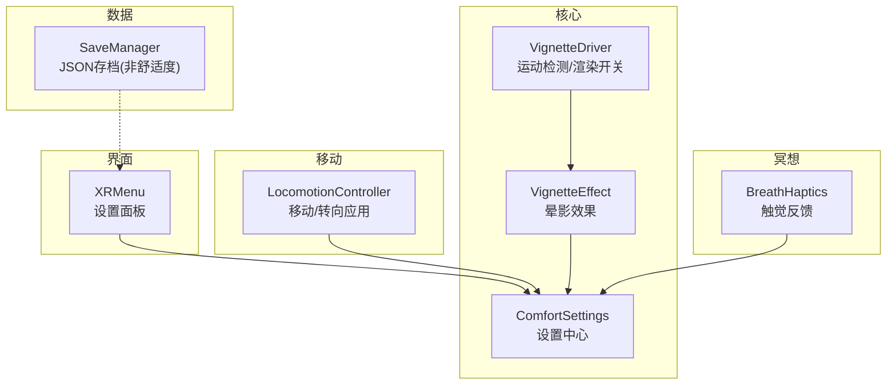
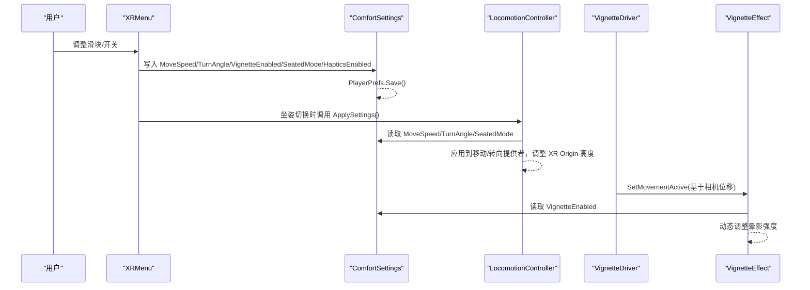
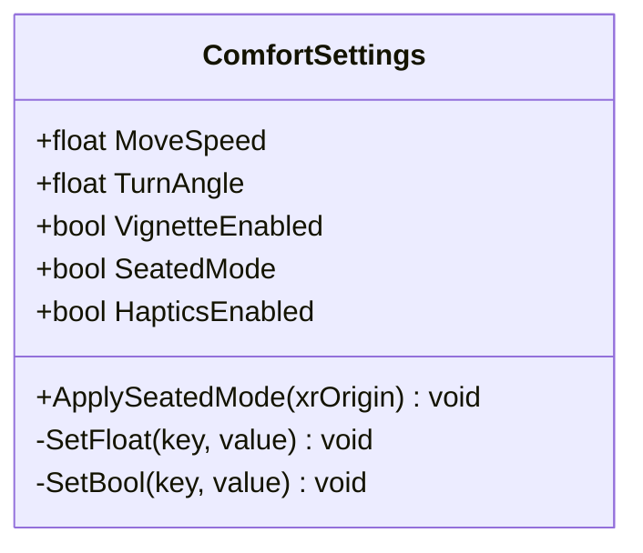
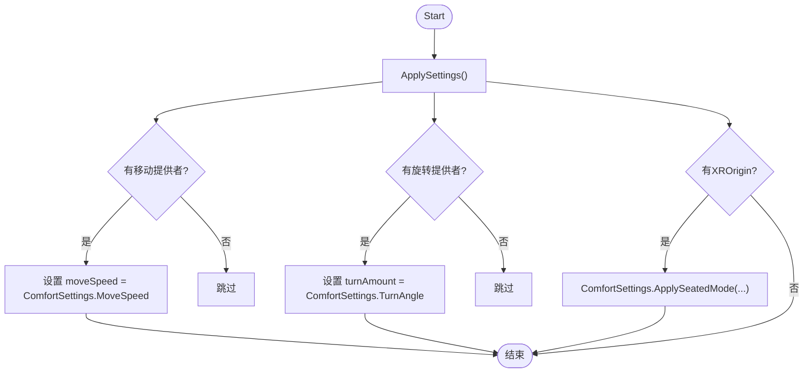
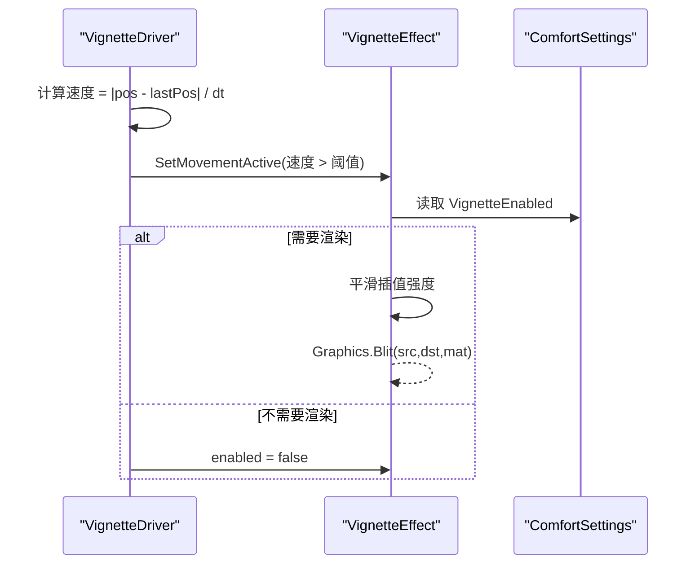
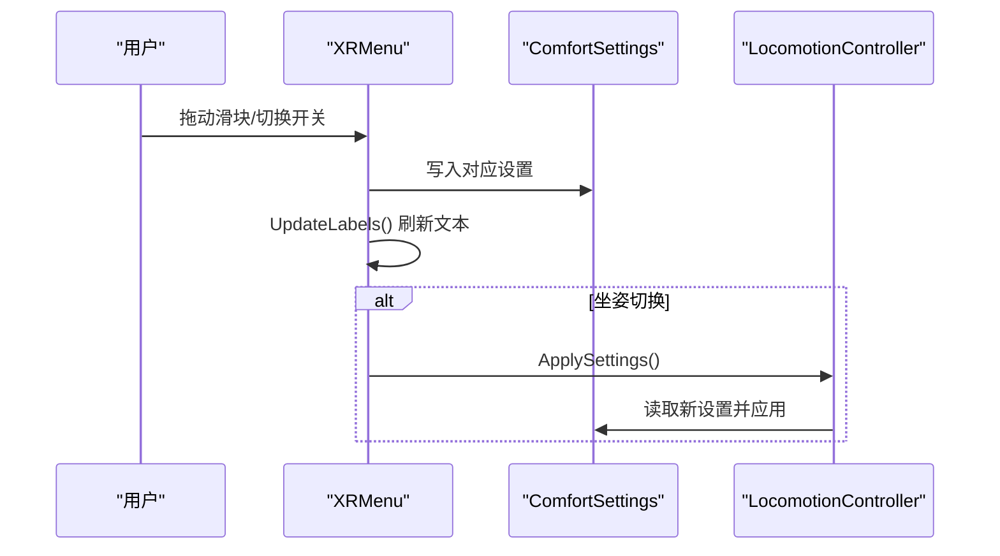
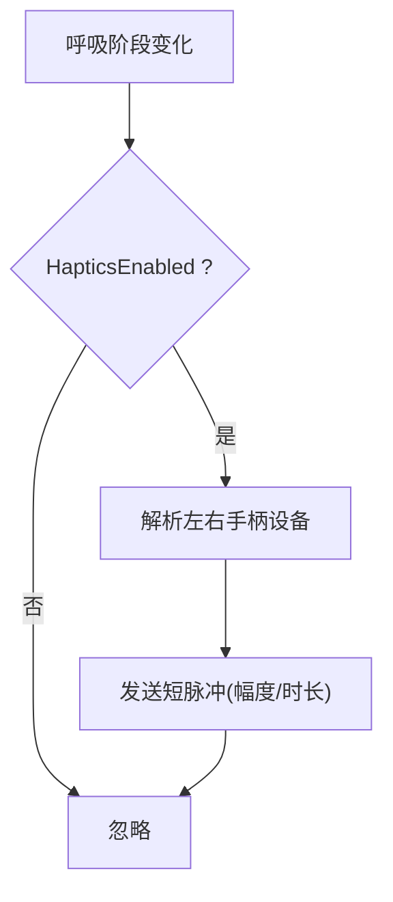
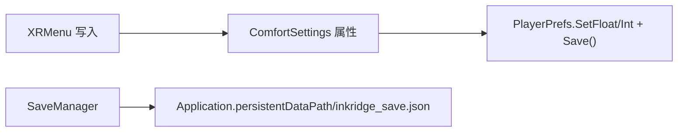
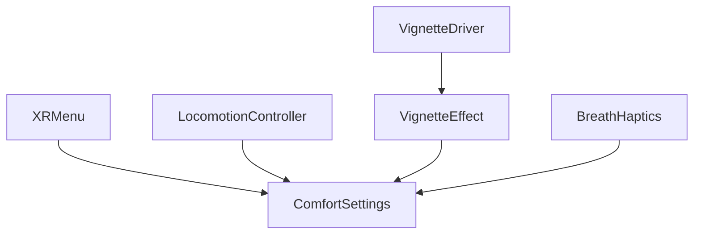

# 舒适度设置

<cite>
**本文引用的文件**
- [ComfortSettings.cs](file://Assets/Scripts/Core/ComfortSettings.cs)
- [LocomotionController.cs](file://Assets/Scripts/Movement/LocomotionController.cs)
- [VignetteEffect.cs](file://Assets/Scripts/Core/VignetteEffect.cs)
- [VignetteDriver.cs](file://Assets/Scripts/Core/VignetteDriver.cs)
- [XRMenu.cs](file://Assets/Scripts/UI/XRMenu.cs)
- [BreathHaptics.cs](file://Assets/Scripts/Meditation/BreathHaptics.cs)
- [SaveManager.cs](file://Assets/Scripts/Data/SaveManager.cs)
</cite>

## 目录
1. [简介](#简介)
2. [项目结构](#项目结构)
3. [核心组件](#核心组件)
4. [架构总览](#架构总览)
5. [详细组件分析](#详细组件分析)
6. [依赖关系分析](#依赖关系分析)
7. [性能考量](#性能考量)
8. [故障排查指南](#故障排查指南)
9. [结论](#结论)
10. [附录：扩展自定义舒适度选项](#附录：扩展自定义舒适度选项)

## 简介
本技术文档围绕 InkRidge 的“舒适度设置系统”展开，聚焦以下目标：
- 用户偏好管理的架构设计与默认值配置
- 移动舒适度的参数化调节（平滑移动速度、旋转角度、瞬移距离）
- 晕动症缓解功能（视野限制与动态模糊）
- 设置的持久化存储机制（PlayerPrefs 使用与数据序列化）
- 设置界面的数据绑定与实时预览
- 自定义舒适度选项的扩展方法（新增设置项与验证规则）

## 项目结构
与舒适度设置相关的代码主要分布在以下模块：
- Core：全局设置中心、晕影效果驱动与实现
- Movement：移动控制器，读取并应用舒适度设置
- UI：VR 内菜单，负责数据绑定与交互
- Meditation：触觉反馈，受舒适度开关控制
- Data：本地 JSON 存档（用于冥想记录等，非舒适度设置主路径）

图表来源
- [ComfortSettings.cs:1-81](file://Assets/Scripts/Core/ComfortSettings.cs#L1-L81)
- [LocomotionController.cs:1-72](file://Assets/Scripts/Movement/LocomotionController.cs#L1-L72)
- [VignetteEffect.cs:1-63](file://Assets/Scripts/Core/VignetteEffect.cs#L1-L63)
- [VignetteDriver.cs:1-62](file://Assets/Scripts/Core/VignetteDriver.cs#L1-L62)
- [XRMenu.cs:1-172](file://Assets/Scripts/UI/XRMenu.cs#L1-L172)
- [BreathHaptics.cs:1-109](file://Assets/Scripts/Meditation/BreathHaptics.cs#L1-L109)
- [SaveManager.cs:1-118](file://Assets/Scripts/Data/SaveManager.cs#L1-L118)

章节来源
- [ComfortSettings.cs:1-81](file://Assets/Scripts/Core/ComfortSettings.cs#L1-L81)
- [LocomotionController.cs:1-72](file://Assets/Scripts/Movement/LocomotionController.cs#L1-L72)
- [VignetteEffect.cs:1-63](file://Assets/Scripts/Core/VignetteEffect.cs#L1-L63)
- [VignetteDriver.cs:1-62](file://Assets/Scripts/Core/VignetteDriver.cs#L1-L62)
- [XRMenu.cs:1-172](file://Assets/Scripts/UI/XRMenu.cs#L1-L172)
- [BreathHaptics.cs:1-109](file://Assets/Scripts/Meditation/BreathHaptics.cs#L1-L109)
- [SaveManager.cs:1-118](file://Assets/Scripts/Data/SaveManager.cs#L1-L118)

## 核心组件
- 设置中心 ComfortSettings
  - 提供移动速度、旋转角度、晕影开关、坐姿模式、触觉开关等属性
  - 通过 PlayerPrefs 读写，并在每次写入后强制 Save，避免被系统回收导致丢失
  - 提供 ApplySeatedMode 调整 XR Origin 高度以适配坐姿/站姿
- 移动控制器 LocomotionController
  - 在启动时应用 ComfortSettings 到 ContinuousMoveProvider 和 SnapTurnProvider
  - 支持根据坐姿模式调整 XR Origin 高度
- 晕影效果 VignetteEffect 与驱动 VignetteDriver
  - VignetteEffect 根据是否处于移动状态与设置开关，动态调整晕影强度
  - VignetteDriver 基于相机位移计算速度，决定是否启用效果，并管理 OnRenderImage 的开销
- VR 菜单 XRMenu
  - 将 UI 控件与 ComfortSettings 双向绑定，实时更新标签显示
  - 坐姿切换时触发 LocomotionController.ApplySettings 即时生效
- 触觉反馈 BreathHaptics
  - 遵循 HapticsEnabled 开关，在呼吸阶段变化时发出短脉冲
- 存档 SaveManager
  - 负责冥想记录与统计的 JSON 持久化；舒适度设置不通过此模块保存

章节来源
- [ComfortSettings.cs:1-81](file://Assets/Scripts/Core/ComfortSettings.cs#L1-L81)
- [LocomotionController.cs:1-72](file://Assets/Scripts/Movement/LocomotionController.cs#L1-L72)
- [VignetteEffect.cs:1-63](file://Assets/Scripts/Core/VignetteEffect.cs#L1-L63)
- [VignetteDriver.cs:1-62](file://Assets/Scripts/Core/VignetteDriver.cs#L1-L62)
- [XRMenu.cs:1-172](file://Assets/Scripts/UI/XRMenu.cs#L1-L172)
- [BreathHaptics.cs:1-109](file://Assets/Scripts/Meditation/BreathHaptics.cs#L1-L109)
- [SaveManager.cs:1-118](file://Assets/Scripts/Data/SaveManager.cs#L1-L118)

## 架构总览
下图展示了从用户交互到运行时应用的完整链路：用户在 VR 菜单中调整设置，设置中心持久化存储，移动控制器与视觉效果立即读取并应用。

图表来源
- [XRMenu.cs:41-78](file://Assets/Scripts/UI/XRMenu.cs#L41-L78)
- [XRMenu.cs:134-161](file://Assets/Scripts/UI/XRMenu.cs#L134-L161)
- [ComfortSettings.cs:22-66](file://Assets/Scripts/Core/ComfortSettings.cs#L22-L66)
- [LocomotionController.cs:26-48](file://Assets/Scripts/Movement/LocomotionController.cs#L26-L48)
- [VignetteDriver.cs:42-59](file://Assets/Scripts/Core/VignetteDriver.cs#L42-L59)
- [VignetteEffect.cs:30-55](file://Assets/Scripts/Core/VignetteEffect.cs#L30-L55)

## 详细组件分析

### 设置中心 ComfortSettings
- 设计要点
  - 所有键名集中定义，便于统一管理与迁移
  - 默认值集中声明，保证首次运行体验一致
  - 每次写入都调用 PlayerPrefs.Save()，避免后台杀进程导致设置丢失
  - 提供 ApplySeatedMode 直接修改 XR Origin 高度，简化场景集成
- 关键行为
  - MoveSpeed：平滑移动速度
  - TurnAngle：SnapTurn 的旋转角度（瞬移式旋转）
  - VignetteEnabled：晕影开关
  - SeatedMode：坐姿模式开关
  - HapticsEnabled：触觉反馈开关

图表来源
- [ComfortSettings.cs:8-79](file://Assets/Scripts/Core/ComfortSettings.cs#L8-L79)

章节来源
- [ComfortSettings.cs:1-81](file://Assets/Scripts/Core/ComfortSettings.cs#L1-L81)

### 移动控制器 LocomotionController
- 职责
  - 启动时读取 ComfortSettings 并应用到移动与旋转提供者
  - 根据坐姿模式调整 XR Origin 高度
- 与舒适度参数的关系
  - MoveSpeed → 连续移动速度
  - TurnAngle → 瞬时旋转角度
  - SeatedMode → XR Origin 高度

图表来源
- [LocomotionController.cs:26-48](file://Assets/Scripts/Movement/LocomotionController.cs#L26-L48)
- [ComfortSettings.cs:68-79](file://Assets/Scripts/Core/ComfortSettings.cs#L68-L79)

章节来源
- [LocomotionController.cs:1-72](file://Assets/Scripts/Movement/LocomotionController.cs#L1-L72)
- [ComfortSettings.cs:68-79](file://Assets/Scripts/Core/ComfortSettings.cs#L68-L79)

### 晕动症缓解：晕影效果 VignetteEffect 与驱动 VignetteDriver
- VignetteEffect
  - 仅在 VignetteEnabled 为真且存在绘制需求时启用渲染
  - 根据移动状态平滑过渡晕影强度，降低边缘亮度
- VignetteDriver
  - 每帧计算相机位移速度，超过阈值则标记为“正在移动”
  - 当效果无需绘制时关闭组件，避免全屏 Blit 带来的额外开销

图表来源
- [VignetteDriver.cs:42-59](file://Assets/Scripts/Core/VignetteDriver.cs#L42-L59)
- [VignetteEffect.cs:30-55](file://Assets/Scripts/Core/VignetteEffect.cs#L30-L55)
- [ComfortSettings.cs:49-53](file://Assets/Scripts/Core/ComfortSettings.cs#L49-L53)

章节来源
- [VignetteEffect.cs:1-63](file://Assets/Scripts/Core/VignetteEffect.cs#L1-L63)
- [VignetteDriver.cs:1-62](file://Assets/Scripts/Core/VignetteDriver.cs#L1-L62)

### 设置界面 XRMenu：数据绑定与实时预览
- 数据绑定
  - 启动时将 UI 控件初始化为当前 ComfortSettings 的值
  - 监听 onValueChanged/onValueChanged，写回 ComfortSettings 并更新标签
- 实时预览
  - 移动速度与旋转角度变更立即反映到标签文本
  - 坐姿切换时调用 LocomotionController.ApplySettings 即时生效
  - 晕影与触觉开关即时影响运行时行为

图表来源
- [XRMenu.cs:41-78](file://Assets/Scripts/UI/XRMenu.cs#L41-L78)
- [XRMenu.cs:134-161](file://Assets/Scripts/UI/XRMenu.cs#L134-L161)
- [XRMenu.cs:163-169](file://Assets/Scripts/UI/XRMenu.cs#L163-L169)
- [LocomotionController.cs:26-48](file://Assets/Scripts/Movement/LocomotionController.cs#L26-L48)

章节来源
- [XRMenu.cs:1-172](file://Assets/Scripts/UI/XRMenu.cs#L1-L172)

### 触觉反馈 BreathHaptics：受舒适度开关控制
- 行为
  - 订阅呼吸阶段变化事件，按不同阶段发送不同强度的脉冲
  - 若 HapticsEnabled 为假，则完全跳过触觉输出
- 设备处理
  - 每次阶段变化时重新解析手柄设备，避免设备热插拔导致的失效

图表来源
- [BreathHaptics.cs:52-85](file://Assets/Scripts/Meditation/BreathHaptics.cs#L52-L85)
- [ComfortSettings.cs:61-66](file://Assets/Scripts/Core/ComfortSettings.cs#L61-L66)

章节来源
- [BreathHaptics.cs:1-109](file://Assets/Scripts/Meditation/BreathHaptics.cs#L1-L109)
- [ComfortSettings.cs:61-66](file://Assets/Scripts/Core/ComfortSettings.cs#L61-L66)

### 持久化存储机制：PlayerPrefs 与 JSON 存档
- 舒适度设置
  - 通过 ComfortSettings 使用 PlayerPrefs 存储，每次写入后立即 Save，确保跨会话稳定
- 其他数据
  - SaveManager 使用 JSON 文件持久化冥想记录与统计，与舒适度设置解耦

图表来源
- [ComfortSettings.cs:22-66](file://Assets/Scripts/Core/ComfortSettings.cs#L22-L66)
- [SaveManager.cs:26-57](file://Assets/Scripts/Data/SaveManager.cs#L26-L57)

章节来源
- [ComfortSettings.cs:22-66](file://Assets/Scripts/Core/ComfortSettings.cs#L22-L66)
- [SaveManager.cs:1-118](file://Assets/Scripts/Data/SaveManager.cs#L1-L118)

## 依赖关系分析
- 松耦合
  - 设置中心作为单一事实源，UI、移动、视觉、触觉均只读其公开属性
  - 各子系统通过最小接口依赖，便于替换与测试
- 潜在循环
  - 未发现循环依赖；UI 仅写设置，运行时由各自组件主动读取
- 外部依赖
  - Unity Input System、XR Interaction Toolkit、Unity XR Core Utils

图表来源
- [XRMenu.cs:41-78](file://Assets/Scripts/UI/XRMenu.cs#L41-L78)
- [LocomotionController.cs:26-48](file://Assets/Scripts/Movement/LocomotionController.cs#L26-L48)
- [VignetteEffect.cs:30-55](file://Assets/Scripts/Core/VignetteEffect.cs#L30-L55)
- [VignetteDriver.cs:42-59](file://Assets/Scripts/Core/VignetteDriver.cs#L42-L59)
- [BreathHaptics.cs:52-85](file://Assets/Scripts/Meditation/BreathHaptics.cs#L52-L85)

章节来源
- [XRMenu.cs:1-172](file://Assets/Scripts/UI/XRMenu.cs#L1-L172)
- [LocomotionController.cs:1-72](file://Assets/Scripts/Movement/LocomotionController.cs#L1-L72)
- [VignetteEffect.cs:1-63](file://Assets/Scripts/Core/VignetteEffect.cs#L1-L63)
- [VignetteDriver.cs:1-62](file://Assets/Scripts/Core/VignetteDriver.cs#L1-L62)
- [BreathHaptics.cs:1-109](file://Assets/Scripts/Meditation/BreathHaptics.cs#L1-L109)

## 性能考量
- 晕影渲染优化
  - VignetteDriver 在无绘制需求时禁用 VignetteEffect，避免每眼的全屏 Blit 开销
  - 通过位移阈值判断移动，减少不必要的效果激活
- 设置持久化
  - 每次写入即 Save，避免数据丢失，但频繁 I/O 可能带来轻微开销；当前量级可接受
- 输入与设备
  - BreathHaptics 在阶段变化时重解析设备，避免热插拔问题，同时降低每帧解析成本

[本节为通用性能讨论，不直接分析具体文件]

## 故障排查指南
- 设置未持久化
  - 检查是否在设置写入后调用了 PlayerPrefs.Save()（已在 ComfortSettings 内部实现）
  - 确认平台对后台应用回收策略，必要时在 OnApplicationQuit 再次保存
- 晕影不生效
  - 确认 VignetteEnabled 为真
  - 确认 VignetteDriver 已挂载且能检测到相机位移
  - 检查 Shader 是否存在（找不到时会禁用组件）
- 移动/旋转未应用
  - 确认 LocomotionController 已正确引用 ContinuousMoveProvider 与 SnapTurnProvider
  - 确认 XR Origin 存在且未被遮挡
- 触觉无反馈
  - 确认 HapticsEnabled 为真
  - 确认手柄设备可用（HasController 检查）
  - 确认呼吸阶段事件已触发

章节来源
- [ComfortSettings.cs:22-66](file://Assets/Scripts/Core/ComfortSettings.cs#L22-L66)
- [VignetteEffect.cs:34-44](file://Assets/Scripts/Core/VignetteEffect.cs#L34-L44)
- [VignetteDriver.cs:32-40](file://Assets/Scripts/Core/VignetteDriver.cs#L32-L40)
- [LocomotionController.cs:26-48](file://Assets/Scripts/Movement/LocomotionController.cs#L26-L48)
- [BreathHaptics.cs:87-106](file://Assets/Scripts/Meditation/BreathHaptics.cs#L87-L106)

## 结论
InkRidge 的舒适度设置系统以 ComfortSettings 为中心，采用简洁清晰的职责划分：UI 负责交互与绑定，运行时组件按需读取并应用设置；晕影效果通过驱动层智能控制渲染开销；触觉反馈遵循开关逻辑。整体架构低耦合、易扩展，适合持续迭代与平台适配。

[本节为总结性内容，不直接分析具体文件]

## 附录：扩展自定义舒适度选项
- 新增设置项步骤
  - 在 ComfortSettings 中添加新的键名与默认值，并提供属性访问器（含 PlayerPrefs 读写与 Save）
  - 在 XRMenu 中添加对应的 UI 控件与回调，完成数据绑定与标签更新
  - 在相关运行时组件（如移动、视觉、触觉）中读取新设置并应用
- 验证规则建议
  - 在 UI 层对输入进行范围校验（例如速度、角度、强度）
  - 在设置写入前进行边界裁剪，避免非法值进入持久化
  - 对关键设置增加“重置为默认”能力，便于恢复
- 示例参考路径
  - 新增属性与默认值：[ComfortSettings.cs:10-20](file://Assets/Scripts/Core/ComfortSettings.cs#L10-L20)
  - 属性读写封装：[ComfortSettings.cs:22-66](file://Assets/Scripts/Core/ComfortSettings.cs#L22-L66)
  - UI 绑定与回调：[XRMenu.cs:41-78](file://Assets/Scripts/UI/XRMenu.cs#L41-L78)、[XRMenu.cs:134-161](file://Assets/Scripts/UI/XRMenu.cs#L134-L161)
  - 运行时应用：[LocomotionController.cs:26-48](file://Assets/Scripts/Movement/LocomotionController.cs#L26-L48)、[VignetteEffect.cs:30-55](file://Assets/Scripts/Core/VignetteEffect.cs#L30-L55)、[BreathHaptics.cs:52-85](file://Assets/Scripts/Meditation/BreathHaptics.cs#L52-L85)

章节来源
- [ComfortSettings.cs:10-66](file://Assets/Scripts/Core/ComfortSettings.cs#L10-L66)
- [XRMenu.cs:41-78](file://Assets/Scripts/UI/XRMenu.cs#L41-L78)
- [XRMenu.cs:134-161](file://Assets/Scripts/UI/XRMenu.cs#L134-L161)
- [LocomotionController.cs:26-48](file://Assets/Scripts/Movement/LocomotionController.cs#L26-L48)
- [VignetteEffect.cs:30-55](file://Assets/Scripts/Core/VignetteEffect.cs#L30-L55)
- [BreathHaptics.cs:52-85](file://Assets/Scripts/Meditation/BreathHaptics.cs#L52-L85)