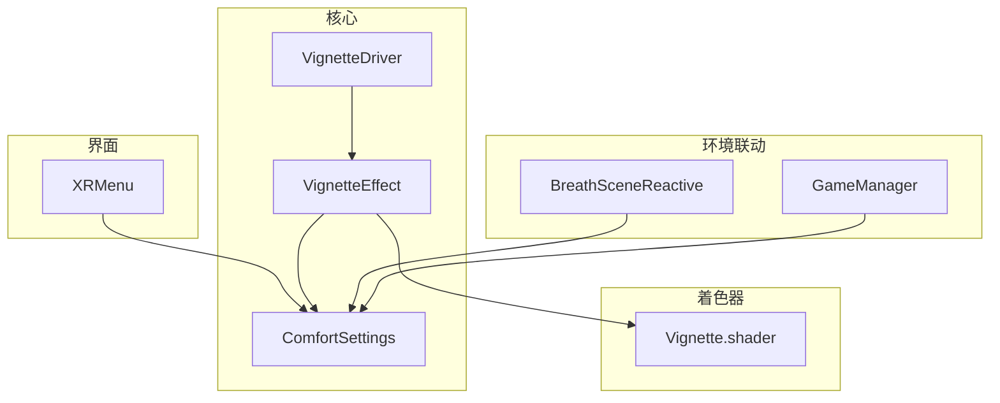
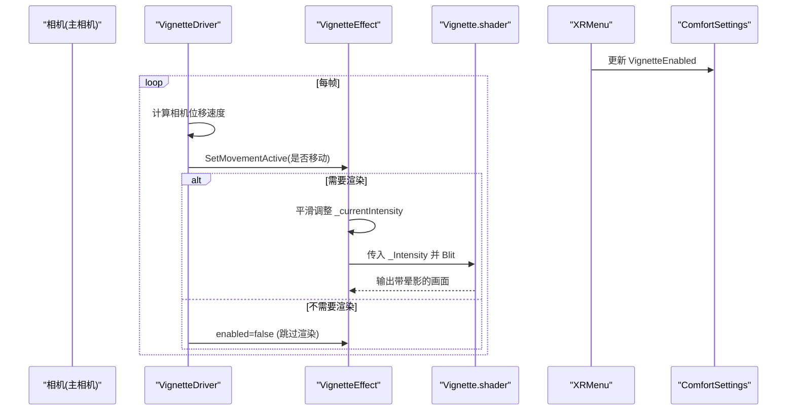
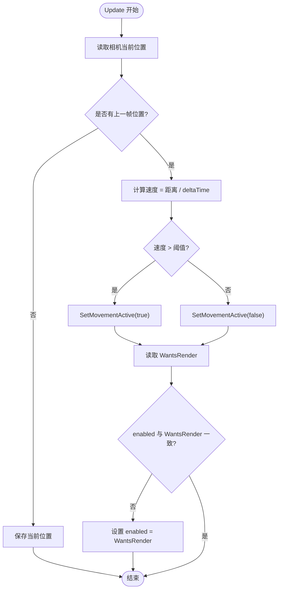
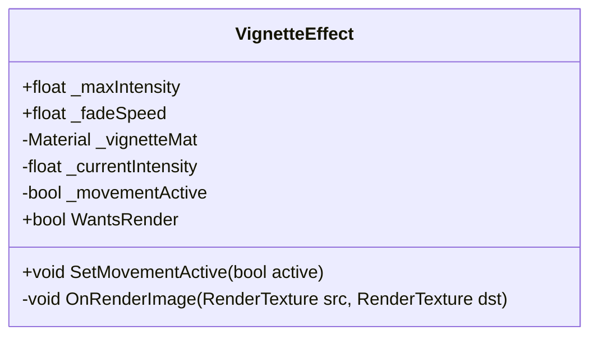
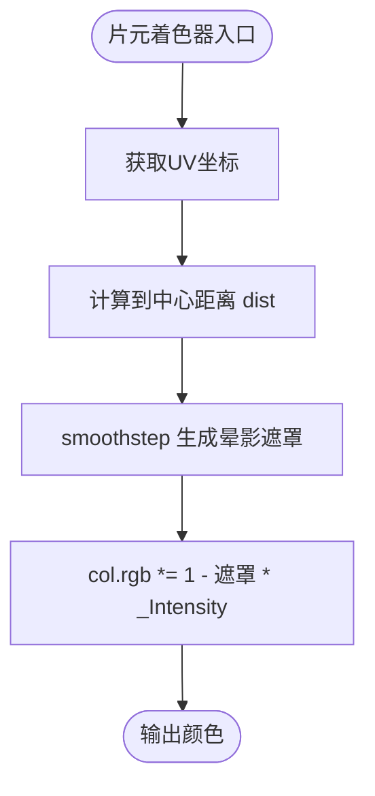
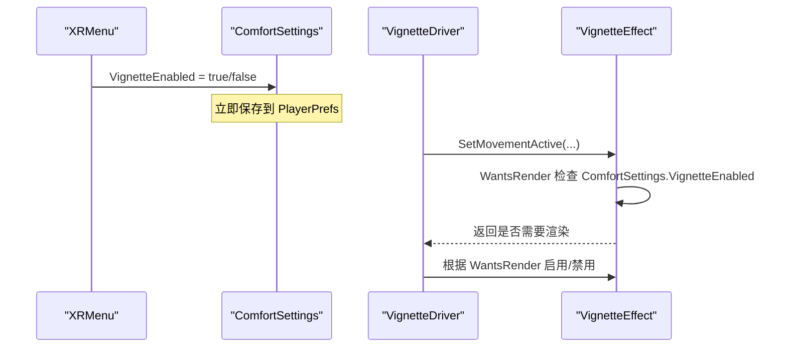
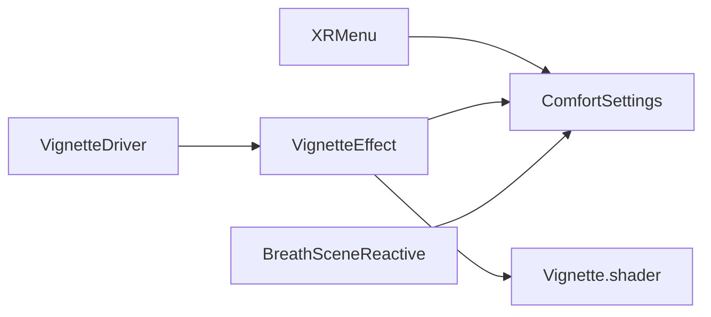

# 晕影驱动系统

<cite>
**本文引用的文件**
- [VignetteDriver.cs](file://Assets/Scripts/Core/VignetteDriver.cs)
- [VignetteEffect.cs](file://Assets/Scripts/Core/VignetteEffect.cs)
- [Vignette.shader](file://Assets/Shaders/Vignette.shader)
- [ComfortSettings.cs](file://Assets/Scripts/Core/ComfortSettings.cs)
- [XRMenu.cs](file://Assets/Scripts/UI/XRMenu.cs)
- [BreathSceneReactive.cs](file://Assets/Scripts/Core/BreathSceneReactive.cs)
- [GameManager.cs](file://Assets/Scripts/Core/GameManager.cs)
</cite>

## 目录
1. [简介](#简介)
2. [项目结构](#项目结构)
3. [核心组件](#核心组件)
4. [架构总览](#架构总览)
5. [详细组件分析](#详细组件分析)
6. [依赖关系分析](#依赖关系分析)
7. [性能考量](#性能考量)
8. [故障排查指南](#故障排查指南)
9. [结论](#结论)
10. [附录](#附录)

## 简介
本文件聚焦于“晕影驱动系统”，即通过相机后处理在VR中提供运动相关的视觉舒适效果。系统在玩家移动时自动增强屏幕边缘暗角（晕影），并在静止时平滑淡出，从而降低VR中的不适感。该系统的核心由“驱动”与“效果”两部分组成：驱动负责检测移动并控制渲染开关；效果负责执行实际的图像后处理。同时，系统通过全局设置项支持用户开关，并与场景呼吸联动、UI菜单交互等模块协同工作。

## 项目结构
与晕影驱动系统直接相关的代码与资源分布如下：
- 脚本层
  - Core：VignetteDriver、VignetteEffect、ComfortSettings、BreathSceneReactive、GameManager
  - UI：XRMenu（用于在VR中切换晕影开关）
- 着色器层
  - Shaders：Vignette.shader（隐藏的全屏后处理着色器）

图表来源
- [VignetteDriver.cs:1-62](file://Assets/Scripts/Core/VignetteDriver.cs#L1-L62)
- [VignetteEffect.cs:1-63](file://Assets/Scripts/Core/VignetteEffect.cs#L1-L63)
- [ComfortSettings.cs:1-81](file://Assets/Scripts/Core/ComfortSettings.cs#L1-L81)
- [XRMenu.cs:1-172](file://Assets/Scripts/UI/XRMenu.cs#L1-L172)
- [BreathSceneReactive.cs:1-147](file://Assets/Scripts/Core/BreathSceneReactive.cs#L1-L147)
- [GameManager.cs:1-66](file://Assets/Scripts/Core/GameManager.cs#L1-L66)

章节来源
- [VignetteDriver.cs:1-62](file://Assets/Scripts/Core/VignetteDriver.cs#L1-L62)
- [VignetteEffect.cs:1-63](file://Assets/Scripts/Core/VignetteEffect.cs#L1-L63)
- [ComfortSettings.cs:1-81](file://Assets/Scripts/Core/ComfortSettings.cs#L1-L81)
- [XRMenu.cs:1-172](file://Assets/Scripts/UI/XRMenu.cs#L1-L172)
- [BreathSceneReactive.cs:1-147](file://Assets/Scripts/Core/BreathSceneReactive.cs#L1-L147)
- [GameManager.cs:1-66](file://Assets/Scripts/Core/GameManager.cs#L1-L66)

## 核心组件
- VignetteDriver：始终运行的驱动组件，负责检测相机位移速度，判断是否处于移动状态，并将结果传递给效果组件；同时根据是否需要渲染来启用/禁用效果组件，避免无意义的渲染开销。
- VignetteEffect：挂载在相机上的后处理组件，使用隐藏着色器对画面进行全屏采样并根据强度参数绘制晕影；维护当前强度值以实现平滑过渡。
- ComfortSettings：全局静态配置，持久化存储用户偏好（包括是否启用晕影）。
- XRMenu：VR内设置面板，允许用户在运行时切换晕影开关。
- BreathSceneReactive：场景呼吸响应组件，与晕影系统共享“开启/关闭”的偏好开关，但不直接改变晕影强度。
- GameManager：全局游戏管理器，管理场景流程与计时，间接影响整体体验。

章节来源
- [VignetteDriver.cs:1-62](file://Assets/Scripts/Core/VignetteDriver.cs#L1-L62)
- [VignetteEffect.cs:1-63](file://Assets/Scripts/Core/VignetteEffect.cs#L1-L63)
- [ComfortSettings.cs:1-81](file://Assets/Scripts/Core/ComfortSettings.cs#L1-L81)
- [XRMenu.cs:1-172](file://Assets/Scripts/UI/XRMenu.cs#L1-L172)
- [BreathSceneReactive.cs:1-147](file://Assets/Scripts/Core/BreathSceneReactive.cs#L1-L147)
- [GameManager.cs:1-66](file://Assets/Scripts/Core/GameManager.cs#L1-L66)

## 架构总览
晕影驱动系统采用“驱动-效果”解耦设计：驱动只关心“何时需要渲染”，效果只关心“如何渲染”。两者通过简单接口协作，并通过全局设置项统一控制开关。

图表来源
- [VignetteDriver.cs:42-59](file://Assets/Scripts/Core/VignetteDriver.cs#L42-L59)
- [VignetteEffect.cs:34-55](file://Assets/Scripts/Core/VignetteEffect.cs#L34-L55)
- [Vignette.shader:14-59](file://Assets/Shaders/Vignette.shader#L14-L59)
- [XRMenu.cs:146-149](file://Assets/Scripts/UI/XRMenu.cs#L146-L149)
- [ComfortSettings.cs:49-53](file://Assets/Scripts/Core/ComfortSettings.cs#L49-L53)

## 详细组件分析

### VignetteDriver（驱动）
职责
- 检测移动：基于相机世界位置变化计算瞬时速度，超过阈值即视为移动。
- 控制渲染：将移动状态传给效果组件；当效果无需渲染时禁用自身，避免OnRenderImage带来的全屏Blit开销。

关键实现要点
- 使用最近两帧位置差除以时间增量估算速度，避免绝对位移导致的误判。
- 读取效果的WantsRender属性，动态启用/禁用效果组件，确保无渲染时完全跳过。

图表来源
- [VignetteDriver.cs:42-59](file://Assets/Scripts/Core/VignetteDriver.cs#L42-L59)

章节来源
- [VignetteDriver.cs:1-62](file://Assets/Scripts/Core/VignetteDriver.cs#L1-L62)

### VignetteEffect（效果）
职责
- 后处理渲染：在OnRenderImage中根据当前强度对输入纹理进行采样，叠加晕影。
- 强度平滑：在移动激活时趋向最大强度，否则衰减至0，避免突变。
- 渲染决策：暴露WantsRender，供驱动判断是否需要继续渲染。

关键实现要点
- 使用隐藏着色器“Hidden/Vignette”，通过材质属性_Intensity控制晕影强度。
- 当WantsRender为false时，驱动会禁用该组件，从而彻底移除每眼的全屏Blit。

图表来源
- [VignetteEffect.cs:1-63](file://Assets/Scripts/Core/VignetteEffect.cs#L1-L63)

章节来源
- [VignetteEffect.cs:1-63](file://Assets/Scripts/Core/VignetteEffect.cs#L1-L63)

### Vignette.shader（着色器）
职责
- 计算像素到屏幕中心的距离，按强度对边缘颜色进行变暗，形成晕影。

关键实现要点
- 使用smoothstep在中心到角落之间做平滑过渡。
- 通过_MainTex采样原图，乘以(1 - vignette * _Intensity)得到最终颜色。

图表来源
- [Vignette.shader:44-57](file://Assets/Shaders/Vignette.shader#L44-L57)

章节来源
- [Vignette.shader:1-62](file://Assets/Shaders/Vignette.shader#L1-L62)

### ComfortSettings 与 XRMenu（设置与UI）
职责
- ComfortSettings：集中管理VR舒适度相关设置，包括晕影开关，并持久化到PlayerPrefs。
- XRMenu：在VR中提供可交互的设置面板，允许用户实时切换晕影开关。

交互流程
- 用户在XRMenu中切换晕影开关 → 写入ComfortSettings.VignetteEnabled → 驱动/效果在下一次帧读取该值决定是否渲染。

图表来源
- [XRMenu.cs:146-149](file://Assets/Scripts/UI/XRMenu.cs#L146-L149)
- [ComfortSettings.cs:49-53](file://Assets/Scripts/Core/ComfortSettings.cs#L49-L53)
- [VignetteEffect.cs:30-32](file://Assets/Scripts/Core/VignetteEffect.cs#L30-L32)
- [VignetteDriver.cs:54-59](file://Assets/Scripts/Core/VignetteDriver.cs#L54-L59)

章节来源
- [ComfortSettings.cs:1-81](file://Assets/Scripts/Core/ComfortSettings.cs#L1-L81)
- [XRMenu.cs:1-172](file://Assets/Scripts/UI/XRMenu.cs#L1-L172)

### 与场景呼吸联动的关系
BreathSceneReactive与晕影系统共享同一套“开启/关闭”的用户偏好，但各自独立运行：前者影响风、光、雾等场景元素，后者仅作用于相机后处理。二者都遵循用户的舒适度偏好，保证一致的体验。

章节来源
- [BreathSceneReactive.cs:1-147](file://Assets/Scripts/Core/BreathSceneReactive.cs#L1-L147)
- [ComfortSettings.cs:49-53](file://Assets/Scripts/Core/ComfortSettings.cs#L49-L53)

## 依赖关系分析
- VignetteDriver 依赖 VignetteEffect 提供的接口（SetMovementActive、WantsRender）。
- VignetteEffect 依赖 ComfortSettings（读取VignetteEnabled）和 Vignette.shader（执行后处理）。
- XRMenu 依赖 ComfortSettings（写入VignetteEnabled）。
- BreathSceneReactive 与晕影系统松耦合，仅共用全局设置项。

图表来源
- [VignetteDriver.cs:1-62](file://Assets/Scripts/Core/VignetteDriver.cs#L1-L62)
- [VignetteEffect.cs:1-63](file://Assets/Scripts/Core/VignetteEffect.cs#L1-L63)
- [ComfortSettings.cs:1-81](file://Assets/Scripts/Core/ComfortSettings.cs#L1-L81)
- [XRMenu.cs:1-172](file://Assets/Scripts/UI/XRMenu.cs#L1-L172)
- [BreathSceneReactive.cs:1-147](file://Assets/Scripts/Core/BreathSceneReactive.cs#L1-L147)
- [Vignette.shader:1-62](file://Assets/Shaders/Vignette.shader#L1-L62)

章节来源
- [VignetteDriver.cs:1-62](file://Assets/Scripts/Core/VignetteDriver.cs#L1-L62)
- [VignetteEffect.cs:1-63](file://Assets/Scripts/Core/VignetteEffect.cs#L1-L63)
- [ComfortSettings.cs:1-81](file://Assets/Scripts/Core/ComfortSettings.cs#L1-L81)
- [XRMenu.cs:1-172](file://Assets/Scripts/UI/XRMenu.cs#L1-L172)
- [BreathSceneReactive.cs:1-147](file://Assets/Scripts/Core/BreathSceneReactive.cs#L1-L147)
- [Vignette.shader:1-62](file://Assets/Shaders/Vignette.shader#L1-L62)

## 性能考量
- 渲染开关优化：当WantsRender为false时，驱动会禁用效果组件，从而完全跳过OnRenderImage与全屏Blit，减少每眼渲染成本。
- 强度平滑：使用线性插值平滑过渡，避免强度突变导致视觉闪烁或额外重绘。
- 移动检测阈值：通过可调阈值平衡灵敏度与稳定性，防止微小抖动触发不必要的晕影。
- 着色器复杂度：着色器仅进行单次采样与简单数学运算，LOD较低，适合移动端VR设备。

[本节为通用性能建议，不直接分析具体文件]

## 故障排查指南
常见问题与定位方法
- 晕影不生效
  - 检查ComfortSettings.VignetteEnabled是否为true（可通过XRMenu确认）。
  - 检查VignetteEffect是否成功找到着色器“Hidden/Vignette”，若未找到会禁用自身。
  - 检查VignetteDriver是否正确挂载在同一相机上，且包含VignetteEffect组件。
- 晕影一直存在或不消失
  - 检查移动阈值是否过低导致持续判定为移动。
  - 检查WantsRender逻辑：即使停止移动，强度衰减也需要时间，属正常现象。
- 性能异常
  - 确认驱动已正确禁用效果组件以跳过渲染。
  - 评估移动阈值与场景移动频率，避免高频抖动造成频繁状态切换。

章节来源
- [VignetteEffect.cs:34-45](file://Assets/Scripts/Core/VignetteEffect.cs#L34-L45)
- [VignetteDriver.cs:32-40](file://Assets/Scripts/Core/VignetteDriver.cs#L32-L40)
- [ComfortSettings.cs:49-53](file://Assets/Scripts/Core/ComfortSettings.cs#L49-L53)
- [XRMenu.cs:146-149](file://Assets/Scripts/UI/XRMenu.cs#L146-L149)

## 结论
晕影驱动系统通过“驱动-效果”分离的设计，实现了低耦合、高性能的VR运动舒适效果。驱动专注移动检测与渲染开关，效果专注后处理与强度平滑，配合全局设置与UI交互，提供了稳定且可配置的晕影体验。在实际部署中，应合理设置移动阈值与强度参数，并确保着色器可用，以获得最佳效果与性能平衡。

[本节为总结性内容，不直接分析具体文件]

## 附录
- 推荐调试步骤
  - 在编辑器中观察相机位移速度与阈值的关系，必要时调整阈值。
  - 在XR环境中测试不同移动方式（摇杆、房间尺度行走）下的晕影行为。
  - 通过控制台日志确认着色器加载与组件启用状态。

[本节为补充说明，不直接分析具体文件]