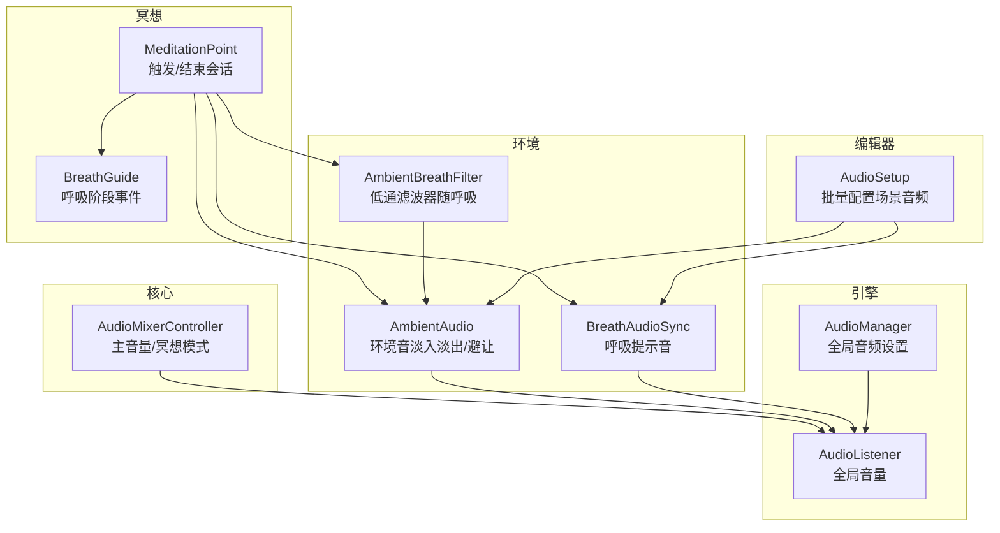
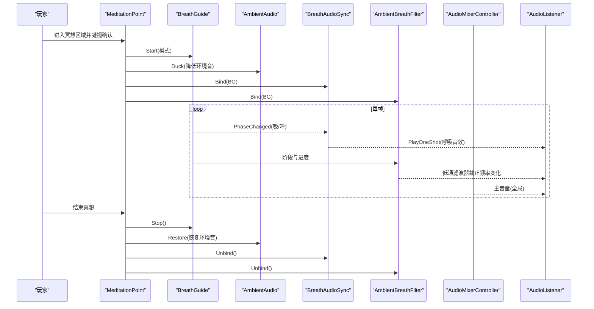
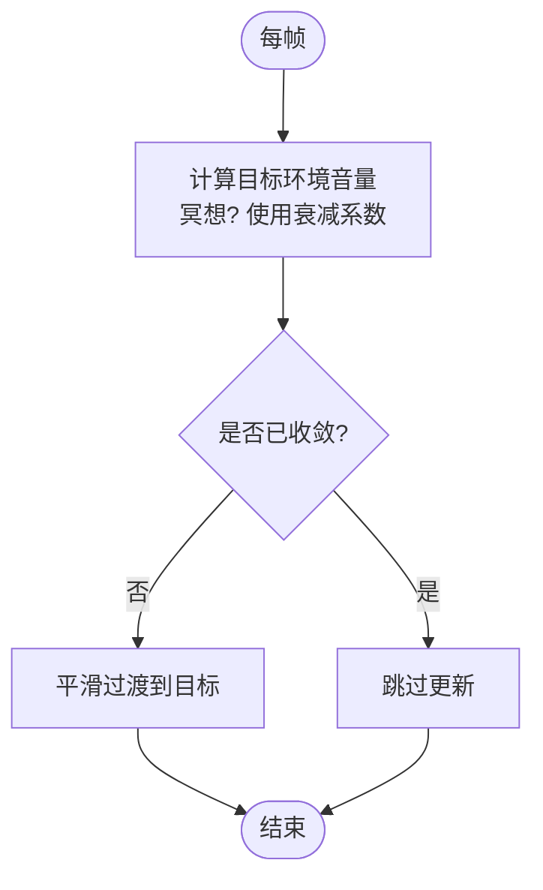
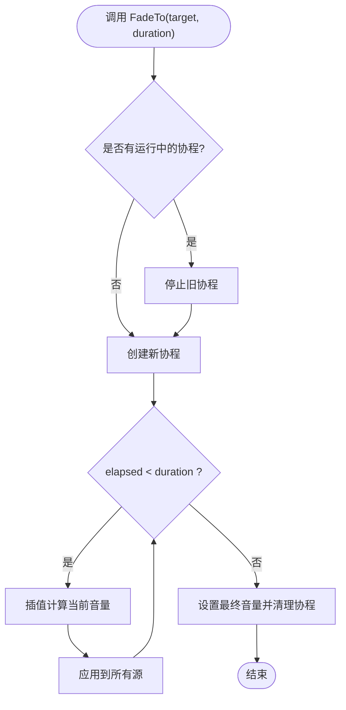
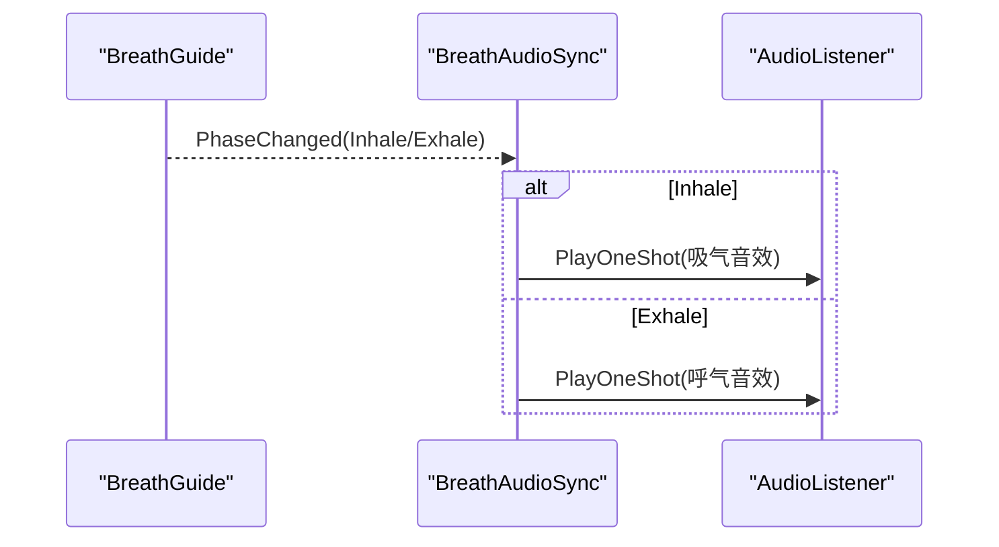
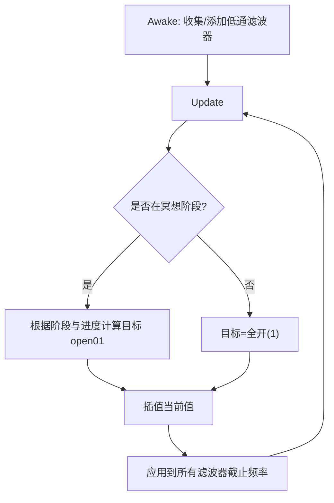
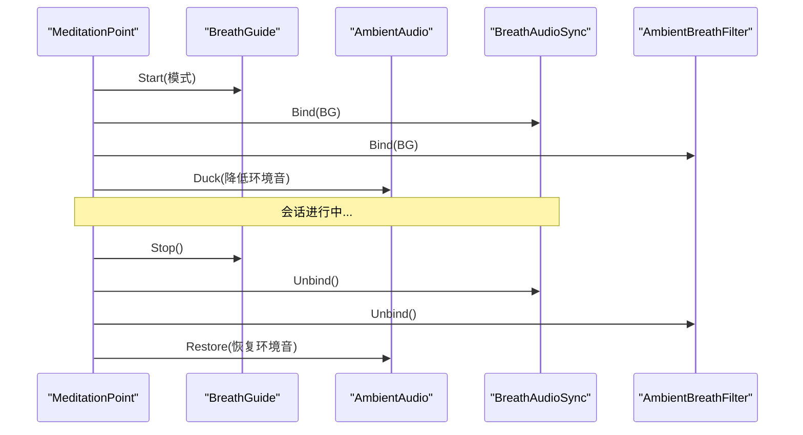
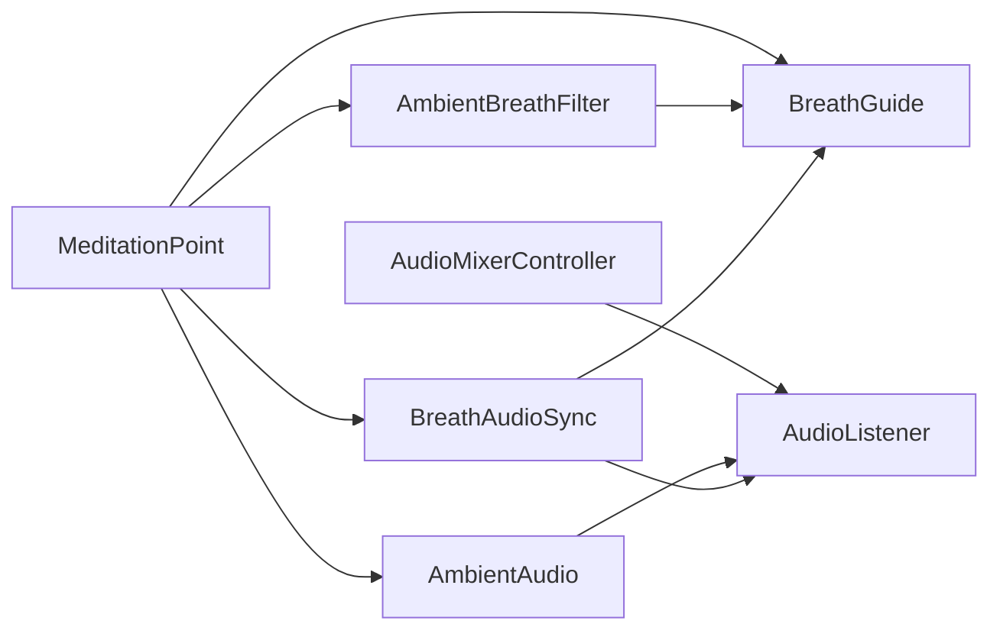

# 音频混合器控制器

<cite>
**本文引用的文件**
- [AudioMixerController.cs](file://Assets/Scripts/Core/AudioMixerController.cs)
- [AmbientAudio.cs](file://Assets/Scripts/Environment/AmbientAudio.cs)
- [BreathAudioSync.cs](file://Assets/Scripts/Environment/BreathAudioSync.cs)
- [AmbientBreathFilter.cs](file://Assets/Scripts/Environment/AmbientBreathFilter.cs)
- [BreathGuide.cs](file://Assets/Scripts/Meditation/BreathGuide.cs)
- [MeditationPoint.cs](file://Assets/Scripts/Meditation/MeditationPoint.cs)
- [AudioSetup.cs](file://Assets/Editor/AudioSetup.cs)
- [AudioManager.asset](file://ProjectSettings/AudioManager.asset)
</cite>

## 目录
1. [简介](#简介)
2. [项目结构](#项目结构)
3. [核心组件](#核心组件)
4. [架构总览](#架构总览)
5. [详细组件分析](#详细组件分析)
6. [依赖关系分析](#依赖关系分析)
7. [性能考量](#性能考量)
8. [故障排查指南](#故障排查指南)
9. [结论](#结论)
10. [附录：自定义音频效果集成指南](#附录自定义音频效果集成指南)

## 简介
本技术文档围绕 InkRidge 的音频系统，重点阐述 Unity AudioListener 与场景级 AudioSource 的封装、音量管理与动态混音策略。当前实现以“全局主音量 + 场景环境音淡入淡出 + 冥想期间环境音避让（ducking）+ 呼吸同步音效 + 低通滤波器随呼吸开合”为核心，形成一套轻量但可扩展的音频管线。文档同时提供架构图、数据流图、时序图与流程图，帮助读者理解不同轨道（环境音、用户界面声音、呼吸提示音）的独立调节方式，以及基于用户行为（进入冥想区域、呼吸阶段变化）的动态音频调整机制。

## 项目结构
音频相关代码主要分布在以下模块：
- Core：全局音频控制（主音量、冥想模式下的环境音目标值）
- Environment：场景环境音管理、呼吸同步音效、呼吸驱动的滤波器
- Meditation：呼吸节奏驱动、冥想触发点与多反馈绑定
- Editor：一键为各场景配置音频源与组件
- ProjectSettings：Unity 音频全局参数

图表来源
- [AudioMixerController.cs:10-65](file://Assets/Scripts/Core/AudioMixerController.cs#L10-L65)
- [AmbientAudio.cs:11-110](file://Assets/Scripts/Environment/AmbientAudio.cs#L11-L110)
- [BreathAudioSync.cs:16-73](file://Assets/Scripts/Environment/BreathAudioSync.cs#L16-L73)
- [AmbientBreathFilter.cs:16-87](file://Assets/Scripts/Environment/AmbientBreathFilter.cs#L16-L87)
- [BreathGuide.cs:10-171](file://Assets/Scripts/Meditation/BreathGuide.cs#L10-L171)
- [MeditationPoint.cs:19-346](file://Assets/Scripts/Meditation/MeditationPoint.cs#L19-L346)
- [AudioSetup.cs:7-112](file://Assets/Editor/AudioSetup.cs#L7-L112)
- [AudioManager.asset:4-22](file://ProjectSettings/AudioManager.asset#L4-L22)

章节来源
- [AudioMixerController.cs:10-65](file://Assets/Scripts/Core/AudioMixerController.cs#L10-L65)
- [AmbientAudio.cs:11-110](file://Assets/Scripts/Environment/AmbientAudio.cs#L11-L110)
- [BreathAudioSync.cs:16-73](file://Assets/Scripts/Environment/BreathAudioSync.cs#L16-L73)
- [AmbientBreathFilter.cs:16-87](file://Assets/Scripts/Environment/AmbientBreathFilter.cs#L16-L87)
- [BreathGuide.cs:10-171](file://Assets/Scripts/Meditation/BreathGuide.cs#L10-L171)
- [MeditationPoint.cs:19-346](file://Assets/Scripts/Meditation/MeditationPoint.cs#L19-L346)
- [AudioSetup.cs:7-112](file://Assets/Editor/AudioSetup.cs#L7-L112)
- [AudioManager.asset:4-22](file://ProjectSettings/AudioManager.asset#L4-L22)

## 核心组件
- 全局音频控制器（AudioMixerController）
  - 职责：维护主音量、SFX 音量、环境音目标音量；在冥想模式下计算环境音目标并平滑过渡；每帧避免无意义的更新。
  - 关键点：通过 AudioListener.volume 控制全局输出；使用 Lerp 平滑过渡到目标环境音量；提供 SetMeditationMode/SetMasterVolume/SetSFXVolume/SetAmbientVolume 等接口。
- 场景环境音管理器（AmbientAudio）
  - 职责：管理一组 AudioSource 的淡入淡出、播放/停止、以及在重要事件（如冥想）期间的避让（Duck）。
  - 关键点：FadeTo 内部会取消正在进行的协程以避免冲突；ApplyVolume 统一写入所有环境音源的音量；支持 FadeOutAndStop 用于场景切换。
- 呼吸同步音效（BreathAudioSync）
  - 职责：根据 BreathGuide 的阶段事件播放吸气/呼气音效；固定为 2D 空间声像，避免声像干扰。
  - 关键点：订阅 PhaseChanged 事件；PlayOneShot 播放短音效；提供 IsConfigured 校验配置。
- 呼吸驱动滤波器（AmbientBreathFilter）
  - 职责：在冥想过程中，对场景内所有 AudioSource 附加的低通滤波器进行截止频率调制，模拟“世界随呼吸开合”的效果。
  - 关键点：Awake 时扫描子对象 AudioSource 并添加/复用 AudioLowPassFilter；Update 中根据 BreathGuide 阶段与进度插值截止频率；Unbind 时恢复全开状态。
- 呼吸引导（BreathGuide）
  - 职责：定义呼吸阶段与时长模式，按帧推进阶段并广播 PhaseChanged 事件。
  - 关键点：支持多种模式（平衡、放松、箱式、自由）；记录周期数与稳定性指标；Start/Stop 均触发事件。
- 冥想触发点（MeditationPoint）
  - 职责：检测玩家进入区域、凝视确认、启动/结束冥想会话；绑定/解绑视觉、触觉、音频与滤波器；调用环境音 Duck/Restore。
  - 关键点：优先使用场景中的 AmbientAudio，否则回退到单个 AudioSource；结束时记录数据并推进场景。
- 编辑器脚本（AudioSetup）
  - 职责：为指定场景批量创建 AudioRoot、环境音源、呼吸音源、脚步声源，并自动连接相关组件。
  - 关键点：将环境音源加入 AmbientAudio 的数组；为移动控制器连接脚步声源；保存场景。

章节来源
- [AudioMixerController.cs:10-65](file://Assets/Scripts/Core/AudioMixerController.cs#L10-L65)
- [AmbientAudio.cs:11-110](file://Assets/Scripts/Environment/AmbientAudio.cs#L11-L110)
- [BreathAudioSync.cs:16-73](file://Assets/Scripts/Environment/BreathAudioSync.cs#L16-L73)
- [AmbientBreathFilter.cs:16-87](file://Assets/Scripts/Environment/AmbientBreathFilter.cs#L16-L87)
- [BreathGuide.cs:10-171](file://Assets/Scripts/Meditation/BreathGuide.cs#L10-L171)
- [MeditationPoint.cs:19-346](file://Assets/Scripts/Meditation/MeditationPoint.cs#L19-L346)
- [AudioSetup.cs:7-112](file://Assets/Editor/AudioSetup.cs#L7-L112)

## 架构总览
下图展示了从用户交互到最终音频输出的完整链路，包括全局主音量、环境音避让、呼吸提示音与滤波器调制。

图表来源
- [MeditationPoint.cs:213-232](file://Assets/Scripts/Meditation/MeditationPoint.cs#L213-L232)
- [MeditationPoint.cs:304-321](file://Assets/Scripts/Meditation/MeditationPoint.cs#L304-L321)
- [BreathGuide.cs:54-77](file://Assets/Scripts/Meditation/BreathGuide.cs#L54-L77)
- [BreathGuide.cs:80-147](file://Assets/Scripts/Meditation/BreathGuide.cs#L80-L147)
- [BreathAudioSync.cs:33-72](file://Assets/Scripts/Environment/BreathAudioSync.cs#L33-L72)
- [AmbientBreathFilter.cs:30-40](file://Assets/Scripts/Environment/AmbientBreathFilter.cs#L30-L40)
- [AmbientBreathFilter.cs:57-85](file://Assets/Scripts/Environment/AmbientBreathFilter.cs#L57-L85)
- [AudioMixerController.cs:26-54](file://Assets/Scripts/Core/AudioMixerController.cs#L26-L54)

## 详细组件分析

### 全局音频控制器（AudioMixerController）
- 设计要点
  - 维护 _masterVolume、_sfxVolume、_ambientVolume、_meditationAmbientDip。
  - Update 中计算目标环境音量（冥想模式乘以衰减系数），并使用 Lerp 平滑过渡；当已收敛则跳过后续计算，减少空转开销。
  - 通过 AudioListener.volume 直接控制全局输出。
- 复杂度
  - 时间复杂度 O(1) 每帧；空间复杂度 O(1)。
- 优化建议
  - 若未来引入多轨混音组（Music/SFX/Ambience），可将当前逻辑迁移至 AudioMixerGroup 参数曲线控制，以获得更细粒度与自动化能力。

图表来源
- [AudioMixerController.cs:32-43](file://Assets/Scripts/Core/AudioMixerController.cs#L32-L43)

章节来源
- [AudioMixerController.cs:10-65](file://Assets/Scripts/Core/AudioMixerController.cs#L10-L65)

### 场景环境音管理器（AmbientAudio）
- 设计要点
  - 管理多个 AudioSource 的统一淡入淡出；支持 Duck（临时降低）与 Restore（恢复）；支持 FadeOutAndStop（场景退出）。
  - FadeTo 内部会终止正在运行的协程，避免多段淡入淡出互相覆盖。
- 复杂度
  - 淡入淡出协程线性于持续时间；ApplyVolume 遍历所有源，O(N)。
- 优化建议
  - 可考虑增量更新（仅当目标变化超过阈值才更新），或合并批量写入。

图表来源
- [AmbientAudio.cs:50-78](file://Assets/Scripts/Environment/AmbientAudio.cs#L50-L78)
- [AmbientAudio.cs:80-100](file://Assets/Scripts/Environment/AmbientAudio.cs#L80-L100)

章节来源
- [AmbientAudio.cs:11-110](file://Assets/Scripts/Environment/AmbientAudio.cs#L11-L110)

### 呼吸同步音效（BreathAudioSync）
- 设计要点
  - 订阅 BreathGuide.PhaseChanged，在吸气/呼气阶段分别播放对应音效；设置为 2D 声像，避免空间定位影响。
  - 提供 IsConfigured 便于编辑器检查配置完整性。
- 复杂度
  - 事件驱动，播放开销与 Clip 长度相关；内存占用取决于 Clip 引用。
- 优化建议
  - 可预加载常用 Clip 或使用对象池减少 GC。

图表来源
- [BreathAudioSync.cs:33-72](file://Assets/Scripts/Environment/BreathAudioSync.cs#L33-L72)
- [BreathGuide.cs:54-77](file://Assets/Scripts/Meditation/BreathGuide.cs#L54-L77)

章节来源
- [BreathAudioSync.cs:16-73](file://Assets/Scripts/Environment/BreathAudioSync.cs#L16-L73)
- [BreathGuide.cs:10-171](file://Assets/Scripts/Meditation/BreathGuide.cs#L10-L171)

### 呼吸驱动滤波器（AmbientBreathFilter）
- 设计要点
  - Awake 时扫描子对象 AudioSource，为其添加或复用 AudioLowPassFilter；Update 中根据 BreathGuide 阶段与进度插值截止频率；Unbind 时恢复全开。
  - 响应速度由 _responseSpeed 控制。
- 复杂度
  - 每帧对所有滤波器执行一次插值与赋值，O(M)，M 为滤波器数量。
- 优化建议
  - 可在未处于冥想阶段时跳过更新；或缓存目标截止频率以减少分支判断。

图表来源
- [AmbientBreathFilter.cs:42-55](file://Assets/Scripts/Environment/AmbientBreathFilter.cs#L42-L55)
- [AmbientBreathFilter.cs:57-85](file://Assets/Scripts/Environment/AmbientBreathFilter.cs#L57-L85)

章节来源
- [AmbientBreathFilter.cs:16-87](file://Assets/Scripts/Environment/AmbientBreathFilter.cs#L16-L87)

### 呼吸引导（BreathGuide）
- 设计要点
  - 定义阶段枚举与多种模式；每帧推进阶段并在阶段切换时广播事件；统计周期数与稳定性。
- 复杂度
  - 每帧常数时间；统计信息增量更新。
- 扩展性
  - 新增模式只需扩展 PatternTimings 与 GetPhaseDuration 分支。

章节来源
- [BreathGuide.cs:10-171](file://Assets/Scripts/Meditation/BreathGuide.cs#L10-L171)

### 冥想触发点（MeditationPoint）
- 设计要点
  - 进入区域后凝视确认，启动呼吸引导并绑定视觉、触觉、音频与滤波器；调用环境音 Duck；结束时恢复环境音并记录数据。
- 关键流程
  - StartMeditation：启动 BG、绑定各子系统、Duck 环境音。
  - EndSession：停止 BG、解绑各子系统、Restore 环境音。
- 容错
  - 若无 AmbientAudio 且无回退源，发出警告。

图表来源
- [MeditationPoint.cs:213-232](file://Assets/Scripts/Meditation/MeditationPoint.cs#L213-L232)
- [MeditationPoint.cs:304-321](file://Assets/Scripts/Meditation/MeditationPoint.cs#L304-L321)

章节来源
- [MeditationPoint.cs:19-346](file://Assets/Scripts/Meditation/MeditationPoint.cs#L19-L346)

### 编辑器脚本（AudioSetup）
- 设计要点
  - 为四个场景批量创建 AudioRoot、环境音源、呼吸音源、脚步声源；自动连接 AmbientAudio 与 LocomotionController。
- 价值
  - 降低手工配置成本，确保场景一致性。

章节来源
- [AudioSetup.cs:7-112](file://Assets/Editor/AudioSetup.cs#L7-L112)

## 依赖关系分析
- 耦合关系
  - MeditationPoint 强依赖 BreathGuide、AmbientAudio、BreathAudioSync、AmbientBreathFilter；通过事件与 API 松耦合协作。
  - AmbientBreathFilter 依赖 BreathGuide 的状态与进度；AmbientAudio 不依赖 BreathGuide，但被 MeditationPoint 控制。
  - AudioMixerController 与 AudioListener 直接耦合，负责全局音量。
- 外部依赖
  - Unity 音频系统（AudioSource、AudioListener、AudioLowPassFilter）。
  - Unity 编辑器 API（AudioSetup）。
- 潜在循环依赖
  - 未发现循环引用；各组件通过事件或显式绑定通信。

图表来源
- [MeditationPoint.cs:213-232](file://Assets/Scripts/Meditation/MeditationPoint.cs#L213-L232)
- [AmbientBreathFilter.cs:30-40](file://Assets/Scripts/Environment/AmbientBreathFilter.cs#L30-L40)
- [BreathAudioSync.cs:33-72](file://Assets/Scripts/Environment/BreathAudioSync.cs#L33-L72)
- [AudioMixerController.cs:26-54](file://Assets/Scripts/Core/AudioMixerController.cs#L26-L54)

章节来源
- [MeditationPoint.cs:19-346](file://Assets/Scripts/Meditation/MeditationPoint.cs#L19-L346)
- [AmbientBreathFilter.cs:16-87](file://Assets/Scripts/Environment/AmbientBreathFilter.cs#L16-L87)
- [BreathAudioSync.cs:16-73](file://Assets/Scripts/Environment/BreathAudioSync.cs#L16-L73)
- [AudioMixerController.cs:10-65](file://Assets/Scripts/Core/AudioMixerController.cs#L10-L65)

## 性能考量
- 每帧开销
  - AudioMixerController：常数时间，且在收敛后跳过更新。
  - AmbientAudio：协程期间线性于持续时间；ApplyVolume 为 O(N)。
  - AmbientBreathFilter：每帧对滤波器数量 M 做插值与赋值。
- 内存与 GC
  - BreathAudioSync 使用 PlayOneShot，注意 Clip 生命周期；可考虑对象池或预加载。
- 平台差异
  - AudioManager 中 DSP 缓冲与虚拟声源数量会影响实时性能；移动端需关注 RealVoiceCount 与 DSPBufferSize。

[本节为通用指导，不直接分析具体文件]

## 故障排查指南
- 冥想期间环境音未避让
  - 检查场景中是否存在 AmbientAudio；若无，确认是否提供了回退的 AudioSource。
  - 参考：[MeditationPoint.cs:66-89](file://Assets/Scripts/Meditation/MeditationPoint.cs#L66-L89)
- 呼吸提示音未播放
  - 确认 BreathAudioSync 已正确绑定 BreathGuide，且吸气/呼气 Clip 已分配。
  - 参考：[BreathAudioSync.cs:33-72](file://Assets/Scripts/Environment/BreathAudioSync.cs#L33-L72)
- 滤波器无效
  - 确认 AmbientBreathFilter 所在对象包含 AudioSource 子对象；检查 Awake 是否正确添加/找到滤波器。
  - 参考：[AmbientBreathFilter.cs:42-55](file://Assets/Scripts/Environment/AmbientBreathFilter.cs#L42-L55)
- 主音量无变化
  - 确认 AudioMixerController 的 SetMasterVolume 被调用，且 AudioListener.volume 生效。
  - 参考：[AudioMixerController.cs:50-54](file://Assets/Scripts/Core/AudioMixerController.cs#L50-L54)

章节来源
- [MeditationPoint.cs:66-89](file://Assets/Scripts/Meditation/MeditationPoint.cs#L66-L89)
- [BreathAudioSync.cs:33-72](file://Assets/Scripts/Environment/BreathAudioSync.cs#L33-L72)
- [AmbientBreathFilter.cs:42-55](file://Assets/Scripts/Environment/AmbientBreathFilter.cs#L42-L55)
- [AudioMixerController.cs:50-54](file://Assets/Scripts/Core/AudioMixerController.cs#L50-L54)

## 结论
当前音频系统以简洁可靠的组件化设计实现了环境音管理、冥想避让、呼吸同步与滤波器调制，满足沉浸式冥想体验的核心需求。通过事件驱动与显式绑定，系统具备良好的扩展性与可维护性。未来可进一步引入 Unity AudioMixer 的多轨分组与自动化曲线，以实现更精细的混音控制与效果链管理。

[本节为总结性内容，不直接分析具体文件]

## 附录：自定义音频效果集成指南
- 新增 AudioMixerGroup 的步骤
  - 在 Unity 中创建新的 AudioMixer 与 Group（例如 Music、SFX、Ambience）。
  - 将对应 AudioSource 的 OutputAudioMixerGroup 指向相应 Group。
  - 在 AudioMixerController 中增加对该 Group 的音量控制方法（例如 SetMusicVolume），并通过 AudioMixer.SetFloat 控制 Group 的 Volume 参数。
  - 在编辑器脚本 AudioSetup 中为新场景的 AudioSource 指定对应的 MixerGroup。
- 自动化控制
  - 使用 AudioMixer 的 Automation 功能录制参数变化（如淡入淡出、避让曲线）。
  - 或通过代码在运行时调用 AudioMixer.SetFloat 实现动态效果（如滤波器截止频率、混响大小）。
- 实时效果器
  - 对于需要逐帧变化的效果（如低通滤波器），可沿用 AmbientBreathFilter 的模式：在 AudioSource 上添加/复用效果组件，并在 Update 中插值参数。
  - 对于全局或分组效果，优先考虑 AudioMixer 的参数曲线与自动化，以降低每帧 CPU 开销。
- 最佳实践
  - 保持组件职责单一：环境音管理、呼吸同步、滤波器调制各自独立。
  - 使用事件驱动（如 BreathGuide.PhaseChanged）减少轮询。
  - 在编辑器侧提供工具（如 AudioSetup）简化配置，保证一致性。

[本节为概念性指导，不直接分析具体文件]