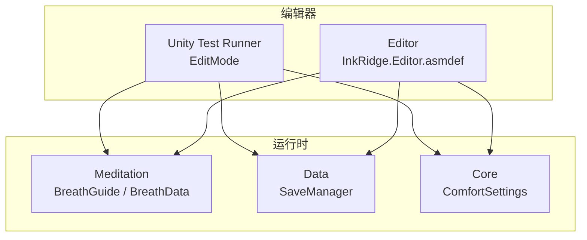
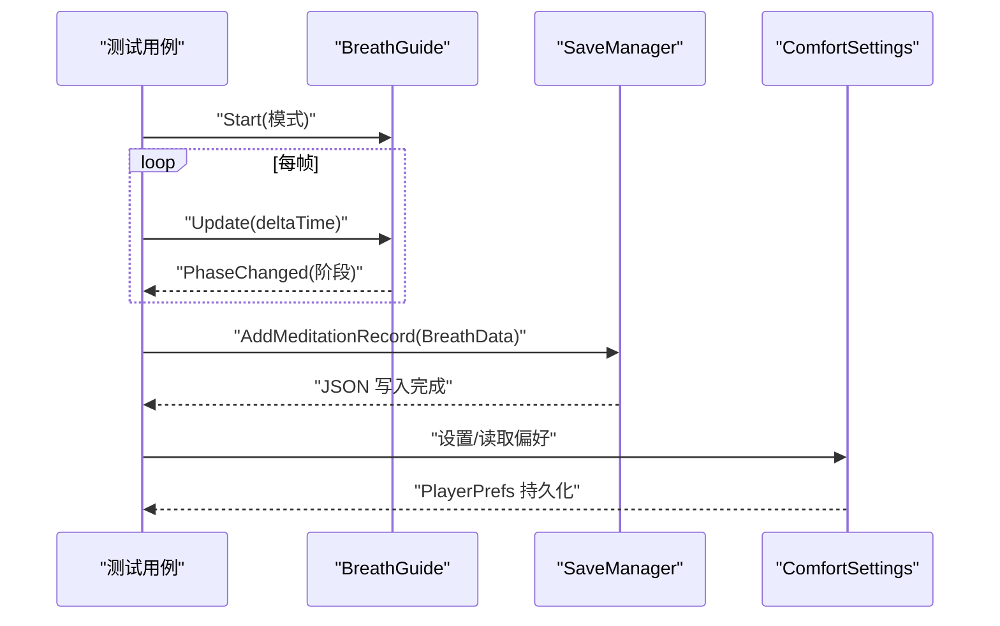
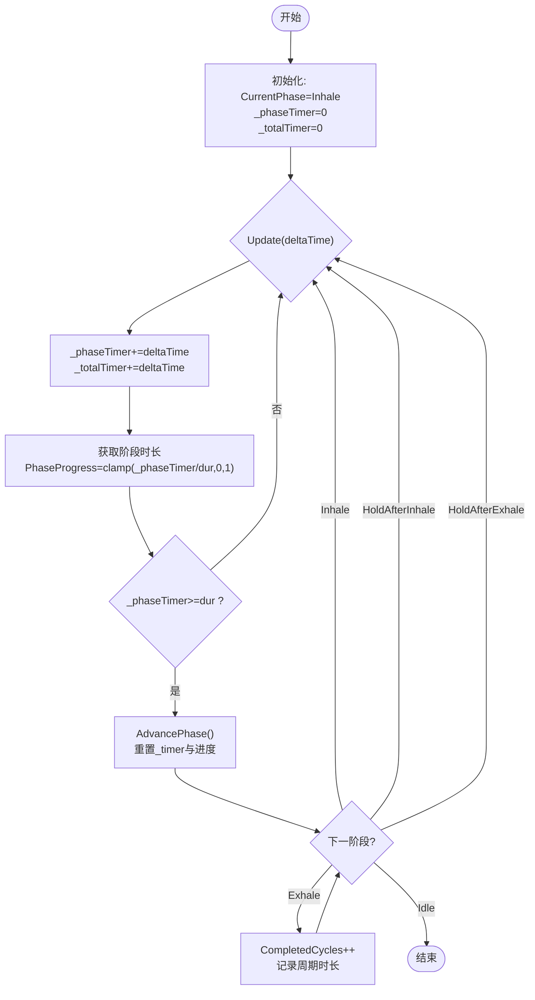
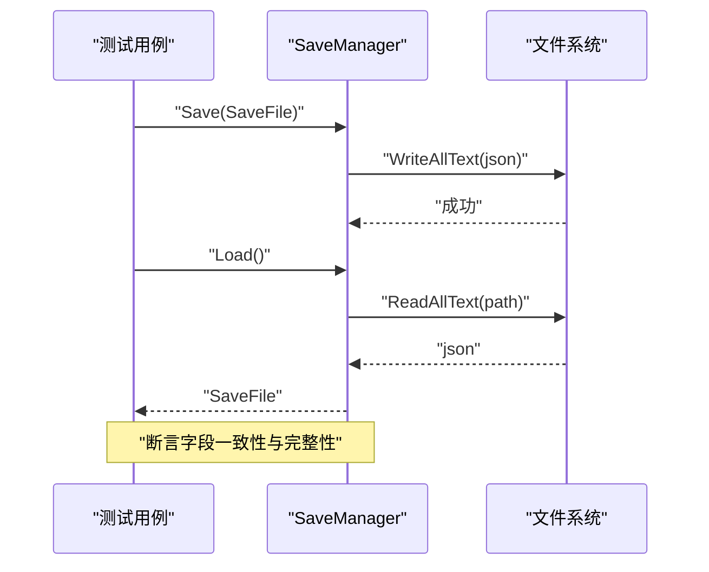
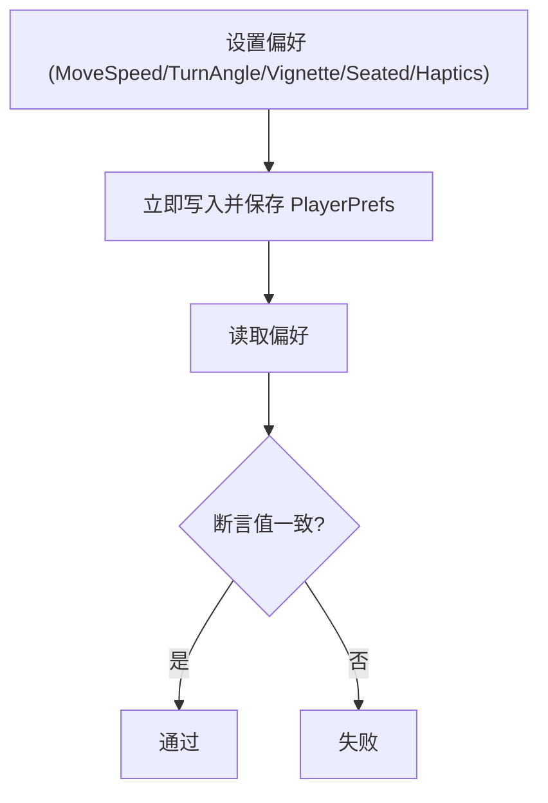
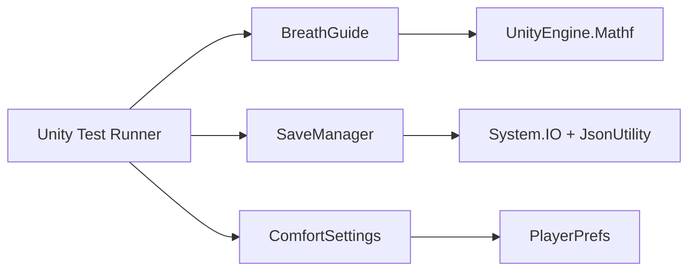

# 测试策略

<cite>
**本文引用的文件**
- [BreathGuide.cs](file://Assets/Scripts/Meditation/BreathGuide.cs)
- [BreathData.cs](file://Assets/Scripts/Meditation/BreathData.cs)
- [SaveManager.cs](file://Assets/Scripts/Data/SaveManager.cs)
- [ComfortSettings.cs](file://Assets/Scripts/Core/ComfortSettings.cs)
- [InkRidge.asmdef](file://Assets/Scripts/InkRidge.asmdef)
- [InkRidge.Editor.asmdef](file://Assets/Editor/InkRidge.Editor.asmdef)
- [AGENTS.md](file://AGENTS.md)
</cite>

## 目录
1. [简介](#简介)
2. [项目结构](#项目结构)
3. [核心组件](#核心组件)
4. [架构总览](#架构总览)
5. [详细组件分析](#详细组件分析)
6. [依赖分析](#依赖分析)
7. [性能考虑](#性能考虑)
8. [故障排查指南](#故障排查指南)
9. [结论](#结论)
10. [附录](#附录)

## 简介
本测试策略文档面向 InkRidge 项目的编辑器内单元测试（EditMode），目标是为 BreathGuide 呼吸算法、SaveManager 数据持久化、以及 ComfortSettings 用户偏好设置提供系统化、可执行的测试方案。文档涵盖：
- EditMode 测试框架配置与使用
- 测试环境初始化与模拟对象创建
- 针对呼吸算法的阶段转换、节奏稳定性与边界条件测试
- JSON 序列化/反序列化的完整性验证
- PlayerPrefs 的模拟与验证方法
- 覆盖率统计、持续集成与自动化流程建议
- 编写新测试用例的最佳实践

## 项目结构
当前仓库未包含已实现的测试脚本，但项目结构与文档约定表明测试应位于 Assets/Tests/EditMode/ 下，并通过 Unity Test Runner 在 EditMode 中执行。核心代码按功能分层组织：
- Meditation：呼吸引导与数据模型
- Data：本地 JSON 保存与加载
- Core：VR 舒适设置（基于 PlayerPrefs）
- Editor：编辑器工具与构建脚本
- Assembly Definitions：模块引用与平台隔离

图表来源
- [InkRidge.asmdef:1-17](file://Assets/Scripts/InkRidge.asmdef#L1-L17)
- [InkRidge.Editor.asmdef:1-17](file://Assets/Editor/InkRidge.Editor.asmdef#L1-L17)

章节来源
- [AGENTS.md:67-75](file://AGENTS.md#L67-L75)
- [InkRidge.asmdef:1-17](file://Assets/Scripts/InkRidge.asmdef#L1-L17)
- [InkRidge.Editor.asmdef:1-17](file://Assets/Editor/InkRidge.Editor.asmdef#L1-L17)

## 核心组件
- BreathGuide：控制呼吸阶段（吸气、吸后屏息、呼气、呼后屏息、空闲），支持多种固定模式与自由模式，维护周期计数、进度与节奏稳定性指标。
- SaveManager：负责 JSON 格式的本地持久化，包括冥想记录、累计时长、解锁场景、每日打卡等。
- ComfortSettings：通过 PlayerPrefs 存储 VR 舒适设置（移动速度、转向角度、暗角、坐姿模式、触觉反馈），并在应用启动时读取默认值。

章节来源
- [BreathGuide.cs:10-171](file://Assets/Scripts/Meditation/BreathGuide.cs#L10-L171)
- [SaveManager.cs:9-116](file://Assets/Scripts/Data/SaveManager.cs#L9-L116)
- [ComfortSettings.cs:5-79](file://Assets/Scripts/Core/ComfortSettings.cs#L5-L79)

## 架构总览
下图展示了测试驱动的核心交互：测试用例调用被测类的方法，断言其状态变化与副作用（事件触发、文件写入、PlayerPrefs 写入）。

图表来源
- [BreathGuide.cs:54-102](file://Assets/Scripts/Meditation/BreathGuide.cs#L54-L102)
- [SaveManager.cs:59-66](file://Assets/Scripts/Data/SaveManager.cs#L59-L66)
- [ComfortSettings.cs:37-66](file://Assets/Scripts/Core/ComfortSettings.cs#L37-L66)

## 详细组件分析

### BreathGuide 测试策略（BreathGuideTests）
目标：验证阶段转换逻辑、进度推进、周期计数、节奏稳定性计算及边界条件。

- 阶段转换验证
  - 启动后首阶段应为“吸气”，并触发一次 PhaseChanged。
  - 根据所选模式，依次进入“吸后屏息”、“呼气”、“呼后屏息”或跳过某些阶段（如 Balanced444 无呼后屏息）。
  - 每个阶段结束时自动推进到下一阶段，并重置进度。
  - 停止时应回到“空闲”，并触发一次 PhaseChanged。

- 进度与计时
  - 每帧 Update 累加 _phaseTimer 与 _totalTimer。
  - PhaseProgress = clamp(_phaseTimer / phaseDuration, 0, 1)。
  - 当 _phaseTimer >= phaseDuration 时推进阶段。

- 周期计数与稳定性
  - 完成一次完整循环（吸气→...→呼气）时 CompletedCycles++。
  - 记录周期时长用于计算稳定性：方差越小越稳定；固定模式下稳定性恒为 1。
  - GetRhythmStability() 返回 0-1 的值，空周期时为 1。

- 边界条件
  - deltaTime 为 0 或极小值时的行为。
  - 非零持续时间阶段的边界推进。
  - 模式切换后的阶段序列正确性。
  - Stop 后立即 Start 的状态重置。

图表来源
- [BreathGuide.cs:79-147](file://Assets/Scripts/Meditation/BreathGuide.cs#L79-L147)

章节来源
- [BreathGuide.cs:10-171](file://Assets/Scripts/Meditation/BreathGuide.cs#L10-L171)

### SaveManager 测试策略（SaveManagerTests）
目标：验证 JSON 序列化/反序列化的完整性、数据一致性、异常路径与清理操作。

- 数据模型
  - SaveFile 包含最高解锁场景、累计冥想时间、累计行走时间、会话次数、冥想记录列表、每日打卡列表。
  - BreathData 包含场景信息、模式、周期数、时长、稳定性、是否提前结束、时间戳 ISO。

- 关键流程
  - Load：若存在文件则读取并反序列化为 SaveFile；异常时记录错误并返回空 SaveFile。
  - Save：将 SaveFile 序列化为 JSON 并写入 persistentDataPath。
  - AddMeditationRecord：追加记录、更新累计时间与会话数并保存。
  - UnlockScene：仅当传入索引高于当前最高解锁时才更新并保存。
  - MarkZenDay：标记每日打卡，重复标记返回 false。
  - Clear：删除保存文件以便测试隔离。

- 测试要点
  - 初始状态：不存在文件时 Load 返回空 SaveFile。
  - 写入与读取：保存后读取应与写入一致（字段映射完整）。
  - 增量更新：多次 AddMeditationRecord 后累计字段递增。
  - 场景解锁：UnlockScene 仅在更高索引时更新。
  - 每日打卡：MarkZenDay 去重，GetZenDayCount 计数正确。
  - 异常处理：模拟 IO 异常时不崩溃且返回安全默认值。
  - 清理：Clear 后 Load 应返回空 SaveFile。

图表来源
- [SaveManager.cs:29-57](file://Assets/Scripts/Data/SaveManager.cs#L29-L57)
- [SaveManager.cs:59-115](file://Assets/Scripts/Data/SaveManager.cs#L59-L115)

章节来源
- [SaveManager.cs:9-116](file://Assets/Scripts/Data/SaveManager.cs#L9-L116)
- [BreathData.cs:6-43](file://Assets/Scripts/Meditation/BreathData.cs#L6-L43)

### ComfortSettings 测试策略（ComfortSettingsTests）
目标：验证 PlayerPrefs 的读写、默认值、持久化与坐姿模式应用。

- 关键点
  - 所有 setter 都会立即写入并保存（避免被系统杀死导致丢失）。
  - 默认值：移动速度、转向角度、暗角开关、坐姿模式、触觉反馈。
  - ApplySeatedMode：根据 SeatedMode 调整 XR Origin 高度。

- 测试要点
  - 默认值：首次读取应返回预设默认值。
  - 写入与读取：设置后读取应一致。
  - 持久化：每次设置后应立即保存到磁盘（可通过后续读取验证）。
  - 类型映射：bool 以 1/0 存储，读取时正确转换。
  - 坐姿模式：ApplySeatedMode 对 Transform 的 Y 坐标影响符合预期。
  - 键名隔离：不同键之间互不影响。

图表来源
- [ComfortSettings.cs:25-35](file://Assets/Scripts/Core/ComfortSettings.cs#L25-L35)
- [ComfortSettings.cs:37-66](file://Assets/Scripts/Core/ComfortSettings.cs#L37-L66)
- [ComfortSettings.cs:68-78](file://Assets/Scripts/Core/ComfortSettings.cs#L68-L78)

章节来源
- [ComfortSettings.cs:5-79](file://Assets/Scripts/Core/ComfortSettings.cs#L5-L79)

## 依赖分析
- BreathGuide 依赖 Unity 数学函数（Mathf）与事件机制（Action）。
- SaveManager 依赖 System.IO、JsonUtility 与 Application.persistentDataPath。
- ComfortSettings 依赖 UnityEngine.PlayerPrefs。
- 测试运行器（Unity Test Runner）在 EditMode 中执行，需确保相关程序集引用可用。

图表来源
- [BreathGuide.cs:1-171](file://Assets/Scripts/Meditation/BreathGuide.cs#L1-L171)
- [SaveManager.cs:1-116](file://Assets/Scripts/Data/SaveManager.cs#L1-L116)
- [ComfortSettings.cs:1-81](file://Assets/Scripts/Core/ComfortSettings.cs#L1-L81)

章节来源
- [InkRidge.asmdef:1-17](file://Assets/Scripts/InkRidge.asmdef#L1-L17)
- [InkRidge.Editor.asmdef:1-17](file://Assets/Editor/InkRidge.Editor.asmdef#L1-L17)

## 性能考虑
- BreathGuide 的 Update 每帧进行轻量计算，复杂度 O(1)，适合高频调用。
- SaveManager 的文件 I/O 应在后台或批量提交，避免阻塞主线程；测试中应尽量减少频繁写盘。
- ComfortSettings 每次设置都立即保存，测试中应避免过多重复写入造成磁盘压力。

## 故障排查指南
- 阶段转换异常：检查模式配置与阶段时长是否为 0；确认 AdvancePhase 分支逻辑与 PatternTimings 索引。
- 稳定性计算异常：确认 RecordCycleDuration 是否正确累加周期时长；空周期时返回值应为 1。
- JSON 读写失败：检查 persistentDataPath 权限与异常捕获；确认 SaveFile 字段与 JSON 映射一致。
- PlayerPrefs 不一致：确认每次设置后是否调用保存；读取时使用正确的默认值。

章节来源
- [BreathGuide.cs:104-168](file://Assets/Scripts/Meditation/BreathGuide.cs#L104-L168)
- [SaveManager.cs:29-57](file://Assets/Scripts/Data/SaveManager.cs#L29-L57)
- [ComfortSettings.cs:25-35](file://Assets/Scripts/Core/ComfortSettings.cs#L25-L35)

## 结论
本测试策略围绕 BreathGuide、SaveManager、ComfortSettings 三大核心组件，提供了完整的 EditMode 测试设计思路与实践指导。通过阶段转换验证、JSON 完整性校验与 PlayerPrefs 持久化验证，确保呼吸算法、数据持久化与用户偏好的正确性与鲁棒性。建议在项目中尽快落地具体测试脚本，并结合覆盖率统计与持续集成实现自动化质量保障。

## 附录

### EditMode 测试框架配置与使用
- 运行方式：在 Unity 编辑器中打开 Window → General → Test Runner，选择 EditMode，点击 Run All。
- 测试位置：按照项目约定，测试脚本应放在 Assets/Tests/EditMode/ 目录下。
- 程序集引用：确保测试程序集引用了 InkRidge 与必要的 Unity 库（TestRunner）。

章节来源
- [AGENTS.md:67-75](file://AGENTS.md#L67-L75)
- [InkRidge.Editor.asmdef:1-17](file://Assets/Editor/InkRidge.Editor.asmdef#L1-L17)

### 测试环境设置与模拟对象创建
- 文件 I/O：使用 Application.persistentDataPath 作为保存路径；测试前后可调用 Clear 清理数据。
- PlayerPrefs：由于每次设置都会立即保存，测试中应避免跨用例污染；必要时在 SetUp/Teardown 中重置。
- 时间推进：BreathGuide.Update 依赖 deltaTime；测试中可构造固定步长推进阶段。

章节来源
- [SaveManager.cs:26-28](file://Assets/Scripts/Data/SaveManager.cs#L26-L28)
- [ComfortSettings.cs:25-35](file://Assets/Scripts/Core/ComfortSettings.cs#L25-L35)
- [BreathGuide.cs:79-102](file://Assets/Scripts/Meditation/BreathGuide.cs#L79-L102)

### 持续集成与自动化测试流程建议
- 在 CI 环境中安装 Unity/Tuanjie 编辑器，执行批处理模式运行 Test Runner。
- 输出测试报告与覆盖率统计，便于回归分析与质量门禁。
- 将 APK 构建与测试解耦：先跑单元测试，再构建产物。

[本节为通用建议，无需特定文件来源]

### 编写新测试用例的指导原则与最佳实践
- 单一职责：每个测试只验证一个行为或一条路径。
- 可重复性：测试前后清理状态（文件、PlayerPrefs）。
- 明确断言：对状态、返回值、事件触发进行精确断言。
- 覆盖边界：包括空输入、极值、异常路径。
- 可读性：命名清晰，步骤简洁，注释说明意图。

[本节为通用建议，无需特定文件来源]