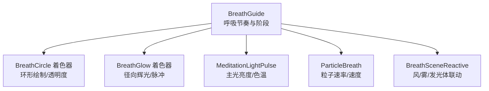
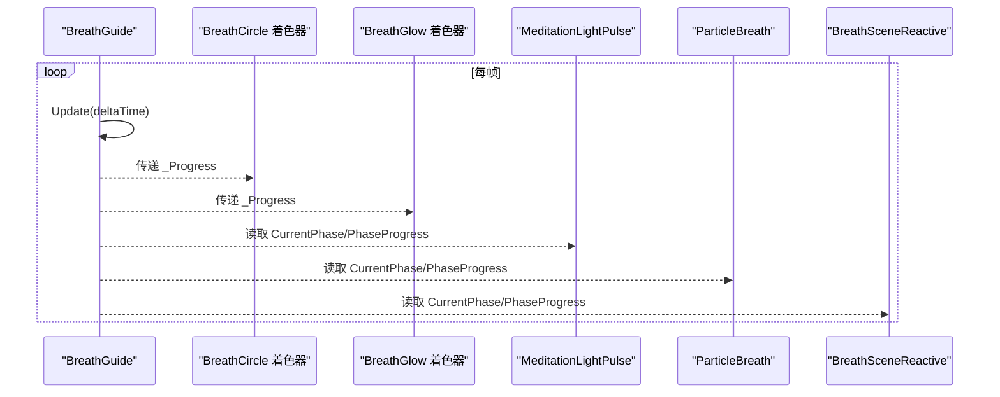
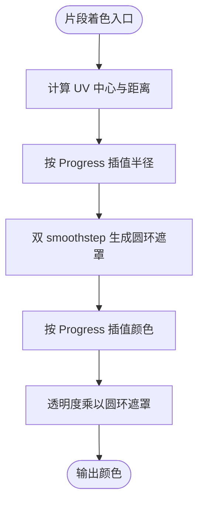
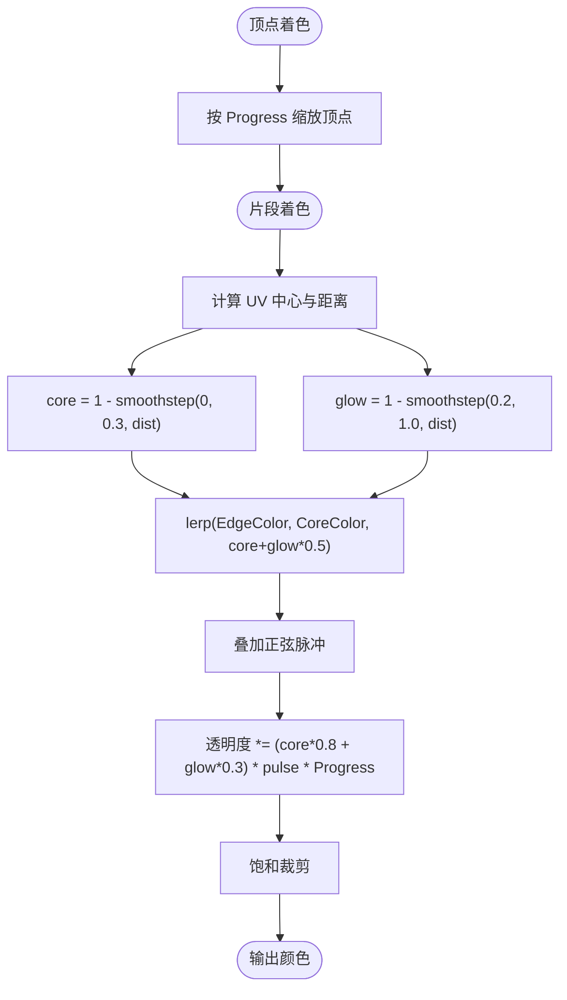
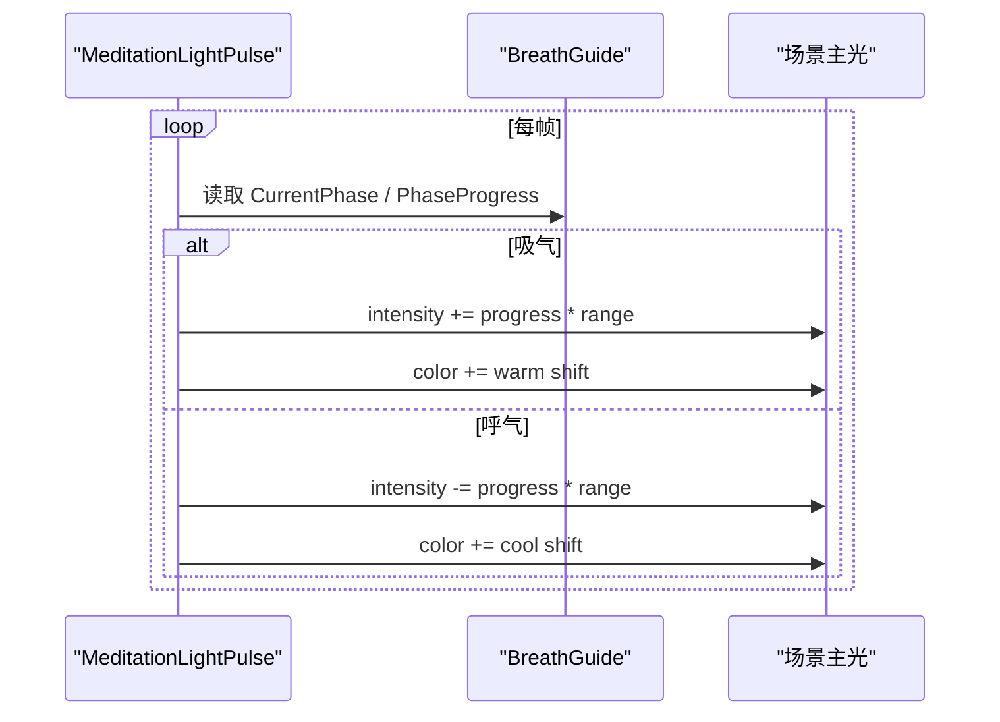
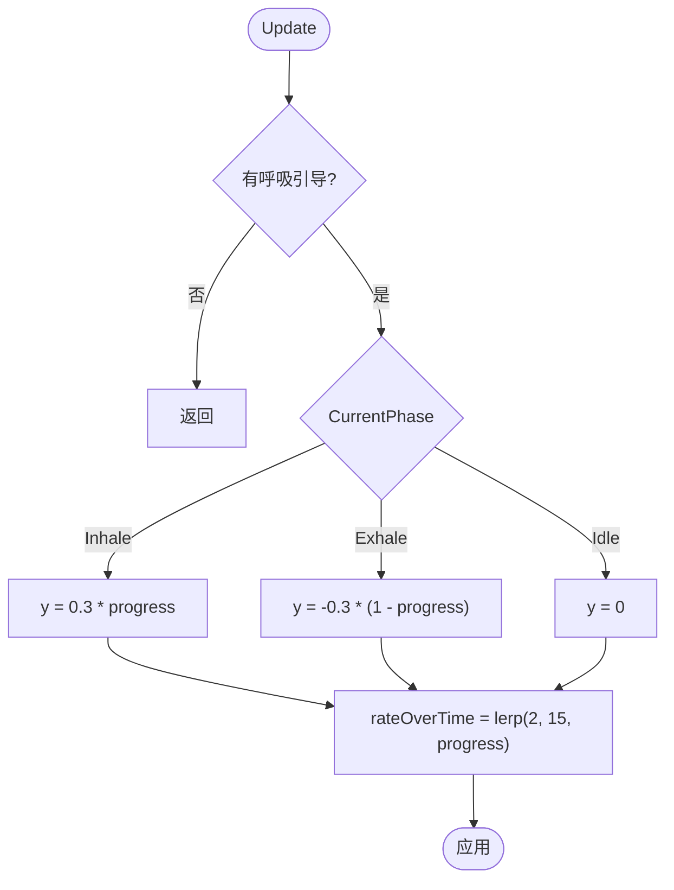
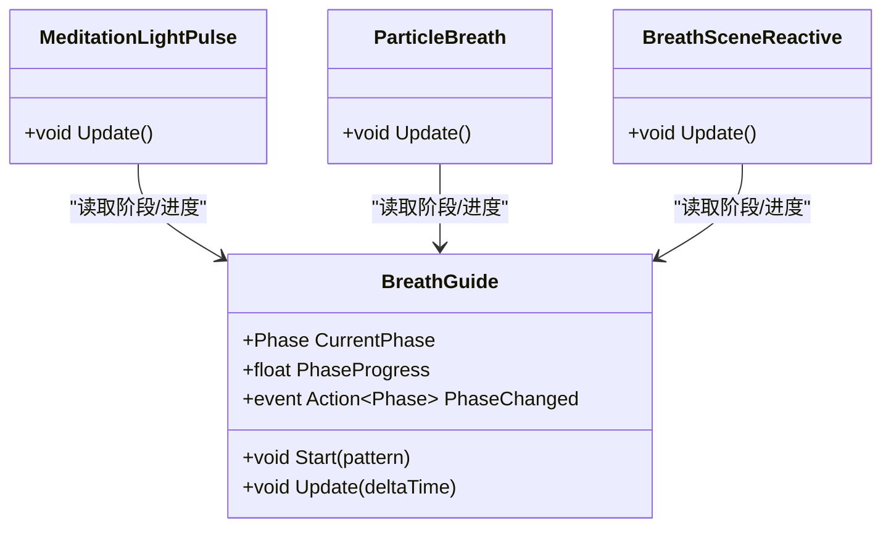
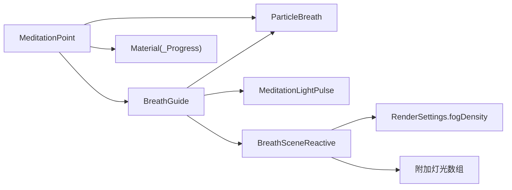

# 呼吸视觉效果

<cite>
**本文引用的文件**
- [BreathCircle.shader](file://Assets/Shaders/BreathCircle.shader)
- [BreathGlow.shader](file://Assets/Shaders/BreathGlow.shader)
- [MeditationLightPulse.cs](file://Assets/Scripts/Environment/MeditationLightPulse.cs)
- [ParticleBreath.cs](file://Assets/Scripts/Environment/ParticleBreath.cs)
- [BreathGuide.cs](file://Assets/Scripts/Meditation/BreathGuide.cs)
- [BreathSceneReactive.cs](file://Assets/Scripts/Core/BreathSceneReactive.cs)
- [MeditationPoint.cs](file://Assets/Scripts/Meditation/MeditationPoint.cs)
</cite>

## 目录
1. [简介](#简介)
2. [项目结构](#项目结构)
3. [核心组件](#核心组件)
4. [架构总览](#架构总览)
5. [详细组件分析](#详细组件分析)
6. [依赖关系分析](#依赖关系分析)
7. [性能考量](#性能考量)
8. [故障排查指南](#故障排查指南)
9. [结论](#结论)
10. [附录：自定义开发指南](#附录自定义开发指南)

## 简介
本技术文档聚焦于 InkRidge 的“呼吸视觉效果系统”，围绕以下四个关键子系统展开：
- BreathCircle 着色器：基于进度驱动的圆形绘制与透明度控制，实现吸气和呼气的视觉节奏。
- BreathGlow 着色器：径向渐变辉光、脉冲强度与颜色混合，营造柔和的呼吸光晕。
- MeditationLightPulse 脚本：根据冥想阶段对场景主光源进行亮度与色温调制，形成环境级呼吸氛围。
- ParticleBreath 系统：粒子发射速率与速度随呼吸相位变化，增强空间流动感。

此外，文档还涵盖与 BreathGuide 的节奏同步机制、场景联动（风、雾、灯光）以及扩展与优化建议，帮助开发者快速集成并定制呼吸视觉效果。

## 项目结构
呼吸视觉效果由“节奏驱动 + 渲染表现 + 场景联动”三层构成：
- 节奏层：BreathGuide 提供统一的呼吸周期与阶段进度。
- 渲染层：BreathCircle/BreathGlow 着色器负责可视化；Material 属性通过脚本每帧更新。
- 联动层：MeditationLightPulse、BreathSceneReactive、ParticleBreath 将呼吸节奏扩散到光照、粒子与环境。

图表来源
- [BreathGuide.cs:10-173](file://Assets/Scripts/Meditation/BreathGuide.cs#L10-L173)
- [BreathCircle.shader:1-74](file://Assets/Shaders/BreathCircle.shader#L1-L74)
- [BreathGlow.shader:1-81](file://Assets/Shaders/BreathGlow.shader#L1-L81)
- [MeditationLightPulse.cs:1-86](file://Assets/Scripts/Environment/MeditationLightPulse.cs#L1-L86)
- [ParticleBreath.cs:1-64](file://Assets/Scripts/Environment/ParticleBreath.cs#L1-L64)
- [BreathSceneReactive.cs:1-147](file://Assets/Scripts/Core/BreathSceneReactive.cs#L1-L147)

章节来源
- [BreathGuide.cs:10-173](file://Assets/Scripts/Meditation/BreathGuide.cs#L10-L173)
- [BreathCircle.shader:1-74](file://Assets/Shaders/BreathCircle.shader#L1-L74)
- [BreathGlow.shader:1-81](file://Assets/Shaders/BreathGlow.shader#L1-L81)
- [MeditationLightPulse.cs:1-86](file://Assets/Scripts/Environment/MeditationLightPulse.cs#L1-L86)
- [ParticleBreath.cs:1-64](file://Assets/Scripts/Environment/ParticleBreath.cs#L1-L64)
- [BreathSceneReactive.cs:1-147](file://Assets/Scripts/Core/BreathSceneReactive.cs#L1-L147)

## 核心组件
- BreathGuide：定义呼吸阶段（吸气、屏息、呼气、屏息）、模式（如 4-4-4、4-7-8、Box、自由），维护当前阶段与阶段进度，并通过事件通知订阅者。
- BreathCircle 着色器：以 UV 中心为圆心计算距离，使用平滑阶跃函数生成圆环边缘羽化；颜色在吸气/呼气之间按进度插值；透明度由圆环遮罩控制。
- BreathGlow 着色器：顶点缩放实现尺寸随进度变化；片段着色中计算核心与边缘的径向渐变，叠加正弦脉冲，最终混合核心/边缘颜色并按进度输出透明度。
- MeditationLightPulse：查找场景主光，依据当前呼吸阶段与进度对主光强度与颜色做偏移，营造“吸气更亮暖、呼气更暗冷”的氛围。
- ParticleBreath：绑定 ParticleSystem，按阶段设置垂直速度与发射速率，使粒子在吸气时向外扩散、呼气时向内收敛。
- BreathSceneReactive：将呼吸进度映射到风强度、雾密度、附加灯光与自发光材质，实现“世界跟随呼吸”的整体沉浸感。

章节来源
- [BreathGuide.cs:10-173](file://Assets/Scripts/Meditation/BreathGuide.cs#L10-L173)
- [BreathCircle.shader:1-74](file://Assets/Shaders/BreathCircle.shader#L1-L74)
- [BreathGlow.shader:1-81](file://Assets/Shaders/BreathGlow.shader#L1-L81)
- [MeditationLightPulse.cs:1-86](file://Assets/Scripts/Environment/MeditationLightPulse.cs#L1-L86)
- [ParticleBreath.cs:1-64](file://Assets/Scripts/Environment/ParticleBreath.cs#L1-L64)
- [BreathSceneReactive.cs:1-147](file://Assets/Scripts/Core/BreathSceneReactive.cs#L1-L147)

## 架构总览
呼吸效果以 BreathGuide 为唯一时序源，所有视觉与场景反馈均读取其 CurrentPhase 与 PhaseProgress，保证多通道一致性与可预测性。

图表来源
- [BreathGuide.cs:79-102](file://Assets/Scripts/Meditation/BreathGuide.cs#L79-L102)
- [BreathCircle.shader:28-68](file://Assets/Shaders/BreathCircle.shader#L28-L68)
- [BreathGlow.shader:28-75](file://Assets/Shaders/BreathGlow.shader#L28-L75)
- [MeditationLightPulse.cs:58-83](file://Assets/Scripts/Environment/MeditationLightPulse.cs#L58-L83)
- [ParticleBreath.cs:41-61](file://Assets/Scripts/Environment/ParticleBreath.cs#L41-L61)
- [BreathSceneReactive.cs:93-124](file://Assets/Scripts/Core/BreathSceneReactive.cs#L93-L124)

## 详细组件分析

### BreathCircle 着色器：透明度控制与进度驱动动画
- 圆形绘制算法
  - 以 UV 中心为原点计算像素距离，结合 MinRadius/MaxRadius 与 Progress 线性插值得到当前半径。
  - 使用两次 smoothstep 构建圆环遮罩，配合 Feather 控制边缘羽化，避免硬边。
- 透明度控制
  - 颜色在 InhaleColor 与 ExhaleColor 间按 Progress 插值。
  - 最终透明度乘以圆环遮罩，确保仅在圆环区域可见。
- 渲染设置
  - Transparent 渲染类型与 Overlay 队列，采用 SrcAlpha One 混合，关闭深度写入，适合叠加式 UI/特效。

图表来源
- [BreathCircle.shader:55-68](file://Assets/Shaders/BreathCircle.shader#L55-L68)

章节来源
- [BreathCircle.shader:1-74](file://Assets/Shaders/BreathCircle.shader#L1-L74)

### BreathGlow 着色器：径向渐变、辉光强度与颜色混合
- 径向渐变
  - 片段着色中分别计算 core 与 glow 两个衰减项，形成明亮核心与柔和边缘。
- 辉光强度与脉冲
  - 顶点阶段按 Progress 缩放四边形尺寸，模拟呼吸膨胀收缩。
  - 片段阶段叠加一个低频正弦脉冲，增加“微呼吸”质感。
- 颜色混合
  - 使用 lerp 在 EdgeColor 与 CoreColor 之间混合，透明度由 core/glow 组合与 Progress 共同决定，并进行饱和裁剪防止过曝。

图表来源
- [BreathGlow.shader:47-75](file://Assets/Shaders/BreathGlow.shader#L47-L75)

章节来源
- [BreathGlow.shader:1-81](file://Assets/Shaders/BreathGlow.shader#L1-L81)

### MeditationLightPulse：冥想灯光脉冲控制
- 亮度调制
  - 保存基础强度，在吸气阶段按进度提升强度，在呼气阶段按进度降低强度。
- 色温偏移
  - 吸气时偏暖（提高 R、降低 B），呼气时偏冷（降低 R、提高 B）。
- 场景光照集成
  - 自动查找场景主光（优先 RenderSettings.sun，其次第一个 Directional Light），无需手动连线即可工作。

图表来源
- [MeditationLightPulse.cs:22-32](file://Assets/Scripts/Environment/MeditationLightPulse.cs#L22-L32)
- [MeditationLightPulse.cs:58-83](file://Assets/Scripts/Environment/MeditationLightPulse.cs#L58-L83)

章节来源
- [MeditationLightPulse.cs:1-86](file://Assets/Scripts/Environment/MeditationLightPulse.cs#L1-L86)

### ParticleBreath：粒子动画实现
- 生命周期管理
  - 默认禁用发射模块，启用速度模块；开始呼吸时开启发射并播放粒子系统；停止时关闭发射并暂停。
- 运动轨迹
  - 吸气阶段设置正向 Y 速度，呼气阶段设置负向 Y 速度，形成“吸入/呼出”的上下流动。
- 发射速率
  - 发射速率随进度在低到高之间插值，增强呼吸高峰时的粒子密度。

图表来源
- [ParticleBreath.cs:18-39](file://Assets/Scripts/Environment/ParticleBreath.cs#L18-L39)
- [ParticleBreath.cs:41-61](file://Assets/Scripts/Environment/ParticleBreath.cs#L41-L61)

章节来源
- [ParticleBreath.cs:1-64](file://Assets/Scripts/Environment/ParticleBreath.cs#L1-L64)

### 与 BreathGuide 的同步机制
- BreathGuide 每帧推进阶段计时，计算 PhaseProgress，并在阶段切换时触发事件。
- 各子系统直接读取 CurrentPhase 与 PhaseProgress，避免耦合与重复状态机。
- 支持多种呼吸模式（Balanced444、Relax478、Box4444、Free），统一驱动视觉与音频/触觉。

图表来源
- [BreathGuide.cs:10-173](file://Assets/Scripts/Meditation/BreathGuide.cs#L10-L173)
- [MeditationLightPulse.cs:58-83](file://Assets/Scripts/Environment/MeditationLightPulse.cs#L58-L83)
- [ParticleBreath.cs:41-61](file://Assets/Scripts/Environment/ParticleBreath.cs#L41-L61)
- [BreathSceneReactive.cs:93-124](file://Assets/Scripts/Core/BreathSceneReactive.cs#L93-L124)

章节来源
- [BreathGuide.cs:10-173](file://Assets/Scripts/Meditation/BreathGuide.cs#L10-L173)

## 依赖关系分析
- 耦合度
  - 渲染层（着色器）仅依赖外部传入的 _Progress 等参数，无运行时逻辑耦合。
  - 脚本层（MeditationLightPulse、ParticleBreath、BreathSceneReactive）统一依赖 BreathGuide，解耦良好。
- 间接依赖
  - MeditationPoint 作为编排者，持有 BreathGuide 实例，并将进度传递给渲染器与子系统（例如设置 Material 属性、启动/停止粒子）。
- 外部集成点
  - 场景主光（RenderSettings.sun 或 Directional Light）。
  - 全局雾（RenderSettings.fogDensity）。
  - 可选的额外灯光与自发光材质数组。

图表来源
- [MeditationPoint.cs:62-89](file://Assets/Scripts/Meditation/MeditationPoint.cs#L62-L89)
- [BreathSceneReactive.cs:51-71](file://Assets/Scripts/Core/BreathSceneReactive.cs#L51-L71)
- [BreathSceneReactive.cs:93-124](file://Assets/Scripts/Core/BreathSceneReactive.cs#L93-L124)

章节来源
- [MeditationPoint.cs:62-89](file://Assets/Scripts/Meditation/MeditationPoint.cs#L62-L89)
- [BreathSceneReactive.cs:51-71](file://Assets/Scripts/Core/BreathSceneReactive.cs#L51-L71)
- [BreathSceneReactive.cs:93-124](file://Assets/Scripts/Core/BreathSceneReactive.cs#L93-L124)

## 性能考量
- 着色器开销
  - BreathCircle/BreathGlow 均为轻量 CG 着色器，LOD 100，透明叠加渲染，注意同屏数量以避免过度 overdraw。
  - 建议使用较小分辨率的 Quad 或合适的渲染层级，减少像素填充压力。
- 粒子系统
  - 发射速率随进度变化，峰值时粒子数增多；可通过限制最大粒子数或调整纹理大小控制开销。
- 场景联动
  - 大量附加灯光与材质属性更新会带来 CPU 开销；建议按需启用，或在非 VR 平台降低更新频率。
- 雾效
  - 频繁修改全局雾密度可能影响后处理管线；若场景不使用雾，应关闭相关开关。

[本节为通用指导，不直接分析具体文件]

## 故障排查指南
- 呼吸圈不显示
  - 检查是否已将 _Progress 属性从脚本写入 Material；确认渲染器启用了正确的材质与 Shader。
  - 确认渲染队列与混合模式未与其他全屏特效冲突。
- 辉光过曝或不可见
  - 检查饱和度裁剪与透明度计算；适当降低核心/边缘颜色强度或 Softness。
- 灯光无变化
  - 确认已找到场景主光（sun 或 Directional Light）；检查脚本是否在运行且未被禁用。
- 粒子不动或方向错误
  - 检查速度模块是否启用；确认吸气/呼气阶段的符号方向是否符合预期。
- 场景联动异常
  - 确认 BreathSceneReactive 已正确引用 WindSystem、附加灯光与发光材质；检查雾开关是否与场景配置一致。

章节来源
- [MeditationLightPulse.cs:22-51](file://Assets/Scripts/Environment/MeditationLightPulse.cs#L22-L51)
- [ParticleBreath.cs:18-39](file://Assets/Scripts/Environment/ParticleBreath.cs#L18-L39)
- [BreathSceneReactive.cs:51-71](file://Assets/Scripts/Core/BreathSceneReactive.cs#L51-L71)

## 结论
InkRidge 的呼吸视觉效果以 BreathGuide 为核心时序源，通过轻量着色器与脚本联动，实现了高沉浸感的“世界随呼吸而动”。BreathCircle 提供清晰的环形进度指示，BreathGlow 营造柔和的光晕氛围，MeditationLightPulse 与 ParticleBreath 分别在光照与粒子上体现呼吸节奏，BreathSceneReactive 则将整体体验扩展到风、雾与发光物体。该架构清晰、可扩展性强，便于在不同场景中复用与定制。

[本节为总结，不直接分析具体文件]

## 附录：自定义开发指南
- 新增呼吸视觉元素
  - 创建新 Shader，接收 _Progress 等统一参数，遵循透明叠加与轻量计算原则。
  - 在 MeditationPoint 或对应控制器中，每帧将 BreathGuide.PhaseProgress 写入材质属性。
- 调整呼吸节奏
  - 通过 BreathGuide 的模式与阶段时长配置改变节奏；可在运行时切换模式以适应不同用户偏好。
- 扩展场景联动
  - 在 BreathSceneReactive 中添加新的响应目标（如更多灯光、体积雾、后处理参数），保持与进度一致的插值与平滑。
- 性能优化建议
  - 限制同时运行的呼吸特效数量；合理设置粒子最大数量与纹理尺寸。
  - 在非关键路径上降低更新频率或使用协程节流。
  - 使用对象池复用粒子系统与材质，减少 GC 压力。

[本节为通用指导，不直接分析具体文件]