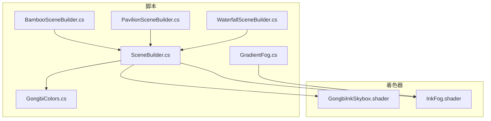
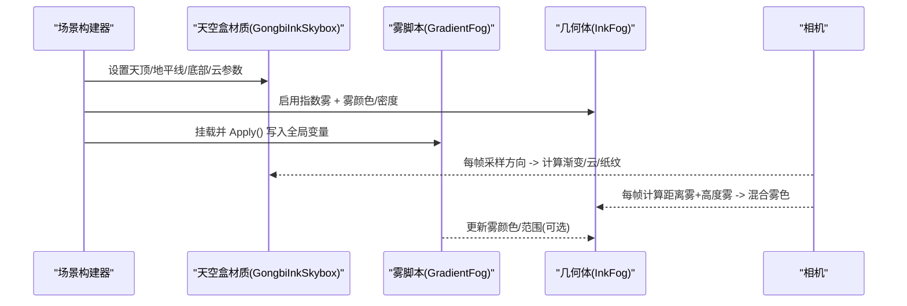
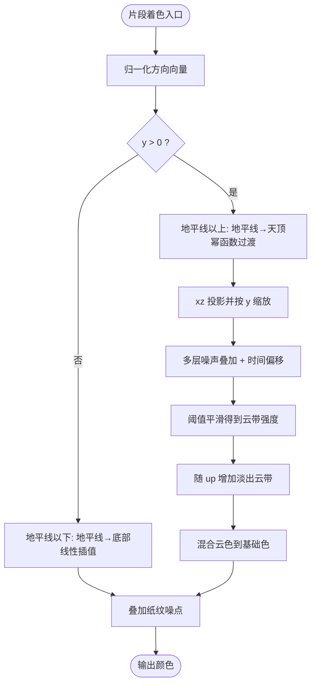
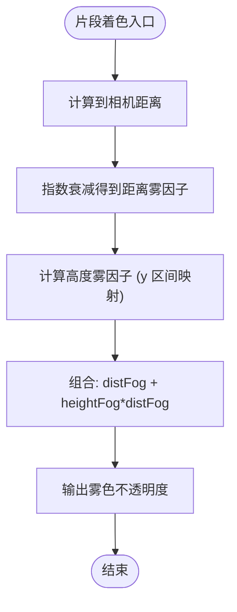
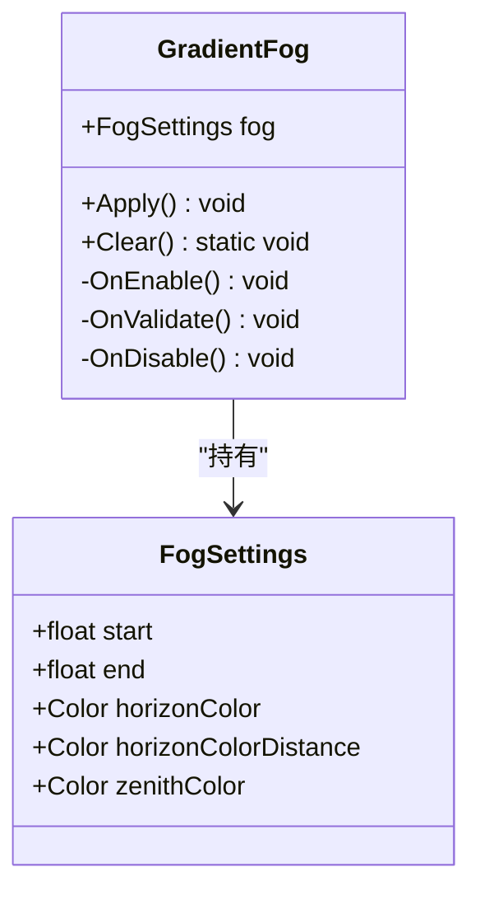
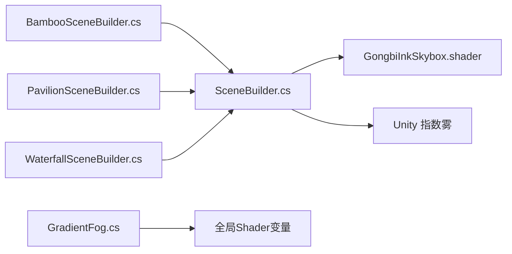

# 天空盒与雾效

<cite>
**本文引用的文件**
- [GongbiInkSkybox.shader](file://Assets/Shaders/GongbiInkSkybox.shader)
- [InkFog.shader](file://Assets/Shaders/InkFog.shader)
- [GradientFog.cs](file://Assets/Scripts/Environment/GradientFog.cs)
- [SceneBuilder.cs](file://Assets/Scripts/Environment/SceneBuilder.cs)
- [BambooSceneBuilder.cs](file://Assets/Scripts/Environment/BambooSceneBuilder.cs)
- [PavilionSceneBuilder.cs](file://Assets/Scripts/Environment/PavilionSceneBuilder.cs)
- [WaterfallSceneBuilder.cs](file://Assets/Scripts/Environment/WaterfallSceneBuilder.cs)
- [GongbiColors.cs](file://Assets/Scripts/GongbiColors.cs)
</cite>

## 目录
1. [简介](#简介)
2. [项目结构](#项目结构)
3. [核心组件](#核心组件)
4. [架构总览](#架构总览)
5. [详细组件分析](#详细组件分析)
6. [依赖关系分析](#依赖关系分析)
7. [性能考量](#性能考量)
8. [故障排查指南](#故障排查指南)
9. [结论](#结论)
10. [附录：参数调优指南](#附录参数调优指南)

## 简介
本技术文档聚焦 InkRidge 的“天空盒与雾效系统”，围绕以下目标展开：
- 解析 GongbiInkSkybox 着色器的水墨画天空效果实现，包括三带渐变（天顶/地平线/地平线以下）、程序化云带漂移、纸纹噪点以及视角相关的光照混合。
- 深入说明 InkFog 着色器的距离雾算法，涵盖高度混合、密度衰减和色彩过渡机制。
- 解释 GradientFog 脚本的动态雾效控制能力，包括雾效强度调节、颜色渐变与时间同步。
- 阐述这些效果如何协同营造沉浸式的冥想环境氛围。
- 提供参数调优建议与性能优化策略。

## 项目结构
与天空盒和雾效相关的代码主要分布在 Shaders 与 Scripts/Environment 两个目录：
- 着色器：
  - GongbiInkSkybox.shader：实现水墨风格天空穹顶的单 Pass 片段着色器。
  - InkFog.shader：为场景几何体叠加距离与高度混合的墨色雾。
- 脚本：
  - GradientFog.cs：通过全局 Shader 变量驱动雾的颜色与范围，支持运行时调整。
  - SceneBuilder.cs：统一设置天空盒材质、Trilight 环境光、Unity 指数雾等。
  - 各场景构建器（Bamboo/Pavilion/Waterfall）：在各自场景中实例化 GradientFog 并配置光照与雾。
  - GongbiColors.cs：提供工笔重彩配色常量，供天空盒与材质使用。

图表来源
- [GongbiInkSkybox.shader:1-128](file://Assets/Shaders/GongbiInkSkybox.shader#L1-L128)
- [InkFog.shader:1-66](file://Assets/Shaders/InkFog.shader#L1-L66)
- [GradientFog.cs:1-96](file://Assets/Scripts/Environment/GradientFog.cs#L1-L96)
- [SceneBuilder.cs:152-181](file://Assets/Scripts/Environment/SceneBuilder.cs#L152-L181)
- [BambooSceneBuilder.cs:17-37](file://Assets/Scripts/Environment/BambooSceneBuilder.cs#L17-L37)
- [PavilionSceneBuilder.cs:11-31](file://Assets/Scripts/Environment/PavilionSceneBuilder.cs#L11-L31)
- [WaterfallSceneBuilder.cs:13-35](file://Assets/Scripts/Environment/WaterfallSceneBuilder.cs#L13-L35)
- [GongbiColors.cs:1-72](file://Assets/Scripts/GongbiColors.cs#L1-L72)

章节来源
- [SceneBuilder.cs:152-181](file://Assets/Scripts/Environment/SceneBuilder.cs#L152-L181)
- [BambooSceneBuilder.cs:17-37](file://Assets/Scripts/Environment/BambooSceneBuilder.cs#L17-L37)
- [PavilionSceneBuilder.cs:11-31](file://Assets/Scripts/Environment/PavilionSceneBuilder.cs#L11-L31)
- [WaterfallSceneBuilder.cs:13-35](file://Assets/Scripts/Environment/WaterfallSceneBuilder.cs#L13-L35)

## 核心组件
- 天空盒着色器（GongbiInkSkybox）：基于方向向量进行垂直渐变混合，叠加程序化噪声生成云带，并在上穹区域按视角淡出；加入纸纹噪点模拟宣纸质感。
- 雾着色器（InkFog）：对几何体渲染时计算到相机的距离雾，并结合世界坐标高度进行高度雾混合，输出不透明度以产生墨色雾感。
- 动态雾脚本（GradientFog）：将雾的距离区间与多色渐变（天顶/地平线/地平线远端）写入全局 Shader 变量，供自定义雾着色器读取。
- 场景构建器（SceneBuilder）：统一创建天空盒材质、设置 Trilight 环境光、启用 Unity 指数雾，并为各场景注入 GradientFog。
- 场景构建器派生类：在各场景中调用 SetupSkybox/SetupFog，并添加 GradientFog 组件，形成一致的环境管线。

章节来源
- [GongbiInkSkybox.shader:92-121](file://Assets/Shaders/GongbiInkSkybox.shader#L92-L121)
- [InkFog.shader:51-61](file://Assets/Shaders/InkFog.shader#L51-L61)
- [GradientFog.cs:72-93](file://Assets/Scripts/Environment/GradientFog.cs#L72-L93)
- [SceneBuilder.cs:152-181](file://Assets/Scripts/Environment/SceneBuilder.cs#L152-L181)

## 架构总览
整体渲染流程如下：
- 天空盒：作为背景层渲染，使用 GongbiInkSkybox 根据相机方向计算三色渐变与云带，叠加纸纹。
- 几何体渲染：场景中的 MeshRenderer 使用 Toon 材质，同时 InkFog 着色器在 ForwardBase Pass 中计算距离与高度雾，输出半透明遮罩。
- 动态控制：GradientFog 在 OnEnable/OnValidate 时将雾参数写入全局 Shader 变量，使雾的颜色与范围可实时调整。
- 场景装配：各场景构建器在 Start 阶段设置天空盒、环境光、雾与光照，并挂载 GradientFog。

图表来源
- [SceneBuilder.cs:152-181](file://Assets/Scripts/Environment/SceneBuilder.cs#L152-L181)
- [GradientFog.cs:72-93](file://Assets/Scripts/Environment/GradientFog.cs#L72-L93)
- [GongbiInkSkybox.shader:92-121](file://Assets/Shaders/GongbiInkSkybox.shader#L92-L121)
- [InkFog.shader:51-61](file://Assets/Shaders/InkFog.shader#L51-L61)

## 详细组件分析

### 天空盒着色器：GongbiInkSkybox
- 渐变混合算法
  - 依据法向化的方向向量 y 分量区分地平线上下：地平线以下线性插值地平线与底部颜色；地平线以上以幂函数控制天顶过渡，增强近地平线的柔和扩散。
  - 参考行：[GongbiInkSkybox.shader:96-115](file://Assets/Shaders/GongbiInkSkybox.shader#L96-L115)
- 程序化云带与时间驱动动画
  - 使用三层 value noise 叠加，频率递增、振幅递减，配合 _Time.y 与 _CloudSpeed 实现缓慢漂移，模拟水墨晕染的云带。
  - 参考行：[GongbiInkSkybox.shader:66-85](file://Assets/Shaders/GongbiInkSkybox.shader#L66-L85)
- 视角相关的光照与雾感
  - 将方向投影到 xz 平面并按 y 缩放，使云带在地平线附近更宽，贴近真实大气透视；向上穹方向逐渐淡出，避免遮蔽天顶。
  - 参考行：[GongbiInkSkybox.shader:107-114](file://Assets/Shaders/GongbiInkSkybox.shader#L107-L114)
- 纸纹噪点
  - 基于哈希函数的稳定方向噪声，叠加微小扰动模拟宣纸纹理。
  - 参考行：[GongbiInkSkybox.shader:87-90, 117-118:87-90](file://Assets/Shaders/GongbiInkSkybox.shader#L87-L90)

图表来源
- [GongbiInkSkybox.shader:92-121](file://Assets/Shaders/GongbiInkSkybox.shader#L92-L121)

章节来源
- [GongbiInkSkybox.shader:59-121](file://Assets/Shaders/GongbiInkSkybox.shader#L59-L121)

### 雾着色器：InkFog
- 距离雾
  - 计算片段世界位置到相机距离，使用指数衰减公式得到距离雾因子。
  - 参考行：[InkFog.shader:53-55](file://Assets/Shaders/InkFog.shader#L53-L55)
- 高度混合
  - 将世界坐标 y 映射到 [FogStartY, FogEndY] 区间，计算高度雾因子，并与距离雾组合，使低处雾更浓、高处渐薄。
  - 参考行：[InkFog.shader:56-59](file://Assets/Shaders/InkFog.shader#L56-L59)
- 色彩过渡
  - 输出雾颜色的不透明度，由 totalFog 控制，实现从清晰到被雾遮蔽的渐变。
  - 参考行：[InkFog.shader:60](file://Assets/Shaders/InkFog.shader#L60)

图表来源
- [InkFog.shader:51-61](file://Assets/Shaders/InkFog.shader#L51-L61)

章节来源
- [InkFog.shader:51-61](file://Assets/Shaders/InkFog.shader#L51-L61)

### 动态雾脚本：GradientFog
- 功能概述
  - 维护一组雾参数（起始/结束距离、地平线色、地平线远端色、天顶色），在 OnEnable/OnValidate 时写入全局 Shader 变量，供自定义雾着色器读取。
  - 提供 Clear() 静态方法重置全局状态，避免场景切换残留。
  - 参考行：[GradientFog.cs:13-43, 72-93:13-43](file://Assets/Scripts/Environment/GradientFog.cs#L13-L43)
- 与 InkFog 的关系
  - GradientFog 写入的全局变量名（如 _FogDistance、_FogColorZenith 等）需与使用的雾着色器保持一致；当前 InkFog 未直接读取这些变量，但可作为扩展接口用于未来多色雾或分层雾。
  - 参考行：[GradientFog.cs:54-57](file://Assets/Scripts/Environment/GradientFog.cs#L54-L57)

图表来源
- [GradientFog.cs:13-43](file://Assets/Scripts/Environment/GradientFog.cs#L13-L43)
- [GradientFog.cs:72-93](file://Assets/Scripts/Environment/GradientFog.cs#L72-L93)

章节来源
- [GradientFog.cs:1-96](file://Assets/Scripts/Environment/GradientFog.cs#L1-L96)

### 场景装配与协同工作
- 天空盒设置
  - SceneBuilder.SetupSkybox 创建 Gongbi/InkSkybox 材质，设置天顶/地平线/底部/云参数，并启用 Trilight 环境光，使物体受天顶与地面反弹光影响。
  - 参考行：[SceneBuilder.cs:152-173](file://Assets/Scripts/Environment/SceneBuilder.cs#L152-L173)
- 雾设置
  - SceneBuilder.SetupFog 启用 Unity 指数雾，设置雾颜色与密度；各场景构建器在此基础上添加 GradientFog 以实现更丰富的雾控制。
  - 参考行：[SceneBuilder.cs:175-181](file://Assets/Scripts/Environment/SceneBuilder.cs#L175-L181)
- 场景差异
  - Bamboo/Pavilion/Waterfall 分别在不同环境下调整雾密度与天空盒颜色，营造竹林幽深、亭台清朗、瀑布氤氲的氛围。
  - 参考行：
    - [BambooSceneBuilder.cs:17-37](file://Assets/Scripts/Environment/BambooSceneBuilder.cs#L17-L37)
    - [PavilionSceneBuilder.cs:11-31](file://Assets/Scripts/Environment/PavilionSceneBuilder.cs#L11-L31)
    - [WaterfallSceneBuilder.cs:13-35](file://Assets/Scripts/Environment/WaterfallSceneBuilder.cs#L13-L35)

章节来源
- [SceneBuilder.cs:152-181](file://Assets/Scripts/Environment/SceneBuilder.cs#L152-L181)
- [BambooSceneBuilder.cs:17-37](file://Assets/Scripts/Environment/BambooSceneBuilder.cs#L17-L37)
- [PavilionSceneBuilder.cs:11-31](file://Assets/Scripts/Environment/PavilionSceneBuilder.cs#L11-L31)
- [WaterfallSceneBuilder.cs:13-35](file://Assets/Scripts/Environment/WaterfallSceneBuilder.cs#L13-L35)

## 依赖关系分析
- 着色器与脚本耦合点
  - SceneBuilder 依赖 GongbiInkSkybox 与 Unity 内置雾系统；GradientFog 通过全局变量与着色器交互。
  - 各场景构建器依赖 SceneBuilder 的统一装配逻辑，确保一致的视觉管线。
- 外部依赖
  - UnityCG.cginc：提供基础数学与变换函数。
  - RenderSettings：管理天空盒与环境光。
  - StaticBatchingUtility：合并静态网格减少绘制调用。

图表来源
- [SceneBuilder.cs:152-181](file://Assets/Scripts/Environment/SceneBuilder.cs#L152-L181)
- [GradientFog.cs:72-93](file://Assets/Scripts/Environment/GradientFog.cs#L72-L93)
- [BambooSceneBuilder.cs:17-37](file://Assets/Scripts/Environment/BambooSceneBuilder.cs#L17-L37)
- [PavilionSceneBuilder.cs:11-31](file://Assets/Scripts/Environment/PavilionSceneBuilder.cs#L11-L31)
- [WaterfallSceneBuilder.cs:13-35](file://Assets/Scripts/Environment/WaterfallSceneBuilder.cs#L13-L35)

章节来源
- [SceneBuilder.cs:152-181](file://Assets/Scripts/Environment/SceneBuilder.cs#L152-L181)
- [GradientFog.cs:72-93](file://Assets/Scripts/Environment/GradientFog.cs#L72-L93)

## 性能考量
- 天空盒
  - 单 Pass 片段着色器，无纹理采样，仅使用轻量噪声与数学运算，适合背景层高频渲染。
  - 噪声频率与层级可通过 _CloudCoverage/_CloudSpeed/_GrainAmount 调节，移动端建议降低噪声层级或频率。
  - 参考行：[GongbiInkSkybox.shader:59-90](file://Assets/Shaders/GongbiInkSkybox.shader#L59-L90)
- 雾
  - InkFog 使用简单指数衰减与高度混合，计算开销低；注意雾密度过高会导致大量片段被遮挡，增加过采样成本。
  - 参考行：[InkFog.shader:53-61](file://Assets/Shaders/InkFog.shader#L53-L61)
- 场景批处理
  - SceneBuilder 在 Start 阶段合并静态网格，显著减少 Draw Call；装饰性对象移除 Collider 以降低物理开销。
  - 参考行：[SceneBuilder.cs:109-146, 198-219:109-146](file://Assets/Scripts/Environment/SceneBuilder.cs#L109-L146)
- 全局变量写入
  - GradientFog 仅在 OnEnable/OnValidate 写入全局变量，避免每帧 Dirty Global Constant Buffer；如需运行时动态变化，应节流更新频率。
  - 参考行：[GradientFog.cs:60-68](file://Assets/Scripts/Environment/GradientFog.cs#L60-L68)

章节来源
- [GongbiInkSkybox.shader:59-90](file://Assets/Shaders/GongbiInkSkybox.shader#L59-L90)
- [InkFog.shader:53-61](file://Assets/Shaders/InkFog.shader#L53-L61)
- [SceneBuilder.cs:109-146, 198-219:109-146](file://Assets/Scripts/Environment/SceneBuilder.cs#L109-L146)
- [GradientFog.cs:60-68](file://Assets/Scripts/Environment/GradientFog.cs#L60-L68)

## 故障排查指南
- 天空盒不显示或颜色异常
  - 检查 SceneBuilder.SetupSkybox 是否正确创建材质并赋值给 RenderSettings.skybox。
  - 确认各场景构建器是否调用 SetupSkybox 并传入合适的天顶/地平线颜色。
  - 参考行：[SceneBuilder.cs:152-173](file://Assets/Scripts/Environment/SceneBuilder.cs#L152-L173)
- 雾效无效或颜色不对
  - 确认 SceneBuilder.SetupFog 已启用指数雾并设置雾颜色/密度。
  - 若使用 GradientFog，检查 Apply() 是否被调用，以及全局变量名是否与着色器一致。
  - 参考行：[SceneBuilder.cs:175-181](file://Assets/Scripts/Environment/SceneBuilder.cs#L175-L181), [GradientFog.cs:72-93](file://Assets/Scripts/Environment/GradientFog.cs#L72-L93)
- 场景切换后雾残留
  - 确保在禁用或切换场景时调用 GradientFog.Clear() 重置全局变量。
  - 参考行：[GradientFog.cs:82-93](file://Assets/Scripts/Environment/GradientFog.cs#L82-L93)
- 性能下降
  - 降低雾密度或噪声层级；减少场景几何复杂度；确认静态批处理已生效。
  - 参考行：[SceneBuilder.cs:198-219](file://Assets/Scripts/Environment/SceneBuilder.cs#L198-L219)

章节来源
- [SceneBuilder.cs:152-181](file://Assets/Scripts/Environment/SceneBuilder.cs#L152-L181)
- [GradientFog.cs:72-93](file://Assets/Scripts/Environment/GradientFog.cs#L72-L93)

## 结论
InkRidge 的天空盒与雾效系统通过简洁高效的着色器与脚本协作，实现了具有东方水墨气质的沉浸式冥想环境：
- GongbiInkSkybox 以三带渐变与程序化云带营造柔和天空，纸纹噪点增强手绘质感。
- InkFog 结合距离与高度雾，使场景层次分明、空间深远。
- GradientFog 提供灵活的动态控制，便于在不同场景中快速调参。
- 场景构建器统一装配，保证视觉一致性与性能优化。

## 附录：参数调优指南
- 天空盒参数
  - _ZenithColor/_HorizonColor/_BottomColor：决定天顶/地平线/底部色调，建议与场景主题匹配（如竹林偏青绿、瀑布偏冷蓝）。
  - _CloudCoverage/_CloudSpeed：控制云带覆盖与漂移速度，较低速度更适合冥想节奏。
  - _GrainAmount：纸纹强度，过小不明显，过大破坏画面纯净度。
  - _GradientPow：地平线以上过渡曲线，较小值使天顶更快变亮。
  - 参考行：[GongbiInkSkybox.shader:7-16](file://Assets/Shaders/GongbiInkSkybox.shader#L7-L16)
- 雾参数
  - Unity 指数雾：fogColor/fogDensity 控制整体雾色与衰减；密度过高会掩盖细节。
  - InkFog 高度雾：_FogStartY/_FogEndY/_HeightFactor 定义高度区间与混合强度，适合营造山谷/水面雾气。
  - 参考行：[SceneBuilder.cs:175-181](file://Assets/Scripts/Environment/SceneBuilder.cs#L175-L181), [InkFog.shader:4-10](file://Assets/Shaders/InkFog.shader#L4-L10)
- 动态雾控制
  - GradientFog.FogSettings：start/end 控制雾范围；horizonColor/horizonColorDistance/zenithColor 实现多色渐变；可在运行时节流更新以提升性能。
  - 参考行：[GradientFog.cs:13-43](file://Assets/Scripts/Environment/GradientFog.cs#L13-L43)
- 场景差异化建议
  - 竹林：中等密度雾，偏暖灰雾色，天空盒天顶偏青蓝。
  - 亭台：较低密度雾，突出建筑轮廓，天空盒明亮柔和。
  - 瀑布：较高密度雾，偏冷色调，增强水汽氤氲感。
  - 参考行：
    - [BambooSceneBuilder.cs:17-37](file://Assets/Scripts/Environment/BambooSceneBuilder.cs#L17-L37)
    - [PavilionSceneBuilder.cs:11-31](file://Assets/Scripts/Environment/PavilionSceneBuilder.cs#L11-L31)
    - [WaterfallSceneBuilder.cs:13-35](file://Assets/Scripts/Environment/WaterfallSceneBuilder.cs#L13-L35)

章节来源
- [GongbiInkSkybox.shader:7-16](file://Assets/Shaders/GongbiInkSkybox.shader#L7-L16)
- [SceneBuilder.cs:175-181](file://Assets/Scripts/Environment/SceneBuilder.cs#L175-L181)
- [InkFog.shader:4-10](file://Assets/Shaders/InkFog.shader#L4-L10)
- [GradientFog.cs:13-43](file://Assets/Scripts/Environment/GradientFog.cs#L13-L43)
- [BambooSceneBuilder.cs:17-37](file://Assets/Scripts/Environment/BambooSceneBuilder.cs#L17-L37)
- [PavilionSceneBuilder.cs:11-31](file://Assets/Scripts/Environment/PavilionSceneBuilder.cs#L11-L31)
- [WaterfallSceneBuilder.cs:13-35](file://Assets/Scripts/Environment/WaterfallSceneBuilder.cs#L13-L35)