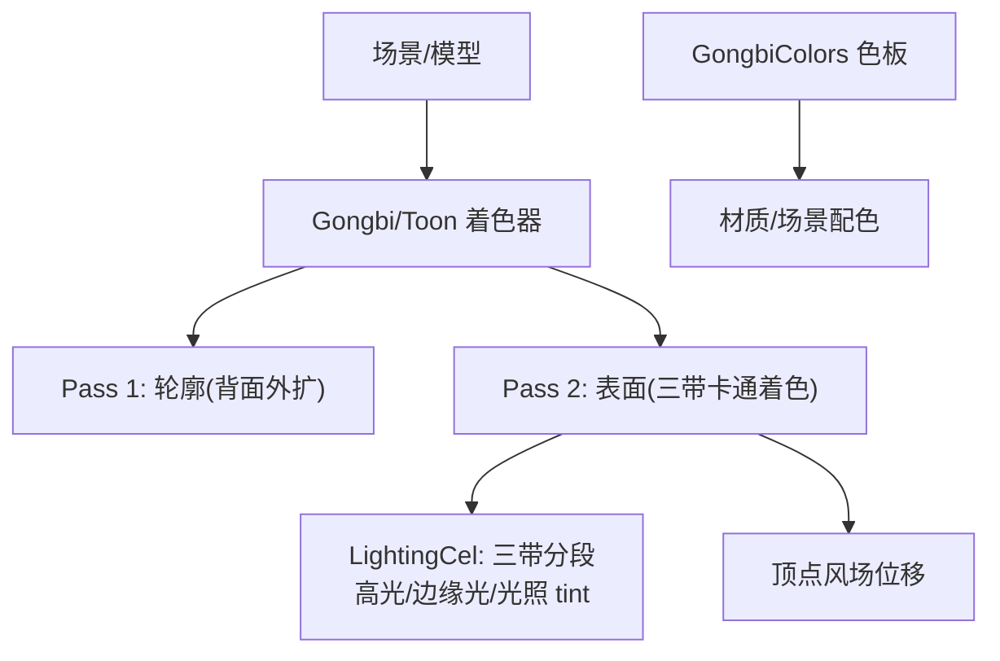
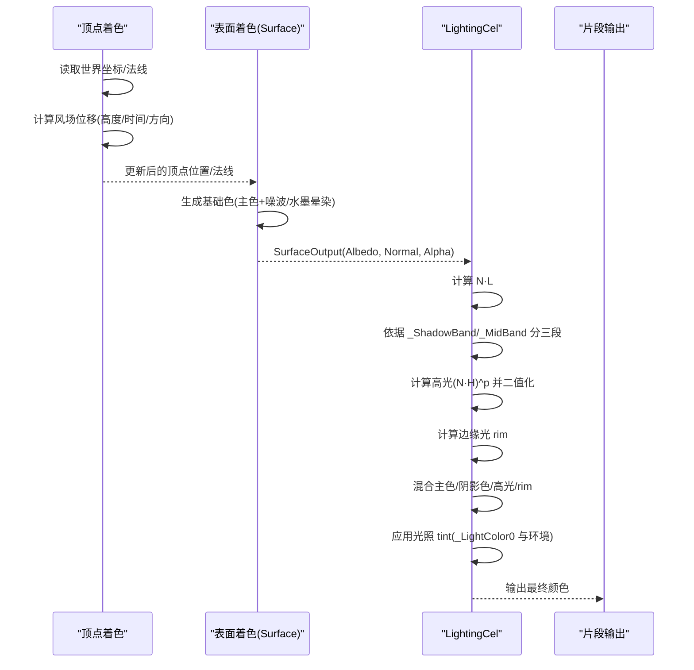
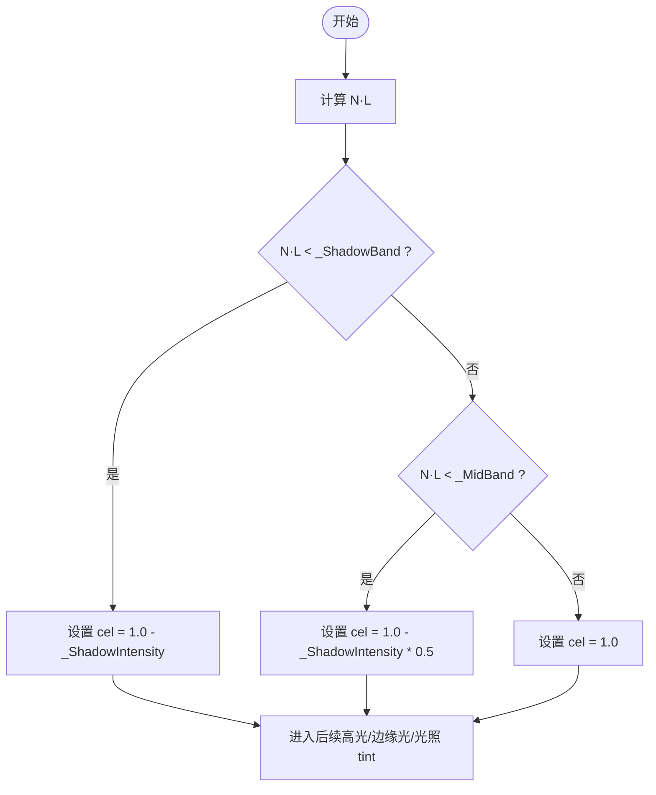
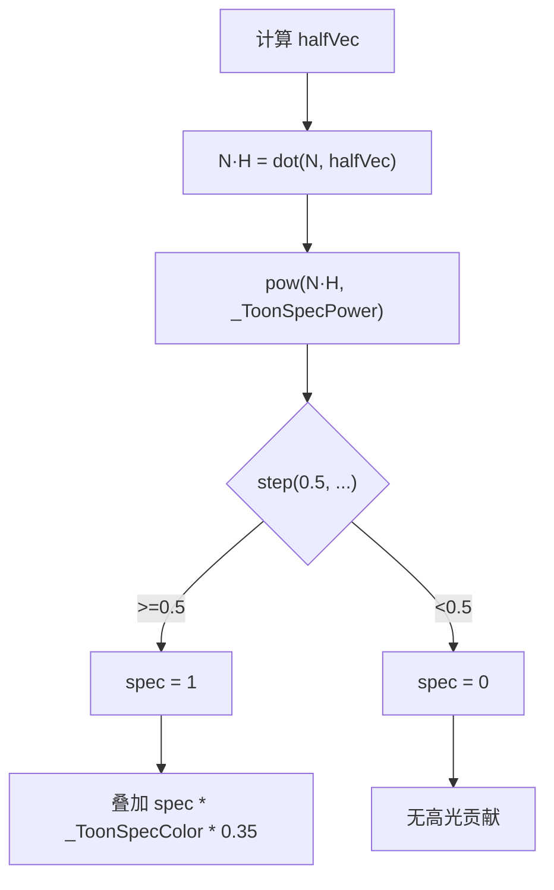
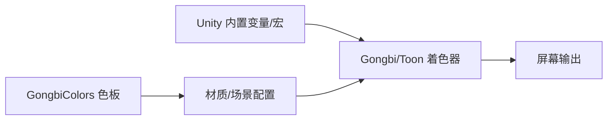

# 三带卡通着色算法

<cite>
**本文引用的文件**
- [GongbiToon.shader](file://Assets/Shaders/GongbiToon.shader)
- [GongbiColors.cs](file://Assets/Scripts/GongbiColors.cs)
- [AGENTS.md](file://AGENTS.md)
</cite>

## 目录
1. [简介](#简介)
2. [项目结构](#项目结构)
3. [核心组件](#核心组件)
4. [架构总览](#架构总览)
5. [详细组件分析](#详细组件分析)
6. [依赖关系分析](#依赖关系分析)
7. [性能考量](#性能考量)
8. [故障排查指南](#故障排查指南)
9. [结论](#结论)
10. [附录](#附录)

## 简介
本技术文档聚焦于工笔画风格渲染中的“三带卡通着色”算法，围绕以下关键点展开：阴影带阈值（_ShadowBand）的工作原理与判定逻辑、中间带阈值（_MidBand）的渐变过渡与分段控制、高光处理（镜面反射向量、强度与色彩混合）、阴影强度（_ShadowIntensity）对明暗对比的影响、光照 tint（_LightTint）与环境光/主光源的混合策略。同时提供性能优化建议与参数调优最佳实践，帮助在移动端（如 Meta Quest 3）上获得稳定且具艺术表现力的渲染效果。

## 项目结构
本项目采用 Unity 标准着色管线，关键着色器位于 Assets/Shaders/GongbiToon.shader，包含两 Pass：
- 轮廓 Pass：背面剔除 + 视图空间法线外扩，用于勾勒墨线
- 表面 Pass：基于 SurfaceOutput 的自定义 LightingCel，实现三带卡通着色、边缘背光、风场顶点位移等

颜色体系由脚本 GongbiColors.cs 提供传统矿物颜料色板及派生阴影色，便于材质与场景构建时统一配色。

图表来源
- [GongbiToon.shader:24-205](file://Assets/Shaders/GongbiToon.shader#L24-L205)
- [GongbiColors.cs:1-72](file://Assets/Scripts/GongbiColors.cs#L1-L72)

章节来源
- [AGENTS.md:110-118](file://AGENTS.md#L110-L118)
- [GongbiToon.shader:24-205](file://Assets/Shaders/GongbiToon.shader#L24-L205)
- [GongbiColors.cs:1-72](file://Assets/Scripts/GongbiColors.cs#L1-L72)

## 核心组件
- 三带分段照明：通过法线与光线点积 N·L 与两个阈值 _ShadowBand、_MidBand 将表面划分为阴影带、中间带、亮带三段，分别赋予不同亮度系数，形成硬边卡通风格。
- 高光处理：使用半角向量计算镜面反射，并通过幂次与阶跃函数得到离散的高光区域，叠加到最终颜色。
- 边缘背光：基于视角与法线夹角计算 rim 光，模拟宣纸背光质感。
- 光照 tint：将主光源颜色与环境光进行插值混合，影响整体色调与氛围。
- 风场顶点位移：根据世界高度与时间产生正弦形摇摆，增强植物/布料的自然动态。

章节来源
- [GongbiToon.shader:128-153](file://Assets/Shaders/GongbiToon.shader#L128-L153)
- [GongbiToon.shader:168-183](file://Assets/Shaders/GongbiToon.shader#L168-L183)

## 架构总览
下图展示了从顶点到片段的完整数据流，包括风场位移、三带分段、高光与边缘光、以及光照 tint 的混合过程。

图表来源
- [GongbiToon.shader:128-153](file://Assets/Shaders/GongbiToon.shader#L128-L153)
- [GongbiToon.shader:168-183](file://Assets/Shaders/GongbiToon.shader#L168-L183)
- [GongbiToon.shader:185-203](file://Assets/Shaders/GongbiToon.shader#L185-L203)

## 详细组件分析

### 阴影带阈值 _ShadowBand 的工作原理
- 输入：法线 s.Normal 与主光源方向 lightDir 的点积 N·L
- 判定逻辑：
  - 若 N·L < _ShadowBand：进入阴影带，亮度系数为 1.0 - _ShadowIntensity
  - 否则继续判断是否小于 _MidBand
- 作用：控制阴影区域的起始范围；阈值越小，阴影带越窄，反之阴影带更宽

图表来源
- [GongbiToon.shader:128-139](file://Assets/Shaders/GongbiToon.shader#L128-L139)

章节来源
- [GongbiToon.shader:128-139](file://Assets/Shaders/GongbiToon.shader#L128-L139)

### 中间带阈值 _MidBand 的作用机制
- 当 N·L 处于 [_ShadowBand, _MidBand) 区间时，属于中间带，亮度系数为 1.0 - _ShadowIntensity * 0.5
- 该设计实现了“三段式”硬边过渡：阴影带、中间带、亮带，避免连续渐变带来的体积感过强，保持卡通风格
- 调节 _MidBand 可改变中间带的宽度，从而影响阴影到亮部的过渡范围

章节来源
- [GongbiToon.shader:132-138](file://Assets/Shaders/GongbiToon.shader#L132-L138)

### 高光处理算法
- 半角向量 halfVec = normalize(lightDir + viewDir)
- 镜面项 N·H = max(dot(s.Normal, halfVec), 0)
- 高光强度 spec = step(0.5, pow(N·H, _ToonSpecPower))
  - 使用幂次提升对比度，再通过阶跃函数得到离散高光
- 高光颜色与强度：spec * _ToonSpecColor.rgb * 0.35
- 注意：此处未显式乘以逐像素衰减 atten，但后续会乘以 (atten * 2)，因此高光也会受距离/遮挡影响

图表来源
- [GongbiToon.shader:140-143](file://Assets/Shaders/GongbiToon.shader#L140-L143)
- [GongbiToon.shader:147-149](file://Assets/Shaders/GongbiToon.shader#L147-L149)

章节来源
- [GongbiToon.shader:140-143](file://Assets/Shaders/GongbiToon.shader#L140-L143)
- [GongbiToon.shader:147-149](file://Assets/Shaders/GongbiToon.shader#L147-L149)

### 阴影强度 _ShadowIntensity 的影响
- 控制阴影带与中间带的亮度衰减程度
- 阴影带亮度 = 1.0 - _ShadowIntensity
- 中间带亮度 = 1.0 - _ShadowIntensity * 0.5
- 增大 _ShadowIntensity 会使阴影更深、对比更强；减小则使画面更柔和
- 与 _ShadowColor 共同决定阴影区的基础色映射（阴影带以 _ShadowColor 为主，亮部以 _MainColor 为主）

章节来源
- [GongbiToon.shader:132-139](file://Assets/Shaders/GongbiToon.shader#L132-L139)
- [GongbiToon.shader:147-151](file://Assets/Shaders/GongbiToon.shader#L147-L151)

### 光照 tint _LightTint 的集成方式
- 将主光源颜色 _LightColor0 与环境光（默认白色 1,1,1）进行线性插值，权重为 _LightTint
- 公式语义：baseColor *= lerp(白, 主光源色, _LightTint) * (atten * 2)
- 作用：
  - _LightTint=0：仅环境光（冷/中性），画面偏平
  - _LightTint=1：完全主光源色，强调暖/冷色调氛围
- 与三带分段结合，可在不同明暗带下呈现一致的色调倾向

章节来源
- [GongbiToon.shader:151-151](file://Assets/Shaders/GongbiToon.shader#L151-L151)

### 边缘背光（Rim Light）
- 计算 rim = pow(1.0 - saturate(dot(s.Normal, viewDir)), _RimPower)
- 叠加 rim * _RimColor.rgb * _RimIntensity
- 效果：在物体边缘产生柔和的背光，模拟宣纸透光质感，增强轮廓可读性

章节来源
- [GongbiToon.shader:144-149](file://Assets/Shaders/GongbiToon.shader#L144-L149)

### 风场顶点位移（可选特性）
- 在世界空间内按高度因子与时间相位计算正弦摇摆，叠加湍流扰动
- 通过 _WindSway 控制强度，支持全局风参数（速度、幅度、湍流、方向、阵风密度、强度）
- 应用于顶点着色阶段，不影响片段着色复杂度

章节来源
- [GongbiToon.shader:68-88](file://Assets/Shaders/GongbiToon.shader#L68-L88)
- [GongbiToon.shader:168-183](file://Assets/Shaders/GongbiToon.shader#L168-L183)

## 依赖关系分析
- 着色器依赖 Unity 内置变量与宏：_Time、UNITY_MATRIX_*、_LightColor0、atten 等
- 表面着色阶段依赖 SurfaceOutput 结构体，由 Unity 自动填充法线、世界坐标等
- 颜色体系由 GongbiColors.cs 提供静态色板，便于在材质或场景中统一配置

图表来源
- [GongbiToon.shader:128-153](file://Assets/Shaders/GongbiToon.shader#L128-L153)
- [GongbiColors.cs:1-72](file://Assets/Scripts/GongbiColors.cs#L1-L72)

章节来源
- [GongbiToon.shader:128-153](file://Assets/Shaders/GongbiToon.shader#L128-L153)
- [GongbiColors.cs:1-72](file://Assets/Scripts/GongbiColors.cs#L1-L72)

## 性能考量
- 目标平台：Meta Quest 3（Android ARM64，IL2CPP），需严格控制 GPU 开销
- 三带分段使用分支与比较，成本低；高光使用 pow + step，注意指数不宜过大导致精度问题
- 顶点风场位移仅在需要时使用（_WindSway > 0），可减少不必要的计算
- 关闭 GPU Instancing（因每材料 _WindSway 不同），依赖静态批处理减少 Draw Call
- 建议：
  - 合理设置 _ToonSpecPower，避免过高指数造成高频噪声
  - 控制 _PaperGrain 与 _InkWash 的强度，避免过多哈希与纹理采样
  - 使用合适的 LOD 与裁剪策略，减少不可见几何体的绘制

[本节为通用性能指导，不直接分析具体代码行]

## 故障排查指南
- 阴影带过深或过浅：调整 _ShadowIntensity 与 _ShadowBand，确保阴影带宽度符合预期
- 高光不明显：提高 _ToonSpecPower 或 _ToonSpecColor 强度；检查 N·H 计算与 step 阈值
- 边缘光过强或过弱：调节 _RimIntensity 与 _RimPower，避免过度曝光
- 光照 tint 异常：确认 _LightTint 与场景光照颜色搭配，避免与环境光冲突
- 风场抖动异常：检查 _WindSpeed、_WindMagnitude、_WindIntensity 与 _WindSway 的组合

章节来源
- [GongbiToon.shader:128-153](file://Assets/Shaders/GongbiToon.shader#L128-L153)
- [GongbiToon.shader:168-183](file://Assets/Shaders/GongbiToon.shader#L168-L183)

## 结论
三带卡通着色通过 _ShadowBand 与 _MidBand 将 N·L 划分为三段，配合 _ShadowIntensity 控制明暗对比，形成清晰的硬边风格。高光采用半角向量与幂次阶跃，边缘光增强轮廓可读性，光照 tint 统一色调氛围。结合风场顶点位移与纸张纹理细节，可实现具有传统工笔画韵味的实时渲染效果。在移动端平台上，通过合理的参数调优与性能优化，可获得稳定且富有表现力的视觉体验。

[本节为总结性内容，不直接分析具体代码行]

## 附录
- 参数速查
  - _ShadowBand：阴影带阈值，控制阴影起始范围
  - _MidBand：中间带阈值，控制阴影到亮部的过渡宽度
  - _ShadowIntensity：阴影强度，控制阴影带与中间带的亮度衰减
  - _ToonSpecColor / _ToonSpecPower：高光颜色与强度
  - _RimColor / _RimIntensity / _RimPower：边缘光颜色、强度与形状
  - _LightTint：光照 tint 影响，混合环境光与主光源色
  - _WindSway 及相关风参数：顶点风场位移强度与动态

- 推荐调参流程
  - 先设定 _ShadowBand 与 _MidBand，确定三段分布
  - 再调整 _ShadowIntensity，获得合适的明暗对比
  - 微调 _ToonSpecPower 与 _ToonSpecColor，控制高光大小与强度
  - 设置 _Rim* 参数，增强边缘轮廓
  - 最后调节 _LightTint，统一色调氛围

[本节为补充信息，不直接分析具体代码行]