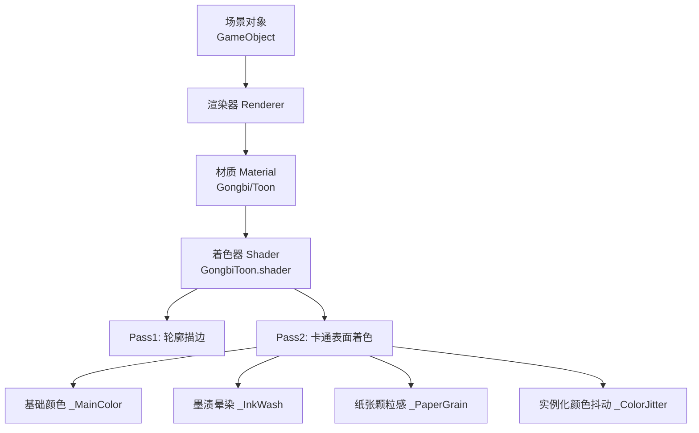
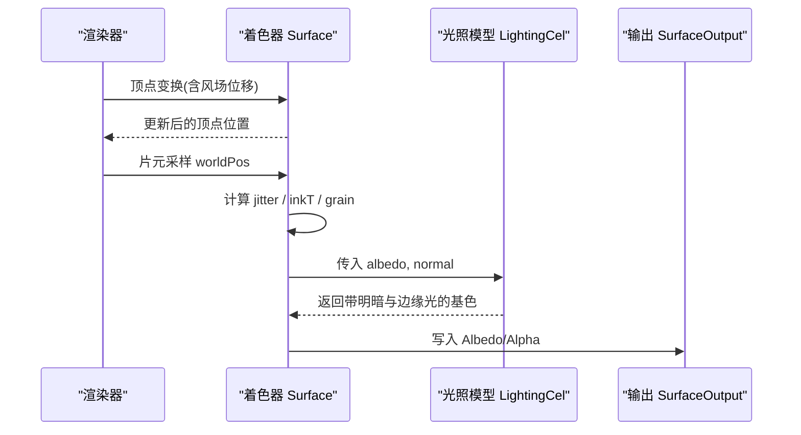
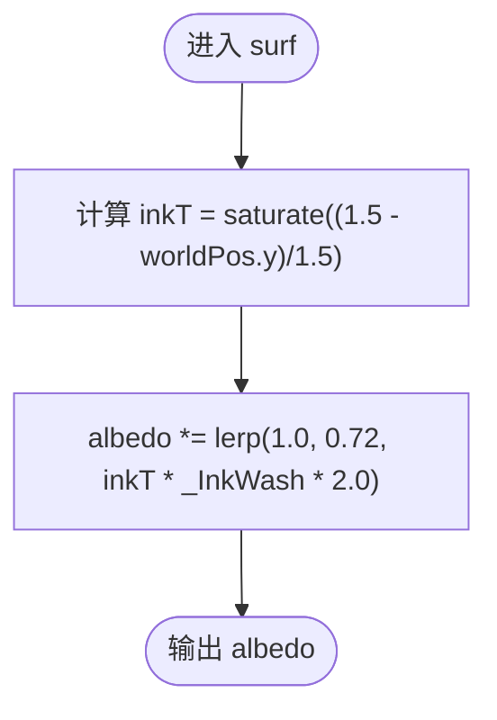
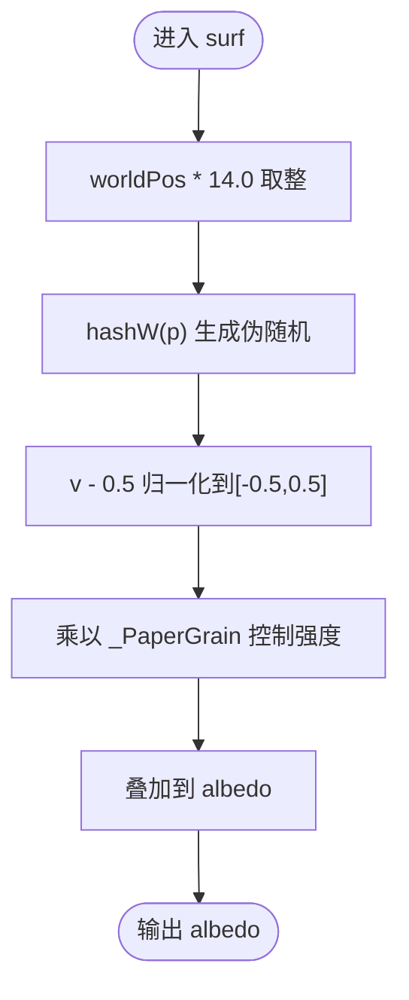
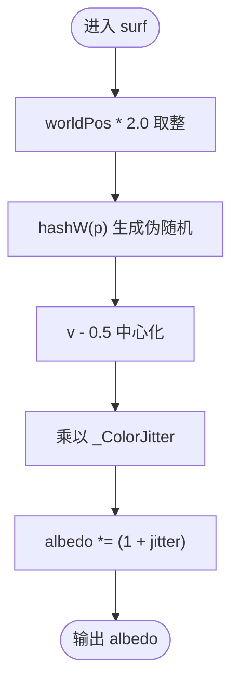
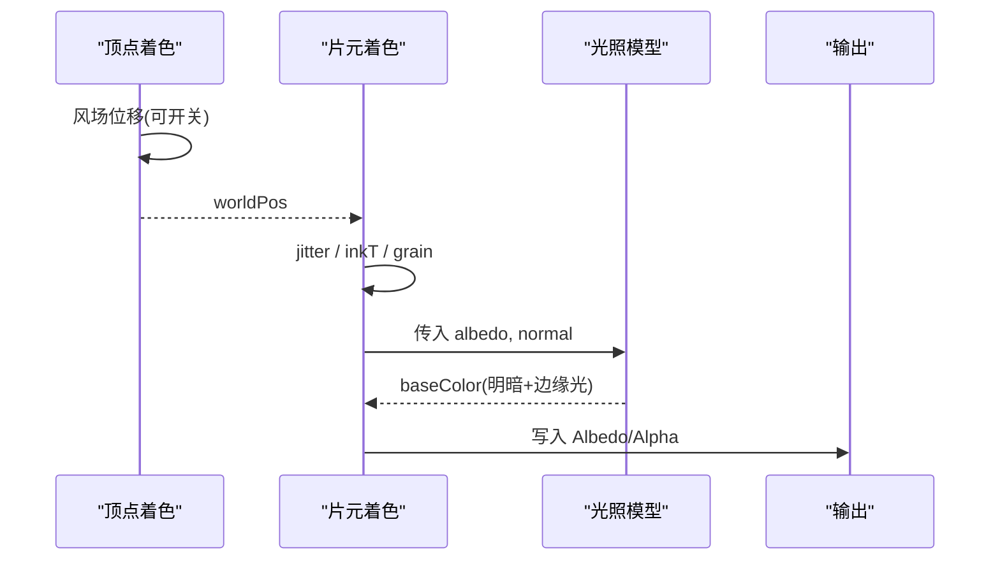
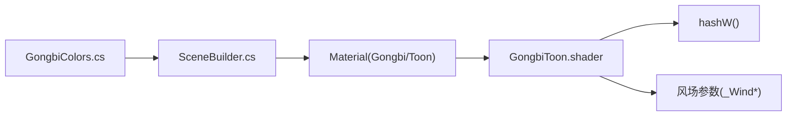

# 宣纸纹理效果

<cite>
**本文引用的文件**
- [GongbiToon.shader](file://Assets/Shaders/GongbiToon.shader)
- [GongbiColors.cs](file://Assets/Scripts/GongbiColors.cs)
- [SceneBuilder.cs](file://Assets/Scripts/Environment/SceneBuilder.cs)
</cite>

## 目录
1. [简介](#简介)
2. [项目结构](#项目结构)
3. [核心组件](#核心组件)
4. [架构总览](#架构总览)
5. [详细组件分析](#详细组件分析)
6. [依赖关系分析](#依赖关系分析)
7. [性能考量](#性能考量)
8. [故障排查指南](#故障排查指南)
9. [结论](#结论)
10. [附录：参数调优与艺术对照](#附录：参数调优与艺术对照)

## 简介
本技术文档聚焦于工笔画着色器中的“宣纸纹理”效果，围绕三个关键特性展开：墨渍晕染（_InkWash）、纸张颗粒感（_PaperGrain）与实例化颜色抖动（_ColorJitter）。文档从算法实现、数据流、渲染管线集成到参数调优进行系统化说明，并结合传统工笔画技法解释其视觉语义与艺术价值。

## 项目结构
- 着色器位于 Assets/Shaders/GongbiToon.shader，提供轮廓描边 Pass 与卡通表面着色 Pass，并在表面着色阶段叠加宣纸纹理相关效果。
- 颜色常量与阴影派生逻辑位于 Assets/Scripts/GongbiColors.cs，为材质主色与阴影色提供统一来源。
- 场景构建脚本 Assets/Scripts/Environment/SceneBuilder.cs 负责创建并配置使用 Gongbi/Toon 的材质，便于在场景中启用上述纹理效果。

图表来源
- [GongbiToon.shader:1-22](file://Assets/Shaders/GongbiToon.shader#L1-L22)
- [GongbiToon.shader:31-96](file://Assets/Shaders/GongbiToon.shader#L31-L96)
- [GongbiToon.shader:98-204](file://Assets/Shaders/GongbiToon.shader#L98-L204)

章节来源
- [GongbiToon.shader:1-22](file://Assets/Shaders/GongbiToon.shader#L1-L22)
- [SceneBuilder.cs:42-59](file://Assets/Scripts/Environment/SceneBuilder.cs#L42-L59)

## 核心组件
- 墨渍晕染（_InkWash）：基于世界坐标高度计算墨色浓度渐变，模拟颜料向底部汇聚的晕染效果。
- 纸张颗粒感（_PaperGrain）：通过高频噪声扰动亮度，模拟宣纸纤维的细密颗粒质感。
- 实例化颜色抖动（_ColorJitter）：对每个实例的颜色进行微小随机偏移，避免批量渲染时的重复感。
- 合成流程：基础颜色 → 颜色抖动 → 墨渍晕染 → 颗粒感 → 光照与轮廓。

章节来源
- [GongbiToon.shader:112-117](file://Assets/Shaders/GongbiToon.shader#L112-L117)
- [GongbiToon.shader:185-203](file://Assets/Shaders/GongbiToon.shader#L185-L203)

## 架构总览
该着色器采用双 Pass 结构：
- Pass1（轮廓）：背面挤出描边，增强工笔线条感。
- Pass2（表面）：卡通着色 + 宣纸纹理叠加。

图表来源
- [GongbiToon.shader:168-183](file://Assets/Shaders/GongbiToon.shader#L168-L183)
- [GongbiToon.shader:128-154](file://Assets/Shaders/GongbiToon.shader#L128-L154)
- [GongbiToon.shader:185-203](file://Assets/Shaders/GongbiToon.shader#L185-L203)

## 详细组件分析

### 墨渍晕染（_InkWash）
- 原理概述
  - 以世界坐标 Y 轴作为“高度”，越靠近底部（Y 越小），墨色浓度越高。
  - 通过线性插值将基础颜色向较深的色调混合，形成“颜料下沉”的视觉效果。
- 关键步骤
  - 计算 inkT = saturate((1.5 - worldPos.y) / 1.5)，使底部区域获得更高权重。
  - 使用 lerp(1.0, 0.72, inkT * _InkWash * 2.0) 控制变暗程度，_InkWash 越大，底部越深。
- 复杂度与性能
  - 仅涉及一次除法、一次乘加与一次插值，开销极低。
- 错误处理与边界
  - 使用 saturate 确保 inkT ∈ [0,1]，避免过度变暗或负值。
- 与传统技法的对应
  - 对应“积墨”“宿墨”中墨色自然沉淀、底部更浓的观感。

图表来源
- [GongbiToon.shader:194-196](file://Assets/Shaders/GongbiToon.shader#L194-L196)

章节来源
- [GongbiToon.shader:194-196](file://Assets/Shaders/GongbiToon.shader#L194-L196)

### 纸张颗粒感（_PaperGrain）
- 原理概述
  - 使用高频哈希噪声在世界坐标上采样，产生细碎亮度扰动，模拟宣纸纤维的颗粒质感。
- 关键步骤
  - 以 floor(worldPos * 14.0) 量化空间，提高噪声稳定性并避免闪烁。
  - hashW(...) 生成伪随机值，再减去 0.5 得到 [-0.5, 0.5] 范围的扰动。
  - 乘以 _PaperGrain 控制强度，叠加到 albedo。
- 复杂度与性能
  - 单次哈希与加减运算，成本极低；高频采样带来细节但不会显著影响帧率。
- 与传统技法的对应
  - 对应宣纸表面的天然纤维纹理与手工纸的粗糙触感。

图表来源
- [GongbiToon.shader:198-199](file://Assets/Shaders/GongbiToon.shader#L198-L199)
- [GongbiToon.shader:162-166](file://Assets/Shaders/GongbiToon.shader#L162-L166)

章节来源
- [GongbiToon.shader:162-166](file://Assets/Shaders/GongbiToon.shader#L162-L166)
- [GongbiToon.shader:198-199](file://Assets/Shaders/GongbiToon.shader#L198-L199)

### 实例化颜色抖动（_ColorJitter）
- 原理概述
  - 对每个实例的颜色进行微小随机偏移，打破静态批处理下的“克隆感”。
- 关键步骤
  - 使用 hashW(floor(worldPos * 2.0)) 生成稳定的伪随机数。
  - 将结果映射到 [-0.5, 0.5] 后乘以 _ColorJitter，再乘以 albedo，实现逐实例的色彩微差。
- 复杂度与性能
  - 单次哈希与乘法，开销极小；适合大量实例同时渲染。
- 与传统技法的对应
  - 对应手工绘制时颜料厚薄不均、色彩微差的“手作感”。

图表来源
- [GongbiToon.shader:189-192](file://Assets/Shaders/GongbiToon.shader#L189-L192)
- [GongbiToon.shader:162-166](file://Assets/Shaders/GongbiToon.shader#L162-L166)

章节来源
- [GongbiToon.shader:189-192](file://Assets/Shaders/GongbiToon.shader#L189-L192)
- [GongbiToon.shader:162-166](file://Assets/Shaders/GongbiToon.shader#L162-L166)

### 整体合成过程
- 顺序与层次
  - 基础颜色：_MainColor.rgb
  - 颜色抖动：albedo *= (1 + jitter)
  - 墨渍晕染：albedo *= lerp(1.0, 0.72, inkT * _InkWash * 2.0)
  - 颗粒感：albedo += (hashW(...) - 0.5) * _PaperGrain
  - 光照与轮廓：LightingCel 计算明暗与边缘光，Pass1 描边叠加
- 数据流
  - 顶点阶段：风场位移（可选）
  - 片元阶段：纹理参数与噪声计算
  - 光照阶段：卡通分层 + 边缘光
  - 输出阶段：写入 SurfaceOutput

图表来源
- [GongbiToon.shader:168-183](file://Assets/Shaders/GongbiToon.shader#L168-L183)
- [GongbiToon.shader:185-203](file://Assets/Shaders/GongbiToon.shader#L185-L203)
- [GongbiToon.shader:128-154](file://Assets/Shaders/GongbiToon.shader#L128-L154)

章节来源
- [GongbiToon.shader:185-203](file://Assets/Shaders/GongbiToon.shader#L185-L203)
- [GongbiToon.shader:128-154](file://Assets/Shaders/GongbiToon.shader#L128-L154)

## 依赖关系分析
- 着色器内部依赖
  - hashW 函数用于 jitter、grain 的伪随机源，保证稳定且低成本。
  - 风场参数（_WindSpeed/_WindMagnitude/_WindIntensity 等）由外部脚本设置，影响顶点位移。
- 脚本与材质
  - SceneBuilder 创建材质并设置主色、阴影色、描边宽度与风场开关。
  - GongbiColors 提供矿物颜料色系与阴影派生方法，确保色彩一致性。
- 耦合与内聚
  - 纹理效果集中在 surf 阶段，内聚度高；光照与纹理解耦，便于独立调参。

图表来源
- [SceneBuilder.cs:42-59](file://Assets/Scripts/Environment/SceneBuilder.cs#L42-L59)
- [GongbiColors.cs:8-70](file://Assets/Scripts/GongbiColors.cs#L8-L70)
- [GongbiToon.shader:119-126](file://Assets/Shaders/GongbiToon.shader#L119-L126)
- [GongbiToon.shader:162-166](file://Assets/Shaders/GongbiToon.shader#L162-L166)

章节来源
- [SceneBuilder.cs:42-59](file://Assets/Scripts/Environment/SceneBuilder.cs#L42-L59)
- [GongbiColors.cs:8-70](file://Assets/Scripts/GongbiColors.cs#L8-L70)
- [GongbiToon.shader:119-126](file://Assets/Shaders/GongbiToon.shader#L119-L126)

## 性能考量
- 噪声函数选择
  - 使用轻量哈希 hashW，避免昂贵噪声采样，适合移动端与大规模实例。
- 采样频率
  - 颗粒感使用 floor(worldPos * 14.0)，高频但离散化，减少抗锯齿带来的闪烁。
- 批处理与实例化
  - 注释指出 GPU Instancing 关闭以避免风场变量冲突；静态批处理已足够降低 Draw Call。
- 建议
  - 若需进一步降本，可降低颗粒感采样频率（如 10.0→8.0）或减小 _PaperGrain。
  - 合理设置 _ColorJitter，过大可能导致色彩过曝或噪点明显。

[本节为通用性能指导，不直接分析具体代码行]

## 故障排查指南
- 现象：墨渍晕染不明显
  - 检查 _InkWash 是否过小；确认 worldPos.y 范围是否合理（过低可能超出预期区间）。
  - 参考路径：[GongbiToon.shader:194-196](file://Assets/Shaders/GongbiToon.shader#L194-L196)
- 现象：颗粒感过强或闪烁
  - 降低 _PaperGrain；调整 worldPos 缩放系数（如 14.0→12.0）以减少高频细节。
  - 参考路径：[GongbiToon.shader:198-199](file://Assets/Shaders/GongbiToon.shader#L198-L199)
- 现象：批量渲染出现“克隆感”
  - 增大 _ColorJitter；确保 worldPos 量化步长合适（当前 2.0）。
  - 参考路径：[GongbiToon.shader:189-192](file://Assets/Shaders/GongbiToon.shader#L189-L192)
- 现象：风场导致模型异常
  - 检查 _WindSway 是否为 0 或风场参数是否被正确设置。
  - 参考路径：[GongbiToon.shader:168-183](file://Assets/Shaders/GongbiToon.shader#L168-L183)

章节来源
- [GongbiToon.shader:168-183](file://Assets/Shaders/GongbiToon.shader#L168-L183)
- [GongbiToon.shader:189-192](file://Assets/Shaders/GongbiToon.shader#L189-L192)
- [GongbiToon.shader:194-196](file://Assets/Shaders/GongbiToon.shader#L194-L196)
- [GongbiToon.shader:198-199](file://Assets/Shaders/GongbiToon.shader#L198-L199)

## 结论
该着色器通过简洁高效的噪声与插值，实现了具有传统工笔画韵味的宣纸纹理：墨渍晕染体现“积墨”沉淀，颗粒感还原宣纸纤维，颜色抖动增添手绘温度。三者协同工作，既保持高性能，又具备丰富的可调性与艺术表现力。

[本节为总结性内容，不直接分析具体代码行]

## 附录：参数调优与艺术对照

- 目标：不同纸张质感
  - 细腻宣纸：较小 _PaperGrain（如 0.01–0.03），中等 _ColorJitter（如 0.04–0.08）
  - 粗犷手工纸：较大 _PaperGrain（如 0.05–0.1），适度 _ColorJitter（如 0.08–0.15）
  - 参考路径：[GongbiToon.shader:189-199](file://Assets/Shaders/GongbiToon.shader#L189-L199)

- 目标：不同墨色效果
  - 淡墨轻染：_InkWash 低（如 0.05–0.15），配合柔和 _ShadowIntensity
  - 重墨浓染：_InkWash 高（如 0.2–0.5），加深底部墨色
  - 参考路径：[GongbiToon.shader:194-196](file://Assets/Shaders/GongbiToon.shader#L194-L196)

- 目标：批量渲染的自然度
  - 适当提升 _ColorJitter，避免重复感；注意不要超过 0.3，以免过曝
  - 参考路径：[GongbiToon.shader:189-192](file://Assets/Shaders/GongbiToon.shader#L189-L192)

- 与传统工笔画技法的对应
  - 墨渍晕染 ↔ “积墨/宿墨”沉淀
  - 颗粒感 ↔ 宣纸纤维与手工纸肌理
  - 颜色抖动 ↔ 手工绘制的不均匀与温度感
  - 参考路径：[GongbiColors.cs:3-7](file://Assets/Scripts/GongbiColors.cs#L3-L7)

章节来源
- [GongbiToon.shader:189-199](file://Assets/Shaders/GongbiToon.shader#L189-L199)
- [GongbiColors.cs:3-7](file://Assets/Scripts/GongbiColors.cs#L3-L7)