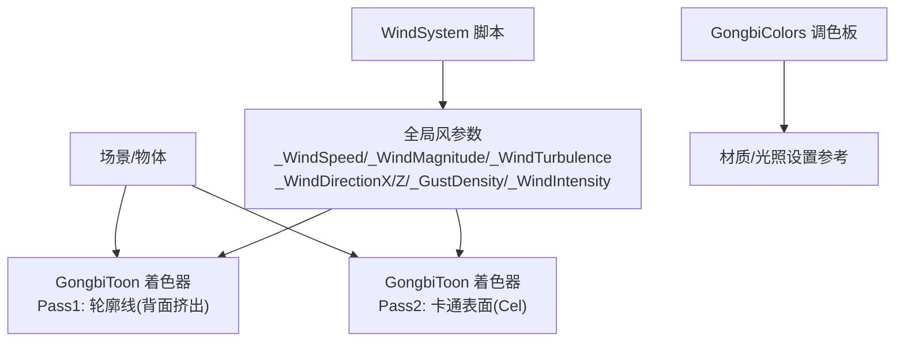
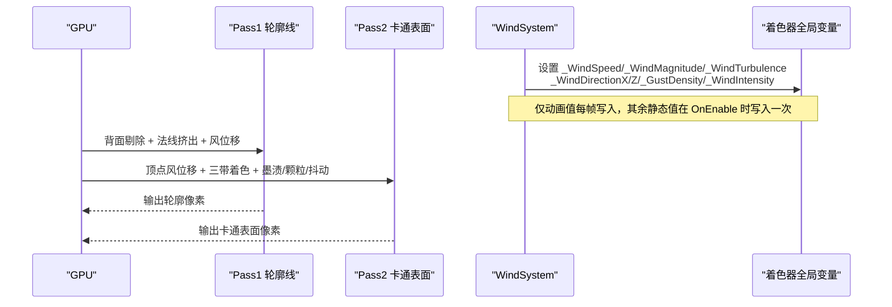
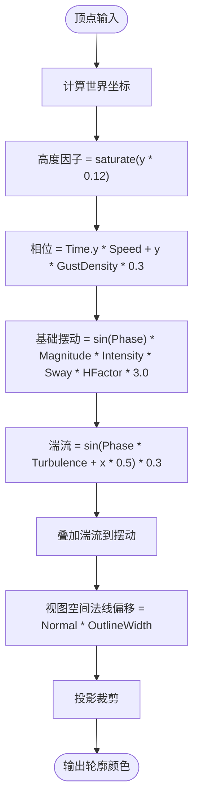
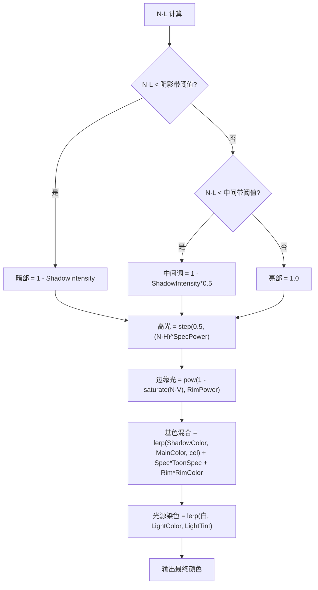
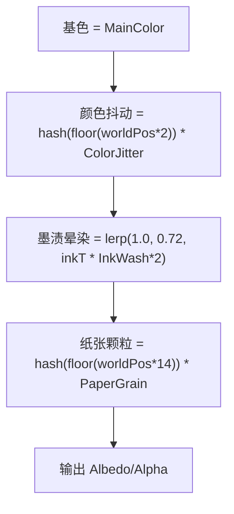
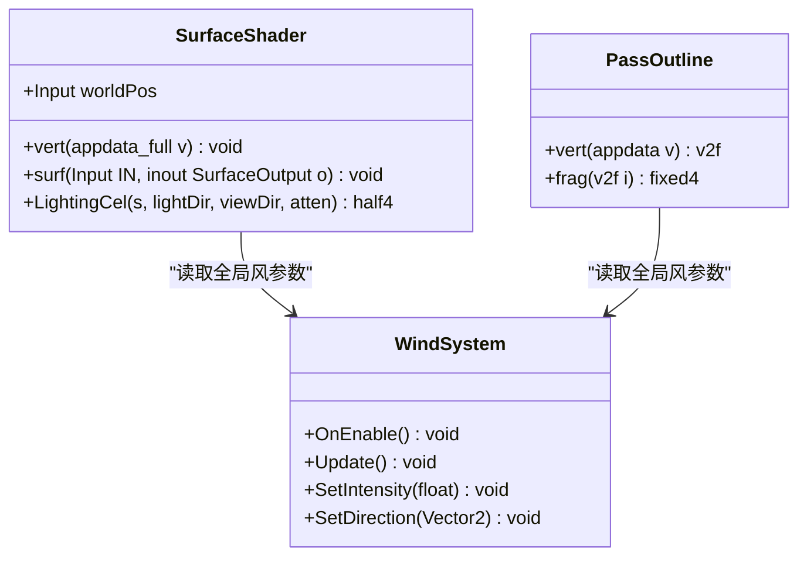
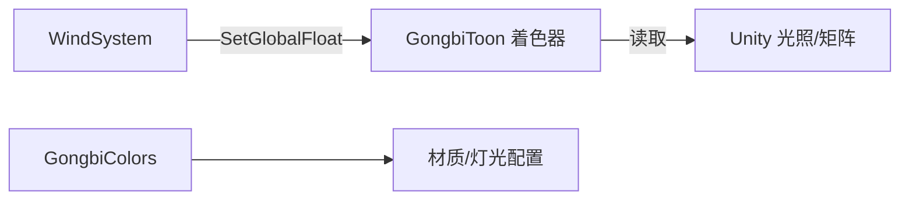

# 工笔画着色器

<cite>
**本文引用的文件**
- [GongbiToon.shader](file://Assets/Shaders/GongbiToon.shader)
- [WindSystem.cs](file://Assets/Scripts/Environment/WindSystem.cs)
- [GongbiColors.cs](file://Assets/Scripts/GongbiColors.cs)
</cite>

## 目录
1. [简介](#简介)
2. [项目结构](#项目结构)
3. [核心组件](#核心组件)
4. [架构总览](#架构总览)
5. [详细组件分析](#详细组件分析)
6. [依赖关系分析](#依赖关系分析)
7. [性能考量](#性能考量)
8. [故障排查指南](#故障排查指南)
9. [结论](#结论)
10. [附录：参数调优指南](#附录参数调优指南)

## 简介
本技术文档围绕 InkRidge 项目的工笔画风格渲染，聚焦于“GongbiToon”着色器的实现与调优。内容涵盖：
- 双面轮廓线（背面挤出 + 法线偏移）
- 三带卡通着色（阴影带阈值、中间带阈值、高光处理）
- 风摆动顶点位移（高度因子、相位偏移、湍流叠加）
- 宣纸纹理效果（墨渍晕染、纸张颗粒感、实例化颜色抖动）
- 参数调优建议与性能优化实践

## 项目结构
本项目中与工笔画着色相关的核心代码位于 Shaders 与 Scripts/Environment 目录：
- 着色器：Assets/Shaders/GongbiToon.shader
- 全局风系统：Assets/Scripts/Environment/WindSystem.cs
- 传统矿物颜料配色表：Assets/Scripts/GongbiColors.cs

图表来源
- [GongbiToon.shader:1-209](file://Assets/Shaders/GongbiToon.shader#L1-L209)
- [WindSystem.cs:1-79](file://Assets/Scripts/Environment/WindSystem.cs#L1-L79)
- [GongbiColors.cs:1-72](file://Assets/Scripts/GongbiColors.cs#L1-L72)

章节来源
- [GongbiToon.shader:1-209](file://Assets/Shaders/GongbiToon.shader#L1-L209)
- [WindSystem.cs:1-79](file://Assets/Scripts/Environment/WindSystem.cs#L1-L79)
- [GongbiColors.cs:1-72](file://Assets/Scripts/GongbiColors.cs#L1-L72)

## 核心组件
- GongbiToon 着色器
  - Pass1 轮廓线：通过背面剔除 + 沿视图空间法线向外挤出实现“描边”，并叠加风摆动顶点位移。
  - Pass2 卡通表面：基于自定义 LightingCel 的三带卡通着色，支持阴影带、中间带、高光、边缘光、光源染色、墨渍晕染、纸张颗粒与实例化颜色抖动。
- WindSystem 脚本
  - 每帧更新全局风参数（幅度、方向、强度），供着色器读取以实现植被等物体的风摆动。
- GongbiColors 调色板
  - 提供传统矿物颜料色值及派生阴影色，便于在材质或场景中统一风格。

章节来源
- [GongbiToon.shader:31-204](file://Assets/Shaders/GongbiToon.shader#L31-L204)
- [WindSystem.cs:11-79](file://Assets/Scripts/Environment/WindSystem.cs#L11-L79)
- [GongbiColors.cs:8-72](file://Assets/Scripts/GongbiColors.cs#L8-L72)

## 架构总览
GongbiToon 采用双 Pass 渲染：
- 第一遍绘制背面并沿法线挤出，形成稳定且可控的轮廓线；同时应用风位移，使轮廓随环境风摆动。
- 第二遍使用 Surface Shader + 自定义 Lighting 函数实现三带卡通着色，并在顶点阶段应用风位移，在片元阶段合成墨渍、颗粒与颜色抖动。

图表来源
- [GongbiToon.shader:31-204](file://Assets/Shaders/GongbiToon.shader#L31-L204)
- [WindSystem.cs:34-63](file://Assets/Scripts/Environment/WindSystem.cs#L34-L63)

## 详细组件分析

### 双面轮廓线技术（背面挤出 + 法线偏移）
- 背面剔除：将正面剔除，仅渲染背面，确保轮廓出现在模型边缘。
- 法线偏移：在视图空间中沿法线方向向外偏移一定宽度，得到稳定的描边厚度。
- 风位移：在顶点阶段计算世界坐标高度因子、相位偏移与湍流，叠加到 X/Z 方向，使轮廓也随风摆动。

图表来源
- [GongbiToon.shader:68-94](file://Assets/Shaders/GongbiToon.shader#L68-L94)

章节来源
- [GongbiToon.shader:31-96](file://Assets/Shaders/GongbiToon.shader#L31-L96)

### 三带卡通着色算法（阴影带阈值、中间带阈值、高光）
- 三带量化：根据法线与光照方向的点积 N·L，划分三个亮度带：
  - 低于阴影带阈值：暗部
  - 介于阴影带与中间带之间：中间调
  - 高于中间带：亮部
- 高光：使用半向量与法线的点积进行阶跃式高光，避免平滑渐变，保持卡通质感。
- 边缘光：基于视角与法线夹角计算 Rim，模拟背光下的宣纸发光感。
- 光源染色：将主光源颜色以受控比例混合到基色，增强氛围。

图表来源
- [GongbiToon.shader:128-154](file://Assets/Shaders/GongbiToon.shader#L128-L154)

章节来源
- [GongbiToon.shader:98-154](file://Assets/Shaders/GongbiToon.shader#L98-L154)

### 风摆动效果的顶点位移算法（高度因子、相位偏移、湍流叠加）
- 高度因子：按世界坐标 Y 线性缩放，越高部位摆动越大。
- 相位偏移：时间项与高度项共同决定摆动相位，产生波浪传播感。
- 湍流叠加：对相位再叠加高频扰动，增加自然随机性。
- 方向控制：通过全局风向分量（X/Z）将摆动映射到世界空间。

```mermaid
flowchart TD
VIn["顶点位置"] --> WP["世界坐标"]
WP --> HF["高度因子 = saturate(y * 0.12)"]
HF --> PH["相位 = Time.y * Speed + y * GustDensity * 0.3"]
PH --> SW["基础摆动 = sin(Phase) * Magnitude * Intensity * Sway * HF * 3.0"]
SW --> TR["湍流 = sin(Phase * Turbulence + x * 0.5) * 0.3"]
TR --> SUM["总摆动 = SW + 湍流 * ..."]
SUM --> DIR["按风向分量(_WindDirectionX/Z)偏移"]
DIR --> VO["写回顶点"]
```

图表来源
- [GongbiToon.shader:168-183](file://Assets/Shaders/GongbiToon.shader#L168-L183)
- [GongbiToon.shader:74-82](file://Assets/Shaders/GongbiToon.shader#L74-L82)
- [WindSystem.cs:49-63](file://Assets/Scripts/Environment/WindSystem.cs#L49-L63)

章节来源
- [GongbiToon.shader:74-82](file://Assets/Shaders/GongbiToon.shader#L74-L82)
- [GongbiToon.shader:168-183](file://Assets/Shaders/GongbiToon.shader#L168-L183)
- [WindSystem.cs:49-63](file://Assets/Scripts/Environment/WindSystem.cs#L49-L63)

### 宣纸纹理效果（墨渍晕染、纸张颗粒感、实例化颜色抖动）
- 墨渍晕染：依据世界坐标 Y 计算“下沉”程度，越靠近底部越深，模拟墨水在宣纸上自然沉淀。
- 纸张颗粒感：使用高频哈希噪声叠加到亮度通道，模拟宣纸纤维质感。
- 实例化颜色抖动：基于世界坐标取整后的哈希，为每个实例引入微小色差，打破克隆感，同时兼容静态批处理。

图表来源
- [GongbiToon.shader:185-203](file://Assets/Shaders/GongbiToon.shader#L185-L203)

章节来源
- [GongbiToon.shader:185-203](file://Assets/Shaders/GongbiToon.shader#L185-L203)

### 类图（着色器内部结构与数据流）

图表来源
- [GongbiToon.shader:31-204](file://Assets/Shaders/GongbiToon.shader#L31-L204)
- [WindSystem.cs:11-79](file://Assets/Scripts/Environment/WindSystem.cs#L11-L79)

## 依赖关系分析
- 着色器依赖的全局风参数由 WindSystem 每帧更新，包含速度、幅度、湍流、方向、阵风密度与强度。
- 着色器内部使用 Unity 内置矩阵与光照信息（如 LightColor0）完成光源染色与衰减。
- 颜色风格可参考 GongbiColors 提供的传统矿物颜料色值，用于材质或场景灯光配置。

图表来源
- [WindSystem.cs:26-63](file://Assets/Scripts/Environment/WindSystem.cs#L26-L63)
- [GongbiToon.shader:100-154](file://Assets/Shaders/GongbiToon.shader#L100-L154)
- [GongbiColors.cs:8-72](file://Assets/Scripts/GongbiColors.cs#L8-L72)

章节来源
- [WindSystem.cs:26-63](file://Assets/Scripts/Environment/WindSystem.cs#L26-L63)
- [GongbiToon.shader:100-154](file://Assets/Shaders/GongbiToon.shader#L100-L154)
- [GongbiColors.cs:8-72](file://Assets/Scripts/GongbiColors.cs#L8-L72)

## 性能考量
- 禁用 GPU Instancing：由于每材料独立的风参数与顶点位移，当前实现未启用 GPU 实例化，依赖静态批处理减少 DrawCall。
- 全局变量写入优化：WindSystem 仅在 OnEnable 时写入不常变的参数，Update 中仅写入动画相关参数，降低每帧开销。
- 哈希噪声：使用轻量级哈希函数生成高频噪声，避免额外纹理采样，提升性能。
- 目标版本：Surface Shader 使用 target 3.0，兼顾兼容性与性能。

[本节为通用性能讨论，不直接分析具体代码行]

## 故障排查指南
- 轮廓线过粗或过细：调整轮廓宽度参数，观察背面挤出量变化。
- 风摆动不明显：检查全局风幅度与强度，确认 WindSystem 已启用并正确设置方向。
- 卡通带边界过于锐利或柔和：调节阴影带与中间带阈值，观察三带分界变化。
- 高光过强或不可见：调整高光幂次与强度，确保半向量点积阈值合适。
- 边缘光过强或不可见：调整边缘光强度与幂次，注意视角与法线夹角的影响。
- 墨渍晕染过度：降低墨渍参数，避免整体偏暗。
- 纸张颗粒过强：降低颗粒强度，避免噪点干扰细节。
- 颜色抖动过大：降低实例化颜色抖动，避免色彩不一致。

章节来源
- [GongbiToon.shader:3-22](file://Assets/Shaders/GongbiToon.shader#L3-L22)
- [GongbiToon.shader:68-94](file://Assets/Shaders/GongbiToon.shader#L68-L94)
- [GongbiToon.shader:128-154](file://Assets/Shaders/GongbiToon.shader#L128-L154)
- [GongbiToon.shader:185-203](file://Assets/Shaders/GongbiToon.shader#L185-L203)
- [WindSystem.cs:49-63](file://Assets/Scripts/Environment/WindSystem.cs#L49-L63)

## 结论
GongbiToon 着色器通过背面挤出与法线偏移实现稳定可控的双面轮廓线，结合三带卡通着色、边缘光与光源染色，营造出工笔画风格的视觉语言。风摆动通过高度因子、相位偏移与湍流叠加，赋予植被等元素自然动态。宣纸纹理通过墨渍晕染、纸张颗粒与实例化颜色抖动，增强了手绘质感。配合 WindSystem 的全局风参数管理，可在不同场景中快速调出一致的工笔画风格。

[本节为总结性内容，不直接分析具体代码行]

## 附录：参数调优指南
以下为关键参数的作用说明与调优建议（对应着色器属性）：
- 轮廓宽度（Outline Width）：控制背面挤出厚度，过小不易见，过大影响模型体积感。
- 阴影强度（Shadow Intensity）：控制暗带与中间带的对比度，增大可强化明暗层次。
- 阴影带阈值（Shadow Band）：划分暗部与中间调的边界，较低会使更多区域进入暗部。
- 中间带阈值（Mid Band）：划分中间调与亮部的边界，较高会扩大中间调范围。
- 高光颜色/幂次（Toon Spec Color/Power）：控制高光强度与分布，幂次越高高光越集中。
- 光源染色影响（Light Tint Influence）：将主光源颜色融入基色，增强氛围。
- 风摆动总量（Wind Sway Amount）：控制顶点位移强度，0 表示无风。
- 墨渍晕染（Base Ink Wash）：控制底部墨渍加深程度，适合表现宣纸沉淀。
- 实例化颜色抖动（Per-Instance Color Jitter）：为实例引入微小色差，避免克隆感。
- 纸张颗粒（Paper Grain）：控制高频噪声强度，增强宣纸纤维质感。
- 边缘光颜色/强度/幂次（Rim Color/Intensity/Power）：控制背光边缘发光强度与范围，营造宣纸透光感。

章节来源
- [GongbiToon.shader:3-22](file://Assets/Shaders/GongbiToon.shader#L3-L22)