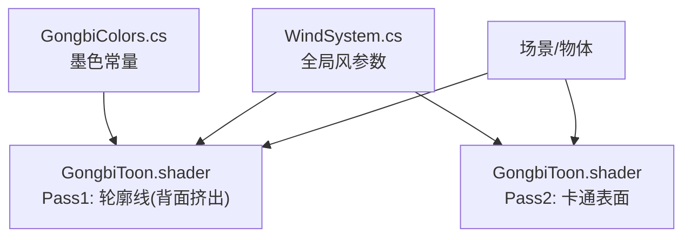
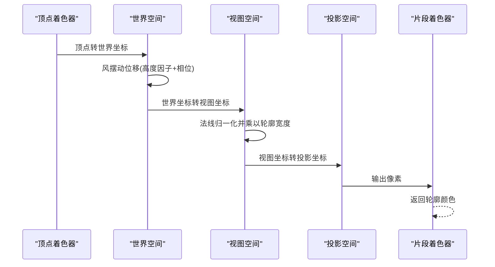
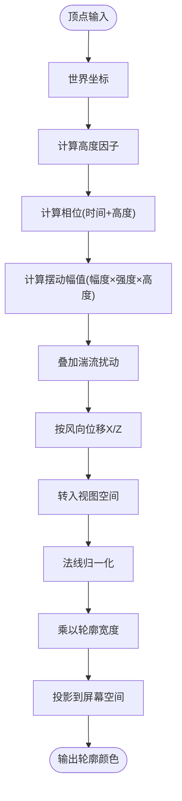
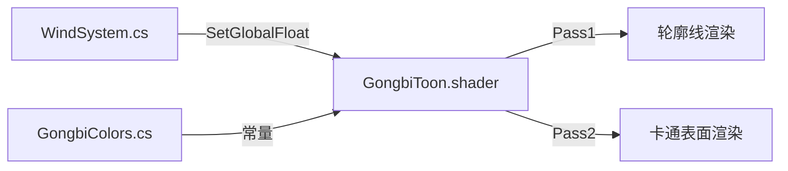

# 轮廓线渲染系统

<cite>
**本文引用的文件**
- [GongbiToon.shader](file://Assets/Shaders/GongbiToon.shader)
- [WindSystem.cs](file://Assets/Scripts/Environment/WindSystem.cs)
- [GongbiColors.cs](file://Assets/Scripts/GongbiColors.cs)
</cite>

## 目录
1. [简介](#简介)
2. [项目结构](#项目结构)
3. [核心组件](#核心组件)
4. [架构总览](#架构总览)
5. [详细组件分析](#详细组件分析)
6. [依赖关系分析](#依赖关系分析)
7. [性能考量](#性能考量)
8. [故障排查指南](#故障排查指南)
9. [结论](#结论)
10. [附录：调优与最佳实践](#附录：调优与最佳实践)

## 简介
本技术文档聚焦于工笔画着色器的“轮廓线渲染系统”，围绕背面挤出算法、法线偏移计算、视图空间变换、深度写入控制、轮廓宽度参数机制、传统墨色颜色配置、风摆动效果在轮廓线上的应用，以及调优与排错进行系统化说明。目标是帮助读者在不深入阅读源码的情况下，也能理解并高效调优该系统的视觉效果与性能。

## 项目结构
本项目采用Unity工程组织方式，关键实现位于着色器与脚本中：
- 着色器：GongbiToon.shader 实现了双Pass渲染管线，其中Pass 1负责轮廓线（背面挤出），Pass 2负责卡通表面着色。
- 脚本：WindSystem.cs 提供全局风场参数驱动；GongbiColors.cs 提供传统矿物颜料与墨色常量。

图表来源
- [GongbiToon.shader:31-96](file://Assets/Shaders/GongbiToon.shader#L31-L96)
- [GongbiToon.shader:98-204](file://Assets/Shaders/GongbiToon.shader#L98-L204)
- [WindSystem.cs:26-63](file://Assets/Scripts/Environment/WindSystem.cs#L26-L63)
- [GongbiColors.cs:44-46](file://Assets/Scripts/GongbiColors.cs#L44-L46)

章节来源
- [GongbiToon.shader:1-209](file://Assets/Shaders/GongbiToon.shader#L1-L209)
- [WindSystem.cs:1-79](file://Assets/Scripts/Environment/WindSystem.cs#L1-L79)
- [GongbiColors.cs:1-72](file://Assets/Scripts/GongbiColors.cs#L1-L72)

## 核心组件
- 轮廓线Pass（背面挤出）：通过剔除正面、仅绘制背面三角形，并在视图空间沿法线方向向外偏移顶点，形成统一厚度的轮廓线。
- 风摆动：在世界空间对顶点施加基于高度因子与相位的正弦位移，再进入视图空间进行法线偏移，使轮廓线随“风”自然摆动。
- 颜色与透明度：轮廓颜色由材质属性或脚本注入的常量决定，支持传统墨色的RGB与Alpha设置。
- 深度写入：轮廓Pass开启ZWrite，确保轮廓正确遮挡背景，避免闪烁或穿透。

章节来源
- [GongbiToon.shader:31-96](file://Assets/Shaders/GongbiToon.shader#L31-L96)
- [GongbiToon.shader:98-204](file://Assets/Shaders/GongbiToon.shader#L98-L204)
- [GongbiColors.cs:44-46](file://Assets/Scripts/GongbiColors.cs#L44-L46)

## 架构总览
轮廓线渲染流程如下：
1. 顶点阶段：将本地顶点转换到世界空间，应用风摆动位移。
2. 视图空间变换：将世界坐标转换为视图坐标。
3. 法线偏移：将视图空间的法线归一化后乘以轮廓宽度，得到偏移量并叠加到视图位置。
4. 投影与输出：使用投影矩阵得到屏幕空间位置，片段阶段直接输出轮廓颜色。

图表来源
- [GongbiToon.shader:68-94](file://Assets/Shaders/GongbiToon.shader#L68-L94)

## 详细组件分析

### 背面挤出算法与法线偏移
- 剔除策略：Pass设置为剔除正面（Cull Front），只绘制背面三角形，从而在视角边缘产生“外扩”的轮廓。
- 法线偏移：在视图空间计算法线（使用逆转置模型视图矩阵），归一化后乘以轮廓宽度，作为偏移向量加到视图坐标上。
- 深度写入：开启ZWrite On，保证轮廓能正确参与深度测试，避免被背景错误覆盖。

复杂度与影响：
- 每帧每个背面顶点执行一次世界/视图变换与一次法线变换，开销较低。
- 轮廓宽度越大，额外绘制的背面面积越多，GPU填充压力上升。

章节来源
- [GongbiToon.shader:31-96](file://Assets/Shaders/GongbiToon.shader#L31-L96)

### 视图空间变换与深度写入控制
- 视图变换：使用UNITY_MATRIX_V将世界坐标转为视图坐标，便于后续法线偏移与透视投影。
- 深度写入：Pass启用ZWrite On，确保轮廓在深度缓冲中写入，避免透明或半透明导致的顺序问题。
- 投影：使用UNITY_MATRIX_P将视图坐标转为裁剪空间坐标，完成屏幕映射。

章节来源
- [GongbiToon.shader:84-88](file://Assets/Shaders/GongbiToon.shader#L84-L88)

### 轮廓宽度参数的作用机制（0到0.05范围）
- 参数定义：_OutlineWidth为Range(0.0, 0.05)，默认约0.012。
- 作用原理：在视图空间沿法线方向偏移顶点，宽度值越大，轮廓越粗；过小则可能不可见，过大则出现过度外扩与锯齿。
- 视觉影响：
  - 0.0：无轮廓。
  - 0.01~0.02：细而清晰的墨线，适合近景细节。
  - 0.03~0.05：较粗轮廓，适合远景或强调剪影，但需关注性能与锯齿。

章节来源
- [GongbiToon.shader:7-8](file://Assets/Shaders/GongbiToon.shader#L7-L8)
- [GongbiToon.shader:84-87](file://Assets/Shaders/GongbiToon.shader#L84-L87)

### 轮廓颜色配置（传统墨色与透明度）
- 材质属性：_OutlineColor用于设置轮廓颜色，可在材质面板调整RGB与Alpha。
- 传统墨色：GongbiColors.InkOutline提供传统墨色常量（低亮度、偏暖黑），可作为参考值。
- 透明度控制：通过_Alpha通道控制轮廓不透明度，建议保持较高不透明度以模拟墨线质感。

章节来源
- [GongbiToon.shader:7-8](file://Assets/Shaders/GongbiToon.shader#L7-L8)
- [GongbiToon.shader:91-94](file://Assets/Shaders/GongbiToon.shader#L91-L94)
- [GongbiColors.cs:44-46](file://Assets/Scripts/GongbiColors.cs#L44-L46)

### 风摆动效果在轮廓线上的应用
- 高度因子：heightFactor = saturate(worldPos.y * 0.12)，越高处摆动幅度越大，模拟植物或薄边受风影响更明显。
- 相位偏移：swayPhase = _Time.y * _WindSpeed + worldPos.y * _GustDensity * 0.3，时间项与高度项共同决定相位，产生波浪式推进。
- 振幅与湍流：基础摆动由_WindMagnitude与_WindIntensity调制，附加湍流项由_WindTurbulence与x坐标扰动增强自然感。
- 方向控制：_WindDirectionX与_WindDirectionZ决定摆动的主方向。
- 与轮廓的关系：风位移在世界空间先作用于顶点，随后进入视图空间进行法线偏移，因此轮廓线会随风“飘动”。

图表来源
- [GongbiToon.shader:72-88](file://Assets/Shaders/GongbiToon.shader#L72-L88)
- [WindSystem.cs:26-63](file://Assets/Scripts/Environment/WindSystem.cs#L26-L63)

章节来源
- [GongbiToon.shader:72-88](file://Assets/Shaders/GongbiToon.shader#L72-L88)
- [WindSystem.cs:14-63](file://Assets/Scripts/Environment/WindSystem.cs#L14-L63)

### 表面着色Pass（补充说明）
- 卡通着色：根据NdotL分带生成明暗面，配合高光与边缘光提升纸质感。
- 风位移复用：表面Pass同样应用风位移，保证轮廓与主体一致运动。
- 纹理与噪波：可选的颜色抖动、墨水晕染与纸张颗粒，增强工笔画风格。

章节来源
- [GongbiToon.shader:98-204](file://Assets/Shaders/GongbiToon.shader#L98-L204)

## 依赖关系分析
- 着色器依赖：
  - Unity内置CG包含：UnityCG.cginc
  - 全局风参数：_WindSpeed、_WindMagnitude、_WindTurbulence、_WindDirectionX/Z、_GustDensity、_WindIntensity
- 脚本依赖：
  - WindSystem.cs每帧更新动态风参数（幅度、方向、强度），静态参数在OnEnable时一次性上传。
- 颜色依赖：
  - GongbiColors.InkOutline提供传统墨色常量，可用作材质预设。

图表来源
- [WindSystem.cs:26-63](file://Assets/Scripts/Environment/WindSystem.cs#L26-L63)
- [GongbiToon.shader:44-55](file://Assets/Shaders/GongbiToon.shader#L44-L55)
- [GongbiColors.cs:44-46](file://Assets/Scripts/GongbiColors.cs#L44-L46)

章节来源
- [WindSystem.cs:1-79](file://Assets/Scripts/Environment/WindSystem.cs#L1-L79)
- [GongbiToon.shader:1-209](file://Assets/Shaders/GongbiToon.shader#L1-L209)
- [GongbiColors.cs:1-72](file://Assets/Scripts/GongbiColors.cs#L1-L72)

## 性能考量
- Pass数量：双Pass增加一次背面绘制，注意控制轮廓宽度以避免过多三角形。
- 顶点运算：风摆动与法线变换在顶点阶段执行，复杂度O(N)，N为背面顶点数。
- 填充率：轮廓宽度增大导致更多片元写入，需监控GPU填充压力。
- 批处理：注释指出禁用GPU实例化，依赖静态批处理减少DrawCall。
- 优化建议：
  - 合理设置轮廓宽度（推荐0.01~0.02）。
  - 降低风湍流与幅度以减少三角变化带来的重绘。
  - 使用合适的LOD或距离阈值关闭远处物体的风位移。

[本节为通用性能指导，无需特定文件引用]

## 故障排查指南
- 轮廓不可见：
  - 检查_Cull Front是否启用，确认仅背面可见。
  - 检查_ZWrite On是否开启，避免深度写入失败。
  - 检查_OutlineWidth是否为0或过小。
- 轮廓闪烁或穿透：
  - 确认深度写入正常，避免透明混合导致的顺序问题。
  - 调整相机近裁剪面与投影矩阵，避免数值精度问题。
- 风摆动异常：
  - 检查WindSystem是否正确设置全局风参数。
  - 调整_WindSway、_WindMagnitude、_WindIntensity观察效果。
- 颜色不正确：
  - 检查_OutlineColor与GongbiColors.InkOutline的使用。
  - 确认材质未覆盖或重置颜色。

章节来源
- [GongbiToon.shader:31-96](file://Assets/Shaders/GongbiToon.shader#L31-L96)
- [WindSystem.cs:26-63](file://Assets/Scripts/Environment/WindSystem.cs#L26-L63)
- [GongbiColors.cs:44-46](file://Assets/Scripts/GongbiColors.cs#L44-L46)

## 结论
该轮廓线渲染系统通过背面挤出与视图空间法线偏移，实现了稳定且可控的工笔画风格轮廓。风摆动效果结合高度因子与相位偏移，赋予轮廓自然动感。通过合理设置轮廓宽度、颜色与风参数，可在不同场景下取得平衡的视觉效果与性能表现。

[本节为总结性内容，无需特定文件引用]

## 附录：调优与最佳实践
- 轮廓宽度：
  - 近景细节：0.01~0.02
  - 中远景强调：0.02~0.03
  - 极端剪影：不超过0.05（注意性能）
- 颜色与透明度：
  - 使用GongbiColors.InkOutline作为基准，微调RGB与Alpha以获得理想墨色。
  - 高不透明度有助于强化线条质感。
- 风参数：
  - 风速与幅度：根据场景氛围调节_WindSpeed与_WindMagnitude。
  - 湍流与密度：_WindTurbulence与_GustDensity增加自然波动。
  - 方向：_WindDirectionX/Z设定主风向。
- 性能优化：
  - 控制轮廓宽度与风强度，避免过度三角形与片元写入。
  - 利用静态批处理减少DrawCall。
  - 在移动平台适当降低风湍流与分辨率。

[本节为通用指导，无需特定文件引用]