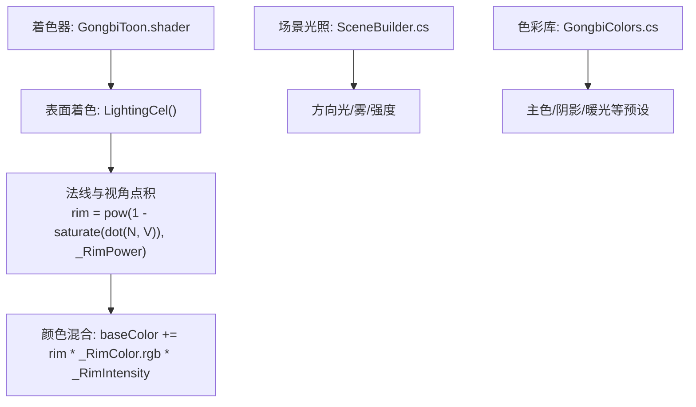
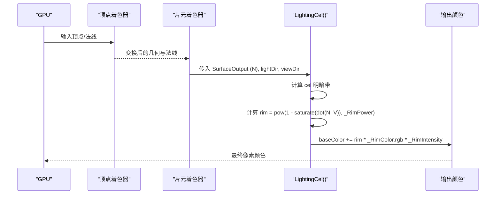
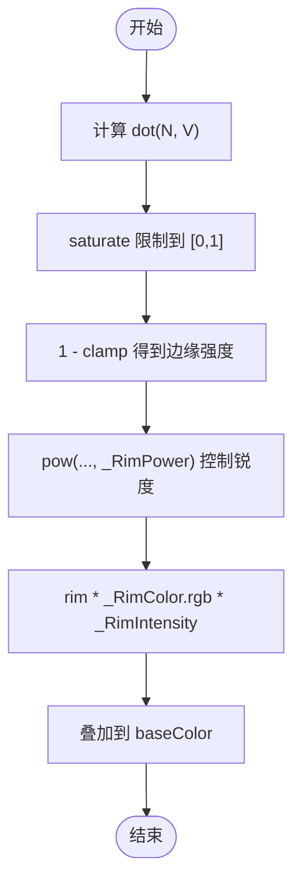
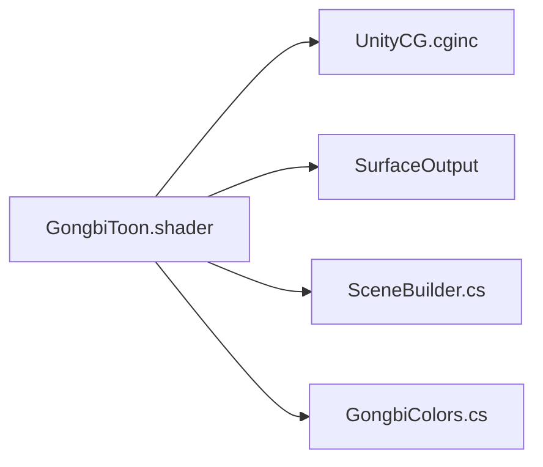

# 边缘光系统

<cite>
**本文引用的文件**
- [GongbiToon.shader](file://Assets/Shaders/GongbiToon.shader)
- [GongbiColors.cs](file://Assets/Scripts/GongbiColors.cs)
- [SceneBuilder.cs](file://Assets/Scripts/Environment/SceneBuilder.cs)
</cite>

## 目录
1. [简介](#简介)
2. [项目结构](#项目结构)
3. [核心组件](#核心组件)
4. [架构总览](#架构总览)
5. [详细组件分析](#详细组件分析)
6. [依赖关系分析](#依赖关系分析)
7. [性能考量](#性能考量)
8. [故障排查指南](#故障排查指南)
9. [结论](#结论)
10. [附录](#附录)

## 简介
本技术文档聚焦于工笔画着色器中的“边缘光”（Rim Light）子系统，目标是解释其计算原理、参数含义与调优方法，并给出与传统绘画中“留白/背光宣纸”效果的对应关系。该边缘光用于在角色或物体的剪影轮廓处产生柔和的暖色背光，增强轮廓识别度与环境融合感，同时保持工笔画风格的低对比、温润质感。

## 项目结构
本项目将边缘光实现集中在工笔画卡通着色器中，并通过场景构建脚本提供光照环境，配合传统矿物颜料色彩库统一风格。

图表来源
- [GongbiToon.shader:128-153](file://Assets/Shaders/GongbiToon.shader#L128-L153)
- [SceneBuilder.cs:183-196](file://Assets/Scripts/Environment/SceneBuilder.cs#L183-L196)
- [GongbiColors.cs:47-55](file://Assets/Scripts/GongbiColors.cs#L47-L55)

章节来源
- [GongbiToon.shader:1-22](file://Assets/Shaders/GongbiToon.shader#L1-L22)
- [GongbiToon.shader:128-153](file://Assets/Shaders/GongbiToon.shader#L128-L153)
- [SceneBuilder.cs:183-196](file://Assets/Scripts/Environment/SceneBuilder.cs#L183-L196)
- [GongbiColors.cs:47-55](file://Assets/Scripts/GongbiColors.cs#L47-L55)

## 核心组件
- 边缘光属性
  - _RimColor：边缘光颜色，默认偏暖，模拟宣纸背光的温润高光。
  - _RimIntensity：边缘光强度，控制全局亮度与局部增强的平衡。
  - _RimPower：边缘光功率，控制边缘锐度与过渡柔和度。
- 计算位置
  - 在自定义光照函数 LightingCel 中，基于法线 N 与视角 V 的点积计算 rim 值，再与 _RimColor 和 _RimIntensity 相乘后叠加到基础色上。
- 风格化背景
  - 通过工笔画色彩库提供暖光/环境色，使边缘光与整体色调一致。

章节来源
- [GongbiToon.shader:19-21](file://Assets/Shaders/GongbiToon.shader#L19-L21)
- [GongbiToon.shader:115-117](file://Assets/Shaders/GongbiToon.shader#L115-L117)
- [GongbiToon.shader:144-149](file://Assets/Shaders/GongbiToon.shader#L144-L149)
- [GongbiColors.cs:47-55](file://Assets/Scripts/GongbiColors.cs#L47-L55)

## 架构总览
边缘光系统在着色器的表面光照阶段参与最终颜色合成，流程如下：

图表来源
- [GongbiToon.shader:128-153](file://Assets/Shaders/GongbiToon.shader#L128-L153)

## 详细组件分析

### 边缘光计算算法
- 法线与视角点积
  - 使用 dot(N, V) 衡量表面法线与相机视角方向的夹角。当表面朝向相机时点积接近 1；当表面侧向或背向相机时点积降低。
- 幂函数边缘检测
  - rim = pow(1 - saturate(dot(N, V)), _RimPower)
  - 1 - saturate(dot(N, V)) 将“面向相机”的区域映射为低值，“侧边/背面”区域映射为高值。
  - 通过 _RimPower 进行指数压缩/扩展，控制边缘区域的“锐利程度”。
- 颜色叠加
  - 将 rim 与 _RimColor.rgb 和 _RimIntensity 相乘后加到基础色上，形成轮廓处的暖色背光。

图表来源
- [GongbiToon.shader:144-149](file://Assets/Shaders/GongbiToon.shader#L144-L149)

章节来源
- [GongbiToon.shader:144-149](file://Assets/Shaders/GongbiToon.shader#L144-L149)

### 边缘光颜色 _RimColor 配置
- 默认值偏暖（RGB 接近米白/浅金），模拟传统宣纸被背光透射时的温润质感。
- 建议设置思路
  - 室内暖光源：提高 R、G，略降 B，营造宣纸透光效果。
  - 室外冷光源：可适度降低 R、G，提升 B，但需避免过冷破坏工笔画氛围。
  - 与主色协调：确保 _RimColor 与 _MainColor/_ShadowColor 在同一色温区间，避免突兀。
- 与色彩库的关系
  - 可使用 GongbiColors.WarmLight/WarmAmbient 作为参考，保证整体色调统一。

章节来源
- [GongbiToon.shader:19](file://Assets/Shaders/GongbiToon.shader#L19)
- [GongbiColors.cs:47-55](file://Assets/Scripts/GongbiColors.cs#L47-L55)

### 边缘光强度 _RimIntensity 控制机制
- 作用
  - 全局亮度调节：增大 _RimIntensity 会提升整体边缘光亮度，适合暗场景或需要强调轮廓时。
  - 局部增强：结合 _RimPower 可在特定角度范围集中增强边缘，避免大面积泛光。
- 调优建议
  - 默认值适中，避免过曝；在强逆光场景中适当提高，弱光场景中降低。
  - 与 _LightTint 和环境光强度联动，保持画面层次。

章节来源
- [GongbiToon.shader:20](file://Assets/Shaders/GongbiToon.shader#L20)
- [GongbiToon.shader:149](file://Assets/Shaders/GongbiToon.shader#L149)

### 边缘光功率 _RimPower 的作用
- 作用
  - 控制边缘锐度：较低值带来更宽、更柔和的边缘过渡；较高值让边缘更窄、更清晰。
  - 影响视觉厚度：高功率下边缘更像“细线”，低功率下更像“晕染”。
- 调优建议
  - 人物/角色：中等偏高，突出轮廓但不生硬。
  - 植物/布料：偏低，体现柔软与扩散感。
  - 建筑/硬质物体：偏高，强化边界。

章节来源
- [GongbiToon.shader:21](file://Assets/Shaders/GongbiToon.shader#L21)
- [GongbiToon.shader:145](file://Assets/Shaders/GongbiToon.shader#L145)

### 剪影效果中的应用
- 角色轮廓增强
  - 在角色背对光源时，边缘光沿轮廓形成暖色光边，提升可读性。
- 环境融合
  - 与场景雾效、环境光色温匹配，使边缘光融入整体氛围，不显突兀。
- 与工笔画风格
  - 边缘光模拟“留白/背光宣纸”的视觉效果，既保留轮廓又不过分写实，契合工笔画的写意与含蓄。

章节来源
- [GongbiToon.shader:144-149](file://Assets/Shaders/GongbiToon.shader#L144-L149)
- [SceneBuilder.cs:183-196](file://Assets/Scripts/Environment/SceneBuilder.cs#L183-L196)

### 与传统绘画“留白技法”的艺术对应
- 留白即“以空为实”：边缘光在不直接受光的位置添加微弱暖光，类似宣纸背光透出的微亮。
- 柔化边界：通过 _RimPower 控制过渡，模仿水墨在纸上的晕染扩散。
- 色温统一：采用暖色调 _RimColor，呼应传统矿物颜料的温润质感。

[本节为概念性阐述，不直接分析具体文件]

## 依赖关系分析
- 着色器依赖
  - UnityCG.cginc：提供基础向量与矩阵运算。
  - SurfaceOutput：传递法线、漫反射等信息至自定义光照函数。
- 场景依赖
  - 方向光与雾效由 SceneBuilder 设置，影响边缘光可见性与色温。
- 色彩依赖
  - GongbiColors 提供统一的暖光与环境色，确保边缘光与整体风格一致。

图表来源
- [GongbiToon.shader:128-153](file://Assets/Shaders/GongbiToon.shader#L128-L153)
- [SceneBuilder.cs:183-196](file://Assets/Scripts/Environment/SceneBuilder.cs#L183-L196)
- [GongbiColors.cs:47-55](file://Assets/Scripts/GongbiColors.cs#L47-L55)

章节来源
- [GongbiToon.shader:128-153](file://Assets/Shaders/GongbiToon.shader#L128-L153)
- [SceneBuilder.cs:183-196](file://Assets/Scripts/Environment/SceneBuilder.cs#L183-L196)
- [GongbiColors.cs:47-55](file://Assets/Scripts/GongbiColors.cs#L47-L55)

## 性能考量
- 计算开销
  - 边缘光仅涉及一次点积、一次饱和、一次幂运算与一次乘法加法，成本较低。
- 批处理与实例化
  - 着色器注释指出因每材料风动参数而禁用 GPU Instancing，静态批处理已足够减少绘制调用。
- 优化建议
  - 合理设置 _RimPower，避免过高导致过度锐化带来的视觉噪声。
  - 在移动平台（VR）关闭实时阴影，减少额外几何 pass，提升帧率。
  - 控制 _RimIntensity 避免过亮导致的 HDR 溢出或后期过曝。

章节来源
- [GongbiToon.shader:28-29](file://Assets/Shaders/GongbiToon.shader#L28-L29)
- [SceneBuilder.cs:193-196](file://Assets/Scripts/Environment/SceneBuilder.cs#L193-L196)

## 故障排查指南
- 边缘光不可见
  - 检查 _RimIntensity 是否过低；确认相机视角与法线夹角是否处于边缘区域。
  - 验证场景方向光强度与色温，确保边缘光与环境光协调。
- 边缘光过强或过弱
  - 调整 _RimIntensity；若仍不理想，微调 _RimPower 改变边缘宽度。
- 颜色不协调
  - 使用 GongbiColors 的暖光/环境色作为参考，统一色温。
- 性能问题
  - 降低 _RimPower 或 _RimIntensity；确认未启用不必要的实时阴影。

章节来源
- [GongbiToon.shader:19-21](file://Assets/Shaders/GongbiToon.shader#L19-L21)
- [GongbiToon.shader:144-149](file://Assets/Shaders/GongbiToon.shader#L144-L149)
- [SceneBuilder.cs:183-196](file://Assets/Scripts/Environment/SceneBuilder.cs#L183-L196)
- [GongbiColors.cs:47-55](file://Assets/Scripts/GongbiColors.cs#L47-L55)

## 结论
边缘光系统通过简洁而高效的数学表达，实现了工笔画风格下的轮廓增强与环境融合。_RimColor、_RimIntensity、_RimPower 三个参数分别负责颜色、强度与锐度，三者协同即可在不同光照条件下达成理想的“背光宣纸”效果。结合场景光照与色彩库，能够在保持艺术风格的同时兼顾性能与稳定性。

[本节为总结性内容，不直接分析具体文件]

## 附录
- 快速调参清单
  - 室内暖光：_RimColor 偏暖黄，_RimIntensity 中等，_RimPower 中等偏高。
  - 室外冷光：_RimColor 略偏冷但仍保持温润，_RimIntensity 降低，_RimPower 根据材质硬度调整。
  - 角色轮廓：_RimPower 提高以突出边缘，_RimIntensity 适度增加。
  - 植物/布料：_RimPower 降低以获得柔和过渡，_RimIntensity 保持低调。
- 与场景联动
  - 使用 SceneBuilder 设置方向光与雾效，确保边缘光与环境色温一致。
  - 利用 GongbiColors 统一主色、阴影与暖光，避免色温冲突。

[本节为补充信息，不直接分析具体文件]