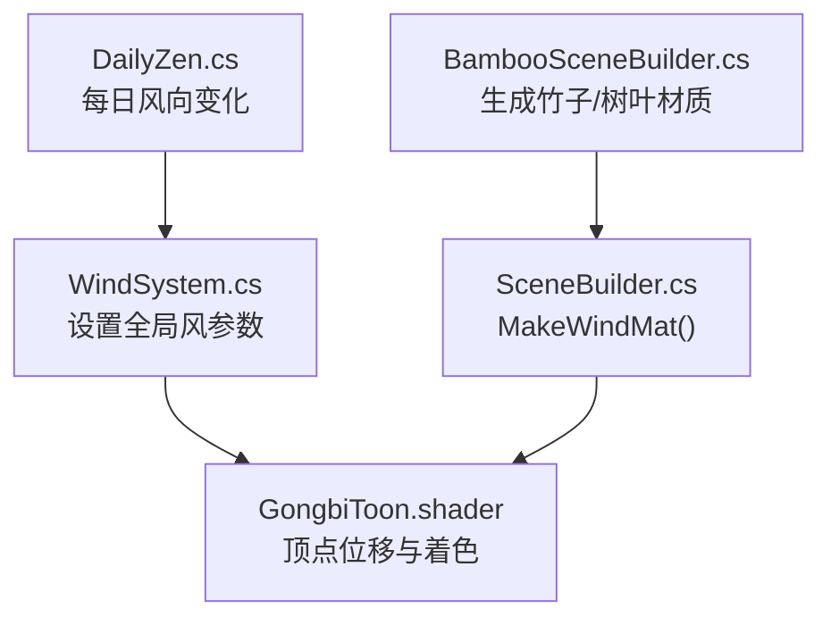
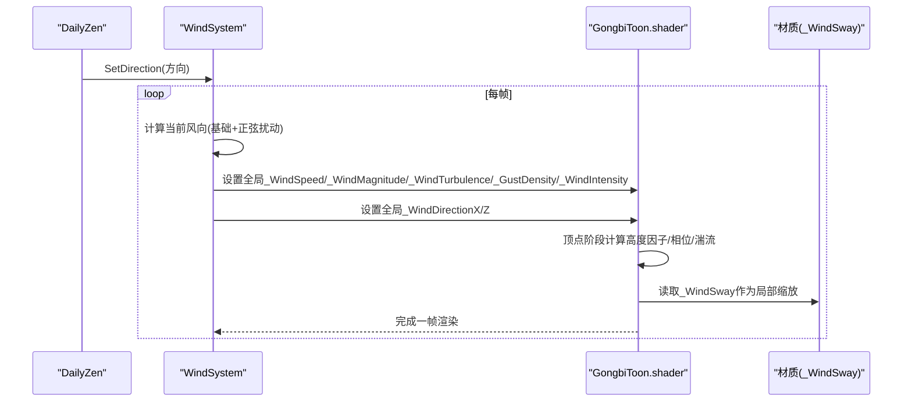
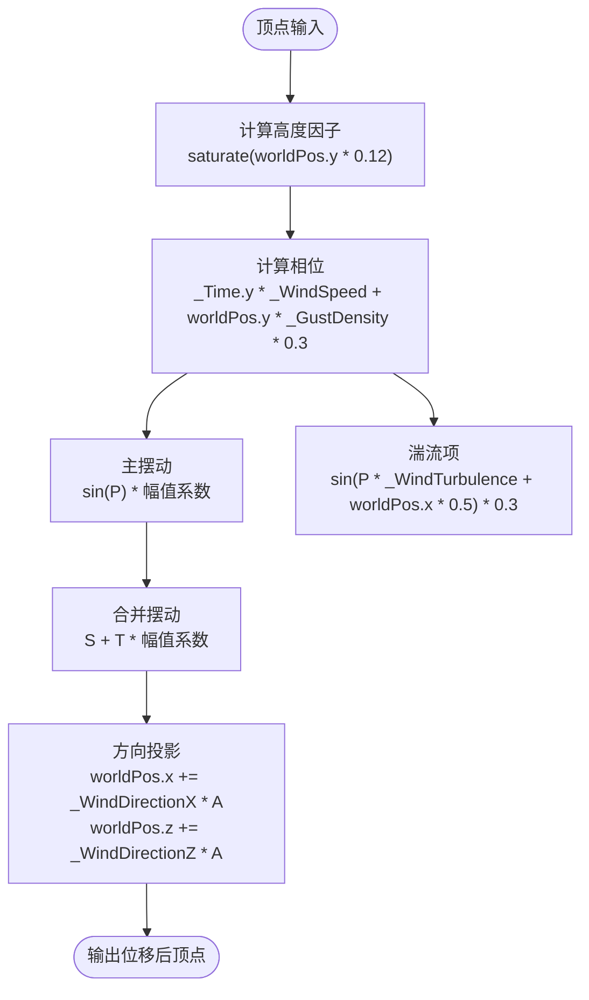
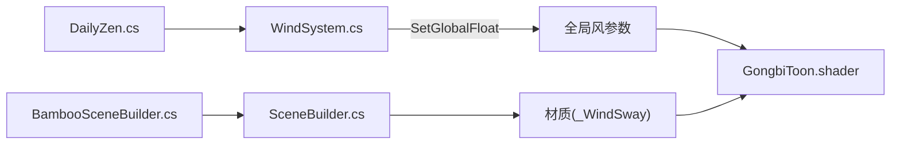

# 风摆动效果系统

<cite>
**本文引用的文件**
- [GongbiToon.shader](file://Assets/Shaders/GongbiToon.shader)
- [WindSystem.cs](file://Assets/Scripts/Environment/WindSystem.cs)
- [SceneBuilder.cs](file://Assets/Scripts/Environment/SceneBuilder.cs)
- [BambooSceneBuilder.cs](file://Assets/Scripts/Environment/BambooSceneBuilder.cs)
- [DailyZen.cs](file://Assets/Scripts/Environment/DailyZen.cs)
</cite>

## 目录
1. [简介](#简介)
2. [项目结构](#项目结构)
3. [核心组件](#核心组件)
4. [架构总览](#架构总览)
5. [详细组件分析](#详细组件分析)
6. [依赖关系分析](#依赖关系分析)
7. [性能考虑](#性能考虑)
8. [故障排查指南](#故障排查指南)
9. [结论](#结论)
10. [附录：调优参数与场景建议](#附录：调优参数与场景建议)

## 简介
本技术文档围绕工笔画着色器的“风摆动”效果，系统性阐述顶点位移算法、风参数机制、阵风密度对频率的影响、全局强度控制以及在不同材质与场景中的适配策略。同时提供竹林、树叶等自然物体的视觉调优建议，并给出移动设备上的性能优化要点。

## 项目结构
- 着色器层：GongbiToon.shader 实现风驱动的顶点位移（轮廓 Pass 与表面 Pass 均参与计算），并通过全局变量读取 WindSystem 提供的风场参数。
- 运行时层：WindSystem.cs 每帧更新风向、风力大小与全局强度；DailyZen.cs 可按日期稳定地改变风向；SceneBuilder.cs 与 BambooSceneBuilder.cs 负责创建带风响应的材质与场景对象。

图表来源
- [WindSystem.cs:26-62](file://Assets/Scripts/Environment/WindSystem.cs#L26-L62)
- [GongbiToon.shader:49-55](file://Assets/Shaders/GongbiToon.shader#L49-L55)
- [GongbiToon.shader:120-126](file://Assets/Shaders/GongbiToon.shader#L120-L126)
- [SceneBuilder.cs:42-59](file://Assets/Scripts/Environment/SceneBuilder.cs#L42-L59)
- [BambooSceneBuilder.cs:80-128](file://Assets/Scripts/Environment/BambooSceneBuilder.cs#L80-L128)

章节来源
- [WindSystem.cs:13-62](file://Assets/Scripts/Environment/WindSystem.cs#L13-L62)
- [GongbiToon.shader:1-209](file://Assets/Shaders/GongbiToon.shader#L1-L209)
- [SceneBuilder.cs:42-59](file://Assets/Scripts/Environment/SceneBuilder.cs#L42-L59)
- [BambooSceneBuilder.cs:80-128](file://Assets/Scripts/Environment/BambooSceneBuilder.cs#L80-L128)
- [DailyZen.cs:72-82](file://Assets/Scripts/Environment/DailyZen.cs#L72-L82)

## 核心组件
- 顶点位移算法：基于高度因子、时间相位偏移、正弦波与湍流叠加，将世界坐标沿风向进行位移。
- 风参数配置：风速、风力大小、湍流强度、风向、阵风密度、全局强度由 WindSystem 统一注入到着色器全局变量。
- 材质开关：通过 _WindSway 控制单材质的风响应强度，便于对不同物体差异化调节。
- 场景集成：BambooSceneBuilder 为竹子与树叶使用 MakeWindMat 启用风响应；DailyZen 按日期稳定地改变风向。

章节来源
- [GongbiToon.shader:72-83](file://Assets/Shaders/GongbiToon.shader#L72-L83)
- [GongbiToon.shader:168-183](file://Assets/Shaders/GongbiToon.shader#L168-L183)
- [WindSystem.cs:26-62](file://Assets/Scripts/Environment/WindSystem.cs#L26-L62)
- [SceneBuilder.cs:42-59](file://Assets/Scripts/Environment/SceneBuilder.cs#L42-L59)
- [BambooSceneBuilder.cs:80-128](file://Assets/Scripts/Environment/BambooSceneBuilder.cs#L80-L128)
- [DailyZen.cs:72-82](file://Assets/Scripts/Environment/DailyZen.cs#L72-L82)

## 架构总览
下图展示了从运行时到着色器的数据流与控制流：WindSystem 每帧写入全局风参数；DailyZen 可动态调整风向；着色器在顶点阶段根据这些参数计算位移，并在两个 Pass 中应用。

图表来源
- [DailyZen.cs:72-82](file://Assets/Scripts/Environment/DailyZen.cs#L72-L82)
- [WindSystem.cs:49-62](file://Assets/Scripts/Environment/WindSystem.cs#L49-L62)
- [GongbiToon.shader:72-83](file://Assets/Shaders/GongbiToon.shader#L72-L83)
- [GongbiToon.shader:168-183](file://Assets/Shaders/GongbiToon.shader#L168-L183)
- [SceneBuilder.cs:42-59](file://Assets/Scripts/Environment/SceneBuilder.cs#L42-L59)

## 详细组件分析

### 顶点位移算法
- 高度因子：以世界坐标 Y 线性映射并钳制，使顶部摆动更大、底部更稳，符合植物物理直觉。
- 时间相位偏移：_Time.y * _WindSpeed 驱动基础摆动频率；worldPos.y * _GustDensity * 0.3 引入随高度的相位差，形成波浪式推进。
- 正弦主摆动：sin(swayPhase) 产生周期性位移，幅度受 _WindMagnitude、_WindIntensity、_WindSway 与高度因子共同调制。
- 湍流叠加：sin(swayPhase * _WindTurbulence + worldPos.x * 0.5) 引入横向扰动，增强自然感。
- 方向投影：将合成后的 sway 沿 _WindDirectionX/Z 投影到 X/Z 轴，得到最终位移。

图表来源
- [GongbiToon.shader:72-83](file://Assets/Shaders/GongbiToon.shader#L72-L83)
- [GongbiToon.shader:168-183](file://Assets/Shaders/GongbiToon.shader#L168-L183)

章节来源
- [GongbiToon.shader:72-83](file://Assets/Shaders/GongbiToon.shader#L72-L83)
- [GongbiToon.shader:168-183](file://Assets/Shaders/GongbiToon.shader#L168-L183)

### 风参数配置与作用机制
- _WindSpeed（风速）：控制基础摆动频率，越大越快。
- _WindMagnitude（风力大小）：整体振幅乘数，决定摆动幅度上限。
- _WindTurbulence（湍流强度）：放大湍流项的频率，增加细节抖动。
- _WindDirectionX / _WindDirectionZ（风向）：二维平面风向向量，用于将合成摆动投影到世界空间 X/Z 轴。
- _GustDensity（阵风密度）：影响相位随高度的变化率，从而改变摆动频率的垂直梯度与“阵风”感。
- _WindIntensity（全局强度）：平滑过渡的全局乘数，用于场景级风强控制（如静风到强风的过渡）。

章节来源
- [WindSystem.cs:13-32](file://Assets/Scripts/Environment/WindSystem.cs#L13-L32)
- [WindSystem.cs:49-62](file://Assets/Scripts/Environment/WindSystem.cs#L49-L62)
- [GongbiToon.shader:49-55](file://Assets/Shaders/GongbiToon.shader#L49-L55)
- [GongbiToon.shader:120-126](file://Assets/Shaders/GongbiToon.shader#L120-L126)

### 阵风密度对摆动频率的影响
- 相位公式中包含 worldPos.y * _GustDensity * 0.3，意味着不同高度具有不同的相位延迟，形成“自上而下”的波浪推进。
- 增大 _GustDensity 会提高高频成分和相位梯度，视觉上更接近阵风掠过时的快速波动；减小则趋于均匀摆动。
- 该参数与 _WindSpeed 共同决定有效频率：高 _WindSpeed 配合适中 _GustDensity 可获得自然的顺风摆动。

章节来源
- [GongbiToon.shader:72-83](file://Assets/Shaders/GongbiToon.shader#L72-L83)
- [GongbiToon.shader:168-183](file://Assets/Shaders/GongbiToon.shader#L168-L183)

### 风摆动强度 _WindSway 的全局控制与材质适配
- _WindSway 是材质级开关，范围 0~1，0 表示禁用风响应，1 表示全量响应。
- 同一场景中，可通过不同材质赋予不同 _WindSway，例如竹叶较高、竹节较低，或灌木较弱。
- SceneBuilder.MakeWindMat 默认给植被材质设置合适的 _WindSway，便于快速复用。

章节来源
- [GongbiToon.shader:15-18](file://Assets/Shaders/GongbiToon.shader#L15-L18)
- [SceneBuilder.cs:42-59](file://Assets/Scripts/Environment/SceneBuilder.cs#L42-L59)
- [BambooSceneBuilder.cs:80-128](file://Assets/Scripts/Environment/BambooSceneBuilder.cs#L80-L128)

### 运行时控制与每日风向
- WindSystem.Update 每帧计算风向：基础方向叠加正弦扰动，再归一化，确保方向稳定且柔和。
- DailyZen.ApplyDailyWind 每天生成一个稳定的随机风向，调用 WindSystem.SetDirection 更新基础方向，使场景氛围随日期变化。

章节来源
- [WindSystem.cs:49-62](file://Assets/Scripts/Environment/WindSystem.cs#L49-L62)
- [DailyZen.cs:72-82](file://Assets/Scripts/Environment/DailyZen.cs#L72-L82)

## 依赖关系分析
- 着色器依赖全局变量：_WindSpeed、_WindMagnitude、_WindTurbulence、_WindDirectionX/Z、_GustDensity、_WindIntensity。
- WindSystem 负责维护这些全局变量，并在 OnEnable 时一次性写入固定参数，Update 中仅写入变化参数以减少开销。
- 材质通过 _WindSway 控制个体响应强度；场景构建脚本批量创建带风响应的材质。

图表来源
- [WindSystem.cs:26-62](file://Assets/Scripts/Environment/WindSystem.cs#L26-L62)
- [GongbiToon.shader:49-55](file://Assets/Shaders/GongbiToon.shader#L49-L55)
- [GongbiToon.shader:120-126](file://Assets/Shaders/GongbiToon.shader#L120-L126)
- [SceneBuilder.cs:42-59](file://Assets/Scripts/Environment/SceneBuilder.cs#L42-L59)
- [BambooSceneBuilder.cs:80-128](file://Assets/Scripts/Environment/BambooSceneBuilder.cs#L80-L128)
- [DailyZen.cs:72-82](file://Assets/Scripts/Environment/DailyZen.cs#L72-L82)

章节来源
- [WindSystem.cs:26-62](file://Assets/Scripts/Environment/WindSystem.cs#L26-L62)
- [GongbiToon.shader:49-55](file://Assets/Shaders/GongbiToon.shader#L49-L55)
- [GongbiToon.shader:120-126](file://Assets/Shaders/GongbiToon.shader#L120-L126)
- [SceneBuilder.cs:42-59](file://Assets/Scripts/Environment/SceneBuilder.cs#L42-L59)
- [BambooSceneBuilder.cs:80-128](file://Assets/Scripts/Environment/BambooSceneBuilder.cs#L80-L128)
- [DailyZen.cs:72-82](file://Assets/Scripts/Environment/DailyZen.cs#L72-L82)

## 性能考虑
- 全局变量写入优化：WindSystem 仅在 OnEnable 写入不频繁变化的参数（速度、湍流、阵风密度），Update 只写入变化参数（幅度、方向、强度），减少每帧全局写次数。
- 顶点计算成本：每个顶点执行两次 sin、一次 saturate、若干乘法与加法；在移动端需关注顶点数量与批次。
- 批处理与实例化：注释指出 GPU Instancing 已关闭以避免 per-material _WindSway 与顶点位移冲突；静态批处理承担主要 DrawCall 降低。
- 建议：
  - 合理控制植被面数与分段数（竹子分段可见但不过密）。
  - 避免过多高 _WindSway 的高面数物体同屏。
  - 在低端设备上适当降低 _WindTurbulence 或 _GustDensity 以减少高频扰动带来的额外计算感知。
  - 利用静态批处理与合理的 LOD 策略平衡画质与性能。

章节来源
- [WindSystem.cs:34-62](file://Assets/Scripts/Environment/WindSystem.cs#L34-L62)
- [GongbiToon.shader:24-30](file://Assets/Shaders/GongbiToon.shader#L24-L30)
- [GongbiToon.shader:72-83](file://Assets/Shaders/GongbiToon.shader#L72-L83)
- [GongbiToon.shader:168-183](file://Assets/Shaders/GongbiToon.shader#L168-L183)

## 故障排查指南
- 无风效果：检查材质 _WindSway 是否为 0；确认 WindSystem 已添加到场景并启用；确认全局变量是否被正确设置。
- 风向异常：检查 DailyZen 是否启用了每日风向变化；确认 WindSystem.SetDirection 传入的方向非零向量。
- 摆动过强或过弱：调整 _WindMagnitude、_WindIntensity、_WindSway；对于高处物体可适当降低 _WindTurbulence。
- 性能问题：减少高面数植被数量；降低 _GustDensity 或 _WindTurbulence；确保使用静态批处理而非大量独立实例。

章节来源
- [WindSystem.cs:49-76](file://Assets/Scripts/Environment/WindSystem.cs#L49-L76)
- [DailyZen.cs:72-82](file://Assets/Scripts/Environment/DailyZen.cs#L72-L82)
- [GongbiToon.shader:72-83](file://Assets/Shaders/GongbiToon.shader#L72-L83)
- [GongbiToon.shader:168-183](file://Assets/Shaders/GongbiToon.shader#L168-L183)

## 结论
本系统通过简洁而高效的顶点位移算法，结合全局风参数与材质级开关，实现了自然、可控的风摆动效果。WindSystem 提供运行时控制，DailyZen 提供每日风向变化，着色器在两 Pass 中一致应用位移，兼顾轮廓与表面。通过合理调参与性能优化，可在竹林、树叶等自然物体上获得良好的视觉效果，同时在移动设备上保持良好表现。

## 附录：调优参数与场景建议
- 竹林
  - 推荐：_WindSpeed 中等偏上，_GustDensity 中等，_WindTurbulence 低到中等，_WindMagnitude 中等，_WindIntensity 1.0，_WindSway 竹子较高、竹节较低。
  - 理由：竹子细长且分段，顶部需要明显摆动，底部保持稳定；适度湍流增加真实感。
- 树叶/灌木
  - 推荐：_WindTurbulence 稍高，_GustDensity 低到中等，_WindSway 中等偏高。
  - 理由：叶片轻薄易受湍流影响，呈现细碎抖动。
- 草地/低矮植被
  - 推荐：_WindMagnitude 低，_WindTurbulence 低，_WindSway 低。
  - 理由：贴近地面，摆动幅度小，避免过度变形。
- 移动设备优化
  - 降低 _WindTurbulence 与 _GustDensity 可减少高频扰动带来的视觉噪声与计算压力。
  - 控制植被面数与分段数，优先使用静态批处理。
  - 若帧率紧张，可降低 _WindIntensity 或在特定区域禁用风响应（_WindSway=0）。

章节来源
- [BambooSceneBuilder.cs:80-128](file://Assets/Scripts/Environment/BambooSceneBuilder.cs#L80-L128)
- [SceneBuilder.cs:42-59](file://Assets/Scripts/Environment/SceneBuilder.cs#L42-L59)
- [WindSystem.cs:49-62](file://Assets/Scripts/Environment/WindSystem.cs#L49-L62)
- [GongbiToon.shader:72-83](file://Assets/Shaders/GongbiToon.shader#L72-L83)
- [GongbiToon.shader:168-183](file://Assets/Shaders/GongbiToon.shader#L168-L183)