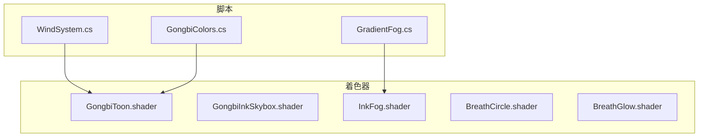
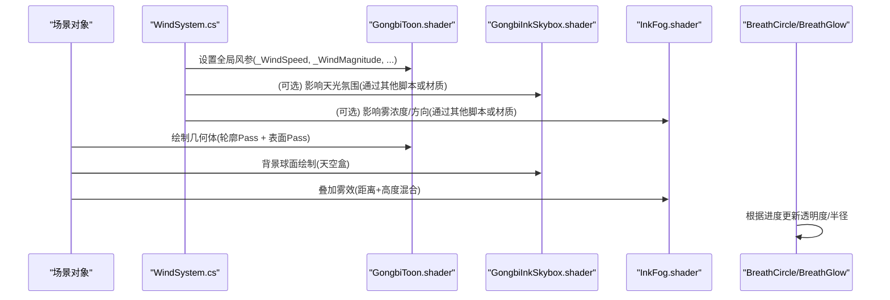
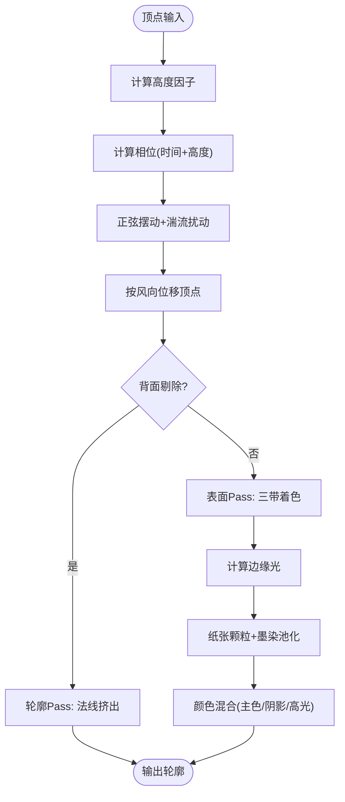
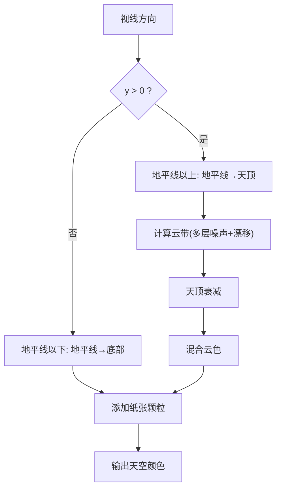
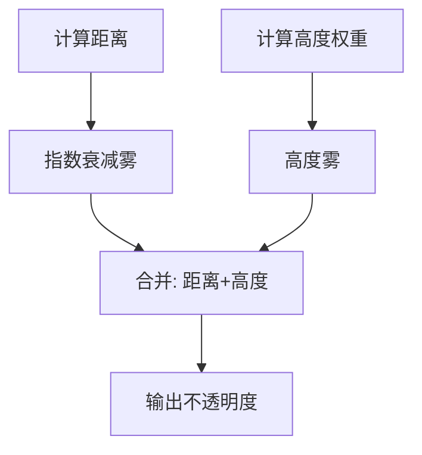
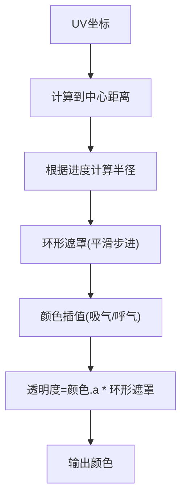
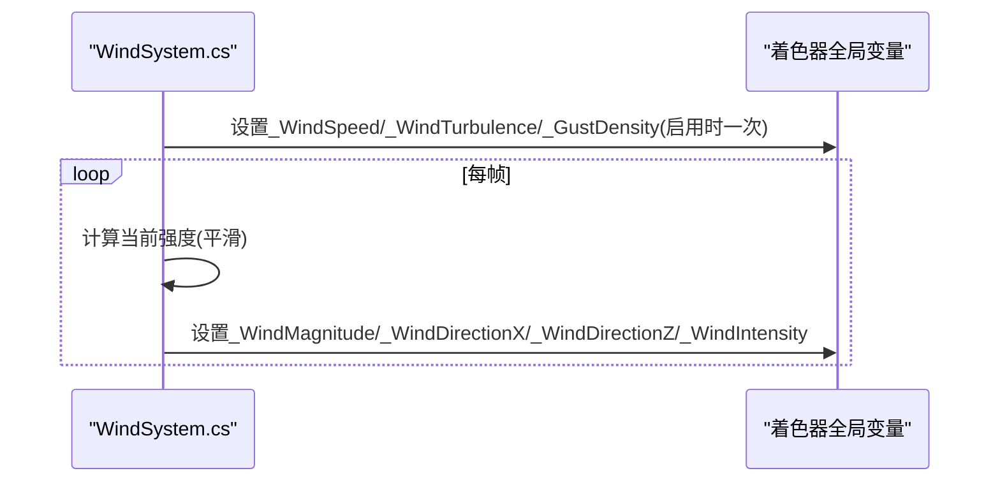
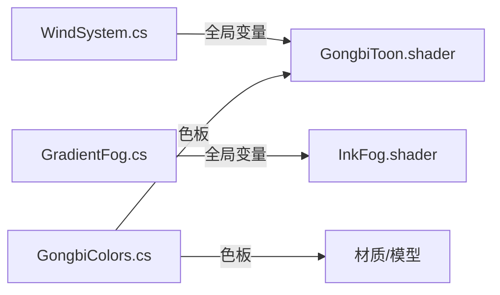

# 视觉效果系统

<cite>
**本文引用的文件**
- [GongbiToon.shader](file://Assets/Shaders/GongbiToon.shader)
- [GongbiInkSkybox.shader](file://Assets/Shaders/GongbiInkSkybox.shader)
- [InkFog.shader](file://Assets/Shaders/InkFog.shader)
- [BreathCircle.shader](file://Assets/Shaders/BreathCircle.shader)
- [BreathGlow.shader](file://Assets/Shaders/BreathGlow.shader)
- [WindSystem.cs](file://Assets/Scripts/Environment/WindSystem.cs)
- [GradientFog.cs](file://Assets/Scripts/Environment/GradientFog.cs)
- [GongbiColors.cs](file://Assets/Scripts/GongbiColors.cs)
</cite>

## 目录
1. [简介](#简介)
2. [项目结构](#项目结构)
3. [核心组件](#核心组件)
4. [架构总览](#架构总览)
5. [详细组件分析](#详细组件分析)
6. [依赖关系分析](#依赖关系分析)
7. [性能考量](#性能考量)
8. [故障排查指南](#故障排查指南)
9. [结论](#结论)
10. [附录](#附录)

## 简介
本技术文档面向InkRidge的视觉效果系统，聚焦于工笔画风格的渲染管线与着色器实现。内容涵盖：
- GongbiToon着色器的双面轮廓线与三带卡通着色算法
- GongbiInkSkybox天空盒的水墨画效果（渐变、云层、纸张纹理）
- InkFog雾效系统的距离计算与高度混合算法
- BreathCircle呼吸圆环着色器的透明度控制与进度驱动动画
- 传统矿物颜料调色板GongbiColors的色彩理论与颜色映射机制
- 风系统WindSystem如何与着色器集成驱动植被动态摆动
- 着色器参数调优指南、性能优化建议与自定义扩展开发指引

## 项目结构
视觉子系统主要由以下着色器与脚本组成：
- 着色器位于 Assets/Shaders，包含角色与环境渲染的关键实现
- 脚本位于 Assets/Scripts/Environment 与 Assets/Scripts，负责运行时参数注入与全局状态管理
- 资源组织遵循Unity工程规范，按功能域划分

图表来源
- [GongbiToon.shader:1-209](file://Assets/Shaders/GongbiToon.shader#L1-L209)
- [GongbiInkSkybox.shader:1-128](file://Assets/Shaders/GongbiInkSkybox.shader#L1-L128)
- [InkFog.shader:1-66](file://Assets/Shaders/InkFog.shader#L1-L66)
- [BreathCircle.shader:1-74](file://Assets/Shaders/BreathCircle.shader#L1-L74)
- [BreathGlow.shader:1-81](file://Assets/Shaders/BreathGlow.shader#L1-L81)
- [WindSystem.cs:1-79](file://Assets/Scripts/Environment/WindSystem.cs#L1-L79)
- [GradientFog.cs:1-96](file://Assets/Scripts/Environment/GradientFog.cs#L1-L96)
- [GongbiColors.cs:1-72](file://Assets/Scripts/GongbiColors.cs#L1-L72)

章节来源
- [GongbiToon.shader:1-209](file://Assets/Shaders/GongbiToon.shader#L1-L209)
- [GongbiInkSkybox.shader:1-128](file://Assets/Shaders/GongbiInkSkybox.shader#L1-L128)
- [InkFog.shader:1-66](file://Assets/Shaders/InkFog.shader#L1-L66)
- [BreathCircle.shader:1-74](file://Assets/Shaders/BreathCircle.shader#L1-L74)
- [BreathGlow.shader:1-81](file://Assets/Shaders/BreathGlow.shader#L1-L81)
- [WindSystem.cs:1-79](file://Assets/Scripts/Environment/WindSystem.cs#L1-L79)
- [GradientFog.cs:1-96](file://Assets/Scripts/Environment/GradientFog.cs#L1-L96)
- [GongbiColors.cs:1-72](file://Assets/Scripts/GongbiColors.cs#L1-L72)

## 核心组件
- 工笔画风格角色与环境渲染：GongbiToon着色器提供三带卡通着色、背面挤出轮廓线、风致顶点位移、宣纸质感与边缘背光
- 水墨天空盒：GongbiInkSkybox通过垂直渐变、程序化云带与纸张颗粒营造水墨意境
- 水墨雾效：InkFog结合距离衰减与高度混合，形成由近及远、由低到高的自然雾气
- 呼吸UI：BreathCircle与BreathGlow基于进度参数驱动透明度与半径变化，配合叠加混合呈现柔和光晕
- 风系统：WindSystem每帧更新全局风参，驱动植被等对象的顶点位移与色彩微变
- 颜色体系：GongbiColors提供传统矿物颜料色板与阴影派生工具，统一美术风格

章节来源
- [GongbiToon.shader:1-209](file://Assets/Shaders/GongbiToon.shader#L1-L209)
- [GongbiInkSkybox.shader:1-128](file://Assets/Shaders/GongbiInkSkybox.shader#L1-L128)
- [InkFog.shader:1-66](file://Assets/Shaders/InkFog.shader#L1-L66)
- [BreathCircle.shader:1-74](file://Assets/Shaders/BreathCircle.shader#L1-L74)
- [BreathGlow.shader:1-81](file://Assets/Shaders/BreathGlow.shader#L1-L81)
- [WindSystem.cs:1-79](file://Assets/Scripts/Environment/WindSystem.cs#L1-L79)
- [GongbiColors.cs:1-72](file://Assets/Scripts/GongbiColors.cs#L1-L72)

## 架构总览
整体渲染流程以“场景对象 + 着色器”为核心，脚本在运行时向着色器注入全局参数，实现统一的视觉风格与动态效果。

图表来源
- [WindSystem.cs:26-63](file://Assets/Scripts/Environment/WindSystem.cs#L26-L63)
- [GongbiToon.shader:44-126](file://Assets/Shaders/GongbiToon.shader#L44-L126)
- [GongbiInkSkybox.shader:30-37](file://Assets/Shaders/GongbiInkSkybox.shader#L30-L37)
- [InkFog.shader:26-30](file://Assets/Shaders/InkFog.shader#L26-L30)
- [BreathCircle.shader:28-33](file://Assets/Shaders/BreathCircle.shader#L28-L33)
- [BreathGlow.shader:28-33](file://Assets/Shaders/BreathGlow.shader#L28-L33)

## 详细组件分析

### GongbiToon着色器：工笔画风格角色与环境
- 双面轮廓线技术
  - 使用单独Pass进行背面剔除并沿法线向外挤出，生成稳定的黑色/深色轮廓，增强剪影识别度
  - 轮廓宽度由参数控制，支持风致位移以保证轮廓随形变一致
- 三带卡通着色算法
  - 基于法线与光照方向的点积分段：阴影带、中间带、高光带，分别赋予不同亮度层级
  - 高光采用半角向量与幂函数阈值化，得到块状高光
  - 边缘背光（rim light）模拟宣纸透光的柔和轮廓光
- 风致顶点位移
  - 顶点阶段依据世界坐标高度因子、时间、风速、湍流与阵风密度计算正弦位移，叠加风向分量
  - 通过全局风参实现多对象联动摆动
- 宣纸质感与墨染效果
  - 基于世界坐标哈希产生高频噪声模拟纸张纹理
  - 墨染池化：根据高度降低底部亮度，模拟墨水下沉
  - 实例级颜色抖动避免克隆感，同时保持静态批处理兼容
- 关键参数
  - 主色、阴影色、轮廓色、轮廓宽
  - 高光色与高光强度
  - 阴影带阈值、中间带阈值、阴影强度
  - 光源染色影响、风摆动幅度、墨染强度、颜色抖动、纸张颗粒、边缘光颜色/强度/幂

图表来源
- [GongbiToon.shader:31-96](file://Assets/Shaders/GongbiToon.shader#L31-L96)
- [GongbiToon.shader:98-204](file://Assets/Shaders/GongbiToon.shader#L98-L204)

章节来源
- [GongbiToon.shader:1-209](file://Assets/Shaders/GongbiToon.shader#L1-L209)

### GongbiInkSkybox：水墨天空盒
- 垂直渐变
  - 地平线以下：地平线到底部颜色插值
  - 地平线以上：地平线到天顶颜色插值，使用幂函数控制过渡
- 程序化云带
  - 多层值噪声叠加，随时间漂移，投影到半球空间以获得更自然的带状分布
  - 云量覆盖与天顶衰减，使云雾贴近地平线
- 纸张颗粒
  - 基于方向哈希的高频噪声，增加画面质感
- 关键参数
  - 天顶色、地平线色、地平线以下色、云色
  - 云覆盖率、云漂移速度、纸张颗粒强度、地平线衰减幂

图表来源
- [GongbiInkSkybox.shader:59-120](file://Assets/Shaders/GongbiInkSkybox.shader#L59-L120)

章节来源
- [GongbiInkSkybox.shader:1-128](file://Assets/Shaders/GongbiInkSkybox.shader#L1-L128)

### InkFog：水墨雾效
- 距离衰减
  - 基于相机到片段的世界距离，指数衰减计算雾密度
- 高度混合
  - 根据片段世界Y坐标与起始/结束高度计算高度权重，叠加到雾中
  - 低处雾更浓，高处渐淡，符合水墨山水的层次
- 关键参数
  - 雾颜色、雾密度、起始Y、结束Y、高度因子

图表来源
- [InkFog.shader:51-60](file://Assets/Shaders/InkFog.shader#L51-L60)

章节来源
- [InkFog.shader:1-66](file://Assets/Shaders/InkFog.shader#L1-L66)

### BreathCircle与BreathGlow：呼吸圆环与光晕
- 透明度控制
  - 基于UV中心距离计算环形遮罩，平滑步进控制边缘羽化
  - 颜色随进度在吸气/呼气之间插值，透明度乘以环形遮罩
- 进度驱动动画
  - 半径随进度线性插值，实现扩张/收缩
  - 光晕着色器额外加入径向渐变与脉冲调制，增强呼吸节奏感
- 关键参数
  - 进度、吸气色、呼气色、最大/最小半径、边缘羽化
  - 光晕核心色、边缘色、最大半径、柔化程度、脉冲速度

图表来源
- [BreathCircle.shader:55-68](file://Assets/Shaders/BreathCircle.shader#L55-L68)
- [BreathGlow.shader:58-75](file://Assets/Shaders/BreathGlow.shader#L58-L75)

章节来源
- [BreathCircle.shader:1-74](file://Assets/Shaders/BreathCircle.shader#L1-L74)
- [BreathGlow.shader:1-81](file://Assets/Shaders/BreathGlow.shader#L1-L81)

### WindSystem：风系统与着色器集成
- 全局风参
  - 每帧更新风速、幅值、湍流、风向、阵风密度、强度等全局浮点参数
  - 将风参写入着色器全局变量，供GongbiToon等读取以实现顶点位移
- 平滑过渡
  - 目标强度通过插值平滑过渡，避免突变
- 关键API
  - SetIntensity：设置目标风强度
  - SetDirection：设置基础风向（内部归一化）

图表来源
- [WindSystem.cs:26-63](file://Assets/Scripts/Environment/WindSystem.cs#L26-L63)

章节来源
- [WindSystem.cs:1-79](file://Assets/Scripts/Environment/WindSystem.cs#L1-L79)

### GradientFog：梯度雾全局参数
- 职责
  - 维护雾的距离范围与天顶/地平线颜色，一次性推送到全局变量
  - 提供Clear方法重置全局雾参数，避免跨场景污染
- 关键参数
  - start/end、horizonColor、horizonColorDistance、zenithColor

章节来源
- [GradientFog.cs:1-96](file://Assets/Scripts/Environment/GradientFog.cs#L1-L96)

### GongbiColors：传统矿物颜料调色板
- 色彩理论
  - 基于中国传统矿物颜料的命名与色值，如朱砂、石青、石绿、赭石、蛤粉白等
  - 提供阴影派生工具：常规阴影与暖色调阴影，便于工笔重彩的明暗层次
- 颜色映射机制
  - 静态常量提供常用材质颜色，便于统一美术风格
  - 可通过工具方法快速生成阴影色，保证一致性

章节来源
- [GongbiColors.cs:1-72](file://Assets/Scripts/GongbiColors.cs#L1-L72)

## 依赖关系分析
- 风系统对着色器的耦合
  - WindSystem通过全局变量名绑定到着色器中的全局浮点参数
  - GongbiToon在顶点阶段读取这些参数进行位移，确保多对象同步摆动
- 雾系统与着色器
  - GradientFog推送全局雾参数；InkFog根据距离与高度计算雾效
- 颜色体系与材质
  - GongbiColors为材质与脚本提供统一色板，减少分散配置导致的风格不一致

图表来源
- [WindSystem.cs:26-63](file://Assets/Scripts/Environment/WindSystem.cs#L26-L63)
- [GongbiToon.shader:44-126](file://Assets/Shaders/GongbiToon.shader#L44-L126)
- [GradientFog.cs:54-79](file://Assets/Scripts/Environment/GradientFog.cs#L54-L79)
- [InkFog.shader:26-30](file://Assets/Shaders/InkFog.shader#L26-L30)
- [GongbiColors.cs:10-49](file://Assets/Scripts/GongbiColors.cs#L10-L49)

章节来源
- [WindSystem.cs:1-79](file://Assets/Scripts/Environment/WindSystem.cs#L1-L79)
- [GongbiToon.shader:1-209](file://Assets/Shaders/GongbiToon.shader#L1-L209)
- [GradientFog.cs:1-96](file://Assets/Scripts/Environment/GradientFog.cs#L1-L96)
- [InkFog.shader:1-66](file://Assets/Shaders/InkFog.shader#L1-L66)
- [GongbiColors.cs:1-72](file://Assets/Scripts/GongbiColors.cs#L1-L72)

## 性能考量
- 批量与实例化
  - GongbiToon禁用GPU实例化以避免每材料风参冲突，依赖静态批处理减少Draw Call
- 全局变量写入频率
  - WindSystem仅在启用时写入固定风参，每帧仅更新必要变量，降低全局常量缓冲脏写
- 着色器复杂度
  - 天空盒与雾效均为轻量单Pass，噪声与插值开销较低
  - 角色着色器使用简单哈希与正弦函数，避免昂贵采样
- 渲染队列与混合
  - 呼吸UI使用Overlay队列与透明混合，注意排序与过度绘制
- 建议
  - 合理设置轮廓宽度与纸张颗粒强度，避免过度细节导致带宽压力
  - 调整雾密度与高度因子，平衡远近层次与性能
  - 使用静态批处理与合批材质，减少Draw Call

[本节为通用性能指导，不直接分析具体文件]

## 故障排查指南
- 风效果不生效
  - 检查WindSystem是否启用且正确设置全局变量名
  - 确认GongbiToon中对应全局变量已声明并读取
- 雾效异常
  - 检查GradientFog是否正确Apply，避免上一场景残留影响
  - 验证InkFog的高度范围与密度设置
- 天空盒无云或过亮
  - 调整云覆盖率与天顶衰减幂，确保云带可见且不过曝
- 呼吸UI闪烁或透明度过高
  - 调整羽化与进度范围，确保Alpha在合理区间
- 轮廓线断裂或不连续
  - 检查法线质量与轮廓宽度，过高可能导致自遮挡

章节来源
- [WindSystem.cs:26-63](file://Assets/Scripts/Environment/WindSystem.cs#L26-L63)
- [GradientFog.cs:72-93](file://Assets/Scripts/Environment/GradientFog.cs#L72-L93)
- [InkFog.shader:51-60](file://Assets/Shaders/InkFog.shader#L51-L60)
- [GongbiInkSkybox.shader:92-120](file://Assets/Shaders/GongbiInkSkybox.shader#L92-L120)
- [BreathCircle.shader:55-68](file://Assets/Shaders/BreathCircle.shader#L55-L68)
- [GongbiToon.shader:31-96](file://Assets/Shaders/GongbiToon.shader#L31-L96)

## 结论
InkRidge的视觉效果系统通过工笔画风格的着色器与脚本协作，实现了具有东方美学特征的渲染表现。GongbiToon的双面轮廓与三带卡通着色奠定了角色与环境的基调；GongbiInkSkybox与InkFog共同构建了水墨般的天空与大气；BreathCircle与BreathGlow提供了沉浸式的呼吸交互；WindSystem与GongbiColors则从动态与色彩层面统一了视觉语言。通过合理的参数调优与性能优化，可在移动端与VR设备上获得稳定而富有艺术感的体验。

[本节为总结性内容，不直接分析具体文件]

## 附录

### 着色器参数调优指南
- GongbiToon
  - 轮廓宽度：0.01~0.05，过小不可见，过大破坏形体
  - 阴影带/中间带阈值：0.3~0.7，控制明暗分界
  - 边缘光强度/幂：0.1~0.3 / 2~4，塑造宣纸透光感
  - 风摆动幅度：0~1，结合高度因子实现自然摆动
  - 墨染强度：0~0.5，底部墨色加深
  - 纸张颗粒：0~0.1，适度增加质感
- GongbiInkSkybox
  - 云覆盖率：0~1，控制云带密度
  - 云漂移速度：0~0.1，缓慢移动营造宁静
  - 天顶衰减幂：0.2~3，控制天顶过渡锐度
- InkFog
  - 雾密度：0~0.1，控制远近雾浓淡
  - 高度因子：0~1，低处雾更浓
  - 起始/结束Y：定义雾层范围
- BreathCircle/BreathGlow
  - 进度：0~1，驱动半径与透明度
  - 羽化：0.01~0.5，控制边缘柔和度
  - 脉冲速度：0~10，调节呼吸节奏

[本节为通用调参指导，不直接分析具体文件]

### 性能优化建议
- 使用静态批处理替代GPU实例化（GongbiToon已禁用实例化）
- 减少全局变量频繁写入（WindSystem已优化）
- 控制噪声频率与振幅，避免过度采样
- 合理设置渲染队列与混合模式，减少过度绘制
- 使用LOD与材质变体，适配不同设备能力

[本节为通用优化指导，不直接分析具体文件]

### 自定义视觉效果扩展开发指南
- 新增风响应着色器
  - 声明与WindSystem相同的全局变量名（_WindSpeed、_WindMagnitude、_WindDirectionX/Z、_GustDensity、_WindIntensity）
  - 在顶点阶段读取并应用位移，保持与GongbiToon一致的摆动逻辑
- 扩展天空盒效果
  - 在GongbiInkSkybox基础上添加新的噪声层或颜色通道，注意保持单Pass效率
- 定制雾效
  - 在InkFog基础上增加方向性或体积雾近似，谨慎评估性能
- 统一颜色体系
  - 使用GongbiColors提供的色板与阴影工具，确保风格一致
- 测试与调试
  - 使用编辑器实时调整参数，观察效果与性能指标
  - 在不同设备上验证稳定性与帧率

[本节为通用扩展指导，不直接分析具体文件]