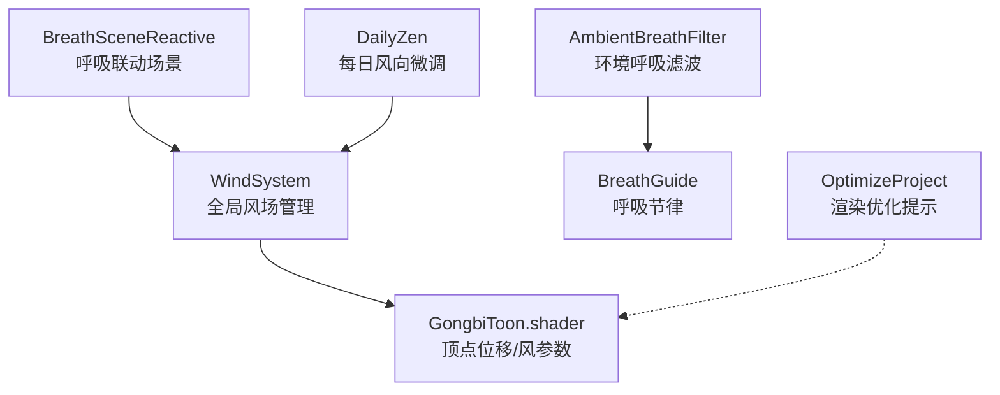
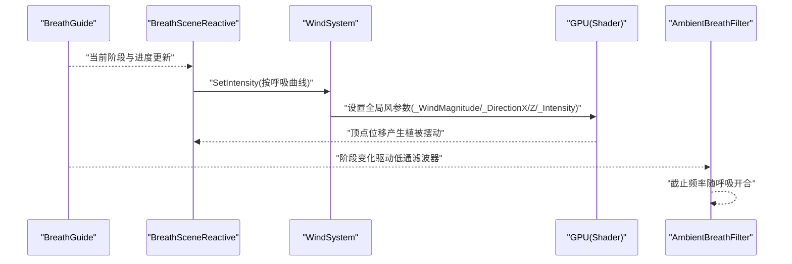
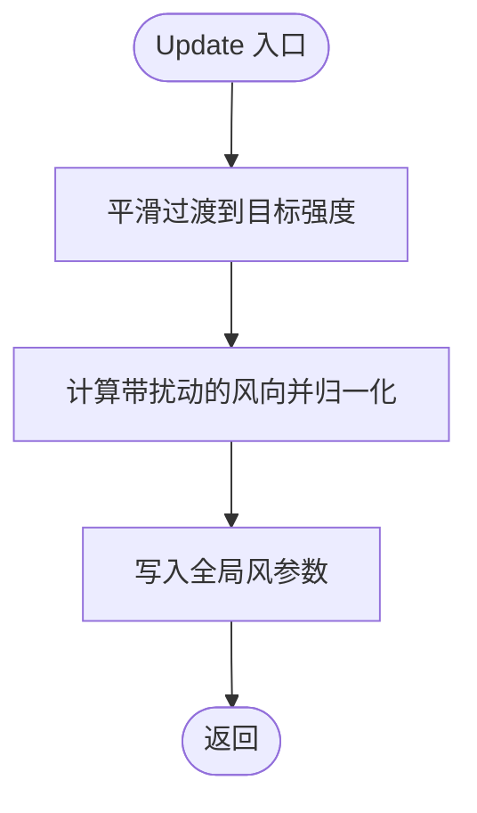
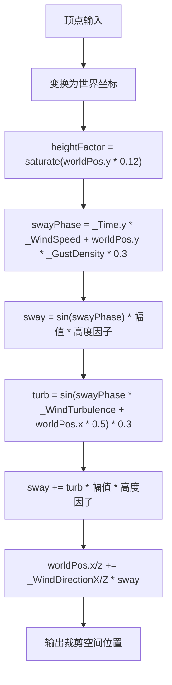
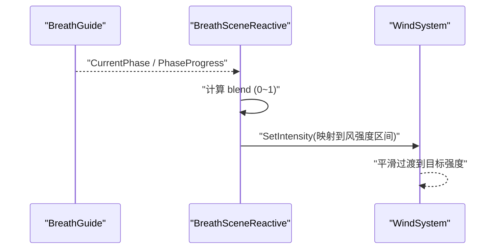
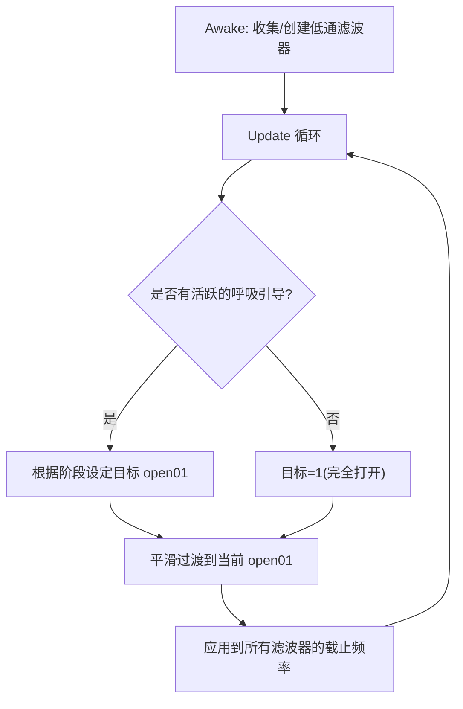
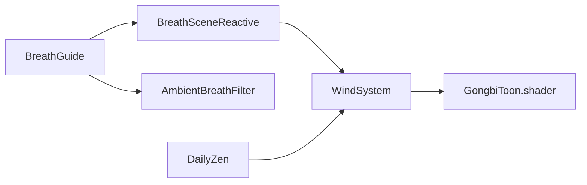

# 风系统

<cite>
**本文引用的文件**
- [WindSystem.cs](file://Assets/Scripts/Environment/WindSystem.cs)
- [GongbiToon.shader](file://Assets/Shaders/GongbiToon.shader)
- [BreathSceneReactive.cs](file://Assets/Scripts/Core/BreathSceneReactive.cs)
- [AmbientBreathFilter.cs](file://Assets/Scripts/Environment/AmbientBreathFilter.cs)
- [DailyZen.cs](file://Assets/Scripts/Environment/DailyZen.cs)
- [BreathGuide.cs](file://Assets/Scripts/Meditation/BreathGuide.cs)
- [OptimizeProject.cs](file://Assets/Editor/OptimizeProject.cs)
</cite>

## 目录
1. [简介](#简介)
2. [项目结构](#项目结构)
3. [核心组件](#核心组件)
4. [架构总览](#架构总览)
5. [详细组件分析](#详细组件分析)
6. [依赖关系分析](#依赖关系分析)
7. [性能考量](#性能考量)
8. [故障排查指南](#故障排查指南)
9. [结论](#结论)
10. [附录：配置与扩展接口](#附录：配置与扩展接口)

## 简介
本技术文档聚焦 InkRidge 的风系统，围绕全局风场管理、风参数到着色器的传递、植被顶点位移与高度依赖的摆动幅度、环境呼吸过滤与呼吸节奏系统的集成，以及性能优化策略进行系统化说明。目标是帮助开发者理解并高效使用风系统，同时为后续扩展提供清晰的接口与最佳实践。

## 项目结构
与风系统直接相关的代码与资源分布如下：
- 脚本层
  - 环境与系统：WindSystem.cs、AmbientBreathFilter.cs、DailyZen.cs
  - 核心联动：BreathSceneReactive.cs
  - 呼吸节律：BreathGuide.cs
- 渲染层
  - 着色器：GongbiToon.shader（包含风驱动的顶点位移）
- 编辑器优化：OptimizeProject.cs（单通道实例化相关限制与建议）

图表来源
- [WindSystem.cs:11-77](file://Assets/Scripts/Environment/WindSystem.cs#L11-L77)
- [GongbiToon.shader:48-82](file://Assets/Shaders/GongbiToon.shader#L48-L82)
- [BreathSceneReactive.cs:16-147](file://Assets/Scripts/Core/BreathSceneReactive.cs#L16-L147)
- [AmbientBreathFilter.cs:16-89](file://Assets/Scripts/Environment/AmbientBreathFilter.cs#L16-L89)
- [DailyZen.cs:14-85](file://Assets/Scripts/Environment/DailyZen.cs#L14-L85)
- [OptimizeProject.cs:188-217](file://Assets/Editor/OptimizeProject.cs#L188-L217)

章节来源
- [WindSystem.cs:11-77](file://Assets/Scripts/Environment/WindSystem.cs#L11-L77)
- [GongbiToon.shader:48-82](file://Assets/Shaders/GongbiToon.shader#L48-L82)
- [BreathSceneReactive.cs:16-147](file://Assets/Scripts/Core/BreathSceneReactive.cs#L16-L147)
- [AmbientBreathFilter.cs:16-89](file://Assets/Scripts/Environment/AmbientBreathFilter.cs#L16-L89)
- [DailyZen.cs:14-85](file://Assets/Scripts/Environment/DailyZen.cs#L14-L85)
- [OptimizeProject.cs:188-217](file://Assets/Editor/OptimizeProject.cs#L188-L217)

## 核心组件
- WindSystem：全局风场管理器，负责计算风速、风向、阵风密度与强度，并将风参数写入全局着色器变量，供所有使用该着色器的材质读取。
- GongbiToon.shader：在顶点阶段根据世界坐标高度、时间、风参数计算摆动与湍流，实现植被的动态摇摆效果。
- BreathSceneReactive：将呼吸节律映射到风强度、光照、雾与发光材质，使场景“随呼吸”变化。
- AmbientBreathFilter：在冥想期间对场景环境音做低通滤波，模拟“呼吸开合”的空间听感。
- DailyZen：基于日期生成稳定的随机种子，微调雾色/密度与风向，带来“每日一境”的氛围差异。
- BreathGuide：定义呼吸周期与阶段进度，驱动视觉与音频等子系统。

章节来源
- [WindSystem.cs:11-77](file://Assets/Scripts/Environment/WindSystem.cs#L11-L77)
- [GongbiToon.shader:48-82](file://Assets/Shaders/GongbiToon.shader#L48-L82)
- [BreathSceneReactive.cs:16-147](file://Assets/Scripts/Core/BreathSceneReactive.cs#L16-L147)
- [AmbientBreathFilter.cs:16-89](file://Assets/Scripts/Environment/AmbientBreathFilter.cs#L16-L89)
- [DailyZen.cs:14-85](file://Assets/Scripts/Environment/DailyZen.cs#L14-L85)
- [BreathGuide.cs:10-173](file://Assets/Scripts/Meditation/BreathGuide.cs#L10-L173)

## 架构总览
风系统通过“脚本→全局变量→着色器”的单向数据流驱动视觉效果；呼吸系统作为上层控制器，周期性调节风强度与环境氛围；环境呼吸滤波则从听觉维度配合呼吸节奏。

图表来源
- [BreathSceneReactive.cs:93-124](file://Assets/Scripts/Core/BreathSceneReactive.cs#L93-L124)
- [WindSystem.cs:49-63](file://Assets/Scripts/Environment/WindSystem.cs#L49-L63)
- [GongbiToon.shader:72-82](file://Assets/Shaders/GongbiToon.shader#L72-L82)
- [AmbientBreathFilter.cs:57-86](file://Assets/Scripts/Environment/AmbientBreathFilter.cs#L57-L86)

## 详细组件分析

### WindSystem：全局风场管理
- 功能要点
  - 每帧平滑过渡目标强度，避免突变。
  - 基础方向叠加正弦扰动，形成自然风向漂移。
  - 仅向 GPU 推送必要的全局变量，减少每帧写入次数。
  - 暴露 SetIntensity/SetDirection 接口，供其他系统调用。
- 关键流程
  - OnEnable 一次性写入不频繁变化的参数（速度、湍流、阵风密度）。
  - Update 中计算当前强度与方向，写入 _WindMagnitude、_WindDirectionX/Z、_WindIntensity。
- 复杂度
  - 每帧 O(1) 计算与固定数量的全局变量写入。
- 错误处理
  - 方向向量过小会被忽略，防止除零或无效归一化。

图表来源
- [WindSystem.cs:49-63](file://Assets/Scripts/Environment/WindSystem.cs#L49-L63)

章节来源
- [WindSystem.cs:11-77](file://Assets/Scripts/Environment/WindSystem.cs#L11-L77)

### 着色器：顶点位移与高度依赖摆动
- 风参数来源
  - 全局变量：_WindSpeed、_WindMagnitude、_WindTurbulence、_WindDirectionX/Z、_GustDensity、_WindIntensity。
- 顶点位移算法
  - 高度因子：根据 worldPos.y 计算 heightFactor，越高摆动越大。
  - 相位：_Time.y * _WindSpeed + worldPos.y * _GustDensity * 0.3，体现时间与高度的相位差。
  - 摆动：sin(相位) * 幅值系数 * 高度因子，叠加湍流项增强细节。
  - 位移：沿 _WindDirectionX/Z 方向偏移 worldPos。
- 性能注意
  - 注释指出未启用 GPU instancing，因每材料 _WindSway 与顶点位移导致限制；静态批处理承担主要 draw call 降低。

图表来源
- [GongbiToon.shader:72-82](file://Assets/Shaders/GongbiToon.shader#L72-L82)
- [GongbiToon.shader:168-183](file://Assets/Shaders/GongbiToon.shader#L168-L183)

章节来源
- [GongbiToon.shader:48-82](file://Assets/Shaders/GongbiToon.shader#L48-L82)
- [GongbiToon.shader:168-183](file://Assets/Shaders/GongbiToon.shader#L168-L183)

### BreathSceneReactive：呼吸与风的联动
- 作用
  - 在冥想会话期间，将呼吸阶段映射为风强度、光照、雾密度与发光材质的联动变化。
- 关键逻辑
  - 吸气时提高风强度（聚集），呼气时降低（释放）。
  - 平滑过渡响应速度，避免突兀切换。
  - 可选影响雾与发光材质，增强沉浸感。
- 与风系统集成
  - 通过 WindSystem.SetIntensity 控制风强，间接影响植被摆动幅度。

图表来源
- [BreathSceneReactive.cs:93-124](file://Assets/Scripts/Core/BreathSceneReactive.cs#L93-L124)
- [WindSystem.cs:49-63](file://Assets/Scripts/Environment/WindSystem.cs#L49-L63)

章节来源
- [BreathSceneReactive.cs:16-147](file://Assets/Scripts/Core/BreathSceneReactive.cs#L16-L147)

### AmbientBreathFilter：环境呼吸滤波
- 作用
  - 在冥想期间，对场景环境音施加低通滤波，吸气时打开（高频更丰富），呼气时关闭（声音闷沉），形成“世界随呼吸开合”的听觉体验。
- 工作机制
  - 自动收集子级 AudioSource，若缺少 AudioLowPassFilter 则添加。
  - 跟随 BreathGuide 的阶段与进度，线性插值截止频率。
  - 会话结束时恢复默认开放状态。

图表来源
- [AmbientBreathFilter.cs:42-86](file://Assets/Scripts/Environment/AmbientBreathFilter.cs#L42-L86)

章节来源
- [AmbientBreathFilter.cs:16-89](file://Assets/Scripts/Environment/AmbientBreathFilter.cs#L16-L89)

### DailyZen：每日风向微调
- 作用
  - 基于日期生成稳定随机种子，微调雾色/密度与风向，营造“每日一境”。
- 与风系统集成
  - 通过 WindSystem.SetDirection 设置当日基础风向，保持与着色器一致的全局变量路径。

章节来源
- [DailyZen.cs:14-85](file://Assets/Scripts/Environment/DailyZen.cs#L14-L85)
- [WindSystem.cs:71-76](file://Assets/Scripts/Environment/WindSystem.cs#L71-L76)

## 依赖关系分析
- WindSystem → Shader 全局变量
  - 每帧写入 _WindMagnitude、_WindDirectionX/Z、_WindIntensity。
  - 启动时写入 _WindSpeed、_WindTurbulence、_GustDensity。
- GongbiToon.shader ← 全局变量
  - 顶点阶段读取上述变量，计算顶点位移。
- BreathSceneReactive → WindSystem
  - 根据呼吸阶段调整风强度。
- AmbientBreathFilter → BreathGuide
  - 根据呼吸阶段调整环境音滤波。
- DailyZen → WindSystem
  - 设置每日基础风向。

图表来源
- [BreathSceneReactive.cs:93-124](file://Assets/Scripts/Core/BreathSceneReactive.cs#L93-L124)
- [WindSystem.cs:49-63](file://Assets/Scripts/Environment/WindSystem.cs#L49-L63)
- [GongbiToon.shader:48-82](file://Assets/Shaders/GongbiToon.shader#L48-L82)
- [AmbientBreathFilter.cs:57-86](file://Assets/Scripts/Environment/AmbientBreathFilter.cs#L57-L86)
- [DailyZen.cs:72-82](file://Assets/Scripts/Environment/DailyZen.cs#L72-L82)

章节来源
- [BreathSceneReactive.cs:93-124](file://Assets/Scripts/Core/BreathSceneReactive.cs#L93-L124)
- [WindSystem.cs:49-63](file://Assets/Scripts/Environment/WindSystem.cs#L49-L63)
- [GongbiToon.shader:48-82](file://Assets/Shaders/GongbiToon.shader#L48-L82)
- [AmbientBreathFilter.cs:57-86](file://Assets/Scripts/Environment/AmbientBreathFilter.cs#L57-L86)
- [DailyZen.cs:72-82](file://Assets/Scripts/Environment/DailyZen.cs#L72-L82)

## 性能考量
- 全局变量写入优化
  - 仅在 OnEnable 写入不常变的参数（速度、湍流、阵风密度），Update 只写动态值，减少每帧写入次数。
- 批处理与实例化
  - 着色器注释表明未启用 GPU instancing，原因包括每材料 _WindSway 与顶点位移带来的限制；项目依赖静态批处理降低 draw call。
- VR 平台优化提示
  - 编辑器工具指出单通道实例化立体渲染可显著减少遍历与绘制提交，但需要着色器支持立体宏；当前 GongbiToon 尚未满足条件，需先修复着色器再启用。
- 建议
  - 若未来启用 GPU instancing，需确保所有 shader 正确解析 per-eye 矩阵，并评估顶点位移在 instanced 管线中的行为。
  - 合理设置 _WindSway 与 _WindMagnitude，避免过高导致过度顶点运算。
  - 使用静态批处理时，避免每帧修改共享 mesh 或材质属性破坏批处理。

章节来源
- [WindSystem.cs:34-42](file://Assets/Scripts/Environment/WindSystem.cs#L34-L42)
- [GongbiToon.shader:24-29](file://Assets/Shaders/GongbiToon.shader#L24-L29)
- [OptimizeProject.cs:188-217](file://Assets/Editor/OptimizeProject.cs#L188-L217)

## 故障排查指南
- 植被无摆动
  - 检查 GongbiToon 材质的 _WindSway 是否大于 0。
  - 确认 WindSystem 已启用且正在写入全局变量。
  - 验证场景中是否存在使用 GongbiToon 的材质与网格。
- 风强度不变化
  - 检查 BreathSceneReactive 是否正确绑定 BreathGuide。
  - 确认 WindSystem.SetIntensity 被调用且目标强度范围合理。
- 环境音无呼吸效果
  - 确认 AmbientBreathFilter 所在对象存在 AudioSource 子级。
  - 检查 BreathGuide 是否处于非 Idle 阶段。
- 每日风向未生效
  - 确认 DailyZen 已挂载且 _varyWindDirection 为真。
  - 检查 WindSystem 是否可被 FindObjectOfType 找到。

章节来源
- [GongbiToon.shader:15-18](file://Assets/Shaders/GongbiToon.shader#L15-L18)
- [WindSystem.cs:49-63](file://Assets/Scripts/Environment/WindSystem.cs#L49-L63)
- [BreathSceneReactive.cs:93-124](file://Assets/Scripts/Core/BreathSceneReactive.cs#L93-L124)
- [AmbientBreathFilter.cs:42-86](file://Assets/Scripts/Environment/AmbientBreathFilter.cs#L42-L86)
- [DailyZen.cs:72-82](file://Assets/Scripts/Environment/DailyZen.cs#L72-L82)

## 结论
InkRidge 的风系统以 WindSystem 为核心，通过全局变量驱动 GongbiToon 着色器的顶点位移，实现高度依赖的自然植被摆动。BreathSceneReactive 将呼吸节律映射到风强度与环境氛围，AmbientBreathFilter 则在听觉层面同步呼吸节奏。DailyZen 提供每日风向微调，增强场景多样性。整体设计简洁、耦合度低，具备良好的扩展性与可维护性。性能方面通过减少全局变量写入与依赖静态批处理取得平衡，并在 VR 平台上留有进一步优化的空间。

## 附录：配置与扩展接口
- WindSystem 配置
  - 风速、幅度、湍流、方向、阵风密度：用于控制风的基本特性。
  - 强度与过渡速度：用于平滑切换风强，避免突变。
  - 接口
    - SetIntensity(float)：设置目标风强度（0~1）。
    - SetDirection(Vector2)：设置基础风向（内部归一化）。
- 着色器参数
  - _WindSway：控制风摆动强度（材质级别）。
  - 全局变量由 WindSystem 每帧写入，无需手动设置。
- 呼吸联动
  - BreathSceneReactive 提供 _gatherIntensity、_releaseIntensity、_responseSpeed 等参数，用于调节风强度区间与响应速度。
  - 可附加 Light[] 与 Renderer[] 以联动光照与发光材质。
- 环境呼吸滤波
  - Open/Closed Cutoff：设置呼吸开合时的低通截止频率范围。
  - Response Speed：滤波器响应速度。
- 每日风向
  - DailyZen 的 _varyWindDirection 控制是否应用每日风向微调。
- 扩展建议
  - 新增风敏感材质：只需读取 WindSystem 写入的全局变量即可。
  - 增加风区域：可在场景内放置多个 WindSystem，合并为统一全局变量或使用分层混合。
  - 启用 GPU instancing：需先修复着色器对立体渲染的支持，再评估顶点位移在 instanced 管线中的表现。

章节来源
- [WindSystem.cs:13-22](file://Assets/Scripts/Environment/WindSystem.cs#L13-L22)
- [WindSystem.cs:65-76](file://Assets/Scripts/Environment/WindSystem.cs#L65-L76)
- [GongbiToon.shader:15-18](file://Assets/Shaders/GongbiToon.shader#L15-L18)
- [BreathSceneReactive.cs:22-45](file://Assets/Scripts/Core/BreathSceneReactive.cs#L22-L45)
- [AmbientBreathFilter.cs:18-24](file://Assets/Scripts/Environment/AmbientBreathFilter.cs#L18-L24)
- [DailyZen.cs:16-19](file://Assets/Scripts/Environment/DailyZen.cs#L16-L19)