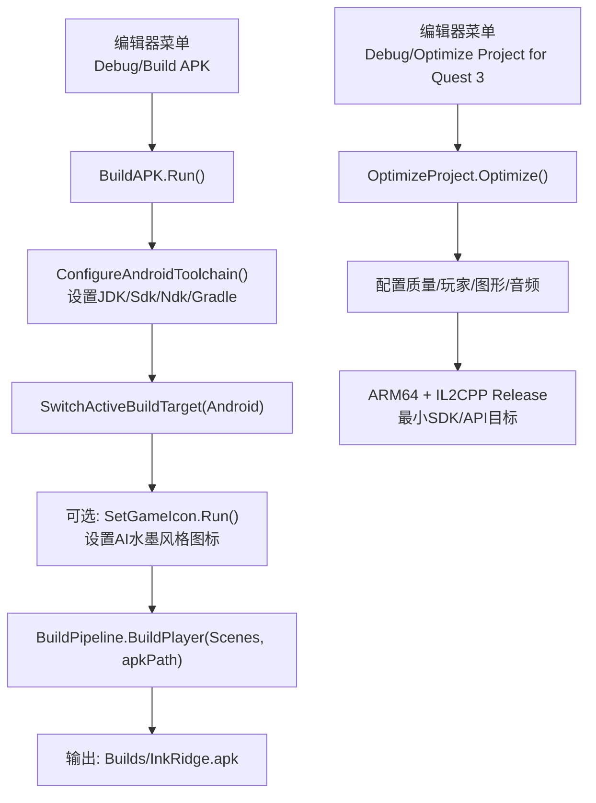
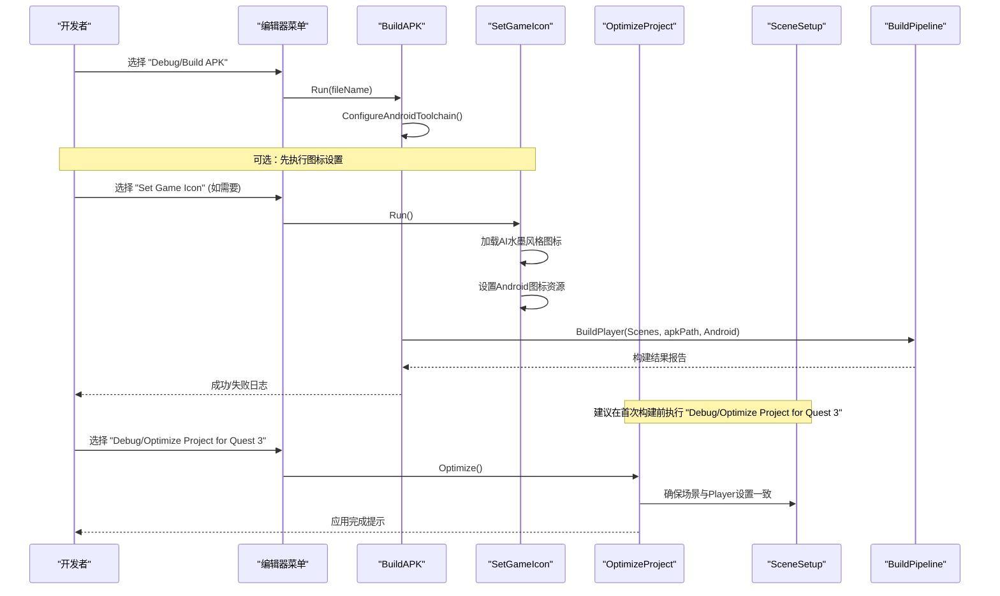
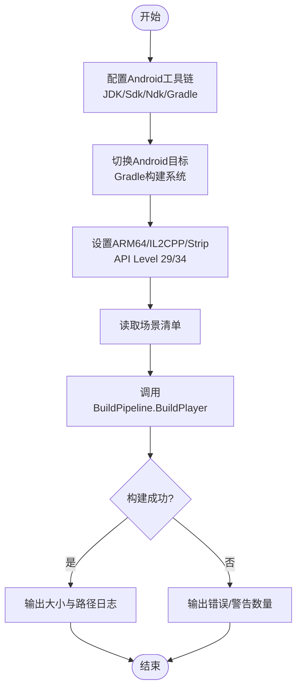
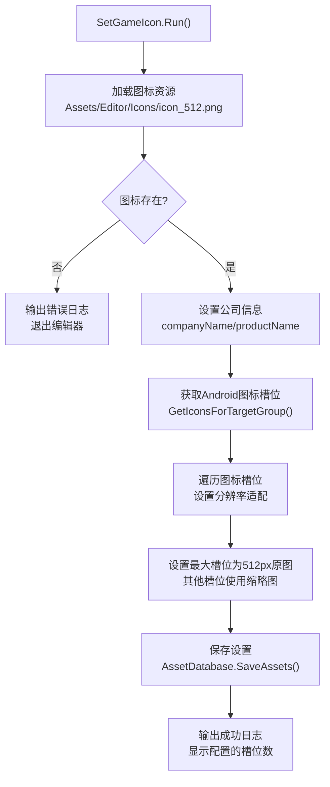
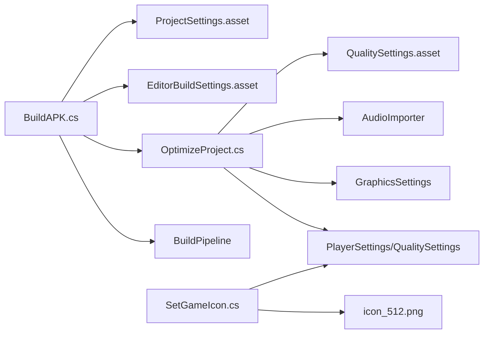

# 部署构建

<cite>
**本文引用的文件**
- [BuildAPK.cs](file://Assets/Editor/BuildAPK.cs)
- [SetAndroidPaths.cs](file://Assets/Editor/SetAndroidPaths.cs)
- [SetGameIcon.cs](file://Assets/Editor/SetGameIcon.cs)
- [OptimizeProject.cs](file://Assets/Editor/OptimizeProject.cs)
- [SceneSetup.cs](file://Assets/Editor/SceneSetup.cs)
- [icon_512.png.meta](file://Assets/Editor/Icons/icon_512.png.meta)
- [AndroidExternalToolsSettings.json](file://ProjectSettings/AndroidExternalToolsSettings.json)
- [EditorBuildSettings.asset](file://ProjectSettings/EditorBuildSettings.asset)
- [ProjectSettings.asset](file://ProjectSettings/ProjectSettings.asset)
- [QualitySettings.asset](file://ProjectSettings/QualitySettings.asset)
</cite>

## 更新摘要
**变更内容**
- 新增游戏图标系统章节，详细说明AI生成的水墨风格图标设置流程
- 更新构建流程，包含图标配置步骤
- 添加图标资源管理和平台适配说明
- 扩展故障排查指南，包含图标相关问题的解决方案

## 目录
1. [简介](#简介)
2. [项目结构](#项目结构)
3. [核心组件](#核心组件)
4. [架构总览](#架构总览)
5. [详细组件分析](#详细组件分析)
6. [依赖关系分析](#依赖关系分析)
7. [性能与优化](#性能与优化)
8. [故障排查指南](#故障排查指南)
9. [结论](#结论)
10. [附录：CI/CD 集成建议](#附录cicd-集成建议)

## 简介
本指南面向InkRidge项目的Android（Quest 3）APK构建与发布，重点说明编辑器脚本的构建流程、ARM64架构配置、IL2CPP编译设置、Android包生成过程，以及开发/测试/发布目标的差异。同时提供环境配置、依赖管理、资源打包、签名配置、常见问题诊断与自动化流水线集成建议。**新增功能**：支持通过AI生成的水墨风格图标系统为Android应用设置自定义应用图标。

## 项目结构
本项目将Android构建相关的编辑器脚本集中在Assets/Editor下，并通过ProjectSettings中的外部工具与Player设置完成平台与工具链绑定。关键路径如下：
- 编辑器脚本：BuildAPK.cs、SetAndroidPaths.cs、SetGameIcon.cs、OptimizeProject.cs、SceneSetup.cs
- 图标资源：Assets/Editor/Icons/icon_512.png（AI生成的水墨风格图标）
- 外部工具配置：AndroidExternalToolsSettings.json
- 构建场景清单：EditorBuildSettings.asset
- 平台与质量配置：ProjectSettings.asset、QualitySettings.asset

**图表来源**
- [BuildAPK.cs:35-62](file://Assets/Editor/BuildAPK.cs#L35-L62)
- [BuildAPK.cs:73-103](file://Assets/Editor/BuildAPK.cs#L73-L103)
- [SetGameIcon.cs:11-37](file://Assets/Editor/SetGameIcon.cs#L11-L37)
- [OptimizeProject.cs:37-49](file://Assets/Editor/OptimizeProject.cs#L37-L49)
- [OptimizeProject.cs:142-176](file://Assets/Editor/OptimizeProject.cs#L142-L176)

**章节来源**
- [BuildAPK.cs:1-118](file://Assets/Editor/BuildAPK.cs#L1-L118)
- [SetGameIcon.cs:1-39](file://Assets/Editor/SetGameIcon.cs#L1-L39)
- [icon_512.png.meta:1-154](file://Assets/Editor/Icons/icon_512.png.meta#L1-L154)
- [AndroidExternalToolsSettings.json:1-7](file://ProjectSettings/AndroidExternalToolsSettings.json#L1-L7)
- [EditorBuildSettings.asset:1-45](file://ProjectSettings/EditorBuildSettings.asset#L1-L45)

## 核心组件
- BuildAPK：统一的APK构建入口，负责工具链配置、场景列表、输出路径与构建调用。
- SetAndroidPaths：快速设置Android SDK、NDK、JDK路径并固定ARM64目标。
- **SetGameIcon**：**新增**：为Android应用设置AI生成的水墨风格图标，支持多分辨率适配和自适应图标。
- OptimizeProject：针对Quest 3的一键优化，包含质量等级、IL2CPP Release、图形与音频优化等。
- SceneSetup：确保场景顺序与Player基础设置一致，避免构建时遗漏或错位。

**章节来源**
- [BuildAPK.cs:17-62](file://Assets/Editor/BuildAPK.cs#L17-L62)
- [SetAndroidPaths.cs:6-18](file://Assets/Editor/SetAndroidPaths.cs#L6-L18)
- [SetGameIcon.cs:5-37](file://Assets/Editor/SetGameIcon.cs#L5-L37)
- [OptimizeProject.cs:9-49](file://Assets/Editor/OptimizeProject.cs#L9-L49)
- [SceneSetup.cs:37-70](file://Assets/Editor/SceneSetup.cs#L37-L70)

## 架构总览
构建流程由编辑器菜单触发，先统一配置Android工具链与Player设置，再调用Unity构建管线生成APK。**新增图标设置步骤**可在构建前执行，确保应用图标正确配置。优化脚本在构建前运行，确保质量、渲染、音频与IL2CPP配置符合Quest 3要求。

**图表来源**
- [BuildAPK.cs:35-62](file://Assets/Editor/BuildAPK.cs#L35-L62)
- [BuildAPK.cs:73-103](file://Assets/Editor/BuildAPK.cs#L73-L103)
- [SetGameIcon.cs:11-37](file://Assets/Editor/SetGameIcon.cs#L11-L37)
- [OptimizeProject.cs:37-49](file://Assets/Editor/OptimizeProject.cs#L37-L49)
- [SceneSetup.cs:37-70](file://Assets/Editor/SceneSetup.cs#L37-L70)

## 详细组件分析

### BuildAPK 构建流程
- 场景清单：集中定义场景顺序，需与SceneSetup保持一致，保证构建产物可预期。
- 工具链配置：自动定位JDK（优先使用编辑器内置OpenJDK），并写入SDK/NDK/Gradle相关EditorPrefs；切换Android目标并使用Gradle构建系统。
- 构建参数：强制ARM64、设置最小/目标API级别、启用IL2CPP与引擎代码剥离。
- 输出策略：稳定文件名覆盖便于adb调试；带时间戳版本用于归档。

**图表来源**
- [BuildAPK.cs:35-62](file://Assets/Editor/BuildAPK.cs#L35-L62)
- [BuildAPK.cs:73-103](file://Assets/Editor/BuildAPK.cs#L73-L103)

**章节来源**
- [BuildAPK.cs:17-62](file://Assets/Editor/BuildAPK.cs#L17-L62)
- [BuildAPK.cs:73-103](file://Assets/Editor/BuildAPK.cs#L73-L103)

### SetAndroidPaths 环境配置
- 作用：一键设置Android SDK、NDK、JDK路径，并将目标架构设为ARM64，适合新机器或CI环境初始化。
- 注意：路径为本地示例，实际使用时应替换为对应环境的真实路径。

**章节来源**
- [SetAndroidPaths.cs:6-18](file://Assets/Editor/SetAndroidPaths.cs#L6-L18)
- [AndroidExternalToolsSettings.json:1-7](file://ProjectSettings/AndroidExternalToolsSettings.json#L1-L7)

### SetGameIcon 游戏图标系统
**新增功能**：为Android应用设置AI生成的水墨风格图标，支持多分辨率适配和自适应图标。

- **图标资源**：使用Assets/Editor/Icons/icon_512.png作为源图标，采用AI生成的水墨风格设计。
- **多分辨率适配**：自动处理Unity图标槽位（从最小的48px到最大的192px+），将512px高分辨率图标分配给最大槽位，让Unity自动缩放到其他尺寸。
- **自适应图标支持**：Quest设备会从APK清单中读取512px自适应图标，提供更好的视觉体验。
- **公司产品信息**：自动设置PlayerSettings.companyName为"MichaelQiu"，productName为"InkRidge"。
- **资源验证**：检查图标文件是否存在，如果找不到则输出错误并退出编辑器。

**图表来源**
- [SetGameIcon.cs:11-37](file://Assets/Editor/SetGameIcon.cs#L11-L37)

**章节来源**
- [SetGameIcon.cs:5-37](file://Assets/Editor/SetGameIcon.cs#L5-L37)
- [icon_512.png.meta:1-154](file://Assets/Editor/Icons/icon_512.png.meta#L1-L154)

### OptimizeProject 构建前优化
- 质量等级：创建或复用"Quest 3"质量等级，关闭阴影、降低粒子预算、开启各向异性过滤、禁用VSync（VR合成器接管）。
- Player设置：ARM64、IL2CPP Release、最小API 29、禁用blit、启用帧 pacing、标记为游戏模式、裁剪无用组件与引擎代码。
- 图形：将运行时通过字符串查找的着色器加入"Always Included"，防止被剥离导致材质回退到错误着色器。
- 音频：根据资源名区分环境音与音效，环境音采用流式加载，短音效预解压，压缩格式Vorbis，平衡内存与延迟。
- 单通道实例化：提供检查器，若着色器未声明立体宏则拒绝启用，避免立体渲染异常。

**章节来源**
- [OptimizeProject.cs:53-138](file://Assets/Editor/OptimizeProject.cs#L53-L138)
- [OptimizeProject.cs:142-176](file://Assets/Editor/OptimizeProject.cs#L142-L176)
- [OptimizeProject.cs:204-243](file://Assets/Editor/OptimizeProject.cs#L204-L243)
- [OptimizeProject.cs:257-292](file://Assets/Editor/OptimizeProject.cs#L257-L292)
- [OptimizeProject.cs:296-333](file://Assets/Editor/OptimizeProject.cs#L296-L333)

### SceneSetup 场景与Player一致性
- 场景顺序：确保构建场景顺序与BuildAPK一致，避免运行时索引错乱。
- Player基础设置：公司名、产品名、API兼容性、脚本后端、目标架构与最低API级别。

**章节来源**
- [SceneSetup.cs:37-70](file://Assets/Editor/SceneSetup.cs#L37-L70)

## 依赖关系分析
- 编辑器脚本之间通过共享的场景清单与Player设置保持耦合，确保构建产物一致。
- 外部工具配置集中于AndroidExternalToolsSettings.json，供Unity编辑器识别SDK/NDK/JDK。
- 构建目标与质量默认值由ProjectSettings与QualitySettings共同决定。
- **新增依赖**：SetGameIcon依赖于Assets/Editor/Icons/icon_512.png图标资源文件。

**图表来源**
- [BuildAPK.cs:35-62](file://Assets/Editor/BuildAPK.cs#L35-L62)
- [SetGameIcon.cs:11-37](file://Assets/Editor/SetGameIcon.cs#L11-L37)
- [OptimizeProject.cs:53-176](file://Assets/Editor/OptimizeProject.cs#L53-L176)
- [EditorBuildSettings.asset:7-26](file://ProjectSettings/EditorBuildSettings.asset#L7-L26)
- [QualitySettings.asset:352-378](file://ProjectSettings/QualitySettings.asset#L352-L378)
- [ProjectSettings.asset:262-312](file://ProjectSettings/ProjectSettings.asset#L262-L312)

**章节来源**
- [EditorBuildSettings.asset:7-26](file://ProjectSettings/EditorBuildSettings.asset#L7-L26)
- [QualitySettings.asset:352-378](file://ProjectSettings/QualitySettings.asset#L352-L378)
- [ProjectSettings.asset:262-312](file://ProjectSettings/ProjectSettings.asset#L262-L312)

## 性能与优化
- 渲染：关闭阴影、限制像素灯数量、2x MSAA、禁用实时反射探针、LOD Bias=1.0、禁用VSync。
- 着色器：将运行时动态查找的着色器加入Always Included，避免剥离后材质失效。
- 音频：环境音流式加载，短音效预解压，Vorbis压缩，减少内存占用与启动卡顿。
- IL2CPP：Release配置+引擎代码剥离，显著减小体积并提升运行效率。
- VR：禁用blit、启用优化帧 pacing，适配Quest 3合成器。
- **图标优化**：使用单一512px高分辨率图标，让Unity自动缩放到不同分辨率，减少资源冗余。

**章节来源**
- [OptimizeProject.cs:53-138](file://Assets/Editor/OptimizeProject.cs#L53-L138)
- [OptimizeProject.cs:257-292](file://Assets/Editor/OptimizeProject.cs#L257-L292)
- [OptimizeProject.cs:296-333](file://Assets/Editor/OptimizeProject.cs#L296-L333)
- [SetGameIcon.cs:25-33](file://Assets/Editor/SetGameIcon.cs#L25-L33)

## 故障排查指南
- 构建失败（工具链问题）
  - 现象：JDK/SDK/NDK路径错误或不可用。
  - 处理：运行SetAndroidPaths或使用BuildAPK的工具链解析逻辑；确认AndroidExternalToolsSettings.json中路径有效。
  - 参考：[BuildAPK.cs:73-103](file://Assets/Editor/BuildAPK.cs#L73-L103)、[AndroidExternalToolsSettings.json:1-7](file://ProjectSettings/AndroidExternalToolsSettings.json#L1-L7)

- 构建失败（Gradle/NDK版本不匹配）
  - 现象：NDK版本与Unity期望不一致。
  - 处理：统一NDK版本至配置中指定版本；必要时升级或降级Unity/NDK。
  - 参考：[BuildAPK.cs:73-103](file://Assets/Editor/BuildAPK.cs#L73-L103)

- **图标设置失败**
  - **现象**：SetGameIcon无法找到图标文件或设置失败。
  - **处理**：确认Assets/Editor/Icons/icon_512.png文件存在且路径正确；检查图标文件格式是否为PNG；确保图标文件未被锁定或损坏。
  - **参考**：[SetGameIcon.cs:13-19](file://Assets/Editor/SetGameIcon.cs#L13-L19)

- **图标显示异常**
  - **现象**：Android设备上应用图标显示不正确或模糊。
  - **处理**：重新运行SetGameIcon以确保图标正确配置；检查Unity的图标缩放设置；确认图标分辨率足够（建议使用512px或更高）。
  - **参考**：[SetGameIcon.cs:25-33](file://Assets/Editor/SetGameIcon.cs#L25-L33)

- 材质显示异常（着色器被剥离）
  - 现象：运行时材质回退到错误着色器（品红色）。
  - 处理：运行OptimizeProject以注册Always Included着色器；确保着色器名称与脚本中一致。
  - 参考：[OptimizeProject.cs:257-292](file://Assets/Editor/OptimizeProject.cs#L257-L292)

- 立体渲染异常（单通道实例化）
  - 现象：启用单通道实例化后立体画面错误。
  - 处理：使用"Enable Single-Pass Instanced"检查着色器是否声明立体宏；未满足条件时不要启用。
  - 参考：[OptimizeProject.cs:204-243](file://Assets/Editor/OptimizeProject.cs#L204-L243)

- 场景顺序不一致
  - 现象：运行时索引错乱或功能异常。
  - 处理：确保BuildAPK与SceneSetup中的场景顺序一致。
  - 参考：[BuildAPK.cs:17-28](file://Assets/Editor/BuildAPK.cs#L17-L28)、[SceneSetup.cs:52-70](file://Assets/Editor/SceneSetup.cs#L52-L70)

- 资源缺失或导入问题
  - 现象：音频或纹理未正确打包。
  - 处理：运行OptimizeProject重新导入音频设置；检查资源是否在Assets/Audio下且命名规范。
  - 参考：[OptimizeProject.cs:296-333](file://Assets/Editor/OptimizeProject.cs#L296-L333)

**章节来源**
- [BuildAPK.cs:73-103](file://Assets/Editor/BuildAPK.cs#L73-L103)
- [SetGameIcon.cs:13-33](file://Assets/Editor/SetGameIcon.cs#L13-L33)
- [OptimizeProject.cs:204-292](file://Assets/Editor/OptimizeProject.cs#L204-L292)
- [SceneSetup.cs:52-70](file://Assets/Editor/SceneSetup.cs#L52-L70)

## 结论
InkRidge的Android构建通过编辑器脚本实现了高度可重复的流程：统一工具链配置、ARM64+IL2CPP Release、Quest 3质量与渲染优化、音频与着色器保护。**新增的AI水墨风格图标系统**为应用提供了独特的视觉标识，支持多分辨率适配和自适应图标。**遵循"先设置图标、再优化、后构建"的工作流**，可显著降低构建失败率与运行时异常。对于多目标发布，可在现有脚本基础上扩展构建选项与签名流程。

## 附录：CI/CD 集成建议
- 环境准备
  - 安装Unity/Tuanjie 2022.3.62t12与Android SDK/NDK（版本与项目一致）。
  - 配置AndroidExternalToolsSettings.json或使用SetAndroidPaths在CI初始化阶段设置路径。
  - 安装Gradle（如为空，按Unity期望版本安装或通过Unity工具链获取）。
  - **确保图标资源存在**：验证Assets/Editor/Icons/icon_512.png文件存在于CI环境中。

- 构建步骤
  - **可选：执行图标设置**：在构建前运行SetGameIcon以确保应用图标正确配置。
  - 执行"Debug/Optimize Project for Quest 3"以应用质量、渲染与音频优化。
  - 执行"Debug/Build APK (dated)"生成带时间戳的APK用于归档；如需稳定文件名用于自动化分发，可使用"Debug/Build APK"。
  - 校验输出目录Builds下的APK大小与构建报告。

- 签名与发布
  - 当前项目未启用自定义Keystore签名。建议在发布前启用并配置Android Keystore与Alias，或在Gradle模板中注入签名信息。
  - 发布渠道（如Oculus Store）需要符合其签名与Bundle要求；可按需启用AAB与签名验证。
  - **图标验证**：发布前检查APK中的图标是否正确嵌入，确保在不同分辨率设备上显示正常。

- 自动化流水线
  - 在CI中安装Unity与Android工具链，执行编辑器批处理命令调用菜单项或构建脚本。
  - 缓存Gradle与Unity库以提升构建速度。
  - 产出APK与构建日志作为工件保存，便于回溯与审计。
  - **图标资源管理**：在CI环境中维护图标资源的版本控制，确保构建时使用正确的图标文件。

**章节来源**
- [AndroidExternalToolsSettings.json:1-7](file://ProjectSettings/AndroidExternalToolsSettings.json#L1-L7)
- [BuildAPK.cs:35-62](file://Assets/Editor/BuildAPK.cs#L35-L62)
- [SetGameIcon.cs:11-37](file://Assets/Editor/SetGameIcon.cs#L11-L37)
- [OptimizeProject.cs:37-49](file://Assets/Editor/OptimizeProject.cs#L37-L49)