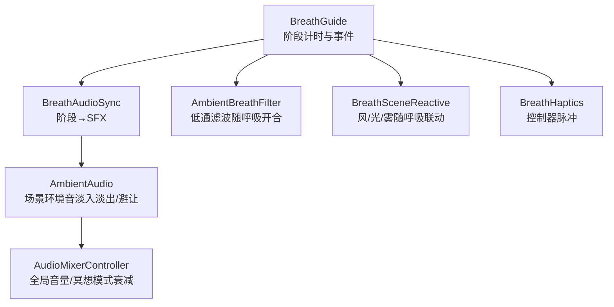
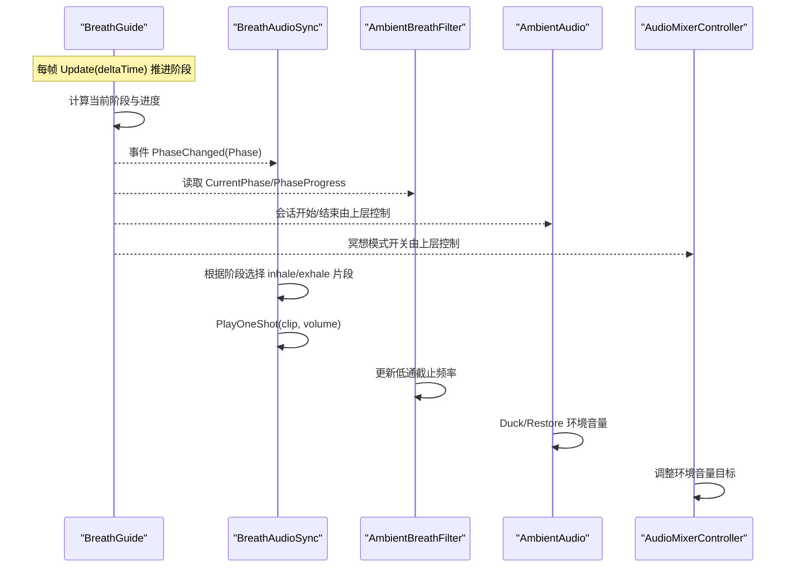
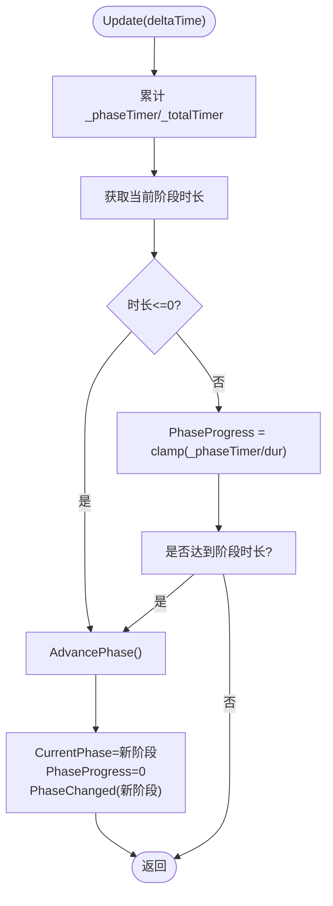
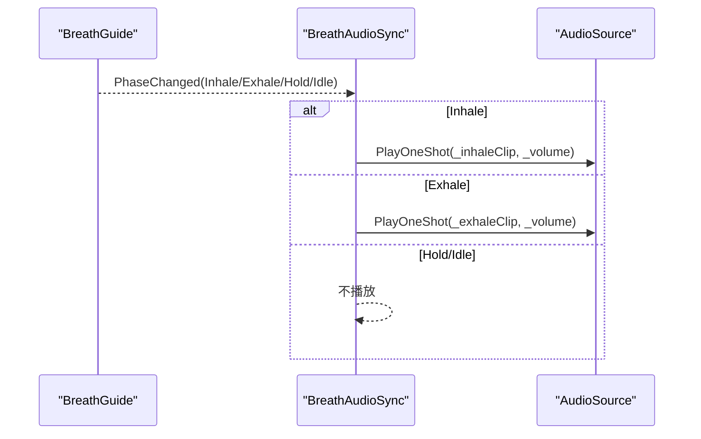
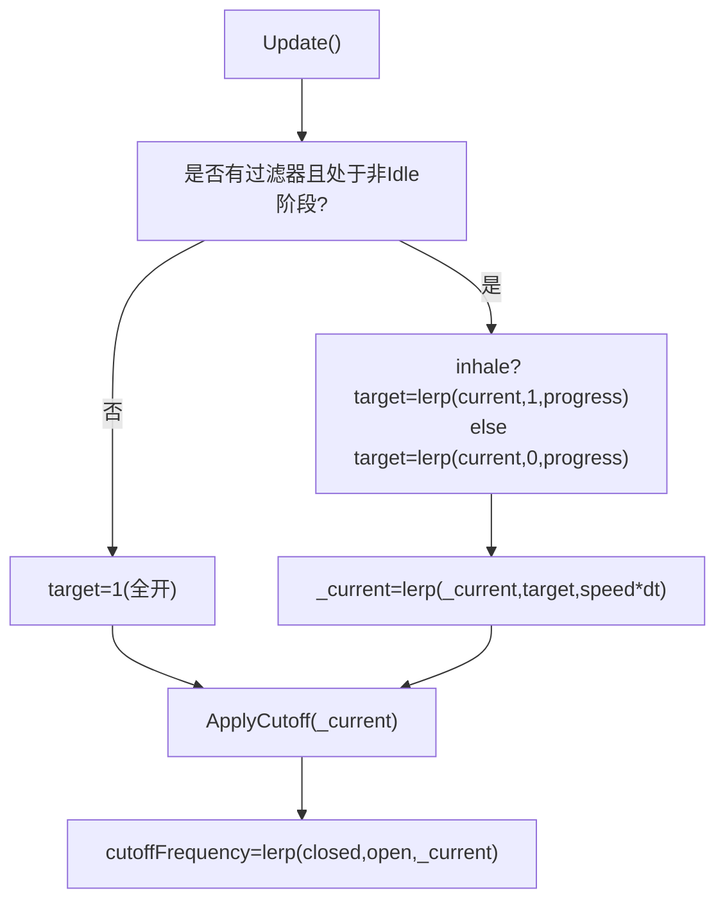
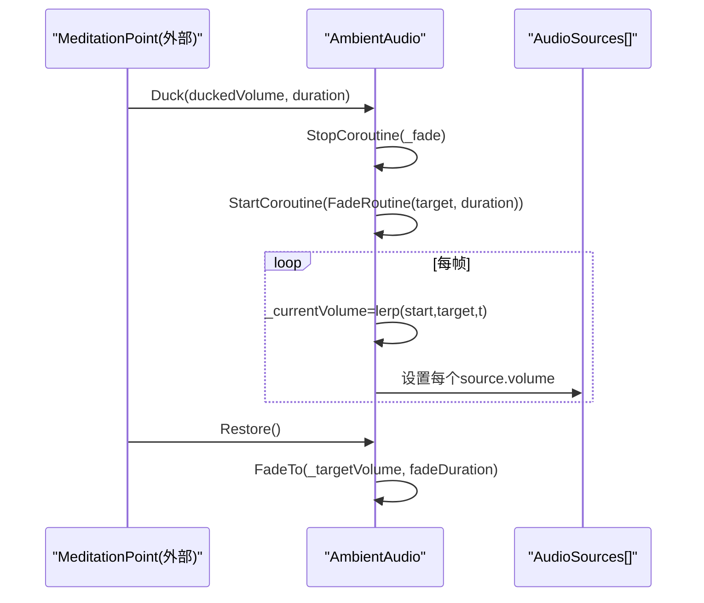
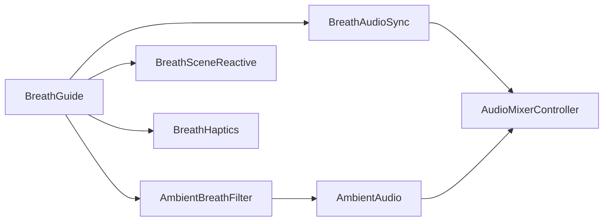

# 呼吸音频同步

<cite>
**本文引用的文件**
- [BreathAudioSync.cs](file://Assets/Scripts/Environment/BreathAudioSync.cs)
- [BreathGuide.cs](file://Assets/Scripts/Meditation/BreathGuide.cs)
- [AmbientAudio.cs](file://Assets/Scripts/Environment/AmbientAudio.cs)
- [AmbientBreathFilter.cs](file://Assets/Scripts/Environment/AmbientBreathFilter.cs)
- [AudioMixerController.cs](file://Assets/Scripts/Core/AudioMixerController.cs)
- [BreathSceneReactive.cs](file://Assets/Scripts/Core/BreathSceneReactive.cs)
- [BreathHaptics.cs](file://Assets/Scripts/Meditation/BreathHaptics.cs)
- [ComfortSettings.cs](file://Assets/Scripts/Core/ComfortSettings.cs)
</cite>

## 目录
1. [简介](#简介)
2. [项目结构](#项目结构)
3. [核心组件](#核心组件)
4. [架构总览](#架构总览)
5. [详细组件分析](#详细组件分析)
6. [依赖关系分析](#依赖关系分析)
7. [性能考量](#性能考量)
8. [故障排查指南](#故障排查指南)
9. [结论](#结论)
10. [附录](#附录)

## 简介
本技术文档围绕 BreathAudioSync 及其协作系统，系统化说明“呼吸节奏与环境音效的时间同步机制”。重点包括：
- 将呼吸阶段变化映射到音频播放事件（吸气/呼气）的触发逻辑
- 音频触发器的工作原理与音量、空间定位控制
- 时间对齐算法，确保音频反馈与视觉提示和用户感知一致
- 音频事件的队列管理与优先级处理，避免冲突与重叠
- 自定义音频同步模式的扩展接口，支持不同呼吸节奏与音效组合
- 调试工具与方法，用于验证同步准确性与体验流畅性

## 项目结构
本项目采用分层组织：核心（Core）、冥想（Meditation）、环境（Environment）。BreathAudioSync 位于 Environment 层，订阅 Meditation 层的 BreathGuide 阶段事件，驱动 AudioSource 播放 SFX；同时通过 AmbientAudio、AmbientBreathFilter、AudioMixerController 等组件协同完成环境音混音与滤波。

图表来源
- [BreathGuide.cs:1-173](file://Assets/Scripts/Meditation/BreathGuide.cs#L1-L173)
- [BreathAudioSync.cs:1-75](file://Assets/Scripts/Environment/BreathAudioSync.cs#L1-L75)
- [AmbientAudio.cs:1-112](file://Assets/Scripts/Environment/AmbientAudio.cs#L1-L112)
- [AmbientBreathFilter.cs:1-89](file://Assets/Scripts/Environment/AmbientBreathFilter.cs#L1-L89)
- [AudioMixerController.cs:1-67](file://Assets/Scripts/Core/AudioMixerController.cs#L1-L67)
- [BreathSceneReactive.cs:1-147](file://Assets/Scripts/Core/BreathSceneReactive.cs#L1-L147)
- [BreathHaptics.cs:1-109](file://Assets/Scripts/Meditation/BreathHaptics.cs#L1-L109)

章节来源
- [BreathGuide.cs:1-173](file://Assets/Scripts/Meditation/BreathGuide.cs#L1-L173)
- [BreathAudioSync.cs:1-75](file://Assets/Scripts/Environment/BreathAudioSync.cs#L1-L75)
- [AmbientAudio.cs:1-112](file://Assets/Scripts/Environment/AmbientAudio.cs#L1-L112)
- [AmbientBreathFilter.cs:1-89](file://Assets/Scripts/Environment/AmbientBreathFilter.cs#L1-L89)
- [AudioMixerController.cs:1-67](file://Assets/Scripts/Core/AudioMixerController.cs#L1-L67)
- [BreathSceneReactive.cs:1-147](file://Assets/Scripts/Core/BreathSceneReactive.cs#L1-L147)
- [BreathHaptics.cs:1-109](file://Assets/Scripts/Meditation/BreathHaptics.cs#L1-L109)

## 核心组件
- BreathGuide：定义呼吸阶段与节拍模式，按固定时长推进阶段并广播 PhaseChanged 事件。提供 PhaseProgress 供视觉与音频平滑跟随。
- BreathAudioSync：订阅 BreathGuide.PhaseChanged，在 Inhale/Exhale 时播放对应 SFX；Hold 阶段保持静音，由触觉通道承担提示。
- AmbientAudio：管理场景环境音源的淡入淡出与避让（Duck），保证引导音可听性。
- AmbientBreathFilter：为环境音源添加低通滤波器，随呼吸阶段动态改变截止频率，营造“世界随呼吸开合”的空间感。
- AudioMixerController：统一控制主音量、SFX 音量与环境音量，并在冥想模式下降低环境音量以突出引导。
- BreathSceneReactive：非音频但关键的多模态同步组件，驱动风、光、雾等视觉元素与呼吸同频，增强一致性。
- BreathHaptics：在阶段切换时触发手柄脉冲，作为闭眼跟随的重要通道。

章节来源
- [BreathGuide.cs:1-173](file://Assets/Scripts/Meditation/BreathGuide.cs#L1-L173)
- [BreathAudioSync.cs:1-75](file://Assets/Scripts/Environment/BreathAudioSync.cs#L1-L75)
- [AmbientAudio.cs:1-112](file://Assets/Scripts/Environment/AmbientAudio.cs#L1-L112)
- [AmbientBreathFilter.cs:1-89](file://Assets/Scripts/Environment/AmbientBreathFilter.cs#L1-L89)
- [AudioMixerController.cs:1-67](file://Assets/Scripts/Core/AudioMixerController.cs#L1-L67)
- [BreathSceneReactive.cs:1-147](file://Assets/Scripts/Core/BreathSceneReactive.cs#L1-L147)
- [BreathHaptics.cs:1-109](file://Assets/Scripts/Meditation/BreathHaptics.cs#L1-L109)

## 架构总览
BreathGuide 是单一事实源，负责阶段推进与事件广播。所有多模态通道（音频、触觉、视觉、环境滤波）均订阅该事件或读取其状态，从而保证严格同步。

图表来源
- [BreathGuide.cs:54-102](file://Assets/Scripts/Meditation/BreathGuide.cs#L54-L102)
- [BreathAudioSync.cs:33-72](file://Assets/Scripts/Environment/BreathAudioSync.cs#L33-L72)
- [AmbientBreathFilter.cs:57-85](file://Assets/Scripts/Environment/AmbientBreathFilter.cs#L57-L85)
- [AmbientAudio.cs:20-38](file://Assets/Scripts/Environment/AmbientAudio.cs#L20-L38)
- [AudioMixerController.cs:26-48](file://Assets/Scripts/Core/AudioMixerController.cs#L26-L48)

## 详细组件分析

### BreathGuide：时间对齐与阶段推进
- 阶段枚举包含 Inhale、HoldAfterInhale、Exhale、HoldAfterExhale、Idle。
- 通过 PatternTimings 表定义不同节拍的各阶段时长，支持 Balanced444、Relax478、Box4444、Free。
- 每帧调用 Update(deltaTime)，累计阶段计时器，到达阈值后进入下一阶段并广播 PhaseChanged。
- 维护 PhaseProgress，供视觉与音频做平滑插值，确保多通道一致。

图表来源
- [BreathGuide.cs:79-147](file://Assets/Scripts/Meditation/BreathGuide.cs#L79-L147)

章节来源
- [BreathGuide.cs:1-173](file://Assets/Scripts/Meditation/BreathGuide.cs#L1-L173)

### BreathAudioSync：音频触发器与播放控制
- 绑定 BreathGuide，订阅 PhaseChanged。
- 仅在 Inhale/Exhale 播放对应 SFX；Hold 阶段不发声，交由触觉通道提示。
- 使用 2D 空间定位（spatialBlend=0），避免声像偏移干扰沉浸感。
- 使用 PlayOneShot 播放短音效，避免循环导致的叠加问题。

图表来源
- [BreathAudioSync.cs:25-72](file://Assets/Scripts/Environment/BreathAudioSync.cs#L25-L72)

章节来源
- [BreathAudioSync.cs:1-75](file://Assets/Scripts/Environment/BreathAudioSync.cs#L1-L75)

### AmbientBreathFilter：环境音随呼吸开合
- 自动收集子物体 AudioSource，并为缺失的低通滤波器添加实例。
- 根据 BreathGuide.CurrentPhase 与 PhaseProgress 计算目标截止频率，吸气压高、呼气压低，形成“世界随呼吸开合”的听觉效果。
- 响应速度可调，确保过渡自然。

图表来源
- [AmbientBreathFilter.cs:42-85](file://Assets/Scripts/Environment/AmbientBreathFilter.cs#L42-L85)

章节来源
- [AmbientBreathFilter.cs:1-89](file://Assets/Scripts/Environment/AmbientBreathFilter.cs#L1-L89)

### AmbientAudio：环境音淡入淡出与避让
- 场景加载时淡入至目标音量，退出时淡出停止。
- 支持 Duck 与 Restore，在重要引导音播放期间临时压低环境音，保障可懂度。
- 通过协程实现平滑过渡，避免多请求冲突。

图表来源
- [AmbientAudio.cs:20-78](file://Assets/Scripts/Environment/AmbientAudio.cs#L20-L78)

章节来源
- [AmbientAudio.cs:1-112](file://Assets/Scripts/Environment/AmbientAudio.cs#L1-L112)

### AudioMixerController：全局音量与冥想模式
- 统一管理主音量、SFX 音量与环境音量。
- 冥想模式下，环境音量按衰减系数降低，突出引导音。
- 使用 Lerp 平滑过渡，空闲时提前退出以避免无意义计算。

章节来源
- [AudioMixerController.cs:1-67](file://Assets/Scripts/Core/AudioMixerController.cs#L1-L67)

### BreathSceneReactive：多模态一致性
- 虽非音频组件，但与呼吸同频驱动风、光、雾等，强化用户感知的一致性。
- 与 BreathGuide 解耦，仅读取 CurrentPhase 与 PhaseProgress。

章节来源
- [BreathSceneReactive.cs:1-147](file://Assets/Scripts/Core/BreathSceneReactive.cs#L1-L147)

### BreathHaptics：触觉通道补充
- 在阶段切换时触发手柄脉冲，强度与持续时间可配置。
- 支持左右手独立输出，设备热插拔时重新解析输入设备。

章节来源
- [BreathHaptics.cs:1-109](file://Assets/Scripts/Meditation/BreathHaptics.cs#L1-L109)
- [ComfortSettings.cs:1-81](file://Assets/Scripts/Core/ComfortSettings.cs#L1-L81)

## 依赖关系分析
- BreathGuide 是中心事件源，被 BreathAudioSync、AmbientBreathFilter、BreathSceneReactive、BreathHaptics 订阅或读取。
- BreathAudioSync 依赖 AudioSource 播放 SFX，受 AudioMixerController 的全局音量影响。
- AmbientAudio 与 AmbientBreathFilter 共同塑造环境音空间感，并通过 Duck/Restore 与引导音协调。
- ComfortSettings 控制触觉通道开关，间接影响整体体验。

图表来源
- [BreathGuide.cs:1-173](file://Assets/Scripts/Meditation/BreathGuide.cs#L1-L173)
- [BreathAudioSync.cs:1-75](file://Assets/Scripts/Environment/BreathAudioSync.cs#L1-L75)
- [AmbientBreathFilter.cs:1-89](file://Assets/Scripts/Environment/AmbientBreathFilter.cs#L1-L89)
- [AmbientAudio.cs:1-112](file://Assets/Scripts/Environment/AmbientAudio.cs#L1-L112)
- [AudioMixerController.cs:1-67](file://Assets/Scripts/Core/AudioMixerController.cs#L1-L67)
- [BreathSceneReactive.cs:1-147](file://Assets/Scripts/Core/BreathSceneReactive.cs#L1-L147)
- [BreathHaptics.cs:1-109](file://Assets/Scripts/Meditation/BreathHaptics.cs#L1-L109)

章节来源
- [BreathGuide.cs:1-173](file://Assets/Scripts/Meditation/BreathGuide.cs#L1-L173)
- [BreathAudioSync.cs:1-75](file://Assets/Scripts/Environment/BreathAudioSync.cs#L1-L75)
- [AmbientBreathFilter.cs:1-89](file://Assets/Scripts/Environment/AmbientBreathFilter.cs#L1-L89)
- [AmbientAudio.cs:1-112](file://Assets/Scripts/Environment/AmbientAudio.cs#L1-L112)
- [AudioMixerController.cs:1-67](file://Assets/Scripts/Core/AudioMixerController.cs#L1-L67)
- [BreathSceneReactive.cs:1-147](file://Assets/Scripts/Core/BreathSceneReactive.cs#L1-L147)
- [BreathHaptics.cs:1-109](file://Assets/Scripts/Meditation/BreathHaptics.cs#L1-L109)

## 性能考量
- BreathGuide 每帧推进阶段并广播事件，但事件数量等于阶段切换次数，开销极低。
- AmbientBreathFilter 每帧对多个低通滤波器进行 Lerp 更新，建议合理设置响应速度与滤波器数量。
- AmbientAudio 使用协程淡入淡出，避免每帧硬改音量；在频繁 Duck/Restore 时会中断旧协程，防止竞争。
- AudioMixerController 在目标值稳定时提前退出 Update，减少空转。
- BreathAudioSync 使用 PlayOneShot 播放短音效，避免循环导致的资源占用与混叠。

[本节为通用性能讨论，不直接分析具体代码行]

## 故障排查指南
- 无声音：
  - 检查 BreathAudioSync 是否已 Bind BreathGuide，且 Inhale/Exhale 片段已赋值。
  - 确认 AudioSource 未静音、音量合理，且未被全局音量关闭。
  - 若场景中有 AmbientAudio，确认未被长时间 Duck 导致环境音过低。
- 声音重叠/冲突：
  - 避免在同一 AudioSource 上重复循环播放相同片段；BreathAudioSync 默认使用 PlayOneShot，不会循环。
  - 若自行扩展，请确保同一 Clip 的并发播放数可控，或使用对象池与优先级队列。
- 同步不一致：
  - 确认 BreathGuide 的 Update 每帧被调用，且各通道订阅/读取的是同一实例。
  - 检查 AmbientBreathFilter 与 BreathSceneReactive 的响应速度是否与期望一致。
- 触觉无效：
  - 检查 ComfortSettings.HapticsEnabled 是否开启，以及 XR 控制器是否可用。

章节来源
- [BreathAudioSync.cs:25-72](file://Assets/Scripts/Environment/BreathAudioSync.cs#L25-L72)
- [AmbientAudio.cs:20-78](file://Assets/Scripts/Environment/AmbientAudio.cs#L20-L78)
- [AmbientBreathFilter.cs:42-85](file://Assets/Scripts/Environment/AmbientBreathFilter.cs#L42-L85)
- [BreathGuide.cs:54-102](file://Assets/Scripts/Meditation/BreathGuide.cs#L54-L102)
- [BreathHaptics.cs:61-101](file://Assets/Scripts/Meditation/BreathHaptics.cs#L61-L101)
- [ComfortSettings.cs:61-66](file://Assets/Scripts/Core/ComfortSettings.cs#L61-L66)

## 结论
BreathAudioSync 通过订阅 BreathGuide 的阶段事件，将呼吸节奏精确映射到音频播放事件，配合环境滤波与音量避让，实现了稳定的多模态同步。其设计简洁、耦合清晰，易于扩展新的呼吸模式与音效组合。通过合理的队列与优先级策略（PlayOneShot、协程淡入淡出、全局音量控制），有效避免了音频冲突与重叠，保证了用户体验的流畅性与一致性。

[本节为总结性内容，不直接分析具体代码行]

## 附录

### 时间对齐与一致性要点
- 阶段推进：BreathGuide 每帧推进阶段，到达阈值即切换并广播事件。
- 进度插值：PhaseProgress 用于视觉与音频的平滑过渡，确保多通道一致。
- 事件驱动：所有通道订阅事件或读取状态，避免轮询带来的时序偏差。

章节来源
- [BreathGuide.cs:79-147](file://Assets/Scripts/Meditation/BreathGuide.cs#L79-L147)

### 音频队列与优先级策略
- 短音效优先：BreathAudioSync 使用 PlayOneShot 播放短音效，适合瞬时提示。
- 环境音避让：AmbientAudio 支持 Duck/Restore，在重要引导音出现时压低环境音。
- 全局音量：AudioMixerController 提供统一音量控制，冥想模式自动降低环境音量。

章节来源
- [BreathAudioSync.cs:68-72](file://Assets/Scripts/Environment/BreathAudioSync.cs#L68-L72)
- [AmbientAudio.cs:31-38](file://Assets/Scripts/Environment/AmbientAudio.cs#L31-L38)
- [AudioMixerController.cs:32-48](file://Assets/Scripts/Core/AudioMixerController.cs#L32-L48)

### 自定义扩展接口
- 新增呼吸模式：在 BreathGuide.PatternTimings 中增加新行，并在枚举中添加新模式，即可启用新节拍。
- 自定义音效：在 BreathAudioSync 中替换或扩展 AudioClip 引用，可在未来扩展更多阶段音效（如 Hold 提示）。
- 多通道联动：通过订阅 BreathGuide.PhaseChanged 或读取 CurrentPhase/PhaseProgress，扩展新的同步通道（如粒子、光照、音效）。

章节来源
- [BreathGuide.cs:25-44](file://Assets/Scripts/Meditation/BreathGuide.cs#L25-L44)
- [BreathAudioSync.cs:18-20](file://Assets/Scripts/Environment/BreathAudioSync.cs#L18-L20)