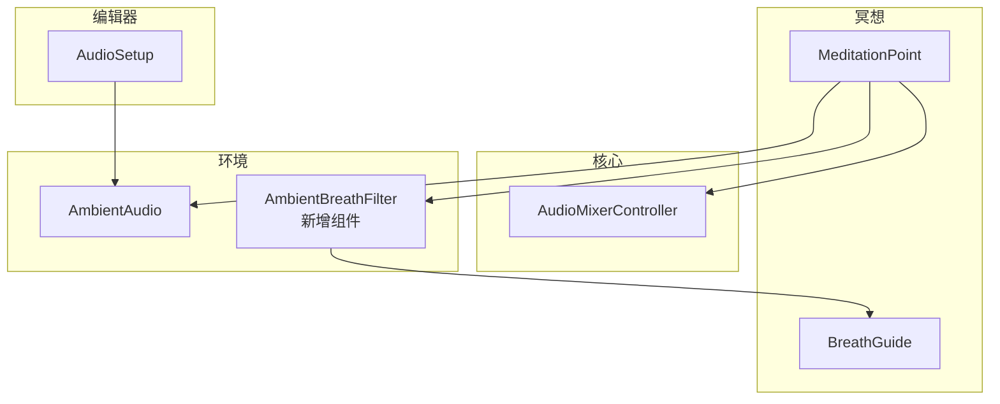
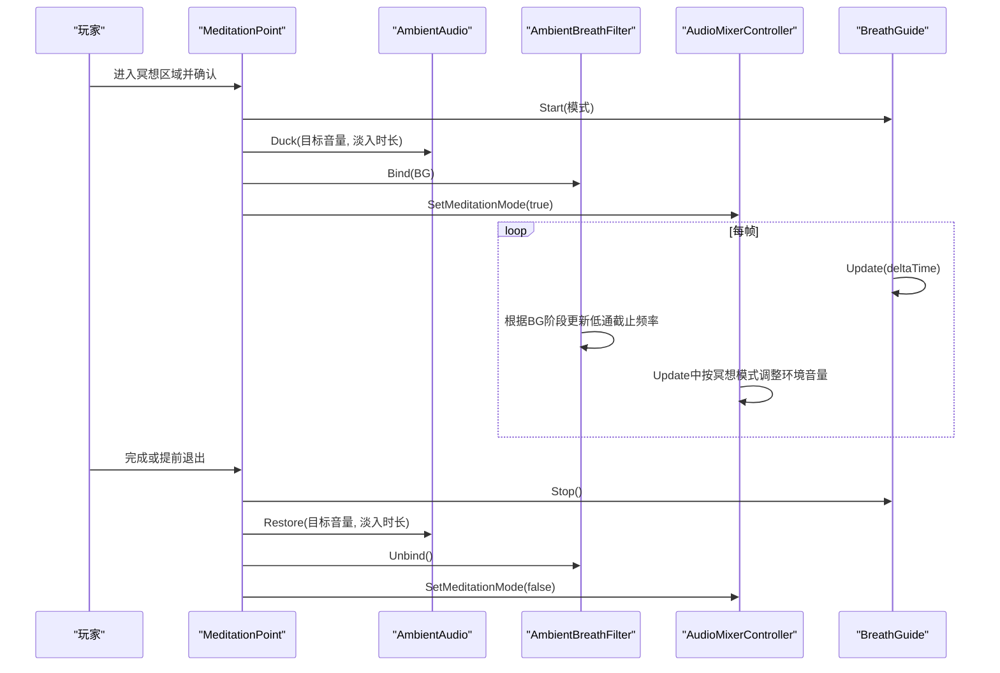
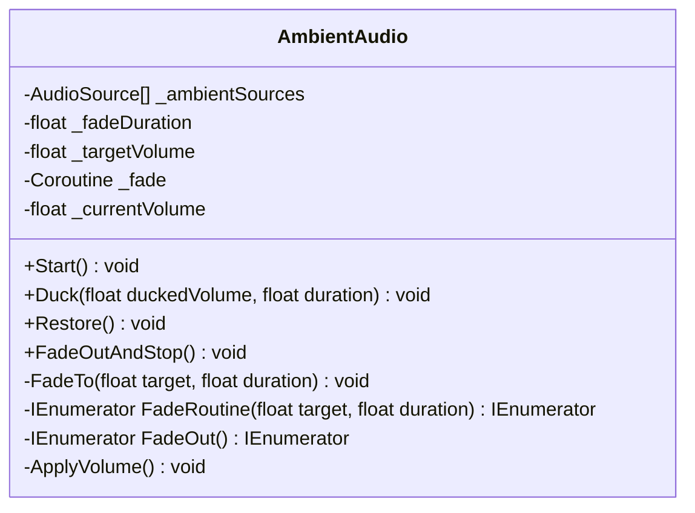
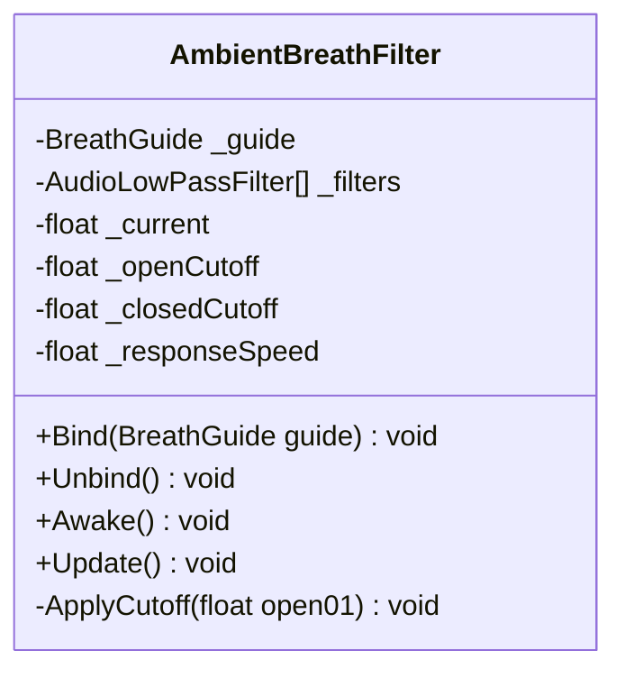
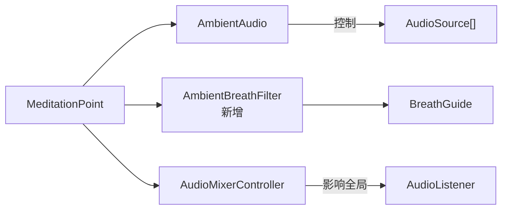

# 环境音效管理

<cite>
**本文引用的文件**
- [AmbientAudio.cs](file://Assets/Scripts/Environment/AmbientAudio.cs)
- [AmbientBreathFilter.cs](file://Assets/Scripts/Environment/AmbientBreathFilter.cs)
- [AudioMixerController.cs](file://Assets/Scripts/Core/AudioMixerController.cs)
- [MeditationPoint.cs](file://Assets/Scripts/Meditation/MeditationPoint.cs)
- [BreathGuide.cs](file://Assets/Scripts/Meditation/BreathGuide.cs)
- [AudioSetup.cs](file://Assets/Editor/AudioSetup.cs)
</cite>

## 更新摘要
**所做更改**
- 新增AmbientBreathFilter组件的详细技术文档
- 更新架构总览以包含新的呼吸滤波功能
- 增强详细组件分析部分，包含AmbientBreathFilter的实现细节
- 更新依赖关系分析以反映新的组件交互
- 完善性能考量和故障排查指南

## 目录
1. [简介](#简介)
2. [项目结构](#项目结构)
3. [核心组件](#核心组件)
4. [架构总览](#架构总览)
5. [详细组件分析](#详细组件分析)
6. [依赖关系分析](#依赖关系分析)
7. [性能考量](#性能考量)
8. [故障排查指南](#故障排查指南)
9. [结论](#结论)
10. [附录](#附录)

## 简介
本技术文档围绕场景特定的 3D 环境音效管理系统，重点解析 AmbientAudio 类的设计与实现。内容涵盖：
- 多音频源管理与淡入淡出机制
- 音量控制算法（平滑过渡的数学计算与协程使用）
- 音频源的动态生命周期（Play/Stop 调用时机）
- Duck（压低）功能原理：在冥想会话期间降低环境音量，确保呼吸指导清晰可闻
- **新增**：AmbientBreathFilter 组件 - 为环境音添加随呼吸变化的低通滤波效果，营造"世界随呼吸开合"的沉浸体验
- 资源与配置选项：淡入持续时间、目标音量、音频源数组设置方法
- 性能优化建议：音频源复用策略与内存管理最佳实践

## 项目结构
与环境音效相关的代码主要分布在 Environment、Core、Meditation 三个命名空间下：
- Environment：AmbientAudio、AmbientBreathFilter（新增）
- Core：AudioMixerController（全局混音器控制）
- Meditation：MeditationPoint、BreathGuide（驱动冥想流程与事件）
- Editor：AudioSetup（编辑器工具，用于批量为场景装配音频资源）

**图表来源**
- [AmbientAudio.cs:1-112](file://Assets/Scripts/Environment/AmbientAudio.cs#L1-L112)
- [AmbientBreathFilter.cs:1-89](file://Assets/Scripts/Environment/AmbientBreathFilter.cs#L1-L89)
- [AudioMixerController.cs:1-67](file://Assets/Scripts/Core/AudioMixerController.cs#L1-L67)
- [MeditationPoint.cs:1-346](file://Assets/Scripts/Meditation/MeditationPoint.cs#L1-L346)
- [BreathGuide.cs:1-173](file://Assets/Scripts/Meditation/BreathGuide.cs#L1-L173)
- [AudioSetup.cs:1-112](file://Assets/Editor/AudioSetup.cs#L1-L112)

**章节来源**
- [AmbientAudio.cs:1-112](file://Assets/Scripts/Environment/AmbientAudio.cs#L1-L112)
- [AmbientBreathFilter.cs:1-89](file://Assets/Scripts/Environment/AmbientBreathFilter.cs#L1-L89)
- [AudioMixerController.cs:1-67](file://Assets/Scripts/Core/AudioMixerController.cs#L1-L67)
- [MeditationPoint.cs:1-346](file://Assets/Scripts/Meditation/MeditationPoint.cs#L1-L346)
- [BreathGuide.cs:1-173](file://Assets/Scripts/Meditation/BreathGuide.cs#L1-L173)
- [AudioSetup.cs:1-112](file://Assets/Editor/AudioSetup.cs#L1-L112)

## 核心组件
- **AmbientAudio**：负责场景级 3D 环境音效的统一音量控制与淡入淡出；支持在冥想期间被"压低"并在结束后恢复。
- **AmbientBreathFilter**（新增）：为环境音添加低通滤波器，随呼吸阶段开合，增强沉浸感。根据 BreathGuide 的阶段（吸气/呼气）动态调整截止频率，营造"世界随呼吸开合"的听感。
- **AudioMixerController**：全局混音控制器，提供主音量、SFX、环境音量的统一控制，并在冥想模式下对整体环境音量进行衰减。
- **MeditationPoint**：触发冥想会话，协调视觉、触觉、音频与滤镜；在开始/结束时调用 AmbientAudio.Duck/Restore 和 AmbientBreathFilter.Bind/Unbind。
- **BreathGuide**：定义呼吸节奏与阶段，并通过事件驱动其他系统同步。

**章节来源**
- [AmbientAudio.cs:1-112](file://Assets/Scripts/Environment/AmbientAudio.cs#L1-L112)
- [AmbientBreathFilter.cs:1-89](file://Assets/Scripts/Environment/AmbientBreathFilter.cs#L1-L89)
- [AudioMixerController.cs:1-67](file://Assets/Scripts/Core/AudioMixerController.cs#L1-L67)
- [MeditationPoint.cs:1-346](file://Assets/Scripts/Meditation/MeditationPoint.cs#L1-L346)
- [BreathGuide.cs:1-173](file://Assets/Scripts/Meditation/BreathGuide.cs#L1-L173)

## 架构总览
AmbientAudio 作为场景环境音的"单一事实源"，通过协程实现平滑的音量过渡；AmbientBreathFilter 作为新增的呼吸滤波组件，为环境音添加随呼吸变化的低通滤波效果；MeditationPoint 在冥想开始/结束时分别调用 Duck/Restore 和 Bind/Unbind；AudioMixerController 则从全局层面在冥想时进一步压低环境音量。

**图表来源**
- [MeditationPoint.cs:213-232](file://Assets/Scripts/Meditation/MeditationPoint.cs#L213-L232)
- [MeditationPoint.cs:304-321](file://Assets/Scripts/Meditation/MeditationPoint.cs#L304-L321)
- [AmbientAudio.cs:31-38](file://Assets/Scripts/Environment/AmbientAudio.cs#L31-L38)
- [AmbientBreathFilter.cs:57-77](file://Assets/Scripts/Environment/AmbientBreathFilter.cs#L57-L77)
- [AudioMixerController.cs:32-48](file://Assets/Scripts/Core/AudioMixerController.cs#L32-L48)
- [BreathGuide.cs:54-102](file://Assets/Scripts/Meditation/BreathGuide.cs#L54-L102)

## 详细组件分析

### AmbientAudio：场景环境音管理器
职责
- 维护一组 AudioSource 数组，统一控制其音量。
- 场景加载时播放所有环境音，并以淡入方式达到目标音量。
- 支持外部调用的 Duck（压低）与 Restore（恢复）。
- 场景切换或停止时执行 FadeOutAndStop，淡出后停止所有源。

关键方法与流程
- Start：初始化当前音量为 0，立即应用一次 ApplyVolume，然后遍历数组 Play 所有源，最后启动 FadeTo(_targetVolume, _fadeDuration)。
- Duck(target, duration)：调用 FadeTo(target, duration)，将环境音压低到指定目标。
- Restore()：调用 FadeTo(_targetVolume, _fadeDuration)，恢复到默认目标音量。
- FadeOutAndStop()：若存在正在进行的淡入协程则先停止，再启动 FadeOut，最终对所有源执行 Stop。
- FadeTo(target, duration)：内部封装协程调用，避免多个淡入同时运行导致冲突。
- FadeRoutine(target, duration)：基于 Mathf.Lerp(start, target, t) 的线性插值，逐帧更新 _currentVolume 并 ApplyVolume。
- ApplyVolume()：遍历 _ambientSources，将 _currentVolume 赋给每个 AudioSource.volume。

淡入淡出算法
- 使用 Mathf.Lerp 在 start 与 target 之间按 elapsed/duration 的比例插值，保证平滑过渡。
- 协程以 yield return null 推进，避免阻塞主线程。
- 结束帧强制赋值 target，确保精度一致。

音频源生命周期
- 播放：Start 中 foreach source.Play()。
- 停止：FadeOut 完成后 foreach source.Stop()。

配置项
- _ambientSources：场景中的 3D 环境音源数组（Inspector 暴露）。
- _fadeDuration：淡入/淡出持续时间。
- _targetVolume：默认目标音量。

**章节来源**
- [AmbientAudio.cs:13-29](file://Assets/Scripts/Environment/AmbientAudio.cs#L13-L29)
- [AmbientAudio.cs:31-38](file://Assets/Scripts/Environment/AmbientAudio.cs#L31-L38)
- [AmbientAudio.cs:40-48](file://Assets/Scripts/Environment/AmbientAudio.cs#L40-L48)
- [AmbientAudio.cs:50-78](file://Assets/Scripts/Environment/AmbientAudio.cs#L50-L78)
- [AmbientAudio.cs:80-109](file://Assets/Scripts/Environment/AmbientAudio.cs#L80-L109)

#### 类图（AmbientAudio）

**图表来源**
- [AmbientAudio.cs:1-112](file://Assets/Scripts/Environment/AmbientAudio.cs#L1-L112)

### AmbientBreathFilter：环境"呼吸"滤波（新增组件）
职责
- 为场景内所有 AudioSource 子节点添加/使用 AudioLowPassFilter。
- 根据 BreathGuide 的阶段（吸气/呼气）动态调整截止频率，营造"世界随呼吸开合"的听感。
- 在冥想会话开始时自动附加到低通滤波器，会话结束时自动恢复。

核心实现
- **Awake**：收集所有子级 AudioSource 组件，为每个源添加或获取 AudioLowPassFilter，初始设置为打开状态（高截止频率）。
- **Update**：每帧检查 BreathGuide 的当前阶段，根据吸气/呼气状态计算目标截止频率，使用响应速度参数平滑过渡。
- **Bind/Unbind**：由 MeditationPoint 在冥想开始/结束时调用，绑定呼吸引导器或解绑并恢复滤波器状态。

滤波算法
- 使用 Mathf.Lerp 在关闭截止频率（_closedCutoff）和打开截止频率（_openCutoff）之间插值。
- 根据呼吸阶段的 PhaseProgress 计算目标值：吸气时向打开状态过渡，呼气时向关闭状态过渡。
- 响应速度（_responseSpeed）控制滤波器的变化速率，确保平滑自然的过渡效果。

配置选项
- _openCutoff：吸气时的低通滤波器截止频率（默认 12000Hz，接近全频带开放）。
- _closedCutoff：呼气时的低通滤波器截止频率（默认 1800Hz，产生闷声效果）。
- _responseSpeed：滤波器响应速度（默认 2.5），控制过渡的平滑程度。

**章节来源**
- [AmbientBreathFilter.cs:6-16](file://Assets/Scripts/Environment/AmbientBreathFilter.cs#L6-L16)
- [AmbientBreathFilter.cs:18-27](file://Assets/Scripts/Environment/AmbientBreathFilter.cs#L18-L27)
- [AmbientBreathFilter.cs:29-40](file://Assets/Scripts/Environment/AmbientBreathFilter.cs#L29-L40)
- [AmbientBreathFilter.cs:42-55](file://Assets/Scripts/Environment/AmbientBreathFilter.cs#L42-L55)
- [AmbientBreathFilter.cs:57-86](file://Assets/Scripts/Environment/AmbientBreathFilter.cs#L57-L86)

#### 类图（AmbientBreathFilter）

**图表来源**
- [AmbientBreathFilter.cs:1-89](file://Assets/Scripts/Environment/AmbientBreathFilter.cs#L1-L89)

### MeditationPoint：冥想会话编排者
职责
- 检测玩家进入冥想区域，显示引导环，等待注视确认后启动冥想。
- 绑定/解绑呼吸视觉、触觉、音频与滤镜。
- 在冥想开始/结束时调用 AmbientAudio.Duck/Restore。
- 记录冥想数据并解锁后续场景。

与新增组件的交互
- 开始冥想：_breathFilter?.Bind(_breathGuide) 激活呼吸滤波效果。
- 结束冥想：_breathFilter?.Unbind() 解除滤波效果并恢复环境音。
- 自动发现：如果场景中不存在 AmbientBreathFilter，会自动添加到 AmbientAudio 所在 GameObject 上。

**章节来源**
- [MeditationPoint.cs:66-99](file://Assets/Scripts/Meditation/MeditationPoint.cs#L66-L99)
- [MeditationPoint.cs:213-232](file://Assets/Scripts/Meditation/MeditationPoint.cs#L213-L232)
- [MeditationPoint.cs:304-321](file://Assets/Scripts/Meditation/MeditationPoint.cs#L304-L321)

### AudioMixerController：全局混音控制
职责
- 统一管理主音量、SFX 音量与环境音量。
- 在冥想模式下，将环境音量乘以衰减系数，使呼吸指导更清晰。
- 每帧平滑过渡到目标音量，空闲时直接返回，减少开销。

与 AmbientAudio 的关系
- 两者共同作用：AmbientAudio 控制场景内各环境音源的音量；AudioMixerController 控制全局环境音量。二者叠加，确保冥想期间环境音显著降低。

**章节来源**
- [AudioMixerController.cs:10-30](file://Assets/Scripts/Core/AudioMixerController.cs#L10-L30)
- [AudioMixerController.cs:32-48](file://Assets/Scripts/Core/AudioMixerController.cs#L32-L48)
- [AudioMixerController.cs:45-64](file://Assets/Scripts/Core/AudioMixerController.cs#L45-L64)

### BreathGuide：呼吸节奏与阶段
职责
- 定义呼吸阶段（吸气、吸后停、呼气、呼后停、空闲）与模式（如 4-4-4、4-7-8 等）。
- 通过 PhaseChanged 事件通知订阅者（如 AmbientBreathFilter、BreathAudioSync）同步变化。
- 提供 CurrentPhase 和 PhaseProgress 属性供其他组件查询当前呼吸状态。

**章节来源**
- [BreathGuide.cs:6-36](file://Assets/Scripts/Meditation/BreathGuide.cs#L6-L36)
- [BreathGuide.cs:54-102](file://Assets/Scripts/Meditation/BreathGuide.cs#L54-L102)
- [BreathGuide.cs:116-147](file://Assets/Scripts/Meditation/BreathGuide.cs#L116-L147)

## 依赖关系分析
- AmbientAudio 依赖 Unity 的 AudioSource 与协程系统。
- **AmbientBreathFilter**（新增）依赖 BreathGuide 与 AudioLowPassFilter。
- MeditationPoint 依赖 AmbientAudio、AmbientBreathFilter、AudioMixerController、BreathGuide。
- AudioMixerController 依赖 AudioListener 与全局状态。

**图表来源**
- [MeditationPoint.cs:213-232](file://Assets/Scripts/Meditation/MeditationPoint.cs#L213-L232)
- [AmbientAudio.cs:102-109](file://Assets/Scripts/Environment/AmbientAudio.cs#L102-L109)
- [AmbientBreathFilter.cs:42-55](file://Assets/Scripts/Environment/AmbientBreathFilter.cs#L42-L55)
- [AudioMixerController.cs:26-43](file://Assets/Scripts/Core/AudioMixerController.cs#L26-L43)

**章节来源**
- [MeditationPoint.cs:1-346](file://Assets/Scripts/Meditation/MeditationPoint.cs#L1-L346)
- [AmbientAudio.cs:1-112](file://Assets/Scripts/Environment/AmbientAudio.cs#L1-L112)
- [AmbientBreathFilter.cs:1-89](file://Assets/Scripts/Environment/AmbientBreathFilter.cs#L1-L89)
- [AudioMixerController.cs:1-67](file://Assets/Scripts/Core/AudioMixerController.cs#L1-L67)
- [BreathGuide.cs:1-173](file://Assets/Scripts/Meditation/BreathGuide.cs#L1-L173)

## 性能考量
- 协程淡入淡出：使用协程而非每帧复杂计算，避免阻塞；在 FadeTo 中先停止旧协程再启动新协程，防止多协程竞争同一资源。
- 空闲优化：AudioMixerController 在目标与当前值近似相等时直接返回，减少无意义的 Lerp 计算。
- **新增**：AmbientBreathFilter 性能优化
  - 在 Awake 中一次性收集并缓存所有 AudioLowPassFilter 引用，避免每帧 GetComponent 开销。
  - 使用 Mathf.Lerp 实现平滑过渡，避免突变造成的听觉不适。
  - 仅在非空闲状态下更新滤波器，减少不必要的计算。
- 资源复用：
  - 场景切换时使用 FadeOutAndStop 停止并释放音频源，避免残留播放。
  - 建议在场景中预置多个 AudioSource 并循环复用，减少运行时 Instantiate/Destroy 带来的 GC 压力。
- 内存管理：
  - 避免在 Update 中频繁创建对象（如 AmbientBreathFilter 在 Awake 中一次性收集并缓存过滤器数组）。
  - 谨慎使用 GetComponentInChildren，尽量在编辑器中预先布置好层级结构。
- 音频源配置：
  - 合理设置 SpatialBlend、Loop、Volume 等属性，减少运行时修改。
  - 使用 AudioClip 池化与流式加载（长环境音建议使用 Streaming）。

## 故障排查指南
- 冥想期间环境音未压低：
  - 检查 MeditationPoint 是否成功找到 AmbientAudio（若无则会有警告），确认 Duck 调用路径。
  - 检查 AudioMixerController 是否处于冥想模式（SetMeditationMode(true)）。
- **新增**：呼吸滤波异常
  - 确认 AmbientBreathFilter 已正确附加到包含环境音源的 GameObject，并已在 Awake 中收集到子级 AudioSource。
  - 检查 BreathGuide 是否正确绑定与解绑。
  - 验证 _openCutoff 和 _closedCutoff 配置是否合理（通常 _openCutoff > _closedCutoff）。
  - 确认 MeditationPoint 中 _breathFilter 字段已正确赋值或通过自动发现机制获取。
- 淡入淡出不生效：
  - 确认 _ambientSources 已正确赋值且非空。
  - 确认 _fadeDuration > 0，否则瞬时跳变。
- 场景切换后仍有声音：
  - 确认 FadeOutAndStop 已被调用，确保所有源被 Stop。
- 滤波器效果不明显：
  - 调整 _responseSpeed 参数以获得更明显或更平滑的效果。
  - 检查 _openCutoff 和 _closedCutoff 的差值是否足够大。

**章节来源**
- [MeditationPoint.cs:70-78](file://Assets/Scripts/Meditation/MeditationPoint.cs#L70-L78)
- [MeditationPoint.cs:213-232](file://Assets/Scripts/Meditation/MeditationPoint.cs#L213-L232)
- [AmbientAudio.cs:40-48](file://Assets/Scripts/Environment/AmbientAudio.cs#L40-L48)
- [AmbientBreathFilter.cs:42-55](file://Assets/Scripts/Environment/AmbientBreathFilter.cs#L42-L55)
- [AmbientBreathFilter.cs:57-77](file://Assets/Scripts/Environment/AmbientBreathFilter.cs#L57-L77)

## 结论
AmbientAudio 提供了简洁而强大的场景环境音管理能力，通过协程与线性插值实现平滑的淡入淡出。**新增的 AmbientBreathFilter 组件**进一步增强了沉浸感，通过随呼吸变化的低通滤波效果，营造出"世界随呼吸开合"的独特听觉体验。这些组件与 MeditationPoint、AudioMixerController 协同工作，在冥想期间有效压低环境音，确保呼吸指导清晰可闻。配合合理的资源复用与内存管理策略，可在 VR 设备上获得稳定流畅的音频体验。

## 附录

### 配置选项速查
- **AmbientAudio**
  - _ambientSources：场景环境音源数组（Inspector 设置）
  - _fadeDuration：淡入/淡出持续时间
  - _targetVolume：默认目标音量
- **AmbientBreathFilter**（新增）
  - _openCutoff：吸气时的低通滤波器截止频率（默认 12000Hz）
  - _closedCutoff：呼气时的低通滤波器截止频率（默认 1800Hz）
  - _responseSpeed：滤波器响应速度（默认 2.5）
- **MeditationPoint**
  - _meditationAmbientVolume：冥想期间的环境音目标音量
  - _duckFadeSeconds：压低时的淡入时长
- **AudioMixerController**
  - _masterVolume：主音量
  - _sfxVolume：SFX 音量
  - _ambientVolume：环境音量基准
  - _meditationAmbientDip：冥想时环境音衰减系数

**章节来源**
- [AmbientAudio.cs:13-15](file://Assets/Scripts/Environment/AmbientAudio.cs#L13-L15)
- [AmbientBreathFilter.cs:18-23](file://Assets/Scripts/Environment/AmbientBreathFilter.cs#L18-L23)
- [MeditationPoint.cs:47-49](file://Assets/Scripts/Meditation/MeditationPoint.cs#L47-L49)
- [AudioMixerController.cs:12-15](file://Assets/Scripts/Core/AudioMixerController.cs#L12-L15)

### 编辑器装配流程（AudioSetup）
- 提供菜单命令，为四个场景批量装配 AudioRoot 与环境音源。
- 将对应场景与音频资源关联，便于快速搭建与测试。
- **注意**：AmbientBreathFilter 组件会在运行时自动添加到 AmbientAudio 所在 GameObject 上，无需手动配置。

**章节来源**
- [AudioSetup.cs:7-35](file://Assets/Editor/AudioSetup.cs#L7-L35)
- [AudioSetup.cs:59-71](file://Assets/Editor/AudioSetup.cs#L59-L71)