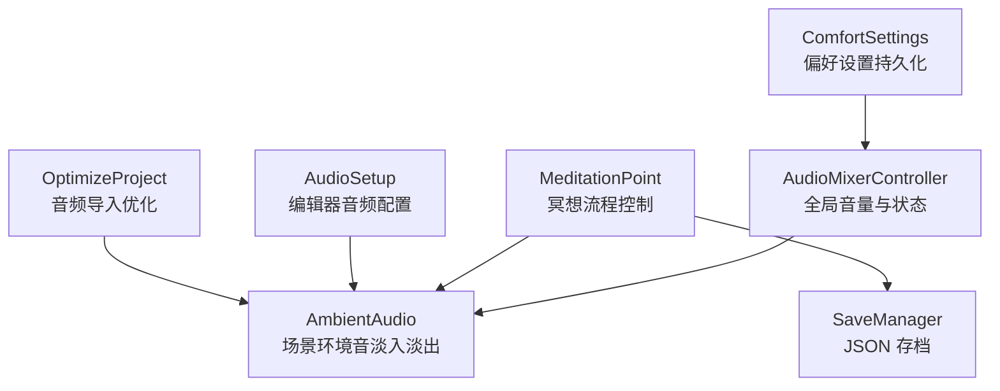
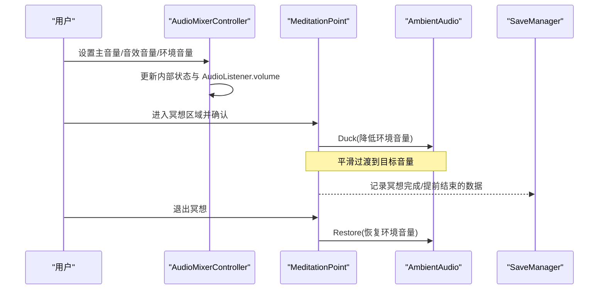
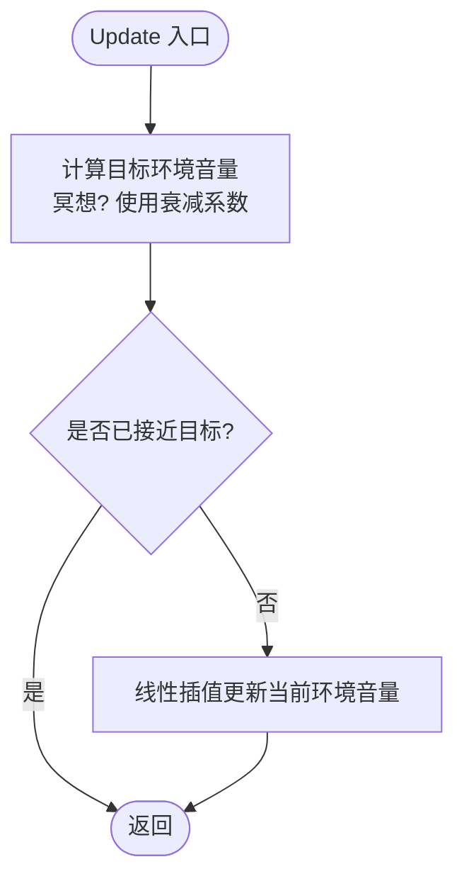
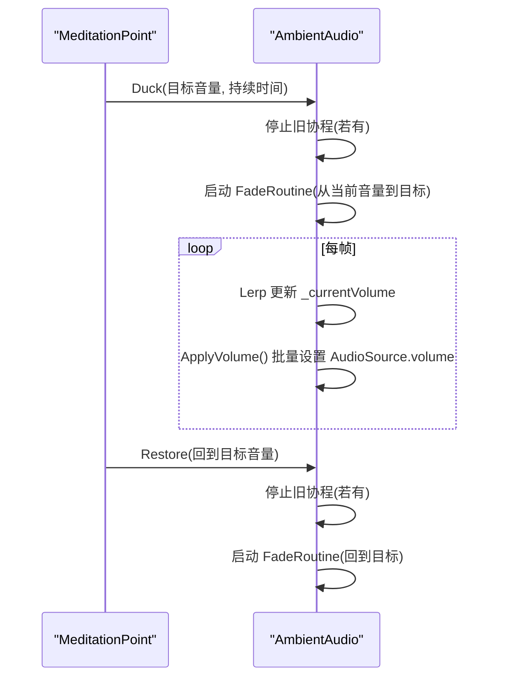
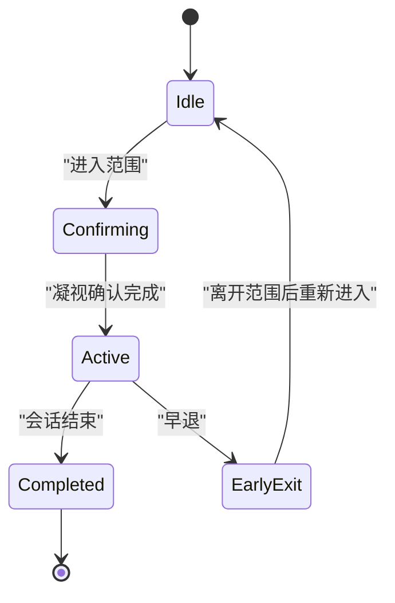
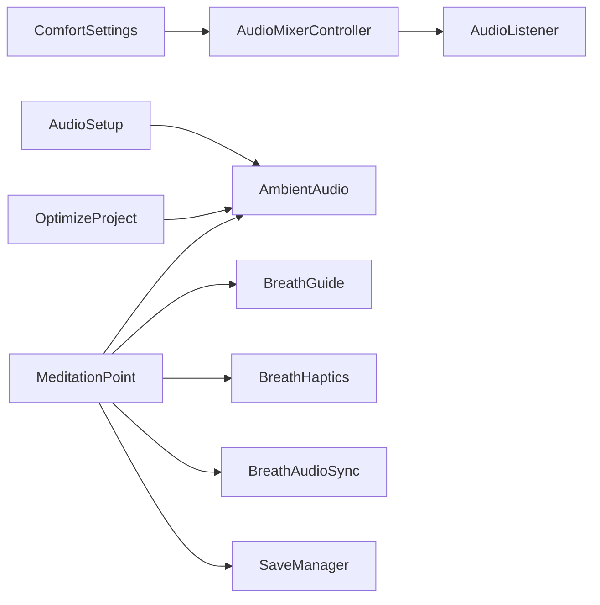

# 音频混合控制

<cite>
**本文引用的文件**
- [AudioMixerController.cs](file://Assets/Scripts/Core/AudioMixerController.cs)
- [AmbientAudio.cs](file://Assets/Scripts/Environment/AmbientAudio.cs)
- [MeditationPoint.cs](file://Assets/Scripts/Meditation/MeditationPoint.cs)
- [SaveManager.cs](file://Assets/Scripts/Data/SaveManager.cs)
- [ComfortSettings.cs](file://Assets/Scripts/Core/ComfortSettings.cs)
- [AudioSetup.cs](file://Assets/Editor/AudioSetup.cs)
- [OptimizeProject.cs](file://Assets/Editor/OptimizeProject.cs)
</cite>

## 目录
1. [简介](#简介)
2. [项目结构](#项目结构)
3. [核心组件](#核心组件)
4. [架构总览](#架构总览)
5. [详细组件分析](#详细组件分析)
6. [依赖关系分析](#依赖关系分析)
7. [性能考量](#性能考量)
8. [故障排查指南](#故障排查指南)
9. [结论](#结论)
10. [附录](#附录)

## 简介
本技术文档围绕 AudioMixerController 及其相关音频系统，系统化说明 Unity 音频混音器的封装与控制方式。当前实现聚焦于：
- 主音量、音效音量、环境音量的独立控制接口
- 冥想模式下的环境音淡入淡出与“避让”（ducking）机制
- 场景级环境音频的平滑过渡管理
- 用户设置持久化（通过 SaveManager 与 ComfortSettings）
- 编辑器辅助工具对音频资源的配置与优化建议

注意：当前代码未使用 Unity AudioMixer 对象本身，而是通过 AudioListener.volume 与 AudioSource.volume 进行集中式音量控制；未来可扩展为基于 AudioMixer 的参数化控制。

## 项目结构
与音频相关的核心脚本分布在以下位置：
- Core：AudioMixerController（全局音量与状态）、ComfortSettings（偏好设置持久化）
- Environment：AmbientAudio（场景环境音淡入淡出与避让）
- Meditation：MeditationPoint（触发冥想流程并协调音频避让）
- Data：SaveManager（JSON 存档，用于记录冥想数据与解锁进度）
- Editor：AudioSetup（批量为场景配置音频源）、OptimizeProject（音频资源导入优化）

图表来源
- [AudioMixerController.cs:10-65](file://Assets/Scripts/Core/AudioMixerController.cs#L10-L65)
- [AmbientAudio.cs:11-110](file://Assets/Scripts/Environment/AmbientAudio.cs#L11-L110)
- [MeditationPoint.cs:19-346](file://Assets/Scripts/Meditation/MeditationPoint.cs#L19-L346)
- [SaveManager.cs:13-116](file://Assets/Scripts/Data/SaveManager.cs#L13-L116)
- [ComfortSettings.cs:8-79](file://Assets/Scripts/Core/ComfortSettings.cs#L8-L79)
- [AudioSetup.cs:7-112](file://Assets/Editor/AudioSetup.cs#L7-L112)
- [OptimizeProject.cs:294-317](file://Assets/Editor/OptimizeProject.cs#L294-L317)

章节来源
- [AudioMixerController.cs:10-65](file://Assets/Scripts/Core/AudioMixerController.cs#L10-L65)
- [AmbientAudio.cs:11-110](file://Assets/Scripts/Environment/AmbientAudio.cs#L11-L110)
- [MeditationPoint.cs:19-346](file://Assets/Scripts/Meditation/MeditationPoint.cs#L19-L346)
- [SaveManager.cs:13-116](file://Assets/Scripts/Data/SaveManager.cs#L13-L116)
- [ComfortSettings.cs:8-79](file://Assets/Scripts/Core/ComfortSettings.cs#L8-L79)
- [AudioSetup.cs:7-112](file://Assets/Editor/AudioSetup.cs#L7-L112)
- [OptimizeProject.cs:294-317](file://Assets/Editor/OptimizeProject.cs#L294-L317)

## 核心组件
- AudioMixerController：提供主音量、音效音量、环境音量控制；在 Update 中根据是否处于冥想模式计算目标环境音量，并使用线性插值平滑过渡；避免空闲时持续计算以提升性能。
- AmbientAudio：管理场景内多个环境 AudioSource 的淡入淡出与避让（Duck/Restore），支持取消正在进行的协程以避免冲突。
- MeditationPoint：负责冥想流程的生命周期，进入冥想时调用环境音避让，结束时恢复；同时绑定呼吸引导、粒子、触觉与音频同步等反馈。
- SaveManager：以 JSON 形式持久化冥想记录、累计时长、解锁进度等数据；提供加载、保存、清理等方法。
- ComfortSettings：通过 PlayerPrefs 持久化 VR 舒适度设置（移动速度、转向角度、晕影、坐姿、触觉等），每次写入后立即保存。
- AudioSetup：编辑器工具，为指定场景批量创建 AudioRoot、环境音源、呼吸音源、脚步声源，并连接至相应控制器。
- OptimizeProject：编辑器优化脚本，自动发现音频资源并按类型设置导入参数（如长循环环境音采用流式加载，短促音效保持解压以减少播放卡顿）。

章节来源
- [AudioMixerController.cs:10-65](file://Assets/Scripts/Core/AudioMixerController.cs#L10-L65)
- [AmbientAudio.cs:11-110](file://Assets/Scripts/Environment/AmbientAudio.cs#L11-L110)
- [MeditationPoint.cs:19-346](file://Assets/Scripts/Meditation/MeditationPoint.cs#L19-L346)
- [SaveManager.cs:13-116](file://Assets/Scripts/Data/SaveManager.cs#L13-L116)
- [ComfortSettings.cs:8-79](file://Assets/Scripts/Core/ComfortSettings.cs#L8-L79)
- [AudioSetup.cs:7-112](file://Assets/Editor/AudioSetup.cs#L7-L112)
- [OptimizeProject.cs:294-317](file://Assets/Editor/OptimizeProject.cs#L294-L317)

## 架构总览
下图展示了运行时音频控制的关键交互：
- 外部调用通过 AudioMixerController 设置主音量或切换冥想模式
- MeditationPoint 在冥想开始/结束时驱动环境音避让与恢复
- AmbientAudio 统一管理多环境源的淡入淡出与避让
- SaveManager 与 ComfortSettings 负责数据与设置的持久化

图表来源
- [AudioMixerController.cs:26-65](file://Assets/Scripts/Core/AudioMixerController.cs#L26-L65)
- [MeditationPoint.cs:213-321](file://Assets/Scripts/Meditation/MeditationPoint.cs#L213-L321)
- [AmbientAudio.cs:20-110](file://Assets/Scripts/Environment/AmbientAudio.cs#L20-L110)
- [SaveManager.cs:59-66](file://Assets/Scripts/Data/SaveManager.cs#L59-L66)

## 详细组件分析

### AudioMixerController：全局音量与状态管理
- 职责
  - 维护主音量、音效音量、环境音量以及冥想模式标志
  - 在 Update 中计算目标环境音量并进行平滑过渡
  - 提供 SetMasterVolume、SetSFXVolume、SetAmbientVolume、SetMeditationMode 等接口
- 关键行为
  - Start 初始化当前环境音量并设置 AudioListener.volume
  - Update 中若已到达目标则跳过后续计算，减少空转开销
  - 冥想模式下将环境音量乘以衰减系数，形成“避让”效果
- 复杂度与性能
  - 每帧 O(1) 计算，仅在偏离目标时执行 Lerp
  - 通过近似相等判断避免无意义的重复赋值

图表来源
- [AudioMixerController.cs:32-43](file://Assets/Scripts/Core/AudioMixerController.cs#L32-L43)

章节来源
- [AudioMixerController.cs:10-65](file://Assets/Scripts/Core/AudioMixerController.cs#L10-L65)

### AmbientAudio：场景环境音淡入淡出与避让
- 职责
  - 管理一组环境 AudioSource 的统一音量控制
  - 提供 FadeTo、Duck、Restore、FadeOutAndStop 等接口
  - 使用协程实现平滑过渡，并在必要时取消旧协程避免冲突
- 关键行为
  - Start 时播放所有环境源并淡入到目标音量
  - Duck 降低音量（例如冥想期间），Restore 恢复到目标音量
  - ApplyVolume 遍历数组批量设置音量，确保一致性
- 复杂度与性能
  - 协程按时间步推进，每帧 Lerp 并应用音量，O(n) 其中 n 为环境源数量
  - 通过停止旧协程避免多段淡入淡出叠加导致的抖动

图表来源
- [AmbientAudio.cs:20-110](file://Assets/Scripts/Environment/AmbientAudio.cs#L20-L110)
- [MeditationPoint.cs:213-321](file://Assets/Scripts/Meditation/MeditationPoint.cs#L213-L321)

章节来源
- [AmbientAudio.cs:11-110](file://Assets/Scripts/Environment/AmbientAudio.cs#L11-L110)
- [MeditationPoint.cs:213-321](file://Assets/Scripts/Meditation/MeditationPoint.cs#L213-L321)

### MeditationPoint：冥想流程与音频联动
- 职责
  - 处理玩家进入冥想区域的 gaze 确认、会话计时、早退逻辑
  - 在冥想开始/结束时与环境音协作（Duck/Restore）
  - 绑定呼吸视觉、粒子、触觉与音频同步，并记录冥想数据
- 关键行为
  - Start 时查找 AmbientAudio 或备用 AudioSource，并准备呼吸引导
  - UpdateMeditation 驱动呼吸可视化与计时
  - CompleteMeditation/CancelMeditation 记录数据并解锁场景
- 复杂度与性能
  - 每帧更新呼吸进度与 UI，O(1)
  - 事件驱动的环境音避让，避免频繁操作

图表来源
- [MeditationPoint.cs:101-166](file://Assets/Scripts/Meditation/MeditationPoint.cs#L101-L166)
- [MeditationPoint.cs:213-341](file://Assets/Scripts/Meditation/MeditationPoint.cs#L213-L341)

章节来源
- [MeditationPoint.cs:19-346](file://Assets/Scripts/Meditation/MeditationPoint.cs#L19-L346)

### SaveManager：数据持久化
- 职责
  - 以 JSON 格式存储冥想记录、累计时长、解锁进度、每日打卡等
  - 提供 Load/Save/AddMeditationRecord/UnlockScene 等方法
- 关键行为
  - 读取/写入 Application.persistentDataPath 下的固定文件名
  - 异常捕获并记录错误日志，保证健壮性
- 复杂度与性能
  - I/O 操作集中在 Save/Load，频率较低
  - 列表追加与序列化开销可控

章节来源
- [SaveManager.cs:13-116](file://Assets/Scripts/Data/SaveManager.cs#L13-L116)

### ComfortSettings：偏好设置持久化
- 职责
  - 通过 PlayerPrefs 持久化 VR 舒适度相关设置
  - 每次写入立即保存，防止后台被杀导致设置丢失
- 关键行为
  - 提供 MoveSpeed、TurnAngle、VignetteEnabled、SeatedMode、HapticsEnabled 等属性
  - ApplySeatedMode 动态调整 XR Origin 高度

章节来源
- [ComfortSettings.cs:8-79](file://Assets/Scripts/Core/ComfortSettings.cs#L8-L79)

### AudioSetup：编辑器音频配置
- 职责
  - 为指定场景批量创建 AudioRoot、环境音源、呼吸音源、脚步声源
  - 自动连接 LocomotionController 的脚步声源与音频片段
- 关键行为
  - 打开场景并注入组件与引用
  - 设置空间化、音量、距离衰减等参数

章节来源
- [AudioSetup.cs:7-112](file://Assets/Editor/AudioSetup.cs#L7-L112)

### OptimizeProject：音频资源优化
- 职责
  - 扫描 Assets/Audio 下的 AudioClip，按类型设置导入参数
  - 长循环环境音采用流式加载，短促音效保持解压以减少播放延迟
- 关键行为
  - 识别路径包含 “ambience” 的资源并启用流式加载
  - 其他音效保持解码缓冲，提升即时播放性能

章节来源
- [OptimizeProject.cs:294-317](file://Assets/Editor/OptimizeProject.cs#L294-L317)

## 依赖关系分析
- AudioMixerController 依赖 UnityEngine.Audio（AudioListener）进行全局音量控制
- AmbientAudio 依赖 AudioSource 数组进行批量音量控制
- MeditationPoint 依赖 AmbientAudio 与 BreathGuide、BreathHaptics、BreathAudioSync 等组件
- SaveManager 与 ComfortSettings 分别负责 JSON 与 PlayerPrefs 的持久化
- AudioSetup 与 OptimizeProject 为编辑器阶段工具，不直接参与运行时逻辑

图表来源
- [AudioMixerController.cs:26-65](file://Assets/Scripts/Core/AudioMixerController.cs#L26-L65)
- [AmbientAudio.cs:20-110](file://Assets/Scripts/Environment/AmbientAudio.cs#L20-L110)
- [MeditationPoint.cs:66-99](file://Assets/Scripts/Meditation/MeditationPoint.cs#L66-L99)
- [SaveManager.cs:29-57](file://Assets/Scripts/Data/SaveManager.cs#L29-L57)
- [ComfortSettings.cs:25-35](file://Assets/Scripts/Core/ComfortSettings.cs#L25-L35)
- [AudioSetup.cs:37-102](file://Assets/Editor/AudioSetup.cs#L37-L102)
- [OptimizeProject.cs:294-317](file://Assets/Editor/OptimizeProject.cs#L294-L317)

章节来源
- [AudioMixerController.cs:26-65](file://Assets/Scripts/Core/AudioMixerController.cs#L26-L65)
- [AmbientAudio.cs:20-110](file://Assets/Scripts/Environment/AmbientAudio.cs#L20-L110)
- [MeditationPoint.cs:66-99](file://Assets/Scripts/Meditation/MeditationPoint.cs#L66-L99)
- [SaveManager.cs:29-57](file://Assets/Scripts/Data/SaveManager.cs#L29-L57)
- [ComfortSettings.cs:25-35](file://Assets/Scripts/Core/ComfortSettings.cs#L25-L35)
- [AudioSetup.cs:37-102](file://Assets/Editor/AudioSetup.cs#L37-L102)
- [OptimizeProject.cs:294-317](file://Assets/Editor/OptimizeProject.cs#L294-L317)

## 性能考量
- 批处理音量更新
  - AmbientAudio.ApplyVolume 一次性遍历并设置所有环境源音量，避免逐帧分散调用
- 平滑过渡与防抖
  - AudioMixerController 使用 Mathf.Lerp 与近似相等判断，避免无意义更新
  - AmbientAudio 通过协程取消机制避免多段淡入淡出冲突
- 资源预加载与导入优化
  - OptimizeProject 将长循环环境音设为流式加载，减少内存占用
  - 短促音效保持解压，避免播放时的解码停顿
- 运行时开销控制
  - AudioMixerController 在达到目标后跳过后续计算，降低空闲帧成本
  - MeditationPoint 的事件驱动逻辑减少不必要的每帧操作

[本节为通用性能指导，无需特定文件来源]

## 故障排查指南
- 环境音未在冥想时避让
  - 检查 MeditationPoint.Start 是否正确找到 AmbientAudio 或备用 AudioSource
  - 确认 Duck/Restore 调用链路与持续时间设置合理
- 音量突变或抖动
  - 检查是否存在多段协程同时运行导致冲突（AmbientAudio 应停止旧协程）
  - 确认 AudioMixerController.Update 中的目标计算与 Lerp 参数合理
- 设置未持久化
  - 确认 ComfortSettings 每次写入后调用 Save
  - 检查 SaveManager 的文件路径与权限，查看异常日志
- 编辑器配置失败
  - 确认 AudioSetup 能正确打开场景并找到所需资源
  - 验证 LocomotionController 的连接是否成功

章节来源
- [MeditationPoint.cs:66-99](file://Assets/Scripts/Meditation/MeditationPoint.cs#L66-L99)
- [AmbientAudio.cs:50-78](file://Assets/Scripts/Environment/AmbientAudio.cs#L50-L78)
- [AudioMixerController.cs:32-43](file://Assets/Scripts/Core/AudioMixerController.cs#L32-L43)
- [ComfortSettings.cs:25-35](file://Assets/Scripts/Core/ComfortSettings.cs#L25-L35)
- [SaveManager.cs:29-57](file://Assets/Scripts/Data/SaveManager.cs#L29-L57)
- [AudioSetup.cs:26-106](file://Assets/Editor/AudioSetup.cs#L26-L106)

## 结论
当前音频系统以 AudioMixerController 为中心，结合 AmbientAudio 的场景级淡入淡出与 MeditationPoint 的流程控制，实现了稳定的环境音避让与平滑过渡。通过 SaveManager 与 ComfortSettings 完成数据与设置的持久化，配合编辑器工具完成音频资源的高效配置与优化。未来可考虑引入 Unity AudioMixer 以实现更细粒度的分组与效果链控制，进一步提升系统的扩展性与可维护性。

[本节为总结性内容，无需特定文件来源]

## 附录
- 实时参数调整机制
  - 主音量：通过 AudioListener.volume 直接设置
  - 环境音量：通过 AmbientAudio 的协程淡入淡出与避让机制实现
  - 音效音量：预留 SetSFXVolume 接口，便于后续接入具体音效源
- 音频效果链与动态切换
  - 当前未使用 AudioMixer 组与效果器；可在未来扩展为基于 AudioMixerGroup 的动态切换（如重低音、均衡器）
- 音频状态管理
  - 通过 AudioMixerController 的内部状态（_inMeditation、_currentAmbientVolume）跟踪当前激活的音频组与控制逻辑
- 序列化保存与加载
  - SaveManager 负责冥想记录与解锁进度的 JSON 持久化
  - ComfortSettings 负责 VR 舒适度设置的 PlayerPrefs 持久化
- 性能优化技巧
  - 批处理音量更新（AmbientAudio.ApplyVolume）
  - 平滑过渡与防抖（Lerp + 近似相等判断 + 协程取消）
  - 资源预加载与导入优化（OptimizeProject 流式加载与解压策略）

[本节为补充信息，无需特定文件来源]