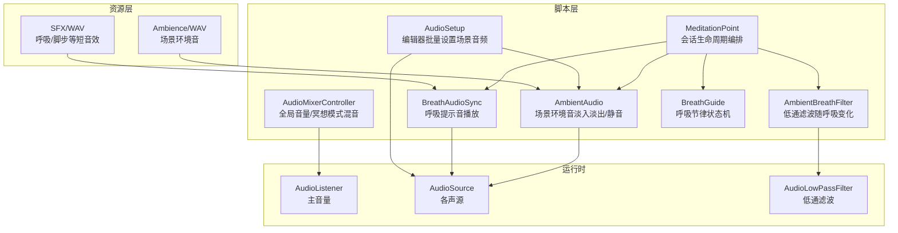
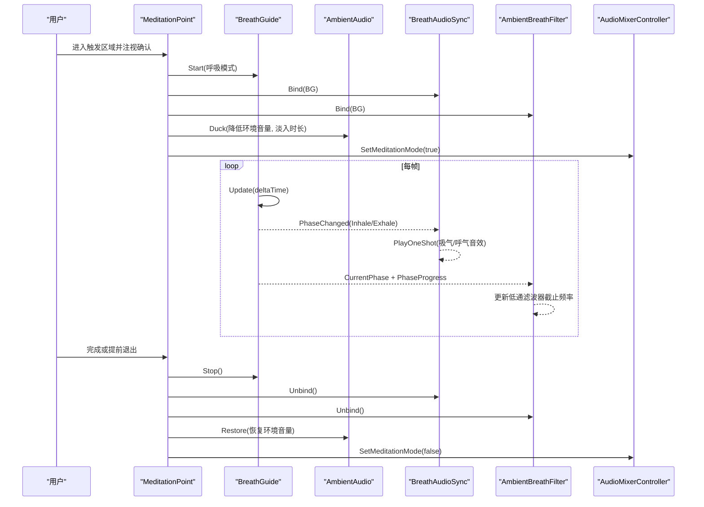
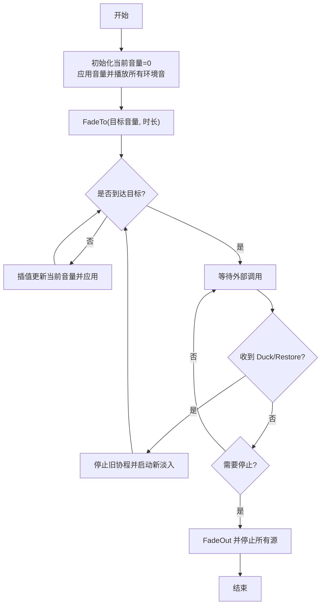
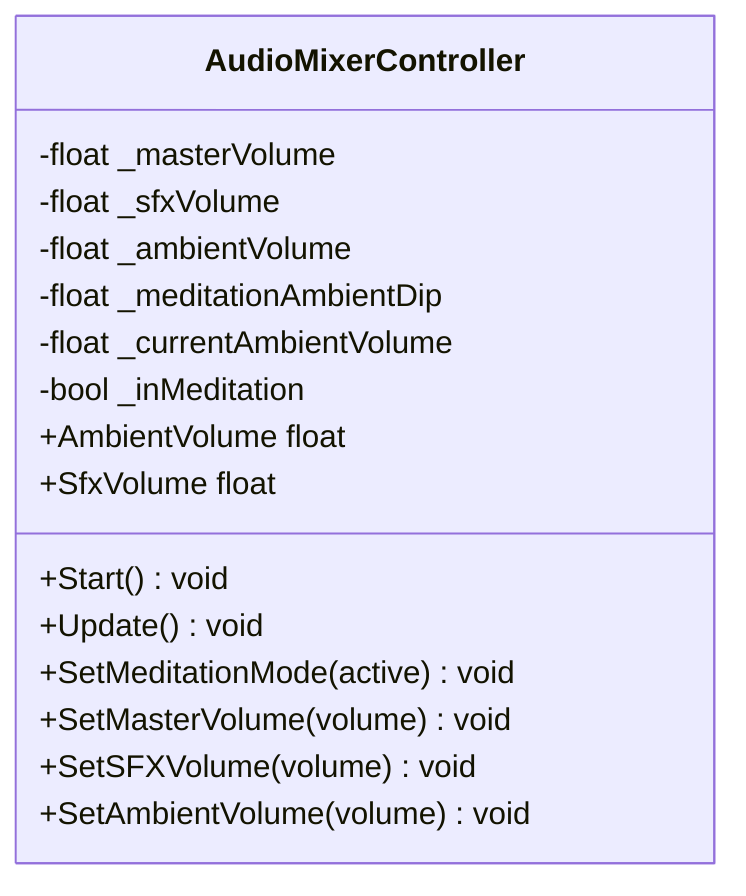
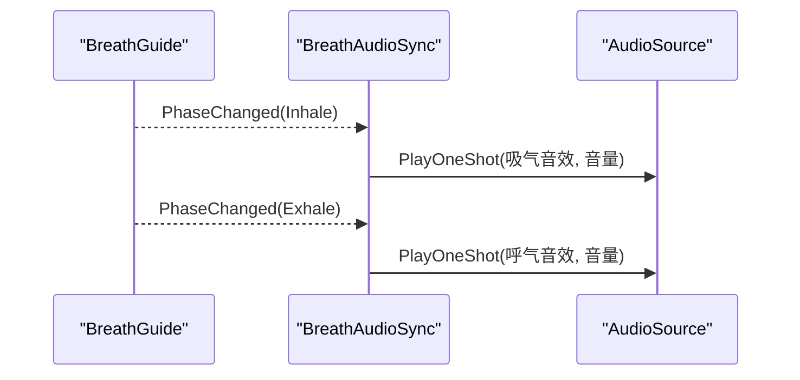
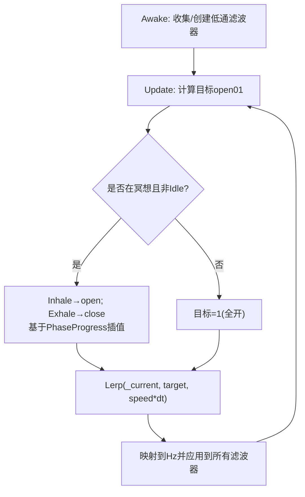
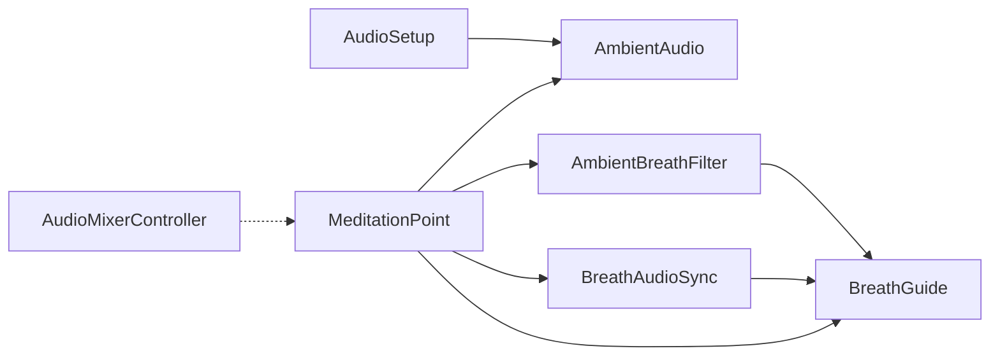

# 音频系统

<cite>
**本文引用的文件**
- [AmbientAudio.cs](file://Assets/Scripts/Environment/AmbientAudio.cs)
- [AudioMixerController.cs](file://Assets/Scripts/Core/AudioMixerController.cs)
- [BreathAudioSync.cs](file://Assets/Scripts/Environment/BreathAudioSync.cs)
- [AmbientBreathFilter.cs](file://Assets/Scripts/Environment/AmbientBreathFilter.cs)
- [BreathGuide.cs](file://Assets/Scripts/Meditation/BreathGuide.cs)
- [MeditationPoint.cs](file://Assets/Scripts/Meditation/MeditationPoint.cs)
- [AudioSetup.cs](file://Assets/Editor/AudioSetup.cs)
- [AudioManager.asset](file://ProjectSettings/AudioManager.asset)
- [ambience_bamboo.wav.meta](file://Assets/Audio/Ambience/ambience_bamboo.wav.meta)
- [ambience_waterfall.wav.meta](file://Assets/Audio/Ambience/ambience_waterfall.wav.meta)
- [ambience_pavilion.wav.meta](file://Assets/Audio/Ambience/ambience_pavilion.wav.meta)
- [ambience_summit.wav.meta](file://Assets/Audio/Ambience/ambience_summit.wav.meta)
- [breath_inhale.wav.meta](file://Assets/Audio/SFX/breath_inhale.wav.meta)
- [breath_exhale.wav.meta](file://Assets/Audio/SFX/breath_exhale.wav.meta)
</cite>

## 目录
1. [简介](#简介)
2. [项目结构](#项目结构)
3. [核心组件](#核心组件)
4. [架构总览](#架构总览)
5. [详细组件分析](#详细组件分析)
6. [依赖关系分析](#依赖关系分析)
7. [性能与内存管理](#性能与内存管理)
8. [故障排查指南](#故障排查指南)
9. [结论](#结论)
10. [附录：自定义音效与效果集成](#附录自定义音效与效果集成)

## 简介
本技术文档围绕 InkRidge 的音频系统展开，重点说明以下能力：
- AmbientAudio 的场景环境音效管理与淡入淡出、静音（ducking）控制。
- AudioMixerController 的全局音量与冥想模式下的动态混音。
- BreathAudioSync 的呼吸同步机制，将呼吸节奏与环境音效时间对齐。
- AmbientBreathFilter 的低通滤波随呼吸开合，形成“世界呼吸”的空间听感。
- 音频资源组织、压缩格式选择与内存策略。
- 性能优化建议（流式加载、静音检测、空间音频处理）。
- 自定义音效与音频效果的集成方式。

## 项目结构
InkRidge 的音频相关代码主要分布在 Environment、Core、Meditation 三个命名空间下，配合 Editor 工具进行场景级音频初始化；音频资源按 Ambience、SFX 分类存放，并通过 .meta 配置导入参数。

图表来源
- [AmbientAudio.cs:1-112](file://Assets/Scripts/Environment/AmbientAudio.cs#L1-L112)
- [AudioMixerController.cs:1-67](file://Assets/Scripts/Core/AudioMixerController.cs#L1-L67)
- [BreathAudioSync.cs:1-75](file://Assets/Scripts/Environment/BreathAudioSync.cs#L1-L75)
- [AmbientBreathFilter.cs:1-89](file://Assets/Scripts/Environment/AmbientBreathFilter.cs#L1-L89)
- [BreathGuide.cs:1-173](file://Assets/Scripts/Meditation/BreathGuide.cs#L1-L173)
- [MeditationPoint.cs:1-346](file://Assets/Scripts/Meditation/MeditationPoint.cs#L1-L346)
- [AudioSetup.cs:1-112](file://Assets/Editor/AudioSetup.cs#L1-L112)

章节来源
- [AmbientAudio.cs:1-112](file://Assets/Scripts/Environment/AmbientAudio.cs#L1-L112)
- [AudioMixerController.cs:1-67](file://Assets/Scripts/Core/AudioMixerController.cs#L1-L67)
- [BreathAudioSync.cs:1-75](file://Assets/Scripts/Environment/BreathAudioSync.cs#L1-L75)
- [AmbientBreathFilter.cs:1-89](file://Assets/Scripts/Environment/AmbientBreathFilter.cs#L1-L89)
- [BreathGuide.cs:1-173](file://Assets/Scripts/Meditation/BreathGuide.cs#L1-L173)
- [MeditationPoint.cs:1-346](file://Assets/Scripts/Meditation/MeditationPoint.cs#L1-L346)
- [AudioSetup.cs:1-112](file://Assets/Editor/AudioSetup.cs#L1-L112)

## 核心组件
- AmbientAudio：管理每个场景的环境音源数组，提供淡入淡出、静音（ducking）、恢复与停止流程。
- AudioMixerController：集中控制主音量、SFX 音量、环境音量，并在冥想模式下动态降低环境音量。
- BreathAudioSync：订阅呼吸阶段事件，在吸气/呼气时播放对应短音效，保持 2D 定位避免声像偏移。
- AmbientBreathFilter：为场景内所有环境音源附加低通滤波器，随呼吸阶段平滑调节截止频率，营造“世界呼吸”的听感。
- BreathGuide：非 MonoBehaviour 的呼吸节律控制器，驱动视觉与音频/触觉反馈。
- MeditationPoint：冥想会话的生命周期编排者，协调上述组件的绑定与解绑、环境音静音与恢复。
- AudioSetup：编辑器工具，为四个场景批量创建音频根节点、环境音源、呼吸音源与脚步声源，并连接至相应组件。

章节来源
- [AmbientAudio.cs:1-112](file://Assets/Scripts/Environment/AmbientAudio.cs#L1-L112)
- [AudioMixerController.cs:1-67](file://Assets/Scripts/Core/AudioMixerController.cs#L1-L67)
- [BreathAudioSync.cs:1-75](file://Assets/Scripts/Environment/BreathAudioSync.cs#L1-L75)
- [AmbientBreathFilter.cs:1-89](file://Assets/Scripts/Environment/AmbientBreathFilter.cs#L1-L89)
- [BreathGuide.cs:1-173](file://Assets/Scripts/Meditation/BreathGuide.cs#L1-L173)
- [MeditationPoint.cs:1-346](file://Assets/Scripts/Meditation/MeditationPoint.cs#L1-L346)
- [AudioSetup.cs:1-112](file://Assets/Editor/AudioSetup.cs#L1-L112)

## 架构总览
下图展示了从用户进入冥想点到环境音与呼吸提示音协同工作的整体流程。

图表来源
- [MeditationPoint.cs:213-321](file://Assets/Scripts/Meditation/MeditationPoint.cs#L213-L321)
- [BreathGuide.cs:54-147](file://Assets/Scripts/Meditation/BreathGuide.cs#L54-L147)
- [BreathAudioSync.cs:33-72](file://Assets/Scripts/Environment/BreathAudioSync.cs#L33-L72)
- [AmbientBreathFilter.cs:30-86](file://Assets/Scripts/Environment/AmbientBreathFilter.cs#L30-L86)
- [AudioMixerController.cs:26-64](file://Assets/Scripts/Core/AudioMixerController.cs#L26-L64)

## 详细组件分析

### AmbientAudio：场景环境音效管理
- 职责：维护一组 AudioSource 作为场景环境音，统一控制淡入淡出、静音（ducking）与停止。
- 关键行为：
  - Start 时将所有环境音源播放，并以目标音量淡入。
  - Duck/Restore 通过协程平滑过渡到指定音量，避免多段淡入冲突。
  - FadeOutAndStop 在退出时淡出并停止所有环境音源。
- 设计要点：
  - 使用内部 _currentVolume 与协程保证同一时刻只有一个淡入/淡出生效。
  - ApplyVolume 遍历数组统一赋值，简化多源同步。

图表来源
- [AmbientAudio.cs:20-109](file://Assets/Scripts/Environment/AmbientAudio.cs#L20-L109)

章节来源
- [AmbientAudio.cs:1-112](file://Assets/Scripts/Environment/AmbientAudio.cs#L1-L112)

### AudioMixerController：音频混合器与音量控制
- 职责：统一管理主音量、SFX 音量与环境音量；在冥想模式下动态降低环境音量。
- 关键行为：
  - Start 初始化当前环境音量并设置主音量。
  - Update 中根据冥想模式计算目标环境音量，并使用 Lerp 平滑过渡；当收敛后跳过后续计算以节省开销。
  - 提供 SetMeditationMode/SetMasterVolume/SetSFXVolume/SetAmbientVolume 接口。
- 设计要点：
  - 使用近似相等判断避免无意义的逐帧更新。
  - 冥想模式仅影响环境音量，不改变主音量与 SFX 音量。

图表来源
- [AudioMixerController.cs:1-67](file://Assets/Scripts/Core/AudioMixerController.cs#L1-L67)

章节来源
- [AudioMixerController.cs:1-67](file://Assets/Scripts/Core/AudioMixerController.cs#L1-L67)

### BreathAudioSync：呼吸提示音同步
- 职责：订阅呼吸阶段事件，在吸气/呼气时播放对应的短音效。
- 关键行为：
  - Awake 获取 AudioSource 并设置为 2D（spatialBlend=0），关闭循环，设置初始音量。
  - Bind/Unbind 管理对 BreathGuide.PhaseChanged 的订阅。
  - OnPhaseChanged 根据阶段播放对应 AudioClip，Hold 阶段保持静音。
- 设计要点：
  - 使用 PlayOneShot 实现即时播放，避免与循环冲突。
  - 2D 播放确保呼吸提示不受空间声像影响。

图表来源
- [BreathAudioSync.cs:25-72](file://Assets/Scripts/Environment/BreathAudioSync.cs#L25-L72)
- [BreathGuide.cs:54-147](file://Assets/Scripts/Meditation/BreathGuide.cs#L54-L147)

章节来源
- [BreathAudioSync.cs:1-75](file://Assets/Scripts/Environment/BreathAudioSync.cs#L1-L75)
- [BreathGuide.cs:1-173](file://Assets/Scripts/Meditation/BreathGuide.cs#L1-L173)

### AmbientBreathFilter：随呼吸变化的低通滤波
- 职责：为场景内所有环境音源添加/更新低通滤波器，使环境音随呼吸“开合”。
- 关键行为：
  - Awake 扫描子对象 AudioSource，若缺少 AudioLowPassFilter 则自动添加，并设置初始截止频率。
  - Update 根据 BreathGuide 当前阶段与进度计算目标 open01，平滑插值后应用到所有滤波器。
  - Unbind 时将滤波器恢复到完全打开状态。
- 设计要点：
  - 使用响应速度参数控制滤波器变化平滑度。
  - 仅在冥想进行中且非空闲阶段才调整滤波器，减少无效计算。

图表来源
- [AmbientBreathFilter.cs:42-86](file://Assets/Scripts/Environment/AmbientBreathFilter.cs#L42-L86)

章节来源
- [AmbientBreathFilter.cs:1-89](file://Assets/Scripts/Environment/AmbientBreathFilter.cs#L1-L89)

### MeditationPoint：会话编排与组件联动
- 职责：管理冥想会话生命周期，协调呼吸引导、环境音静音、呼吸提示音与滤波器的绑定/解绑。
- 关键行为：
  - Start 时查找或创建所需组件，缓存材质引用以减少开销。
  - Update 中根据会话状态推进呼吸节律、更新视觉环、处理退出逻辑。
  - StartMeditation 绑定呼吸引导到各反馈组件，并调用环境音 Duck。
  - EndSession 解绑并恢复环境音。
- 设计要点：
  - 优先使用场景中的 AmbientAudio，若无则回退到原始 AudioSource。
  - 支持提前退出并记录数据，同时允许重新进入。

章节来源
- [MeditationPoint.cs:1-346](file://Assets/Scripts/Meditation/MeditationPoint.cs#L1-L346)

### AudioSetup：编辑器批量音频初始化
- 职责：为四个场景批量创建音频根节点与环境音源、呼吸音源、脚步声源，并连接到相应组件。
- 关键行为：
  - 打开每个场景，创建或复用 AudioRoot。
  - 为每个场景创建 AmbientSource（3D、循环、对数衰减），并关联 AmbientAudio。
  - 创建 BreathSource（2D、非循环）与 FootstepSource（半空间化）。
  - 将脚步声源与片段注入到 LocomotionController。
- 设计要点：
  - 使用 SerializedObject 修改组件属性，避免手动拖拽。
  - 保存场景并输出日志便于调试。

章节来源
- [AudioSetup.cs:1-112](file://Assets/Editor/AudioSetup.cs#L1-L112)

## 依赖关系分析
- MeditationPoint 依赖 BreathGuide 驱动节律，并协调 AmbientAudio、BreathAudioSync、AmbientBreathFilter 的行为。
- BreathAudioSync 依赖 BreathGuide 的事件驱动，不主动轮询。
- AmbientBreathFilter 依赖 BreathGuide 的状态与进度，用于实时调制滤波器。
- AudioMixerController 独立于具体场景，负责全局音量与冥想模式切换。
- AudioSetup 在编辑器阶段构建场景音频拓扑，运行时由 AmbientAudio 接管。

图表来源
- [MeditationPoint.cs:213-321](file://Assets/Scripts/Meditation/MeditationPoint.cs#L213-L321)
- [BreathAudioSync.cs:33-72](file://Assets/Scripts/Environment/BreathAudioSync.cs#L33-L72)
- [AmbientBreathFilter.cs:30-86](file://Assets/Scripts/Environment/AmbientBreathFilter.cs#L30-L86)
- [AudioMixerController.cs:26-64](file://Assets/Scripts/Core/AudioMixerController.cs#L26-L64)
- [AudioSetup.cs:26-106](file://Assets/Editor/AudioSetup.cs#L26-L106)

章节来源
- [MeditationPoint.cs:1-346](file://Assets/Scripts/Meditation/MeditationPoint.cs#L1-L346)
- [BreathAudioSync.cs:1-75](file://Assets/Scripts/Environment/BreathAudioSync.cs#L1-L75)
- [AmbientBreathFilter.cs:1-89](file://Assets/Scripts/Environment/AmbientBreathFilter.cs#L1-L89)
- [AudioMixerController.cs:1-67](file://Assets/Scripts/Core/AudioMixerController.cs#L1-L67)
- [AudioSetup.cs:1-112](file://Assets/Editor/AudioSetup.cs#L1-L112)

## 性能与内存管理
- 音频资源组织
  - 环境音（Ambience）：长循环背景音，适合延迟加载（preloadAudioData=false），降低首屏内存占用。
  - 短音效（SFX）：呼吸提示音等短片段，适合预加载（preloadAudioData=true），避免播放卡顿。
  - 采样率统一为 44100Hz，压缩格式为 PCM（compressionFormat=1），质量 0.7，兼顾音质与体积。
- 内存策略
  - 环境音默认不预加载，按需加载；短音效预加载以保证即时响应。
  - 使用协程与插值避免频繁分配与 GC 压力。
  - 在 AudioMixerController 中，当音量收敛后跳过 Update 计算，减少 CPU 开销。
- 性能优化建议
  - 流式加载：对于更长的环境音或音乐，可考虑使用 Unity 的流式音频或 AssetBundle 分块加载，进一步降低峰值内存。
  - 静音检测：结合 AudioSource.isPlaying 与音量阈值，在不可见或非交互区域暂停非关键声音，释放 DSP 通道。
  - 空间音频处理：合理设置 minDistance/maxDistance 与 rolloffMode，避免过多 3D 声源造成定位计算负担；对提示音使用 2D 以避免不必要的空间化开销。
  - 滤波器批处理：AmbientBreathFilter 已批量更新所有低通滤波器，建议在场景中控制环境音源数量，避免过多滤波器实例。
  - 虚拟声源限制：参考 AudioManager 的 VirtualVoiceCount/RealVoiceCount 配置，控制并发声源上限，防止过载。

章节来源
- [ambience_bamboo.wav.meta:1-23](file://Assets/Audio/Ambience/ambience_bamboo.wav.meta#L1-L23)
- [ambience_waterfall.wav.meta:1-23](file://Assets/Audio/Ambience/ambience_waterfall.wav.meta#L1-L23)
- [ambience_pavilion.wav.meta:1-23](file://Assets/Audio/Ambience/ambience_pavilion.wav.meta#L1-L23)
- [ambience_summit.wav.meta:1-23](file://Assets/Audio/Ambience/ambience_summit.wav.meta#L1-L23)
- [breath_inhale.wav.meta:1-23](file://Assets/Audio/SFX/breath_inhale.wav.meta#L1-L23)
- [breath_exhale.wav.meta:1-23](file://Assets/Audio/SFX/breath_exhale.wav.meta#L1-L23)
- [AudioManager.asset:1-22](file://ProjectSettings/AudioManager.asset#L1-L22)
- [AudioMixerController.cs:26-43](file://Assets/Scripts/Core/AudioMixerController.cs#L26-L43)

## 故障排查指南
- 呼吸提示音未播放
  - 检查 BreathAudioSync 是否正确 Bind 到 BreathGuide，以及吸气/呼气 Clip 是否已赋值。
  - 确认 AudioSource 未被禁用，且 volume 不为 0。
  - 参考路径：[BreathAudioSync.cs:33-72](file://Assets/Scripts/Environment/BreathAudioSync.cs#L33-L72)
- 环境音未在冥想时降低
  - 检查 MeditationPoint 是否调用了 AmbientAudio.Duck 与 AudioMixerController.SetMeditationMode。
  - 确认场景中存在 AmbientAudio 组件或其回退 AudioSource。
  - 参考路径：[MeditationPoint.cs:213-232](file://Assets/Scripts/Meditation/MeditationPoint.cs#L213-L232)
- 低通滤波器无效
  - 确认 AmbientBreathFilter 已正确扫描子对象并添加 AudioLowPassFilter。
  - 检查 BreathGuide 当前阶段是否为 Idle，Idle 时滤波器会回到全开。
  - 参考路径：[AmbientBreathFilter.cs:42-86](file://Assets/Scripts/Environment/AmbientBreathFilter.cs#L42-L86)
- 场景音频未初始化
  - 使用编辑器菜单“Debug/Setup Audio in All Scenes”运行 AudioSetup，确保每个场景具备 AudioRoot 与必要声源。
  - 参考路径：[AudioSetup.cs:9-110](file://Assets/Editor/AudioSetup.cs#L9-L110)

章节来源
- [BreathAudioSync.cs:33-72](file://Assets/Scripts/Environment/BreathAudioSync.cs#L33-L72)
- [MeditationPoint.cs:213-232](file://Assets/Scripts/Meditation/MeditationPoint.cs#L213-L232)
- [AmbientBreathFilter.cs:42-86](file://Assets/Scripts/Environment/AmbientBreathFilter.cs#L42-L86)
- [AudioSetup.cs:9-110](file://Assets/Editor/AudioSetup.cs#L9-L110)

## 结论
InkRidge 的音频系统通过清晰的职责划分与事件驱动机制，实现了场景环境音的动态管理、冥想模式下的混音控制以及呼吸节奏与音效的时间对齐。AmbientAudio 提供稳定的淡入淡出与静音能力，AudioMixerController 负责全局音量与模式切换，BreathAudioSync 与 AmbientBreathFilter 共同构建了沉浸式的呼吸体验。配合合理的资源组织与性能优化策略，系统在 VR 平台上具备良好的稳定性与可扩展性。

## 附录：自定义音效与音频效果集成
- 新增环境音
  - 在 Assets/Audio/Ambience 下添加新的 WAV 文件，并在 .meta 中设置合适的采样率与压缩格式。
  - 使用 AudioSetup 扩展场景列表与对应音频路径，或在场景中手动添加 AmbientSource 并关联 AmbientAudio。
  - 参考路径：[AudioSetup.cs:12-57](file://Assets/Editor/AudioSetup.cs#L12-L57)
- 新增呼吸提示音
  - 在 Assets/Audio/SFX 下添加吸气/呼气音效，并在 BreathAudioSync 中赋值对应 Clip。
  - 确保 preloadAudioData=true 以获得即时播放体验。
  - 参考路径：[BreathAudioSync.cs:18-31](file://Assets/Scripts/Environment/BreathAudioSync.cs#L18-L31)
- 自定义音频效果链
  - 可在环境音源上添加更多 AudioEffect（如混响、延迟），并通过脚本统一控制参数。
  - 注意控制效果数量与复杂度，避免超出 DSP 预算。
  - 参考路径：[AudioManager.asset:11-20](file://ProjectSettings/AudioManager.asset#L11-L20)
- 空间音频与定位
  - 环境音建议使用 3D 声源并设置合理的距离衰减；提示音建议使用 2D 以避免声像干扰。
  - 可通过调整 spatialBlend、minDistance、maxDistance 与 rolloffMode 来优化听感与性能。
  - 参考路径：[AudioSetup.cs:37-52](file://Assets/Editor/AudioSetup.cs#L37-L52)