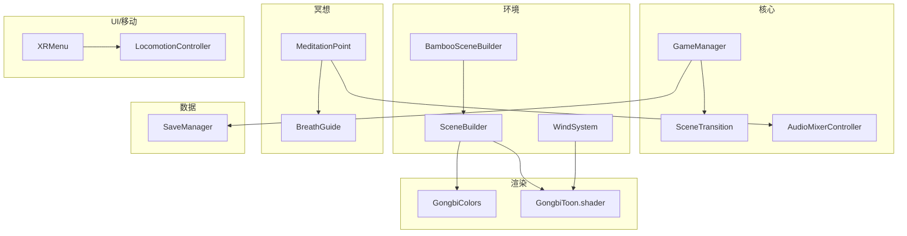
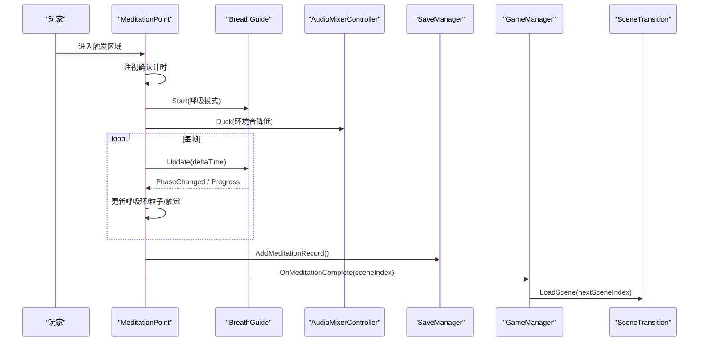
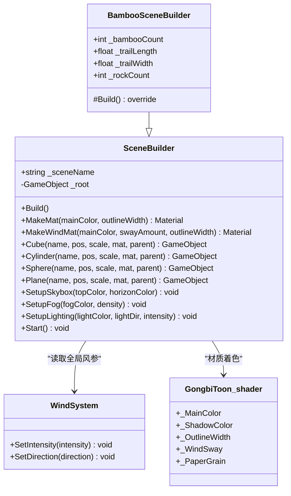
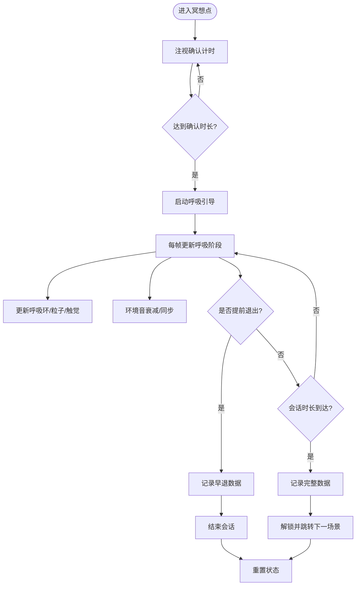
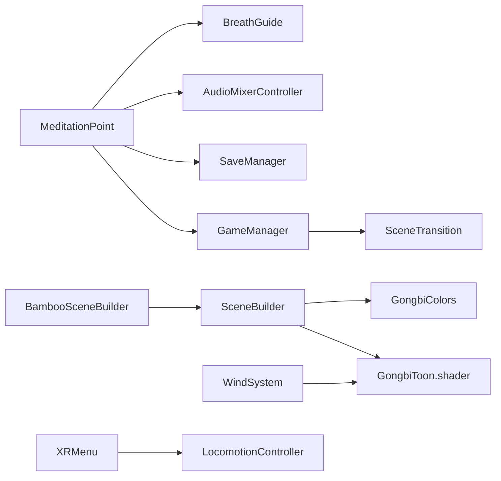

# 项目概述

<cite>
**本文引用的文件**
- [Assets/Scripts/Core/GameManager.cs](file://Assets/Scripts/Core/GameManager.cs)
- [Assets/Scripts/Core/SceneTransition.cs](file://Assets/Scripts/Core/SceneTransition.cs)
- [Assets/Scripts/Core/AudioMixerController.cs](file://Assets/Scripts/Core/AudioMixerController.cs)
- [Assets/Scripts/Data/SaveManager.cs](file://Assets/Scripts/Data/SaveManager.cs)
- [Assets/Scripts/Environment/SceneBuilder.cs](file://Assets/Scripts/Environment/SceneBuilder.cs)
- [Assets/Scripts/Environment/BambooSceneBuilder.cs](file://Assets/Scripts/Environment/BambooSceneBuilder.cs)
- [Assets/Scripts/Environment/WindSystem.cs](file://Assets/Scripts/Environment/WindSystem.cs)
- [Assets/Scripts/Meditation/MeditationPoint.cs](file://Assets/Scripts/Meditation/MeditationPoint.cs)
- [Assets/Scripts/Meditation/BreathGuide.cs](file://Assets/Scripts/Meditation/BreathGuide.cs)
- [Assets/Scripts/GongbiColors.cs](file://Assets/Scripts/GongbiColors.cs)
- [Assets/Shaders/GongbiToon.shader](file://Assets/Shaders/GongbiToon.shader)
- [Assets/Scripts/UI/XRMenu.cs](file://Assets/Scripts/UI/XRMenu.cs)
- [Assets/Scripts/Movement/LocomotionController.cs](file://Assets/Scripts/Movement/LocomotionController.cs)
</cite>

## 目录
1. [简介](#简介)
2. [项目结构](#项目结构)
3. [核心组件](#核心组件)
4. [架构总览](#架构总览)
5. [详细组件分析](#详细组件分析)
6. [依赖关系分析](#依赖关系分析)
7. [性能考量](#性能考量)
8. [故障排查指南](#故障排查指南)
9. [结论](#结论)
10. [附录](#附录)

## 简介
InkRidge 是一款基于中国传统工笔画风格的 VR 冥想体验，目标用户为希望在沉浸式环境中进行呼吸与正念练习的用户。项目以“多场景冥想旅程”为主线，通过“呼吸指导系统”提供可视化、可听化与触觉化的引导；以“传统艺术风格渲染”营造宣纸质感、墨线勾勒与矿物颜料色彩的视觉基调。技术栈采用 Unity 2022.3 LTS 与 XR Interaction Toolkit 3.x，面向 Meta Quest 3 平台优化。

关键概念：
- SceneBuilder 模式：运行时由基础几何体构建场景，统一使用 Gongbi 着色器与色彩体系，便于扩展新场景。
- Gongbi 着色器系统：实现工笔画的色阶、墨线轮廓、纸张纹理与风动效果。
- MeditationPoint 触发机制：玩家进入冥想点区域后，通过注视确认启动呼吸会话，支持提前退出与数据记录。

## 项目结构
项目遵循 Unity 标准资源组织方式，按功能域划分脚本与资源：
- Scripts/Core：全局状态、场景过渡、音频混音等基础设施
- Scripts/Environment：场景构建（SceneBuilder 派生）、环境特效（风、雾、光照）
- Scripts/Meditation：呼吸节奏、冥想触发、反馈绑定
- Scripts/UI：VR 内设置菜单
- Scripts/Movement：移动与转向配置
- Shaders：Gongbi 系列着色器（Toon、Skybox、Fog、Vignette 等）
- Scenes：编号场景（Start、Bamboo、Waterfall、Pavilion、Summit、End）
- Prefabs：预制体（环境、冥想、玩家等）
- Editor：编辑器工具脚本
- XR/XRI：XR 加载器与交互设置

图表来源
- [Assets/Scripts/Core/GameManager.cs:1-66](file://Assets/Scripts/Core/GameManager.cs#L1-L66)
- [Assets/Scripts/Core/SceneTransition.cs:1-61](file://Assets/Scripts/Core/SceneTransition.cs#L1-L61)
- [Assets/Scripts/Core/AudioMixerController.cs:1-67](file://Assets/Scripts/Core/AudioMixerController.cs#L1-L67)
- [Assets/Scripts/Environment/SceneBuilder.cs:1-223](file://Assets/Scripts/Environment/SceneBuilder.cs#L1-L223)
- [Assets/Scripts/Environment/BambooSceneBuilder.cs:1-198](file://Assets/Scripts/Environment/BambooSceneBuilder.cs#L1-L198)
- [Assets/Scripts/Environment/WindSystem.cs:1-79](file://Assets/Scripts/Environment/WindSystem.cs#L1-L79)
- [Assets/Scripts/Meditation/MeditationPoint.cs:1-346](file://Assets/Scripts/Meditation/MeditationPoint.cs#L1-L346)
- [Assets/Scripts/Meditation/BreathGuide.cs:1-173](file://Assets/Scripts/Meditation/BreathGuide.cs#L1-L173)
- [Assets/Scripts/GongbiColors.cs:1-72](file://Assets/Scripts/GongbiColors.cs#L1-L72)
- [Assets/Shaders/GongbiToon.shader:1-209](file://Assets/Shaders/GongbiToon.shader#L1-L209)
- [Assets/Scripts/UI/XRMenu.cs:1-172](file://Assets/Scripts/UI/XRMenu.cs#L1-L172)
- [Assets/Scripts/Movement/LocomotionController.cs:1-72](file://Assets/Scripts/Movement/LocomotionController.cs#L1-L72)

章节来源
- [Assets/Scripts/Core/GameManager.cs:1-66](file://Assets/Scripts/Core/GameManager.cs#L1-L66)
- [Assets/Scripts/Environment/SceneBuilder.cs:1-223](file://Assets/Scripts/Environment/SceneBuilder.cs#L1-L223)
- [Assets/Scripts/Meditation/MeditationPoint.cs:1-346](file://Assets/Scripts/Meditation/MeditationPoint.cs#L1-L346)

## 核心组件
- GameManager：全局单例，管理场景流程、行走时间统计与冥想完成后的下一场景跳转。
- SceneTransition：异步场景加载并配合 CanvasGroup 做淡入淡出过渡。
- AudioMixerController：统一管理主音量、音效、环境音，并在冥想期间降低环境音。
- SaveManager：本地 JSON 存储冥想记录、解锁进度、累计时间与每日打卡。
- SceneBuilder 及派生类：运行时构建场景几何、天空盒、光照、雾效，并进行静态合批优化。
- WindSystem：全局风场参数驱动植被顶点位移与颜色变化。
- MeditationPoint：触发冥想会话，处理注视确认、呼吸引导、早退与数据记录。
- BreathGuide：非 MonoBehaviour 的呼吸节奏控制器，驱动视觉、音频与触觉反馈。
- GongbiColors：传统矿物颜料配色表与阴影派生工具。
- GongbiToon.shader：工笔画风格着色器，包含色阶、墨线轮廓、纸张颗粒、背光与风动。
- XRMenu：VR 内设置面板，控制移动速度、转向角度、晕影、坐姿模式与触觉开关。
- LocomotionController：将 ComfortSettings 应用到移动与转向提供者，并播放脚步声。

章节来源
- [Assets/Scripts/Core/GameManager.cs:1-66](file://Assets/Scripts/Core/GameManager.cs#L1-L66)
- [Assets/Scripts/Core/SceneTransition.cs:1-61](file://Assets/Scripts/Core/SceneTransition.cs#L1-L61)
- [Assets/Scripts/Core/AudioMixerController.cs:1-67](file://Assets/Scripts/Core/AudioMixerController.cs#L1-L67)
- [Assets/Scripts/Data/SaveManager.cs:1-118](file://Assets/Scripts/Data/SaveManager.cs#L1-L118)
- [Assets/Scripts/Environment/SceneBuilder.cs:1-223](file://Assets/Scripts/Environment/SceneBuilder.cs#L1-L223)
- [Assets/Scripts/Environment/WindSystem.cs:1-79](file://Assets/Scripts/Environment/WindSystem.cs#L1-L79)
- [Assets/Scripts/Meditation/MeditationPoint.cs:1-346](file://Assets/Scripts/Meditation/MeditationPoint.cs#L1-L346)
- [Assets/Scripts/Meditation/BreathGuide.cs:1-173](file://Assets/Scripts/Meditation/BreathGuide.cs#L1-L173)
- [Assets/Scripts/GongbiColors.cs:1-72](file://Assets/Scripts/GongbiColors.cs#L1-L72)
- [Assets/Shaders/GongbiToon.shader:1-209](file://Assets/Shaders/GongbiToon.shader#L1-L209)
- [Assets/Scripts/UI/XRMenu.cs:1-172](file://Assets/Scripts/UI/XRMenu.cs#L1-L172)
- [Assets/Scripts/Movement/LocomotionController.cs:1-72](file://Assets/Scripts/Movement/LocomotionController.cs#L1-L72)

## 架构总览
InkRidge 的核心循环围绕“场景构建—冥想触发—呼吸引导—数据持久化—场景切换”展开。SceneBuilder 负责在运行时生成符合工笔画风格的场景元素；MeditationPoint 监听玩家进入触发区，通过注视确认启动 BreathGuide；BreathGuide 驱动视觉环、音频同步与触觉反馈；完成后由 SaveManager 记录数据并通过 GameManager 切换到下一场景或结束场景。

图表来源
- [Assets/Scripts/Meditation/MeditationPoint.cs:1-346](file://Assets/Scripts/Meditation/MeditationPoint.cs#L1-L346)
- [Assets/Scripts/Meditation/BreathGuide.cs:1-173](file://Assets/Scripts/Meditation/BreathGuide.cs#L1-L173)
- [Assets/Scripts/Core/AudioMixerController.cs:1-67](file://Assets/Scripts/Core/AudioMixerController.cs#L1-L67)
- [Assets/Scripts/Data/SaveManager.cs:1-118](file://Assets/Scripts/Data/SaveManager.cs#L1-L118)
- [Assets/Scripts/Core/GameManager.cs:1-66](file://Assets/Scripts/Core/GameManager.cs#L1-L66)
- [Assets/Scripts/Core/SceneTransition.cs:1-61](file://Assets/Scripts/Core/SceneTransition.cs#L1-L61)

## 详细组件分析

### 场景构建与渲染管线（SceneBuilder + Gongbi 着色器）
- 运行时构建：SceneBuilder 创建根节点，提供 MakeMat/MakeWindMat 等方法，统一应用 Gongbi/Toon 材质与配色。
- 天空盒与光照：SetupSkybox 使用 Gongbi/InkSkybox，Trilight 环境光模拟天顶、地平线与地面反弹；SetupLighting 禁用实时阴影以降低 VR 移动端开销。
- 静态合批：对运行时生成的 MeshRenderer 进行合并，减少绘制调用；动态网格标记 IDynamicMeshRenderer 不参与合批。
- 装饰物优化：Decorative 移除无交互的 Collider，避免不必要的物理计算。
- 风动：WindSystem 设置全局风参，GongbiToon 在顶点阶段根据高度与时间产生摆动。

图表来源
- [Assets/Scripts/Environment/SceneBuilder.cs:1-223](file://Assets/Scripts/Environment/SceneBuilder.cs#L1-L223)
- [Assets/Scripts/Environment/BambooSceneBuilder.cs:1-198](file://Assets/Scripts/Environment/BambooSceneBuilder.cs#L1-L198)
- [Assets/Scripts/Environment/WindSystem.cs:1-79](file://Assets/Scripts/Environment/WindSystem.cs#L1-L79)
- [Assets/Shaders/GongbiToon.shader:1-209](file://Assets/Shaders/GongbiToon.shader#L1-L209)

章节来源
- [Assets/Scripts/Environment/SceneBuilder.cs:1-223](file://Assets/Scripts/Environment/SceneBuilder.cs#L1-L223)
- [Assets/Scripts/Environment/BambooSceneBuilder.cs:1-198](file://Assets/Scripts/Environment/BambooSceneBuilder.cs#L1-L198)
- [Assets/Shaders/GongbiToon.shader:1-209](file://Assets/Shaders/GongbiToon.shader#L1-L209)

### 冥想触发与呼吸引导（MeditationPoint + BreathGuide）
- 触发流程：玩家进入触发区显示呼吸环，注视一定时长后启动会话；支持按住控制器菜单键提前退出。
- 呼吸节奏：BreathGuide 维护当前阶段、进度与周期计数，支持多种模式（如 Balanced444、Relax478、Box4444、Free）。
- 多模态反馈：绑定触觉、音频与环境反应（如场景呼吸联动、环境音衰减）。
- 数据记录：会话结束后记录呼吸次数、持续时间与节奏稳定性，并解锁下一场景。

图表来源
- [Assets/Scripts/Meditation/MeditationPoint.cs:1-346](file://Assets/Scripts/Meditation/MeditationPoint.cs#L1-L346)
- [Assets/Scripts/Meditation/BreathGuide.cs:1-173](file://Assets/Scripts/Meditation/BreathGuide.cs#L1-L173)
- [Assets/Scripts/Core/AudioMixerController.cs:1-67](file://Assets/Scripts/Core/AudioMixerController.cs#L1-L67)
- [Assets/Scripts/Data/SaveManager.cs:1-118](file://Assets/Scripts/Data/SaveManager.cs#L1-L118)
- [Assets/Scripts/Core/GameManager.cs:1-66](file://Assets/Scripts/Core/GameManager.cs#L1-L66)

章节来源
- [Assets/Scripts/Meditation/MeditationPoint.cs:1-346](file://Assets/Scripts/Meditation/MeditationPoint.cs#L1-L346)
- [Assets/Scripts/Meditation/BreathGuide.cs:1-173](file://Assets/Scripts/Meditation/BreathGuide.cs#L1-L173)

### 全局状态与场景过渡（GameManager + SceneTransition）
- GameManager：单例维持跨场景状态，统计行走时间，决定冥想完成后的下一场景索引。
- SceneTransition：异步加载场景，配合 CanvasGroup 实现淡入淡出，提升用户体验。

章节来源
- [Assets/Scripts/Core/GameManager.cs:1-66](file://Assets/Scripts/Core/GameManager.cs#L1-L66)
- [Assets/Scripts/Core/SceneTransition.cs:1-61](file://Assets/Scripts/Core/SceneTransition.cs#L1-L61)

### 数据存储（SaveManager）
- 本地 JSON 存储冥想记录、最高解锁场景、累计冥想与行走时间、每日打卡列表。
- 提供添加记录、解锁场景、查询与清理接口，异常时输出错误日志。

章节来源
- [Assets/Scripts/Data/SaveManager.cs:1-118](file://Assets/Scripts/Data/SaveManager.cs#L1-L118)

### 环境与风场（WindSystem + GradientFog）
- WindSystem：设置全局风参，平滑过渡强度，周期性微调方向，供着色器读取以实现植被摆动。
- GradientFog：增强水墨氛围（具体实现位于 Environment 目录）。

章节来源
- [Assets/Scripts/Environment/WindSystem.cs:1-79](file://Assets/Scripts/Environment/WindSystem.cs#L1-L79)

### UI 与移动（XRMenu + LocomotionController）
- XRMenu：通过控制器菜单按钮切换 VR 内设置面板，调整移动速度、转向角度、晕影、坐姿模式与触觉开关。
- LocomotionController：将 ComfortSettings 应用到移动与转向提供者，并根据移动输入播放脚步声。

章节来源
- [Assets/Scripts/UI/XRMenu.cs:1-172](file://Assets/Scripts/UI/XRMenu.cs#L1-L172)
- [Assets/Scripts/Movement/LocomotionController.cs:1-72](file://Assets/Scripts/Movement/LocomotionController.cs#L1-L72)

## 依赖关系分析
- 冥想模块依赖呼吸节奏与音频混音，同时通过 SaveManager 持久化数据，并由 GameManager 驱动场景切换。
- 场景构建模块依赖 GongbiColors 与 GongbiToon 着色器，WindSystem 提供风场参数。
- UI 与移动模块通过 ComfortSettings 与 LocomotionController 协同工作。

图表来源
- [Assets/Scripts/Meditation/MeditationPoint.cs:1-346](file://Assets/Scripts/Meditation/MeditationPoint.cs#L1-L346)
- [Assets/Scripts/Meditation/BreathGuide.cs:1-173](file://Assets/Scripts/Meditation/BreathGuide.cs#L1-L173)
- [Assets/Scripts/Core/AudioMixerController.cs:1-67](file://Assets/Scripts/Core/AudioMixerController.cs#L1-L67)
- [Assets/Scripts/Data/SaveManager.cs:1-118](file://Assets/Scripts/Data/SaveManager.cs#L1-L118)
- [Assets/Scripts/Core/GameManager.cs:1-66](file://Assets/Scripts/Core/GameManager.cs#L1-L66)
- [Assets/Scripts/Core/SceneTransition.cs:1-61](file://Assets/Scripts/Core/SceneTransition.cs#L1-L61)
- [Assets/Scripts/Environment/BambooSceneBuilder.cs:1-198](file://Assets/Scripts/Environment/BambooSceneBuilder.cs#L1-L198)
- [Assets/Scripts/Environment/SceneBuilder.cs:1-223](file://Assets/Scripts/Environment/SceneBuilder.cs#L1-L223)
- [Assets/Scripts/GongbiColors.cs:1-72](file://Assets/Scripts/GongbiColors.cs#L1-L72)
- [Assets/Shaders/GongbiToon.shader:1-209](file://Assets/Shaders/GongbiToon.shader#L1-L209)
- [Assets/Scripts/Environment/WindSystem.cs:1-79](file://Assets/Scripts/Environment/WindSystem.cs#L1-L79)
- [Assets/Scripts/UI/XRMenu.cs:1-172](file://Assets/Scripts/UI/XRMenu.cs#L1-L172)
- [Assets/Scripts/Movement/LocomotionController.cs:1-72](file://Assets/Scripts/Movement/LocomotionController.cs#L1-L72)

## 性能考量
- 静态合批：运行时生成的 MeshRenderer 在 Start 阶段合并，显著减少绘制调用；动态网格标记不参与合批以避免覆盖问题。
- 阴影关闭：方向光禁用实时阴影，利用色阶与墨线替代阴影表现，降低 VR 移动端额外几何 pass 成本。
- 风场优化：WindSystem 仅上传动画相关的全局变量，固定参数在 OnEnable 中一次性设置。
- 装饰物剔除：无交互的装饰对象移除 Collider，减少物理 broadphase 与内存占用。
- 音频循环优化：AudioMixerController 在目标值稳定后停止每帧更新，避免无效开销。

[本节为通用性能建议，不直接分析具体代码文件]

## 故障排查指南
- 冥想点无声音：检查 AmbientAudio 是否存在且正确赋值；若缺失会输出警告。确保 BreathHaptics 与 BreathAudioSync 已绑定 BreathGuide。
- 无法打开设置面板：确认 Input System 已启用且控制器映射正确；XRMenu 使用 XRController 子控件检测 menuButton/secondaryButton。
- 场景加载卡顿：确认 SceneTransition 的 CanvasGroup 有效；检查场景大小与静态合批是否生效。
- 保存失败：查看 SaveManager 的异常日志；确认 Application.persistentDataPath 可写。
- 风动不明显：检查 WindSystem 的 _windMagnitude 与 _targetIntensity；确认 GongbiToon 材质的 _WindSway 不为 0。

章节来源
- [Assets/Scripts/Meditation/MeditationPoint.cs:1-346](file://Assets/Scripts/Meditation/MeditationPoint.cs#L1-L346)
- [Assets/Scripts/UI/XRMenu.cs:1-172](file://Assets/Scripts/UI/XRMenu.cs#L1-L172)
- [Assets/Scripts/Core/SceneTransition.cs:1-61](file://Assets/Scripts/Core/SceneTransition.cs#L1-L61)
- [Assets/Scripts/Data/SaveManager.cs:1-118](file://Assets/Scripts/Data/SaveManager.cs#L1-L118)
- [Assets/Scripts/Environment/WindSystem.cs:1-79](file://Assets/Scripts/Environment/WindSystem.cs#L1-L79)

## 结论
InkRidge 通过 SceneBuilder 模式与 Gongbi 着色器系统实现了统一的工笔画风格渲染，结合 MeditationPoint 触发机制与 BreathGuide 呼吸引导，构建了沉浸式的 VR 冥想体验。项目以清晰的模块化设计、完善的性能优化与便捷的数据持久化，为初学者提供了易于理解的项目框架，也为有经验的开发者提供了可扩展的技术深度。未来可在 UI 交互完善、更多场景构建与个性化呼吸模式方面持续演进。

[本节为总结性内容，不直接分析具体代码文件]

## 附录
- 开发环境要求：Unity 2022.3 LTS、XR Interaction Toolkit 3.x、Meta Quest 3 平台配置（OpenXR/Oculus Loader）。
- 场景清单：00_Start、01_Bamboo、02_Waterfall、03_Pavilion、04_Summit、99_End。
- 关键术语：SceneBuilder 模式、Gongbi 着色器系统、MeditationPoint 触发机制、BreathGuide 呼吸节奏、WindSystem 风场、SaveManager 数据持久化。

[本节为补充信息，不直接分析具体代码文件]